# Borland C++ for DOS — Help Reference

## Table of Contents

- [Borland PowerPack for DOS Help Contents](#H_SUDJ)
- [DPMI (Borland Power Pack for DOS)](#DPMI)
- [Turbo Vision Library](#TurboVisionLibrary)
- [Turbo Vision Classes](#TurboVisionClasses)
- [Turbo Vision Hierarchy (Diagram 1 of 2)](#TVFlow_1)
- [Turbo Vision Hierarchy (Diagram 2 of 2)](#TVFlow_2)
- [DOS Run-time Libraries](#DOSRuntimeLibraries)
- [DOS Run-time Libraries Overview](#DOSRuntimeLibrariesOverview)
- [Interface routines](#19RMC6N)
- [DOS Memory routines](#DOSMemoryroutines)
- [Miscellaneous DOS Routines](#MiscellaneousDOSRoutines)
- [DOS Global Variables](#DOSGlobalVariables)
- [_heaplen](#_heaplen)
- [_ovrbuffer](#_ovrbuffer)
- [_stklen](#_stklen)
- [DOS-Only Functions](#DOSOnlyFunctions)
- [Functions And Global Variables](#0400BX)
- [DPMI Libraries](#DPMILibraries)
- [DPMI 32-bit libraries](#DPMI32bitlibraries)
- [DPMI 16-bit libraries](#DPMI16bitlibraries)
- [absread](#absread)
- [abswrite](#abswrite)
- [allocmem, _dos_allocmem](#allocmem)
- [bioscom](#bioscom)
- [biosdisk](#biosdisk)
- [_bios_disk](#_bios_disk)
- [bioskey](#bioskey)
- [biosprint](#biosprint)
- [_bios_printer](#_bios_printer)
- [_bios_keybrd](#_bios_keybrd)
- [_bios_serialcom](#_bios_serialcom)
- [brk](#brk)
- [coreleft](#coreleft)
- [delay](#delay)
- [farcoreleft](#farcoreleft)
- [farheapcheck](#farheapcheck)
- [farheapcheckfree](#farheapcheckfree)
- [farheapchecknode](#farheapchecknode)
- [farheapfillfree](#farheapfillfree)
- [farheapwalk](#farheapwalk)
- [freemem, _dos_freemem](#_dos_freemem)
- [harderr, hardresume, hardretn](#harderr)
- [_harderr](#_harderr)
- [_hardresume](#_hardresume)
- [_hardretn](#_hardretn)
- [keep, _dos_keep](#keep)
- [nosound](#nosound)
- [_OvrInitEms](#_OvrInitEms)
- [_OvrInitExt](#_OvrInitExt)
- [randbrd](#randbrd)
- [randbwr](#randbwr)
- [sbrk](#sbrk)
- [setblock, _dos_setblock](#_dos_setblock)
- [sound](#sound)
- [DOS Graphics Routines](#DOSGraphicsRoutines)
- [arc](#arc)
- [bar](#bar)
- [bar3d](#bar3d)
- [circle](#circle)
- [cleardevice](#cleardevice)
- [closegraph](#closegraph)
- [clearviewport](#clearviewport)
- [detectgraph](#detectgraph)
- [drawpoly](#drawpoly)
- [ellipse](#ellipse)
- [fillellipse](#fillellipse)
- [fillpoly](#fillpoly)
- [floodfill](#floodfill)
- [getarccoords](#getarccoords)
- [getaspectratio](#getaspectratio)
- [getbkcolor](#getbkcolor)
- [getcolor](#getcolor)
- [getimage](#getimage)
- [getmaxx](#getmaxx)
- [getmaxy](#getmaxy)
- [getmodename](#getmodename)
- [getmoderange](#getmoderange)
- [getpalette](#getpalette)
- [getpalettesize](#getpalettesize)
- [getpixel](#getpixel)
- [getviewsettings](#getviewsettings)
- [getx](#getx)
- [gety](#gety)
- [graphdefaults](#graphdefaults)
- [grapherrormsg](#grapherrormsg)
- [_graphfreemem](#_graphfreemem)
- [_graphgetmem](#_graphgetmem)
- [graphresult](#graphresult)
- [getdefaultpalette](#getdefaultpalette)
- [getdrivername](#getdrivername)
- [gettextsettings](#gettextsettings)
- [getfillpattern](#getfillpattern)
- [getfillsettings](#getfillsettings)
- [fill_patterns](#fill_patterns)
- [getgraphmode](#getgraphmode)
- [getlinesettings](#getlinesettings)
- [getmaxcolor](#getmaxcolor)
- [getmaxmode](#getmaxmode)
- [imagesize](#imagesize)
- [initgraph](#initgraph)
- [installuserdriver](#installuserdriver)
- [installuserfont](#installuserfont)
- [line](#line)
- [linerel](#linerel)
- [lineto](#lineto)
- [moverel](#moverel)
- [moveto](#moveto)
- [outtext](#outtext)
- [outtextxy](#outtextxy)
- [pieslice](#pieslice)
- [putimage](#putimage)
- [putpixel](#putpixel)
- [rectangle](#rectangle)
- [registerbgifont](#registerbgifont)
- [registerbgidriver](#registerbgidriver)
- [restorecrtmode](#restorecrtmode)
- [sector](#sector)
- [setactivepage](#setactivepage)
- [setallpalette](#setallpalette)
- [setaspectratio](#setaspectratio)
- [setbkcolor](#setbkcolor)
- [setcolor](#setcolor)
- [setfillpattern](#setfillpattern)
- [setfillstyle](#setfillstyle)
- [setlinestyle](#setlinestyle)
- [setpalette](#setpalette)
- [Actual Color Table](#ActualColorTable)
- [setrgbpalette](#setrgbpalette)
- [settextjustify](#settextjustify)
- [settextstyle](#settextstyle)
- [setusercharsize](#setusercharsize)
- [setviewport](#setviewport)
- [setvisualpage](#setvisualpage)
- [setwritemode](#setwritemode)
- [setgraphmode](#setgraphmode)
- [setgraphbufsize](#setgraphbufsize)
- [textheight](#textheight)
- [textwidth](#textwidth)
- [BGI Libraries](#BGILibraries)
- [BGI Drivers and Fonts](#BGIDriversandFonts)
- [BGI32 Implementation](#BGI32Implementation)
- [BGI32 Limitations](#BGI32Limitations)
- [BGI Functions Enhanced for DPMI32](#1HDWT9B)
- [detectgraph (BGI32)](#detectgraph32)
- [initgraph (BGI32)](#initgraph32)
- [getdrivername (BGI32)](#getdrivername32)
- [installuserfont (BGI32)](#installuserfont32)
- [settextstyle (BGI32)](#settextstyle32)
- [absread example](#absread_ex)
- [allocmem example](#allocmem_ex)
- [arc example](#arc_ex)
- [bar example](#bar_ex)
- [bar3d example](#bar3d_ex)
- [_bios_printer example](#_bios_printer_ex)
- [bioscom example](#bioscom_ex)
- [biosdisk example](#biosdisk_ex)
- [_bios_serialcom example (COM1)](#_bios_serialcom_ex1)
- [_bios_serialcom example (COM2)](#_bios_serialcom_ex2)
- [_dos_allocmem example](#_dos_allocmem_ex)
- [_dos_keep example](#_dos_keep_ex)
- [bioskey example](#bioskey_ex)
- [biosprint example](#biosprint_ex)
- [_dos_freemem example](#_dos_freemem_ex)
- [_bios_disk example](#_bios_disk_ex)
- [_bios_keybrd example](#_bios_keybrd_ex)
- [biosprin example](#biosprin_ex)
- [brk example](#brk_ex)
- [circle example](#circle_ex)
- [cleardevice example](#cleardevice_ex)
- [closegraph example](#closegraph_ex)
- [clearviewport example](#clearviewport_ex)
- [coreleft example](#coreleft_ex)
- [delay example](#delay_ex)
- [detectgraph example](#detectgraph_ex)
- [drawpoly example](#drawpoly_ex)
- [ellipse example](#ellipse_ex)
- [farcoreleft example](#farcoreleft_ex)
- [farheapcheck example](#farheapcheck_ex)
- [farheapcheckfree example](#farheapcheckfree_ex)
- [farheapchecknode example](#farheapchecknode_ex)
- [farheapfillfree example](#farheapfillfree_ex)
- [farheapwalk example](#farheapwalk_ex)
- [fillellipse example](#fillellipse_ex)
- [fillpoly example](#fillpoly_ex)
- [floodfill example](#floodfill_ex)
- [getarccoords example](#getarccoords_ex)
- [getaspectratio example](#getaspectratio_ex)
- [getbkcolor example](#getbkcolor_ex)
- [getcolor example](#getcolor_ex)
- [getimage example](#getimage_ex)
- [getmaxx example](#getmaxx_ex)
- [getmaxy example](#getmaxy_ex)
- [getmodename example](#getmodename_ex)
- [getmoderange example](#getmoderange_ex)
- [getpalette example](#getpalette_ex)
- [getpalettesize example](#getpalettesize_ex)
- [getpixel example](#getpixel_ex)
- [getviewsettings example](#getviewsettings_ex)
- [getx example](#getx_ex)
- [gety example](#gety_ex)
- [graphdefaults example](#graphdefaults_ex)
- [grapherrormsg example](#grapherrormsg_ex)
- [_graphfreemem example](#_graphfreemem_ex)
- [_graphgetmem example](#_graphgetmem_ex)
- [graphresult example](#graphresult_ex)
- [getdefaultpalette example](#getdefaultpalette_ex)
- [getdrivername example](#getdrivername_ex)
- [gettextsettings example](#gettextsettings_ex)
- [getfillpattern example](#getfillpattern_ex)
- [getfillsettings example](#getfillsettings_ex)
- [getgraphmode example](#getgraphmode_ex)
- [getlinesettings example](#getlinesettings_ex)
- [getmaxcolor example](#getmaxcolor_ex)
- [getmaxmode example](#getmaxmode_ex)
- [hardretn example](#hardretn_ex)
- [imagesize example](#imagesize_ex)
- [initgraph example](#initgraph_ex)
- [installuserdriver example](#installuserdriver_ex)
- [installuserfont example](#installuserfont_ex)
- [line example](#line_ex)
- [linerel example](#linerel_ex)
- [lineto example](#lineto_ex)
- [moverel example](#moverel_ex)
- [moveto example](#moveto_ex)
- [outtext example](#outtext_ex)
- [outtextxy example](#outtextxy_ex)
- [pieslice example](#pieslice_ex)
- [putimage example](#putimage_ex)
- [putpixel example](#putpixel_ex)
- [randbrd example](#randbrd_ex)
- [randbwr example](#randbwr_ex)
- [rectangle example](#rectangle_ex)
- [registerbgifont example](#registerbgifont_ex)
- [registerbgidriver example](#registerbgidriver_ex)
- [restorecrtmode example](#restorecrtmode_ex)
- [sbrk example](#sbrk_ex)
- [sector example](#sector_ex)
- [setactivepage example](#setactivepage_ex)
- [setallpalette example](#setallpalette_ex)
- [setaspectratio example](#setaspectratio_ex)
- [setbkcolor example](#setbkcolor_ex)
- [setcolor example](#setcolor_ex)
- [setfillpattern example](#setfillpattern_ex)
- [setfillstyle example](#setfillstyle_ex)
- [setlinestyle example](#setlinestyle_ex)
- [setpalette example](#setpalette_ex)
- [setrgbpalette example](#setrgbpalette_ex)
- [settextjustify example](#settextjustify_ex)
- [settextstyle example](#settextstyle_ex)
- [setusercharsize example](#setusercharsize_ex)
- [setviewport example](#setviewport_ex)
- [setvisualpage example](#setvisualpage_ex)
- [setwritemode example](#setwritemode_ex)
- [setgraphmode example](#setgraphmode_ex)
- [setgraphbufsize example](#setgraphbufsize_ex)
- [sound and nosound example](#sound_ex)
- [textheight example](#textheight_ex)
- [textwidth example](#textwidth_ex)
- [OvrInitEms example](#W4OJWN)
- [OvrInitExt example](#1II1JD3)
- [setblock example](#setblock_ex)
- [_dos_setblock example](#_dos_setblock_ex)
- [_harderr example](#_harderr_ex)
- [DPMI Project Platforms](#DPMIProjectPlatforms)
- [DPMI Target Models](#DPMITargetModels)
- [DPMI Advanced New Project Options Defaults](#DPMIAdvancedNewProjectOptionsDefaults)
- [DPMI Programming](#DPMIProgramming)
- [DPMI Compiler Switches](#DPMICompilerSwitches)
- [DPMI Compiler Options and the _ _export Keyword](#X4J_7)
- [DPMI Linker Switches](#DPMILinkerSwitches)
- [DPMI Function Reference](#DPMIFunctionReference)
- [Function 0000H (Allocate LDT Descriptor)](#0000H)
- [Function 0001H (Free LDT Descriptor)](#0001H)
- [Function 0002H (Map Real-Mode Segment To Descriptor)](#0002H)
- [Function 0003H (Get Selector Increment Value)](#0003H)
- [Function 0006H (Get Segment Base Address)](#0006H)
- [Function 0007H (Set Segment Base Address)](#0007H)
- [Function 0008H (Set Segment Limit)](#0008H)
- [Function 0009H (Set Descriptor Access Rights)](#0009H)
- [Function 000AH (Create Alias Descriptor)](#000AH)
- [Function 000BH (Get Descriptor)](#000BH)
- [Function 000CH (Set Descriptor)](#000CH)
- [Function 0200H (Get Real-Mode Interrupt Vector)](#0200H)
- [Function 0201H (Set Real-Mode Interrupt Vector)](#0201H)
- [Function 0202H (Get Processor Exception Handler Vector)](#0202H)
- [Function 0203H (Set Processor Exception Handler Vector)](#0203H)
- [Function 0204H (Get Protected-Mode Interrupt Vector)](#0204H)
- [Function 0205H (Set Protected-Mode Interrupt Vector)](#0205H)
- [Function 0300H (Simulate Real-Mode Interrupt)](#0300H)
- [Function 0301H (Call Real-Mode Procedure With Far Return Frame)](#0301H)
- [Function 0302H (Call Real-Mode Procedure With IRET Frame)](#0302H)
- [Function 0303H (Allocate Real-Mode Callback Address)](#0303H)
- [Function 0304H (Free Real-Mode Callback Address)](#0304H)
- [Function 0305H (Get State Save/Restore Addresses)](#0305H)
- [Function 0306H (Get Raw Mode Switch Addresses)](#0306H)
- [Function 0400H (Get Version)](#0400H)
- [Function 0900H (Get and Disable Virtual Interrupt State)](#0900H)
- [Function 0901H (Get and Enable Virtual Interrupt State)](#0901H)
- [Function 0902H (Get Virtual Interrupt State)](#0902H)
- [Function 1686H (Get CPU Mode)](#1686H)
- [DOS and BIOS Function Calls in Protected Mode](#DOSandBIOSFunctionCallsinProtectedMode)
- [DOS and BIOS Function Calls in Protected Mode (Numeric Listing)](#1KT_XZP)
- [Supported DOS and BIOS Protected Mode Functions](#VCEVUX)
- [Partially Supported DOS and BIOS Protected Mode Functions](#244OYMP)
- [Function 25H (Set Interrupt Vector)](#25H)
- [Function 35H (Get Interrupt Vector)](#35H)
- [Function 38H (Get/Set Country Dependent Information)](#38H)
- [Function 44H (I/O Control)](#44H)
- [Function 4BH (Load Or Execute Program)](#4BH)
- [Function 65H (Get Extended Country Information)](#65H)
- [Unsupported DOS and BIOS Protected Mode Functions](#125ROL1)
- [File Control Block (FCB) Based Functions](#FileControlBlockFCBBasedFunctions)
- [Terminate and Stay Resident (TSR) Programs](#TerminateandStayResidentTSRPrograms)
- [Allocating DOS Memory in Protected Mode](#AllocatingDOSMemoryinProtectedMode)
- [Ctrl-Break and Critical Error Handlers](#CtrlBreakandCriticalErrorHandlers)
- [INT 23H (Ctrl-Break Handler)](#23H)
- [INT 24H (Critical Error Handler)](#24H)
- [BIOS Functions](#BIOSFunctions)
- [INT 10H Video Functions](#INT10HVideoFunctions)
- [Equipment, System, and Memory Interrupts](#EquipmentSystemandMemoryInterrupts)
- [INT 11H (Equipment Determination)](#INT11H)
- [INT 12H (Memory Size Determination)](#INT12H)
- [INT 13H (Diskette/Fixed Disk Interface)](#INT13H)
- [INT 14H (Asynchronous Communications)](#INT14H)
- [INT 15H (System Services)](#INT15H)
- [INT 16H (Keyboard Functions)](#INT16H)
- [INT 17H (Printer Functions)](#INT17H)
- [INT 1AH (System-timer and Real-time Clock Services)](#INT1AH)
- [Ctrl-Break and Timer Tick Interrupt Handlers](#CtrlBreakandTimerTickInterruptHandlers)
- [Mouse Driver Functions](#MouseDriverFunctions)
- [Borland C++ DPMI Functions](#UQP2JN)
- [GetLoaderVersion](#GetLoaderVersion)
- [int386, int386x](#int386)
- [MEMcloseSwapFile](#MEMcloseSwapFile)
- [MEMinitSwapFile](#MEMinitSwapFile)
- [RTMgetVersion](#RTMgetVersion)
- [fpbase Class](#fpbase)
- [fpbase::fpbase](#HZE_CJ)
- [fpbase::attach](#D3W_3M)
- [fpbase::close](#fpbase_close)
- [fpbase::open](#fpbase_open)
- [fpbase::rdbuf](#fpbase_rdbuf)
- [fpbase::setbuf](#3IJ1.M5)
- [fpstream Class](#fpstream)
- [fpstream::fpstream](#3_G.GG4)
- [fpstream::open](#fpstream_open)
- [fpstream::rdbuf](#fpstream_rdbuf)
- [ifpstream Class](#ifpstream)
- [ifpstream::ifpstream](#2P033XE)
- [ifpstream::open](#ifpstream_open)
- [ifpstream::rdbuf](#ifpstream_rdbuf)
- [iopstream Class](#iopstream)
- [iopstream::iopstream](#26AF__P)
- [ipstream Class](#ipstream)
- [ipstream::ipstream](#CFXH7M)
- [ipstream::find](#ipstream_find)
- [ipstream::readByte](#Z1LVI4)
- [ipstream::readBytes](#IEV9Y5)
- [ipstream::readData](#3MVS.PE)
- [ipstream::readPrefix](#3AIM_YL)
- [ipstream::readString](#PQUBVQ)
- [ipstream::readSuffix](#3DLN_YL)
- [ipstream::readWord](#.SULZN)
- [ipstream::registerObject](#E0YPUA)
- [ipstream::seekg](#ipstream_seekg)
- [ipstream::tellg](#ipstream_tellg)
- [ipstream::operator >>](#JRUL.G)
- [ofpstream Class](#ofpstream)
- [ofpstream::ofpstream](#16SK4.2)
- [ofpstream::open](#ofpstream_open)
- [ofpstream::rdbuf](#ofpstream_rdbuf)
- [ofpstream::operator >>](#FSMINA)
- [ofpstream::operator <<](#7A27.I)
- [opstream Class](#opstream)
- [opstream::opstream](#70DERS)
- [opstream::find](#opstream_find)
- [opstream::flush](#opstream_flush)
- [opstream::registerObject](#1..QP9K)
- [opstream::seekp](#opstream_seekp)
- [opstream::tellp](#opstream_tellp)
- [opstream::writeByte](#31S.OEP)
- [opstream::writeBytes](#123DFXP)
- [opstream::writeData](#3O1J721)
- [opstream::writePrefix](#10.2L8P)
- [opstream::writeString](#K53OPZ)
- [opstream::writeSuffix](#2LQKK.E)
- [opstream::writeWord](#_YLG.0)
- [opstream::operator <<](#FU4.G8)
- [pstream Class](#pstream)
- [pstream::pstream](#7Z2IS8)
- [pstream::bp](#pstream_bp)
- [pstream::state](#pstream_state)
- [pstream::types](#pstream_types)
- [pstream::bad](#pstream_bad)
- [pstream::clear](#pstream_clear)
- [pstream::eof](#pstream_eof)
- [pstream::error](#pstream_error)
- [pstream::fail](#pstream_fail)
- [pstream::good](#pstream_good)
- [pstream::init](#pstream_init)
- [pstream::initTypes](#FHZUA8)
- [pstream::operator void *()](#.K0ZTN)
- [pstream::operator !](#4P.V.WZ)
- [pstream::rdbuf](#pstream_rdbuf)
- [pstream::rdstate](#16OSFNK)
- [pstream::setstate](#1DOZ6)
- [TApplication Class](#TApplication)
- [TApplication::TApplication](#2B4J0.5)
- [TApplication::resume](#1Y6S4_P)
- [TApplication::suspend](#2KDYBL3)
- [TBackground Class](#TBackground)
- [TBackground::TBackground](#D.0I2V)
- [TBackground::pattern](#F.IMXK)
- [TBackground::build](#TBackground_build)
- [TBackground::draw](#TBackground_draw)
- [TBackground::getPalette](#73METX)
- [TBackground::read](#TBackground_read)
- [TBackground::write](#TBackground_write)
- [TBufListEntry Class](#TBufListEntry)
- [TButton Class](#TButton)
- [TButton::TButton](#1ZGCN2P)
- [TButton::amDefault](#128DJCT)
- [TButton::command](#2XYFZ78)
- [TButton::flags](#TButton_flags)
- [TButton::title](#TButton_title)
- [TButton::build](#TButton_build)
- [TButton::draw](#TButton_draw)
- [TButton::drawState](#9326FV)
- [TButton::getPalette](#4O2M_TQ)
- [TButton::handleEvent](#BC5CFF)
- [TButton::makeDefault](#DYZRQ.)
- [TButton::press](#TButton_press)
- [TButton::read](#TButton_read)
- [TButton::setState](#21JTB4M)
- [TButton::write](#TButton_write)
- [TChDirDialog Class](#TChDirDialog)
- [TChDirDialog::TChDirDialog](#FOMRD7)
- [TChDirDialog::build](#TChDirDialog_build)
- [TChDirDialog::dataSize](#_XIAU0)
- [TChDirDialog::getData](#11_OL23)
- [TChDirDialog::handleEvent](#7UK7MH)
- [TChDirDialog::read](#TChDirDialog_read)
- [TChDirDialog::setData](#1DKZSRP)
- [TChDirDialog::shutDown](#QBTOGJ)
- [TChDirDialog::valid](#TChDirDialog_valid)
- [TChDirDialog::write](#TChDirDialog_write)
- [TCheckBoxes Class](#TCheckBoxes)
- [TCheckBoxes::TCheckBoxes](#._VWQL)
- [TCheckBoxes::build](#TCheckBoxes_build)
- [TCheckBoxes::draw](#TCheckBoxes_draw)
- [TCheckBoxes::mark](#TCheckBoxes_mark)
- [TCheckBoxes::press](#TCheckBoxes_press)
- [TCluster Class](#TCluster)
- [TCluster::TCluster](#1MX4.PM)
- [TCluster::sel](#TCluster_sel)
- [TCluster::strings](#73HRF3)
- [TCluster::value](#TCluster_value)
- [TCluster::build](#TCluster_build)
- [TCluster::dataSize](#62G.T_)
- [TCluster::drawBox](#OL_.8P)
- [TCluster::drawMultiBox](#3YHTAD)
- [TCluster::getData](#O9P_5O)
- [TCluster::getHelpCtx](#15GIIVZ)
- [TCluster::getPalette](#8OO5SN)
- [TCluster::handleEvent](#57NK_NG)
- [TCluster::mark](#TCluster_mark)
- [TCluster::movedTo](#1FGGCR3)
- [TCluster::press](#TCluster_press)
- [TCluster::read](#TCluster_read)
- [TCluster::setData](#1TQ.DBQ)
- [TCluster::setState](#.A.0JY)
- [TCluster::write](#TCluster_write)
- [TColorGroupList Class](#TColorGroupList)
- [TColorGroupList::TColorGroupList](#4DTF_XH)
- [TColorGroupList::groups](#VDNHY4)
- [TColorGroupList::build](#TColorGroupList_build)
- [TColorGroupList::focusItem](#LCLB09)
- [TColorGroupList::getText](#2TJ20YE)
- [TColorGroupList::read](#TColorGroupList_read)
- [TColorGroupList::write](#TColorGroupList_write)
- [TColorItemList Class](#TColorItemList)
- [TColorItemList::TColorItemList](#AE3XIQ)
- [TColorItemList::items](#TColorItemList_items)
- [TColorItemList::build](#TColorItemList_build)
- [TColorItemList::focusItem](#8Y5D46)
- [TColorItemList::getText](#16F8OUK)
- [TColorItemList::handleEvent](#G39ZH8)
- [TColorItem Class](#TColorItem)
- [TColorItem::TColorItem](#I9KNGU)
- [TColorItem::index](#TColorItem_index)
- [TColorItem::name](#TColorItem_name)
- [TColorItem::next](#TColorItem_next)
- [TColorItem::operator +](#LNXX2E)
- [TCollection Class](#TCollection)
- [TCollection::TCollection](#_1BR_.)
- [TCollection::name](#TCollection_name)
- [TCollection::read](#TCollection_read)
- [TCollection::readItem](#LOJDWJ)
- [TCollection::write](#TCollection_write)
- [TCollection::writeItem](#1EE_ZX1)
- [TColorDisplay Class](#TColorDisplay)
- [ColorDisplay::TColorDisplay](#CSHBS2)
- [TColorDisplay::color](#TColorDisplay_Color)
- [TColorDisplay::text](#TColorDisplay_text)
- [TColorDisplay::build](#TColorDisplay_build)
- [TColorDisplay::draw](#TColorDisplay_draw)
- [TColorDisplay::handleEvent](#2AKM_QA)
- [TColorDisplay::read](#TColorDisplay_read)
- [TColorDisplay::setColor](#38HSYVH)
- [TColorDisplay::write](#TColorDisplay_write)
- [TColorDialog Class](#TColorDialog)
- [TColorDialog::TColorDialog](#C5400G)
- [TColorDialog::bakLabel](#3G2E_ZZ)
- [TColorDialog::bakSel](#17B4SS)
- [TColorDialog::display](#KOX1AD)
- [TColorDialog::forLabel](#27EG0Z.)
- [TColorDialog::forSel](#5EI4SS)
- [TColorDialog::groups](#6HF73Z)
- [TColorDialog::monoLabel](#.R5FGG)
- [TColorDialog::monoSel](#1K1H_YN)
- [TColorDialog::pal](#TColorDialog_pal)
- [TColorDialog::build](#TColorDialog_build)
- [TColorDialog::dataSize](#1APLUSC)
- [TColorDialog::getData](#6M0T52)
- [TColorDialog::handleEvent](#1180IZ7)
- [TColorDialog::read](#TColorDialog_read)
- [TColorDialog::setData](#1YC2ZYD)
- [TColorDialog::write](#TColorDialog_write)
- [TColorGroup Class](#TColorGroup)
- [TColorGroup::TColorGroup](#14DWNED)
- [TColorGroup::items](#TColorGroup_items)
- [TColorGroup::name](#TColorGroup_name)
- [TColorGroup::next](#TColorGroup_next)
- [TColorGroup::operator +](#12DK6PM)
- [TColorSelector Class](#TColorSelector)
- [TColorSelector::TColorSelector](#F_W07R)
- [TColorSelector::color](#TColorSelector_Color)
- [TColorSelector::selType](#10BZ1V7)
- [TColorSelector::build](#TColorSelector_build)
- [TColorSelector::draw](#TColorSelector_draw)
- [TColorSelector::handleEvent](#12REHJE)
- [TColorSelector::read](#TColorSelector_read)
- [TColorSelector::write](#TColorSelector_write)
- [TCommandSet Class](#TCommandSet)
- [TCommandSet::TCommandSet](#8JX2NG)
- [TCommandSet::disableCmd](#12BVAKG)
- [TCommandSet::enableCmd](#KTWER4)
- [TCommandSet::has](#TCommandSet_has)
- [TCommandSet::isEmpty](#7XTP8L)
- [TCommandSet::operator +=](#3O8.MHC)
- [TCommandSet::operator -=](#R_RHGH)
- [TCommandSet::operator &=](#7X4H3W)
- [TCommandSet::operator |=](#30N9IKP)
- [TCommandSet::operator &](#0Y6GBQ)
- [TCommandSet::operator ==](#G5OBD_)
- [TCommandSet::operator !=](#Y67QVA)
- [TCommandSet::operator |](#0D3QXD)
- [TDeskInit lass](#TDeskInit)
- [TDeskInit::TDeskInit](#4T23ZZ)
- [TDeskInit ::createBackground](#T6A0QL)
- [TDeskTop Class](#TDeskTop)
- [TDeskTop::TDeskTop](#3MIDH8)
- [TDeskTop ::background](#1171XYB)
- [TDeskTop ::tileColumnsFirst](#_ODKPI)
- [TDeskTop ::build](#TDeskTop_build)
- [TDeskTop ::cascade](#.B0EC5)
- [TDeskTop ::handleEvent](#21KNDV5)
- [TDeskTop ::initBackground](#OHUR2G)
- [TDeskTop ::shutDown](#1GBUOS4)
- [TDeskTop ::tile](#TDeskTop_tile)
- [TDeskTop ::tileError](#2ELZ4VP)
- [TDialog Class](#TDialog)
- [TDialog::TDialog](#50PY9KO)
- [TDialog ::build](#TDialog_build)
- [TDialog ::getPalette](#3YWP.7)
- [TDialog ::handleEvent](#AW0Q7G)
- [TDialog ::valid](#TDialog_valid)
- [TDirCollection Class](#TDirCollection)
- [TDirCollection::TDirCollection](#UTODEN)
- [TDirCollection ::at](#TDirCollection_at)
- [TDirCollection ::atInsert](#GI5O35)
- [TDirCollection ::atPut](#TDirCollection_atPut)
- [TDirCollection ::build](#TDirCollection_build)
- [TDirCollection ::firstThat](#4K.P_RE)
- [TDirCollection ::free](#TDirCollection_free)
- [TDirCollection ::indexOf](#GTD6U5)
- [TDirCollection ::insert](#1XCFDO.)
- [TDirCollection ::lastThat](#WHVUIH)
- [TDirCollection ::read](#TDirCollection_read)
- [TDirCollection ::readItem](#9W10UQ)
- [TDirCollection ::remove](#4IGP7S)
- [TDirCollection ::write](#TDirCollection_write)
- [TDirCollection ::writeItem](#1MXVL_C)
- [TDirEntry Class](#TDirEntry)
- [TDirEntry::TDirEntry](#16_L72H)
- [TDirEntry ::dir](#TDirEntry_Dir)
- [TDirEntry ::text](#TDirEntry_text)
- [TDirListBox Class](#TDirListBox)
- [TDirListBox::TDirListBox](#1O4I9WD)
- [TDirListBox ::build](#TDirListBox_build)
- [TDirListBox ::getText](#2SOI_H8)
- [TDirListBox ::handleEvent](#8_TVFL)
- [TDirListBox ::isSelected](#23KFDZ)
- [TDirListBox ::list](#TDirListBox_List)
- [TDirListBox ::newDirectory](#11R3N_6)
- [TDirListBox ::read](#TDirListBox_read)
- [TDirListBox ::setState](#1QILYC9)
- [TDirListBox ::write](#TDirListBox_write)
- [TDisplay Class](#TDisplay)
- [TDisplay::TDisplay](#1J9LLAZ)
- [TDisplay ::clearScreen](#82HL0RX)
- [TDisplay ::getCols](#QJ6LCJ)
- [TDisplay ::getCrtMode](#1R9VILJ)
- [TDisplay ::getCursorType](#0DRC84)
- [TDisplay ::getRows](#4A9M70)
- [TDisplay ::setCrtMode](#50B3KB)
- [TDisplay ::setCursorType](#17GYRVO)
- [TDisplay ::videoModes](#1V9W0T9)
- [TDrawBuffer Class](#TDrawBuffer)
- [TDrawBuffer ::data](#TDrawBuffer_data)
- [TDrawBuffer ::moveBuf](#.NFY73)
- [TDrawBuffer ::moveChar](#DKY284)
- [TDrawBuffer ::moveCStr](#DKY_K4)
- [TDrawBuffer ::moveStr](#3MQX.U9)
- [TDrawBuffer ::putAttribute](#11EIYQZ)
- [TDrawBuffer ::putChar](#1I45ZE)
- [TEditor Class](#TEditor)
- [TEditor::TEditor](#OP2ZHT)
- [TEditor ::autoIndent](#HM9OVF)
- [TEditor ::buffer](#19ARBH3)
- [TEditor ::bufLen](#19ARHGZ)
- [TEditor ::bufSize](#QAGCY9)
- [TEditor ::canUndo](#1_IIHCC)
- [TEditor ::Clipboard](#2_FYBFP)
- [TEditor ::curPos](#H8RM0O)
- [TEditor ::curPtr](#10B3LW3)
- [TEditor ::delCount](#1JRQBW1)
- [TEditor ::delta](#TEditor_delta)
- [TEditor ::drawLine](#481F_P4)
- [TEditor ::drawPtr](#LKRL8A)
- [TEditor ::editorDialog](#2ZKA05)
- [TEditor ::editorFlags](#C64BZG)
- [TEditor ::findStr](#B.FPH.)
- [TEditor ::gapLen](#1_Y1HGZ)
- [TEditor ::hScrollBar](#12HVXIZ)
- [TEditor ::indicator](#143.DSF)
- [TEditor ::insCount](#978YCE)
- [TEditor ::isValid](#1JSJJLT)
- [TEditor ::keyState](#I6RN74)
- [TEditor ::limit](#TEditor_limit)
- [TEditor ::lockCount](#1Q0.S94)
- [TEditor ::modified](#3MHH_VD)
- [TEditor ::overwrite](#1_HAXXL)
- [TEditor ::replaceStr](#XV7IP_)
- [TEditor ::selecting](#1J.N7S5)
- [TEditor ::selEnd](#1J1XAPP)
- [TEditor ::selStart](#DYO347)
- [TEditor ::updateFlags](#RDAVC0)
- [TEditor ::vScrollBar](#2OALQYP)
- [TEditor ::bufChar](#47VBT6)
- [TEditor ::bufPtr](#19ARLW3)
- [TEditor ::build](#TEditor_build)
- [TEditor ::changeBounds](#PXIQ_)
- [TEditor ::charPos](#4TYKJR)
- [TEditor ::charPtr](#4TYKOQ)
- [TEditor ::checkScrollBar](#9P0FL7)
- [TEditor ::clipCopy](#94NPM5)
- [TEditor ::clipCut](#1HDD_TH)
- [TEditor ::clipPaste](#.8RUXL)
- [TEditor ::convertEvent](#MS4Q4P)
- [TEditor ::cursorVisible](#1D_HHXN)
- [TEditor ::deleteRange](#M05QRK)
- [TEditor ::deleteSelect](#1XP99T)
- [TEditor ::doneBuffer](#H2.TQ5)
- [TEditor ::doSearchReplace](#AA64W)
- [TEditor ::doUpdate](#3MF74F9)
- [TEditor ::draw](#TEditor_draw)
- [TEditor ::drawLines](#LGNGJI)
- [TEditor ::find](#TEditor_find)
- [TEditor ::formatLine](#BIA6J_)
- [TEditor ::getMousePtr](#_SHNTW)
- [TEditor ::getPalette](#IB158P)
- [TEditor ::handleEvent](#26PFZZP)
- [TEditor ::hasSelection](#4WC3G0)
- [TEditor ::hideSelect](#3VYJD2)
- [TEditor ::initBuffer](#1.BJTRY)
- [TEditor ::insertBuffer](#4XVT_7I)
- [TEditor ::insertFrom](#75NKTP)
- [TEditor ::insertText](#28QU_N1)
- [TEditor ::isClipboard](#2NLJYQ6)
- [TEditor ::lineEnd](#ZH_F2Z)
- [TEditor ::lineMove](#BXAPNB)
- [TEditor ::lineStart](#1Y6VE6G)
- [TEditor ::lock](#TEditor_lock)
- [TEditor ::newLine](#U5KKBV)
- [TEditor ::nextChar](#D7BUCN)
- [TEditor ::nextLine](#D7KVPA)
- [TEditor ::nextWord](#4GDHZ4J)
- [TEditor ::prevChar](#186.A85)
- [TEditor ::prevLine](#EX9BXC)
- [TEditor ::prevWord](#EXDI1B)
- [TEditor ::read](#TEditor_read)
- [TEditor ::replace](#QLYEWL)
- [TEditor ::scrollTo](#42IQ0E1)
- [TEditor ::search](#0J5OB4)
- [TEditor ::setBufLen](#4R8B_RM)
- [TEditor ::setBufSize](#31W53C0)
- [TEditor ::setCmdState](#3D.CYN)
- [TEditor ::setCurPtr](#OW1DVG)
- [TEditor ::setSelect](#B_J9Y9)
- [TEditor ::setState](#LYO35S)
- [TEditor ::shutDown](#.VYCE7)
- [TEditor ::startSelect](#13X6WHO)
- [TEditor ::toggleInsMode](#41CE9SN)
- [TEditor ::trackCursor](#1_9OBOL)
- [TEditor ::undo](#TEditor_undo)
- [TEditor ::unlock](#Z1LKYG)
- [TEditor ::update](#1L.P_VQ)
- [TEditor ::updateCommands](#CSRLDK)
- [TEditor ::valid](#TEditor_valid)
- [TEditor ::write](#TEditor_write)
- [TEditWindow Class](#TEditWindow)
- [TEditWindow::TEditWindow](#_S8UM_)
- [TEditWindow ::editor](#546Y_QF)
- [TEditWindow ::build](#TEditWindow_build)
- [TEditWindow ::close](#TEditWindow_close)
- [TEditWindow ::getTitle](#COM79X)
- [TEditWindow ::handleEvent](#_BEJUV)
- [TEditWindow ::read](#TEditWindow_read)
- [TEditWindow ::sizeLimits](#HYH4IH)
- [TEditWindow ::write](#TEditWindow_write)
- [TEvent Class](#TEvent)
- [TEventQueue Class](#TEventQueue)
- [TEventQueue::TEventQueue](#6C29_KK)
- [TEventQueue ::doubleDelay](#M5RG98)
- [TEventQueue ::mouseReverse](#J.G0FP)
- [TEventQueue ::getMouseEvent](#KZ3J14)
- [TEventQueue ::resume](#0WDK_P)
- [TEventQueue ::suspend](#ORQ_O6)
- [TFileCollection Class](#TFileCollection)
- [TFileCollection::TFileCollection](#1PFXDH8)
- [TFileCollection::at](#TFileCollection_at)
- [TFileCollection::atInsert](#PSLHW7)
- [TFileCollection::atPut](#TFileCollection_atPut)
- [TFileCollection::build](#TFileCollection_build)
- [TFileCollection::compare](#Y3WFEZ)
- [TFileCollection::firstThat](#3MIB_MW)
- [TFileCollection::free](#TFileCollection_free)
- [TFileCollection::indexOf](#RX76GL)
- [TFileCollection::insert](#QBKGEP)
- [TFileCollection::lastThat](#CJ6OV0)
- [TFileCollection::read](#TFileCollection_read)
- [TFileCollection::readItem](#C6H4NS)
- [TFileCollection::remove](#Z9EQIA)
- [TFileCollection::write](#TFileCollection_write)
- [TFileCollection::writeItem](#31.LLE)
- [TFileEditor Class](#TFileEditor)
- [TFileEditor::TFileEditor](#10N747N)
- [TFileEditor::fileName](#E8M.PI)
- [TFileEditor::build](#TFileEditor_build)
- [TFileEditor::doneBuffer](#8US51X)
- [TFileEditor::handleEvent](#10RL29H)
- [TFileEditor::initBuffer](#1JDB4K6)
- [TFileEditor::loadFile](#JC_IT9)
- [TFileEditor::read](#TFileEditor_read)
- [TFileEditor::save](#TFileEditor_save)
- [TFileEditor::saveAs](#57UPBT)
- [TFileEditor::saveFile](#2OT92GX)
- [TFileEditor::setBufSize](#4278_RR)
- [TFileEditor::shutDown](#20S4_T2)
- [TFileEditor::updateCommands](#69HBU5)
- [TFileEditor::valid](#TFileEditor_valid)
- [TFileEditor::write](#TFileEditor_write)
- [TFileDialog Class](#TFileDialog)
- [TFileDialog::TFileDialog](#77YLVJ)
- [TFileDialog::directory](#140.FKZ)
- [TFileDialog::fileList](#13H_IIF)
- [TFileDialog::fileName](#6F.I_R6)
- [TFileDialog::wildCard](#4ABDQBK)
- [TFileDialog::build](#TFileDialog_build)
- [TFileDialog::getFileName](#3M86.LP)
- [TFileDialog::getData](#FIWS51)
- [TFileDialog::handleEvent](#87KRXO)
- [TFileDialog::read](#TFileDialog_read)
- [TFileDialog::setData](#YX7ZUN)
- [TFileDialog::shutDown](#RFXCVF)
- [TFileDialog::valid](#TFileDialog_valid)
- [TFileDialog::write](#TFileDialog_write)
- [TFileInfoPane::TFileInfoPane class](#TFileInfoPane)
- [TFileInfoPane::TFileInfoPane](#2LHB_US)
- [TFileInfoPane::file_block](#8JD.P5)
- [TFileInfoPane::build](#TFileInfoPane_build)
- [TFileInfoPane::draw](#TFileInfoPane_draw)
- [TFileInfoPane::getPalette](#Y5CJ8A)
- [TFileInfoPane::handleEvent](#209J068)
- [TFileInfoPane::read](#TFileInfoPane_read)
- [TFileInfoPane::write](#TFileInfoPane_write)
- [TFileInputLine Class](#TFileInputLine)
- [TFileInputLine::TFileInputLine](#18V1KWC)
- [TFileInputLine::build](#TFileInputLine_build)
- [TFileInputLine::handleEvent](#MVJ2XN)
- [TFileInputLine::read](#TFileInputLine_read)
- [TFileInputLine::write](#TFileInputLine_write)
- [TFileList::TFileList Class](#TFileList)
- [TFileList::TFileList](#H3M0_X)
- [TFileList::awaken](#GHP97_)
- [TFileList::build](#TFileList_build)
- [TFileList::focusItem](#2F0VYWF)
- [TFileList::focusNext](#DJ7LOH)
- [TFileList::getText](#K5NJO9)
- [TFileList::insertView](#1XTNVDD)
- [TFileList::list](#TFileList_List)
- [TFileList::newList](#6SCSK5)
- [TFileList::read](#TFileList_read)
- [TFileList::readDirectory](#41YNWBU)
- [TFileList::resetCursor](#4O8LT3)
- [TFileList::write](#TFileList_write)
- [TFilterValidator::TFilterValidator class](#TFilterValidator)
- [TFilterValidator::TFilterValidator](#HV_LJV)
- [TFilterValidator::validChars](#6VPO6S)
- [TFilterValidator::error](#TFilterValidator_error)
- [TFilterValidator::isValid](#4KLW_Y9)
- [TFilterValidator::isValidInput](#K0FSVQ)
- [TFrame Class](#TFrame)
- [TFrame::TFrame](#2U9I_C6)
- [TFrame::build](#TFrame_build)
- [TFrame::draw](#TFrame_draw)
- [TFrame::getPalette](#KJ.40D)
- [TFrame::handleEvent](#XX53ZV)
- [TFrame::setState](#H2D6M4)
- [TGroup Class](#TGroup)
- [TGroup::TGroup](#1HLH_Q.)
- [TGroup::buffer](#1T8H3XN)
- [TGroup::clip](#TGroup_clip)
- [TGroup::current](#NIP81_)
- [TGroup::endState](#1WMDABN)
- [TGroup::last](#TGroup_last)
- [TGroup::lockFlag](#81FA1B)
- [TGroup::phase](#TGroup_phase)
- [TGroup::at](#TGroup_at)
- [TGroup::build](#TGroup_build)
- [TGroup::changeBounds](#FKXPQ7)
- [TGroup::dataSize](#KFPP2D)
- [TGroup::draw](#TGroup_draw)
- [TGroup::drawSubViews](#3A3Y_QP)
- [TGroup::endModal](#H4RDW5)
- [TGroup::eventError](#2K7H9RC)
- [TGroup::execute](#2B.IZD)
- [TGroup::execView](#12U2PA7)
- [TGroup::first](#TGroup_first)
- [TGroup::firstMatch](#PHFPT9)
- [TGroup::firstThat](#6UM805)
- [TGroup::forEach](#7F2627)
- [TGroup::freeBuffer](#1N2_CUH)
- [TGroup::getBuffer](#3XZ2_EU)
- [TGroup::getData](#2.ZI5FP)
- [TGroup::getHelpCtx](#_FJ8MX)
- [TGroup::handleEvent](#29EKHW)
- [TGroup::indexOf](#B_XO6K)
- [TGroup::insert](#41MN1UU)
- [TGroup::insertBefore](#MJQ57)
- [TGroup::lock](#TGroup_lock)
- [TGroup::matches](#2A9ALN)
- [TGroup::read](#TGroup_read)
- [TGroup::redraw](#77MA9N)
- [TGroup::remove](#1FJC_R1)
- [TGroup::removeView](#1.IAZCW)
- [TGroup::resetCurrent](#EPFS2J)
- [TGroup::selectNext](#6B5.IG)
- [TGroup::setCurrent](#1E20JEP)
- [TGroup::setData](#234H_P2)
- [TGroup::setState](#4L9N.P)
- [TGroup::shutDown](#ARP38D)
- [TGroup::unlock](#WJ6_RR)
- [TGroup::valid](#TGroup_valid)
- [TGroup::write](#TGroup_write)
- [THistInit Class](#THistinit)
- [THistInit::THistInit](#8_3BJE)
- [THistInit::createListViewer](#IJIV4A)
- [THistory Class](#THistory)
- [THistory::THistory](#4A.N0ZP)
- [THistory::historyID](#1DWU0NS)
- [THistory::link](#THistory_link)
- [THistory::build](#THistory_build)
- [THistory::draw](#THistory_draw)
- [THistory::getPalette](#12FRRQ0)
- [THistory::handleEvent](#FK.W3T)
- [THistory::initHistoryWindow](#12NSWMW)
- [THistory::read](#THistory_read)
- [THistory::recordHistory](#UMTLGA)
- [THistory::shutDown](#AJ9L3N)
- [THistory::write](#THistory_write)
- [THistoryViewer Class](#THistoryViewer)
- [THistoryViewer::THistoryViewer](#AY7C3X)
- [THistoryViewer::historyId](#1NS5WW3)
- [THistoryViewer::getPalette](#PH_6UL)
- [THistoryViewer::getText](#1MFX6CG)
- [THistoryViewer::handleEvent](#D9XRSW)
- [THistoryViewer::historyWidth](#1.IMX1Q)
- [THistoryWindow Class](#THistoryWindow)
- [THistoryWindow::THistoryWindow](#1.JVQUL)
- [THistoryWindow::viewer](#FJC30_)
- [THistoryWindow::getPalette](#1ZJO4)
- [THistoryWindow::getSelection](#5_1I6M)
- [THistoryWindow::initViewer](#DH.PQX)
- [THWMouse Class](#THWMouse)
- [THWMouse::THWMouse](#150J911)
- [THWMouse::buttonCount](#027HUV)
- [THWMouse::getEvent](#1JOK1YD)
- [THWMouse::hide](#THWMouse_hide)
- [THWMouse::inhibit](#VIDD1V)
- [THWMouse::present](#F6KL7R)
- [THWMouse::registerHandler](#.OVNTE)
- [THWMouse::resume](#DH_9GK)
- [THWMouse::setRange](#1X0F_0N)
- [THWMouse::show](#THWMouse_show)
- [THWMouse::suspend](#8A7NCH)
- [TIndicator Class](#TIndicator)
- [TIndicator::TIndicator](#1OGVAD5)
- [TIndicator::location](#1CBK8H)
- [TIndicator::modified](#3L4X0BP)
- [TIndicator::build](#TIndicator_build)
- [TIndicator::draw](#TIndicator_draw)
- [TIndicator::getPalette](#D89B8Z)
- [TIndicator::read](#TIndicator_read)
- [TIndicator::setState](#KF3ZM4)
- [TIndicator::setValue](#KHL0N4)
- [TIndicator::write](#TIndicator_write)
- [TInputLine Class](#TInputLine)
- [TInputLine::TInputLine](#32BKZ6M)
- [TInputLine::curPos](#AJBVZD)
- [TInputLine::data](#TInputLine_data)
- [TInputLine::firstPos](#MDG2P_)
- [TInputLine::maxLen](#1ZI5QT4)
- [TInputLine::selEnd](#Q0.KY5)
- [TInputLine::selStart](#58MM_GX)
- [TInputLine::build](#TInputLine_build)
- [TInputLine::dataSize](#2FDSAKC)
- [TInputLine::draw](#TInputLine_draw)
- [TInputLine::getData](#7QYZKU)
- [TInputLine::getPalette](#1OGP2NG)
- [TInputLine::handleEvent](#1MO5.4I)
- [TInputLine::read](#TInputLine_read)
- [TInputLine::selectAll](#EF.KDJ)
- [TInputLine::setData](#K507AG)
- [TInputLine::setState](#62VY_5Y)
- [TInputLine::valid](#TInputLine_valid)
- [TInputLine::setValidator](#BTCPRZ)
- [TInputLine::write](#TInputLine_write)
- [TLabel Class](#TLabel)
- [TLabel::TLabel](#11BTX8C)
- [TLabel::light](#TLabel_light)
- [TLabel::link](#TLabel_link)
- [TLabel::build](#TLabel_build)
- [TLabel::draw](#TLabel_draw)
- [TLabel::getPalette](#9UOQJ2)
- [TLabel::handleEvent](#8QQ878)
- [TLabel::read](#TLabel_read)
- [TLabel::shutDown](#1_LKKGB)
- [TLabel::write](#TLabel_write)
- [TListBox Class](#TListBox)
- [TListBox::TListBox](#EHVOQ)
- [TListBox::items](#TListBox_items)
- [TListBox::build](#TListBox_build)
- [TListBox::dataSize](#A5D6.9)
- [TListBox::getData](#9OW__Q)
- [TListBox::getText](#9P.AB9)
- [TListBox::list](#TListBox_List)
- [TListBox::newList](#BL_IUE)
- [TListBox::read](#TListBox_read)
- [TListBox::setData](#M37E3C)
- [TListBox::write](#TListBox_write)
- [TListViewer Class](#TListViewer)
- [TListViewer::TListViewer](#R7.FAU)
- [TListViewer::focused](#1V4WG5P)
- [TListViewer::hScrollBar](#7VZJAI)
- [TListViewer::numCols](#F_IIMV)
- [TListViewer::range](#TListViewer_range)
- [TListViewer::topItem](#XLER7Q)
- [TListViewer::vScrollBar](#E_8DMJ)
- [TListViewer::build](#TListViewer_build)
- [TListViewer::changeBounds](#H3OV4P)
- [TListViewer::draw](#TListViewer_draw)
- [TListViewer::focusItem](#125_J34)
- [TListViewer::focusItemNum](#26H200F)
- [TListViewer::getPalette](#137LQ44)
- [TListViewer::getText](#1Z.J01P)
- [TListViewer::handleEvent](#1TNG9E9)
- [TListViewer::isSelected](#13GJQ68)
- [TListViewer::read](#TListViewer_read)
- [TListViewer::selectItem](#16LLM3C)
- [TListViewer::setRange](#LRL7YH)
- [TListViewer::setState](#2NDWTVM)
- [TListViewer::shutDown](#1L8V0NL)
- [TListViewer::write](#TListViewer_write)
- [TLookupValidator Class](#TLookupValidator)
- [TLookupValidator::isValid](#3.PJK81)
- [TLookupValidator::lookup](#CQWBK9)
- [TMemo Class](#TMemo)
- [TMemo::TMemo](#TMemo_TMemo)
- [TMemo::build](#TMemo_build)
- [TMemo::dataSize](#5U3LHE)
- [TMemo::getData](#345WLVZ)
- [TMemo::getPalette](#HW37VG)
- [TMemo::handleEvent](#1KRIMQP)
- [TMemo::read](#TMemo_read)
- [TMemo::setData](#SJ2VE7)
- [TMemo::write](#TMemo_write)
- [TMenu Class](#TMenu)
- [TMenu::TMenu](#TMenu_TMenu)
- [TMenu::deflt](#TMenu_deflt)
- [TMenu::items](#TMenu_items)
- [TMenuBar Class](#TMenuBar)
- [TMenuBar::TMenuBar](#3_MO_HL)
- [TMenuBar::build](#TMenuBar_build)
- [TMenuBar::draw](#TMenuBar_draw)
- [TMenuBar::getItemRect](#1WVP0RT)
- [TMenuBox Class](#TMenuBox)
- [TMenuBox::TMenuBox](#0XC3W6)
- [TMenuBox::build](#TMenuBox_build)
- [TMenuBox::draw](#TMenuBox_draw)
- [TMenuBox::getItemRect](#M0G85C)
- [TMenuBox::read](#TMenuBox_read)
- [TMenuBox::write](#TMenuBox_write)
- [TMenuItem Class](#TMenuItem)
- [TMenuItem::TMenuItem](#2O44CGD)
- [TMenuItem::command](#7Z4VJ5)
- [TMenuItem::disabled](#XRR0S.)
- [TMenuItem::helpCtx](#2042ZI4)
- [TMenuItem::keyCode](#1744_XB)
- [TMenuItem::name](#TMenuItem_name)
- [TMenuItem::next](#TMenuItem_next)
- [TMenuItem::param](#TMenuItem_param)
- [TMenuItem::subMenu](#GB0HI)
- [TMenuItem::append](#8X5J_74)
- [TMenuView Class](#TMenuView)
- [TMenuView::TMenuView](#1SE3BS4)
- [TMenuView::current](#22WSH3C)
- [TMenuView::menu](#TMenuView_Menu)
- [TMenuView::parentMenu](#_VC62X)
- [TMenuView::build](#TMenuView_build)
- [TMenuView::execute](#2_RZXU)
- [TMenuView::findItem](#1_GOAEM)
- [TMenuView::getHelpCtx](#LQ882J)
- [TMenuView::getItemRect](#_O524I)
- [TMenuView::getPalette](#B7INFN)
- [TMenuView::handleEvent](#32WD8D9)
- [TMenuView::hotKey](#27CNKF)
- [TMenuView::newSubView](#8YHY2V)
- [TMenuView::read](#TMenuView_read)
- [TMenuView::write](#TMenuView_write)
- [TMonoSelector Class](#TMonoSelector)
- [TMonoSelector::TMonoSelector](#12WJ1UG)
- [TMonoSelector::build](#TMonoSelector_build)
- [TMonoSelector::draw](#TMonoSelector_draw)
- [TMonoSelector::handleEvent](#1534YWZ)
- [TMonoSelector::mark](#TMonoSelector_mark)
- [TMonoSelector::movedTo](#1LFVNUI)
- [TMonoSelector::newColor](#IT__BU)
- [TMonoSelector::press](#TMonoSelector_press)
- [TMouse Class](#TMouse)
- [TMouse::TMouse](#5PRRPJ)
- [TMouse::buttonCount](#31A2KCD)
- [TMouse::getEvent](#0TUK7O)
- [TMouse::hide](#TMouse_hide)
- [TMouse::present](#F68CP4)
- [TMouse::registerHandler](#1T84_KX)
- [TMouse::resume](#3HVRJJ)
- [TMouse::setRange](#1WR_UGN)
- [TMouse::show](#TMouse_show)
- [TMouse::suspend](#1GS.E4J)
- [TMultiCheckBoxes](#TMultiCheckBoxes)
- [TMultiCheckBoxes::TMultiCheckBoxes](#ANHCSX)
- [TMultiCheckBoxes::dataSize](#1_1J3FB)
- [TMultiCheckBoxes::draw](#TMultiCheckBoxes_draw)
- [TMultiCheckBoxes::getData](#15RGAA)
- [TMultiCheckBoxes::MultiMark](#.SC5NT)
- [TMultiCheckBoxes::press](#TMultiCheckBoxes_press)
- [TMultiCheckBoxes::setData](#DD2O73)
- [TNode Class](#TNode)
- [TNode::TNode](#TNode_TNode)
- [TNode::next](#TNode_next)
- [TNode::text](#TNode_text)
- [TNode::childList](#32KWB7C)
- [TNode::expanded](#3IPX_I2)
- [TNSCollection ::TNSCollection class](#TNSCollection)
- [TNSCollection::TNSCollection](#2YCTTE)
- [TNSCollection ::count](#TNSCollection_count)
- [TNSCollection ::delta](#TNSCollection_delta)
- [TNSCollection ::items](#TNSCollection_items)
- [TNSCollection ::limit](#TNSCollection_limit)
- [TNSCollection ::shouldDelete](#2FRTRH8)
- [TNSCollection ::at](#TNSCollection_at)
- [TNSCollection ::atFree](#JR32JT)
- [TNSCollection ::atInsert](#17BJT2F)
- [TNSCollection ::atPut](#TNSCollection_atPut)
- [TNSCollection ::atRemove](#QX42B)
- [TNSCollection ::error](#TNSCollection_error)
- [TNSCollection ::firstThat](#W3_QOP)
- [TNSCollection ::forEach](#1QTDZV8)
- [TNSCollection ::free](#TNSCollection_free)
- [TNSCollection::freeItem](#20HFG6)
- [TNSCollection ::freeAll](#2FPPZKL)
- [TNSCollection ::getCount](#1U5ZZWM)
- [TNSCollection ::indexOf](#M9SIVW)
- [TNSCollection ::insert](#1DUKPDH)
- [TNSCollection ::lastThat](#2VTXYLN)
- [TNSCollection ::pack](#TNSCollection_pack)
- [TNSCollection ::remove](#1MLEZH9)
- [TNSCollection ::removeAll](#QE9FH0)
- [TNSCollection ::setLimit](#S5LV7F)
- [TNSCollection ::shutDown](#C06ZQF)
- [TNSSortedCollection ::TNSSortedCollection class](#TNSSortedCollection)
- [TNSSortedCollection::TNSSortedCollection](#1I.KOCF)
- [TNSSortedCollection ::duplicates](#192.68A)
- [TNSSortedCollection ::compare](#44U7MC)
- [TNSSortedCollection ::indexOf](#2LS9PVJ)
- [TNSSortedCollection ::insert](#HB36.A)
- [TNSSortedCollection ::keyOf](#TNSSortedCollection_keyOf)
- [TNSSortedCollection ::search](#R8LBX5)
- [TObject::TObject](#TObject)
- [TObject::TObject](#CE_6LF)
- [TObject::destroy](#G308ZH)
- [TObject::shutDown](#F0MD2C)
- [TOutline Class](#TOutline)
- [TOutline::TOutline](#32IJ4DM)
- [TOutline::Root](#TOutline_Root)
- [TOutline::adjust](#HJUZXW)
- [TOutline::getRoot](#PJL_VD)
- [TOutline::getNumChildren](#6R0X8.)
- [TOutline::getChild](#M720OZ)
- [TOutline::getText](#3AB4H4)
- [TOutline::hasChildren](#66MAV8)
- [TOutline::isExpanded](#16OHLKK)
- [TOutlineViewer Class](#TOutlineViewer)
- [TOutlineViewer::TOutlineViewer](#4G1L.9P)
- [TOutlineViewer::foc](#TOutlineViewer_foc)
- [TOutlineViewer::adjust](#19196UK)
- [TOutlineViewer::createGraph](#3N07E99)
- [TOutlineViewer::draw](#TOutlineViewer_draw)
- [TOutlineViewer::expandAll](#_93EDD)
- [TOutlineViewer::firstThat](#1AGSDZH)
- [TOutlineViewer::focused](#8WOPK9)
- [TOutlineViewer::forEach](#1HMW_M2)
- [TOutlineViewer::getChild](#6.UO.IP)
- [TOutlineViewer::getGraph](#81C8RE)
- [TOutlineViewer::ggetNumChildren](#536__E6)
- [TOutlineViewer::getNode](#_4.M2U)
- [TOutlineViewer::getPalette](#31._LK)
- [TOutlineViewer::getRoot](#Z_LLUI)
- [TOutlineViewer::getText](#_4BCG9)
- [TOutlineViewer::handleEvent](#6E467W)
- [TOutlineViewer::hasChildren](#22YS58E)
- [TOutlineViewer::isExpanded](#5CNT2Z)
- [TOutlineViewer::isSelected](#3A0_NO)
- [TOutlineViewer::selected](#_8DMZZ)
- [TOutlineViewer::setState](#1TYB0BP)
- [TOutlineViewer::update](#_UENRG)
- [TPalette Class](#TPalette)
- [TPalette::TPalette](#Y6OIPZ)
- [TPalette::data](#TPalette_data)
- [TPalette::operator =](#ERBMG5)
- [TPalette::operator []](#VCJBE5)
- [TParamText Class](#TParamText)
- [TParamText::TParamText](#XCP_I0)
- [TParamText::str](#TParamText_str)
- [TParamText::build](#TParamText_build)
- [TParamText::getText](#2.MWT8P)
- [TParamText::getTextLen](#1IXSS2O)
- [TParamText::setText](#1732QX)
- [TPoint Class](#TPoint)
- [TPoint::x](#TPoint_X)
- [TPoint::y](#TPoint_Y)
- [TPoint::operator +=](#JENU48)
- [TPoint::operator -=](#1GN_E1O)
- [TPoint::operator -](#1459YH5)
- [TPoint::operator +](#1LPK_11)
- [TPoint::operator ==](#VJL0RO)
- [TPoint::operator !=](#2ERC.RB)
- [TPReadObjects Class](#TPReadObjects)
- [TPReadObjects::TPReadObjects](#G6QM37)
- [TPReadObjects::removeAll](#P.YWRF)
- [TProgInit Class](#TProgInit)
- [TProgInit::TProgInit](#189B._H)
- [TProgInit::createDeskTop](#19FZ4VW)
- [TProgInit::createMenuBar](#NA.SYP)
- [TProgInit::createStatusLine](#16VXLVB)
- [TProgram Class](#TProgram)
- [TProgram::TProgram](#1MMNQ8M)
- [TProgram::application](#FLJ76Z)
- [TProgram::appPalette](#ICFCIE)
- [TProgram::deskTop](#3V.PPD)
- [TProgram::menuBar](#X87CW2)
- [TProgram::pending](#19_LM1_)
- [TProgram::statusLine](#JX0BMZ)
- [TProgram::canMoveFocus](#12YI.RC)
- [TProgram::executeDialog](#34Y76H5)
- [TProgram::getEvent](#B3BIC.)
- [TProgram::getPalette](#DL3IV0)
- [TProgram::handleEvent](#4M5KL0)
- [TProgram::idle](#TProgram_idle)
- [TProgram::initDeskTop](#2N04JNI)
- [TProgram::initMenuBar](#3GFZ_U7)
- [TProgram::initScreen](#V1M_XZ)
- [TProgram::initStatusLine](#H0GVHJ)
- [TProgram::insertWindow](#0GMK94)
- [TProgram::outOfMemory](#2BLT_NN)
- [TProgram::putEvent](#F53V5K)
- [TProgram::resume](#7.OON3)
- [TProgram::run](#TProgram_run)
- [TProgram::setScreenMode](#42WO4C_)
- [TProgram::shutDown](#1NZGWDJ)
- [TProgram::suspend](#1UHSJTP)
- [TProgram::validView](#0YR55K)
- [TPWObj Class](#TPWObj)
- [TPWrittenObjects Class](#TPWrittenObjects)
- [TPWrittenObjects::TPWrittenObjects](#1WLK.O5)
- [TPWrittenObjects::removeAll](#NHPOUE)
- [TPXPictureValidator Class](#TPXPictureValidator)
- [TPXPictureValidator::TPXPictureValidator](#JC.8Q7)
- [TPXPictureValidator::pic](#TPXPictureValidator_Pic)
- [TPXPictureValidator::error](#TPXPictureValidator_error)
- [TPXPictureValidator::isValidInput](#2_RR_VQ)
- [TPXPictureValidator::isValid](#HUWHR9)
- [TPXPictureValidator::picture](#G.HVHF)
- [TRadioButtons Class](#TRadioButtons)
- [TRadioButtons::TRadioButtons](#19894VN)
- [TRadioButtons::build](#TRadioButtons_build)
- [TRadioButtons::draw](#TRadioButtons_draw)
- [TRadioButtons::mark](#TRadioButtons_mark)
- [TRadioButtons::movedTo](#07TSOV)
- [TRadioButtons::press](#TRadioButtons_press)
- [TRadioButtons::setData](#10JUSWY)
- [TRangeValidator Class](#TRangeValidator)
- [TRangeValidator::TRangeValidator](#9FX2GQ)
- [TRangeValidator::max](#TRangeValidator_max)
- [TRangeValidator::min](#TRangeValidator_min)
- [TRangeValidator::error](#TRangeValidator_error)
- [TRangeValidator::isValid](#162KD3W)
- [TRangeValidator::transfer](#5L26IQ)
- [TRect Class](#TRect)
- [TRect::TRect](#TRect_TRect)
- [TRect::a](#TRect_A)
- [TRect::b](#TRect_B)
- [TRect::contains](#TEGSXW)
- [TRect::grow](#TRect_grow)
- [TRect::intersect](#4P_LZ1.)
- [TRect::isEmpty](#EBOWU0)
- [TRect::move](#TRect_move)
- [TRect::operator ==](#6CWKQS)
- [TRect::operator !=](#167LQW8)
- [TRect::Union](#TRect_Union)
- [TResourceCollection Class](#TResourceCollection)
- [TResourceCollection::TResourceCollection](#E4IQ_Y)
- [TResourceCollection::name](#TResourceCollection_name)
- [TResourceCollection::build](#TResourceCollection_build)
- [TResourceCollection::freeItem](#33BWQUE)
- [TResourceCollection::keyOf](#TResourceCollection_keyOf)
- [TResourceCollection::read](#TResourceCollection_read)
- [TResourceCollection::readItem](#DUDMDL)
- [TResourceCollection::write](#TResourceCollection_write)
- [TResourceCollection::writeItem](#BF_CAP)
- [TResourceFile Class](#TResourceFile)
- [TResourceFile::TResourceFile](#1XUISCF)
- [TResourceFile::basePos](#SVH_WG)
- [TResourceFile::index](#TResourceFile_index)
- [TResourceFile::indexPos](#_L8A3H)
- [TResourceFile::modified](#OWXWQN)
- [TResourceFile::stream](#XMZPJR)
- [TResourceFile::count](#TResourceFile_count)
- [TResourceFile::flush](#TResourceFile_flush)
- [TResourceFile::get](#TResourceFile_get)
- [TResourceFile::keyAt](#TResourceFile_keyAt)
- [TResourceFile::put](#TResourceFile_put)
- [TResourceFile::remove](#1IH6ZKZ)
- [TResourceFile::switchTo](#FII334)
- [TScreen Class](#TScreen)
- [TScreen::TScreen](#1F4SLIP)
- [TScreen::checkSnow](#30_YZAP)
- [TScreen::cursorLines](#1I_W6GO)
- [TScreen::hiResScreen](#2.JX9WT)
- [TScreen::screenBuffer](#2VLH8BO)
- [TScreen::screenHeight](#ZKR0UL)
- [TScreen::screenMode](#1OE7R2)
- [TScreen::screenWidth](#12EPRU8)
- [TScreen::startupCursor](#Y3_G80)
- [TScreen::startupMode](#BOKB4K)
- [TScreen::clearScreen](#3L5FG_)
- [TScreen::fixCrtMode](#MT0T4K)
- [TScreen::resume](#2XX2_TQ)
- [TScreen::setCrtData](#1Y9VWWK)
- [TScreen::setVideoMode](#DJ75JC)
- [TScreen::suspend](#HDQLRF)
- [TScrollBar Class](#TScrollBar)
- [TScrollBar::TScrollBar](#1KIA1F4)
- [TScrollBar::arStep](#DKS15P)
- [TScrollBar::chars](#TScrollBar_chars)
- [TScrollBar::maxVal](#31L3E.)
- [TScrollBar::minVal](#39B3E.)
- [TScrollBar::pgStep](#2U1KZPU)
- [TScrollBar::value](#TScrollBar_value)
- [TScrollBar::build](#TScrollBar_build)
- [TScrollBar::draw](#TScrollBar_draw)
- [TScrollBar::getPalette](#5GUPYH)
- [TScrollBar::handleEvent](#KBNDDR)
- [TScrollBar::read](#TScrollBar_read)
- [TScrollBar::scrollDraw](#4.BWYVN)
- [TScrollBar::scrollStep](#96J3O_)
- [TScrollBar::setParams](#MNK5IW)
- [TScrollBar::setRange](#FDJCWR)
- [TScrollBar::setStep](#.PA32W)
- [TScrollBar::setValue](#FHJB0R)
- [TScrollBar::write](#TScrollBar_write)
- [TScroller Class](#TScroller)
- [TScroller::TScroller](#WFE_NJ)
- [TScroller::delta](#TScroller_delta)
- [TScroller::drawFlag](#2_BJSJ5)
- [TScroller::drawLock](#1K9DW4T)
- [TScroller::hScrollBar](#BG2QKL)
- [TScroller::limit](#TScroller_limit)
- [TScroller::vScrollBar](#1B6GKD2)
- [TScroller::build](#TScroller_build)
- [TScroller::changeBounds](#120J3TN)
- [TScroller::checkDraw](#8VNZXO)
- [TScroller::getPalette](#KICXQR)
- [TScroller::handleEvent](#0VMKQF)
- [TScroller::read](#TScroller_read)
- [TScroller::scrollDraw](#O7T9CN)
- [TScroller::scrollTo](#1EQON4K)
- [TScroller::setLimit](#1F2SP9K)
- [TScroller::setState](#1F03DD.)
- [TScroller::shutDown](#167_TSK)
- [TScroller::write](#TScroller_write)
- [TSItem Class](#TSItem)
- [TSItem::TSItem](#08L_0P)
- [TSItem::next](#TSItem_next)
- [TSItem::value](#TSItem_value)
- [TSortedCollection Class](#TSortedCollection)
- [TSortedCollection::TSortedCollection](#8S1JDY)
- [TSortedCollection::compare](#3A13_0P)
- [TSortedCollection::read](#TSortedCollection_read)
- [TSortedCollection::readItem](#2U5E06)
- [TSortedCollection::write](#TSortedCollection_write)
- [TSortedCollection::writeItem](#PZKWHR)
- [TSortedListBox Class](#TSortedListBox)
- [TSortedListBox::TSortedListBox](#CKUTFD)
- [TSortedListBox::getKey](#29QKMG5)
- [TSortedListBox::handleEvent](#NE05BA)
- [TSortedListBox::list](#TSortedListBox_List)
- [TSortedListBox::newList](#85J9WL)
- [TStatusDef Class](#TStatusDef)
- [TStatusDef::TStatusDef](#ZHC86H)
- [TStatusDef::items](#TStatusDef_items)
- [TStatusDef::min and TStatusDef::max](#TStatusDef_min)
- [TStatusDef::next](#TStatusDef_next)
- [TStatusItem Class](#TStatusItem)
- [TStatusItem::TStatusItem](#XLNXKR)
- [TStatusItem::command](#N7G3LJ)
- [TStatusItem::keyCode](#_TYFW7)
- [TStatusItem::next](#TStatusItem_next)
- [TStatusItem::text](#TStatusItem_text)
- [TStatusLine Class](#TStatusLine)
- [TStatusLine::TStatusLine](#D6WQJE)
- [TStatusLine::defs](#TStatusLine_defs)
- [TStatusLine::items](#TStatusLine_items)
- [TStatusLine::build](#TStatusLine_build)
- [TStatusLine::draw](#TStatusLine_draw)
- [TStatusLine::getPalette](#17UK9DO)
- [TStatusLine::handleEvent](#BODN9U)
- [TStatusLine::hint](#TStatusLine_hint)
- [TStatusLine::read](#TStatusLine_read)
- [TStatusLine::update](#T1GDSE)
- [TStatusLine::write](#TStatusLine_write)
- [TStaticText Class](#TStaticText)
- [TStaticText::TStaticText](#5MT6_PV)
- [TStaticText::text](#TStaticText_Text)
- [TStaticText::build](#TStaticText_build)
- [TStaticText::draw](#TStaticText_draw)
- [TStaticText::getPalette](#8SHOTI)
- [TStaticText::getText](#G9N1J0)
- [TStaticText::read](#TStaticText_read)
- [TStaticText::write](#TStaticText_write)
- [TStringCollection Class](#TStringCollection)
- [TStringCollection::TStringCollection](#1TQX0E)
- [TStringCollection::build](#TStringCollection_build)
- [TStringCollection::compare](#VHFL4W)
- [TStringCollection::freeItem](#18GARI1)
- [TStringCollection::read](#TStringCollection_read)
- [TStringCollection::readItem](#KJRLS_)
- [TStringCollection::write](#TStringCollection_write)
- [TStringCollection::writeItem](#12VQV7A)
- [TStringList Class](#TStringList)
- [TStringList::TStringList](#ZE.EA)
- [TStringList::TStrIndexRec](#1IGWCIS)
- [TStringList::build](#TStringList_build)
- [TStringList::get](#TStringList_get)
- [TStringList::read](#TStringList_read)
- [TStringList::write](#TStringList_write)
- [TStringLookupValidator Class](#TStringLookupValidator)
- [TStringLookupValidator::TStringLookupValidator](#2SI97AP)
- [TStringLookupValidator::strings](#171UNUY)
- [TStringLookupValidator::error](#TStringLookupValidator_error)
- [TStringLookupValidator::lookup](#1.UJ.WG)
- [TStringLookupValidator::newStringList](#6FW5LG)
- [TStrListMaker Class](#TStrListMaker)
- [TStrListMaker::TStrListMaker](#NLUHH4)
- [TStrListMaker::build](#TStrListMaker_build)
- [TStrListMaker::put](#TStrListMaker_put)
- [TStrListMaker::write](#TStrListMaker_write)
- [TStreamable Class](#TStreamable)
- [TStreamable::read](#TStreamable_read)
- [TStreamable::streamableName](#SNQZYA)
- [TStreamable::write](#TStreamable_write)
- [TStreamableClass Class](#TStreamableClass)
- [TStreamableClass::TStreamableClass](#XWFV4B)
- [TStreamableTypes Class](#TStreamableTypes)
- [TStreamableTypes::TStreamableTypes](#Y7NEEY)
- [TStreamableTypes::lookup](#1O.GQQ9)
- [TStreamableTypes::registerTypes](#U2S5G)
- [TSubMenu Class](#TSubMenu)
- [TSubMenu::TSubMenu](#1599_JJ)
- [TSystemError Class](#TSystemError)
- [TSystemError::TSystemError](#ETOVNA)
- [TSystemError::ctrlBreakHit](#I1X21F)
- [TSystemError::resume](#.IMM99)
- [TSystemError::suspend](#1ORG9KQ)
- [TTerminal Class](#TTerminal)
- [TTerminal::TTerminal](#2N747AV)
- [TTerminal::buffer](#JSU_BF)
- [TTerminal::bufSize](#1MV.WIO)
- [TTerminal::queBack](#12VDYH_)
- [TTerminal::queFront](#1OH0G2L)
- [TTerminal::bufDec](#1_260YG)
- [TTerminal::bufInc](#4N5G_VA)
- [TTerminal::calcWidth](#M539_O)
- [TTerminal::canInsert](#428.4F)
- [TTerminal::do_sputn](#177VTUO)
- [TTerminal::draw](#TTerminal_draw)
- [TTerminal::nextLine](#GAX6OS)
- [TTerminal::prevLines](#NOL__B)
- [TTerminal::queEmpty](#12_THLA)
- [TTextDevice Class](#TTextDevice)
- [TTextDevice::TTextDevice](#17IY2._)
- [TTextDevice::do_sputn](#_IM3MI)
- [TTextDevice::overflow](#49.Z_GY)
- [TValidator Class](#TValidator)
- [TValidator::TValidator](#UY8KX0)
- [TValidator::options](#34SO_IX)
- [TValidator::status](#56P6E3)
- [TValidator::error](#TValidator_error)
- [TValidator::isValidInput](#48_NG1)
- [TValidator::isValid](#HXX88C)
- [TValidator::transfer](#DNRUN7)
- [TValidator::validate](#14R.T6.)
- [TView Class](#TView)
- [TView::TView](#TView_TView)
- [TView::commandSetChanged](#HVLI.2)
- [TView::curCommandSet](#22TFQQ5)
- [TView::cursor](#HO1GXA)
- [TView::dragMode](#1XN8FXN)
- [TView::errorAttr](#4LEXNWE)
- [TView::eventMask](#HQ.SC1)
- [TView::growMode](#1ETXH5K)
- [TView::helpCtx](#5JE53X)
- [TView::next](#TView_next)
- [TView::options](#IKGEF4)
- [TView::origin](#7BG.0X)
- [TView::owner](#TView_owner)
- [TView::showMarkers](#FOXYTF)
- [TView::size](#TView_size)
- [TView::state](#TView_state)
- [TView::awaken](#30JP_UR)
- [TView::blockCursor](#1G4JMAS)
- [TView::build](#TView_build)
- [TView::calcBounds](#KW36MH)
- [TView::changeBounds](#SH_KT2)
- [TView::clearEvent](#1QH6Z4_)
- [TView::commandEnabled](#BOTWCY)
- [TView::containsMouse](#181B9S4)
- [TView::dataSize](#1MP16EK)
- [TView::disableCommand](#2P2B3GE)
- [TView::disableCommands](#5XS3.SB)
- [TView::dragView](#82KW.UD)
- [TView::draw](#TView_draw)
- [TView::drawCursor](#11W9ELK)
- [TView::drawHide](#IKFATY)
- [TView::drawShow](#04LM0OI)
- [TView::drawUnderRect](#PVTZTX)
- [TView::drawUnderView](#2RGR2G5)
- [TView::drawView](#8P08.AT)
- [TView::enableCommand](#12A1PGP)
- [TView::enableCommands](#3XUP8J5)
- [TView::endModal](#X4QVRW)
- [TView::eventAvail](#5OZE_Q0)
- [TView::execute](#.__E0Z)
- [TView::exposed](#.HIBVY)
- [TView::focus](#TView_focus)
- [TView::getBounds](#0HONF4)
- [TView::getClipRect](#184ADTN)
- [TView::getColor](#4WHM0BU)
- [TView::getCommands](#UXJP6S)
- [TView::getData](#E9Q276)
- [TView::getEvent](#74V6J_)
- [TView::getExtent](#_QNEP5)
- [TView::getHelpCtx](#22ZVNO5)
- [TView::getPalette](#16810KT)
- [TView::getState](#7BT2OY)
- [TView::growTo](#213FK63)
- [TView::handleEvent](#4H2TBJ)
- [TView::hide](#TView_hide)
- [TView::hideCursor](#.25384)
- [TView::keyEvent](#12OJSKG)
- [TView::locate](#QHM624)
- [TView::makeFirst](#UJ._4X)
- [TView::makeGlobal](#XN7.6H)
- [TView::makeLocal](#UPAXMP)
- [TView::mapColor](#2M9H0FI)
- [TView::mouseEvent](#M74OQ1)
- [TView::mouseInView](#1L64_W)
- [TView::moveTo](#1DRA9IN)
- [TView::nextView](#Y3KX6W)
- [TView::normalCursor](#3UZT_8P)
- [TView::prev](#TView_prev)
- [TView::prevView](#_JXDRI)
- [TView::putEvent](#8AOV_S5)
- [TView::putInFrontOf](#4DYD_S9)
- [TView::read](#TView_read)
- [TView::resetCursor](#6WJBT4)
- [TView::select](#1JH798S)
- [TView::setBounds](#3XWV_DV)
- [TView::setCmdState](#2WL.1M)
- [TView::setCommands](#1IGXI5K)
- [TView::setCursor](#1XAZD4P)
- [TView::setData](#XH19WS)
- [TView::setState](#DL958G)
- [TView::show](#TView_show)
- [TView::showCursor](#7Z64XB)
- [TView::shutDown](#4ICEGV)
- [TView::sizeLimits](#AYFUWM)
- [TView::topView](#5SJBY9)
- [TView::valid](#TView_valid)
- [TView::write](#TView_write)
- [TView::writeBuf](#35T5ZGT)
- [TView::writeChar](#3NE8.SZ)
- [TView::writeLine](#52WY_9B)
- [TView::writeStr](#90QL.BD)
- [TVMemMgr Class](#TVMemMgr)
- [TVMemMgr::TVMemMgr](#7T0YHA)
- [TVMemMgr::safetyPool](#HX11MK)
- [TVMemMgr::safetyPoolSize](#16E6P5Z)
- [TVMemMgr::inited](#8AIPRI)
- [TVMemMgr::allocateDiscardable](#CXFZ7I)
- [TVMemMgr::freeDiscardable](#1MEP_XR)
- [TVMemMgr::resizeSafetyPool](#19T9ZR3)
- [TVMemMgr::safetyPoolExhausted](#_JNKIV)
- [TWindow Class](#TWindow)
- [TWindow::TWindow](#1CPIMWX)
- [TWindow::flags](#TWindow_flags)
- [TWindow::frame](#TWindow_frame)
- [TWindow::number](#N2TG7N)
- [TWindow::palette](#32PVYWU)
- [TWindow::title](#TWindow_title)
- [TWindow::zoomRect](#1NP_GGB)
- [TWindow::build](#TWindow_build)
- [TWindow::close](#TWindow_close)
- [TWindow::getPalette](#I0LIHP)
- [TWindow::getTitle](#11_6ZMG)
- [TWindow::handleEvent](#62MM_0Z)
- [TWindow::initFrame](#1IKGPBZ)
- [TWindow::read](#TWindow_read)
- [TWindow::setState](#L.EJQP)
- [TWindow::shutDown](#1KL.Z9T)
- [TWindow::sizeLimits](#2HV.813)
- [TWindow::standardScrollBar](#113JQJP)
- [TWindow::write](#TWindow_write)
- [TWindow::zoom](#TWindow_zoom)
- [TWindowInit Class](#TWindowInit)
- [TWindowInit::TWindowInit](#2PYIYZ)
- [TWindowInit::createFrame](#54PP8VE)
- [Miscellaneous Reference](#APKE_K)
- [apXXXX constants](#apXXXX)
- [Boolean enumeration](#Booleanenumeration)
- [BUILDER typedef](#BUILDER)
- [bfXXXX constants](#bfXXXX)
- [ccAppFunc typedef](#ccAppFunc)
- [ccIndex typedef](#ccIndex)
- [ccNotFound constant](#ccNotFound)
- [ccTestFunc typedef](#ccTestFunc)
- [CharScanType](#CharScanType)
- [KeyDownEvent](#KeyDownEvent)
- [cdXXXX constants](#cdXXXX)
- [cfXXXX constants](#cfXXXX)
- [cmXXXX constants](#cmXXXX)
- [cstrlen function](#cstrlen)
- [ctrlToArrow function](#ctrlToArrow)
- [DEFAULT_SAFETY_POOL_SIZE constant](#DEFAULT_SAFETY_POOL_SIZE)
- [dmXXXX constants](#dmXXXX)
- [dpXXXX constants](#dpXXXX)
- [EOS constant](#EOS)
- [eventQSize constant](#eventQSize)
- [evXXXX constants](#evXXXX)
- [fdXXXX constants](#fdXXXX)
- [focusedEvents constant](#focusedEvents)
- [genRefs function](#genRefs)
- [getAltChar function](#getAltChar)
- [getAltCode function](#getAltCode)
- [gfXXXX constants](#gfXXXX)
- [hcXXXX constants](#hcXXXX)
- [historyAdd function](#historyAdd)
- [historyCount function](#historyCount)
- [historyStr function](#historyStr)
- [InputBox function](#InputBox)
- [InputBoxRect function](#InputBoxRect)
- [kbXXXX constants](#kbXXXX)
- [lowMemory function](#lowMemory)
- [maxCollectionSize variable](#maxCollectionSize)
- [maxFindStrLen constant](#maxFindStrLen)
- [maxReplaceStrLen constant](#maxReplaceStrLen)
- [maxViewWidth constant](#maxViewWidth)
- [mbXXXX constants](#mbXXXX)
- [meXXXX constants](#meXXXX)
- [message function](#message)
- [messageBox function](#messageBox)
- [messageBoxRect function](#messageBoxRect)
- [MessageEvent structure](#MessageEvent)
- [mfXXXX constants](#mfXXXX)
- [MouseEventType structure](#MouseEventType)
- [moveBuf function](#moveBuf)
- [moveChar function](#moveChar)
- [moveCStr function](#moveCStr)
- [moveStr function](#moveStr)
- [newStr function](#newStr)
- [ofXXXX constants](#ofXXXX)
- [operator +](#27QG_WS)
- [operator delete](#operatordelete)
- [operator new](#operatornew)
- [ovXXXX constants](#ovXXXX)
- [positionalEvents constant](#positionalEvents)
- [sbXXXX constants](#sbXXXX)
- [selectMode enumeration](#selectMode)
- [sfXXXX constants](#sfXXXX)
- [specialChars variable](#specialChars)
- [StreamableInit enumeration](#StreamableInit)
- [TVTransfer enum](#TVTransfer)
- [TScrollChars typedef](#TScrollChars)
- [uchar typedef](#uchar)
- [ushort typedef](#ushort)
- [voXXXX constants](#voXXXX)
- [wfXXXX constants](#wfXXXX)
- [wnNoNumber constant](#wnNoNumber)
- [write_args structure](#write_args)
- [wpXXXX constants](#wpXXXX)
- [Header File Cross-Reference](#HeaderFileCrossReference)
- [app.h](#app.h)
- [buffers.h](#buffers.h)
- [config.h](#config.h)
- [dialogs.h](#dialogs.h)
- [drawbuf.h](#drawbuf.h)
- [hardware.h](#hardware.h)
- [help.h](#help.h)
- [helpbase.h](#helpbase.h)
- [menus.h](#menus.h)
- [msgbox.h](#msgbox.h)
- [objects.h](#objects.h)
- [resource.h](#resource.h)
- [system.h](#system.h)
- [textview.h](#textview.h)
- [tkeys.h](#tkeys.h)
- [tobjstrm.h](#tobjstrm.h)
- [ttypes.h](#ttypes.h)
- [tv.h](#tv.h)
- [tvobjs.h](#tvobjs.h)
- [validate.h](#validate.h)
- [views.h](#views.h)

---

<a id="H_SUDJ"></a>

### Borland PowerPack for DOS Help Contents

Click a topic listed below to see information about that topic. If you need information on using the Help system, return to the Help menu and choose Using Help.

| | |
|---|---|
|  | 0400BX Functions and Global Variables (#0400BX) contains the reference to the DOS standard run-time library functions and global variables. |
|  | DOSGraphicsRoutines Borland Graphics Interface (#DOSGraphicsRoutines) contains the reference to the Borland graphics functions. |
|  | DPMI (#DPMI) contains the reference for building DOS-based protected mode applications. |
|  | TurboVisionClasses Turbo Vision Library (#TurboVisionClasses) contains the language reference for the classes and functions you use to build Turbo Vision applications. |

---

<a id="DPMI"></a>

### DPMI (Borland Power Pack for DOS)

*Keywords: Borland Power Pack for DOS, DPMI*


 [DPMI Advanced New Projects Options Defaults](#DPMIAdvancedNewProjectOptionsDefaults)

 [DPMI Compiler Switches](#DPMICompilerSwitches)

 [DPMI DOS and BIOS Function Calls](#DOSandBIOSFunctionCallsinProtectedMode)

 [DPMI Function Reference](#DPMIFunctionReference)

 [DPMI Libraries](#DPMILibraries)[DPMI Linker Switches](#DPMILinkerSwitches)

 [DPMI Platforms](#DPMIProjectPlatforms)

 [DPMI Programming](#DPMIProgramming)

 [DPMI Target Models](#DPMITargetModels)

---

<a id="TurboVisionLibrary"></a>

### Turbo Vision Library

*Keywords: Turbo Vision*

[See Also](#13SULS.)

 The Turbo Vision library is an application framework for DOS-based, event-driven, windowing applications. It is a complete object-oriented library of classes that provides you with the basic functionality you'll need for creating windowing application, including:

| | |
|---|---|
|  | multiple, resizeable, overlapping windows |
|  | pull-down menus |
|  | mouse support |
|  | dialog boxes |
|  | built-in color installation |
|  | buttons, scroll bars, input boxes, check boxes, and radio buttons |
|  | standard handling of keystrokes and mouse clicks |

---

<a id="13SULS."></a>

#### See Also
 [Turbo Vision Classes](#TurboVisionClasses)

---

<a id="TurboVisionClasses"></a>

### Turbo Vision Classes

*Keywords: Turbo Vision classes*


 [Overview](#TurboVisionLibrary)

 

 
<table>
<tr><td>

 [fpbase](#fpbase)

 [fpstream](#fpstream)

 [ifpstream](#ifpstream)

 [iopstream](#iopstream)

 [ipstream](#ipstream)

 [ofpstream](#ofpstream)

 [opstream](#opstream)

 [pstream](#pstream)

 [TApplication](#TApplication)

 [TBackground](#TBackground)

 [TBufListEntry](#TBufListEntry)

 [TButton](#TButton)

 [TChDirDialog](#TChDirDialog)

 [TCheckBoxes](#TCheckBoxes)

 [TCluster](#TCluster)

 [TColorGroupList](#TColorGroupList)

 [TColorItemList](#TColorItemList)

 [TColorItem](#TColorItem)

 [TCollection](#TCollection)

 [TColorDisplay](#TColorDisplay)

 [TColorDialog](#TColorDialog)

 [TColorGroup](#TColorGroup)

 [TColorSelector](#TColorSelector)

 [TCommandSet](#TCommandSet)

 [TDeskInit](#TDeskInit)

 [TDeskTop](#TDeskTop)

 [TDialog](#TDialog)

 [TDirCollection](#TDirCollection)

 [TDirEntry](#TDirEntry)

 [TDirListBox](#TDirListBox)

 [TDisplay](#TDisplay)

 [TDrawBuffer](#TDrawBuffer)

 [TEditor](#TEditor)

 [TEditWindow](#TEditWindow)

 [TEvent](#TEvent)

 [TEventQueue](#TEventQueue)

 [TFileCollection](#TFileCollection)

 [TFileEditor](#TFileEditor)

 [TFileDialog](#TFileDialog)

 [TFileInfoPane](#TFileInfoPane)

 [TFileInputLine](#TFileInputLine)

 [TFileList](#TFileList)

 [TFilterValidator](#TFilterValidator)

 [TFrame](#TFrame)

 [TGroup](#TGroup)

 [THistInit](#THistinit)

 [THistory](#THistory)

 [THistoryViewer](#THistoryViewer)

 [THistoryWindow](#THistoryWindow)

 [THWMouse](#THWMouse)

 [TIndicator](#TIndicator)

 [TInputLine](#TInputLine)

 [TLabel](#TLabel)

 [TListBox](#TListBox)

 [TListViewer](#TListViewer)

</td><td>

 [TMemo](#TMemo)

 [TMenu](#TMenu)

 [TMenuBar](#TMenuBar)

 [TMenuBox](#TMenuBox)

 [TMenuItem](#TMenuItem)

 [TMenuView](#TMenuView)

 [TMonoSelector](#TMonoSelector)

 [TMouse](#TMouse)

 [TMultiCheckBoxes](#TMultiCheckBoxes)

 [TNode](#TNode)

 [TNSCollection](#TNSCollection)

 [TNSSortedCollection](#TNSSortedCollection)

 [TObject](#TObject)

 [TOutline](#TOutline)

 [TOutlineViewer](#TOutlineViewer)

 [TPalette](#TPalette)

 [TParamText](#TParamText)

 [TPoint](#TPoint)

 [TPReadObjects](#TPReadObjects)

 [TProgInit](#TProgInit)

 [TProgram](#TProgram)

 [TPWObj](#TPWObj)

 [TPWrittenObjects](#TPWrittenObjects)

 [TPXPictureValidator](#TPXPictureValidator)

 [TRadioButtons](#TRadioButtons)

 [TRangeValidator](#TRangeValidator)

 [TRect](#TRect)

 [TResourceCollection](#TResourceCollection)

 [TResourceFile](#TResourceFile)

 [TScreen](#TScreen)

 [TScrollBar](#TScrollBar)

 [TScroller](#TScroller)

 [TSItem](#TSItem)

 [TSortedCollection](#TSortedCollection)

 [TSortedListBox](#TSortedListBox)

 [TStatusDef](#TStatusDef)

 [TStatusItem](#TStatusItem)

 [TStatusLine](#TStatusLine)

 [TStaticText](#TStaticText)

 [TStringCollection](#TStringCollection)

 [TStringList](#TStringList)

 [TStringLookupValidator](#TStringLookupValidator)

 [TStrListMaker](#TStrListMaker)

 [TStreamable](#TStreamable)

 [TStreamableClass](#TStreamableClass)

 [TStreamableTypes](#TStreamableTypes)

 [TSubMenu](#TSubMenu)

 [TSystemError](#TSystemError)

 [TTerminal](#TTerminal)

 [TTextDevice](#TTextDevice)

 [TValidator](#TValidator)

 [TView](#TView)

 [TVMemMgr](#TVMemMgr)

 [TWindow](#TWindow)

 [TWindowInit](#TWindowInit)

</td></tr>
</table>

---

<a id="TVFlow_1"></a>

### Turbo Vision Hierarchy (Diagram 1 of 2)

*Keywords: hierarchy diagram, inheritance*

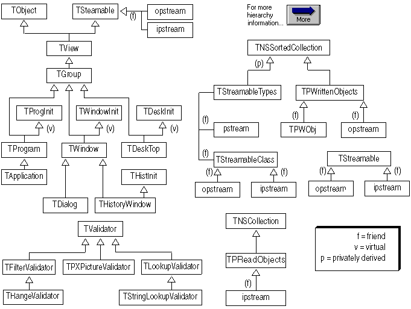

---

<a id="TVFlow_2"></a>

### Turbo Vision Hierarchy (Diagram 2 of 2)

*Keywords: hierarchy diagram, inheritance*

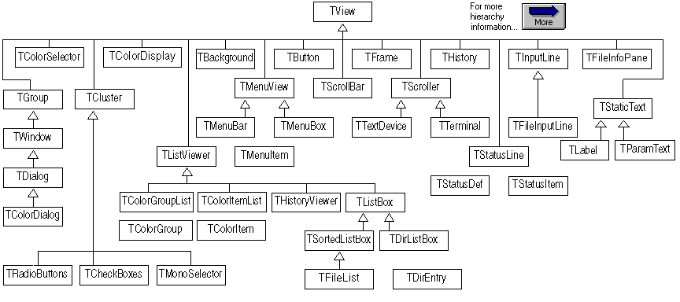

---

<a id="DOSRuntimeLibraries"></a>

### DOS Run-time Libraries

*Keywords: DOS, Libraries, library routines, run-time libraries*


 [See Also](#4MT19BD)	 [Overview](#DOSRuntimeLibrariesOverview)

 The static (OBJ and LIB) 16-bit Borland C++ run-time libraries are contained in the LIB subdirectory of your installation. For each of the library file names, the '?' character represents one of the six (tiny, compact, small, medium, large, and huge) distinct memory models supported by Borland. Each model has its own library file and math file, containing versions of the routines written for that particular model. 

 The following Borland C++ libraries are available for 16-bit DOS-only applications.
	 

| File name | Use |
| --- | --- |
| BIDSH.LIB | Huge memory model of Borland classlibs |
| BIDSDBH.LIB | Diagnostic version of the above library |
| C?.LIB | DOS-only libraries |
| C0F?. | OBJ MS compatible startup |
| C0?.OBJ | BC startup |
| EMU.LIB | Floating-point emulation |
| FP87.LIB | For programs that run on machines with 80x87 coprocessor |
| GRAPHICS.LIB | Borland graphics interface |
| MATH?.LIB | Math routines |
| OVERLAY.LIB | Overlay development |

---

<a id="4MT19BD"></a>

#### See Also
 [BGI Libraries](#BGILibraries)

 [DOS-Only Functions](#DOSOnlyFunctions)[DPMI Libraries](#DPMILibraries)[Global Variables](#DOSGlobalVariables)

 [Graphics Routines (BGI)](#DOSGraphicsRoutines)

 [Interface Routines](#19RMC6N)

 [Memory Routines](#DOSMemoryroutines)

 [Miscellaneous Dos Routines](#MiscellaneousDOSRoutines)

---

<a id="DOSRuntimeLibrariesOverview"></a>

### DOS Run-time Libraries Overview


 The DOS-specific applications use static run-time libraries (OBJ and LIB). These libraries are available only to the 16-bit development tools. Library routines are composed of functions and macros that you can call from within your C and C++ programs to perform a wide variety of tasks. These tasks include low- and high-level I/O, string and file manipulation, memory allocation, process control, data conversion, mathematical calculations, and much more.

 Several versions of the run-time library are available. For example, there are memory-model specific versions and diagnostic versions. There are also optional libraries that provide containers, graphics, and mathematics.

---

<a id="19RMC6N"></a>

### Interface routines

*Keywords: interface, library routines*

| | | | |
| --- | --- | --- | --- |
| [ 0400BX These routines provide operating-system BIOS and machine-specific capabilities for DOS. Function Header Function Header absread](#absread) | (dos.h) | [_dos_keep](#keep) | (dos.h) |
| [abswrite](#abswrite) | (dos.h) | [freemem](#freemem) | (dos.h) |
| [abswrite](#_bios_disk) | (bios.h) | [_harderr](#_harderr) | (dos.h) |
| [_bios_keybrd](#_bios_keybrd) | (bios.h) | [harderr](#harderr) | (dos.h) |
| [_bios_printer](#_bios_printer) | (bios.h) | [hardresume](#harderr) | (dos.h) |
| [_bios_serialcom](#_bios_serialcom) | (bios.h) | [_hardresume](#_hardresume) | (dos.h) |
| [bioscom](#bioscom) | (bios.h) | [hardretn](#harderr) | (dos.h) |
| [biosdisk](#biosdisk) | (bios.h) | [_hardretn](#_hardretn) | (dos.h) |
| [bioskey](#bioskey) | (bios.h) | [keep](#keep) | (dos.h) |
| [biosprint](#biosprint) | (bios.h) | [randbrd](#randbrd) | (dos.h) |
| [_dos_freemem](#freemem) | (dos.h) | [randbwr](#randbwr) | (dos.h) |

---

<a id="DOSMemoryroutines"></a>

### DOS Memory routines

*Keywords: library routines, memory*


| | |
| --- | --- |
| [ 0400BX These routines provide dynamic memory allocation in the small-data and large-data models. Function Header allocmem](#allocmem) | (dos.h) |
| [brk](#brk) | (alloc.h) |
| [coreleft](#coreleft) | (alloc.h, stdlib.h) |
| [_dos_allocmem](#allocmem) | (alloc.h) |
| [_dos_freemem](#freemem) | (alloc.h) |
| [_dos_setblock](#setblock) | (dos.h) |
| [farcoreleft](#farcoreleft) | (alloc.h) |
| [farheapcheck](#farheapcheck) | (alloc.h) |
| [farheapcheckfree](#farheapcheckfree) | (alloc.h) |
| [farheapchecknode](#farheapchecknode) | (dos.h) |
| [farheapfillfree](#farheapfillfree) | (dos.h) |
| [farheapwalk](#farheapwalk) | (alloc.h) |
| [farrealloc](#CSLKZ@bcw.hlp) | (alloc.h) |
| [sbrk](#sbrk) | (alloc.h) |

---

<a id="MiscellaneousDOSRoutines"></a>

### Miscellaneous DOS Routines

*Keywords: library routines, sound, time*

| | |
| --- | --- |
| [ 0400BX These routines provide sound effects and time delay. Function Header delay](#delay) | (dos.h) |
| [sound](#sound) | (dos.h) |
| [nosound](#nosound) | (dos.h) |

---

<a id="DOSGlobalVariables"></a>

### DOS Global Variables

[ 0400BX The following Borland C++ global variables are available for 16-bit DOS-only applications: _heaplen](#_heaplen)

 [_ovrbuffer](#_ovrbuffer)

 [_stklen](#_stklen)

---

<a id="_heaplen"></a>

### _heaplen

*Keywords: _heaplen, data segment, heap, near heap, stack*

[See Also](#CYYMV2)
#### Syntax
```c
#include <dos.h>

 extern unsigned _heaplen;
```
#### Description
 This global variable holds the length of the near heap (Available only for 16-bit DOS applications.)

 _heaplen specifies the size (in bytes) of the near heap in the small data models (tiny, small, and medium). _heaplen does not exist in the large data models (compact, large, and huge), as they do not have a near heap.

 In the small and medium models, the data segment size is computed as follows:

 
```c
 data segment [small,medium] = global data + heap + stack
```
 where the size of the stack can be adjusted with [_stklen.](#_stklen)

 If _heaplen is set to 0, the program allocates 64K bytes for the data segment, and the effective heap size is

 
```c
 64K - (global data + stack) bytes
```
 By default, _heaplen equals 0, so you'll get a 64K data segment unless you specify a particular _heaplen value.

 In the tiny model, everything (including code) is in the same segment, so the data segment computations are adjusted to include the code plus 256 bytes for the program segment prefix (PSP).

 
```c
 data segment[tiny] = 256 + code + global data + heap + stack
```
 If _heaplen equals 0 in the tiny model, the effective heap size is obtained by subtracting the PSP, code, global data, and stack from 64K.

 In the compact and large models, there is no near heap, and the stack is in its own segment, so the data segment is

 
```c
 data segment [compact,large] = global data
```
 In the huge model, the stack is a separate segment, and each module has its own data segment.

---

<a id="CYYMV2"></a>

#### See Also
 [_stklen](#_stklen)

---

<a id="_ovrbuffer"></a>

### _ovrbuffer

*Keywords: _ovrbuffer, buffer, DOS overlays, overlay buffer, overlays, swapping*

[See Also](#1VHZEV)
#### Syntax
```c
#include <dos.h>

 unsigned _ovrbuffer = size;
```
#### Description
 This global variable changes the size of the overlay buffer. (Available only for 16-bit DOS applications.)

 The default overlay buffer size is twice the size of the largest overlay. This is adequate for some applications. Suppose, however, that a particular function of a program is implemented through many modules, each of which is overlaid. If the total size of those modules is larger than the overlay buffer, a substantial amount of swapping will occur if the modules make frequent calls to each other.

 The solution is to increase the size of the overlay buffer so that enough memory is available at any given time to contain all overlays that make frequent calls to each other. You can do this by setting the _ovrbuffer global variable to the required size in paragraphs. For example, to set the overlay buffer to 128K, include the following statement in your code:

 
```c
 unsigned _ovrbuffer = 0x2000;
```
 There is no general formula for determining the ideal overlay buffer size.

---

<a id="1VHZEV"></a>

#### See Also
 [_OvrInitEms](#_OvrInitEms)

 [_OvrInitExt](#_OvrInitExt)

---

<a id="_stklen"></a>

### _stklen

*Keywords: _stklen, program segment prefix, PSP, stack*

[See Also](#7L046M)
#### Syntax
```c
#include <dos.h>

 extern unsigned _stklen;
```
#### Description
 This global variable holds the size of the stack.

 _stklen specifies the size of the stack for all six memory models. The minimum stack size allowed is 128 words; if you give a smaller value, _stklen  is automatically adjusted to the minimum. The default stack size is 4K.

 In the small and medium models, the data segment size is computed as follows:

 
```c
 	 data segment [small,medium] = global data + heap + stack
```
 where the size of the heap can be adjusted with _heaplen.

 In the tiny model, everything (including code) is in the same segment,so the data segment computations are adjusted to include the code plus 256 bytes for the program segment prefix (PSP).

 
```c
 	 data segment[tiny] = 256 + code + global data + heap +stack
```
 In the compact and large models, there is no near heap, and the stackis in its own segment, so the data segment is simply

 
```c
 data segment [compact,large] = global data
```
 In the huge model, the stack is a separate segment, and each modulehas its own data segment.

---

<a id="7L046M"></a>

#### See Also
 [_heaplen](#_heaplen)

---

<a id="DOSOnlyFunctions"></a>

### DOS-Only Functions

*Keywords: DOS, library routines*

| [ 0400BX The following library routines are available only for 16-bit DOS-only applications: absread](#absread) | [_dos_allocmem](#allocmem) | [_hardresume](#_hardresume) |
| --- | --- | --- |
| [abswrite](#abswrite) | [_dos_freemem](#freemem) | [hardretn](#harderr) |
| [allocmem](#allocmem) | [_dos_keep](#keep) | [_hardretn](#_hardretn) |
| [_bios_disk](#_bios_disk) | [_dos_setblock](#setblock) | [keep](#keep) |
| [_bios_keybrd](#_bios_keybrd) | [farcoreleft](#farcoreleft) | [nosound](#nosound) |
| [_bios_printer](#_bios_printer) | [farheapcheck](#farheapcheck) | [_OvrInitEms](#_OvrInitEms) |
| [_bios_serialcom](#_bios_serialcom) | [farheapcheckfree](#farheapcheckfree) | [_OvrInitExt](#_OvrInitExt) |
| [bioscom](#bioscom) | [farheapchecknode](#farheapchecknode) | [randbrd](#randbrd) |
| [biosdisk](#biosdisk) | [farheapfillfree](#farheapfillfree) | [randbwr](#randbwr) |
| [bioskey](#bioskey) | [farheapwalk](#farheapwalk) | [sbrk](#sbrk) |
| [biosprint](#biosprint) | [freemem](#freemem) | [setblock](#setblock) |
| [brk](#brk) | [harderr](#harderr) | [sound](#sound) |
| [coreleft](#coreleft) | [_harderr](#_harderr) |  |
| [delay](#delay) | [hardresume](#harderr) |  |

---

<a id="0400BX"></a>

### Functions And Global Variables

*Keywords: functions, global variables, variables*

Functions And Global Variables

 [Functions](#DOSOnlyFunctions)

 [Global Variables](#DOSGlobalVariables)

 [Interface Routines](#19RMC6N)

 [Memory Routines](#DOSMemoryroutines)

 [Miscellaneous DOS Routines](#MiscellaneousDOSRoutines)

 [Run-time Libraries](#DOSRuntimeLibraries)

---

<a id="DPMILibraries"></a>

### DPMI Libraries

*Keywords: DOS extended, DPMI, extended DOS, Libraries, linking, TLINK, TLINK16, TLINK32*

[See Also](#3KP8BS)

 Several libraries are new and specific to DPMI development. There are versions for both 16-bit and 32-bit DPMI programming:

 [DPMI 32-bit libraries](#DPMI32bitlibraries)

 [DPMI 16-bit libraries](#DPMI16bitlibraries)

 Note:	 Some libraries from the standard Borland C++ package that can also be used in the creation of DOS extended applications.

 Linking a 32-bit DOS Extended Application

 Use the following syntax:

 
```c
 TLINK32 -Tpe -ax -L\BC4\LIB C0X32 FILENAME, FILENAME, , DPMI32 CW32
```
 If you just want to use the compiler to spawn the linker, use the following syntax.

 
```c
 BCC32 -WX FILENAME
```
 Note:	 The 32-bit loader includes a floating-point emulator. There is no need to link a floating-point emulator to your 32-bit applications.

 Linking a 16-bit DOS Extended Application

 Use the following syntax:

 
```c
 TLINK -Txe -L\BC4\LIB C0X FILENAME, FILENAME, , DPMI16 EMUX MATHWL CWL
```
 If you just want to use the compiler to spawn the linker, use the following command-line syntax.

 
```c
 BCC -WX -ml FILENAME
```
 Guidelines

 Keep the following guidelines in mind when linking:

|  | When building a DLL, EMUX.LIB is never linked. |
| --- | --- |
|  | When floating point is off (  -f-), EMUX.LIB and MATHWL.LIB are not linked. |
|  | When emulation is off (  -f87or  -f287), EMUX.LIB is never linked. |
|  | FP87.LIB should not be linked in any DPMI16 target. |

---

<a id="3KP8BS"></a>

#### See Also
 [BGI Libraries](#BGILibraries)

 [DOS Run-time Libraries](#DOSRuntimeLibraries)

---

<a id="DPMI32bitlibraries"></a>

### DPMI 32-bit libraries

*Keywords: 32-bit, DPMI, Libraries*

The following table shows the 32-bit libraries for DPMI, the platform to which they apply, and their uses.

| Library | Application | Use |
| --- | --- | --- |
| BGI32.LIB | DPMI32 | BGI import library |
| BIDSF.LIB | DPMI32, Win32s, Win32 | 32-bit BIDS library |
| BIDSDF.LIB | DPMI32, Win32s, Win32 | 32-bit diagnostic BIDS library |
| BIDSFI.LIB | DPMI32, Win32s, Win32 | 32-bit dynamic BIDS import library for BIDS40F.DLL |
| BIDSDFI.LIB | DPMI32, Win32s, Win32 | 32-bit diagnostic, dynamic BIDS import library for BIDS40DF.DLL |
| BIDS40F.DLL | DPMI32, Win32s, Win32 | 32-bit BIDS |
| BIDS40DF.DLL | DPMI32, Win32s, Win32 | 32-bit diagnostic BIDS |
| C0D32.OBJ | DPMI32, Win32s, Win32 | DLL startup module |
| C0X32.OBJ | DPMI32, Win32 | Console-mode EXE startup module |
| CW32.LIB | DPMI32, Win32s, Win32 | Single-thread static library |
| CW32I.LIB | DPMI32, Win32s, Win32 | Single-thread, dynamic import runtime library for CW32.DLL |
| DPMI32.LIB | DPMI32 | Import library |
| TV32.LIB | DPMI32, Win32 | Turbo Vision library |
| WILDARGS.OBJ | DPMI32, Win32 | Transforms wild-card arguments into an array of arguments to * mainin console-mode applications. |

---

<a id="DPMI16bitlibraries"></a>

### DPMI 16-bit libraries

*Keywords: 16-bit, DPMI, Libraries*

The following table shows the 16 bit libraries dor DPMI, the platform to which they apply, and their uses.

| Library | Application | Use |
| --- | --- | --- |
| BGI16.LIB | DPMI16 | BGI import library |
| BIDSDI.LIB | DPMI16, Win 16 | 16-bit diagnostic, dynamic BIDS import library for BIDS40D.DLL |
| BIDSI.LIB | DPMI16, Win 16 | 16-bit dynamic BIDS import library for BIDS40.DLL |
| BIDSDBL.LIB | DPMI16, Win 16 | 16-bit diagnostic BIDS library |
| BIDSL.LIB | DPMI16, Win 16 | 16-bit BIDS library |
| BIDS40.DLL | DPMI16, Win 16 | 16-bit, BIDS |
| BIDS40D.DLL | DPMI16, Win 16 | 16-bit, diagnostic BIDS |
| C0DL.OBJ | DPMI16, Win16 | Large-model DLL startup module |
| C0X.OBJ | DPMI16 | EXE startup module |
| CWL.LIB | DPMI16, Win16 | Static library |
| CRTLDLL.LIB | DPMI16, Win16 | Dynamic import library for BC40RTL.DLL |
| DPMI16.LIB | DPMI16 | Import library |
| EMUX.LIB | DPMI16 | Math emulator |
| MATHWL.LIB | DPMI16 Win16 | Large memory model math library |
| TV.LIB | DPMI16, DOS | Turbo Vision library |
| WILDARGX.OBJ | DPMI16 | Transforms wild-card arguments into an array of arguments to * mainconsole-mode applications. |

---

<a id="absread"></a>

### absread

*Keywords: absread*

[See Also](#6_PCDK)	 [Example](#absread_ex)	 [Portability](#2D470NB)
#### Syntax
```c
#include <dos.h>

 int absread(int drive, int nsects, long lsect, void *buffer);
```
#### Description
 absread reads specific disk sectors. It ignores the logical structure of a disk and pays no attention to files, FATs, or directories.

 absread uses DOS interrupt 0x25 to read specific disk sectors.

 

| drive | drive number to read (0 = A, 1 = B, etc.) |
| --- | --- |
| nsects | number of sectors to read |
| lsect | beginning logical sector number |
| buffer | memory address where the data is to be read |

 

 The number of sectors to read is limited to 64K or the size of the buffer, whichever is smaller.
#### Return Value
 If it is successful, absread returns 0.

 On error, the routine returns -1 and sets the global variable errno to the value returned by the system call in the AX register.

---

<a id="6_PCDK"></a>

#### See Also
 [abswrite](#abswrite)

 [biosdisk](#biosdisk)

---

<a id="abswrite"></a>

### abswrite

*Keywords: abswrite*

[See Also](#37LK_ZZ)	 [Portability](#2D470NB)
#### Syntax
```c
#include <dos.h>

 int abswrite(int drive, int nsects, long lsect, void *buffer);
```
#### Description
 abswrite writes specific disk sectors. It ignores the logical structure of a disk and pays no attention to files, FATs, or directories.

 If used improperly, abswrite can overwrite files, directories, and FATs.

 abswrite uses DOS interrupt 0x26 to write specific disk sectors.

 

| drive | drive number to write to (0 = A, 1 = B, etc.) |
| --- | --- |
| nsects | number of sectors to write to |
| lsect | beginning logical sector number |
| buffer | memory address where the data is to be written |

 

 The number of sectors to write to is limited to 64K or the size of the buffer, whichever is smaller.
#### Return Value
 If it is successful, abswrite returns 0.

 On error, the routine returns -1 and sets the global variable errno to the value of the AX register returned by the system call.

---

<a id="37LK_ZZ"></a>

#### See Also
 [absread](#absread)

 [biosdisk](#biosdisk)

---

<a id="allocmem"></a>

### allocmem, _dos_allocmem

*Keywords: _dos_allocmem, allocmem*

[See Also](#4I9U_AB)	 [Example](#_dos_allocmem_ex)	 [Portability](#2D470NB)
#### Syntax
```c
#include <dos.h>

 int allocmem(unsigned size, unsigned *segp);

 unsigned _dos_allocmem(unsigned size, unsigned *segp);
```
#### Description
 allocmem and _dos_allocmem use the DOS system call 0x48 to allocate a block of free memory and return the segment address of the allocated block.

 size is the desired size in paragraphs (a paragraph is 16 bytes). segp is a pointer to a word that will be assigned the segment address of the newly allocated block.

 For allocmem, if not enough room is available, no assignment is made to the word pointed to by segp.

 For _dos_allocmem, if not enough room is available, the size of the largest available block will be stored in the word pointed to by segp.

 All allocated blocks are paragraph-aligned.

 allocmem and _dos_allocmem cannot coexist with malloc.
#### Return Value
 allocmem returns -1 on success. In the event of error, allocmem returns a number indicating the size in paragraphs of the largest available block.

 _dos_allocmem returns 0 on success. In the event of error, _dos_allocmem returns the DOS error code and sets the word pointed to by segp to the size in paragraphs of the largest available block.

 An error return from allocmem or _dos_allocmem sets the global variable _doserrno and sets the global variable errno to

 ENOMEM	 Not enough memory

---

<a id="4I9U_AB"></a>

#### See Also
 [coreleft](#coreleft)

 [freemem](#freemem)

 [malloc](#MALLOC@bcw.hlp) (in BCW Help)

 [setblock](#setblock)

---

<a id="bioscom"></a>

### bioscom

*Keywords: bioscom*

[Example](#bioscom_ex)	 [Portability](#2D470NB)
#### Syntax
```c
#include <bios.h>

 int bioscom(int cmd, char abyte, int port);
```
#### Description
 bioscom performs various RS-232 communications over the I/O port given in port.

 A port value of 0 corresponds to COM1, 1 corresponds to COM2, and so forth.

 The value of cmd can be one of the following:

 Value	 Meaning

 

| 0 | Sets the communications parameters to the value in  abyte. |
| --- | --- |
| 1 | Sends the character in abyte out over the communications line. |
| 2 | Receives a character from the communications line. |
| 3 | Returns the current status of the communications port. |

 

 abyteis a combination of the following bits (one value is selected from each of the groups):

| 0x02 | 7 data bits | 0x00 | 110 baud |
| --- | --- | --- | --- |
| 0x03 | 8 data bits | 0x20 | 150 baud |
|  |  | 0x40 | 300 baud |
| 0x00 | 1 stop bit | 0x60 | 600 baud |
| 0x04 | 2 stop bits | 0x80 | 1200 baud |
| 0x00 | No parity | 0xA0 | 2400 baud |
| 0x08 | Odd parity | 0xC0 | 4800 baud |
| 0x18 | Even parity | 0xE0 | 9600 baud |

 For example, a value of 0xEB (0xE0|0x08|0x00|0x03) for  abytesets the communications port to 9600 baud, odd parity, 1 stop bit, and 8 data bits. bioscom uses the BIOS 0x14 interrupt.
#### Return Value
 For all values of cmd, bioscom returns a 16-bit integer, of which the upper 8 bits are status bits and the lower 8 bits vary, depending on the value of cmd. The upper bits of the return value are defined as follows:

| Bit 15 | Time out |
| --- | --- |
| Bit 14 | Transmit shift register empty |
| Bit 13 | Transmit holding register empty |
| Bit 12 | Break detect |
| Bit 11 | Framing error |
| Bit 10 | Parity error |
| Bit 9 | Overrun error |
| Bit 8 | Data ready |

 If the abyte value could not be sent, bit 15 is set to 1. Otherwise, the remaining upper and lower bits are appropriately set. For example, if a framing error has occurred, bit 11 is set to 1.

 With a cmd value of 2, the byte read is in the lower bits of the return value if there is no error. If an error occurs, at least one of the upper bits is set to 1. If no upper bits are set to 1, the byte was received without error.

 With a cmd value of 0 or 3, the return value has the upper bits set as defined, and the lower bits are defined as follows:

| Bit 7 | Received line signal detect |
| --- | --- |
| Bit 6 | Ring indicator |
| Bit 5 | Data set ready |
| Bit 4 | Clear to send |
| Bit 3 | Change in receive line signal detector |
| Bit 2 | Trailing edge ring detector |
| Bit 1 | Change in data set ready |
| Bit 0 | Change in clear to send |

---

<a id="biosdisk"></a>

### biosdisk

*Keywords: biosdisk*

[See Also](#15EL7LY)	 [Example](#biosdisk_ex)	 [Portability](#2D470NB)
#### Syntax
```c
#include <bios.h>

 int biosdisk(int cmd, int drive, int head, int track, int sector, int nsects, void *buffer);
```
#### Description
 biosdisk uses interrupt 0x13 to issue disk operations directly to the BIOS.

 drive is a number that specifies which disk drive is to be used: 0 for the first floppy disk drive, 1 for the second floppy disk drive, 2 for the third, and so on. For hard disk drives, a drive value of 0x80 specifies the first drive, 0x81 specifies the second, 0x82 the third, and so forth.

 For hard disks, the physical drive is specified, not the disk partition. If necessary, the application program must interpret the partition table information itself.

 cmd indicates the operation to perform. Depending on the value of cmd, the other parameters may or may not be needed.

 Here are the possible values for cmd for the IBM PC, XT, AT, or PS/2, or any compatible system:

| 0 | Resets disk system, forcing the drive controller to do a hard reset. All other parameters are ignored. |
| --- | --- |
| 1 | Returns the status of the last disk operation. All other parameters are ignored. |
| 2 | Reads one or more disk sectors into memory. The starting sector to read is given by head, track, and sector. The number of sectors is given by nsects. The data is read, 512 bytes per sector, into buffer. |
| 3 | Writes one or more disk sectors from memory. The starting sector to write is given by head, track, and sector. The number of sectors is given by nsects. The data is written, 512 bytes per sector, from buffer. |
| 4 | Verifies one or more sectors. The starting sector is given by head, track, and sector. The number of sectors is given by nsects. |
| 5 | Formats a track. The track is specified by head and track. buffer points to a table of sector headers to be written on the named track. See the Technical Reference Manual for the IBM PC for a description of this table and the format operation. |

 The following cmd values are allowed only for the XT, AT, PS/2, and compatibles:

| 6 | Formats a track and sets bad sector flags. |
| --- | --- |
| 7 | Formats the drive beginning at a specific track. |
| 8 | Returns the current drive parameters. The drive information is returned in buffer in the first 4 bytes. |
| 9 | Initializes drive-pair characteristics. |
| 10 | Does a long read, which reads 512 plus 4 extra bytes per sector. |
| 11 | Does a long write, which writes 512 plus 4 extra bytes per sector. |
| 12 | Does a disk seek. |
| 13 | Alternates disk reset. |
| 14 | Reads sector buffer. |
| 15 | Writes sector buffer. |
| 16 | Tests whether the named drive is ready. |
| 17 | Recalibrates the drive. |
| 18 | Controller RAM diagnostic. |
| 19 | Drive diagnostic. |
| 20 | Controller internal diagnostic. |

 biosdisk operates below the level of files on raw sectors. It can destroy file contents and directories on a hard disk.
#### Return Value
 biosdisk returns a status byte composed of the following bits:

| 0x00 | Operation successful. |
| --- | --- |
| 0x01 | Bad command. |
| 0x02 | Address mark not found. |
| 0x03 | Attempt to write to write-protected disk. |
| 0x04 | Sector not found. |
| 0x05 | Reset failed (hard disk). |
| 0x06 | Disk changed since last operation. |
| 0x07 | Drive parameter activity failed. |
| 0x08 | Direct memory access (DMA) overrun. |
| 0x09 | Attempt to perform DMA across 64K boundary. |
| 0x0A | Bad sector detected. |
| 0x0B | Bad track detected. |
| 0x0C | Unsupported track. |
| 0x10 | Bad CRC/ECC on disk read. |
| 0x11 | CRC/ECC corrected data error. |
| 0x20 | Controller has failed. |
| 0x40 | Seek operation failed. |
| 0x80 | Attachment failed to respond. |
| 0xAA | Drive not ready (hard disk only). |
| 0xBB | Undefined error occurred (hard disk only). |
| 0xCC | Write fault occurred. |
| 0xE0 | Status error. |
| 0xFF | Sense operation failed. |
| 0x11 | is not an error because the data is correct. The value is returned to give the application an opportunity to decide for itself. |

---

<a id="15EL7LY"></a>

#### See Also
 [absread](#absread)

 [abswrite](#abswrite)

---

<a id="_bios_disk"></a>

### _bios_disk

*Keywords: _bios_disk*

[See Also](#2L6SB2)	 [Example](#_bios_disk_ex)	 [Portability](#2D470NB)
#### Syntax
```c
#include <bios.h>

 unsigned _bios_disk(unsigned cmd, struct diskinfo_t *dinfo);
```
#### Description
 _bios_disk uses interrupt 0x13 to issue disk operations directly to the BIOS. The cmd argument specifies the operation to perform, and dinfo points to a diskinfo_t structure that contains the remaining parameters required by the operation.

 The diskinfo_t structure (defined in bios.h) has the following format:

 
```c
 struct diskinfo_t \-

     unsigned drive, head, track, sector, nsectors;

     void far *buffer;

 ;
```
 driveis a number that specifies which disk drive is to be used: 0 for the first floppy disk drive, 1 for the second floppy disk drive, 2 for the third, and so on. For hard disk drives, a drive value of 0x80 specifies the first drive, 0x81 specifies the second, 0x82 the third, and so forth.

 For hard disks, the physical drive is specified, not the disk partition. If necessary, the application program must interpret the partition table information itself.

 Depending on the value of cmd, the other parameters in the  diskinfo_tstructure may or may not be needed.

 The possible values for cmd (defined in bios.h) are the following:

| _DISK_RESET | Resets disk system, forcing the drive controller to do a hard reset. All diskinfo_t parameters are ignored. |  |
| --- | --- | --- |
| _DISK_STATUS | Returns the status of the last disk operation. All diskinfo_t parameters are ignored. |  |
| _DISK_READ | Reads one or more disk sectors into memory. The starting sector to read is given by head, track, and sector. The number of sectors is given by nsectors. The data is read, 512 bytes per sector, into buffer. If the operation is successful, the high byte of the return value will be 0 and the low byte will contain the number of sectors. If an error occurred, the high byte of the return value will have one of the following values: |  |
|  | 0x01 | Bad command. |
|  | 0x02 | Address mark not found. |
|  | 0x03 | Attempt to write to write-protected disk. |
|  | 0x04 | Sector not found. |
|  | 0x05 | Reset failed (hard disk). |
|  | 0x06 | Disk changed since last operation. |
|  | 0x07 | Drive parameter activity failed. |
|  | 0x08 | Direct memory access (DMA) overrun. |
|  | 0x09 | Attempt to perform DMA across 64K boundary. |
|  | 0x0A | Bad sector detected. |
|  | 0x0B | Bad track detected. |
|  | 0x0C | Unsupported track. |
|  | 0x10 | Bad CRC/ECC on disk read. |
|  | 0x11 | CRC/ECC corrected data error. |
|  | 0x20 | Controller has failed. |
|  | 0x40 | Seek operation failed. |
|  | 0x80 | Attachment failed to respond. |
|  | 0xAA | Drive not ready (hard disk only). |
|  | 0xBB | Undefined error occurred (hard disk only). |
|  | 0xCC | Write fault occurred. |
|  | 0xE0 | Status error. |
|  | 0xFF | Sense operation failed. |
|  | 0x11 | is not an error because the data is correct. The value is returned to give the application an opportunity to decide for itself. |
| _DISK_WRITE | Writes one or more disk sectors from memory. The starting sector to write is given by head, track, and sector. The number of sectors is given by nsectors. The data is written, 512 bytes per sector, from buffer. See _DISK_READ (above) for a description of the return value. |  |
| _DISK_VERIFY | Verifies one or more sectors. The starting sector is given by head, track, and sector. The number of sectors is given by nsectors. See _DISK_READ (above) for a description of the return value. |  |
| _DISK_FORMAT | Formats a track. The track is specified by head and track. buffer points to a table of sector headers to be written on the named track. See the Technical Reference Manual for the IBM PC for a description of this table and the format operation. |  |
#### Return Value
 _bios_disk returns the value of the AX register set by the INT 0x13 BIOS call.

---

<a id="2L6SB2"></a>

#### See Also
 [absread](#absread)

 [abswrite](#abswrite)

 [biosdisk](#biosdisk)

---

<a id="bioskey"></a>

### bioskey

*Keywords: bioskey*

[Example](#bioskey_ex)	 [Portability](#2D470NB)
#### Syntax
```c
#include <bios.h>

 int bioskey(int cmd);
```
#### Description
 bioskey performs various keyboard operations using BIOS interrupt 0x16. The parameter cmd determines the exact operation.
#### Return Value
 The value returned by bioskey depends on the task it performs, determined by the value of cmd:

| 0 | If the lower 8 bits are nonzero, bioskey returns the ASCII character for the next keystroke waiting in the queue or the next key pressed at the keyboard. If the lower 8 bits are zero, the upper 8 bits are the extended keyboard codes defined in the  IBM PC Technical Reference Manual. |  |
| --- | --- | --- |
| 1 | This tests whether a keystroke is available to be read. A return value of zero means no key is available. The return value is 0xFFFFF (-1) if Ctrl-Brk has been pressed. Otherwise, the value of the next keystroke is returned. The keystroke itself is kept to be returned by the next call to bioskey that has a cmd value of zero. |  |
| 2 | Requests the current shift key status. The value is obtained by ORing the following values together: |  |
| Bit 7 | 0x80 | Insert on |
| Bit 6 | 0x40 | Caps on |
| Bit 5 | 0x20 | Num Lock on |
| Bit 4 | 0x10 | Scroll Lock on |
| Bit 3 | 0x08 | Alt pressed |
| Bit 2 | 0x04 | Ctrl pressed |
| Bit 1 | 0x02 | Left arrow + Shift pressed |
| Bit 0 | 0x01 | Right arrow + Shift pressed |

---

<a id="biosprint"></a>

### biosprint

*Keywords: biosprint*

[Example](#biosprint_ex)	 [Portability](#2D470NB)
#### Syntax
```c
#include <bios.h>

 int biosprint(int cmd, int abyte, int port);
```
#### Description
 biosprint performs various printer functions on the printer identified by the parameter port using BIOS interrupt 0x17.

 A port value of 0 corresponds to LPT1; a port value of 1 corresponds to LPT2; and so on.

 The value of cmd can be one of the following:

| 0 | Prints the character in abyte. |
| --- | --- |
| 1 | Initializes the printer port. |
| 2 | Reads the printer status. |

 The value of abyte can be 0 to 255.
#### Return Value
 The value returned from any of these operations is the current printer status, which is obtained by ORing these bit values together:

| Bit 0 | 0x01 | Device time out |
| --- | --- | --- |
| Bit 3 | 0x08 | I/O error |
| Bit 4 | 0x10 | Selected |
| Bit 5 | 0x20 | Out of paper |
| Bit 6 | 0x40 | Acknowledge |
| Bit 7 | 0x80 | Not busy |

---

<a id="_bios_printer"></a>

### _bios_printer

*Keywords: _bios_printer*

[Example](#_bios_printer_ex)	 [Portability](#2D470NB)
#### Syntax
```c
#include <bios.h>

 unsigned _bios_printer(int cmd, int port, int abyte);
```
#### Description
 _bios_printer performs various printer functions on the printer identified by the parameter port using BIOS interrupt 0x17.

 A port value of 0 corresponds to LPT1; a port value of 1 corresponds to LPT2; and so on.

 The value of cmd can be one of the following values (defined in bios.h):

| _PRINTER_WRITE | Prints the character in abyte. The value of abyte can be 0 to 255. |
| --- | --- |
| _PRINTER_INIT | Initializes the printer port. The abyte argument is ignored. |
| _PRINTER_STATUS | Reads the printer status. The abyte argument is ignored. |
#### Return Value
 The value returned from any of these operations is the current printer status, which is obtained by ORing these bit values together:

| Bit 0 | 0x01 | Device time out |
| --- | --- | --- |
| Bit 3 | 0x08 | I/O error |
| Bit 4 | 0x10 | Selected |
| Bit 5 | 0x20 | Out of paper |
| Bit 6 | 0x40 | Acknowledge |
| Bit 7 | 0x80 | Not busy |

---

<a id="_bios_keybrd"></a>

### _bios_keybrd

*Keywords: _bios_keybrd*

[Example](#_bios_keybrd_ex)	 [Portability](#2D470NB)
#### Syntax
```c
#include <bios.h>

 unsigned _bios_keybrd(unsigned cmd);
```
#### Description
 _bios_keybrd performs various keyboard operations using BIOS interrupt 0x16. The parameter cmd determines the exact operation.
#### Return Value
 The value returned by _bios_keybrd depends on the task it performs, determined by the value of cmd (defined in bios.h):

| _KEYBRD_READ | If the lower 8 bits are nonzero, _bios_keybrd returns the ASCII character for the next keystroke waiting in the queue or the next key pressed at the keyboard. If the lower 8 bits are zero, the upper 8 bits are the extended keyboard codes defined in the IBM PC Technical Reference Manual. |  |  |
| --- | --- | --- | --- |
| _NKEYBRD_READ | Use this value instead of _KEYBRD_READY to read the keyboard codes for enhanced keyboards, which have additional cursor and function keys. |  |  |
| _KEYBRD_READY | This tests whether a keystroke is available to be read. A return value of zero means no key is available. The return value is 0xFFFF (-1) if Ctrl-Brk has been pressed. Otherwise, the value of the next keystroke is returned, as described in _KEYBRD_READ (above). The keystroke itself is kept to be returned by the next call to _bios_keybrd that has a cmd value of _KEYBRD_READ or _NKEYBRD_READ |  |  |
| _NKEYBRD_READY | Use this value to check the status of enhanced keyboards, which have additional cursor and function keys. |  |  |
| _KEYBRD_SHIFTSTATUS | Requests the current shift key status. The value will contain an OR of zero or more of the following values: |  |  |
|  | Bit 7 | 0x80 | Insert on |
|  | Bit 6 | 0x40 | Caps on |
|  | Bit 5 | 0x20 | Num Lock on |
|  | Bit 4 | 0x10 | Scroll Lock on |
|  | Bit 3 | 0x08 | Alt pressed |
|  | Bit 2 | 0x04 | Ctrl pressed |
|  | Bit 1 | 0x02 | Left Shift pressed |
|  | Bit 0 | 0x01 | Right Shift pressed |
| _NKEYBRD_SHIFTSTATUS | Use this value instead of _KEYBRD_SHIFTSTATUS to request the full 16-bit shift key status for enhanced keyboards. The return value will contain an OR of zero or more of the bits defined above in _KEYBRD_SHIFTSTATUS, and additionally, any of the following bits: |  |  |
|  | Bit 15 | 0x8000 | Sys Req pressed |
|  | Bit 14 | 0x4000 | Caps Lock pressed |
|  | Bit 13 | 0x2000 | Num Lock pressed |
|  | Bit 12 | 0x1000 | Scroll Lock pressed |
|  | Bit 11 | 0x0800 | Right Alt pressed |
|  | Bit 10 | 0x0400 | Right Ctrl pressed |
|  | Bit 9 | 0x0200 | Left Alt pressed |
|  | Bit 8 | 0x0100 | Left Ctrl pressed |

---

<a id="_bios_serialcom"></a>

### _bios_serialcom

*Keywords: _bios_serialcom*

[Examples](#11BGZIK)	 [Portability](#2D470NB)
#### Syntax
```c
#include <bios.h>

 unsigned _bios_serialcom(int cmd, int port, char abyte);
```
#### Description
 _bios_serialcom performs various RS-232 communications over the I/O port given in port.

 A port value of 0 corresponds to COM1, 1 corresponds to COM2, and so forth.

 The value of cmd can be one of the following values (defined in bios.h):

| _COM_INIT | Sets the communications parameters to the value in abyte. |
| --- | --- |
| _COM_SEND | Sends the character in abyte out over the communications line. |
| _COM_RECEIVE | Receives a character from the communications line. The abyte argument is ignored. |
| _COM_STATUS | Returns the current status of the communications port. The abyte argument is ignored. |

 When cmd is _COM_INIT, abyte is a OR combination of the following bits:

 Select only one of these:

| _COM_CHR7 | 7 data bits |
| --- | --- |
| _COM_CHR8 | 8 data bits |

 Select only one of these:

| _COM_STOP1 | 1 stop bit |
| --- | --- |
| _COM_STOP2 | 2 stop bits |

 Select only one of these:

| _COM_NOPARITY | No parity |
| --- | --- |
| _COM_ODDPARITY | Odd parity |
| _COM_EVENPARITY | Even parity |

 Select only one of these:

| _COM_110 | 110 baud |
| --- | --- |
| _COM_150 | 150 baud |
| _COM_300 | 300 baud |
| _COM_600 | 600 baud |
| _COM_1200 | 1200 baud |
| _COM_2400 | 2400 baud |
| _COM_4800 | 4800 baud |
| _COM_9600 | 9600 baud |

 For example, a value of ( _COM_9600 | _COM_ODDPARITY | _COM_STOP1 |_COM_CHR8 ) for abyte sets thecommunicationsportto9600 baud,oddparity,1 stop bit, and 8 data bits. _bios_serialcom uses the BIOS 0x14 interrupt.

 For all values of cmd, _bios_serialcom returns a 16-bit integer of which the upper 8 bits are status bits and the lower 8 bits vary, depending on the value of cmd. The upper bits of the return value are defined as follows:

| Bit 15 | Time out |
| --- | --- |
| Bit 14 | Transmit shift register empty |
| Bit 13 | Transmit holding register empty |
| Bit 12 | Break detect |
| Bit 11 | Framing error |
| Bit 10 | Parity error |
| Bit | 9 Overrun error |
| Bit | 8 Data ready |

 If the abyte value could not be sent, bit 15 is set to 1. Otherwise, the remaining upper and lower bits are appropriately set. For example, if a framing error has occurred, bit 11 is set to 1.

  With a cmd value of _COM_RECEIVE, the byte read is in the lower bits of the return value if there is no error. If an error occurs, at least one of the upper bits is set to 1. If no upper bits are set to 1, the byte was received without error. With a cmd value of _COM_INIT or COM_STATUS, the return value has the upper bits set as defined, and the lower bits are defined as follows:

| Bit 7 | Received line signal detect |
| --- | --- |
| Bit 6 | Ring indicator |
| Bit 5 | Data set ready |
| Bit 4 | Clear to send |
| Bit 3 | Change in receive line signal detector |
| Bit 2 | Trailing edge ring detector |
| Bit 1 | Change in data set ready |
| Bit 0 | Change in clear to send |

---

<a id="11BGZIK"></a>

Examples

 [Using COM1](#_bios_serialcom_ex1)

 [Using COM2](#_bios_serialcom_ex2)

---

<a id="brk"></a>

### brk

*Keywords: brk*

[See Also](#18LLM1O)	 [Example](#brk_ex)	 [Portability](#1X0EPX3)
#### Syntax
```c
#include <alloc.h>

 int brk(void *addr);
```
#### Description
 brk dynamically changes the amount of space allocated to the calling program's heap. The change is made by resetting the program's break value, which is the address of the first location beyond the end of the data segment. The amount of allocated space increases as the break value increases.

 brk sets the break value to addr and changes the allocated space accordingly.

 This function will fail without making any change in the allocated space if such a change would allocate more space than is allowable.
#### Return Value
 Upon successful completion, brk returns a value of 0. On failure, this function returns a value of -1 and the global variable errno is set to

 ENOMEM	 Not enough memory

---

<a id="18LLM1O"></a>

#### See Also
 [coreleft](#coreleft)

 [sbrk](#sbrk)

---

<a id="coreleft"></a>

### coreleft

*Keywords: coreleft*

[See Also](#1GPIP.)	 [Example](#coreleft_ex)	 [Portability](#2D470NB)
#### Syntax
```c
#include <alloc.h>
```
 In the tiny, small, and medium models:

 
```c
 unsigned coreleft(void);
```
 In the compact, large, and huge models:

 
```c
 unsigned long coreleft(void);
```
#### Description
 coreleft returns a measure of RAM memory not in use. It gives a different measurement value, depending on whether the memory model is of the small data group or the large data group.
#### Return Value
 In the small data models, coreleft returns the amount of unused memory between the top of the heap and the stack. In the large data models, coreleft returns the amount of memory between the highest allocated block and the end of available memory.

---

<a id="1GPIP."></a>

#### See Also
 [allocmem](#allocmem)

 [brk](#brk)

 [farcoreleft](#farcoreleft)

 [malloc](#MALLOC@bcw.hlp) (in BCW Help)

---

<a id="delay"></a>

### delay

*Keywords: delay*

[See Also](#125U7EG)	 [Example](#delay_ex)	 [Portability](#2D470NB)
#### Syntax
```c
#include <dos.h>

 void delay(unsigned milliseconds);
```
#### Description
 With a call to delay, the current program is suspended from execution for the number of milliseconds specified by the argument milliseconds. It is no longer necessary to make a calibration call to delay before using it. delay is accurate to a millisecond.
#### Return Value
 None.

---

<a id="125U7EG"></a>

#### See Also
 [nosound](#nosound)

 [sleep](#SLEEP@bcw.hlp) (in BCW Help)

 [sound](#sound)

---

<a id="farcoreleft"></a>

### farcoreleft

*Keywords: farcoreleft*

[See Also](#1P0D3UA)	 [Example](#farcoreleft_ex)	 [Portability](#2D470NB)
#### Syntax
```c
#include <alloc.h>

 unsigned long farcoreleft(void);
```
#### Description
 farcoreleft returns a measure of the amount of unused memory in the far heap beyond the highest allocated block.

 A tiny model program cannot make use of farcoreleft.
#### Return Value
 farcoreleft returns the total amount of space left in the far heap, between the highest allocated block and the end of available memory.

---

<a id="1P0D3UA"></a>

#### See Also
 [coreleft](#coreleft)

 [farcalloc](#18EU6MK@bcw.hlp) (in BCW Help)

 [farmalloc](#33_7IV@bcw.hlp) (in BCW Help)

---

<a id="farheapcheck"></a>

### farheapcheck

*Keywords: farheapcheck*

[See Also](#W02W_W)	 [Example](#farheapcheck_ex)	 [Portability](#2D470NB)
#### Syntax
```c
#include <alloc.h>

 int farheapcheck(void);
```
#### Description
 farheapcheck walks through the far heap and examines each block, checking its pointers, size, and other critical attributes.
#### Return Value
 The return value is less than zero for an error and greater than zero for success.

 _HEAPEMPTY is returned if there is no heap (value 1).

 _HEAPOK is returned if the heap is verified (value 2).

 _HEAPCORRUPT is returned if the heap has been corrupted (value -1).

---

<a id="W02W_W"></a>

#### See Also
 [heapcheck](#OJ.8D_@bcw.hlp) (in BCW Help)

---

<a id="farheapcheckfree"></a>

### farheapcheckfree

*Keywords: farheapcheckfree*

[See Also](#1NPXLTO)	 [Example](#farheapcheckfree_ex)	 [Portability](#2D470NB)
#### Syntax
```c
#include <alloc.h>

 int farheapcheckfree(unsigned int fillvalue);
```
#### Return Value
 The return value is less than zero for an error and greater than zero for success.

 _HEAPEMPTY is returned if there is no heap (value 1).

 _HEAPOK is returned if the heap is accurate (value 2).

 _HEAPCORRUPT is returned if the heap has been corrupted (value -1).

 _BADVALUE is returned if a value other than the fill value was found (value -3).

---

<a id="1NPXLTO"></a>

#### See Also
 [farheapfillfree](#farheapfillfree)

 [heapcheckfree](#0XHCCJ@bcw.hlp) (in BCW Help)

---

<a id="farheapchecknode"></a>

### farheapchecknode

*Keywords: farheapchecknode*

[See Also](#A86_YW)	 [Example](#farheapchecknode_ex)	 [Portability](#2D470NB)
#### Syntax
```c
#include <alloc.h>

 int farheapchecknode(void *node);
```
#### Description
 If a node has been freed and farheapchecknode is called with a pointer to the freed block, farheapchecknode can return _BADNODE rather than the expected _FREEENTRY. This is because adjacent free blocks on the heap are merged, and the block in question no longer exists.
#### Return Value
 The return value is less than zero for an error and greater than zero for success.

 _HEAPEMPTY is returned if there is no heap (value 1).

 _HEAPCORRUPT is returned if the heap has been corrupted (value -1).

 _BADNODE is returned if the node could not be found (value -2).

 _FREEENTRY is returned if the node is a free block (value 3).

 _USEDENTRY is returned if the node is a used block (value 4).

---

<a id="A86_YW"></a>

#### See Also
 [heapchecknode](#5MLZ.QI@bcw.hlp) (in BCW Help)

---

<a id="farheapfillfree"></a>

### farheapfillfree

*Keywords: farheapfillfree*

[See Also](#2OEC_IV)	 [Example](#farheapfillfree_ex)	 [Portability](#2D470NB)
#### Syntax
```c
#include <alloc.h>

 int farheapfillfree(unsigned int fillvalue);
```
#### Return Value
 The return value is less than zero for an error and greater than zero for success.

 _HEAPEMPTY is returned if there is no heap (value 1).

 _HEAPOK is returned if the heap is accurate (value 2).

 _HEAPCORRUPT is returned if the heap has been corrupted (value -1).

---

<a id="2OEC_IV"></a>

#### See Also
 [farheapcheckfree](#farheapcheckfree)

 [heapfillfree](#3331ZG0@bcw.hlp) (in BCW Help)

---

<a id="farheapwalk"></a>

### farheapwalk

*Keywords: farheapwalk*

[See Also](#1WC1KIK)	 [Example](#farheapwalk_ex)	 [Portability](#2D470NB)
#### Syntax
```c
#include <alloc.h>

 int farheapwalk(struct farheapinfo *hi);
```
#### Description
 farheapwalk assumes the heap is correct. Use farheapcheck to verify the heap before using farheapwalk. _HEAPOK is returned with the last block on the heap. _HEAPEND will be returned on the next call to farheapwalk.

 farheapwalk receives a pointer to a structure of type heapinfo (defined in alloc.h). For the first call to farheapwalk, set the hi.ptr field to null. farheapwalk returns with hi.ptr containing the address of the first  block. hi.size holds the size of the block in bytes. hi.in_use is a flag that is set if the block is currently in use.
#### Return Value
 _HEAPEMPTY is returned if there is no heap (value 1).

 _HEAPOK is returned if the heapinfo block contains valid data (value 2).

 _HEAPEND is returned if the end of the heap has been reached (value 5).

---

<a id="1WC1KIK"></a>

#### See Also
 [heapwalk](#..OU7V@bcw.hlp) (in BCW Help)

---

<a id="_dos_freemem"></a>

### freemem, _dos_freemem

*Keywords: _dos_freemem, freemem*

[See Also](#Y2_DZH)	 [Example](#_dos_freemem_ex)	 [Portability](#2D470NB)
#### Syntax
```c
#include <dos.h>

 int freemem(unsigned segx);

 unsigned _dos_freemem(unsigned segx);
```
#### Description
 freemem frees a memory block allocated by a previous call to allocmem. _dos_freemem frees a memory block allocated by a previous call to _dos_allocmem. segx is the segment address of that block.
#### Return Value
 freemem and _dos_freemem return 0 on success.

 In the event of error, freemem returns -1 and sets errno.

 In the event of error, _dos_freemem returns the DOS error code and sets errno.

 In the event of error, these functions set global variable errno to

 ENOMEM	 Insufficient memory

---

<a id="Y2_DZH"></a>

#### See Also
 [allocmem](#allocmem)

 [_dos_allocmem](#allocmem)

 [free](#FREE@bcw.hlp) (in BCW Help)

---

<a id="harderr"></a>

### harderr, hardresume, hardretn

*Keywords: harderr, hardresume, hardretn*

[See Also](#110FBLM)	 [Example](#hardretn_ex)	 [Portability](#2D470NB)
#### Syntax
```c
#include <dos.h>

 void harderr(int (*handler)());

 void hardresume(int axret);

 void hardretn(int retn);
```
#### Description
 The error handler established by harderr can call hardresume to return to DOS. The return value of the rescode (result code) of hardresume contains an abort (2), retry (1), or ignore (0) indicator. The abort is accomplished by invoking DOS interrupt 0x23, the control-break interrupt.

 The error handler established by harderr can return directly to the application program by calling hardretn. The returned value is whatever value you passed to hardretn.

 harderr establishes a hardware error handler for the current program. This error handler is invoked whenever an interrupt 0x24 occurs. (See your DOS reference manuals for a discussion of the interrupt.)

 The function pointed to by handler is called when such an interrupt occurs. The handler function is called with the following arguments:

 
```c
 handler(int errval, int ax, int bp, int si);
```
 errval is the error code set in the DI register by DOS. ax, bp, and si are the values DOS sets for the AX, BP, and SI registers, respectively.

|  | ax indicates whether a disk error or other device error was encountered. If ax is nonnegative, a disk error was encountered; otherwise, the error was a device error. For a disk error, ax ANDed with 0x00FF gives the failing drive number (0 equals A, 1 equals B, and so on). |
| --- | --- |
|  | bp and si together point to the device driver header of the failing driver. bp contains the segment address, and si the offset. |

 The function pointed to by handler is not called directly. harderr establishes a DOS interrupt handler that calls the function.

 The handler can issue DOS calls 1 through 0xC; any other DOS call corrupts DOS. In particular, any of the C standard I/O or UNIX-emulation I/O calls cannot be used.

 The handler must return 0 for ignore, 1 for retry, and 2 for abort.
#### Return Value
 None.

---

<a id="110FBLM"></a>

#### See Also
 [peek](#PEEK@bcw.hlp) (in BCW Help)

 [poke](#POKE@bcw.hlp) (in BCW Help)

---

<a id="_harderr"></a>

### _harderr

*Keywords: _harderr*

[See Also](#PDGW_S)	 [Example](#_harderr_ex)	 [Portability](#2D470NB)
#### Syntax
```c
#include <dos.h>

 void _harderr(int (far *handler)());
```
#### Description
 _harderr establishes a hardware error handler for the current program. This error handler is invoked whenever an interrupt 0x24 occurs. (See your DOS reference manuals for a discussion of the interrupt.)

 The function pointed to by handler is called when such an interrupt occurs. The handler function is called with the following arguments:

 void far handler(unsigned deverr, unsigned errval, unsigned far *devhdr);

|  | deverr is the device error code (passed to the handler by DOS in the AX register). |
| --- | --- |
|  | errval is the error code (passed to the handler by DOS in the DI register). |
|  | devhdr a far pointer to the driver header of the device that caused the error (passed to the handler by DOS in the BP:SI register pair). |

 The handler should use these arguments instead of referring directly to the CPU registers.

 deverr indicates whether a disk error or other device error was encountered. If bit 15 of deverr is 0, a disk error was encountered. Otherwise, the error was a device error. For a disk error, deverr ANDed with 0x00FF give the failing drive number (0 equals A, 1 equals B, and so on).

 The function pointed to by handler is not called directly. _harderr establishes a DOS interrupt handler that calls the function.

 The handler can issue DOS calls 1 through 0xC; any other DOS call corrupts DOS. In particular, any of the C standard I/O or UNIX-emulation I/O calls cannot be used.

 The handler does not return a value, and it must exit using _hardretn or _hardresume.
#### Return Value
 None.

---

<a id="PDGW_S"></a>

#### See Also
 [_hardresume](#_hardresume)

 [_hardretn](#_hardretn)

---

<a id="_hardresume"></a>

### _hardresume

*Keywords: _hardresume*

[See Also](#1177T6D)	 [Example](#_harderr_ex)	 [Portability](#2D470NB)
#### Syntax
```c
#include <dos.h>

 void _hardresume(int rescode);
```
#### Description
 The error handler established by _harderr can call _hardresume to return to DOS. The return value of the rescode (result code) of _hardresume contains one of the following values:

| _HARDERR_ABORT | Abort the program by invoking DOS interrupt 0x23, the control-break interrupt. |
| --- | --- |
| _HARDERR_IGNORE | Ignore the error. |
| _HARDERR_RETRY | Retry the operation. |
| _HARDERR_FAIL | Fail the operation. |
#### Return Value
 The _hardresume function does not return a value, and does not return to the caller.

---

<a id="1177T6D"></a>

#### See Also
 [_harderr](#_harderr)

 [_hardretn](#_hardretn)

---

<a id="_hardretn"></a>

### _hardretn

*Keywords: _hardretn*

[See Also](#1MMBLIX)	 [Example](#_harderr_ex)	 [Portability](#2D470NB)
#### Syntax
```c
#include <dos.h>

 void _hardretn(int retn);
```
#### Description
 The error handler established by _harderr can return directly to the application program by calling _hardretn.

 If the DOS function that caused the error is less than 0x38, and it is a function that can indicate an error condition, then _hardretn will return to the application program with the AL register set to 0xFF. The retn argument is ignored for all DOS functions less than 0x38.

 If the DOS function is greater than or equal to 0x38, the retn argument should be a DOS error code; it is returned to the application program in the AX register. The carry flag is also set to indicate to the application that the operation resulted in an error.
#### Return Value
 The _hardresume function does not return a value, and does not return to the caller.

---

<a id="1MMBLIX"></a>

#### See Also
 [_harderr](#_harderr)

 [_hardresume](#_hardresume)

---

<a id="keep"></a>

### keep, _dos_keep

*Keywords: _dos_keep, keep*

[See Also](#F.NMHM)	 [Example](#_dos_keep_ex)	 [Portability](#2D470NB)
#### Syntax
```c
#include <dos.h>

 void keep(unsigned char status, unsigned size);

 void _dos_keep(unsigned char status, unsigned size);
```
#### Description
 keep and _dos_keep return to DOS with the exit status in status. The current program remains resident, however. The program is set to size paragraphs in length, and the remainder of the memory of the program is freed.

 keep and _dos_keep can be used when installing TSR programs. keep and _dos_keep use DOS function 0x31.

 Before _dos_keep exits, it calls any registered "exit functions" (posted with atexit), flushes file buffers, and restores interrupt vectors modified by the startup code.
#### Return Value
 None.

---

<a id="F.NMHM"></a>

#### See Also
 [abort](#ABORT@bcw.hlp) (in BCW Help)

 [exit](#EXIT@bcw.hlp) (in BCW Help)

---

<a id="nosound"></a>

### nosound

*Keywords: nosound*

[See Also](#2EIXRZ1)	 [Example](#sound_ex)	 [Portability](#2D470NB)
#### Syntax
```c
#include <dos.h>

 void nosound(void);
```
#### Description
 Turns the speaker off after it has been turned on by a call to sound.
#### Return Value
 None.

---

<a id="2EIXRZ1"></a>

#### See Also
 [delay](#delay)

 [sound](#sound)

---

<a id="_OvrInitEms"></a>

### _OvrInitEms

*Keywords: _OvrInitEms, DOS overlays, overlays*

[See Also](#XFQ_XD)	 [Example](#W4OJWN)	 [Portability](#2D470NB)
#### Syntax
```c
#include <dos.h>

 int cdecl far _OvrInitEms(unsigned emsHandle, unsigned firstPage, unsigned pages);
```
#### Description
 _OvrInitEms checks for the presence of expanded memory by looking for an EMS driver and allocating memory from it. If emsHandle is zero, the overlay manager allocates EMS pages and uses them for swapping. If emsHandle is not zero, then it should be a valid EMS handle; the overlay manager will use it for swapping. In that case, you can specify firstPage, where the swapping can start inside that area.

 In both cases, a nonzero pages parameter gives the limit of the usable pages by the overlay manager.
#### Return Value
 _OvrInitEms returns 0 if the overlay manager is able to use expanded memory for swapping.

---

<a id="XFQ_XD"></a>

#### See Also
 [_OvrInitExt](#_OvrInitExt)

 [_ovrbuffer](#_ovrbuffer)  (global variable)

---

<a id="_OvrInitExt"></a>

### _OvrInitExt

*Keywords: _OvrInitExt, DOS overlays, overlays*

[See Also](#9ODDL6)	 [Example](#1II1JD3)	 [Portability](#2D470NB)
#### Syntax
```c
#include <dos.h>

 int cdecl far _OvrInitExt(unsigned long startAddress, unsigned long length);
```
#### Description
 _OvrInitExt checks for the presence of extended memory, using the known methods to detect the presence of other programs using extended memory, and allocates memory from it. If startAddress is zero, the overlay manager determines the start address and uses, at most, the size of the overlays. If startAddress is not zero, then the overlay manager uses the extended memory above that address.

 In both cases, a nonzero length parameter gives the limit of the usable extended memory by the overlay manager.
#### Return Value
 _OvrInitExt returns 0 if the overlay manager is able to use extended memory for swapping.

---

<a id="9ODDL6"></a>

#### See Also
 [_OvrInitEms](#_OvrInitEms)

 [_ovrbuffer](#_ovrbuffer)  (global variable)

---

<a id="randbrd"></a>

### randbrd

*Keywords: randbrd*

[See Also](#H8CUFH)	 [Example](#randbrd_ex)	 [Portability](#2D470NB)
#### Syntax
```c
#include <dos.h>

 int randbrd(struct fcb *fcb, int rcnt);
```
#### Description
 randbrd reads rcnt number of records using the open file control block (FCB) pointed to by fcb. The records are read into memory at the current disk transfer address (DTA). They are read from the disk record indicated in the random record field of the FCB. This is accomplished by calling DOS system call 0x27.

 The actual number of records read can be determined by examining the random record field of the FCB. The random record field is advanced by the number of records actually read.
#### Return Value
 The following values are returned, depending on the result of the randbrd operation:

| 0 | All records are read. |
| --- | --- |
| 1 | End-of-file is reached and the last record read is complete. |
| 2 | Reading records would have wrapped around address 0xFFFF (as many records as possible are read). |
| 3 | End-of-file is reached with the last record incomplete. |

---

<a id="H8CUFH"></a>

#### See Also
 [getdta](#GETDTA@bcw.hlp) (in BCW Help)

 [randbwr](#randbwr)

 [setdta](#6.HE_1@bcw.hlp) (in BCW Help)

---

<a id="randbwr"></a>

### randbwr

*Keywords: randbwr*

[See Also](#2IXG_5G)	 [Example](#randbwr_ex)	 [Portability](#2D470NB)
#### Syntax
```c
#include <dos.h>

 int randbwr(struct fcb *fcb, int rcnt);
```
#### Description
 randbwr writes rcnt number of records to disk using the open file control block (FCB) pointed to by fcb. This is accomplished using DOS system call 0x28. If rcnt is 0, the file is truncated to the length indicated by the random record field.

 The actual number of records written can be determined by examining the random record field of the FCB. The random record field is advanced by the number of records actually written.
#### Return Value
 The following values are returned, depending upon the result of the randbwr operation:

| 0 | All records are written. |
| --- | --- |
| 1 | There is not enough disk space to write the records (no records are written). |
| 2 | Writing records would have wrapped around address 0xFFFF (as many records as possible are written). |

---

<a id="2IXG_5G"></a>

#### See Also
 [randbrd](#randbrd)

---

<a id="sbrk"></a>

### sbrk

*Keywords: sbrk*

[See Also](#YPJOYN)	 [Example](#sbrk_ex)	 [Portability](#1X0EPX3)
#### Syntax
```c
#include <alloc.h>

 void *sbrk(int incr);
```
#### Description
 sbrk adds incr bytes to the break value and changes the allocated space accordingly. incr can be negative, in which case the amount of allocated space is decreased.

 sbrk will fail without making any change in the allocated space if such a change would result in more space being allocated than is allowable.
#### Return Value
 Upon successful completion, sbrk returns the old break value. On failure, sbrk returns a value of -1, and the global variable errno is set to

 ENOMEM	 Not enough core

---

<a id="YPJOYN"></a>

#### See Also
 [brk](#brk)

---

<a id="_dos_setblock"></a>

### setblock, _dos_setblock

*Keywords: _dos_setblock, setblock*

[See Also](#11JZHME)	 [Example](#_dos_setblock_ex)	 [Portability](#2D470NB)
#### Syntax
```c
#include <dos.h>

 int setblock(unsigned segx, unsigned newsize);

 unsigned _dos_setblock(unsigned newsize, unsigned segx, unsigned *maxp);
```
#### Description
 setblock and _dos_setblock modify the size of a memory segment. segx is the segment address returned by a previous call to allocmem or _dos_allocmem. newsize is the new, requested size in paragraphs. If the sement cannot be changed to the new size, _dos_setblock stores the sizeof the largest possible segment at the location pointed to by maxp.
#### Return Value
 setblock returns -1 on success. In the event of error, it returns the size of the largest possible block (in paragraphs), and the global variable _doserrno is set.

 _dos_setblock returns 0 on success. In the event of error, it returns the DOS error code, and the global variable errno is set to the following:

 ENOMEM	 Not enough memory, or bad segment address

---

<a id="11JZHME"></a>

#### See Also
 [allocmem](#allocmem)

 [freemem](#freemem)

---

<a id="sound"></a>

### sound

*Keywords: sound*

[See Also](#G7WWU9)	 [Example](#sound_ex)	 [Portability](#2D470NB)
#### Syntax
```c
#include <dos.h>

 void sound(unsigned frequency);
```
#### Description
 sound turns on the PC speaker at a given frequency. frequency specifies the frequency of the sound in hertz (cycles per second). To turn the speaker off after a call to sound, call the function nosound.

---

<a id="G7WWU9"></a>

#### See Also
 [delay](#delay)

 [nosound](#nosound)

---

<a id="2D470NB"></a>

#### Portability
| DOS | UNIX | Win 16 | Win 32 | ANSI C | ANSI C++ | OS/2 |
| --- | --- | --- | --- | --- | --- | --- |
|  | + |  |  |  |  |  |

---

<a id="1X0EPX3"></a>

#### Portability
| DOS | UNIX | Win 16 | Win 32 | ANSI C | ANSI C++ | OS/2 |
| --- | --- | --- | --- | --- | --- | --- |
|  | + | + |  |  |  |  |

---

<a id="DOSGraphicsRoutines"></a>

### DOS Graphics Routines

*Keywords: BGI, Borland Graphics Interface, DOS, graphics, library routines*

DOS Graphics Routines (BGI)

 [See Also](#4XQI32E)

 This following functions compose the Borland Graphics Interface. They are available for DOS applications running under 16-bit real mode as well as 16- and 32-bit protected-mode. Use them to create onscreen graphics with text. They are defined in graphics.h unless indicated otherwise.

| [arc](#arc) | [getmodename](#getmodename) | [rectangle](#rectangle) |
| --- | --- | --- |
| [bar](#bar) | [getmoderange](#getmoderange) | [registerbgidriver](#registerbgidriver) |
| [bar3d](#bar3d) | [getpalette](#getpalette) | [registerbgifont](#registerbgifont) |
| [circle](#circle) | [getpalettesize](#getpalettesize) | [restorecrtmode](#restorecrtmode) |
| [cleardevice](#cleardevice) | [getpixel](#getpixel) | [sector](#sector) |
| [clearviewport](#clearviewport) | [gettextsettings](#gettextsettings) | [setactivepage](#setactivepage) |
| [closegraph](#closegraph) | [getviewsettings](#getviewsettings) | [setallpalette](#setallpalette) |
| [detectgraph](#detectgraph) | [getx](#getx) | [setaspectratio](#setaspectratio) |
| [drawpoly](#drawpoly) | [gety](#gety) | [setbkcolor](#setbkcolor) |
| [ellipse](#ellipse) | [graphdefaults](#graphdefaults) | [setcolor](#setcolor) |
| [fillellipse](#fillellipse) | [grapherrormsg](#grapherrormsg) | [_setcursortype](#1NJLEQ.@bcw.hlp) (conio.h) |
| [fillpoly](#fillpoly) | [_graphfreemem](#_graphfreemem) | [setfillpattern](#setfillpattern) |
| [floodfill](#floodfill) | [_graphgetmem](#_graphgetmem) | [setfillstyle](#setfillstyle) |
| [getarccoords](#getarccoords) | [graphresult](#graphresult) | [setgraphbufsize](#setgraphbufsize) |
| [getaspectratio](#getaspectratio) | [imagesize](#imagesize) | [setgraphmode](#setgraphmode) |
| [getbkcolor](#getbkcolor) | [initgraph](#initgraph) | [setlinestyle](#setlinestyle) |
| [getcolor](#getcolor) | [installuserdriver](#installuserdriver) | [setpalette](#setpalette) |
| [getdefaultpalette](#getdefaultpalette) | [installuserfont](#installuserfont) | [setrgbpalette](#setrgbpalette) |
| [getdrivername](#getdrivername) | [line](#line) | [settextjustify](#settextjustify) |
| [getfillpattern](#getfillpattern) | [linerel](#linerel) | [settextstyle](#settextstyle) |
| [getfillsettings](#getfillsettings) | [lineto](#lineto) | [setusercharsize](#setusercharsize) |
| [getgraphmode](#getgraphmode) | [moverel](#moverel) | [setviewport](#setviewport) |
| [getimage](#getimage) | [moveto](#moveto) | [setvisualpage](#setvisualpage) |
| [getlinesettings](#getlinesettings) | [outtext](#outtext) | [setwritemode](#setwritemode) |
| [getmaxcolor](#getmaxcolor) | [outtextxy](#outtextxy) | [textheight](#textheight) |
| [getmaxmode](#getmaxmode) | [pieslice](#pieslice) | [textwidth](#textwidth) |
| [getmaxx](#getmaxx) | [putimage](#putimage) |  |
| [getmaxy](#getmaxy) | [putpixel](#putpixel) |  |

---

<a id="4XQI32E"></a>

#### See Also
 [BGI Libraries](#BGILibraries)

 [BGI Drivers and Fonts](#BGIDriversandFonts)

 [BGI32 Implementation](#BGI32Implementation)

 [BGI32 Limitations](#BGI32Limitations)

 [Enhanced BGI Functions for DPMI32](#1HDWT9B)

---

<a id="arc"></a>

### arc

*Keywords: arc, fill pattern, pie slice*

[See Also](#_DUPNC)	 [Example](#arc_ex)	 	 [Portability](#2D470NB)
#### Syntax
```c
#include <graphics.h>

 void far arc(int x, int y, int stangle, int endangle, int radius);
```
#### Description
 arc draws a circular arc in the current drawing color centered at (x,y) with a radius given by radius. The arc travels from stangle to endangle. If stangle equals 0 and endangle equals 360, the call to arc draws a complete circle.

 The angle for arc is reckoned counterclockwise, with 0 degrees at 3 o'clock, 90 degrees at 12 o'clock, and so on.

 The linestyle parameter does not affect arcs, circles, ellipses, or pie slices. Only the thickness parameter is used.

 If you are using a CGA in high resolution mode or a monochrome graphics adapter, the examples in online Help that show how to use graphics functions might not produce the expected results. If your system runs on a CGA or monochrome adapter, pass the value 1 to those functions that alter the fill or drawing color (setcolor, setfillstyle, and setlinestyle, for example), instead of a symbolic color constant (defined in graphics.h).
#### Return Value
 None.

---

<a id="_DUPNC"></a>

#### See Also
 [circle](#circle)

 [ellipse](#ellipse)[fillellipse](#fillellipse)

 [getarccoords](#getarccoords)

 [getaspectratio](#getaspectratio)[graphresult](#graphresult)

 [pieslice](#pieslice)

 [sector](#sector)

---

<a id="bar"></a>

### bar

*Keywords: bar, fill pattern*

[See Also](#MWJAU8)	 [Example](#bar_ex)	 	 [Portability](#2D470NB)
#### Syntax
```c
#include <graphics.h>

 #include <conio.h>

 void far bar(int left, int top, int right, int bottom);
```
#### Description
 bar draws a filled-in, rectangular, two-dimensional bar. The bar is filled using the current fill pattern and fill color. bar does not outline the bar; to draw an outlined two-dimensional bar, use bar3d with depth equal to 0.

 The upper left and lower right corners of the rectangle are given by (left, top) and (right, bottom), respectively. The coordinates refer to pixels.
#### Return Value
 None.

---

<a id="MWJAU8"></a>

#### See Also
 [bar3d](#bar3d)

 [rectangle](#rectangle)

 [setcolor](#setcolor)

 [setfillstyle](#setfillstyle)

 [setlinestyle](#setlinestyle)

---

<a id="bar3d"></a>

### bar3d

*Keywords: bar3d, fill pattern*

[See Also](#1.GOMAX)	 [Example](#bar3d_ex)	 	 [Portability](#2D470NB)
#### Syntax
```c
#include <graphics.h>

 void far bar3d(int left, int top, int right, int bottom, int depth, int topflag);
```
#### Description
 bar3d draws a three-dimensional rectangular bar, then fills it using the current fill pattern and fill color. The three-dimensional outline of the bar is drawn in the current line style and color. The bar's depth in pixels is given by depth. The topflag parameter governs whether a three-dimensional top is put on the bar. If topflag is nonzero, a top is put on; otherwise, no top is put on the bar (making it possible to stack several bars on top of one another).

 The upper left and lower right corners of the rectangle are given by (left, top) and (right, bottom), respectively.

 To calculate a typical depth for bar3d, take 25% of the width of the bar, like this:

 
```c
    bar3d(left,top,right,bottom, (right-left)/4,1);
```
#### Return Value
 None.

---

<a id="1.GOMAX"></a>

#### See Also
 [bar](#bar)

 [rectangle](#rectangle)

 [setcolor](#setcolor)

 [setfillstyle](#setfillstyle)

 [setlinestyle](#setlinestyle)

---

<a id="circle"></a>

### circle

*Keywords: circle, pie slice*

[See Also](#CR326Q)	 [Example](#circle_ex)	 	 [Portability](#2D470NB)
#### Syntax
```c
#include <graphics.h>

 void far circle(int x, int y, int radius);
```
#### Description
 circle draws a circle in the current drawing color with its center at (x,y) and the radius given by radius.

 The linestyle parameter does not affect arcs, circles, ellipses, or pie slices. Only the thickness parameter is used.

 If your circles are not perfectly round, adjust the aspect ratio.
#### Return Value
 None.

---

<a id="CR326Q"></a>

#### See Also
 [arc](#arc)

 [ellipse](#ellipse)

 [fillellipse](#fillellipse)

 [getaspectratio](#getaspectratio)

 [sector](#sector)

 [setaspectratio](#setaspectratio)

---

<a id="cleardevice"></a>

### cleardevice

*Keywords: background color, cleardevice, color*

[See Also](#FAP11I)	 [Example](#cleardevice_ex)	 	 [Portability](#2D470NB)
#### Syntax
```c
#include <graphics.h>

 void far cleardevice(void);
```
#### Description
 cleardevice erases (that is, fills with the current background color) the entire graphics screen and moves the CP (current position) to home (0,0).
#### Return Value
 None.

---

<a id="FAP11I"></a>

#### See Also
 [clearviewport](#clearviewport)

---

<a id="closegraph"></a>

### closegraph

*Keywords: closegraph, memory*

[See Also](#1.CUUX3)	 [Example](#closegraph_ex)	 	 [Portability](#2D470NB)
#### Syntax
```c
#include <graphics.h>

 void far closegraph(void);
```
#### Description
 closegraph deallocates all memory allocated by the graphics system, then restores the screen to the mode it was in before you called [initgraph.](#initgraph) (The graphics system deallocates memory, such as the drivers, fonts, and an internal buffer, through a call to _graphfreemem.)
#### Return Value
 None.

---

<a id="1.CUUX3"></a>

#### See Also
 [initgraph](#initgraph)

 [setgraphbufsize](#setgraphbufsize)

---

<a id="clearviewport"></a>

### clearviewport

*Keywords: clearviewport*

[See Also](#179XULH)	 [Example](#clearviewport_ex)	 	 [Portability](#2D470NB)
#### Syntax
```c
#include <graphics.h>

 void far clearviewport(void);
```
#### Description
 clearviewport erases the viewport and moves the CP (current position) to home (0,0), relative to the viewport.
#### Return Value
 None.

---

<a id="179XULH"></a>

#### See Also
 [cleardevice](#cleardevice)

 [getviewsettings](#getviewsettings)

 [setviewport](#setviewport)

---

<a id="detectgraph"></a>

### detectgraph

*Keywords: detectgraph*

[See Also](#LPYXJK)	 [Example](#detectgraph_ex)	 [Portability](#2D470NB)	 [DPMI32 version](#detectgraph32)
#### Syntax
```c
#include <graphics.h>

 void far detectgraph(int far *graphdriver, int far *graphmode);
```
#### Description
 detectgraph detects your system's graphics adapter and chooses the mode that provides the highest resolution for that adapter. If no graphics hardware is detected,  *graphdriveris set to grNotDetected (-2), and graphresult returns grNotDetected (-2).

  *graphdriveris an integer that specifies the graphics driver to be used. You can give it a value using a constant of the graphics_drivers enumeration type defined in graphics.h and listed as follows.

 graphics_drivers constant	 Numeric value

 

| DETECT | 0 | (requests autodetection) |
| --- | --- | --- |
| CGA | 1 |  |
| MCGA | 2 |  |
| EGA | 3 |  |
| EGA64 | 4 |  |
| EGAMONO | 5 |  |
| IBM8514 | 6 |  |
| HERCMONO | 7 |  |
| ATT400 | 8 |  |
| VGA | 9 |  |
| PC3270 | 10 |  |

 

 *graphmodeis an integer that specifies the initial graphics mode (unless  *graphdriverequals DETECT; in which case,  *graphmodeis set to the highest resolution available for the detected driver). You can give  *graphmodea value using a constant of the graphics_modes enumeration type defined in graphics.h and listed as follows.

| Graphics |  |  | Column |  |  |
| --- | --- | --- | --- | --- | --- |
| driver | graphics_modes | Value | x Row | Palette | Pages |

 

| CGA | CGAC0 | 0 | 320 x 200 | C0 | 1 |
| --- | --- | --- | --- | --- | --- |
|  | CGAC1 | 1 | 320 x 200 | C1 | 1 |
|  | CGAC2 | 2 | 320 x 200 | C2 | 1 |
|  | CGAC3 | 3 | 320 x 200 | C3 | 1 |
|  | CGAHI | 4 | 640 x 200 | 2 color | 1 |
| MCGA | MCGAC0 | 0 | 320 x 200 | C0 | 1 |
|  | MCGAC1 | 1 | 320 x 200 | C1 | 1 |
|  | MCGAC2 | 2 | 320 x 200 | C2 | 1 |
|  | MCGAC3 | 3 | 320 x 200 | C3 | 1 |
|  | MCGAMED | 4 | 640 x 200 | 2 color | 1 |
|  | MCGAHI | 5 | 640 x 480 | 2 color | 1 |
| EGA | EGALO | 0 | 640 x 200 | 16 color | 4 |
|  | EGAHI | 1 | 640 x 350 | 16 color | 2 |
| EGA64 | EGA64LO | 0 | 640 x 200 | 16 color | 1 |
|  | EGA64HI | 1 | 640 x 350 | 4 color | 1 |
| EGA-MONO | EGAMONOHI | 3 | 640 x 350 | 2 color | 1 * |
|  | EGAMONOHI | 3 | 640 x 350 | 2 color | 2 ** |
| HERC | HERCMONOHI | 0 | 720 x 348 | 2 color | 2 |
| ATT400 | ATT400C0 | 0 | 320 x 200 | C0 | 1 |
|  | ATT400C1 | 1 | 320 x 200 | C1 | 1 |
|  | ATT400C2 | 2 | 320 x 200 | C2 | 1 |
|  | ATT400C3 | 3 | 320 x 200 | C3 | 1 |
|  | ATT400MED | 4 | 640 x 200 | 2 color | 1 |
|  | ATT400HI | 5 | 640 x 400 | 2 color | 1 |
| VGA | VGALO | 0 | 640 x 200 | 16 color | 2 |
|  | VGAMED | 1 | 640 x 350 | 16 color | 2 |
|  | VGAHI | 2 | 640 x 480 | 16 color | 1 |
| PC3270 | PC3270HI | 0 | 720 x 350 | 2 color | 1 |
| IBM8514 | IBM8514HI | 0 | 640 x 480 | 256 color |  |
|  | IBM8514LO | 0 | 1024 x 768 | 256 color |  |

 

|  | * | 64K on EGAMONO card |
| --- | --- | --- |
|  | ** | 256K on EGAMONO card |
| Note: | The main reason to call detectgraph directly is to override the graphics mode that detectgraph recommends to [initgraph.](#initgraph) |  |
#### Return Value
 None.

---

<a id="LPYXJK"></a>

#### See Also
 [graphresult](#graphresult)

 [initgraph](#initgraph)

---

<a id="drawpoly"></a>

### drawpoly

*Keywords: drawpoly*

[See Also](#1MT2RGP)	 [Example](#drawpoly_ex)	 	 [Portability](#2D470NB)
#### Syntax
```c
#include <graphics.h>

 void far drawpoly(int numpoints, int far *polypoints);
```
#### Description
 drawpoly draws a polygon with numpoints points, using the current line style and color.

 *polypoints points to a sequence of (numpoints * 2) integers. Each pair of integers gives the x and y coordinates of a point on the polygon.

 In order to draw a closed figure with n vertices, you must pass n + 1 coordinates to drawpoly where the nth coordinate is equal to the 0th.
#### Return Value
 None.

---

<a id="1MT2RGP"></a>

#### See Also
 [fillpoly](#fillpoly)

 [floodfill](#floodfill)

 [graphresult](#graphresult)

 [setwritemode](#setwritemode)

---

<a id="ellipse"></a>

### ellipse

*Keywords: ellipse, pie slice*

[See Also](#3ZYX_VJ)	 [Example](#ellipse_ex)	 	 [Portability](#2D470NB)

 graphics.h
#### Syntax
```c
#include <graphics.h>

 void far ellipse(int x, int y, int stangle, int endangle, int xradius, int yradius);
```
#### Description
 ellipse draws an elliptical arc in the current drawing color with its center at (x,y) and the horizontal and vertical axes given by xradius and yradius, respectively. The ellipse travels from stangle to endangle. If stangle equals 0 and endangle equals 360, the call to ellipse draws a complete ellipse.

 The angle for ellipse is reckoned counterclockwise, with 0 degrees at 3 o'clock, 90 degrees at 12 o'clock, and so on.

 The linestyle parameter does not affect arcs, circles, ellipses, or pie slices. Only the thickness parameter is used.
#### Return Value
 None.

---

<a id="3ZYX_VJ"></a>

#### See Also
 [arc](#arc)

 [circle](#circle)

 [fillellipse](#fillellipse)

 [sector](#sector)

---

<a id="fillellipse"></a>

### fillellipse

*Keywords: ellipse, fill pattern, fillellipse*

[See Also](#YFBMGC)	 [Example](#fillellipse_ex)	 	 [Portability](#2D470NB)
#### Syntax
```c
#include <graphics.h>

 void far fillellipse(int x, int y, int xradius, int yradius);
```
#### Description
 Draws an ellipse using (x,y) as a center point and xradius and yradius as the horizontal and vertical axes, and fills it with the current fill color and fill pattern.
#### Return Value
 None.

---

<a id="YFBMGC"></a>

#### See Also
 [arc](#arc)

 [circle](#circle)

 [ellipse](#ellipse)

 [pieslice](#pieslice)

---

<a id="fillpoly"></a>

### fillpoly

*Keywords: fill pattern, fillpoly, polygon*

[See Also](#32RZ4NE)	 [Example](#fillpoly_ex)	 	 [Portability](#2D470NB)

 
```c
#include <graphics.h>

 void far fillpoly(int numpoints, int far *polypoints);
```
#### Description
 fillpoly draws the outline of a polygon with numpoints points in the current line style and color (just as drawpoly does), then fills the polygon using the current fill pattern and fill color.

 polypoints points to a sequence of (numpoints * 2) integers. Each pair of integers gives the x and y coordinates of a point on the polygon.
#### Return Value
 None.

---

<a id="32RZ4NE"></a>

#### See Also
 [drawpoly](#drawpoly)

 [floodfill](#floodfill)

 [graphresult](#graphresult)

 [setfillstyle](#setfillstyle)

---

<a id="floodfill"></a>

### floodfill

*Keywords: fill pattern, floodfill*

[See Also](#71G0_9C)	 [Example](#floodfill_ex)	 	 [Portability](#2D470NB)
#### Syntax
```c
#include <graphics.h>

 void far floodfill(int x, int y, int border);
```
#### Description
 floodfill fills an enclosed area on bitmap devices. (x,y) is a "seed point" within the enclosed area to be filled. The area bounded by the color border is flooded with the current fill pattern and fill color. If the seed point is within an enclosed area, the inside will be filled. If the seed is outside the enclosed area, the exterior will be filled.

 Use fillpoly instead of floodfill whenever possible so that you can maintain code compatibility with future versions.

 floodfill does not work with the IBM-8514 driver.
#### Return Value
 If an error occurs while flooding a region, graphresult returns a value of -7.

---

<a id="71G0_9C"></a>

#### See Also
 [drawpoly](#drawpoly)

 [fillpoly](#fillpoly)

 [graphresult](#graphresult)

 [setcolor](#setcolor)

 [setfillstyle](#setfillstyle)

---

<a id="getarccoords"></a>

### getarccoords

*Keywords: getarccoords*

[See Also](#100HA0K)	 [Example](#getarccoords_ex)	 	 [Portability](#2D470NB)

 
```c
#include <graphics.h>

 void far getarccoords(struct arccoordstype far *arccoords);
```
#### Description
 getarccoords fills in the arccoordstype structure pointed to by arccoords with information about the last call to arc. The arccoordstype structure is defined in graphics.h as follows:

 
```c
 struct arccoordstype \-

    int x, y;

    int xstart, ystart, xend, yend;

 ;
```
 

 The members of this structure are used to specify the center point (x,y), the starting position (xstart, ystart), and the ending position (xend, yend) of the arc. These values are useful if you need to make a line meet at the end of an arc.
#### Return Value
 None.

---

<a id="100HA0K"></a>

#### See Also
 [arc](#arc)

 [fillellipse](#fillellipse)

 [sector](#sector)

---

<a id="getaspectratio"></a>

### getaspectratio

*Keywords: getaspectratio*

[See Also](#2DIA1YP)	 [Example](#getaspectratio_ex)	 	 [Portability](#2D470NB)
#### Syntax
```c
#include <graphics.h>

 void far getaspectratio(int far *xasp, int far *yasp);
```
#### Description
 The y aspect factor, *yasp, is normalized to 10,000. On all graphics adapters except the VGA, *xasp (the x aspect factor) is less than *yasp because the pixels are taller than they are wide. On the VGA, which has "square" pixels, *xasp equals *yasp. In general, the relationship between *yasp and *xasp can be stated as

 *yasp  = 10,000

 *xasp <= 10,000

 getaspectratio gets the values in *xasp and *yasp.
#### Return Value
 None.

---

<a id="2DIA1YP"></a>

#### See Also
 [arc](#arc)

 [circle](#circle)

 [ellipse](#ellipse)

 [fillellipse](#fillellipse)

 [pieslice](#pieslice)

 [sector](#sector)

 [setaspectratio](#setaspectratio)

---

<a id="getbkcolor"></a>

### getbkcolor

*Keywords: getbkcolor*

[See Also](#51_JYP5)	 [Example](#getbkcolor_ex)	 	 [Portability](#2D470NB)
#### Syntax
```c
#include <graphics.h>

 nt far getbkcolor(void);
```
#### Description
 getbkcolor returns the current background color. (See the table under [setbkcolor](#setbkcolor) for details.)
#### Return Value
 getbkcolor returns the current background color.

---

<a id="51_JYP5"></a>

#### See Also
 [getcolor](#getcolor)

 [getmaxcolor](#getmaxcolor)

 [getpalette](#getpalette)

 [setbkcolor](#setbkcolor)

---

<a id="getcolor"></a>

### getcolor

*Keywords: getcolor*

[See Also](#2WWJ_RO)	 [Example](#getcolor_ex)	 	 [Portability](#2D470NB)
#### Syntax
```c
#include <graphics.h>

 int far getcolor(void);
```
#### Description
 getcolor returns the current drawing color.

 The drawing color is the value to which pixels are set when lines and so on are drawn. For example, in CGAC0 mode, the palette contains four colors: the background color, light green, light red, and yellow. In this mode, if getcolor returns 1, the current drawing color is light green.
#### Return Value
 getcolor returns the current drawing color.

---

<a id="2WWJ_RO"></a>

#### See Also
 [getbkcolor](#getbkcolor)

 [getmaxcolor](#getmaxcolor)

 [getpalette](#getpalette)

 [setcolor](#setcolor)

---

<a id="getimage"></a>

### getimage

*Keywords: getimage*

[See Also](#7IKPN5)	 [Example](#getimage_ex)	 	 [Portability](#2D470NB)
#### Syntax
```c
#include <graphics.h>

 void far getimage(int left, int top, int right, int bottom, void far *bitmap);
```
#### Description
 getimage copies an image from the screen to memory.

 left, top, right, and bottom define the screen area to which the rectangle is copied. bitmap points to the area in memory where the bit image is stored. The first two words of this area are used for the width and height of the rectangle; the remainder holds the image itself.
#### Return Value
 None.

---

<a id="7IKPN5"></a>

#### See Also
 [imagesize](#imagesize)

 [putimage](#putimage)

 [putpixel](#putpixel)

---

<a id="getmaxx"></a>

### getmaxx

*Keywords: getmaxx*

[See Also](#4L2XM2)	 [Example](#getmaxx_ex)	 	 [Portability](#2D470NB)
#### Syntax
```c
#include <graphics.h>

 int far getmaxx(void);
```
#### Description
 getmaxx returns the maximum (screen-relative) x value for the current graphics driver and mode.

 For example, on a CGA in 320*200 mode, getmaxx returns 319. getmaxx is invaluable for centering, determining the boundaries of a region onscreen, and so on.
#### Return Value
 getmaxx returns the maximum x screen coordinate.

---

<a id="4L2XM2"></a>

#### See Also
 [getmaxy](#getmaxy)

 [getx](#getx)

---

<a id="getmaxy"></a>

### getmaxy

*Keywords: getmaxy*

[See Also](#11NLS0Y)	 [Example](#getmaxy_ex)	 	 [Portability](#2D470NB)
#### Syntax
```c
#include <graphics.h>

 int far getmaxy(void);
```
#### Description
 getmaxy returns the maximum (screen-relative) y value for the current graphics driver and mode.

 For example, on a CGA in 320*200 mode, getmaxy returns 199. getmaxy is invaluable for centering, determining the boundaries of a region onscreen, and so on.
#### Return Value
 getmaxy returns the maximum y screen coordinate.

---

<a id="11NLS0Y"></a>

#### See Also
 [getmaxx](#getmaxx)

 [getx](#getx)

 [gety](#gety)

---

<a id="getmodename"></a>

### getmodename

*Keywords: getmodename*

[See Also](#0CFZRZ)	 [Example](#getmodename_ex)	 	 [Portability](#2D470NB)
#### Syntax
```c
#include <graphics.h>

 char *far getmodename(int mode_number);
```
#### Description
 getmodename accepts a graphics mode number as input and returns a string containing the name of the corresponding graphics mode. The mode names are embedded in each driver. The return values ("320*200 CGA P1," "640*200 CGA", and so on) are useful for building menus or displaying status.
#### Return Value
 getmodename returns a pointer to a string with the name of the graphics mode.

---

<a id="0CFZRZ"></a>

#### See Also
 [getmaxmode](#getmaxmode)

 [getmoderange](#getmoderange)

---

<a id="getmoderange"></a>

### getmoderange

*Keywords: getmoderange*

[See Also](#160J1GL)	 [Example](#getmoderange_ex)	 	 [Portability](#2D470NB)
#### Syntax
```c
#include <graphics.h>

 void far getmoderange(int graphdriver, int far *lomode, int far *himode);
```
#### Description
 getmoderange gets the range of valid graphics modes for the given graphics driver, graphdriver. The lowest permissible mode value is returned in *lomode, and the highest permissible value is *himode. If graphdriver specifies an invalid graphics driver, both *lomode and *himode are set to -1. If the value of graphdriver is -1, the currently loaded driver modes are given.
#### Return Value
 None.

---

<a id="160J1GL"></a>

#### See Also
 [getgraphmode](#getgraphmode)

 [getmaxmode](#getmaxmode)

 [getmodename](#getmodename)

 [initgraph](#initgraph)

 [setgraphmode](#setgraphmode)

---

<a id="getpalette"></a>

### getpalette

*Keywords: getpalette*

[See Also](#0SPTQV)	 [Example](#getpalette_ex)	 	 [Portability](#2D470NB)
#### Syntax
```c
#include <graphics.h>

 void far getpalette(struct palettetype far *palette);
```
#### Description
 getpalette fills the palettetype structure pointed to by palette with information about the current palette's size and colors.

 The MAXCOLORS constant and the palettetype structure used by getpalette are defined in graphics.h as follows:

 
```c
 #define MAXCOLORS  15

 

 struct palettetype \-

    unsigned char size;

    signed char colors[MAXCOLORS + 1];

 ;
```
 size gives the number of colors in the palette for the current graphics driver in the current mode.

 colors is an array of size bytes containing the actual raw color numbers for each entry in the palette.

 getpalette cannot be used with the IBM-8514 driver.

 Return ValueNone.

---

<a id="0SPTQV"></a>

#### See Also
 [getbkcolor](#getbkcolor)

 [getcolor](#getcolor)

 [getdefaultpalette](#getdefaultpalette)

 [getmaxcolor](#getmaxcolor)

 [setallpalette](#setallpalette)

 [setpalette](#setpalette)

---

<a id="getpalettesize"></a>

### getpalettesize

*Keywords: getpalettesize*

[See Also](#33H8MJ4)	 [Example](#getpalettesize_ex)	 	 [Portability](#2D470NB)
#### Syntax
```c
#include <graphics.h>

 int far getpalettesize(void);
```
#### Description
 getpalettesize is used to determine how many palette entries can be set for the current graphics mode. For example, the EGA in color mode returns 16.
#### Return Value
 getpalettesize returns the number of palette entries in the current palette.

---

<a id="33H8MJ4"></a>

#### See Also
 [setpalette](#setpalette)

 [setallpalette](#setallpalette)

---

<a id="getpixel"></a>

### getpixel

*Keywords: getpixel*

[See Also](#12GISWH)	 [Example](#getpixel_ex)	 	 [Portability](#2D470NB)
#### Syntax
```c
#include <graphics.h>

 unsigned far getpixel(int x, int y);
```
#### Description
 getpixel gets the color of the pixel located at (x,y).
#### Return Value
 getpixel returns the color of the given pixel.

---

<a id="12GISWH"></a>

#### See Also
 [getimage](#getimage)

 [putpixel](#putpixel)

---

<a id="getviewsettings"></a>

### getviewsettings

*Keywords: getviewsettings*

[See Also](#31MPL9E)	 [Example](#getviewsettings_ex)	 	 [Portability](#2D470NB)
#### Syntax
```c
#include <graphics.h>

 void far getviewsettings(struct viewporttype far *viewport);
```
#### Description
 getviewsettings fills the viewporttype structure pointed to by viewport with information about the current viewport.

 The viewporttype structure used by getviewport is defined in graphics.h as follows:

 
```c
 struct viewporttype \-

    int left, top, right, bottom;

    int clip;

 ;
```
#### Return Value
 None.

---

<a id="31MPL9E"></a>

#### See Also
 [clearviewport](#clearviewport)

 [getx](#getx)

 [gety](#gety)

 [setviewport](#setviewport)

---

<a id="getx"></a>

### getx

*Keywords: getx*

[See Also](#Q5ZNVE)	 [Example](#getx_ex)	 	 [Portability](#2D470NB)
#### Syntax
```c
#include <graphics.h>

 int far getx(void);
```
#### Description
 getx finds the current graphics position's x-coordinate. The value is viewport-relative.
#### Return Value
 getx returns the x-coordinate of the current position.

---

<a id="Q5ZNVE"></a>

#### See Also
 [getmaxx](#getmaxx)

 [getmaxy](#getmaxy)

 [getviewsettings](#getviewsettings)

 [gety](#gety)

 [moveto](#moveto)

---

<a id="gety"></a>

### gety

*Keywords: gety*

[See Also](#1N8IIDA)	 [Example](#gety_ex)	 	 [Portability](#2D470NB)
#### Syntax
```c
#include <graphics.h>

 nt far gety(void);
```
#### Description
 gety returns the current graphics position's y-coordinate. The value is viewport-relative.
#### Return Value
 gety returns the y-coordinate of the current position.

---

<a id="1N8IIDA"></a>

#### See Also
 [getmaxx](#getmaxx)

 [getmaxy](#getmaxy)

 [getviewsettings](#getviewsettings)

 [getx](#getx)

 [moveto](#moveto)

---

<a id="graphdefaults"></a>

### graphdefaults

*Keywords: graphdefaults*

[See Also](#.EW7DX)	 [Example](#graphdefaults_ex)	 	 [Portability](#2D470NB)
#### Syntax
```c
#include <graphics.h>

 void far graphdefaults(void);
```
#### Description
 graphdefaults resets all graphics settings to their defaults:

|  | sets the viewport to the entire screen. |
| --- | --- |
|  | moves the current position to (0,0). |
|  | sets the default palette colors, background color, and drawing color. |
|  | sets the default fill style and pattern. |
|  | sets the default text font and justification. |

 Return ValueNone.

---

<a id=".EW7DX"></a>

#### See Also
 [initgraph](#initgraph)

 [setgraphmode](#setgraphmode)

---

<a id="grapherrormsg"></a>

### grapherrormsg

*Keywords: grapherrormsg*

[See Also](#EFBXLE)	 [Example](#grapherrormsg_ex)	 	 [Portability](#2D470NB)
#### Syntax
```c
#include <graphics.h>

 char * far grapherrormsg(int errorcode);
```
#### Description
 grapherrormsg returns a pointer to the error message string associated with errorcode, the value returned by graphresult.

 Refer to the entry for errno in the Library Reference, Chapter 4, for a list of error messages and mnemonics.
#### Return Value
 grapherrormsg returns a pointer to an error message string.

---

<a id="EFBXLE"></a>

#### See Also
 [graphresult](#graphresult)

---

<a id="_graphfreemem"></a>

### _graphfreemem

*Keywords: _graphfreemem*

[See Also](#1MZT57E)	 [Example](#_graphfreemem_ex)	 	 [Portability](#2D470NB)
#### Syntax
```c
#include <graphics.h>

 void far _graphfreemem(void far *ptr, unsigned size);
```
#### Description
 The graphics library calls _graphfreemem to release memory previously allocated through [_graphgetmem.](#_graphgetmem)You can choose to control the graphics library memory management by simply defining your own version of _graphfreemem (you must declare it exactly as shown in the declaration). The default version of this routine merely calls free.
#### Return Value
 None.

---

<a id="1MZT57E"></a>

#### See Also
 [_graphgetmem](#_graphgetmem)

 [setgraphbufsize](#setgraphbufsize)

---

<a id="_graphgetmem"></a>

### _graphgetmem

*Keywords: _graphgetmem*

[See Also](#2MZVJG5)	 [Example](#_graphgetmem_ex)	 	 [Portability](#2D470NB)
#### Syntax
```c
#include <graphics.h>

 void far * far _graphgetmem(unsigned size);
```
#### Description
 Routines in the graphics library (not the user program) normally call  _graphgetmemto allocate memory for internal buffers, graphics drivers, and character sets. You can choose to control the memory management of the graphics library by defining your own version of _graphgetmem (you must declare it exactly as shown in the declaration). The default version of this routine merely calls malloc.
#### Return Value
 None.

---

<a id="2MZVJG5"></a>

#### See Also
 [_graphfreemem](#_graphfreemem)

 [initgraph](#initgraph)

 [setgraphbufsize](#setgraphbufsize)

---

<a id="graphresult"></a>

### graphresult

*Keywords: graphresult*

[See Also](#143CRBK)	 [Example](#graphresult_ex)	 	 [Portability](#2D470NB)
#### Syntax
```c
#include <graphics.h>

 int far graphresult(void);
```
#### Description
 graphresult returns the error code for the last graphics operation that reported an error and resets the error level to grOk.

 The following table lists the error codes returned by graphresult. The enumerated type graph_errors defines the errors in this table. graph_errors is declared in graphics.h.

 code	 constant	 Corresponding error message string

 

| 0 | grOk | No error |
| --- | --- | --- |
| -1 | grNoInitGraph | (BGI) graphics not installed (use initgraph) |
| -2 | grNotDetected | Graphics hardware not detected |
| -3 | grFileNotFound | Device driver file not found |
| -4 | grInvalidDriver | Invalid device driver file |
| -5 | grNoLoadMem | Not enough memory to load driver |
| -6 | grNoScanMem | Out of memory in scan fill |
| -7 | grNoFloodMem | Out of memory in flood fill |
| -8 | grFontNotFound | Font file not found |
| -9 | igrNoFontMem | Not enough memory to load font |
| -10 | grInvalidMode | Invalid graphics mode for selected driver |
| -11 | grError | Graphics error |
| -12 | grIOerror | Graphics I/O error |
| -13 | grInvalidFont | Invalid font file |
| -14 | grInvalidFontNum | Invalid font number |
| -15 | grInvalidDeviceNum | Invalid device number |
| -18 | grInvalidVersion | Invalid version number |

 

 Note:	 The variable maintained by graphresult is reset to 0 after graphresult has been called. Therefore, you should store the value of graphresult into a temporary variable and then test it.
#### Return Value
 graphresult returns the current graphics error number, an integer in the range -15 to 0; grapherrormsg returns a pointer to a string associated with the value returned by graphresult.

---

<a id="143CRBK"></a>

#### See Also
 [detectgraph](#detectgraph)

 [drawpoly](#drawpoly)

 [fillpoly](#fillpoly)

 [floodfill](#floodfill)

 [grapherrormsg](#grapherrormsg)

 [initgraph](#initgraph)

 [pieslice](#pieslice)

 [registerbgidriver](#registerbgidriver)

 [registerbgifont](#registerbgifont)

 [setallpalette](#setallpalette)

 [setcolor](#setcolor)

 [setfillstyle](#setfillstyle)

 [setgraphmode](#setgraphmode)

 [setlinestyle](#setlinestyle)

 [setpalette](#setpalette)

 [settextjustify](#settextjustify)

 [settextstyle](#settextstyle)

 [setusercharsize](#setusercharsize)

 [setviewport](#setviewport)

 [setvisualpage](#setvisualpage)

---

<a id="getdefaultpalette"></a>

### getdefaultpalette

*Keywords: getdefaultpalette*

[See Also](#10Y.R6E)	 [Example](#getdefaultpalette_ex)	 	 [Portability](#2D470NB)
#### Syntax
```c
#include <graphics.h>

 struct palettetype *far getdefaultpalette(void);
```
#### Description
 getdefaultpalette finds the palettetype structure that contains the palette initialized by the driver during initgraph.
#### Return Value
 getdefaultpalette returns a pointer to the default palette set up by the current driver when that driver was initialized.

---

<a id="10Y.R6E"></a>

#### See Also
 [getpalette](#getpalette)

 [initgraph](#initgraph)

---

<a id="getdrivername"></a>

### getdrivername

*Keywords: getdrivername*

[See Also](#2G00_VH)	 [Example](#getdrivername_ex)	 [Portability](#2D470NB)	 [DPMI32 version](#getdrivername32)
#### Syntax
```c
#include <graphics.h>

 char *far getdrivername(void);
```
#### Description
 After a call to [initgraph,](#initgraph) getdrivername returns the name of the driver that is currently loaded.
#### Return Value
 getdrivername returns a pointer to a string with the name of the currently loaded graphics driver.

---

<a id="2G00_VH"></a>

#### See Also
 [initgraph](#initgraph)

---

<a id="gettextsettings"></a>

### gettextsettings

*Keywords: font, gettextsettings*

[See Also](#29___Q)	 [Example](#gettextsettings_ex)	 	 [Portability](#2D470NB)
#### Syntax
```c
#include <graphics.h>

 void far gettextsettings(struct textsettingstype far *texttypeinfo);
```
#### Description
 gettextsettings fills the textsettingstype structure pointed to by textinfo with information about the current text font, direction, size, and justification.

 The textsettingstype structure used by gettextsettings is defined in graphics.h as follows:

 
```c
 struct textsettingstype \-

    int font;

    int direction;

    int charsize;

    int horiz;

    int vert;

 ;
```
 See settextstyle for a description of these fields.
#### Return Value
 None.

---

<a id="29___Q"></a>

#### See Also
 [outtext](#outtext)

 [outtextxy](#outtextxy)

 [registerbgifont](#registerbgifont)

 [settextjustify](#settextjustify)

 [settextstyle](#settextstyle)

 [setusercharsize](#setusercharsize)

 [textheight](#textheight)

 [textwidth](#textwidth)

---

<a id="getfillpattern"></a>

### getfillpattern

*Keywords: fill pattern, getfillpattern*

[See Also](#14GOU.F)	 [Example](#getfillpattern_ex)	 	 [Portability](#2D470NB)
#### Syntax
```c
#include <graphics.h>

 void far getfillpattern(char far *pattern);
```
#### Description
 getfillpattern copies the user-defined fill pattern, as set by setfillpattern, into the 8-byte area pointed to by pattern.

 pattern is a pointer to a sequence of 8 bytes, with each byte corresponding to 8 pixels in the pattern. Whenever a bit in a pattern byte is set to 1, the corresponding pixel will be plotted. For example, the following user-defined fill pattern represents a checkerboard:

 
```c
 char checkboard[8] = \-

    0xAA, 0x55, 0xAA, 0x55, 0xAA, 0x55, 0xAA, 0x55

 ;
```
#### Return Value
 None.

---

<a id="14GOU.F"></a>

#### See Also
 [getfillsettings](#getfillsettings)

 [setfillpattern](#setfillpattern)

---

<a id="getfillsettings"></a>

### getfillsettings

*Keywords: fill pattern, getfillsettings*

[See Also](#6UR9HS)	 [Example](#getfillsettings_ex)	 	 [Portability](#2D470NB)
#### Syntax
```c
#include <graphics.h>

 void far getfillsettings(struct fillsettingstype far *fillinfo);
```
#### Description
 getfillsettings fills in the fillsettingstype structure pointed to by fillinfo with information about the current fill pattern and fill color. The fillsettingstype structure is defined in graphics.h as follows:

 
```c
 struct fillsettingstype \-

    int pattern;            /* current fill pattern */

    int color;              /* current fill color */

 ;
```
 The functions bar, bar3d, fillpoly, floodfill, and pieslice all fill an area with the current fill pattern in the current fill color. There are 11 predefined fill pattern styles (such as solid, crosshatch, dotted, and so on). Symbolic names for the predefined patterns are provided by the enumerated type fill_patterns in graphics.h (see the following table). In addition, you can define your own fill pattern.

 If pattern equals 12 (USER_FILL), then a user-defined fill pattern is being used; otherwise, pattern gives the number of a predefined pattern. See [Fill_Patterns.](#fill_patterns)

---

<a id="6UR9HS"></a>

#### See Also
 [getfillpattern](#getfillpattern)

 [setfillpattern](#setfillpattern)

 [setfillstyle](#setfillstyle)

---

<a id="fill_patterns"></a>

### fill_patterns

*Keywords: fill, fill patterns, fill_patterns, patterns*

The enumerated type fill_patterns, defined in graphics.h, gives names for the predefined fill patterns, plus an indicator for a user-defined pattern.

 Name	 Value	 Description

 

| EMPTY_FILL | 0 | Fill with background color |
| --- | --- | --- |
| SOLID_FILL | 1 | Solid fill |
| LINE_FILL | 2 | Fill with --- |
| LTSLASH_FILL | 3 | Fill with /// |
| SLASH_FILL | 4 | Fill with ///, thick lines |
| BKSLASH_FILL | 5 | Fill with \\\, thick lines |
| LTBKSLASH_FILL | 6 | Fill with \\\ |
| HATCH_FILL | 7 | Light hatch fill |
| XHATCH_FILL | 8 | Heavy crosshatch fill |
| INTERLEAVE_FILL | 9 | Interleaving line fill |
| WIDE_DOT_FILL | 10 | Widely spaced dot fill |
| CLOSE_DOT_FILL | 11 | Closely spaced dot fill |
| USER_FILL | 12 | User-defined fill pattern |

 

 Note:	 All but EMPTY_FILL fill with the current fill color; EMPTY_FILL uses the current background color.
#### Return Value
 None.

---

<a id="getgraphmode"></a>

### getgraphmode

*Keywords: getgraphmode*

[See Also](#16A.GVW)	 [Example](#getgraphmode_ex)	 	 [Portability](#2D470NB)
#### Syntax
```c
#include <graphics.h>

 int far getgraphmode(void);
```
#### Description
 Your program must make a successful call to [initgraph](#initgraph) before calling getgraphmode.

 The enumeration graphics_mode, defined in graphics.h, gives names for the predefined graphics modes. For a table listing these enumeration values, refer to the description for initgraph.
#### Return Value
 getgraphmode returns the graphics mode set by [initgraph](#initgraph) or [setgraphmode.](#setgraphmode)

---

<a id="16A.GVW"></a>

#### See Also
 [getmoderange](#getmoderange)

 [restorecrtmode](#restorecrtmode)

 [setgraphmode](#setgraphmode)

---

<a id="getlinesettings"></a>

### getlinesettings

*Keywords: getlinesettings*

[See Also](#HXGOA3)	 [Example](#getlinesettings_ex)	 [Portability](#2D470NB)
#### Syntax
```c
#include <graphics.h>

 void far getlinesettings(struct linesettingstype far *lineinfo);
```
#### Description
 getlinesettings fills a linesettingstype structure pointed to by lineinfo with information about the current line style, pattern, and thickness.

 The linesettingstype structure is defined in graphics.h as follows:

 
```c
 struct linesettingstype \-

    int linestyle;

    unsigned upattern;

    int thickness;

 ;
```
 linestyle specifies in which style subsequent lines will be drawn (such as solid, dotted, centered, dashed). The enumeration line_styles, defined in graphics.h, gives names to these operators:

 Name	 Value	 Description

 

| SOLID_LINE | 0 | Solid line |
| --- | --- | --- |
| DOTTED_LINE | 1 | Dotted line |
| CENTER_LINE | 2 | Centered line |
| DASHED_LINE | 3 | Dashed line |
| USERBIT_LINE | 4 | User-defined line style |

 

 thickness specifies whether the width of subsequent lines drawn will be normal or thick.

 Name	 Value	 Description

 

| NORM_WIDTH | 1 | 1 pixel wide |
| --- | --- | --- |
| THICK_WIDTH | 3 | 3 pixels wide |

 

 upattern is a 16-bit pattern that applies only if linestyle is USERBIT_LINE (4). In that case, whenever a bit in the pattern word is 1, the corresponding pixel in the line is drawn in the current drawing color. For example, a solid line corresponds to a upattern of 0xFFFF (all pixels drawn), while a dashed line can correspond to a upattern of 0x3333 or 0x0F0F. If the linestyle parameter to setlinestyle is not USERBIT_LINE (!=4), the upattern parameter must still be supplied but is ignored.
#### Return Value
 None.

---

<a id="HXGOA3"></a>

#### See Also
 [setlinestyle](#setlinestyle)

---

<a id="getmaxcolor"></a>

### getmaxcolor

*Keywords: getmaxcolor*

[See Also](#1XBE4B6)	 [Example](#getmaxcolor_ex)	 	 [Portability](#2D470NB)
#### Syntax
```c
#include <graphics.h>

 int far getmaxcolor(void);
```
#### Description
 getmaxcolor returns the highest valid color value for the current graphics driver and mode that can be passed to setcolor.

 For example, on a 256K EGA, getmaxcolor always returns 15, which means that any call to setcolor with a value from 0 to 15 is valid. On a CGA in high-resolution mode or on a Hercules monochrome adapter, getmaxcolor returns a value of 1.
#### Return Value
 getmaxcolor returns the highest available color value.

---

<a id="1XBE4B6"></a>

#### See Also
 [getbkcolor](#getbkcolor)

 [getcolor](#getcolor)

 [getpalette](#getpalette)

 [getpalettesize](#getpalettesize)

 [setcolor](#setcolor)

---

<a id="getmaxmode"></a>

### getmaxmode

*Keywords: getmaxmode*

[See Also](#JRCERV)	 [Example](#getmaxmode_ex)	 	 [Portability](#2D470NB)
#### Syntax
```c
#include <graphics.h>

 int far getmaxmode(void);
```
#### Description
 getmaxmode lets you find out the maximum mode number for the currently loaded driver, directly from the driver. This gives it an advantage over getmoderange, which works for Borland drivers only. The minimum mode is 0.
#### Return Value
 getmaxmode returns the maximum mode number for the current driver.

---

<a id="JRCERV"></a>

#### See Also
 [getmodename](#getmodename)

 [getmoderange](#getmoderange)

---

<a id="imagesize"></a>

### imagesize

*Keywords: imagesize*

[See Also](#YE427R)	 [Example](#imagesize_ex)	 	 [Portability](#2D470NB)
#### Syntax
```c
#include <graphics.h>

 unsigned far imagesize(int left, int top, int right, int bottom);
```
#### Description
 imagesize determines the size of the memory area required to store a bit image. If the size required for the selected image is greater than or equal to 64K - 1 bytes, imagesize returns 0xFFFF (-1).
#### Return Value
 imagesize returns the size of the required memory area in bytes.

---

<a id="YE427R"></a>

#### See Also
 [getimage](#getimage)

 [putimage](#putimage)

---

<a id="initgraph"></a>

### initgraph

*Keywords: initgraph*

[See Also](#A7TB9H)	 [Example](#initgraph_ex)	 [Portability](#2D470NB)	 [DPMI32 version](#initgraph32)
#### Syntax
```c
#include <graphics.h>

 void far initgraph(int far *graphdriver, int far *graphmode, char far *pathtodriver);
```
#### Description
 initgraph initializes the graphics system by loading a graphics driver from disk (or validating a registered driver), and putting the system into graphics mode.

 To start the graphics system, first call the initgraph function. initgraph loads the graphics driver and puts the system into graphics mode. You can tell initgraph to use a particular graphics driver and mode, or to autodetect the attached video adapter at run time and pick the corresponding driver.

 If you tell initgraph to autodetect, it calls detectgraph to select a graphics driver and mode. initgraph also resets all graphics settings to their defaults (current position, palette, color, viewport, and so on) and resets graphresult to 0.

 Normally, initgraph loads a graphics driver by allocating memory for the driver (through [_graphgetmem](#_graphgetmem)), then loading the appropriate .BGI file from disk. As an alternative to this dynamic loading scheme, you can link a graphics driver file (or several of them) directly into your executable program file. 

 pathtodriverspecifies the directory path where initgraph looks for graphics drivers. initgraph first looks in the path specified in pathtodriver, then (if they are not there) in the current directory. Accordingly, if pathtodriver is null, the driver files (*.BGI) must be in the current directory. This is also the path settextstyle searches for the stroked character font files (*.CHR).

  *graphdriveris an integer that specifies the graphics driver to be used. You can give it a value using a constant of the graphics_drivers enumeration type, which is defined in graphics.h and listed below.

 graphics_drivers constant	 Numeric value

 

| DETECT | 0 (requests autodetection) |
| --- | --- |
| CGA | 1 |
| MCGA | 2 |
| EGA | 3 |
| EGA64 | 4 |
| EGAMONO | 5 |
| IBM8514 | 6 |
| HERCMONO | 7 |
| ATT400 | 8 |
| VGA | 9 |
| PC3270 | 10 |

 

 *graphmodeis an integer that specifies the initial graphics mode (unless *graphdriver equals DETECT, in which case *graphmode is set by initgraph to the highest resolution available for the detected driver). You can give *graphmode a value using a constant of the graphics_modes enumeration type, which is defined in graphics.h and listed below.

  graphdriverand  graphmodemust be set to valid values from the following tables, or you will get unpredictable results. The exception is graphdriver = DETECT.

 Palette listings C0, C1, C2, and C3 refer to the four predefined four-color palettes available on CGA (and compatible) systems. You can select the background color (entry #0) in each of these palettes, but the other colors are fixed. 

 Palette number

 

|  | 0 | LIGHTGREEN | LIGHTRED | YELLOW |
| --- | --- | --- | --- | --- |
|  | 1 | LIGHTCYAN | LIGHTMAGENTA | WHITE |
|  | 2 | GREEN | RED | BROWN |
|  | 3 | CYAN | MAGENTA | LIGHTGRAY |

 

 Color assigned to pixel value:	 1	 2	 3

 

 After a call to initgraph, *graphdriver is set to the current graphics driver, and *graphmode is set to the current graphics mode.

| Graphics |  |  | Column |  |  |
| --- | --- | --- | --- | --- | --- |
| driver | graphics_modes | Value | x Row | Palette | Pages |

 

| CGA | CGAC0 | 0 | 320 x 200 | C0 | 1 |
| --- | --- | --- | --- | --- | --- |
|  | CGAC1 | 1 | 320 x 200 | C1 | 1 |
|  | CGAC2 | 2 | 320 x 200 | C2 | 1 |
|  | CGAC3 | 3 | 320 x 200 | C3 | 1 |
|  | CGAHI | 4 | 640 x 200 | 2 color | 1 |
| MCGA | MCGAC0 | 0 | 320 x 200 | C0 | 1 |
|  | MCGAC1 | 1 | 320 x 200 | C1 | 1 |
|  | MCGAC2 | 2 | 320 x 200 | C2 | 1 |
|  | MCGAC3 | 3 | 320 x 200 | C3 | 1 |
|  | MCGAMED | 4 | 640 x 200 | 2 color | 1 |
|  | MCGAHI | 5 | 640 x 480 | 2 color | 1 |
| EGA | EGALO | 0 | 640 x 200 | 16 color | 4 |
|  | EGAHI | 1 | 640 x 350 | 16 color | 2 |
| EGA64 | EGA64LO | 0 | 640 x 200 | 16 color | 1 |
|  | EGA64HI | 1 | 640 x 350 | 4 color | 1 |
| EGA-MONO | EGAMONOHI | 3 | 640 x 350 | 2 color | 1 * |
|  | EGAMONOHI | 3 | 640 x 350 | 2 color | 2 ** |
| HERC | HERCMONOHI | 0 | 720 x 348 | 2 color | 2 |
| ATT400 | ATT400C0 | 0 | 320 x 200 | C0 | 1 |
|  | ATT400C1 | 1 | 320 x 200 | C1 | 1 |
|  | ATT400C2 | 2 | 320 x 200 | C2 | 1 |
|  | ATT400C3 | 3 | 320 x 200 | C3 | 1 |
|  | ATT400MED | 4 | 640 x 200 | 2 color | 1 |
|  | ATT400HI | 5 | 640 x 400 | 2 color | 1 |
| VGA | VGALO | 0 | 640 x 200 | 16 color | 2 |
|  | VGAMED | 1 | 640 x 350 | 16 color | 2 |
|  | VGAHI | 2 | 640 x 480 | 16 color | 1 |
| PC3270 | PC3270HI | 0 | 720 x 350 | 2 color | 1 |
| IBM8514 | IBM8514HI | 1 | 1024 x 768 | 256 color |  |
|  | IBM8514LO | 0 | 640 x 480 | 256 color |  |

 

|  | * | 64K on EGAMONO card |
| --- | --- | --- |
|  | ** | 256K on EGAMONO card |
#### Return Value
 initgraph always sets the internal error code; on success, it sets the code to 0. If an error occurred, *graphdriver is set to -2, -3, -4, or -5, and graphresult returns the same value as listed below:

| grNotDetected | -2 | Cannot detect a graphics card |
| --- | --- | --- |
| grFileNotFound | -3 | Cannot find driver file |
| grInvalidDriver | -4 | Invalid driver |
| grNoLoadMem | -5 | Insufficient memory to load driver |

---

<a id="A7TB9H"></a>

#### See Also
 [closegraph](#closegraph)

 [detectgraph](#detectgraph)

 [getdefaultpalette](#getdefaultpalette)

 [getdrivername](#getdrivername)

 [getgraphmode](#getgraphmode)

 [getmoderange](#getmoderange)

 [graphdefaults](#graphdefaults)

 [_graphgetmem](#_graphgetmem)

 [graphresult](#graphresult)

 [installuserdriver](#installuserdriver)

 [registerbgidriver](#registerbgidriver)

 [registerbgifont](#registerbgifont)

 [restorecrtmode](#restorecrtmode)

 [setgraphbufsize](#setgraphbufsize)

 [setgraphmode](#setgraphmode)

---

<a id="installuserdriver"></a>

### installuserdriver

*Keywords: drivers, installuserdriver*

[See Also](#G28WWX)	 [Example](#installuserdriver_ex)	 [Portability](#2D470NB)	 [BGI32 Limitations](#BGI32Limitations)
#### Syntax
```c
#include <graphics.h>

 int far installuserdriver(char far *name, int huge (*detect)(void));
```
#### Description
 installuserdriver lets you add a vendor-added device driver to the BGI internal table. The name parameter is the name of the new device-driver file (.BGI), and the detect parameter is a pointer to an optional autodetect function that can accompany the new driver. This autodetect function takes no parameters and returns an integer value.

 There are two ways to use this vendor-supplied driver. Suppose you have a new video card called the Spiffy Graphics Array (SGA) and that the SGA manufacturer provided you with a BGI device driver (SGA.BGI). The easiest way to use this driver is to install it by calling installuserdriver and then passing the return value (the assigned driver number) directly to [initgraph.](#initgraph)

 The other, more general way to use this driver is to link in an autodetect function that will be called by initgraph as part of its hardware-detection logic (presumably, the manufacturer of the SGA gave you this autodetect function). When you install the driver (by calling installuserdriver), you pass the address of this function, along with the device driver's file name.

 After you install the device-driver file name and the SGA autodetect function, call initgraph and let it go through its normal autodetection process. Before initgraph calls its built-in autodetection function (detectgraph), it first calls the SGA autodetect function. If the SGA autodetect function doesn't find the SGA hardware, it returns a value of -11 (grError), and initgraph proceeds with its normal hardware detection logic (which can include calling any other vendor-supplied autodetection functions in the order in which they were "installed"). If, however, the autodetect function determines that an SGA is present, it returns a nonnegative mode number; then initgraph locates and loads SGA.BGI, puts the hardware into the default graphics mode recommended by the autodetect function, and finally returns control to your program.

 You can install up to ten drivers at one time.
#### Return Value
 The value returned by installuserdriver is the driver number parameter you would pass to initgraph in order to select the newly installed driver manually.

---

<a id="G28WWX"></a>

#### See Also
 [initgraph](#initgraph)

 [registerbgidriver](#registerbgidriver)

---

<a id="installuserfont"></a>

### installuserfont

*Keywords: font, installuserfont*

[See Also](#1JXO2UE)	 [Example](#installuserfont_ex)	 [Portability](#2D470NB)	 [DPMI32 version](#installuserfont32)
#### Syntax
```c
#include <graphics.h>

 int far installuserfont(char far *name);
```
#### Description
 name is a filename in the current directory (pathname is not supported) of a font file containing a stroked font. Up to twenty fonts can be installed at one time.
#### Return Value
 installuserfont returns a font ID number that can then be passed to settextstyle to select the corresponding font. If the internal font table is full, a value of -11 (grError) is returned.

---

<a id="1JXO2UE"></a>

#### See Also
 [settextstyle](#settextstyle)

---

<a id="line"></a>

### line

*Keywords: line*

[See Also](#1DU2_HD)	 [Example](#line_ex)	 	 [Portability](#2D470NB)
#### Syntax
```c
#include <graphics.h>

 void far line(int x1, int y1, int x2, int y2);
```
#### Description
 line draws a line in the current color, using the current line style and thickness between the two points specified, (x1,y1) and (x2,y2), without updating the current position (CP).
#### Return Value
 None.

---

<a id="1DU2_HD"></a>

#### See Also
 [getlinesettings](#getlinesettings)

 [linerel](#linerel)

 [lineto](#lineto)

 [setcolor](#setcolor)

 [setlinestyle](#setlinestyle)

 [setwritemode](#setwritemode)

---

<a id="linerel"></a>

### linerel

*Keywords: linerel*

[See Also](#2C9DZA1)	 [Example](#linerel_ex)	 	 [Portability](#2D470NB)
#### Syntax
```c
#include <graphics.h>

 void far linerel(int dx, int dy);
```
#### Description
 linerel draws a line from the CP to a point that is a relative distance (dx,dy) from the CP. The CP is advanced by (dx,dy).

 Return ValueNone.

---

<a id="2C9DZA1"></a>

#### See Also
 [getlinesettings](#getlinesettings)

 [line](#line)

 [lineto](#lineto)

 [setcolor](#setcolor)

 [setlinestyle](#setlinestyle)

 [setwritemode](#setwritemode)

---

<a id="lineto"></a>

### lineto

*Keywords: lineto*

[See Also](#E3X_QJ)	 [Example](#lineto_ex)	 	 [Portability](#2D470NB)
#### Syntax
```c
#include <graphics.h>

 void far lineto(int x, int y);
```
#### Description
 lineto draws a line from the CP to (x,y), then moves the CP to (x,y).
#### Return Value
 None.

---

<a id="E3X_QJ"></a>

#### See Also
 [getlinesettings](#getlinesettings)

 [line](#line)

 [linerel](#linerel)

 [setcolor](#setcolor)

 [setlinestyle](#setlinestyle)

 [setvisualpage](#setvisualpage)

 [setwritemode](#setwritemode)

---

<a id="moverel"></a>

### moverel

*Keywords: moverel*

[See Also](#321ZK8)	 [Example](#moverel_ex)	 	 [Portability](#2D470NB)
#### Syntax
```c
#include <graphics.h>

 void far moverel(int dx, int dy);
```
#### Description
 moverel moves the current position (CP) dx pixels in the x direction and dy pixels in the y direction.
#### Return Value
 None.

---

<a id="321ZK8"></a>

#### See Also
 [moveto](#moveto)

---

<a id="moveto"></a>

### moveto

*Keywords: moveto*

[See Also](#KGHEKW)	 [Example](#moveto_ex)	 	 [Portability](#2D470NB)
#### Syntax
```c
#include <graphics.h>

 void far moveto(int x, int y);
```
#### Description
 moveto moves the current position (CP) to viewport position (x,y).
#### Return Value
 None.

---

<a id="KGHEKW"></a>

#### See Also
 [moverel](#moverel)

---

<a id="outtext"></a>

### outtext

*Keywords: font, outtext, viewport*

[See Also](#LL4SN3)	 [Example](#outtext_ex)	 	 [Portability](#2D470NB)
#### Syntax
```c
#include <graphics.h>

 void far outtext(char far *textstring);
```
#### Description
 outtext displays a text string in the viewport, using the current font, direction, and size.

 outtext outputs textstring at the current position (CP). If the horizontal text justification is LEFT_TEXT and the text direction is HORIZ_DIR, the CP's x-coordinate is advanced by textwidth(textstring). Otherwise, the CP remains unchanged.

 To maintain code compatibility when using several fonts, use textwidth and textheight to determine the dimensions of the string.

 If a string is printed with the default font using outtext, any part of the string that extends outside the current viewport is truncated.

 outtext is for use in graphics mode; it will not work in text mode.
#### Return Value
 None.

---

<a id="LL4SN3"></a>

#### See Also
 [gettextsettings](#gettextsettings)

 [outtextxy](#outtextxy)

 [settextjustify](#settextjustify)

 [textheight](#textheight)

 [textwidth](#textwidth)

---

<a id="outtextxy"></a>

### outtextxy

*Keywords: font, outtextxy, viewport*

[See Also](#1C3Z_M)	 [Example](#outtextxy_ex)	 	 [Portability](#2D470NB)
#### Syntax
```c
#include <graphics.h>

 void far outtextxy(int x, int y, char far *textstring);
```
#### Description
 outtextxy displays a text string in the viewport at the given position (x, y), using the current justification settings and the current font, direction, and size.

 To maintain code compatibility when using several fonts, use textwidth and textheight to determine the dimensions of the string.

 If a string is printed with the default font using outtext or outtextxy, any part of the string that extends outside the current viewport is truncated.

 outtextxy is for use in graphics mode; it will not work in text mode.
#### Return Value
 None.

---

<a id="1C3Z_M"></a>

#### See Also
 [gettextsettings](#gettextsettings)

 [outtext](#outtext)

 [textheight](#textheight)

 [textwidth](#textwidth)

---

<a id="pieslice"></a>

### pieslice

*Keywords: fill pattern, pie slice, pieslice*

[See Also](#ET08Z4)	 [Example](#pieslice_ex)	 	 [Portability](#2D470NB)
#### Syntax
```c
#include <graphics.h>

 void far pieslice(int x, int y, int stangle, int endangle, int radius);
```
#### Description
 pieslice draws and fills a pie slice centered at (x,y) with a radius given by radius. The slice travels from stangle to endangle. The slice is outlined in the current drawing color and then filled using the current fill pattern and fill color.

 The angles for pieslice are given in degrees. They are measured counterclockwise, with 0 degrees at 3 o'clock, 90 degrees at 12 o'clock, and so on.

 If you're using a CGA or monochrome adapter, the examples in online Help that show how to use graphics functions might not produce the expected results. If your system runs on a CGA or monochrome adapter, use the value 1 (one) instead of the symbolic color constant, and see the second example under arc whis shows how to use the pieslice function.
#### Return Value
 None.

---

<a id="ET08Z4"></a>

#### See Also
 [fillellipse](#fillellipse)

 [graphresult](#graphresult)

 [sector](#sector)

 [setfillstyle](#setfillstyle)

---

<a id="putimage"></a>

### putimage

*Keywords: putimage*

[See Also](#12ZQ2TW)	 [Example](#putimage_ex)	 	 [Portability](#2D470NB)
#### Syntax
```c
#include <graphics.h>

 void far putimage(int left, int top, void far *bitmap, int op);
```
#### Description
 putimage puts the bit image previously saved with getimage back onto the screen, with the upper left corner of the image placed at (left,top). bitmap points to the area in memory where the source image is stored.

 The op parameter to putimage specifies a combination operator that controls how the color for each destination pixel onscreen is computed, based on the pixel already onscreen and the corresponding source pixel in memory.

 The enumeration putimage_ops, as defined in graphics.h, gives names to these operators.

 Name	 Value 	 Description

 

| COPY_PUT | 0 | Copy |
| --- | --- | --- |
| XOR_PUT | 1 | Exclusive or |
| OR_PUT | 2 | Inclusive or |
| AND_PUT | 3 | And |
| NOT_PUT | 4 | Copy the inverse of the source |

 I

 In other words, COPY_PUT copies the source bitmap image onto the screen, XOR_PUT XORs the source image with the image already onscreen, OR_PUT ORs the source image with that onscreen, and so on.
#### Return Value
 None.

---

<a id="12ZQ2TW"></a>

#### See Also
 [getimage](#getimage)

 [imagesize](#imagesize)

 [putpixel](#putpixel)

 [setvisualpage](#setvisualpage)

---

<a id="putpixel"></a>

### putpixel

*Keywords: color, putpixel*

[See Also](#IF76ZJ)	 [Example](#putpixel_ex)	 	 [Portability](#2D470NB)
#### Syntax
```c
#include <graphics.h>

 void far putpixel(int x, int y, int color);
```
 Description1

 putpixel plots a point in the color defined by color at (x,y).
#### Return Value
 None.

---

<a id="IF76ZJ"></a>

#### See Also
 [getpixel](#getpixel)

 [putimage](#putimage)

---

<a id="rectangle"></a>

### rectangle

*Keywords: rectangle*

[See Also](#6KGU23)	 [Example](#rectangle_ex)	 	 [Portability](#2D470NB)
#### Syntax
```c
#include <graphics.h>

 void far rectangle(int left, int top, int right, int bottom);
```
#### Description
 rectangle draws a rectangle in the current line style, thickness, and drawing color.

 (left,top) is the upper left corner of the rectangle, and (right,bottom) is its lower right corner.
#### Return Value
 None.

---

<a id="6KGU23"></a>

#### See Also
 [bar](#bar)

 [bar3d](#bar3d)

 [setcolor](#setcolor)

 [setlinestyle](#setlinestyle)

---

<a id="registerbgifont"></a>

### registerbgifont

*Keywords: font, registerbgifont*

[See Also](#81C2MV)	 [Example](#registerbgifont_ex)	 	 [Portability](#2D470NB)
#### Syntax
```c
#include <graphics.h>

 int registerbgifont(void (*font)(void));
```
#### Description
 Calling registerbgifont informs the graphics system that the font pointed to by font was included at link time. This routine checks the linked-in code for the specified font; if the code is valid, it registers the code in internal tables. Linked-in fonts are discussed in detail under BGIOBJ in UTIL.DOC included with your distribution disks.

 By using the name of a linked-in font in a call to registerbgifont, you also tell the compiler (and linker) to link in the object file with that public name.

 If you register a user-supplied font, you must pass the result of registerbgifont to settextstyle as the font number to be used.
#### Return value
 registerbgifont returns a negative graphics error code if the specified font is invalid. Otherwise, registerbgifont returns the font number of the registered font.

---

<a id="81C2MV"></a>

#### See Also
 [graphresult](#graphresult)

 [initgraph](#initgraph)

 [installuserdriver](#installuserdriver)

 [registerbgidriver](#registerbgidriver)

 [settextstyle](#settextstyle)

---

<a id="registerbgidriver"></a>

### registerbgidriver

*Keywords: drivers, registerbgidriver*

[See Also](#.ECOER)	 [Example](#registerbgidriver_ex)	 [Portability](#2D470NB)	 [BGI32 Limitations](#BGI32Limitations)
#### Syntax
```c
#include <graphics.h>

 int registerbgidriver(void (*driver)(void));
```
#### Description
 registerbgidriver enables a user to load a driver file and "register" the driver. Once its memory location has been passed to registerbgidriver, initgraph uses the registered driver. A user-registered driver can be loaded from disk onto the heap, or converted to an .OBJ file (using BGIOBJ.EXE) and linked into the .EXE.

 Calling registerbgidriver informs the graphics system that the driver pointed to by driver was included at link time. This routine checks the linked-in code for the specified driver; if the code is valid, it registers the code in internal tables. Linked-in drivers are discussed in detail in UTIL.DOC, included with your distribution disks.

 By using the name of a linked-in driver in a call to registerbgidriver, you also tell the compiler (and linker) to link in the object file with that public name.
#### Return Value
 registerbgidriver returns a negative graphics error code if the specified driver or font is invalid. Otherwise, registerbgidriver returns the driver number.

 If you register a user-supplied driver, you must pass the result of registerbgidriver to initgraph as the driver number to be used.

---

<a id=".ECOER"></a>

#### See Also
 [graphresult](#graphresult)

 [initgraph](#initgraph)

 [installuserdriver](#installuserdriver)

 [registerbgifont](#registerbgifont)

---

<a id="restorecrtmode"></a>

### restorecrtmode

*Keywords: restorecrtmode*

[See Also](#5K.__NG)	 [Example](#restorecrtmode_ex)	 	 [Portability](#2D470NB)
#### Syntax
```c
#include <graphics.h>

 void far restorecrtmode(void);
```
#### Description
 restorecrtmode restores the original video mode detected by initgraph.

 This function can be used in conjunction with setgraphmode to switch back and forth between text and graphics modes. textmode should not be used for this purpose; use it only when the screen is in text mode, to change to a different text mode.
#### Return Value
 None.

---

<a id="5K.__NG"></a>

#### See Also
 [getgraphmode](#getgraphmode)

 [initgraph](#initgraph)

 [setgraphmode](#setgraphmode)

---

<a id="sector"></a>

### sector

*Keywords: pie slice, sector*

[See Also](#EEZEY_)	 [Example](#sector_ex)	 	 [Portability](#2D470NB)
#### Syntax
```c
#include <graphics.h>

 void far sector(int x, int y, int stangle, int endangle, int xradius, int yradius);
```
#### Description
 Draws and fills an elliptical pie slice using (x,y) as the center point, xradius and yradius as the horizontal and vertical radii, respectively, and drawing from stangle to endangle. The pie slice is outlined using the current color, and filled using the pattern and color defined by setfillstyle or setfillpattern.

 The angles for sector are given in degrees. They are measured counter-clockwise with 0 degrees at 3 o'clock, 90 degrees at 12 o'clock, and so on.

 If an error occurs while the pie slice is filling, graphresult returns a value of -6 (grNoScanMem).
#### Return Value
 None.

---

<a id="EEZEY_"></a>

#### See Also
 [arc](#arc)

 [circle](#circle)

 [ellipse](#ellipse)

 [getarccoords](#getarccoords)

 [getaspectratio](#getaspectratio)

 [graphresult](#graphresult)

 [pieslice](#pieslice)

 [setfillpattern](#setfillpattern)

 [setfillstyle](#setfillstyle)

 [setgraphbufsize](#setgraphbufsize)

---

<a id="setactivepage"></a>

### setactivepage

*Keywords: CGA, color, EGA, setactivepage, VGA*

[See Also](#UMZO4K)	 [Example](#setactivepage_ex)	 	 [Portability](#2D470NB)
#### Syntax
```c
#include <graphics.h>

 void far setactivepage(int page);
```
#### Description
 setactivepage makes page the active graphics page. All subsequent graphics output will be directed to that graphics page.

 The active graphics page might not be the one you see onscreen, depending on how many graphics pages are available on your system. Only the EGA, VGA, and Hercules graphics cards support multiple pages.
#### Return Value
 None.

---

<a id="UMZO4K"></a>

#### See Also
 [setvisualpage](#setvisualpage)

---

<a id="setallpalette"></a>

### setallpalette

*Keywords: CGA, color, EGA, setallpalette, VGA*

[See Also](#32_7_PA)	 [Example](#setallpalette_ex)	 	 [Portability](#2D470NB)
#### Syntax
```c
#include <graphics.h>

 void far setallpalette(struct palettetype far *palette);
```
#### Description
 setallpalette sets the current palette to the values given in the palettetype structure pointed to by palette.

 You can partially (or completely) change the colors in the EGA/VGA palette with setallpalette.

 The MAXCOLORS constant and the palettetype structure used by setallpalette are defined in graphics.h as follows:

 
```c
 #define MAXCOLORS  15

 

 struct palettetype \-

    unsigned char size;

    signed char colors[MAXCOLORS + 1];

 ;
```
 size gives the number of colors in the palette for the current graphics driver in the current mode.

 colors is an array of size bytes containing the actual raw color numbers for each entry in the palette. If an element of colors is -1, the palette color for that entry is not changed.

 The elements in the colors array used by setallpalette can be represented by symbolic constants which are defined in graphics.h. See [Actual Color Table.](#ActualColorTable)

 setallpalette cannot be used with the IBM-8514 driver.
#### Return Value
 If invalid input is passed to setallpalette, graphresult returns -11 (grError), and the current palette remains unchanged.

---

<a id="32_7_PA"></a>

#### See Also
 [getpalette](#getpalette)

 [getpalettesize](#getpalettesize)

 [graphresult](#graphresult)

 [setbkcolor](#setbkcolor)

 [setcolor](#setcolor)

 [setpalette](#setpalette)

---

<a id="setaspectratio"></a>

### setaspectratio

*Keywords: setaspectratio*

[See Also](#3MCC_6M)	 [Example](#setaspectratio_ex)	 	 [Portability](#2D470NB)
#### Syntax
```c
#include <graphics.h>

 void far setaspectratio(int xasp, int yasp);
```
#### Description
 setaspectratio changes the default aspect ratio of the graphics system. The graphics system uses the aspect ratio to make sure that circles are round onscreen. If circles appear elliptical, the monitor is not aligned properly. You could correct this in the hardware by realigning the monitor, but it's easier to change in the software by using setaspectratio to set the aspect ratio. To obtain the current aspect ratio from the system, call getaspectratio.
#### Return value
 None.

---

<a id="3MCC_6M"></a>

#### See Also
 [circle](#circle)

 [getaspectratio](#getaspectratio)

---

<a id="setbkcolor"></a>

### setbkcolor

*Keywords: CGA, color, EGA, setbkcolor, VGA*

[See Also](#18RA0JO)	 [Example](#setbkcolor_ex)	 	 [Portability](#2D470NB)
#### Syntax
```c
#include <graphics.h>

 void far setbkcolor(int color);
```
#### Description
 setbkcolor sets the background to the color specified by color. The argument color can be a name or a number as listed below: (These symbolic names defined in graphics.h.) 

 Number 	 Name	 Number	 Name

 

| 0 | BLACK | 8 | DARKGRAY |
| --- | --- | --- | --- |
| 1 | BLUE | 9 | LIGHTBLUE |
| 2 | GREEN | 10 | LIGHTGREEN |
| 3 | CYAN | 11 | LIGHTCYAN |
| 4 | RED | 12 | LIGHTRED |
| 5 | MAGENTA | 13 | LIGHTMAGENTA |
| 6 | BROWN | 14 | YELLOW |
| 7 | LIGHTGRAY | 15 | WHITE |

 

 For example, if you want to set the background color to blue, you can call

 
```c
    setbkcolor(BLUE) /* or */ setbkcolor(1)
```
 On CGA and EGA systems, setbkcolor changes the background color by changing the first entry in the palette.

 If you use an EGA or a VGA, and you change the palette colors with setpalette or setallpalette, the defined symbolic constants might not give you the correct color. This is because the parameter to setbkcolor indicates the entry number in the current palette rather than a specific color (unless the parameter passed is 0, which always sets the background color to black).
#### Return Value
 None.

---

<a id="18RA0JO"></a>

#### See Also
 [getbkcolor](#getbkcolor)

 [setallpalette](#setallpalette)

 [setcolor](#setcolor)

 [setpalette](#setpalette)

---

<a id="setcolor"></a>

### setcolor

*Keywords: CGA, color, EGA, setcolor, VGA*

[See Also](#I7418K)	 [Example](#setcolor_ex)	 	 [Portability](#2D470NB)
#### Syntax
```c
#include <graphics.h>

 void far setcolor(int color);
```
#### Description
 setcolor sets the current drawing color to color, which can range from 0 to getmaxcolor.

 The current drawing color is the value to which pixels are set when lines, and so on are drawn. The drawing colors shown below are available for the CGA and EGA, respectively.

 

 
<table>
<tr><td>Palette number</td></tr>

<tr><td>0</td><td>CGA_LIGHTGREEN</td><td>CGA_LIGHTRED</td><td>CGA_YELLOW</td></tr>

<tr><td>1</td><td>CGA_LIGHTCYAN</td><td>CGA_LIGHTMAGENTA</td><td>CGA_WHITE</td></tr>

<tr><td>2</td><td>CGA_GREEN</td><td>CGA_RED</td><td>CGA_BROWN</td></tr>

<tr><td>3</td><td>CGA_CYAN</td><td>CGA_MAGENTA</td><td>CGA_LIGHTGRAY</td></tr>

<tr><td>Constant assigned to color number (pixel value):</td><td>1</td><td>2</td><td>3</td></tr>

</table>

 Numeric Value	 Symbolic Name

 

| 0 | BLACK | 8 | DARKGRAY |
| --- | --- | --- | --- |
| 1 | BLUE | 9 | LIGHTBLUE |
| 2 | GREEN | 10 | LIGHTGREEN |
| 3 | CYAN | 11 | LIGHTCYAN |
| 4 | RED | 12 | LIGHTRED |
| 5 | MAGENTA | 13 | LIGHTMAGENTA |
| 6 | BROWN | 14 | YELLOW |
| 7 | LIGHTGRAY | 15 | WHITE |

 

 You select a drawing color by passing either the color number itself or the equivalent symbolic name to setcolor. For example, in CGAC0 mode, the palette contains four colors: the background color, light green, light red, and yellow. In this mode, either setcolor(3) or setcolor(CGA_YELLOW) selects a drawing color of yellow.
#### Return Value
 None.

---

<a id="I7418K"></a>

#### See Also
 [getcolor](#getcolor)

 [getmaxcolor](#getmaxcolor)

 [graphresult](#graphresult)

 [setallpalette](#setallpalette)

 [setbkcolor](#setbkcolor)

 [setpalette](#setpalette)

---

<a id="setfillpattern"></a>

### setfillpattern

*Keywords: fill pattern, setfillpattern*

[See Also](#1K8F5X3)	 [Example](#setfillpattern_ex)	 	 [Portability](#2D470NB)
#### Syntax
```c
#include <graphics.h>

 void far setfillpattern(char far *upattern, int color);
```
#### Description
 setfillpattern is like setfillstyle, except that you use it to set a user-defined 8*8 pattern rather than a predefined pattern.

 upattern is a pointer to a sequence of 8 bytes, with each byte corresponding to 8 pixels in the pattern. Whenever a bit in a pattern byte is set to 1, the corresponding pixel is plotted.
#### Return Value
 None.

---

<a id="1K8F5X3"></a>

#### See Also
 [getfillpattern](#getfillpattern)

 [getfillsettings](#getfillsettings)

 [graphresult](#graphresult)

 [sector](#sector)

 [setfillstyle](#setfillstyle)

---

<a id="setfillstyle"></a>

### setfillstyle

*Keywords: fill pattern, setfillstyle*

[See Also](#K3CENM)	 [Example](#setfillstyle_ex)	 	 [Portability](#2D470NB)
#### Syntax
```c
#include <graphics.h>

 void far setfillstyle(int pattern, int color);
```
#### Description
 setfillstyle sets the current fill pattern and fill color. To set a user-defined fill pattern, do not give a pattern of 12 (USER_FILL) to setfillstyle; instead, call setfillpattern. See [Fill_Patterns.](#fill_patterns)

 If invalid input is passed to setfillstyle, graphresult returns -1(grError), and the current fill pattern and fill color remain unchanged.
#### Return Value
 None.

---

<a id="K3CENM"></a>

#### See Also
 [bar](#bar)

 [bar3d](#bar3d)

 [fillpoly](#fillpoly)

 [floodfill](#floodfill)

 [getfillsettings](#getfillsettings)

 [graphresult](#graphresult)

 [pieslice](#pieslice)

 [sector](#sector)

 [setfillpattern](#setfillpattern)

---

<a id="setlinestyle"></a>

### setlinestyle

*Keywords: setlinestyle*

[See Also](#15_L.XO)	 [Example](#setlinestyle_ex)	 	 [Portability](#2D470NB)
#### Syntax
```c
#include <graphics.h>

 void far setlinestyle(int linestyle, unsigned upattern, int thickness);
```
#### Description
 setlinestyle sets the style for all lines drawn by line, lineto, rectangle, drawpoly, and so on.

 The linesettingstype structure is defined in graphics.h as follows:

 
```c
 struct linesettingstype \-

    int linestyle;

    unsigned upattern;

    int thickness;

 ;
```
 linestyle specifies in which of several styles subsequent lines will be drawn (such as solid, dotted, centered, dashed). The enumeration line_styles, which is defined in graphics.h, gives names to these operators:

 Name	 Value	 Description

 

| SOLID_LINE | 0 | Solid line |
| --- | --- | --- |
| DOTTED_LINE | 1 | Dotted line |
| CENTER_LINE | 2 | Centered line |
| DASHED_LINE | 3 | Dashed line |
| USERBIT_LINE | 4 | User-defined line style |

 

 thickness specifies whether the width of subsequent lines drawn will be normal or thick.

 Name	 Value	 Description

 

| NORM_WIDTH | 1 | 1 pixel wide |
| --- | --- | --- |
| THICK_WIDTH | 3 | 3 pixels wide |

 

 upattern is a 16-bit pattern that applies only if linestyle is USERBIT_LINE (4). In that case, whenever a bit in the pattern word is 1, the corresponding pixel in the line is drawn in the current drawing color. For example, a solid line corresponds to a upattern of 0xFFFF (all pixels drawn), and a dashed line can correspond to a upattern of 0x3333 or 0x0F0F. If the linestyle parameter to setlinestyle is not USERBIT_LINE (in other words, if it is not equal to 4), you must still provide the upattern parameter, but it will be ignored.

 Note:	 The linestyle parameter does not affect arcs, circles, ellipses, or pie slices. Only the thickness parameter is used.
#### Return Value
 If invalid input is passed to setlinestyle, graphresult returns -11, and the current line style remains unchanged.

---

<a id="15_L.XO"></a>

#### See Also
 [arc](#arc)

 [bar3d](#bar3d)

 [circle](#circle)

 [drawpoly](#drawpoly)

 [ellipse](#ellipse)

 [getlinesettings](#getlinesettings)

 [graphresult](#graphresult)

 [line](#line)

 [linerel](#linerel)

 [lineto](#lineto)

 [pieslice](#pieslice)

 [rectangle](#rectangle)

---

<a id="setpalette"></a>

### setpalette

*Keywords: setpalette*

[See Also](#EJ92WO)	 [Example](#setpalette_ex)	 	 [Portability](#2D470NB)
#### Syntax
```c
#include <graphics.h>

 void far setpalette(int colornum, int color);
```
#### Description
 setpalette changes the colornum entry in the palette to color. For example, setpalette(0,5) changes the first color in the current palette (the background color) to actual color number 5. If size is the number of entries in the current palette, colornum can range between 0 and (size - 1).

 You can partially (or completely) change the colors in the EGA/VGA palette with setpalette. On a CGA, you can only change the first entry in the palette (colornum equals 0, the background color) with a call to setpalette.

 The color parameter passed to setpalette can be represented by symbolic constants which are defined in graphics.h. See [Actual Color Table.](#ActualColorTable)

 setpalette cannot be used with the IBM-8514 driver; use setrgbpalette instead.
#### Return Value
 If invalid input is passed to setpalette, graphresult returns -11, and the current palette remains unchanged.

---

<a id="ActualColorTable"></a>

### Actual Color Table

*Keywords: CGA, color, EGA, VGA*

Changes made to the palette are seen immediately onscreen. Each time a palette color is changed, all occurrences of that color onscreen change to the new color value.

| Note: | Valid colors depend on the current graphics driver and current graphics mode. |  |  |
| --- | --- | --- | --- |
|  | CGA | EGA/VGA |  |
| Name | Value | Name | Value |

 

| BLACK | 0 | EGA_BLACK | 0 |
| --- | --- | --- | --- |
| BLUE | 1 | EGA_BLUE | 1 |
| GREEN | 2 | EGA_GREEN | 2 |
| CYAN | 3 | EGA_CYAN | 3 |
| RED | 4 | EGA_RED | 4 |
| MAGENTA | 5 | EGA_MAGENTA | 5 |
| BROWN | 6 | EGA_LIGHTGRAY | 7 |
| LIGHTGRAY | 7 | EGA_BROWN | 20 |
| DARKGRAY | 8 | EGA_DARKGRAY | 56 |
| LIGHTBLUE | 9 | EGA_LIGHTBLUE | 57 |
| LIGHTGREEN | 10 | EGA_LIGHTGREEN | 58 |
| LIGHTCYAN | 11 | EGA_LIGHTCYAN | 59 |
| LIGHTRED | 12 | EGA_LIGHTRED | 60 |
| LIGHTMAGENTA | 13 | EGA_LIGHTMAGENTA | 61 |
| YELLOW | 14 | EGA_YELLOW | 62 |
| WHITE | 15 | EGA_WHITE | 63 |

---

<a id="EJ92WO"></a>

#### See Also
 [getpalette](#getpalette)

 [graphresult](#graphresult)

 [setallpalette](#setallpalette)

 [setbkcolor](#setbkcolor)

 [setcolor](#setcolor)

 [setrgbpalette](#setrgbpalette)

---

<a id="setrgbpalette"></a>

### setrgbpalette

*Keywords: CGA, color, EGA, setrgbpalette, VGA*

[See Also](#2VGU_BL)	 [Example](#setrgbpalette_ex)	 	 [Portability](#2D470NB)
#### Syntax
```c
#include <graphics.h>

 void far setrgbpalette(int colornum, int red, int green, int blue);
```
#### Description
 setrgbpalette can be used with the IBM 8514 and VGA drivers.

 colornum defines the palette entry to be loaded, while red, green, and blue define the component colors of the palette entry.

 For the IBM 8514 display (and the VGA in 256K color mode), colornum is in the range 0 to 255. For the remaining modes of the VGA, colornum is in the range 0 to 15. Only the lower byte of red, green, or blue is used, and out of each byte, only the 6 most significant bits are loaded in the palette.

 For compatibility with other IBM graphics adapters, the BGI driver defines the first 16 palette entries of the IBM 8514 to the default colors of the EGA/VGA. These values can be used as is, or they can be changed using setrgbpalette.
#### Return Value
 None.

---

<a id="2VGU_BL"></a>

#### See Also
 [setpalette](#setpalette)

---

<a id="settextjustify"></a>

### settextjustify

*Keywords: character, settextjustify, text*

[See Also](#13WF1ZP)	 [Example](#settextjustify_ex)	 	 [Portability](#2D470NB)
#### Syntax
```c
#include <graphics.h>

 void far settextjustify(int horiz, int vert);
```
#### Description
 Text output after a call to settextjustify is justified around the current position (CP) horizontally and vertically, as specified. The default justification settings are LEFT_TEXT (for horizontal) and TOP_TEXT (for vertical). The enumeration text_just in graphics.h provides names for the horiz and vert settings passed to settextjustify.

 Description	 Name	 Value	 Action

 

| horiz | LEFT_TEXT | 0 | left-justify text |
| --- | --- | --- | --- |
|  | CENTER_TEXT | 1 | center text |
|  | RIGHT_TEXT | 2 | right-justify text |
| vert | BOTTOM_TEXT | 0 | justify from bottom |
|  | CENTER_TEXT | 1 | center text |
|  | TOP_TEXT | 2 | justify from top |

 

 If horiz is equal to LEFT_TEXT and direction equals HORIZ_DIR, the CP's x component is advanced after a call to outtext(string) by textwidth(string).

 settextjustify affects text written with outtext and cannot be used with text mode and stream functions.
#### Return Value
 If invalid input is passed to settextjustify, graphresult returns -11, and the current text justification remains unchanged.

---

<a id="13WF1ZP"></a>

#### See Also
 [gettextsettings](#gettextsettings)

 [graphresult](#graphresult)

 [outtext](#outtext)

 [settextstyle](#settextstyle)

---

<a id="settextstyle"></a>

### settextstyle

*Keywords: character, font, settextstyle, text*

[See Also](#12LVEQ0)	 [Example](#settextstyle_ex)	 	 [Portability](#2D470NB)	 [DPMI32 version](#settextstyle32)
#### Syntax
```c
#include <graphics.h>

 void far settextstyle(int font, int direction, int charsize);
```
#### Description
 settextstyle sets the text font, the direction in which text is displayed, and the size of the characters. A call to settextstyle affects all text output by outtext and outtextxy.

 The parameters font, direction, and charsize passed to settextstyle are described in the following:

 font: One 8*8 bit-mapped font and several "stroked" fonts are available. The 8*8 bit-mapped font is the default. The enumeration font_names, which is defined in graphics.h, provides names for these different font settings:

 Name	 Value	 Description

 

| DEFAULT_FONT | 0 | 8x8 bit-mapped font |
| --- | --- | --- |
| TRIPLEX_FONT | 1 | Stroked triplex font |
| SMALL_FONT | 2 | Stroked small font |
| SANS_SERIF_FONT | 3 | Stroked sans-serif font |
| GOTHIC_FONT | 4 | Stroked gothic font |
| SCRIPT_FONT | 5 | Stroked script font |
| SIMPLEX_FONT | 6 | Stroked triplex script font |
| TRIPLEX_SCR_FONT | 7 | Stroked triplex script font |
| COMPLEX_FONT | 8 | Stroked complex font |
| EUROPEAN_FONT | 9 | Stroked European font |
| BOLD_FONT | 10 | Stroked bold font |

 

 The default bit-mapped font is built into the graphics system. Stroked fonts are stored in *.CHR disk files, and only one at a time is kept in memory. Therefore, when you select a stroked font (different from the last selected stroked font), the corresponding *.CHR file must be loaded from disk.

 To avoid this loading when several stroked fonts are used, you can link font files into your program. Do this by converting them into object files with the BGIOBJ utility, then registering them through registerbgifont, as described in UTIL.DOC, included with your distributions disks.

 direction: Font directions supported are horizontal text (left to right) and vertical text (rotated 90 degrees counterclockwise). The default direction is HORIZ_DIR.

 Name	 Value	 Description

 

| HORIZ_DIR | 0 | Left to right |
| --- | --- | --- |
| VERT_DIR | 1 | Bottom to top |

 

 Charcter Size (charsize)

 The size of each character can be magnified using the charsize factor. If charsize is nonzero, it can affect bit-mapped or stroked characters. A charsize value of 0 can be used only with stroked fonts.

|  | If charsize equals 1, outtext and outtextxy displays characters from the 8*8 bit-mapped font in an 8*8 pixel rectangle onscreen. |
| --- | --- |
|  | If charsize equals 2, these output functions display characters from the 8*8 bit-mapped font in a 16*16 pixel rectangle, and so on (up to a limit of ten times the normal size). |
|  | When charsize equals 0, the output functions outtext and outtextxy magnify the stroked font text using either the default character magnification factor (4) or the user-defined character size given by setusercharsize. |

 Always use textheight and textwidth to determine the actual dimensions of the text.
#### Return Value
 None.

---

<a id="12LVEQ0"></a>

#### See Also
 [gettextsettings](#gettextsettings)

 [graphresult](#graphresult)

 [installuserfont](#installuserfont)

 [settextjustify](#settextjustify)

 [setusercharsize](#setusercharsize)

 [textheight](#textheight)

 [textwidth](#textwidth)

---

<a id="setusercharsize"></a>

### setusercharsize

*Keywords: character, font, setusercharsize, text*

[See Also](#CO3V0T)	 [Example](#setusercharsize_ex)	 	 [Portability](#2D470NB)
#### Syntax
```c
#include <graphics.h>

 void far setusercharsize(int multx, int divx, int multy, int divy);
```
#### Description
 setusercharsize gives you finer control over the size of text from stroked fonts used with graphics functions. The values set by setusercharsize are active only if charsize equals 0, as set by a previous call to settextstyle.

 With setusercharsize, you specify factors by which the width and height are scaled. The default width is scaled by multx : divx, and the default height is scaled by multy : divy. For example, to make text twice as wide and 50% taller than the default, set

 
```c
 multx = 2;  divx = 1;

 multy = 3;  divy = 2;
```
#### Return Value
 None.

---

<a id="CO3V0T"></a>

#### See Also
 [gettextsettings](#gettextsettings)

 [graphresult](#graphresult)

 [settextstyle](#settextstyle)

---

<a id="setviewport"></a>

### setviewport

*Keywords: setviewport, viewport*

[See Also](#16W.XJY)	 [Example](#setviewport_ex)	 	 [Portability](#2D470NB)
#### Syntax
```c
#include <graphics.h>

 void far setviewport(int left, int top, int right, int bottom, int clip);
```
#### Description
 setviewport establishes a new viewport for graphics output.

 The viewport corners are given in absolute screen coordinates by (left,top) and (right,bottom). The current position (CP) is moved to (0,0) in the new window.

 The parameter clip determines whether drawings are clipped (truncated) at the current viewport boundaries. If clip is nonzero, all drawings will be clipped to the current viewport.
#### Return Value
 If invalid input is passed to setviewport, graphresult returns -11, and the current view settings remain unchanged.

---

<a id="16W.XJY"></a>

#### See Also
 [clearviewport](#clearviewport)

 [getviewsettings](#getviewsettings)

 [graphresult](#graphresult)

---

<a id="setvisualpage"></a>

### setvisualpage

*Keywords: setvisualpage*

[See Also](#2ELOD4)	 [Example](#setvisualpage_ex)	 	 [Portability](#2D470NB)
#### Syntax
```c
#include <graphics.h>

 void far setvisualpage(int page);
```
#### Description
 setvisualpage makes page the visual graphics page.
#### Return Value
 None.

---

<a id="2ELOD4"></a>

#### See Also
 [graphresult](#graphresult)

 [setactivepage](#setactivepage)

---

<a id="setwritemode"></a>

### setwritemode

*Keywords: setwritemode*

[See Also](#F21QTQ)	 [Example](#setwritemode_ex)	 	 [Portability](#2D470NB)
#### Syntax
```c
#include <graphics.h>

 void far setwritemode(int mode);
```
#### Description
 The following constants are defined:

 
```c
 COPY_PUT = 0      /* MOV */

 XOR_PUT  = 1      /* XOR */
```
 Each constant corresponds to a binary operation between each byte in the line and the corresponding bytes onscreen. COPY_PUT uses the assembly language MOV instruction, overwriting with the line whatever is on the screen. XOR_PUT uses the XOR command to combine the line with the screen. Two successive XOR commands will erase the line and restore the screen to its original appearance.

 setwritemode currently works only with line, linerel, lineto, rectangle, and drawpoly.
#### Return Value
 None.

---

<a id="F21QTQ"></a>

#### See Also
 [drawpoly](#drawpoly)

 [line](#line)

 [linerel](#linerel)

 [lineto](#lineto)

 [putimage](#putimage)

---

<a id="setgraphmode"></a>

### setgraphmode

*Keywords: setgraphmode*

[See Also](#G9ZKLQ)	 [Example](#setgraphmode_ex)	 	 [Portability](#2D470NB)
#### Syntax
```c
#include <graphics.h>

 void far setgraphmode(int mode);
```
#### Description
 setgraphmode selects a graphics mode different than the default one set by [initgraph.](#initgraph) 

  modemust be a valid mode for the current device driver. setgraphmode clears the screen and resets all graphics settings to their defaults (current position, palette, color, viewport, and so on).

 You can use setgraphmode in conjunction with restorecrtmode to switch back and forth between text and graphics modes.
#### Return Value
 If you give setgraphmode an invalid mode for the current device driver, graphresult returns a value of -10 (grInvalidMode).

---

<a id="G9ZKLQ"></a>

#### See Also
 getgraphmode

 [getmoderange](#getmoderange)

 [graphresult](#graphresult)

 [initgraph](#initgraph)

 [restorecrtmode](#restorecrtmode)

---

<a id="setgraphbufsize"></a>

### setgraphbufsize

*Keywords: setgraphbufsize*

[See Also](#1W7.9V5)	 [Example](#setgraphbufsize_ex)	 	 [Portability](#2D470NB)
#### Syntax
```c
#include <graphics.h>

 unsigned far setgraphbufsize(unsigned bufsize);
```
#### Description
 Some of the graphics routines (such as floodfill) use a memory buffer that is allocated when [initgraph](#initgraph) is called and released when closegraph is called. The default size of this buffer, allocated by _graphgetmem, is 4,096 bytes.

 You might want to make this buffer smaller (to save memory space) or bigger (if, for example, a call to floodfill produces error -7: Out of flood memory).

 setgraphbufsize tells initgraph how much memory to allocate for this internal graphics buffer when it calls _graphgetmem.

 You must call setgraphbufsize before calling initgraph. Once initgraph has been called, all calls to setgraphbufsize are ignored until after the next call to [closegraph.](#closegraph)
#### Return Value
 setgraphbufsize returns the previous size of the internal buffer.

---

<a id="1W7.9V5"></a>

#### See Also
 [closegraph](#closegraph)

 [_graphfreemem](#_graphfreemem)

 [_graphgetmem](#_graphgetmem)

 [initgraph](#initgraph)

 [sector](#sector)

---

<a id="textheight"></a>

### textheight

*Keywords: font, textheight*

[See Also](#0NFDXC)	 [Example](#textheight_ex)	 	 [Portability](#2D470NB)
#### Syntax
```c
#include <graphics.h>

 int far textheight(char far *textstring
```
#### Description
 The graphics function textheight takes the current font size and multiplication factor, and determines the height of textstring in pixels. This function is useful for adjusting the spacing between lines, computing viewport heights, sizing a title to make it fit on a graph or in a box, and so on.

 For example, with the 8*8 bit-mapped font and a multiplication factor of 1 (set by settextstyle), the string BorlandC++ is 8 pixels high.

 Use textheight to compute the height of strings, instead of doing the computations manually. By using this function, no source code modifications have to be made when different fonts are selected.
#### Return Value
 textheight returns the text height in pixels.

---

<a id="0NFDXC"></a>

#### See Also
 [gettextsettings](#gettextsettings)

 [outtext](#outtext)

 [outtextxy](#outtextxy)

 [settextstyle](#settextstyle)

 [textwidth](#textwidth)

---

<a id="textwidth"></a>

### textwidth

*Keywords: font, textwidth*

[See Also](#1IP11S5)	 [Example](#textwidth_ex)	 	 [Portability](#2D470NB)
#### Syntax
```c
#include <graphics.h>

 int far textwidth(char far *textstring);
```
#### Description
 The graphics function textwidth takes the string length, current font size, and multiplication factor, and determines the width of textstring in pixels.

 This function is useful for computing viewport widths, sizing a title to make it fit on a graph or in a box, and so on.

 Use textwidth to compute the width of strings, instead of doing the computations manually. When you use this function, no source code modifications have to be made when different fonts are selected.
#### Return Value
 textwidth returns the text width in pixels.

---

<a id="1IP11S5"></a>

#### See Also
 [gettextsettings](#gettextsettings)

 [outtext](#outtext)

 [outtextxy](#outtextxy)

 [settextstyle](#settextstyle)

 [textheight](#textheight)

---

<a id="BGILibraries"></a>

### BGI Libraries

*Keywords: BGI, BGI32, Borland Graphics Interface, Libraries*

[ DOSGraphicsRoutines See Also](#1_.0AXN)

 The new BGI support follows a slightly different model from earlier versions. There are now BGI dynamic-link libraries. The BGI16.DLL contains most of the graphics library functionality. There are still separate driver files as in the earlier versions of BGI. The 32-bit BGI has a BGI32.DLL that provides support similar to BGI16.DLL. The 32-bit drivers are located in the BGI (usually BC4\BGI) directory for consistency.

|  | Real-mode applications can continue to link with GRAPHICS.LIB. |
| --- | --- |
|  | Protected-mode applications should link with BGI16.LIB or BGI32.LIB for 16-bit and 32-bit applications, respectively. |
| Note: | Using BGI in a DOS extended application requires that you have the BGI directory (e.g. BC4\BGI) in your path. |

---

<a id="1_.0AXN"></a>

#### See Also
 [DOS Run-time Libraries](#DOSRuntimeLibraries)

 [DPMI Libraries](#DPMILibraries)

---

<a id="BGIDriversandFonts"></a>

### BGI Drivers and Fonts

*Keywords: BGI, Borland Graphics Interface, drivers, fonts*

DOSGraphicsRoutines

 The drivers and fonts are distributed in files. The file name extension indicates the platform on which they are available. The filename extensions are follows:

 Extension	 Application

 

| .BGI | 16-bit real mode drivers |
| --- | --- |
| .BGX | 16-bit protected-mode drivers |
| .CHR | 16-bit real and protected-mode fonts |
| .DLL | 32-bit drivers |
| .FNT | 32-bit fonts |

 

 Note:	 Because 32-bit drivers are implemented as DLLs, you must have the BGI directory (e.g. BC4\BGI) on your path or have the DLLs in your working directory.

 The default bitmapped font is not built into BGI32, but resides in files just like the stroked fonts. Like stroked fonts, they have the extension .FNT. They cannot be linked into your .EXE file with the BGIOBJ utility as it does not work for BCC32.

---

<a id="BGI32Implementation"></a>

### BGI32 Implementation

*Keywords: BGI, BGI32, Borland Graphics Interface*

DOSGraphicsRoutines

 The 32-bit BGI implementation uses the flat-memory model. Therefore, distance attributes (such as  _ _faror  _ _near) are not meaningful. The "DOS Reference Manual" provides syntax for BGI functions that includes distance attributes. However, your use of BGI functions does not need to be modified to eliminate distance attributes. The graphics.h header file provides the necessary definitions so that BGI programs often can be compiled with BCC.EXE or BCC32.EXE without modification.

 Note:	 BGI32 uses .DLL files for drivers and .FNT files for fonts. You can redistribute most of the BGI files in accordance with the Borland  No Nonsense License Statement.

 The following is a list of the additional features that BGI32 provides:

|  | BGI32 support for additional Super VGA resolutions up to 1280x1024 in 16 colors. |
| --- | --- |
|  | Additional drivers are available for 256 color, 32K and 64K color Super VGA support as well as accelerated graphic card support. These additional drivers are available from Metagraphics Software Corp. |
| Note: | BGI32 does not support the CGA in four color mode. |

---

<a id="BGI32Limitations"></a>

### BGI32 Limitations

*Keywords: BGI32, Borland Graphics Interface*

[ DOSGraphicsRoutines There is a limited implementation of the following functions. These functions are available under DPMI32 to allow you to recompile, link, and run preexisting programs. However, these functions always return failure. You should always check for an error return from these functions and then take appropriate actions. If you fail to trap an error condition, your program could exhibit unexpected behavior. The functions with limited support under DPMI32 are as follows:  installuserdriver](#installuserdriver)

 	 [registerbgidriver](#registerbgidriver)

 When you call the  installbgidriveror  registerbgidriverfunctions under DPMI16, you must explicitly use the .BGX filename extension.

---

<a id="1HDWT9B"></a>

### BGI Functions Enhanced for DPMI32

*Keywords: 32-bit, BGI, BGI32, Borland Graphics Interface, DPMI, DPMI32, graphics, library routines, protected mode*

[ DOSGraphicsRoutines The following BGI functions have been enhanced for 32-bit DOS protected mode: detectgraph (BGI32)](#detectgraph32)

 [initgraph (BGI32)](#initgraph32)

 [getdrivername (BGI32)](#getdrivername32)

 [installuserfont (BGI32)](#installuserfont32)

 [settextstyle (BGI32)](#settextstyle32)

---

<a id="detectgraph32"></a>

### detectgraph (BGI32)

*Keywords: detectgraph*

[16-bit real mode version](#detectgraph)

 The  detectgraphfunction has been enhanced.  detectgraph can be called with a graphdriver value  DETECTX(defined in graphics.h) that allows detection of extended video modes like Super VGA and accelerated graphics cards.

 The following table lists the additional defined graphic card drivers can be passed in the  graphdriverparameter or returned if  DETECTXis used:

 Graphics Driver	 Value	 Meaning

 

| DETECTX | 256 | Request extended autodetection |
| --- | --- | --- |
| VGA256 | 11 | VGA 320x200 256 colors |
| ATTDEB | 12 | ATT DEB 640x200, 640x400 16 colors |
| TOSHIBA | 13 | Toshiba 3100 640x400 2 color |

 

| SVGA16 | 14 | Detect any type of Super VGA 16 color |
| --- | --- | --- |
| SVGA256 | 15 | Detect any type of Super VGA 256 color |
| SVGA32K | 16 | Detect any type of Super VGA 32K color |
| SVGA64K | 17 | Detect any type of Super VGA 64K color |

 

| VESA16 | 18 | VESA compatible Super VGA 16 color |
| --- | --- | --- |
| VESA256 | 19 | VESA compatible Super VGA 256 color |
| VESA32K | 20 | VESA compatible Super VGA 32K color |
| VESA64K | 21 | VESA compatible Super VGA 64K color |

 

| ATI16 | 23 | ATI Wonder, Wonder XL 16 color |
| --- | --- | --- |
| ATI256 | 24 | ATI Wonder, Wonder XL 256 color |
| ATI32K | 25 | ATI Wonder, Wonder XL 32K color |
| COMPAQ | 26 | Compaq Qvision and Advanced VGA |
| TSENG316 | 27 | Tseng Labs 3000 chipset 16 color |
| TSENG3256 | 28 | Tseng Labs 3000 chipset 256 color |
| TSENG416 | 29 | Tseng Labs 4000 chipset 16 color |
| TSENG4256 | 30 | Tseng Labs 4000 chipset 256 color |
| TSENG432K | 31 | Tseng Labs 4000 chipset 32K color |
| GENOA5 | 32 | Genoa 5000 |
| GENOA6 | 33 | Genoa 6000 |
| OAK | 34 | Oak OTI-067 |
| PARADIS16 | 35 | Western Digital Paradise 16 color |
| PARADIS256 | 36 | Western Digital Paradise 256 color |
| TECMAR | 37 | Tecmar VGA AD |
| TRIDENT16 | 38 | Trident Impact VGA 16 color |
| TRIDENT256 | 39 | Trident Impact VGA 256 color |
| VIDEO7 | 40 | Video 7 VRAM, Fastwrite, 1024i |
| VIDEO7II | 41 | Video 7 VRAM II |

 

| S3 | 42 | Any S3-based accelerator |
| --- | --- | --- |
| ATIGUP | 43 | ATI Graphics Ultra Pro accelerator |

 

 For the above drivers, the following values are returned through the  graphmodeparameter.

 Resolution	 Return

 

| RES640x350 | 0 |
| --- | --- |
| RES640x480 | 1 |
| RES800x600 | 2 |
| RES1024x768 | 3 |
| RES1280x1024 | 4 |

---

<a id="initgraph32"></a>

### initgraph (BGI32)

*Keywords: initgraph*

[16-bit real mode version](#initgraph)

 For BGI32, the  initgraphfunction has been enhanced. The discussion of [detectgraph](#detectgraph) function parameters  graphdriverand  graphmodealso applies to  initgraph.

 The  initgraphfunction  pathtodriverparameter specifies a search path for fonts as well as drivers and can be a list of paths in the form path1;path2; and so forth.

 The paths for drivers and fonts are searched in the following order:

| 1. | in the current directory |
| --- | --- |
| 2. | along the paths specified by  pathtodriver |
| 3. | along the paths specified by the DOS environment variable METAPATH |
| 4. | along the paths specified by the DOS PATH environment variable |

---

<a id="getdrivername32"></a>

### getdrivername (BGI32)

*Keywords: getdrivername*

[16-bit real mode version](#getdrivername)

 The  getdrivernamefunction can return the following names.

| * ATI16 | ATI256 | ATI32K | ATIM32 |
| --- | --- | --- | --- |
| ATT400 | ATTDEB | CGA | COMPAQ |
| EGA | EGA64 | EGAMONO | GENOA5 |
| GENOA6 | HERCMONO | IBM8514 | MCGA |
| OAK | PARADISE16 | PARADISE256 | PC3270 |
| S3 | SVGA16 | SVGA256 | SVGA32K |
| SVGA64K | TECMAR | TOSHIBA | TRIDENT16 |
| TRIDENT256 | TSENG316 | TSENG3256 | TSENG416 |
| TSENG4256 | TSENG432K | UNDEFINED | VESA16 |
| VESA16M | VESA256 | VESA32K | VESA64K |
| VGA | VGA256 | VIDEO7 | VIDEO7II |

---

<a id="installuserfont32"></a>

### installuserfont (BGI32)

*Keywords: installuserfont*

[16-bit real mode version](#installuserfont)

 The  installuserfontfunction can only install fonts in the BGI32 font format with the extension .FNT. Additional fonts are available from Metagraphics Software Corp.

---

<a id="settextstyle32"></a>

### settextstyle (BGI32)

*Keywords: settextstyle*

[16-bit real mode version](#settextstyle)

 The  settextstylefunction has slightly different behavior under BGI32. Both bitmapped and stroked fonts are kept as files with the extension .FNT. The bitmapped font files have names of the format BGID_ _0* X.FNT (normal) and BGIN_ _0* X.FNT (rotated). The  Xcorresponds to the charsize value. Because there are different font files for each charsize of bitmapped font, the fonts are not simply scaled up from an 8x8 source, but are tuned for each size. Bitmapped fonts are only supplied for charsizes 1, 2, 3, and 4.

---

<a id="absread_ex"></a>

### absread example

```c
#include <stdio.h>

 #include <stdlib.h>

 #include <conio.h>

 #include <dos.h>

 #include <ctype.h>

 

 #define SECSIZE 512

 

 int main(void)

 \-

    unsigned char buf[SECSIZE];

    int i, j, sector, drive;

    char str[10];

 

    printf("Enter drive letter: ");

    gets(str);

    drive = toupper(str[0]) - 'A';

 

    printf("Enter sector number to read: ");

    gets(str);

    sector = atoi(str);

    if (absread(drive, 1, sector, &buf) != 0) \-

        perror("Disk error");

        exit(1);

    

    printf("Drive: %c   Sector: %d", 'A' + drive, sector);

    for (i = 0; i < SECSIZE; i += 16) \-

       if ((i / 16) == 20) \-

 printf("Press any key to continue...");

          getch();

          printf("");

       

       printf("%03d: ", i);

       for (j = 0; j < 16; j++)

          printf("%02X ", buf[i+j]);

       printf("");

       for (j = 0; j < 16; j++)

          if (isprint(buf[i+j]))

             printf("%c", buf[i+j]);

          else printf(".");

       printf("");

    

    return 0;
```

---

<a id="allocmem_ex"></a>

### allocmem example

```c
#include <dos.h>

 #include <stdio.h>

 

 int main(void)

 \-

     unsigned int segp, maxb;

     unsigned int size = 64; /* (64*16) = 1024 bytes */

     int largest;

 

     /* Use _dos_allocmem, _dos_setblock, and _dos_freemem. */

     if (_dos_allocmem(size, &segp) == 0)

         printf("Allocated memory at segment: %x", segp);

     else \-

         perror("Unable to allocate block.");

         printf("Maximum no. of paragraphs"

                " available is %u", segp);

         return 1;

     

     if (_dos_setblock(size * 2, segp, &maxb) == 0)

         printf("Grew memory block at segment: %X", segp);

     else \-

         perror("Unable to grow block.");

         printf("Maximum number of paragraphs"

                " available is %u", maxb);

     

     _dos_freemem(segp);

 

     /* Use allocmem, setblock, and freemem. */

     if ((largest = allocmem(size, &segp)) == -1)

         printf("Allocated memory at segment: %x", segp);

     else \-

         perror("Unable to allocate block.");

         printf("Maximum number of paragraphs"

                " available is %u", largest);

         return 1;

     

     if ((largest = setblock(segp, size * 2)) == -1)

         printf("Grew memory block at segment: %X", segp);

     else \-

         perror("Unable to grow block.");

         printf("Maximum number of paragraphs"

                " available is %u", largest);

     

     freemem(segp);

     return 0;
```

---

<a id="arc_ex"></a>

### arc example

```c
#include <graphics.h>

 #include <stdlib.h>

 #include <stdio.h>

 #include <conio.h>

 

 int main(void)

 \-

     /* request autodetection */

    int gdriver = DETECT, gmode, errorcode;

    int midx, midy;

    int stangle = 45, endangle = 135;

    int radius = 100;

 

    /* initialize graphics and local variables */

    initgraph(&gdriver, &gmode, "");

 

    /* read result of initialization */

    errorcode = graphresult();

    if (errorcode != grOk) \-  /* an error occurred */

       printf("Graphics error: %s", grapherrormsg(errorcode));

       printf("Press any key to halt:");

       getch();

       exit(1);               /* terminate with an error code */

    

 

    midx = getmaxx() / 2;

    midy = getmaxy() / 2;

    setcolor(getmaxcolor());

 

    /* draw arc */

    arc(midx, midy, stangle, endangle, radius);

 

    /* clean up */

    getch();

    closegraph();

    return 0;
```

---

<a id="bar_ex"></a>

### bar example

```c
#include <graphics.h>

 #include <stdlib.h>

 #include <stdio.h>

 #include <conio.h>

 

 int main(void)

 \-

    /* request autodetection */

    int gdriver = DETECT, gmode, errorcode;

    int midx, midy, i;

 

    /* initialize graphics and local variables */

    initgraph(&gdriver, &gmode, "");

 

    /* read result of initialization */

    errorcode = graphresult();

    if (errorcode != grOk) \-   /* an error occurred */

       printf("Graphics error: %s", grapherrormsg(errorcode));

       printf("Press any key to halt:");

       getch();

       exit(1);               /* terminate with an error code */

    

 

    midx = getmaxx() / 2;

    midy = getmaxy() / 2;

 

    /* loop through the fill patterns */

    for (i=SOLID_FILL; i<USER_FILL; i++) \-

       /* set the fill style */

       setfillstyle(i, getmaxcolor());

 

       /* draw the bar */

       bar(midx-50, midy-50, midx+50, midy+50);

       getch();

    

    /* clean up */

    closegraph();

    return 0;
```

---

<a id="bar3d_ex"></a>

### bar3d example

```c
#include <graphics.h>

 #include <stdlib.h>

 #include <stdio.h>

 #include <conio.h>

 

 int main(void)

 \-

    /* request autodetection */

    int gdriver = DETECT, gmode, errorcode;

    int midx, midy, i;

 

    /* initialize graphics and local variables */

    initgraph(&gdriver, &gmode, "");

 

    /* read result of initialization */

    errorcode = graphresult();

    if (errorcode != grOk) \-   /* an error occurred */

       printf("Graphics error: %s", grapherrormsg(errorcode));

       printf("Press any key to halt:");

       getch();

       exit(1);               /* terminate with an error code */

    

 

    midx = getmaxx() / 2;

    midy = getmaxy() / 2;

 

    /* loop through the fill patterns */

    for (i=EMPTY_FILL; i<USER_FILL; i++) \-

       /* set the fill style */

       setfillstyle(i, getmaxcolor());

 

       /* draw the 3-d bar */

       bar3d(midx-50, midy-50, midx+50, midy+50, 10, 1);

       getch();

    

    /* clean up */

    closegraph();

    return 0;
```

---

<a id="_bios_printer_ex"></a>

### _bios_printer example

```c
#include <stdio.h>

 #include <conio.h>

 #include <bios.h>

 

 int main(void)

 \-

    unsigned PortNum = 0x1;  /* LPT1 -> 0, LPT2 -> 1 */ 

   unsigned status, abyte = 0;

   printf("Please turn off your printer.\

         Press any key to continue");

   getch();

   status = _bios_printer(_PRINTER_STATUS, PortNum, abyte);

    if (status & 0x01)

       printf("Device time out.");

    if (status & 0x08)

       printf("I/O error.");

    if (status & 0x10)

       printf("Selected.");

    if (status & 0x20)

       printf("Out of paper.");

    if (status & 0x40)

       printf("Acknowledge.");

    if (status & 0x80)

       printf("Not busy.");

    return 0;
```

---

<a id="bioscom_ex"></a>

### bioscom example

```c
 /* 

     This example can be used to communicate between

     two PCs via a null modem cable.

     The example is specific to COM1.  The appropriate values

     for COM2 are included in this example for the convenience

     of switching the code to work with COM2.

 

 */

 #include  <bios.h>

 #include  <conio.h>

 #include  <dos.h>

 

 #define DTR         0x01    // Data Terminal Ready

 #define RTS         0x02    // Ready To Send        

 #define COM1PORT    0x0000  // Pointer to Location of COM1 port

 #define COM2PORT    0x0002  // Pointer to Location of COM2 port

 #define COM1        0

 #define COM2        1

 #define DATA_READY  0x100

 #define FALSE       0

 #define TRUE        !FALSE

 

 #define SETTINGS ( 0xE0 | 0x00 | 0x02 | 0x00)  // 9600,N,7,1

 

 int main( void )

 \-

   int     in,

           out,

           status,

           DONE    = FALSE,

       far *RS232_Addr;

 

   /*  Determine port location of COM1.

 0x40:0x00 = COM1 I/O port address

       0x40:0x02 = COM2 I/O port address

   */

   RS232_Addr = MK_FP( 0x0040, COM1PORT );

   if( !*RS232_Addr )

     return -1;

 

   bioscom( 0, SETTINGS, COM1 );

   cprintf( "... BIOSCOM [ESC] to exit ..." );

 

   while( !DONE )

   \-

     /*  Reset DTR and RTS to prepare for send/receive of

         next character.

     */

     outportb( *RS232_Addr + 4, DTR | RTS );

 

     /*  Get status of com port.

     */

     status = bioscom( 3, 0, COM1 );

 

     if( status & DATA_READY )

 

       /*  There's a character on the port.  Get it and echo.

       */

       if( (out = bioscom( 2, 0, COM1 ) & 0x7F) != 0 )

         putch( out );

 

     if( kbhit() )

 

       /*  Key has been struck.  Get it and send to port.

       */

       if( (in = getch()) == 'B' )

 

         /* User pressed ESCAPE.  Don't send to port.

         */

         DONE = TRUE;

 

       else

 

         /*  Send character to com port.

         */

         bioscom( 1, in, COM1 );

   

   return 0;
```

---

<a id="biosdisk_ex"></a>

### biosdisk example

```c
#include <bios.h>

 #include <stdio.h>

 

 int main(void)

 \-

    #define CMD    2    /* read sector command */

    #define DRIVE  0    /* drive number for A: */

    #define HEAD   0    /* disk head number */

    #define TRACK  1    /* track number */

    #define SECT   1    /* sector number */

    #define NSECT  1    /* sector count */

 

    int result;

    char buffer[512];

    printf("Attempting to read from drive A:");

    result = biosdisk(CMD, DRIVE, HEAD, TRACK, SECT, NSECT, buffer);

    if (result == 0)

       printf("Disk read from A: successful.");

    else

       printf("Attempt to read from drive A: failed.");

 return 0;
```

---

<a id="_bios_serialcom_ex1"></a>

### _bios_serialcom example (COM1)

```c
/*

     This example can be used to communicate between

     two PCs via a null modem cable.

     This example is specific to COM1.  

 */

 #include  <bios.h>

 #include  <conio.h>

 #include  <dos.h>

 

 #define DTR         0x01    // Data Terminal Ready

 #define RTS         0x02    // Ready To Send        

 #define COM1PORT    0x0000  // Pointer to Location of COM1 port

 #define COM2PORT    0x0002  // Pointer to Location of COM2 port

 #define COM1        0

 #define COM2        1

 #define DATA_READY  0x100

 #define FALSE       0

 #define TRUE        !FALSE

 

 #define SETTINGS ( 0xE0 | 0x00 | 0x02 | 0x00)  // 9600,N,7,1

 

 int main( void )

 \-

   int in,

     out,

     status,

     DONE    = FALSE,

     far *RS232_Addr;

 

   /*  Determine port location of COM1.

     0x40:0x00 = COM1 I/O port address

     0x40:0x02 = COM2 I/O port address

   */

   RS232_Addr = MK_FP( 0x0040, COM1PORT );

   if( !*RS232_Addr )

    return -1;

 

   _bios_serialcom( 0, COM1, SETTINGS );

 cprintf( "... BIOSCOM [ESC] to exit ..." );

 

   while( !DONE )

   \-

    /*  Reset DTR and RTS to prepare for send/receive of

   next character.

    */

    outportb( *RS232_Addr + 4, DTR | RTS );

 

    /*  Get status of com port.

    */

    status =  _bios_serialcom( 3, COM1, 0 );

 

    if( status & DATA_READY )

 

     /*  There's a character on the port.  Get it and echo.

     */

    if(( out =_bios_serialcom( 2, COM1, 0 ) & 0x7F) != 0)

       putch( out );

 

    if( kbhit() )

 

     /*  Key has been struck.  Get it and send to port.

     */

    if( (in = getch()) == 'B' )

 

       /* User pressed ESCAPE.  Don't send to port.

       */

       DONE = TRUE;

 

     else

 

       /*  Send character to com port.

       */

     _bios_serialcom( 1, COM1, in );

   

   return 0;
```

---

<a id="_bios_serialcom_ex2"></a>

### _bios_serialcom example (COM2)

```c
/*  

     This example can be used to communicate between

     two PCs via a null modem cable.

     This example is specific to COM2.

 */

 #include  <bios.h>

 #include  <conio.h>

 #include  <dos.h>

 

 #define DTR         0x01    // Data Terminal Ready

 #define RTS         0x02    // Ready To Send        

 #define COM1PORT    0x0000  // Pointer to Location of COM1 port

 #define COM2PORT    0x0002  // Pointer to Location of COM2 port

 #define COM1        0

 #define COM2        1

 #define DATA_READY  0x100

 #define FALSE       0

 #define TRUE        !FALSE

 

 #define SETTINGS ( 0xE0 | 0x00 | 0x02 | 0x00)  // 9600,N,7,1

 

 int main( void )

 \-

   int in,

     out,

     status,

     DONE    = FALSE,

     far *RS232_Addr;

 

   /*  Determine port location of COM1.

     0x40:0x00 = COM1 I/O port address

     0x40:0x02 = COM2 I/O port address

   */

   RS232_Addr = MK_FP( 0x0040, COM2PORT );

   if( !*RS232_Addr )

    return -1;

 

   _bios_serialcom( 0, COM2, SETTINGS );

 cprintf( "... BIOSCOM [ESC] to exit ..." );

 

   while( !DONE )

   \-

    /*  Reset DTR and RTS to prepare for send/receive of

   next character.

    */

    outportb( *RS232_Addr + 4, DTR | RTS );

 

    /*  Get status of com port.

    */

    status =  _bios_serialcom( 3, COM2, 0 );

 

    if( status & DATA_READY )

 

     /*  There's a character on the port.  Get it and echo.

     */

    if(( out =_bios_serialcom( 2, COM2, 0 ) & 0x7F) != 0)

       putch( out );

 

    if( kbhit() )

 

     /*  Key has been struck.  Get it and send to port.

     */

    if( (in = getch()) == 'B' )

 

       /* User pressed ESCAPE.  Don't send to port.

       */

       DONE = TRUE;

 

     else

 

       /*  Send character to com port.

       */

     _bios_serialcom( 1, COM2, in );

   

   return 0;
```

---

<a id="_dos_allocmem_ex"></a>

### _dos_allocmem example

```c
#include <dos.h>

 #include <stdio.h>

 

 int main(void)

 \-

   unsigned int size, segp, err, maxb;

   size = 64; /* (64 x 16) = 1024 bytes */

   err = _dos_allocmem(size, &segp);

   if (err == 0)

     printf("Allocated memory at segment: %x", segp);

   else \-

     perror("Unable to allocate block");

     printf("Maximum no. of paragraphs available is %u", segp);

     return 1;

   

   if (_dos_setblock(size * 2, segp, &maxb) == 0)

     printf("Expanded memory block at segment: %X", segp);

   else \-

     perror("Unable to expand block");

     printf("Maximum no. of paragraphs available is %u", maxb);

   

   _dos_freemem(segp);

   return 0;
```

---

<a id="_dos_keep_ex"></a>

### _dos_keep example

```c
/      * 

 

 NOTE: This is an interrupt service routine. You can NOT compile this program with Test Stack Overflow turned on and get an executable file which will operate correctly.

 

 Due to the nature of this function the formula used to compute the number of paragraphs may not necessarily work in all cases.  Use with care!  

 

 Terminate Stay Resident (TSR) programs are complex and no other support for them is provided.  

 

 Refer to the MS-DOS technical documentation for more information.  

 

        */

 

 #include <dos.h>

 /* The clock tick interrupt */

 #define INTR 0x1C

 /* Screen attribute (blue on grey) */

 #define ATTR 0x7900

 

 #ifdef __cplusplus

     #define __CPPARGS ...

 #else

     #define __CPPARGS

 #endif

 

 /* reduce heaplength and stacklength to make a smaller program in memory */

 extern unsigned _heaplen = 1024;

 extern unsigned _stklen  = 512;

 

 void interrupt ( *oldhandler)(__CPPARGS);

 

 typedef unsigned int (far *s_arrayptr);

 

 void interrupt handler(__CPPARGS)

 \-

    s_arrayptr screen[80];

    static int count;

 

 /* For a color screen the video memory is at B800:0000.

    For a monochrome system use B000:000 */

    screen[0] = (s_arrayptr) MK_FP(0xB800,0);

 

 /* increase the counter and keep it within 0 to 9 */

    count++;

    count %= 10;

 

 /* put the number on the screen */

    screen[0][79] = count + '0' + ATTR;

 

 /* call the old interrupt handler */

    oldhandler();

 

 

 int main(void)

 \-

 

 /* get the address of the current clock

    tick interrupt */

 oldhandler = _dos_getvect(INTR);

 

 /* install the new interrupt handler */

 _dos_setvect(INTR, handler);

 

 / * 

 _psp is the starting address of the  program in memory.  The top of the stack is the end of the program.  

 

 Using _SS and _SP together we can get the end of the stack.  You may want to allow a bit of safety space to insure that enough room is being allocated ie:

 

    (_SS + ((_SP + safety space)/16) - _psp)

  */

 

 _dos_keep(0, (_SS + (_SP/16) - _psp));

 return 0;
```

---

<a id="bioskey_ex"></a>

### bioskey example

```c
#include <stdio.h>

 #include <bios.h>

 #include <ctype.h>

 

 #define RIGHT  0x01

 #define LEFT   0x02

 #define CTRL   0x04

 #define ALT    0x08

 

 int main(void)

 \-

    int key, modifiers;

 

    /* function 1 returns 0 until a key is pressed */

    while (bioskey(1) == 0);

 

    /* function 0 returns the key that is waiting */

    key = bioskey(0);

 

    /* use function 2 to determine if shift keys were used */

    modifiers = bioskey(2);

    if (modifiers)

    \-

       printf("[");

       if (modifiers & RIGHT) printf("RIGHT");

       if (modifiers & LEFT)  printf("LEFT");

       if (modifiers & CTRL)  printf("CTRL");

 if (modifiers & ALT)   printf("ALT");

       printf("]");

    

    /* print out the character read */

    if (isalnum(key & 0xFF))

       printf("'%c'", key);

    else

       printf("%#02x", key);

    return 0;
```

---

<a id="biosprint_ex"></a>

### biosprint example

```c
#include <stdio.h>

 #include <conio.h>

 #include <bios.h>

 

 int main(void)

 \-

    #define STATUS  2    /* printer status command */

    #define PORTNUM 0    /* port number for LPT1 */

 

    int status, abyte=0;

 

    printf("Please turn off your printer. Press any key to continue");

    getch();

    status = biosprint(STATUS, abyte, PORTNUM);

    if (status & 0x01)

       printf("Device time out.");

    if (status & 0x08)

       printf("I/O error.");

 

    if (status & 0x10)

       printf("Selected.");

    if (status & 0x20)

       printf("Out of paper.");

 

    if (status & 0x40)

       printf("Acknowledge.");

    if (status & 0x80)

       printf("Not busy.");

 

    return 0;
```

---

<a id="_dos_freemem_ex"></a>

### _dos_freemem example

```c
#include <dos.h>

 #include <stdio.h>

 

 int main(void)

 \-

   unsigned int size, segp, err, maxb;

   size = 64; /* (64 x 16) = 1024 bytes */

   err = _dos_allocmem(size, &segp);

   if (err == 0)

     printf("Allocated memory at segment: %x", segp);

   else \-

     perror("Unable to allocate block");

     printf("Maximum no. of paragraphs available is %u", segp);

     return 1;

   

   if (_dos_setblock(size * 2, segp, &maxb) == 0)

     printf("Expanded memory block at segment: %X", segp);

   else \-

     perror("Unable to expand block");

     printf("Maximum no. of paragraphs available is %u", maxb);

   

   _dos_freemem(segp);

   return 0;
```

---

<a id="_bios_disk_ex"></a>

### _bios_disk example

```c
#include <bios.h>

 #include <stdio.h>

 

 int main(void)

 \-

   struct diskinfo_t dinfo;

   int result;

   static char dbuf[512];

 

   dinfo.drive =  0;    /* drive number for A: */

   dinfo.head  =  0;    /* disk head number */

   dinfo.track =  0;    /* track number */

   dinfo.sector  =  1;  /* sector number */

   dinfo.nsectors =  1; /* sector count */

   dinfo.buffer = dbuf; /* data buffer */

 

   printf("Attempting to read from drive A:");

   result = _bios_disk(_DISK_READ, &dinfo);

   if ((result & 0xff00) == 0)

   \-

     printf("Disk read from A: successful.");

     printf("First three bytes read are 0x%02x 0x%02x 0x%02x",

 dbuf[0] & 0xff, dbuf[1] & 0xff, dbuf[2] & 0xff);

   

   else

     printf("Cannot read drive A, status = 0x%02x", result);

   return 0;
```

---

<a id="_bios_keybrd_ex"></a>

### _bios_keybrd example

```c
#include <stdio.h>

 #include <bios.h>

 #include <ctype.h>

 

 #define RIGHT  0x01

 #define LEFT   0x02

 #define CTRL   0x04

 #define ALT    0x08

 

 int main(void)

 \-

    int key, modifiers;

 

    /* Wait until a key is pressed */

    while (_bios_keybrd(_KEYBRD_READY) == 0);

 

    /* Fetch the key that is waiting */

    key = _bios_keybrd(_KEYBRD_READ);

 

    /* Determine if shift keys are used */

    modifiers = _bios_keybrd(_KEYBRD_SHIFTSTATUS);

    if (modifiers)\-

       printf("[");

       if (modifiers & RIGHT) printf("RIGHT");

       if (modifiers & LEFT)  printf("LEFT");

       if (modifiers & CTRL)  printf("CTRL");

 if (modifiers & ALT)   printf("ALT");

       printf("]");

    

 

    /* print out the character read */

    if (isalnum(key & 0xFF))

       printf("'%c'", key);

    else

       printf("%#02x", key);

    return 0;
```

---

<a id="biosprin_ex"></a>

### biosprin example

```c
#include <stdio.h>

 #include <conio.h>

 #include <bios.h>

 

 int main(void)

 \-

    #define STATUS  2   /* printer status command */

    #define PORTNUM 0   /* port number for LPT1 */

 

    int status, abyte=0;

    printf("_Please turn off your printer. Press any key tocontinue");

    getch();

    status = biosprint(STATUS, abyte, PORTNUM);

    if (status & 0x01)

       printf("Device time out.");

    if (status & 0x08)

       printf("I/O error.");

    if (status & 0x10)

       printf("Selected.");

    if (status & 0x20)

       printf("Out of paper.");

    if (status & 0x40)

       printf("Acknowledge.");

    if (status & 0x80)

       printf("Not busy.");

 return 0;
```

---

<a id="brk_ex"></a>

### brk example

```c
#include <stdio.h>

 #include <alloc.h>

 

 int main(void)

 \-

    char *ptr;

 

    printf("Changing allocation with brk()");

    ptr = (char *) malloc(1);

    printf("Before brk() call: %lu bytes free", coreleft());

    brk(ptr+1000);

    printf(" After brk() call: %lu bytes free", coreleft());

    return 0;
```

---

<a id="circle_ex"></a>

### circle example

```c
#include <graphics.h>

 #include <stdlib.h>

 #include <stdio.h>

 #include <conio.h>

 

 int main(void)

 \-

    /* request autodetection */

    int gdriver = DETECT, gmode, errorcode;

    int midx, midy, radius = 100;

 

    /* initialize graphics and local variables */

    initgraph(&gdriver, &gmode, "");

 

    /* read result of initialization */

    errorcode = graphresult();

    if (errorcode != grOk) \-   /* an error occurred */

       printf("Graphics error: %s", grapherrormsg(errorcode));

       printf("Press any key to halt:");

       getch();

       exit(1);               /* terminate with an error code */

    

 

    midx = getmaxx() / 2;

    midy = getmaxy() / 2;

    setcolor(getmaxcolor());

 

    /* draw the circle */

    circle(midx, midy, radius);

    /* clean up */

    getch();

    closegraph();

    return 0;
```

---

<a id="cleardevice_ex"></a>

### cleardevice example

```c
#include <graphics.h>

 #include <stdlib.h>

 #include <stdio.h>

 #include <conio.h>

 

 int main(void)

 \-

    /* request autodetection */

    int gdriver = DETECT, gmode, errorcode;

    int midx, midy;

 

    /* initialize graphics and local variables */

    initgraph(&gdriver, &gmode, "");

 

    /* read result of initialization */

    errorcode = graphresult();

    if (errorcode != grOk) \-    /* an error occurred */

       printf("Graphics error: %s", grapherrormsg(errorcode));

       printf("Press any key to halt:");

       getch();

       exit(1);                 /* terminate with an error code */

    

 

    midx = getmaxx() / 2;

    midy = getmaxy() / 2;

    setcolor(getmaxcolor());

 

    /* for centering screen messages */

    settextjustify(CENTER_TEXT, CENTER_TEXT);

 

    /* output a message to the screen */

    outtextxy(midx, midy, "Press any key to clear the screen:");

 

    getch();   /* wait for a key */

    cleardevice();   /* clear the screen */

    /* output another message */

    outtextxy(midx, midy, "Press any key to quit:");

    /* clean up */

    getch();

    closegraph();

    return 0;
```

---

<a id="closegraph_ex"></a>

### closegraph example

```c
#include <graphics.h>

 #include <stdlib.h>

 #include <stdio.h>

 #include <conio.h>

 

 int main(void)

 \-

    /* request autodetection */

    int gdriver = DETECT, gmode, errorcode, x, y;

 

    /* initialize graphics mode */

    initgraph(&gdriver, &gmode, "");

 

    /* read result of initialization */

    errorcode = graphresult();

 

    if (errorcode != grOk) \-   /* an error occurred */

       printf("Graphics error: %s", grapherrormsg(errorcode));

       printf("Press any key to halt:");

       getch();

       exit(1);               /* terminate with an error code */

       

 

    x = getmaxx() / 2;

    y = getmaxy() / 2;

 

    /* output a message */

    settextjustify(CENTER_TEXT, CENTER_TEXT);

    outtextxy(x, y, "Press a key to close the graphics system:");

 

    getch();   /* wait for a key */

    /* closes down the graphics system */

    closegraph();

    printf("We're now back in text mode.");

    printf("Press any key to halt:");

    getch();

    return 0;
```

---

<a id="clearviewport_ex"></a>

### clearviewport example

```c
#include <graphics.h>

 #include <stdlib.h>

 #include <stdio.h>

 #include <conio.h>

 

 #define CLIP_ON 1   /* activates clipping in viewport */

 

 int main(void)

 \-

    /* request autodetection */

    int gdriver = DETECT, gmode, errorcode, ht;

 

    /* initialize graphics and local variables */

    initgraph(&gdriver, &gmode, "");

 

    /* read result of initialization */

    errorcode = graphresult();

    if (errorcode != grOk) \-   /* an error occurred */

       printf("Graphics error: %s", grapherrormsg(errorcode));

       printf("Press any key to halt:");

       getch();

       exit(1);               /* terminate with an error code */

    

 

    setcolor(getmaxcolor());

    ht = textheight("W");

 

    /* message in default full-screen viewport */

    outtextxy(0, 0, "* <-- (0, 0) in default viewport");

 

    /* create a smaller viewport */

    setviewport(50, 50, getmaxx()-50, getmaxy()-50, CLIP_ON);

 

    /* display some messages */

    outtextxy(0, 0, "* <-- (0, 0) in smaller viewport");

    outtextxy(0, 2*ht, "Press any key to clear viewport:");

 

    getch();   /* wait for a key */

    clearviewport();   /* clear the viewport */

 /* output another message */

    outtextxy(0, 0, "Press any key to quit:");

 

    /* clean up */

    getch();

    closegraph();

    return 0;
```

---

<a id="coreleft_ex"></a>

### coreleft example

```c
#include <stdio.h>

 #include <alloc.h>

 

 int main(void)

 \-

    printf("The difference between the highest allocated block and");

    printf("the top of the heap is:"

           " %lu bytes", (unsigned long) coreleft());

    return 0;
```

---

<a id="delay_ex"></a>

### delay example

```c
/* emits a 440-Hz tone for 500 milliseconds */

 #include <dos.h>

 

 int main(void)

 \-

    sound(440);

    delay(500);

    nosound();

    return 0;
```

---

<a id="detectgraph_ex"></a>

### detectgraph example

```c
#include <graphics.h>

 #include <stdlib.h>

 #include <stdio.h>

 #include <conio.h>

 

 /* the names of the various cards supported */

 char *dname[] = \- "requests detection",

                   "a CGA",

                   "an MCGA",

                   "an EGA",

                   "a 64K EGA",

                   "a monochrome EGA",

                   "an IBM 8514",

                   "a Hercules monochrome",

                   "an AT&T 6300 PC",

                   "a VGA",

                   "an IBM 3270 PC"

                 ;

 

 int main(void)

 \-

    /* used to return detected hardware info. */

    int gdriver, gmode, errorcode;

 

    /* detect the graphics hardware available */

    detectgraph(&gdriver, &gmode);

 

    /* read result of detectgraph call */

    errorcode = graphresult();

    if (errorcode != grOk) \-  /* an error occurred */

       printf("Graphics error: %s", grapherrormsg(errorcode));

       printf("Press any key to halt:");

       getch();

       exit(1);               /* terminate with an error code */

    

 

    /* display the information detected */

    clrscr();

    printf("You have %s video display card.", dname[gdriver]);

    printf("Press any key to halt:");

    getch();

    return 0;
```

---

<a id="drawpoly_ex"></a>

### drawpoly example

```c
#include <graphics.h>

 #include <stdlib.h>

 #include <stdio.h>

 #include <conio.h>

 

 int main(void)

 \-

    /* request autodetection */

    int gdriver = DETECT, gmode, errorcode;

    int maxx, maxy;

 

    int poly[10];   /* our polygon array */

 

    /* initialize graphics and local variables */

    initgraph(&gdriver, &gmode, "");

 

    /* read result of initialization */

    errorcode = graphresult();

    if (errorcode != grOk)\- /* an error occurred */

       printf("Graphics error: %s", grapherrormsg(errorcode));

       printf("Press any key to halt:");

       getch();

       exit(1);             /* terminate with an error code */

    

 

    maxx = getmaxx();

    maxy = getmaxy();

    poly[0] = 20;           /* first vertex */

    poly[1] = maxy / 2;

    poly[2] = maxx - 20;    /* second vertex */

    poly[3] = 20;

    poly[4] = maxx - 50;    /* third vertex */

    poly[5] = maxy - 20;

    poly[6] = maxx / 2;     /* fourth vertex */

 poly[7] = maxy / 2;

    poly[8] = poly[0];      /* drawpoly doesn't automatically close */

    poly[9] = poly[1];      /* the polygon, so we close it */

 

    drawpoly(5, poly);   /* draw the polygon */

 

    /* clean up */

    getch();

    closegraph();

    return 0;
```

---

<a id="ellipse_ex"></a>

### ellipse example

```c
#include <graphics.h>

 #include <stdlib.h>

 #include <stdio.h>

 #include <conio.h>

 

 int main(void)

 \-

    /* request autodetection */

    int gdriver = DETECT, gmode, errorcode;

    int midx, midy;

    int stangle = 0, endangle = 360;

    int xradius = 100, yradius = 50;

 

    /* initialize graphics and local variables */

    initgraph(&gdriver, &gmode, "");

 

    /* read result of initialization */

    errorcode = graphresult();

    if (errorcode != grOk) \-  /* an error occurred */

       printf("Graphics error: %s", grapherrormsg(errorcode));

       printf("Press any key to halt:");

       getch();

       exit(1);               /* terminate with an error code */

    

 

    midx = getmaxx() / 2;

    midy = getmaxy() / 2;

    setcolor(getmaxcolor());

 

    /* draw ellipse */

    ellipse(midx, midy, stangle, endangle, xradius, yradius);

 

    /* clean up */

    getch();

    closegraph();

    return 0;
```

---

<a id="farcoreleft_ex"></a>

### farcoreleft example

```c
#include <stdio.h>

 #include <alloc.h>

 

 int main(void)

 \-

   printf("The difference between the highest allocated block in the far");

   printf("heap and the top of the far heap is: %lu bytes", farcoreleft());

 

   return 0;
```

---

<a id="farheapcheck_ex"></a>

### farheapcheck example

```c
#include <stdio.h>

  #include <alloc.h>

 

  #define NUM_PTRS  10

  #define NUM_BYTES 16

 

  int main(void)

  \-

  char far *array[ NUM_PTRS ];

  int i;

 

      for( i = 0; i < NUM_PTRS; i++ )

 	  array[ i ] = (char far *) farmalloc( NUM_BYTES );

 

      for( i = 0; i < NUM_PTRS; i += 2 )

 	  farfree( array[ i ] );

 

      if( farheapcheck() == _HEAPCORRUPT )

 	  printf( "Heap is corrupted." );

      else

 	  printf( "Heap is OK." );

 

      return 0;
```

---

<a id="farheapcheckfree_ex"></a>

### farheapcheckfree example

```c
#include <mem.h>

 #include <stdio.h>

 #include <alloc.h>

 

 #define NUM_PTRS  10

 #define NUM_BYTES 16

 

 int main(void)

 \-

   char far *array[NUM_PTRS];

   int i;

   int j;

   int res;

 

   for (i = 0; i < NUM_PTRS; i++)

     if ((array[i] = (char far *) farmalloc(NUM_BYTES)) == NULL)

     \-

       printf("No memory for allocation");

       return 1;

     

 

   for (i = 0; i < NUM_PTRS; i += 2)

     farfree(array[i]);

 

   if(farheapfillfree(1) < 0)

   \-

     printf("Heap corrupted.");

     return 1;

   

 

   for (i = 1; i < NUM_PTRS; i += 2)

     for (j = 0; j < NUM_BYTES; j++)

       array[i][j] = 0;

 

   res = farheapcheckfree(1);

   if (res < 0)

     switch(res)

     \-

       case _HEAPCORRUPT:

 printf("Heap corrupted.");

         return 1;

       case _BADVALUE:

         printf("Bad value in free space.");

         return 1;

       default:

         printf("Unknown error.");

         return 1;

     

 

   printf("Test successful.");

   return 0;
```

---

<a id="farheapchecknode_ex"></a>

### farheapchecknode example

```c
#include <stdio.h>

 #include <alloc.h>

 

 #define NUM_PTRS  10

 #define NUM_BYTES 16

 

 int main(void)

 \-

    char far *array[ NUM_PTRS ];

    int i;

 

    for( i = 0; i < NUM_PTRS; i++ )

       array[ i ] = (char far *) farmalloc( NUM_BYTES );

 

    for( i = 0; i < NUM_PTRS; i += 2 )

       farfree( array[ i ] );

 

    for( i = 0; i < NUM_PTRS; i++ )

    \-

       printf( "Node %2d ", i );

       switch( farheapchecknode( array[ i ] ))

       \-

          case _HEAPEMPTY:

             printf("No heap." );

             break;

          case _HEAPCORRUPT:

             printf("Heap corrupt." );

             break;

          case _BADNODE:

             printf("Bad node." );

             break;

          case _FREEENTRY:

 printf("Free entry." );

             break;

          case _USEDENTRY:

             printf("Used entry." );

             break;

          default:

             printf("Unknown return code.");

             break;

          

       

 

    return 0;
```

---

<a id="farheapfillfree_ex"></a>

### farheapfillfree example

```c
#include <mem.h>

 #include <stdio.h>

 #include <alloc.h>

 

 #define NUM_PTRS  10

 #define NUM_BYTES 16

 

 int main(void)

 \-

    char far *array[NUM_PTRS];

    int i;

    int j;

    int res;

 

    for (i = 0; i < NUM_PTRS; i++)

       if ((array[i] = (char far *) farmalloc(NUM_BYTES)) == NULL)

       \-

          printf("No memory for allocation");

          return 1;

       

 

    for (i = 0; i < NUM_PTRS; i += 2)

       farfree(array[i]);

 

    if(farheapfillfree(1) < 0)

    \-

       printf("Heap corrupted.");

       return 1;

    

 

    for (i = 1; i < NUM_PTRS; i += 2)

       for (j = 0; j < NUM_BYTES; j++)

          array[i][j] = 0;

 

    res = farheapcheckfree(1);

    if (res < 0)

 switch(res)

       \-

          case _HEAPCORRUPT:

             printf("Heap corrupted.");

             return 1;

          case _BADVALUE:

             printf("Bad value in free space.");

             return 1;

          default:

             printf("Unknown error.");

             return 1;

       

 

    printf("Test successful.");

    return 0;
```

---

<a id="farheapwalk_ex"></a>

### farheapwalk example

```c
#include <stdio.h>

  #include <alloc.h>

 

  #define NUM_PTRS  10

  #define NUM_BYTES 16

 

  int main( void )

  \-

     struct farheapinfo hi;

     char far *array[ NUM_PTRS ];

     int i;

 

     for( i = 0; i < NUM_PTRS; i++ )

        array[ i ] = (char far *) farmalloc( NUM_BYTES );

 

     for( i = 0; i < NUM_PTRS; i += 2 )

        farfree( array[ i ] );

 

     hi.ptr = NULL;

     printf( "   Size   Status" );

     printf( "   ----   ------" );

     while( farheapwalk( &hi ) == _HEAPOK )

       printf( "%7lu    %s", hi.size, hi.in_use ? "used" : "free" );

     return 0;
```

---

<a id="fillellipse_ex"></a>

### fillellipse example

```c
#include <graphics.h>

 #include <stdlib.h>

 #include <stdio.h>

 #include <conio.h>

 

 int main(void)

 \-

    /* request autodetection */

    int gdriver = DETECT, gmode, errorcode;

    int midx, midy, i;

    int xradius = 100, yradius = 50;

 

    /* initialize graphics and local variables */

    initgraph(&gdriver, &gmode, "");

 

    /* read result of initialization */

    errorcode = graphresult();

    if (errorcode != grOk) \-  /* an error occurred */

       printf("Graphics error: %s", grapherrormsg(errorcode));

       printf("Press any key to halt:");

       getch();

       exit(1);               /* terminate with an error code */

    

 

    midx = getmaxx() / 2;

    midy = getmaxy() / 2;

 

    /* loop through the fill patterns */

    for (i = EMPTY_FILL; i < USER_FILL; i++) \-

       /* set fill pattern */

       setfillstyle(i, getmaxcolor());

 

       /* draw a filled ellipse */

       fillellipse(midx, midy, xradius, yradius);

       getch();

    

 

    /* clean up */

    closegraph();

    return 0;
```

---

<a id="fillpoly_ex"></a>

### fillpoly example

```c
#include <graphics.h>

 #include <stdlib.h>

 #include <stdio.h>

 #include <conio.h>

 

 int main(void)

 \-

    /* request autodetection */

    int gdriver = DETECT, gmode, errorcode;

    int i, maxx, maxy;

 

    /* our polygon array */

    int poly[8];

 

    /* initialize graphics and local variables */

    initgraph(&gdriver, &gmode, "");

 

    /* read result of initialization */

    errorcode = graphresult();

    if (errorcode != grOk) \-  /* an error occurred */

       printf("Graphics error: %s", grapherrormsg(errorcode));

       printf("Press any key to halt:");

       getch();

       exit(1);               /* terminate with an error code */

    

 

    maxx = getmaxx();

    maxy = getmaxy();

 

    poly[0] = 20;             /* first vertex */

    poly[1] = maxy / 2;

    poly[2] = maxx - 20;      /* second vertex */

    poly[3] = 20;

    poly[4] = maxx - 50;      /* third vertex */

    poly[5] = maxy - 20;

    poly[6] = maxx / 2;       /* fourth, fillpoly automatically */

    poly[7] = maxy / 2;       /* closes the polygon */

 

    /* loop through the fill patterns */

    for (i=EMPTY_FILL; i<USER_FILL; i++) \-

       /* set fill pattern */

       setfillstyle(i, getmaxcolor());

 

       /* draw a filled polygon */

       fillpoly(4, poly);

       getch();

    

 

    /* clean up */

    closegraph();

    return 0;
```

---

<a id="floodfill_ex"></a>

### floodfill example

```c
#include <graphics.h>

 #include <stdlib.h>

 #include <stdio.h>

 #include <conio.h>

 

 int main(void)

 \-

    /* request autodetection */

    int gdriver = DETECT, gmode, errorcode;

    int maxx, maxy;

 

 

    /* initialize graphics and local variables */

    initgraph(&gdriver, &gmode, "");

 

    /* read result of initialization */

    errorcode = graphresult();

    if (errorcode != grOk) \-  /* an error occurred */

       printf("Graphics error: %s", grapherrormsg(errorcode));

       printf("Press any key to halt:");

       getch();

       exit(1);               /* terminate with an error code */

    

 

    maxx = getmaxx();

    maxy = getmaxy();

 

    /* select drawing color */

    setcolor(getmaxcolor());

 

 

    /* select fill color */

    setfillstyle(SOLID_FILL, getmaxcolor());

 

    /* draw a border around the screen */

    rectangle(0, 0, maxx, maxy);

 

    /* draw some circles */

    circle(maxx / 3, maxy /2, 50);

    circle(maxx / 2, 20, 100);

    circle(maxx-20, maxy-50, 75);

    circle(20, maxy-20, 25);

 

    /* wait for a key */

    getch();

 

    /* fill in bounded region */

    floodfill(2, 2, getmaxcolor());

 

    /* clean up */

    getch();

    closegraph();

    return 0;
```

---

<a id="getarccoords_ex"></a>

### getarccoords example

```c
#include <graphics.h>

 #include <stdlib.h>

 #include <stdio.h>

 #include <conio.h>

 

 int main(void)

 \-

    /* request autodetection */

    int gdriver = DETECT, gmode, errorcode;

    struct arccoordstype arcinfo;

    int midx, midy;

    int stangle = 45, endangle = 270;

    char sstr[80], estr[80];

 

    /* initialize graphics and local variables */

    initgraph(&gdriver, &gmode, "");

 

    /* read result of initialization */

    errorcode = graphresult();

    if (errorcode != grOk) \-  /* an error occurred */

       printf("Graphics error: %s", grapherrormsg(errorcode));

       printf("Press any key to halt:");

       getch();

       exit(1);               /* terminate with an error code */

    

 

    midx = getmaxx() / 2;

    midy = getmaxy() / 2;

 

    /* draw arc and get coordinates */

    setcolor(getmaxcolor());

    arc(midx, midy, stangle, endangle, 100);

    getarccoords(&arcinfo);

 

    /* convert arc information into strings */

    sprintf(sstr, "*- (%d, %d)", arcinfo.xstart, arcinfo.ystart);

    sprintf(estr, "*- (%d, %d)", arcinfo.xend, arcinfo.yend);

 

    /* output the arc information */

    outtextxy(arcinfo.xstart, arcinfo.ystart, sstr);

    outtextxy(arcinfo.xend, arcinfo.yend, estr);

 

    /* clean up */

    getch();

    closegraph();

    return 0;
```

---

<a id="getaspectratio_ex"></a>

### getaspectratio example

```c
#include <graphics.h>

 #include <stdlib.h>

 #include <stdio.h>

 #include <conio.h>

 

 main()

 \-

    /* request autodetection */

    int gdriver = DETECT, gmode, errorcode;

    int xasp, yasp, midx, midy;

 

 

    /* initialize graphics and local variables */

    initgraph(&gdriver, &gmode, "");

 

    /* read result of initialization */

    errorcode = graphresult();

    if (errorcode != grOk) \-  /* an error occurred */

       printf("Graphics error: %s", grapherrormsg(errorcode));

       printf("Press any key to halt:");

       getch();

       exit(1);               /* terminate with an error code */

    

 

    midx = getmaxx() / 2;

    midy = getmaxy() / 2;

    setcolor(getmaxcolor());

 

    /* get current aspect ratio settings */

    getaspectratio(&xasp, &yasp);

 

    /* draw normal circle */

    circle(midx, midy, 100);

    getch();

 

    /* draw wide circle */

    cleardevice();

    setaspectratio(xasp/2, yasp);

    circle(midx, midy, 100);

    getch();

 

    /* draw narrow circle */

    cleardevice();

    setaspectratio(xasp, yasp/2);

    circle(midx, midy, 100);

 

    /* clean up */

    getch();

    closegraph();

    return 0;
```

---

<a id="getbkcolor_ex"></a>

### getbkcolor example

```c
#include <graphics.h>

 #include <stdlib.h>

 #include <string.h>

 #include <stdio.h>

 #include <conio.h>

 

 int main(void)

 \-

    /* request autodetection */

    int gdriver = DETECT, gmode, errorcode;

    int bkcolor, midx, midy;

    char bkname[35];

 

    /* initialize graphics and local variables */

    initgraph(&gdriver, &gmode, "");

 

    /* read result of initialization */

    errorcode = graphresult();

    if (errorcode != grOk) \-  /* an error occurred */

       printf("Graphics error: %s", grapherrormsg(errorcode));

       printf("Press any key to halt:");

       getch();

       exit(1);               /* terminate with an error code */

    

 

    midx = getmaxx() / 2;

    midy = getmaxy() / 2;

    setcolor(getmaxcolor());

 

    /* for centering text on the display */

    settextjustify(CENTER_TEXT, CENTER_TEXT);

 

    /* get the current background color */

    bkcolor = getbkcolor();

 

    /* convert color value into a string */

    itoa(bkcolor, bkname, 10);

    strcat(bkname, " is the current background color.");

 

 

    /* display a message */

    outtextxy(midx, midy, bkname);

 

    /* clean up */

    getch();

    closegraph();

    return 0;
```

---

<a id="getcolor_ex"></a>

### getcolor example

```c
#include <graphics.h>

 #include <stdlib.h>

 #include <string.h>

 #include <stdio.h>

 #include <conio.h>

 

 int main(void)

 \-

    /* request autodetection */

    int gdriver = DETECT, gmode, errorcode;

    int color, midx, midy;

    char colname[35];

 

    /* initialize graphics and local variables */

    initgraph(&gdriver, &gmode, "");

 

    /* read result of initialization */

    errorcode = graphresult();

    if (errorcode != grOk) \-  /* an error occurred */

       printf("Graphics error: %s", grapherrormsg(errorcode));

       printf("Press any key to halt:");

       getch();

       exit(1);               /* terminate with an error code */

    

 

    midx = getmaxx() / 2;

    midy = getmaxy() / 2;

    setcolor(getmaxcolor());

 

    /* for centering text on the display */

    settextjustify(CENTER_TEXT, CENTER_TEXT);

 

    /* get the current drawing color */

    color = getcolor();

 

    /* convert color value into a string */

    itoa(color, colname, 10);

    strcat(colname, " is the current drawing color.");

 

    /* display a message */

    outtextxy(midx, midy, colname);

 

    /* clean up */

    getch();

    closegraph();

    return 0;
```

---

<a id="getimage_ex"></a>

### getimage example

```c
#include <graphics.h>

 #include <stdlib.h>

 #include <stdio.h>

 #include <conio.h>

 #include <alloc.h>

 

 void save_screen(void far *buf[4]);

 void restore_screen(void far *buf[4]);

 

 int maxx, maxy;

 int main(void)

 \-

    int gdriver=DETECT, gmode, errorcode;

    void far *ptr[4];

 

    /* autodetect the graphics driver and mode */

    initgraph(&gdriver, &gmode, "");

    errorcode = graphresult();  /* check for any errors */

    if (errorcode != grOk) \-

       printf("Graphics error: %s", grapherrormsg(errorcode));

       printf("Press any key to halt:");

       getch();

       exit(1);

    

 

    maxx = getmaxx();

    maxy = getmaxy();

 

    /* draw an image on the screen */

    rectangle(0, 0, maxx, maxy);

    line(0, 0, maxx, maxy);

    line(0, maxy, maxx, 0);

    save_screen(ptr);           /* save the current screen */

    getch();                    /* pause screen */

    cleardevice();              /* clear screen */

 restore_screen(ptr);        /* restore the screen */

    getch();                    /* pause screen */

    closegraph();

    return 0;

 

 

 void save_screen(void far *buf[4])

 \-

    unsigned size;

    int ystart=0, yend, yincr, block;

    yincr = (maxy+1) / 4;

    yend = yincr;

 

    /* get byte size of image */

    size = imagesize(0, ystart, maxx, yend);

    for (block=0; block<=3; block++) \-

       if ((buf[block] = farmalloc(size)) == NULL) \-

          closegraph();

          printf("Error: not enough heap space in save_screen().");

          exit(1);

       

      getimage(0, ystart, maxx, yend, buf[block]);

 ystart = yend + 1;

      yend += yincr + 1;

    

 

 

 void restore_screen(void far *buf[4])

 \-

    int ystart=0, yend, yincr, block;

    yincr = (maxy+1) / 4;

    yend = yincr;

    for (block=0; block<=3; block++) \-

       putimage(0, ystart, buf[block], COPY_PUT);

       farfree(buf[block]);

       ystart = yend + 1;

 

       yend += yincr + 1;
```

---

<a id="getmaxx_ex"></a>

### getmaxx example

```c
#include <graphics.h>

 #include <stdlib.h>

 #include <stdio.h>

 #include <conio.h>

 

 int main(void)

 \-

    /* request autodetection */

    int gdriver = DETECT, gmode, errorcode;

    int midx, midy;

    char xrange[80], yrange[80];

 

 

    /* initialize graphics and local variables */

    initgraph(&gdriver, &gmode, "");

 

    /* read result of initialization */

    errorcode = graphresult();

    if (errorcode != grOk) \-  /* an error occurred */

       printf("Graphics error: %s", grapherrormsg(errorcode));

       printf("Press any key to halt:");

       getch();

       exit(1);               /* terminate with an error code */

    

 

    midx = getmaxx() / 2;

    midy = getmaxy() / 2;

 

    /* convert max resolution values to strings */

    sprintf(xrange, "X values range from 0..%d", getmaxx());

    sprintf(yrange, "Y values range from 0..%d", getmaxy());

 

    /* display the information */

    settextjustify(CENTER_TEXT, CENTER_TEXT);

    outtextxy(midx, midy, xrange);

    outtextxy(midx, midy + textheight("W"), yrange);

 

    /* clean up */

    getch();

    closegraph();

    return 0;
```

---

<a id="getmaxy_ex"></a>

### getmaxy example

```c
#include <graphics.h>

 #include <stdlib.h>

 #include <stdio.h>

 #include <conio.h>

 

 int main(void)

 \-

   /* request autodetection */

   int gdriver = DETECT, gmode, errorcode;

   int midx, midy;

   char xrange[80], yrange[80];

 

   /* initialize graphics and local variables */

   initgraph(&gdriver, &gmode, "");

 

   /* read result of initialization */

   errorcode = graphresult();

   if (errorcode != grOk) \-    /* an error occurred */

      printf("Graphics error: %s", grapherrormsg(errorcode));

      printf("Press any key to halt:");

      getch();

      exit(1);                /* terminate with an error code */

   

 

   midx = getmaxx() / 2;

   midy = getmaxy() / 2;

 

   /* convert max resolution values into strings */

   sprintf(xrange, "X values range from 0..%d", getmaxx());

   sprintf(yrange, "Y values range from 0..%d", getmaxy());

 

   /* display the information */

   settextjustify(CENTER_TEXT, CENTER_TEXT);

   outtextxy(midx, midy, xrange);

   outtextxy(midx, midy+textheight("W"), yrange);

 

   /* clean up */

   getch();

   closegraph();

   return 0;
```

---

<a id="getmodename_ex"></a>

### getmodename example

```c
#include <graphics.h>

 #include <stdlib.h>

 #include <stdio.h>

 #include <conio.h>

 

 int main(void)

 \-

    /* request autodetection */

    int gdriver = DETECT, gmode, errorcode;

    int midx, midy, mode;

    char numname[80], modename[80];

 

    /* initialize graphics and local variables */

    initgraph(&gdriver, &gmode, "");

 

    /* read result of initialization */

    errorcode = graphresult();

    if (errorcode != grOk) \-  /* an error occurred */

       printf("Graphics error: %s", grapherrormsg(errorcode));

       printf("Press any key to halt:");

       getch();

       exit(1);               /* terminate with an error code */

    

    midx = getmaxx() / 2;

    midy = getmaxy() / 2;

 

    /* get mode number and name strings */

    mode = getgraphmode();

    sprintf(numname, "%d is the current mode number.", mode);

    sprintf(modename, "%s is the current graphics mode.",getmodename(mode));

 

    /* display the information */

    settextjustify(CENTER_TEXT, CENTER_TEXT);

    outtextxy(midx, midy, numname);

    outtextxy(midx, midy+2*textheight("W"), modename);

 

    /* clean up */

    getch();

    closegraph();

    return 0;
```

---

<a id="getmoderange_ex"></a>

### getmoderange example

```c
#include <graphics.h>

 #include <stdlib.h>

 #include <stdio.h>

 #include <conio.h>

 

 int main(void)

 \-

    /* request autodetection */

    int gdriver = DETECT, gmode, errorcode;

    int midx, midy;

    int low, high;

    char mrange[80];

 

    /* initialize graphics and local variables */

    initgraph(&gdriver, &gmode, "");

 

    /* read result of initialization */

    errorcode = graphresult();

    if (errorcode != grOk) \-  /* an error occurred */

          printf("Graphics error: %s", grapherrormsg(errorcode));

          printf("Press any key to halt:");

          getch();

          exit(1);            /* terminate with an error code */

    

 

    midx = getmaxx() / 2;

    midy = getmaxy() / 2;

 

    /* get the mode range for this driver */

    getmoderange(gdriver, &low, &high);

 

    /* convert mode range info. into strings */

    sprintf(mrange, "This driver supports modes %d..%d", low, high);

 

    /* display the information */

    settextjustify(CENTER_TEXT, CENTER_TEXT);

    outtextxy(midx, midy, mrange);

 

    /* clean up */

    getch();

    closegraph();

    return 0;
```

---

<a id="getpalette_ex"></a>

### getpalette example

```c
#include <graphics.h>

 #include <stdlib.h>

 #include <stdio.h>

 #include <conio.h>

 

 int main()

 \-

 

    /* request autodetection */

    int gdriver = DETECT, gmode, errorcode;

    struct palettetype pal;

    char psize[80], pval[20];

    int i, ht;

    int y = 10;

 

    /* initialize graphics and local variables */

    initgraph(&gdriver, &gmode, "");

 

    /* read result of initialization */

    errorcode = graphresult();

    if (errorcode != grOk) \-  /* an error occurred */

       printf("Graphics error: %s", grapherrormsg(errorcode));

       printf("Press any key to halt:");

       getch();

       exit(1);               /* terminate with an error code */

    

 

    /* grab a copy of the palette */

    getpalette(&pal);

 

    /* convert palette info into strings */

    sprintf(psize, "The palette has %d modifiable entries.", pal.size);

 

    /* display the information */

    outtextxy(0, y, psize);

    if (pal.size != 0) \-

       ht = textheight("W");

       y += 2*ht;

       outtextxy(0, y, "Here are the current values:");

       y += 2*ht;

       for (i=0; i<pal.size; i++, y+=ht) \-

 sprintf(pval, "palette[%02d]: 0x%02X", i, pal.colors[i]);

          outtextxy(0, y, pval);

       

    

 

    /* clean up */

    getch();

    closegraph();

    return 0;
```

---

<a id="getpalettesize_ex"></a>

### getpalettesize example

```c
#include <graphics.h>

 #include <stdlib.h>

 #include <stdio.h>

 #include <conio.h>

 

 int main()

 \-

    /* request autodetection */

    int gdriver = DETECT, gmode, errorcode;

    int midx, midy;

    char psize[80];

 

    /* initialize graphics and local variables */

    initgraph(&gdriver, &gmode, "");

 

    /* read result of initialization */

    errorcode = graphresult();

    if (errorcode != grOk) \-  /* an error occurred */

       printf("Graphics error: %s", grapherrormsg(errorcode));

       printf("Press any key to halt:");

       getch();

       exit(1);               /* terminate with an error code */

    

 

    midx = getmaxx() / 2;

    midy = getmaxy() / 2;

 

    /* convert palette size info into string */

    sprintf(psize, "The palette has %d modifiable entries.",getpalettesize());

 

    /* display the information */

    settextjustify(CENTER_TEXT, CENTER_TEXT);

    outtextxy(midx, midy, psize);

 

    /* clean up */

    getch();

    closegraph();

    return 0;
```

---

<a id="getpixel_ex"></a>

### getpixel example

```c
#include <graphics.h>

 #include <stdlib.h>

 #include <stdio.h>

 #include <conio.h>

 #include <dos.h>

 

 #define PIXEL_COUNT 1000

 #define DELAY_TIME  100  /* in milliseconds */

 

 int main(void)

 \-

    /* request autodetection */

    int gdriver = DETECT, gmode, errorcode;

    int i, x, y, color, maxx, maxy, maxcolor, seed;

 

    /* initialize graphics and local variables */

    initgraph(&gdriver, &gmode, "");

 

    /* read result of initialization */

    errorcode = graphresult();

    if (errorcode != grOk) \-  /* an error occurred */

       printf("Graphics error: %s", grapherrormsg(errorcode));

       printf("Press any key to halt:");

       getch();

       exit(1);               /* terminate with an error code */

    

 

    maxx = getmaxx() + 1;

    maxy = getmaxy() + 1;

    maxcolor = getmaxcolor() + 1;

    while (!kbhit()) \-

       seed = random(32767);  /* seed the random number generator */

       srand(seed);

       for (i=0; i<PIXEL_COUNT; i++) \-

          x = random(maxx);

          y = random(maxy);

          color = random(maxcolor);

          putpixel(x, y, color);

 

       delay(DELAY_TIME);

       srand(seed);

       for (i=0; i<PIXEL_COUNT; i++) \-

          x = random(maxx);

          y = random(maxy);

          color = random(maxcolor);

          if (color == getpixel(x, y))

             putpixel(x, y, 0);

       

    

 

    /* clean up */

    getch();

    closegraph();

    return 0;
```

---

<a id="getviewsettings_ex"></a>

### getviewsettings example

```c
#include <graphics.h>

 #include <stdlib.h>

 #include <stdio.h>

 #include <conio.h>

 

 char *clip[] = \- "OFF", "ON" ;

 

 int main(void)

 \-

    /* request autodetection */

    int gdriver = DETECT, gmode, errorcode;

    struct viewporttype viewinfo;

    int midx, midy, ht;

    char topstr[80], botstr[80], clipstr[80];

 

    /* initialize graphics and local variables */

    initgraph(&gdriver, &gmode, "");

 

    /* read result of initialization */

    errorcode = graphresult();

    if (errorcode != grOk) \-  /* an error occurred */

       printf("Graphics error: %s", grapherrormsg(errorcode));

       printf("Press any key to halt:");

       getch();

       exit(1);               /* terminate with an error code */

    

 

    midx = getmaxx() / 2;

    midy = getmaxy() / 2;

 

    /* get information about current viewport */

    getviewsettings(&viewinfo);

 

    /* convert text information into strings */

   sprintf(topstr, "(%d, %d) is the upper left viewport corner.",viewinfo.left, viewinfo.top);

   sprintf(botstr, "(%d, %d) is the lower right viewport corner.",viewinfo.right, viewinfo.bottom);

 sprintf(clipstr, "Clipping is turned %s.", clip[viewinfo.clip]);

 

    /* display the information */

    settextjustify(CENTER_TEXT, CENTER_TEXT);

    ht = textheight("W");

    outtextxy(midx, midy, topstr);

    outtextxy(midx, midy+2*ht, botstr);

    outtextxy(midx, midy+4*ht, clipstr);

 

    /* clean up */

    getch();

    closegraph();

    return 0;
```

---

<a id="getx_ex"></a>

### getx example

```c
#include <graphics.h>

 #include <stdlib.h>

 #include <stdio.h>

 #include <conio.h>

 

 int main(void)

 \-

    /* request autodetection */

    int gdriver = DETECT, gmode, errorcode;

    char msg[80];

 

 

    /* initialize graphics and local variables */

    initgraph(&gdriver, &gmode, "");

 

    /* read result of initialization */

    errorcode = graphresult();

    if (errorcode != grOk) \-  /* an error occurred */

       printf("Graphics error: %s", grapherrormsg(errorcode));

       printf("Press any key to halt:");

       getch();

       exit(1);               /* terminate with an error code */

    

 

    /* move to the screen center point */

    moveto(getmaxx() / 2, getmaxy() / 2);

 

    /* create a message string */

    sprintf(msg, "<-(%d, %d) is the here.", getx(), gety());

 

    /* display the message */

    outtext(msg);

 

    /* clean up */

    getch();

    closegraph();

    return 0;
```

---

<a id="gety_ex"></a>

### gety example

```c
#include <graphics.h>

 #include <stdlib.h>

 #include <stdio.h>

 #include <conio.h>

 

 int main(void)

 \-

    /* request autodetection */

    int gdriver = DETECT, gmode, errorcode;

    char msg[80];

 

    /* initialize graphics and local variables */

    initgraph(&gdriver, &gmode, "");

 

    /* read result of initialization */

    errorcode = graphresult();

    if (errorcode != grOk) \-  /* an error occurred */

       printf("Graphics error: %s", grapherrormsg(errorcode));

       printf("Press any key to halt:");

       getch();

       exit(1);               /* terminate with an error code */

    

 

    /* move to the screen center point */

    moveto(getmaxx() / 2, getmaxy() / 2);

 

    /* create a message string */

    sprintf(msg, "<-(%d, %d) is the here.", getx(), gety());

 

    /* display the message */

    outtext(msg);

 

    /* clean up */

    getch();

    closegraph();

    return 0;
```

---

<a id="graphdefaults_ex"></a>

### graphdefaults example

```c
#include <graphics.h>

 #include <stdlib.h>

 #include <stdio.h>

 #include <conio.h>

 

 int main(void)

 \-

    /* request autodetection */

    int gdriver = DETECT, gmode, errorcode;

    int maxx, maxy;

 

    /* initialize graphics and local variables */

    initgraph(&gdriver, &gmode, "");

 

    /* read result of initialization */

    errorcode = graphresult();

    if (errorcode != grOk) \-  /* an error occurred */

       printf("Graphics error: %s", grapherrormsg(errorcode));

       printf("Press any key to halt:");

       getch();

       exit(1);               /* terminate with an error code */

    

 

    maxx = getmaxx();

    maxy = getmaxy();

 

    /* output line with nondefault settings */

    setlinestyle(DOTTED_LINE, 0, 3);

    line(0, 0, maxx, maxy);

    outtextxy(maxx/2, maxy/3, "Before default values are restored.");

    getch();

 

    /* restore default values for everything */

    graphdefaults();

 

    /* clear the screen */

    cleardevice();

 

 

    /* output line with default settings */

    line(0, 0, maxx, maxy);

    outtextxy(maxx/2, maxy/3, "After restoring default values.");

 

    /* clean up */

    getch();

    closegraph();

    return 0;
```

---

<a id="grapherrormsg_ex"></a>

### grapherrormsg example

```c
#include <graphics.h>

 #include <stdlib.h>

 #include <stdio.h>

 #include <conio.h>

 

 #define NONSENSE -50

 

 int main(void)

 \-

    /* force an error to occur */

    int gdriver = NONSENSE, gmode, errorcode;

 

    /* initialize graphics mode */

    initgraph(&gdriver, &gmode, "");

 

    /* read result of initialization */

    errorcode = graphresult();

 

    /* if an error occurred, then output descriptive error message*/

    if (errorcode != grOk) \-

       printf("Graphics error: %s", grapherrormsg(errorcode));

       printf("Press any key to halt:");

       getch();

       exit(1);               /* terminate with an error code */

    

 

 

    /* draw a line */

    line(0, 0, getmaxx(), getmaxy());

 

    /* clean up */

    getch();

    closegraph();

    return 0;
```

---

<a id="_graphfreemem_ex"></a>

### _graphfreemem example

```c
#include <graphics.h>

 #include <stdlib.h>

 #include <stdio.h>

 #include <conio.h>

 #include <alloc.h>

 

 int main(void)

 \-

 

    /* request autodetection */

    int gdriver = DETECT, gmode, errorcode, midx, midy;

 

    /* clear the text screen */

    clrscr();

    printf("Press any key to initialize graphics mode:");

    getch();

    clrscr();

 

    /* initialize graphics and local variables */

    initgraph(&gdriver, &gmode, "");

 

    /* read result of initialization */

    errorcode = graphresult();

    if (errorcode != grOk) \-  /* an error occurred */

       printf("Graphics error: %s", grapherrormsg(errorcode));

       printf("Press any key to halt:");

       getch();

       exit(1);               /* terminate with an error code */

    

 

    midx = getmaxx() / 2;

    midy = getmaxy() / 2;

 

    /* display a message */

    settextjustify(CENTER_TEXT, CENTER_TEXT);

    outtextxy(midx, midy, "Press any key to exit graphics mode:");

 

    /* clean up */

    getch();

    closegraph();

    return 0;

 

 

 /* called by the graphics kernel to allocate memory */

 void far * far _graphgetmem(unsigned size) \-

    printf("_graphgetmem called to allocate %d bytes.", size);

    printf("hit any key:");

    getch();

    printf("");

 

    /* allocate memory from far heap */

    return farmalloc(size);

 

 

 /* called by the graphics kernel to free memory */

 void far _graphfreemem(void far *ptr, unsigned size) \-

    printf("_graphfreemem called to free %d bytes.", size);

    printf("hit any key:");

    getch();

    printf("");

 

    /* free ptr from far heap */

    farfree(ptr);
```

---

<a id="_graphgetmem_ex"></a>

### _graphgetmem example

```c
#include <graphics.h>

 #include <stdlib.h>

 #include <stdio.h>

 #include <conio.h>

 #include <alloc.h>

 

 int main(void)

 \-

    /* request autodetection */

    int gdriver = DETECT, gmode, errorcode, midx, midy;

 

    /* clear the text screen */

    clrscr();

    printf("Press any key to initialize graphics mode:");

    getch();

    clrscr();

 

    /* initialize graphics and local variables */

    initgraph(&gdriver, &gmode, "");

 

    /* read result of initialization */

    errorcode = graphresult();

    if (errorcode != grOk) \-  /* an error occurred */

       printf("Graphics error: %s", grapherrormsg(errorcode));

       printf("Press any key to halt:");

       getch();

       exit(1);               /* terminate with an error code */

    

 

    midx = getmaxx() / 2;

    midy = getmaxy() / 2;

 

    /* display a message */

    settextjustify(CENTER_TEXT, CENTER_TEXT);

    outtextxy(midx, midy, "Press any key to exit graphics mode:");

 

    /* clean up */

    getch();

    closegraph();

    return 0;

 

 

 /* called by the graphics kernel to allocate memory */

 void far * far _graphgetmem(unsigned size) \-

    printf("_graphgetmem called to allocate %d bytes.", size);

    printf("hit any key:");

    getch();

    printf("");

 

    /* allocate memory from far heap */

    return farmalloc(size);

 

 

 /* called by the graphics kernel to free memory */

 void far _graphfreemem(void far *ptr, unsigned size) \-

    printf("_graphfreemem called to free %d bytes.", size);

    printf("hit any key:");

    getch();

    printf("");

 

    /* free ptr from far heap */

    farfree(ptr);
```

---

<a id="graphresult_ex"></a>

### graphresult example

```c
#include <graphics.h>

 #include <stdlib.h>

 #include <stdio.h>

 #include <conio.h>

 

 int main(void)

 \-

    /* request autodetection */

    int gdriver = DETECT, gmode, errorcode;

 

    /* initialize graphics and local variables */

    initgraph(&gdriver, &gmode, "");

 

    /* read result of initialization */

    errorcode = graphresult();

 

    if (errorcode != grOk) \-  /* an error occurred */

       printf("Graphics error: %s", grapherrormsg(errorcode));

       printf("Press any key to halt:");

       getch();

       exit(1);               /* terminate with an error code */

    

 

    /* draw a line */

    line(0, 0, getmaxx(), getmaxy());

 

    /* clean up */

    getch();

    closegraph();

    return 0;
```

---

<a id="getdefaultpalette_ex"></a>

### getdefaultpalette example

```c
#include <graphics.h>

 #include <stdlib.h>

 #include <stdio.h>

 #include <conio.h>

 

 int main(void)

 \-

    /* request autodetection */

    int gdriver = DETECT, gmode, errorcode;

 

 

    /* far pointer to palette structure */

    struct palettetype far *pal = NULL;

    int i;

 

    /* initialize graphics and local variables */

    initgraph(&gdriver, &gmode, "");

 

 

    /* read result of initialization */

    errorcode = graphresult();

    if (errorcode != grOk) \-  /* an error occurred */

       printf("Graphics error: %s", grapherrormsg(errorcode));

       printf("Press any key to halt:");

       getch();

       exit(1);               /* terminate with an error code */

    

 

    /* return a pointer to the default palette */

    pal = getdefaultpalette();

    for (i=0; i<pal->size; i++) \-

       printf("colors[%d] = %d", i, pal->colors[i]);

       getch();

    

 

    /* clean up */

    getch();

    closegraph();

    return 0;
```

---

<a id="getdrivername_ex"></a>

### getdrivername example

```c
#include <graphics.h>

 #include <stdlib.h>

 #include <stdio.h>

 #include <conio.h>

 

 int main()

 \-

    /* request autodetection */

    int gdriver = DETECT, gmode, errorcode;

 

    /* stores the device driver name */

    char *drivername;

 

    /* initialize graphics and local variables */

    initgraph(&gdriver, &gmode, "");

 

    /* read result of initialization */

    errorcode = graphresult();

    if (errorcode != grOk) \- /* an error occurred */

       printf("Graphics error: %s", grapherrormsg(errorcode));

       printf("Press any key to halt:");

       getch();

       exit(1);               /* terminate with an error code */

    

    setcolor(getmaxcolor());

 

    /* get the name of the device driver in use */

    drivername = getdrivername();

 

    /* for centering text onscreen */

    settextjustify(CENTER_TEXT, CENTER_TEXT);

 

    /* output the name of the driver */

    outtextxy(getmaxx() / 2, getmaxy() / 2, drivername);

 

    /* clean up */

    getch();

    closegraph();

    return 0;
```

---

<a id="gettextsettings_ex"></a>

### gettextsettings example

```c
#include <graphics.h>

 #include <stdlib.h>

 #include <stdio.h>

 #include <conio.h>

 

 

 /* the names of the supported fonts */

 char *font[] = \- "DEFAULT_FONT", "TRIPLEX_FONT", "SMALL_FONT", "SANS_SERIF_FONT", "GOTHIC_FONT" ;

 

 /* the names of the text directions supported */

 char *dir[] = \- "HORIZ_DIR", "VERT_DIR" ;

 

 /* horizontal text justifications supported */

 char *hjust[] = \- "LEFT_TEXT", "CENTER_TEXT", "RIGHT_TEXT" ;

 

 /* vertical text justifications supported */

 char *vjust[] = \- "BOTTOM_TEXT", "CENTER_TEXT", "TOP_TEXT" ;

 

 int main(void)

 \-

    /* request autodetection */

    int gdriver = DETECT, gmode, errorcode;

    struct textsettingstype textinfo;

    int midx, midy, ht;

    char fontstr[80], dirstr[80], sizestr[80];

    char hjuststr[80], vjuststr[80];

 

    /* initialize graphics and local variables */

    initgraph(&gdriver, &gmode, "");

 

    /* read result of initialization */

    errorcode = graphresult();

    if (errorcode != grOk) \-  /* an error occurred */

       printf("Graphics error: %s", grapherrormsg(errorcode));

       printf("Press any key to halt:");

       getch();

       exit(1);               /* terminate with an error code */

    

 

    midx = getmaxx() / 2;

    midy = getmaxy() / 2;

 

    /* get information about current text settings */

    gettextsettings(&textinfo);

 

    /* convert text information into strings */

    sprintf(fontstr, "%s is the text style.", font[textinfo.font]);

   sprintf(dirstr, "%s is the text direction.",dir[textinfo.direction]);

   sprintf(sizestr, "%d is the text size.", textinfo.charsize);

   sprintf(hjuststr, "%s is the horizontal justification.", hjust[textinfo.horiz]);

   sprintf(vjuststr, "%s is the vertical justification.", vjust[textinfo.vert]);

 

    /* display the information */

    ht = textheight("W");

    settextjustify(CENTER_TEXT, CENTER_TEXT);

    outtextxy(midx, midy, fontstr);

    outtextxy(midx, midy+2*ht, dirstr);

 outtextxy(midx, midy+4*ht, sizestr);

    outtextxy(midx, midy+6*ht, hjuststr);

    outtextxy(midx, midy+8*ht, vjuststr);

 

    /* clean up */

    getch();

    closegraph();

    return 0;
```

---

<a id="getfillpattern_ex"></a>

### getfillpattern example

```c
#include <graphics.h>

 #include <stdlib.h>

 #include <stdio.h>

 #include <conio.h>

 

 int main(void)

 \-

    /* request autodetection */

    int gdriver = DETECT, gmode, errorcode;

    int maxx, maxy;

    char pattern[8] = \-0x00, 0x70, 0x20, 0x27, 0x25, 0x27, 0x04, 0x04;

 

    /* initialize graphics and local variables */

    initgraph(&gdriver, &gmode, "");

 

    /* read result of initialization */

    errorcode = graphresult();

    if (errorcode != grOk) \-  /* an error occurred */

       printf("Graphics error: %s", grapherrormsg(errorcode));

       printf("Press any key to halt:");

       getch();

       exit(1);               /* terminate with an error code */

    

 

    maxx = getmaxx();

    maxy = getmaxy();

    setcolor(getmaxcolor());

 

    /* select a user-defined fill pattern */

    setfillpattern(pattern, getmaxcolor());

 

    /* fill the screen with the pattern */

    bar(0, 0, maxx, maxy);

    getch();

 

    /* get the current user-defined fill pattern */

    getfillpattern(pattern);

 

 

    /* alter the pattern we grabbed */

    pattern[4] -= 1;

    pattern[5] -= 3;

    pattern[6] += 3;

    pattern[7] -= 4;

 

    /* select our new pattern */

 setfillpattern(pattern, getmaxcolor());

 

    /* fill the screen with the new pattern */

    bar(0, 0, maxx, maxy);

 

    /* clean up */

    getch();

    closegraph();

    return 0;
```

---

<a id="getfillsettings_ex"></a>

### getfillsettings example

```c
#include <graphics.h>

 #include <stdlib.h>

 #include <stdio.h>

 #include <conio.h>

 

 /* the names of the fill styles supported */

 char *fname[] = \- "EMPTY_FILL", "SOLID_FILL", "LINE_FILL", "LTSLASH_FILL", "SLASH_FILL", "BKSLASH_FILL", "LTBKSLASH_FILL", "HATCH_FILL", "XHATCH_FILL", "INTERLEAVE_FILL", "WIDE_DOT_FILL", "CLOSE_DOT_FILL", "USER_FILL" ;

 

 int main(void)

 \-

    /* request autodetection */

    int gdriver = DETECT, gmode, errorcode;

    struct fillsettingstype fillinfo;

    int midx, midy;

    char patstr[40], colstr[40];

 

    /* initialize graphics and local variables */

    initgraph(&gdriver, &gmode, "");

 

    /* read result of initialization */

    errorcode = graphresult();

    if (errorcode != grOk) \-  /* an error occurred */

       printf("Graphics error: %s", grapherrormsg(errorcode));

       printf("Press any key to halt:");

       getch();

       exit(1);               /* terminate with an error code */

    

 

    midx = getmaxx() / 2;

    midy = getmaxy() / 2;

 

    /* get info about current fill pattern and color */

    getfillsettings(&fillinfo);

 

    /* convert fill information into strings */

    sprintf(patstr, "%s is the fill style.", fname[fillinfo.pattern]);

    sprintf(colstr, "%d is the fill color.", fillinfo.color);

 

    /* display the information */

    settextjustify(CENTER_TEXT, CENTER_TEXT);

    outtextxy(midx, midy, patstr);

    outtextxy(midx, midy+2*textheight("W"), colstr);

 

    /* clean up */

    getch();

    closegraph();

    return 0;
```

---

<a id="getgraphmode_ex"></a>

### getgraphmode example

```c
#include <graphics.h>

 #include <stdlib.h>

 #include <stdio.h>

 #include <conio.h>

 

 int main(void)

 \-

    /* request autodetection */

    int gdriver = DETECT, gmode, errorcode;

    int midx, midy, mode;

    char numname[80], modename[80];

 

    /* initialize graphics and local variables */

    initgraph(&gdriver, &gmode, "");

 

    /* read result of initialization */

    errorcode = graphresult();

    if (errorcode != grOk) \-  /* an error occurred */

       printf("Graphics error: %s", grapherrormsg(errorcode));

       printf("Press any key to halt:");

       getch();

       exit(1);               /* terminate with an error code */

    

 

    midx = getmaxx() / 2;

    midy = getmaxy() / 2;

 

    /* get mode number and name strings */

    mode = getgraphmode();

    sprintf(numname, "%d is the current mode number.", mode);

    sprintf(modename, "%s is the current graphics mode.", getmodename(mode));

 

    /* display the information */

    settextjustify(CENTER_TEXT, CENTER_TEXT);

    outtextxy(midx, midy, numname);

    outtextxy(midx, midy+2*textheight("W"), modename);

 

    /* clean up */

    getch();

    closegraph();

    return 0;
```

---

<a id="getlinesettings_ex"></a>

### getlinesettings example

```c
#include <graphics.h>

 #include <stdlib.h>

 #include <stdio.h>

 #include <conio.h>

 

 

 /* the names of the line styles supported */

 char *lname[] = \- "SOLID_LINE", "DOTTED_LINE", "CENTER_LINE", "DASHED_LINE", "USERBIT_LINE" ;

 

 int main(void)

 \-

    /* request autodetection */

    int gdriver = DETECT, gmode, errorcode;

    struct linesettingstype lineinfo;

    int midx, midy;

    char lstyle[80], lpattern[80], lwidth[80];

 

 

    /* initialize graphics and local variables */

    initgraph(&gdriver, &gmode, "");

 

    /* read result of initialization */

    errorcode = graphresult();

    if (errorcode != grOk) \-  /* an error occurred */

       printf("Graphics error: %s", grapherrormsg(errorcode));

       printf("Press any key to halt:");

       getch();

       exit(1);               /* terminate with an error code */

    

 

    midx = getmaxx() / 2;

    midy = getmaxy() / 2;

 

    /* get information about current line settings */

    getlinesettings(&lineinfo);

 

    /* convert line information into strings */

   sprintf(lstyle, "%s is the line style.", lname[lineinfo.linestyle]);

   sprintf(lpattern, "0x%X is the user-defined line pattern.", lineinfo.upattern);

   sprintf(lwidth, "%d is the line thickness.", lineinfo.thickness);

 

    /* display the information */

    settextjustify(CENTER_TEXT, CENTER_TEXT);

    outtextxy(midx, midy, lstyle);

    outtextxy(midx, midy+2*textheight("W"), lpattern);

    outtextxy(midx, midy+4*textheight("W"), lwidth);

 

    /* clean up */

    getch();

    closegraph();

    return 0;
```

---

<a id="getmaxcolor_ex"></a>

### getmaxcolor example

```c
#include <graphics.h>

 #include <stdlib.h>

 #include <stdio.h>

 #include <conio.h>

 

 int main(void)

 \-

    /* request autodetection */

    int gdriver = DETECT, gmode, errorcode;

    int midx, midy;

    char colstr[80];

 

    /* initialize graphics and local variables */

    initgraph(&gdriver, &gmode, "");

 

    /* read result of initialization */

    errorcode = graphresult();

    if (errorcode != grOk) \-  /* an error occurred */

       printf("Graphics error: %s", grapherrormsg(errorcode));

       printf("Press any key to halt:");

       getch();

       exit(1);               /* terminate with an error code */

    

 

    midx = getmaxx() / 2;

    midy = getmaxy() / 2;

 

    /* grab the color info. and convert it to a string */

    sprintf(colstr, "This mode supports colors 0..%d", getmaxcolor());

 

    /* display the information */

    settextjustify(CENTER_TEXT, CENTER_TEXT);

    outtextxy(midx, midy, colstr);

 

    /* clean up */

    getch();

    closegraph();

    return 0;
```

---

<a id="getmaxmode_ex"></a>

### getmaxmode example

```c
#include <graphics.h>

 #include <stdlib.h>

 #include <stdio.h>

 #include <conio.h>

 

 int main(void)

 \-

    /* request autodetection */

    int gdriver = DETECT, gmode, errorcode;

    int midx, midy;

    char modestr[80];

 

 

    /* initialize graphics and local variables */

    initgraph(&gdriver, &gmode, "");

 

    /* read result of initialization */

    errorcode = graphresult();

    if (errorcode != grOk) \-  /* an error occurred */

       printf("Graphics error: %s", grapherrormsg(errorcode));

       printf("Press any key to halt:");

       getch();

       exit(1);               /* terminate with an error code */

    

 

    midx = getmaxx() / 2;

    midy = getmaxy() / 2;

 

    /* grab the mode info. and convert it to a string */

    sprintf(modestr, "This driver supports modes 0..%d", getmaxmode());

 

    /* display the information */

    settextjustify(CENTER_TEXT, CENTER_TEXT);

    outtextxy(midx, midy, modestr);

 

    /* clean up */

    getch();

    closegraph();

    return 0;
```

---

<a id="hardretn_ex"></a>

### hardretn example

```c
/*

 This program will trap disk errors and

 prompt the user for action. Try running it

 with no disk in drive A: to invoke its

 functions.

 */

 #include <stdio.h>

 #include <conio.h>

 #include <dos.h>

 

 #define IGNORE  0

 #define RETRY   1

 #define ABORT   2

 

 int buf[500];

 

 /*

 define the error messages for trapping disk problems

 */

  static char *err_msg[] = \-

      "write protect",

      "unknown unit",

      "drive not ready",

      "unknown command",

      "data error (CRC)",

      "bad request",

 	   "seek error",

      "unknown media type",

      "sector not found",

      "printer out of paper",

      "write fault",

 "read fault",

      "general failure",

      "reserved",

      "reserved",

      "invalid disk change"

 ;

 

 error_win(char *msg)

 \-

     int retval;

 

     cputs(msg);

 

 /*

 prompt for user to press a key to abort, retry, ignore

 */

     while(1)

     \-

   retval= getch();

   if (retval == 'a' || retval == 'A')

   \-

       retval = ABORT;

       break;

   

   if (retval == 'r' || retval == 'R')

   \-

       retval = RETRY;

       break;

   

   if (retval == 'i' || retval == 'I')

 \-

       retval = IGNORE;

       break;

   

     

 

     return(retval);

 

 

 /*

 pragma warn -par reduces warnings which occur

 due to the non use of the parameters

 not_used1 and not_used2 to the handler.

 */

  #pragma warn -par

  void handler(unsigned int ax, unsigned int not_used1, unsigned int *not_used2)

 \-

     static char msg[80];

     unsigned di;

     int drive;

     int errorno;

 

     di= _DI;

  /*

  if this is not a disk error then it was

  another device having trouble

  */

 

     if (ax < 0)

     \-

        /* report the error */

        error_win("Device error");

 /* and return to the program directly requesting abort */

 	 	  _hardretn(ABORT);

     

  /* otherwise it was a disk error */

     drive = ax & 0x00FF;

     errorno = di & 0x00FF;

  /* report which error it was */

     sprintf(msg, "Error: %s on drive %cA)bort, R)etry, I)gnore: ",

       err_msg[errorno], 'A' + drive);

  /*

  return to the program via dos interrupt 0x23 with abort, retry,

  or ignore as input by the user.

  */

 	  _hardresume(error_win(msg));

 //    return ABORT;

  

  #pragma warn +par

 

  int main(void)

  \-

  /*

  install our handler on the hardware problem interrupt

  */

 	 _harderr(handler);

     clrscr();

 	  printf("Make sure there is no disk in drive A:");

     printf("Press any key ....");

     getch();

 	  printf("Trying to access drive A:");

     printf("fopen returned %p",fopen("A:temp.dat", "w"));

     return 0;
```

---

<a id="imagesize_ex"></a>

### imagesize example

```c
#include <graphics.h>

 #include <stdlib.h>

 #include <stdio.h>

 #include <conio.h>

 

 #define ARROW_SIZE 10

 

 void draw_arrow(int x, int y);

 

 int main(void)

 \-

    /* request autodetection */

    int gdriver = DETECT, gmode, errorcode;

    void *arrow;

    int x, y, maxx;

    unsigned int size;

 

    /* initialize graphics and local variables */

    initgraph(&gdriver, &gmode, "");

 

    /* read result of initialization */

    errorcode = graphresult();

    if (errorcode != grOk) \-  /* an error occurred */

       printf("Graphics error: %s", grapherrormsg(errorcode));

       printf("Press any key to halt:");

       getch();

       exit(1);               /* terminate with an error code */

    

 

    maxx = getmaxx();

    x = 0;

    y = getmaxy() / 2;

 

    /* draw the image to be grabbed */

    draw_arrow(x, y);

 

    /* calculate the size of the image */

    size = imagesize(x, y-ARROW_SIZE, x+(4*ARROW_SIZE), y+ARROW_SIZE);

 

    /* allocate memory to hold the image */

    arrow = malloc(size);

 

    /* grab the image */

    getimage(x, y-ARROW_SIZE, x+(4*ARROW_SIZE), y+ARROW_SIZE, arrow);

 

    /* repeat until a key is pressed */

    while (!kbhit()) \-

 /* erase old image */

       putimage(x, y-ARROW_SIZE, arrow, XOR_PUT);

       x += ARROW_SIZE;

       if (x >= maxx)

           x = 0;

 

       /* plot new image */

       putimage(x, y-ARROW_SIZE, arrow, XOR_PUT);

    

 

    /* clean up */

    free(arrow);

    closegraph();

    return 0;

 

 

 void draw_arrow(int x, int y)

 \-

    /* draw an arrow on the screen */

    moveto(x, y);

    linerel(4*ARROW_SIZE, 0);

    linerel(-2*ARROW_SIZE, -1*ARROW_SIZE);

    linerel(0, 2*ARROW_SIZE);

    linerel(2*ARROW_SIZE, -1*ARROW_SIZE);
```

---

<a id="initgraph_ex"></a>

### initgraph example

```c
#include <graphics.h>

 #include <stdlib.h>

 #include <stdio.h>

 #include <conio.h>

 

 int main(void)

 \-

    /* request autodetection */

    int gdriver = DETECT, gmode, errorcode;

 

    /* initialize graphics mode */

    initgraph(&gdriver, &gmode, "");

 

    /* read result of initialization */

    errorcode = graphresult();

 

    if (errorcode != grOk)    /* an error occurred */

    \-

       printf("Graphics error: %s", grapherrormsg(errorcode));

       printf("Press any key to halt:");

       getch();

       exit(1);               /* return with error code */

    

 

    /* draw a line */

    line(0, 0, getmaxx(), getmaxy());

 

    /* clean up */

    getch();

    closegraph();

    return 0;
```

---

<a id="installuserdriver_ex"></a>

### installuserdriver example

```c
#include <graphics.h>

 #include <stdlib.h>

 #include <stdio.h>

 #include <conio.h>

 

 /* function prototypes */

 int huge detectEGA(void);

 void checkerrors(void);

 int main(void)

 \-

    int gdriver, gmode;

 

    /* install a user written device driver */

    gdriver = installuserdriver("EGA", detectEGA);

 

    /* must force use of detection routine */

    gdriver = DETECT;

 

    /* check for any installation errors */

    checkerrors();

 

    /* initialize graphics and local variables */

    initgraph(&gdriver, &gmode, "");

 

    /* check for any initialization errors */

    checkerrors();

 

    /* draw a line */

    line(0, 0, getmaxx(), getmaxy());

 

    /* clean up */

    getch();

    closegraph();

    return 0;

 

 

 /* detects EGA or VGA cards */

 int huge detectEGA(void)

 \-

    int driver, mode, sugmode = 0;

    detectgraph(&driver, &mode);

 if ((driver == EGA) || (driver == VGA))

       return sugmode;      /* return suggested video mode number */

    else

       return grError;      /* return an error code */

 

 

 /* check for and report any graphics errors */

 void checkerrors(void)

 \-

    int errorcode;

 

    /* read result of last graphics operation */

    errorcode = graphresult();

    if (errorcode != grOk) \-

       printf("Graphics error: %s", grapherrormsg(errorcode));

       printf("Press any key to halt:");

       getch();

       exit(1);
```

---

<a id="installuserfont_ex"></a>

### installuserfont example

```c
#include <graphics.h>

 #include <stdlib.h>

 #include <stdio.h>

 #include <conio.h>

 

 /* function prototype */

 void checkerrors(void);

 int main(void)

 \-

    /* request autodetection */

    int gdriver = DETECT, gmode;

    int userfont;

    int midx, midy;

 

    /* initialize graphics and local variables */

    initgraph(&gdriver, &gmode, "");

 

    midx = getmaxx() / 2;

    midy = getmaxy() / 2;

 

    /* check for any initialization errors */

    checkerrors();

 

    /* install a user-defined font file */

    userfont = installuserfont("USER.CHR");

 

    /* check for any installation errors */

    checkerrors();

 

    /* select the user font */

    settextstyle(userfont, HORIZ_DIR, 4);

 

    /* output some text */

    outtextxy(midx, midy, "Testing!");

 

    /* clean up */

    getch();

    closegraph();

    return 0;

 

 

 /* check for and report any graphics errors */

 void checkerrors(void)

 \-

    int errorcode;

 

    /* read result of last graphics operation */

    errorcode = graphresult();

    if (errorcode != grOk) \-

       printf("Graphics error: %s", grapherrormsg(errorcode));

       printf("Press any key to halt:");

       getch();

 

       exit(1);
```

---

<a id="line_ex"></a>

### line example

```c
#include <graphics.h>

 #include <stdlib.h>

 #include <stdio.h>

 #include <conio.h>

 

 int main(void)

 \-

 

    /* request autodetection */

    int gdriver = DETECT, gmode, errorcode;

    int xmax, ymax;

 

    /* initialize graphics and local variables */

    initgraph(&gdriver, &gmode, "");

 

    /* read result of initialization */

    errorcode = graphresult();

 

    if (errorcode != grOk) \- /* an error occurred */

       printf("Graphics error: %s", grapherrormsg(errorcode));

       printf("Press any key to halt:");

       getch();

       exit(1);

    

 

    setcolor(getmaxcolor());

    xmax = getmaxx();

    ymax = getmaxy();

 

    /* draw a diagonal line */

    line(0, 0, xmax, ymax);

 

    /* clean up */

    getch();

    closegraph();

    return 0;
```

---

<a id="linerel_ex"></a>

### linerel example

```c
#include <graphics.h>

 #include <stdlib.h>

 #include <stdio.h>

 #include <conio.h>

 

 int main(void)

 \-

    /* request autodetection */

    int gdriver = DETECT, gmode, errorcode;

    char msg[80];

 

    /* initialize graphics and local variables */

    initgraph(&gdriver, &gmode, "");

 

    /* read result of initialization */

    errorcode = graphresult();

    if (errorcode != grOk) \-

       printf("Graphics error: %s", grapherrormsg(errorcode));

       printf("Press any key to halt:");

       getch();

       exit(1);

    

 

    /* move the CP to location (20,30) */

    moveto(20,30);

 

    /* create and output a message at (20,30) */

    sprintf(msg, " (%d, %d)", getx(), gety());

    outtextxy(20,30, msg);

 

    /* draw line to a point a relative distance away from current CP */

    linerel(100, 100);

 

    /* create and output a message at CP */

    sprintf(msg, " (%d, %d)", getx(), gety());

    outtext(msg);

 

    /* clean up */

    getch();

    closegraph();

    return 0;
```

---

<a id="lineto_ex"></a>

### lineto example

```c
#include <graphics.h>

 #include <stdlib.h>

 #include <stdio.h>

 #include <conio.h>

 

 int main(void)

 \-

    /* request autodetection */

    int gdriver = DETECT, gmode, errorcode;

    char msg[80];

 

    /* initialize graphics and local variables */

    initgraph(&gdriver, &gmode, "");

 

    /* read result of initialization */

    errorcode = graphresult();

    if (errorcode != grOk) \-

       printf("Graphics error: %s", grapherrormsg(errorcode));

       printf("Press any key to halt:");

       getch();

       exit(1);

    

 

    /* move the CP to location (20,30) */

    moveto(20, 30);

 

    /* create and output a message at (20,30) */

    sprintf(msg, " (%d, %d)", getx(), gety());

    outtextxy(20,30, msg);

 

    /* draw a line to (100,100) */

    lineto(100, 100);

 

    /* create and output a message at CP */

    sprintf(msg, " (%d, %d)", getx(), gety());

    outtext(msg);

 

    /* clean up */

    getch();

    closegraph();

    return 0;
```

---

<a id="moverel_ex"></a>

### moverel example

```c
#include <graphics.h>

 #include <stdlib.h>

 #include <stdio.h>

 #include <conio.h>

 

 int main(void)

 \-

    /* request autodetection */

    int gdriver = DETECT, gmode, errorcode;

    char msg[80];

 

    /* initialize graphics and local variables */

    initgraph(&gdriver, &gmode, "");

 

    /* read result of initialization */

    errorcode = graphresult();

    if (errorcode != grOk) \-  /* an error occurred */

       printf("Graphics error: %s", grapherrormsg(errorcode));

       printf("Press any key to halt:");

       getch();

       exit(1);               /* terminate with an error code */

    

 

    /* move the CP to location (20,30) */

    moveto(20,30);

 

    /* plot a pixel at the CP */

    putpixel(getx(), gety(), getmaxcolor());

 

    /* create and output a message at (20,30) */

    sprintf(msg, " (%d, %d)", getx(), gety());

    outtextxy(20,30, msg);

 

    /* move to a point a relative distance away from the current CP */

    moverel(100, 100);

 

    /* plot a pixel at the CP */

    putpixel(getx(), gety(), getmaxcolor());

 

    /* create and output a message at CP */

    sprintf(msg, " (%d, %d)", getx(), gety());

    outtext(msg);

 

    /* clean up */

    getch();

    closegraph();

    return 0;
```

---

<a id="moveto_ex"></a>

### moveto example

```c
#include <graphics.h>

 #include <stdlib.h>

 #include <stdio.h>

 #include <conio.h>

 

 int main(void)

 \-

    /* request autodetection */

    int gdriver = DETECT, gmode, errorcode;

    char msg[80];

 

    /* initialize graphics and local variables */

    initgraph(&gdriver, &gmode, "");

 

    /* read result of initialization */

    errorcode = graphresult();

    if (errorcode != grOk) \-  /* an error occurred */

       printf("Graphics error: %s", grapherrormsg(errorcode));

       printf("Press any key to halt:");

       getch();

       exit(1);               /* terminate with an error code */

    

 

    /* move the CP to location (20,30) */

    moveto(20,30);

 

    /* plot a pixel at the CP */

    putpixel(getx(), gety(), getmaxcolor());

 

    /* create and output a message at (20,30) */

    sprintf(msg, " (%d, %d)", getx(), gety());

    outtextxy(20,30, msg);

 

    /* move to (100,100) */

    moveto(100,100);

 

    /* plot a pixel at the CP */

    putpixel(getx(), gety(), getmaxcolor());

 

    /* create and output a message at CP */

    sprintf(msg, " (%d, %d)", getx(), gety());

    outtext(msg);

 

    /* clean up */

    getch();

    closegraph();

    return 0;
```

---

<a id="outtext_ex"></a>

### outtext example

```c
#include <graphics.h>

 #include <stdlib.h>

 #include <stdio.h>

 #include <conio.h>

 

 int main(void)

 \-

    /* request autodetection */

    int gdriver = DETECT, gmode, errorcode;

    int midx, midy;

 

    /* initialize graphics and local variables */

    initgraph(&gdriver, &gmode, "");

 

    /* read result of initialization */

    errorcode = graphresult();

    if (errorcode != grOk) \-  /* an error occurred */

       printf("Graphics error: %s", grapherrormsg(errorcode));

       printf("Press any key to halt:");

       getch();

       exit(1);               /* terminate with an error code */

    

 

    midx = getmaxx() / 2;

    midy = getmaxy() / 2;

 

    /* move the CP to the center of the screen */

    moveto(midx, midy);

 

    /* output text starting at the CP */

    outtext("This ");

    outtext("is ");

    outtext("a ");

    outtext("test.");

 

    /* clean up */

    getch();

    closegraph();

    return 0;
```

---

<a id="outtextxy_ex"></a>

### outtextxy example

```c
#include <graphics.h>

 #include <stdlib.h>

 #include <stdio.h>

 #include <conio.h>

 

 int main(void)

 \-

    /* request autodetection */

    int gdriver = DETECT, gmode, errorcode;

    int midx, midy;

 

    /* initialize graphics and local variables */

    initgraph(&gdriver, &gmode, "");

 

    /* read result of initialization */

    errorcode = graphresult();

    if (errorcode != grOk) \-  /* an error occurred */

       printf("Graphics error: %s", grapherrormsg(errorcode));

       printf("Press any key to halt:");

       getch();

       exit(1);               /* terminate with an error code */

    

 

    midx = getmaxx() / 2;

    midy = getmaxy() / 2;

 

    /* output text at center of the screen; CP doesn't get changed */

    outtextxy(midx, midy, "This is a test.");

 

    /* clean up */

    getch();

    closegraph();

    return 0;
```

---

<a id="pieslice_ex"></a>

### pieslice example

```c
#include <graphics.h>

 #include <stdlib.h>

 #include <stdio.h>

 #include <conio.h>

 

 int main(void)

 \-

    /* request autodetection */

    int gdriver = DETECT, gmode, errorcode;

    int midx, midy;

    int stangle = 45, endangle = 135, radius = 100;

 

    /* initialize graphics and local variables */

    initgraph(&gdriver, &gmode, "");

 

    /* read result of initialization */

    errorcode = graphresult();

    if (errorcode != grOk)    /* an error occurred */

    \-

       printf("Graphics error: %s", grapherrormsg(errorcode));

       printf("Press any key to halt:");

       getch();

       exit(1);               /* terminate with an error code */

    

 

    midx = getmaxx() / 2;

    midy = getmaxy() / 2;

 

    /* set fill style and draw a pie slice */

    setfillstyle(EMPTY_FILL, getmaxcolor());

    pieslice(midx, midy, stangle, endangle, radius);

 

    /* clean up */

    getch();

    closegraph();

    return 0;
```

---

<a id="putimage_ex"></a>

### putimage example

```c
#include <graphics.h>

 #include <stdlib.h>

 #include <stdio.h>

 #include <conio.h>

 

 #define ARROW_SIZE 10

 

 void draw_arrow(int x, int y);

 

 int main()

 \-

    /* request autodetection */

    int gdriver = DETECT, gmode, errorcode;

    void *arrow;

    int x, y, maxx;

    unsigned int size;

 

    /* initialize graphics and local variables */

    initgraph(&gdriver, &gmode, "");

 

    errorcode = graphresult();

    if (errorcode != grOk)    /* an error occurred */

    \-

       printf("Graphics error: %s", grapherrormsg(errorcode));

       printf("Press any key to halt:");

       getch();

       exit(1);               /* terminate with an error code */

    

 

    maxx = getmaxx();

    x = 0;

    y = getmaxy() / 2;

    draw_arrow(x, y);

 

    /* calculate the size of the image and allocate space for it */

    size = imagesize(x, y-ARROW_SIZE, x+(4*ARROW_SIZE), y+ARROW_SIZE);

    arrow = malloc(size);

 

    /* grab the image */

    getimage(x, y-ARROW_SIZE, x+(4*ARROW_SIZE), y+ARROW_SIZE, arrow);

 

    /* repeat until a key is pressed */

    while (!kbhit()) \-

       /* erase old image */

 putimage(x, y-ARROW_SIZE, arrow, XOR_PUT);

       x += ARROW_SIZE;

       if (x >= maxx)

          x = 0;

 

       /* plot new image */

       putimage(x, y-ARROW_SIZE, arrow, XOR_PUT);

    

 

    free(arrow);

    closegraph();

    return 0;

 

 void draw_arrow(int x, int y) \-

    moveto(x, y);

    linerel(4*ARROW_SIZE, 0);

    linerel(-2*ARROW_SIZE, -1*ARROW_SIZE);

    linerel(0, 2*ARROW_SIZE);

    linerel(2*ARROW_SIZE, -1*ARROW_SIZE);
```

---

<a id="putpixel_ex"></a>

### putpixel example

```c
#include <graphics.h>

 #include <stdlib.h>

 #include <stdio.h>

 #include <conio.h>

 #include <dos.h>

 

 #define PIXEL_COUNT 1000

 #define DELAY_TIME  100  /* in milliseconds */

 

 int main()

 \-

    /* request autodetection */

    int gdriver = DETECT, gmode, errorcode;

    int i, x, y, color, maxx, maxy, maxcolor, seed;

 

    /* initialize graphics and local variables */

    initgraph(&gdriver, &gmode, "");

 

    /* read result of initialization */

    errorcode = graphresult();

    if (errorcode != grOk) \-  /* an error occurred */

       printf("Graphics error: %s", grapherrormsg(errorcode));

       printf("Press any key to halt:");

       getch();

       exit(1);               /* terminate with an error code */

    

 

    maxx = getmaxx() + 1;

    maxy = getmaxy() + 1;

    maxcolor = getmaxcolor() + 1;

 

    while (!kbhit())

    \-

       /* seed the random number generator */

       seed = random(32767);

       srand(seed);

       for (i=0; i<PIXEL_COUNT; i++) \-

          x = random(maxx);

          y = random(maxy);

 color = random(maxcolor);

          putpixel(x, y, color);

       

       delay(DELAY_TIME);

       srand(seed);

       for (i=0; i<PIXEL_COUNT; i++) \-

          x = random(maxx);

          y = random(maxy);

          color = random(maxcolor);

          if (color == getpixel(x, y))

             putpixel(x, y, 0);

       

    

 

    /* clean up */

    getch();

    closegraph();

    return 0;
```

---

<a id="randbrd_ex"></a>

### randbrd example

```c
#include <process.h>

 #include <string.h>

 #include <stdio.h>

 #include <dos.h>

 

 int main(void)

 \-

    char far *save_dta;

    char line[80], buffer[256];

    struct fcb blk;

    int i, result;

 

    /* get user input file name for dta */

    printf("Enter drive and file name (no path - i.e. a:file.dat)");

    gets(line);

 

    /* put file name in fcb */

    if (!parsfnm(line, &blk, 1))

    \-

       printf("Error in call to parsfnm");

       exit(1);

    

    printf("Drive #%d  File: %s", blk.fcb_drive, blk.fcb_name);

 

    /* open file with DOS FCB open file */

    bdosptr(0x0F, &blk, 0);

 

 /* save old dta, and set new one */

    save_dta = getdta();

    setdta(buffer);

 

    /* set up info for the new dta */

    blk.fcb_recsize = 128;

    blk.fcb_random = 0L;

    result = randbrd(&blk, 1);

 

    /* check results from randbrd */

    if (!result)

       printf("Read OK");

    else

    \-

       perror("Error during read");

       exit(1);

    

 

    /* read in data from the new dta */

    printf("The first 128 characters are:");

    for (i=0; i<128; i++)

       putchar(buffer[i]);

 

    /* restore previous dta */

    setdta(save_dta);

 

    return 0;
```

---

<a id="randbwr_ex"></a>

### randbwr example

```c
#include <process.h>

 #include <string.h>

 #include <stdio.h>

 #include <dos.h>

 

 int main(void)

 \-

    char far *save_dta;

    char line[80];

    char buffer[256] = "RANDBWR test!";

    struct fcb blk;

    int result;

 

    /* get new file name from user */

    printf("Enter a file name to create (no path - ie. a:file.dat");

    gets(line);

 

    /* parse the new file name to the dta */

    parsfnm(line,&blk,1);

    printf("Drive #%d  File: %s", blk.fcb_drive, blk.fcb_name);

 

    /* request DOS services to create file */

    if (bdosptr(0x16, &blk, 0) == -1)

    \-

       perror("Error creating file");

       exit(1);

    

 

    /* save old dta and set new dta */

    save_dta = getdta();

    setdta(buffer);

 

    /* write new records */

    blk.fcb_recsize = 256;

    blk.fcb_random = 0L;

    result = randbwr(&blk, 1);

 

    if (!result)

       printf("Write OK");

    else

    \-

       perror("Disk error");

       exit(1);

    

 

    /* request DOS services to close the file */

    if (bdosptr(0x10, &blk, 0) == -1)

    \-

       perror("Error closing file");

       exit(1);

    

 

    /* reset the old dta */

    setdta(save_dta);

 

    return 0;
```

---

<a id="rectangle_ex"></a>

### rectangle example

```c
#include <graphics.h>

 #include <stdlib.h>

 #include <stdio.h>

 #include <conio.h>

 

 int main(void)

 \-

    /* request autodetection */

    int gdriver = DETECT, gmode, errorcode;

    int left, top, right, bottom;

 

    /* initialize graphics and local variables */

    initgraph(&gdriver, &gmode, "");

 

    /* read result of initialization */

    errorcode = graphresult();

    if (errorcode != grOk) \-  /* an error occurred */

       printf("Graphics error: %s", grapherrormsg(errorcode));

       printf("Press any key to halt:");

       getch();

       exit(1);               /* terminate with an error code */

    

 

    left = getmaxx() / 2 - 50;

    top = getmaxy() / 2 - 50;

    right = getmaxx() / 2 + 50;

    bottom = getmaxy() / 2 + 50;

 

    /* draw a rectangle */

    rectangle(left,top,right,bottom);

 

    /* clean up */

    getch();

    closegraph();

    return 0;
```

---

<a id="registerbgifont_ex"></a>

### registerbgifont example

```c
#include <graphics.h>

 #include <stdlib.h>

 #include <stdio.h>

 #include <conio.h>

 

 int main(void)

 \-

    /* request autodetection */

    int gdriver = DETECT, gmode, errorcode;

    int midx, midy;

 

    /* register a font file that was added into GRAPHICS.LIB */

    errorcode = registerbgifont(triplex_font);

 

    /* report any registration errors */

    if (errorcode < 0) \-

       printf("Graphics error: %s", grapherrormsg(errorcode));

       printf("Press any key to halt:");

       getch();

       exit(1);               /* terminate with an error code */

    

 

    /* initialize graphics and local variables */

    initgraph(&gdriver, &gmode, "");

 

    /* read result of initialization */

    errorcode = graphresult();

    if (errorcode != grOk) \-  /* an error occurred */

       printf("Graphics error: %s", grapherrormsg(errorcode));

       printf("Press any key to halt:");

       getch();

       exit(1);               /* terminate with an error code */

    

 

    midx = getmaxx() / 2;

    midy = getmaxy() / 2;

 

    /* select the registered font */

    settextstyle(TRIPLEX_FONT, HORIZ_DIR, 4);

 

    /* output some text */

    settextjustify(CENTER_TEXT, CENTER_TEXT);

    outtextxy(midx, midy, "The TRIPLEX FONT");

 

    /* clean up */

    getch();

    closegraph();

    return 0;
```

---

<a id="registerbgidriver_ex"></a>

### registerbgidriver example

```c
#include <graphics.h>

 #include <stdlib.h>

 #include <stdio.h>

 #include <conio.h>

 

 int main(void)

 \-

    /* request autodetection */

    int gdriver = DETECT, gmode, errorcode;

 

    /* register a driver that was added into GRAPHICS.LIB */

    errorcode = registerbgidriver(EGAVGA_driver);

 

    /* report any registration errors */

    if (errorcode < 0) \-

       printf("Graphics error: %s", grapherrormsg(errorcode));

       printf("Press any key to halt:");

       getch();

       exit(1);               /* terminate with an error code */

    

 

    /* initialize graphics and local variables */

    initgraph(&gdriver, &gmode, "");

 

    /* read result of initialization */

    errorcode = graphresult();

    if (errorcode != grOk) \-  /* an error occurred */

       printf("Graphics error: %s", grapherrormsg(errorcode));

       printf("Press any key to halt:");

       getch();

       exit(1);               /* terminate with an error code */

    

 

    /* draw a line */

    line(0, 0, getmaxx(), getmaxy());

 

    /* clean up */

    getch();

    closegraph();

    return 0;
```

---

<a id="restorecrtmode_ex"></a>

### restorecrtmode example

```c
#include <graphics.h>

 #include <stdlib.h>

 #include <stdio.h>

 #include <conio.h>

 

 int main(void)

 \-

    /* request autodetection */

    int gdriver = DETECT, gmode, errorcode;

    int x, y;

 

    /* initialize graphics and local variables */

    initgraph(&gdriver, &gmode, "");

 

    /* read result of initialization */

    errorcode = graphresult();

    if (errorcode != grOk) \-  /* an error occurred */

       printf("Graphics error: %s", grapherrormsg(errorcode));

       printf("Press any key to halt:");

       getch();

       exit(1);               /* terminate with an error code */

    

 

    x = getmaxx() / 2;

    y = getmaxy() / 2;

 

    /* output a message */

    settextjustify(CENTER_TEXT, CENTER_TEXT);

    outtextxy(x, y, "Press any key to exit graphics:");

    getch();

 

    /* restore system to text mode */

    restorecrtmode();

    printf("We're now in text mode.");

    printf("Press any key to return to graphics mode:");

    getch();

 

    /* return to graphics mode */

    setgraphmode(getgraphmode());

 

    /* output a message */

    settextjustify(CENTER_TEXT, CENTER_TEXT);

    outtextxy(x, y, "We're back in graphics mode.");

    outtextxy(x, y+textheight("W"), "Press any key to halt:");

 

    /* clean up */

    getch();

    closegraph();

    return 0;
```

---

<a id="sbrk_ex"></a>

### sbrk example

```c
#include <stdio.h>

 #include <alloc.h>

 

 int main(void)

 \-

    printf("Changing allocation with sbrk()");

    printf("Before sbrk() call: %lu bytes free",

           (unsigned long) coreleft());

    sbrk(1000);

    printf(" After sbrk() call: %lu bytes free",

            (unsigned long) coreleft());

    return 0;
```

---

<a id="sector_ex"></a>

### sector example

```c
#include <graphics.h>

 #include <stdlib.h>

 #include <stdio.h>

 #include <conio.h>

 

 int main(void)

 \-

    /* request autodetection */

    int gdriver = DETECT, gmode, errorcode;

    int midx, midy, i;

    int stangle = 45, endangle = 135;

    int xrad = 100, yrad = 50;

 

    /* initialize graphics and local variables */

    initgraph(&gdriver, &gmode, "");

 

    /* read result of initialization */

    errorcode = graphresult();

    if (errorcode != grOk) \-  /* an error occurred */

       printf("Graphics error: %s", grapherrormsg(errorcode));

       printf("Press any key to halt:");

       getch();

       exit(1);               /* terminate with an error code */

    

 

    midx = getmaxx() / 2;

    midy = getmaxy() / 2;

 

    /* loop through the fill patterns */

    for (i=EMPTY_FILL; i<USER_FILL; i++) \-

 

       /* set the fill style */

       setfillstyle(i, getmaxcolor());

 

       /* draw the sector slice */

       sector(midx, midy, stangle, endangle, xrad, yrad);

       getch();

    

 

    /* clean up */

    closegraph();

    return 0;
```

---

<a id="setactivepage_ex"></a>

### setactivepage example

```c
#include <graphics.h>

 #include <stdlib.h>

 #include <stdio.h>

 #include <conio.h>

 

 int main(void)

 \-

    /* select driver and mode that supports multiple pages */

    int gdriver = EGA, gmode = EGAHI, errorcode;

    int x, y, ht;

 

    /* initialize graphics and local variables */

    initgraph(&gdriver, &gmode, "");

 

    /* read result of initialization */

    errorcode = graphresult();

    if (errorcode != grOk)    /* an error occurred */

    \-

       printf("Graphics error: %s", grapherrormsg(errorcode));

       printf("Press any key to halt:");

       getch();

       exit(1);               /* terminate with an error code */

    

 

    x = getmaxx() / 2;

    y = getmaxy() / 2;

    ht = textheight("W");

 

    /*  select the off screen page for drawing */

    setactivepage(1);

 

    /* draw a line on page #1 */

    line(0, 0, getmaxx(), getmaxy());

 

    /* output a message on page #1 */

    settextjustify(CENTER_TEXT, CENTER_TEXT);

    outtextxy(x, y, "This is page #1:");

    outtextxy(x, y+ht, "Press any key to halt:");

 

    /* select drawing to page #0 */

    setactivepage(0);

 

    /* output a message  on page #0 */

    outtextxy(x, y, "This is page #0.");

    outtextxy(x, y+ht, "Press any key to view page #1:");

 getch();

 

    /* select page #1 as the visible page */

    setvisualpage(1);

 

    /* clean up */

    getch();

    closegraph();

    return 0;
```

---

<a id="setallpalette_ex"></a>

### setallpalette example

```c
#include <graphics.h>

 #include <stdlib.h>

 #include <stdio.h>

 #include <conio.h>

 

 int main(void)

 \-

    /* request autodetection */

    int gdriver = DETECT, gmode, errorcode;

    struct palettetype pal;

    int color, maxcolor, ht;

    int y = 10;

    char msg[80];

 

    /* initialize graphics and local variables */

    initgraph(&gdriver, &gmode, "");

 

    /* read result of initialization */

    errorcode = graphresult();

    if (errorcode != grOk)    /* an error occurred */

    \-

       printf("Graphics error: %s", grapherrormsg(errorcode));

       printf("Press any key to halt:");

       getch();

       exit(1);               /* terminate with an error code */

    

 

    maxcolor = getmaxcolor();

    ht = 2 * textheight("W");

 

    /* grab a copy of the palette */

    getpalette(&pal);

 

    /* display the default palette colors */

    for (color=1; color<=maxcolor; color++) \-

       setcolor(color);

       sprintf(msg, "Color: %d", color);

       outtextxy(1, y, msg);

       y += ht;

    

 

    /* wait for a key */

    getch();

 

    /* black out the colors one by one */

    for (color=1; color<=maxcolor; color++) \-

       setpalette(color, BLACK);

       getch();

    

 

    /* restore the palette colors */

 setallpalette(&pal);

 

    /* clean up */

    getch();

    closegraph();

    return 0;
```

---

<a id="setaspectratio_ex"></a>

### setaspectratio example

```c
#include <graphics.h>

 #include <stdlib.h>

 #include <stdio.h>

 #include <conio.h>

 

 int main(void)

 \-

    /* request autodetection */

    int gdriver = DETECT, gmode, errorcode;

    int xasp, yasp, midx, midy;

 

    /* initialize graphics and local variables */

    initgraph(&gdriver, &gmode, "");

 

 

    /* read result of initialization */

    errorcode = graphresult();

    if (errorcode != grOk)    /* an error occurred */

    \-

       printf("Graphics error: %s", grapherrormsg(errorcode));

       printf("Press any key to halt:");

       getch();

       exit(1);               /* terminate with an error code */

    

 

    midx = getmaxx() / 2;

    midy = getmaxy() / 2;

    setcolor(getmaxcolor());

 

    /* get current aspect ratio settings */

    getaspectratio(&xasp, &yasp);

 

    /* draw normal circle */

    circle(midx, midy, 100);

    getch();

 

    /* clear the screen */

    cleardevice();

 

    /* adjust the aspect for a wide circle */

    setaspectratio(xasp/2, yasp);

    circle(midx, midy, 100);

    getch();

 

    /* adjust the aspect for a narrow circle */

    cleardevice();

    setaspectratio(xasp, yasp/2);

    circle(midx, midy, 100);

 

    /* clean up */

    getch();

    closegraph();

    return 0;
```

---

<a id="setbkcolor_ex"></a>

### setbkcolor example

```c
#include <graphics.h>

 #include <stdlib.h>

 #include <stdio.h>

 #include <conio.h>

 

 int main(void)

 \-

    /* _select driver and mode that supports multiple background colors*/

    int gdriver = EGA, gmode = EGAHI, errorcode;

    int bkcol, maxcolor, x, y;

    char msg[80];

 

    /* initialize graphics and local variables */

    initgraph(&gdriver, &gmode, "");

 

    /* read result of initialization */

    errorcode = graphresult();

    if (errorcode != grOk) \-   /* an error occurred */

       printf("Graphics error: %s", grapherrormsg(errorcode));

       printf("Press any key to halt:");

       getch();

       exit(1);               /* terminate with an error code */

    

 

    /* maximum color index supported */

    maxcolor = getmaxcolor();

 

    /* for centering text messages */

    settextjustify(CENTER_TEXT, CENTER_TEXT);

    x = getmaxx() / 2;

    y = getmaxy() / 2;

 

    /* loop through the available colors */

    for (bkcol=0; bkcol<=maxcolor; bkcol++) \-

 

       /* clear the screen */

       cleardevice();

 

       /* select a new background color */

       setbkcolor(bkcol);

 

       /* output a messsage */

       if (bkcol == WHITE)

          setcolor(EGA_BLUE);

 sprintf(msg, "Background color: %d", bkcol);

       outtextxy(x, y, msg);

       getch();

    

 

    /* clean up */

    closegraph();

    return 0;
```

---

<a id="setcolor_ex"></a>

### setcolor example

```c
#include <graphics.h>

 #include <stdlib.h>

 #include <stdio.h>

 #include <conio.h>

 

 int main(void)

 \-

    /* select driver and mode that supports multiple drawing colors */

    int gdriver = EGA, gmode = EGAHI, errorcode;

    int color, maxcolor, x, y;

    char msg[80];

 

    /* initialize graphics and local variables */

    initgraph(&gdriver, &gmode, "");

 

    /* read result of initialization */

    errorcode = graphresult();

    if (errorcode != grOk)    /* an error occurred */

    \-

       printf("Graphics error: %s", grapherrormsg(errorcode));

       printf("Press any key to halt:");

       getch();

       exit(1);               /* terminate with an error code */

    

 

    /* maximum color index supported */

    maxcolor = getmaxcolor();

 

    /* for centering text messages */

    settextjustify(CENTER_TEXT, CENTER_TEXT);

    x = getmaxx() / 2;

    y = getmaxy() / 2;

 

    /* loop through the available colors */

    for (color=1; color<=maxcolor; color++) \-

       cleardevice();         /* clear the screen */

       setcolor(color);       /* select new background color */

 

       /* output a messsage */

       sprintf(msg, "Color: %d", color);

       outtextxy(x, y, msg);

       getch();

    

 

    /* clean up */

    closegraph();

    return 0;
```

---

<a id="setfillpattern_ex"></a>

### setfillpattern example

```c
#include <graphics.h>

 #include <stdlib.h>

 #include <stdio.h>

 #include <conio.h>

 

 int main(void)

 \-

    /* request autodetection */

    int gdriver = DETECT, gmode, errorcode;

    int maxx, maxy;

 

    /* a user-defined fill pattern */

    char pattern[8] = \-0x00, 0x70, 0x20, 0x27, 0x24, 0x24, 0x07, 0x00;

 

    /* initialize graphics and local variables */

    initgraph(&gdriver, &gmode, "");

 

    /* read result of initialization */

    errorcode = graphresult();

    if (errorcode != grOk)    /* an error occurred */

    \-

       printf("Graphics error: %s", grapherrormsg(errorcode));

       printf("Press any key to halt:");

       getch();

       exit(1);               /* terminate with an error code */

    

 

    maxx = getmaxx();

    maxy = getmaxy();

    setcolor(getmaxcolor());

 

    /* select a user-defined fill pattern */

    setfillpattern(pattern, getmaxcolor());

 

    /* fill the screen with the pattern */

    bar(0, 0, maxx, maxy);

 

    /* clean up */

    getch();

    closegraph();

    return 0;
```

---

<a id="setfillstyle_ex"></a>

### setfillstyle example

```c
#include <graphics.h>

 #include <stdlib.h>

 #include <string.h>

 #include <stdio.h>

 #include <conio.h>

 

 /* the names of the fill styles supported */

 char *fname[] = \- "EMPTY_FILL", "SOLID_FILL", "LINE_FILL", "LTSLASH_FILL", "SLASH_FILL", "BKSLASH_FILL", "LTBKSLASH_FILL", "HATCH_FILL", "XHATCH_FILL", "INTERLEAVE_FILL", "WIDE_DOT_FILL", "CLOSE_DOT_FILL", "USER_FILL" ;

 

 int main(void)

 \-

    /* request autodetection */

    int gdriver = DETECT, gmode, errorcode;

    int style, midx, midy;

    char stylestr[40];

 

 

    /* initialize graphics and local variables */

    initgraph(&gdriver, &gmode, "");

 

    /* read result of initialization */

    errorcode = graphresult();

    if (errorcode != grOk) \-  /* an error occurred */

       printf("Graphics error: %s", grapherrormsg(errorcode));

       printf("Press any key to halt:");

       getch();

       exit(1);               /* terminate with an error code */

    

 

    midx = getmaxx() / 2;

    midy = getmaxy() / 2;

    for (style = EMPTY_FILL; style < USER_FILL; style++) \-

       /* select the fill style */

       setfillstyle(style, getmaxcolor());

 

       /* convert style into a string */

       strcpy(stylestr, fname[style]);

 

       /* fill a bar */

       bar3d(0, 0, midx-10, midy, 0, 0);

 

       /* output a message */

       outtextxy(midx, midy, stylestr);

 

       /* wait for a key */

       getch();

       cleardevice();

    

 

    /* clean up */

    getch();

    closegraph();

    return 0;
```

---

<a id="setlinestyle_ex"></a>

### setlinestyle example

```c
#include <graphics.h>

 #include <stdlib.h>

 #include <string.h>

 #include <stdio.h>

 #include <conio.h>

 

 /* the names of the line styles supported */

 char *lname[] = \- "SOLID_LINE", "DOTTED_LINE", "CENTER_LINE", "DASHED_LINE", "USERBIT_LINE" ;

 

 int main(void)

 \-

    /* request autodetection */

    int gdriver = DETECT, gmode, errorcode;

    int style, midx, midy, userpat;

    char stylestr[40];

 

    /* initialize graphics and local variables */

    initgraph(&gdriver, &gmode, "");

 

    /* read result of initialization */

    errorcode = graphresult();

    if (errorcode != grOk) \-  /* an error occurred */

       printf("Graphics error: %s", grapherrormsg(errorcode));

       printf("Press any key to halt:");

       getch();

       exit(1);               /* terminate with an error code */

    

 

    midx = getmaxx() / 2;

    midy = getmaxy() / 2;

 

    /* a user-defined line pattern */

    /* binary: "0000000000000001" */

    userpat = 1;

    for (style=SOLID_LINE; style<=USERBIT_LINE; style++)

    \-

       /* select the line style */

       setlinestyle(style, userpat, 1);

 

       /* convert style into a string */

       strcpy(stylestr, lname[style]);

 

       /* draw a line */

       line(0, 0, midx-10, midy);

 

 

       /* draw a rectangle */

       rectangle(0, 0, getmaxx(), getmaxy());

 

       /* output a message */

       outtextxy(midx, midy, stylestr);

 

       /* wait for a key */

       getch();

       cleardevice();

    

 

    /* clean up */

    closegraph();

    return 0;
```

---

<a id="setpalette_ex"></a>

### setpalette example

```c
#include <graphics.h>

 #include <stdlib.h>

 #include <stdio.h>

 #include <conio.h>

 

 int main(void)

 \-

    /* request autodetection */

    int gdriver = DETECT, gmode, errorcode;

    int color, maxcolor, ht;

    int y = 10;

    char msg[80];

 

    /* initialize graphics and local variables */

    initgraph(&gdriver, &gmode, "");

 

    /* read result of initialization */

    errorcode = graphresult();

    if (errorcode != grOk) \-  /* an error occurred */

       printf("Graphics error: %s", grapherrormsg(errorcode));

       printf("Press any key to halt:");

       getch();

       exit(1);               /* terminate with an error code */

    

 

    maxcolor = getmaxcolor();

    ht = 2 * textheight("W");

 

    /* display the default colors */

    for (color=1; color<=maxcolor; color++) \-

       setcolor(color);

       sprintf(msg, "Color: %d", color);

       outtextxy(1, y, msg);

       y += ht;

    

 

    /* wait for a key */

    getch();

 

    /* black out the colors one by one */

    for (color=1; color<=maxcolor; color++) \-

       setpalette(color, BLACK);

       getch();

    

 

    /* clean up */

    closegraph();

    return 0;
```

---

<a id="setrgbpalette_ex"></a>

### setrgbpalette example

```c
#include <graphics.h>

 #include <stdlib.h>

 #include <stdio.h>

 #include <conio.h>

 

 int main(void)

 \-

    /* select driver and mode that supports use of setrgbpalette */

    int gdriver = VGA, gmode = VGAHI, errorcode;

    struct palettetype pal;

    int i, ht, y, xmax;

 

    /* initialize graphics and local variables */

    initgraph(&gdriver, &gmode, "");

 

    /* read result of initialization */

    errorcode = graphresult();

    if (errorcode != grOk) \-  /* an error occurred */

       printf("Graphics error: %s", grapherrormsg(errorcode));

       printf("Press any key to halt:");

       getch();

       exit(1);               /* terminate with an error code */

    

 

    /* grab a copy of the palette */

    getpalette(&pal);

 

 

    /* create gray scale */

    for (i=0; i<pal.size; i++)

       setrgbpalette(pal.colors[i], i*4, i*4, i*4);

 

    /* display the gray scale */

    ht = getmaxy() / 16;

    xmax = getmaxx();

    y = 0;

    for (i=0; i<pal.size; i++) \-

       setfillstyle(SOLID_FILL, i);

       bar(0, y, xmax, y+ht);

 y += ht;

    

 

    /* clean up */

    getch();

    closegraph();

    return 0;
```

---

<a id="settextjustify_ex"></a>

### settextjustify example

```c
#include <graphics.h>

 #include <stdlib.h>

 #include <stdio.h>

 #include <conio.h>

 

 /* function prototype */

 void xat(int x, int y);

 

 /* horizontal text justification settings */

 char *hjust[] = \- "LEFT_TEXT", "CENTER_TEXT", "RIGHT_TEXT" ;

 

 /* vertical text justification settings */

 char *vjust[] = \- "LEFT_TEXT", "CENTER_TEXT", "RIGHT_TEXT" ;

 

 int main(void)

 \-

    /* request autodetection */

    int gdriver = DETECT, gmode, errorcode;

    int midx, midy, hj, vj;

    char msg[80];

 

    /* initialize graphics and local variables */

    initgraph(&gdriver, &gmode, "");

 

    /* read result of initialization */

    errorcode = graphresult();

    if (errorcode != grOk) \-  /* an error occurred */

       printf("Graphics error: %s", grapherrormsg(errorcode));

       printf("Press any key to halt:");

       getch();

       exit(1);               /* terminate with an error code */

    

 

    midx = getmaxx() / 2;

    midy = getmaxy() / 2;

 

    /* loop through text justifications */

    for (hj=LEFT_TEXT; hj<=RIGHT_TEXT; hj++)

       for (vj=LEFT_TEXT; vj<=RIGHT_TEXT; vj++) \-

          cleardevice();

 

          /* set the text justification */

          settextjustify(hj, vj);

 

          /* create a message string */

          sprintf(msg, "%s  %s", hjust[hj], vjust[vj]);

 

          /* create crosshairs on the screen */

          xat(midx, midy);

 

          /* output the message */

          outtextxy(midx, midy, msg);

          getch();

       

 

    /* clean up */

    closegraph();

    return 0;

 

 

 void xat(int x, int y)       /* draw an x at (x,y) */

 \-

   line(x-4, y, x+4, y);

   line(x, y-4, x, y+4);
```

---

<a id="settextstyle_ex"></a>

### settextstyle example

```c
#include <graphics.h>

 #include <stdlib.h>

 #include <stdio.h>

 #include <conio.h>

 

 /* the names of the text styles supported */

 char *fname[] = \- "DEFAULT font",  "TRIPLEX font", 

                   "SMALL font",    "SANS SERIF_font", 

                   "GOTHIC_font",   "SCRIPT font",

                   "SIMPLEX font",  "TRIPLEX SCRIPT font",

                   "COMPLEX font",  "EUROPEAN font",

                   "BOLD font";

 

 int main(void)

 \-

    /* request autodetection */

    int gdriver = DETECT, gmode, errorcode;

    int style, midx, midy;

    int size = 1;

 

    /* initialize graphics and local variables */

    initgraph(&gdriver, &gmode, "");

 

    /* read result of initialization */

    errorcode = graphresult();

    if (errorcode != grOk) \-  /* an error occurred */

       printf("Graphics error: %s", grapherrormsg(errorcode));

       printf("Press any key to halt:");

       getch();

       exit(1);               /* terminate with an error code */

    

 

    midx = getmaxx() / 2;

 midy = getmaxy() / 2;

    settextjustify(CENTER_TEXT, CENTER_TEXT);

 

    /* loop through the available text styles */

    for (style=DEFAULT_FONT; style<=BOLD_FONT; style++) \-

       cleardevice();

       if (style == TRIPLEX_FONT)

          size = 4;

       /* select the text style */

       settextstyle(style, HORIZ_DIR, size);

 

       /* output a message */

       outtextxy(midx, midy, fname[style]);

       getch();

    

    /* clean up */

    closegraph();

    return 0;
```

---

<a id="setusercharsize_ex"></a>

### setusercharsize example

```c
#include <graphics.h>

 #include <stdlib.h>

 #include <stdio.h>

 #include <conio.h>

 

 int main(void)

 \-

    /* request autodetection */

    int gdriver = DETECT, gmode, errorcode;

 

    /* initialize graphics and local variables */

    initgraph(&gdriver, &gmode, "");

 

    /* read result of initialization */

    errorcode = graphresult();

    if (errorcode != grOk) \-  /* an error occurred */

       printf("Graphics error: %s", grapherrormsg(errorcode));

       printf("Press any key to halt:");

       getch();

       exit(1);               /* terminate with an error code */

    

 

    /* select a text style */

    settextstyle(TRIPLEX_FONT, HORIZ_DIR, 4);

 

    /* move to the text starting position */

    moveto(0, getmaxy() / 2);

 

    /* output some normal text */

    outtext("Norm ");

 

    /* make the text 1/3 the normal width */

    setusercharsize(1, 3, 1, 1);

    outtext("Short ");

 

    /* make the text 3 times normal width */

    setusercharsize(3, 1, 1, 1);

    outtext("Wide");

 

    /* clean up */

    getch();

    closegraph();

    return 0;
```

---

<a id="setviewport_ex"></a>

### setviewport example

```c
#include <graphics.h>

 #include <stdlib.h>

 #include <stdio.h>

 #include <conio.h>

 

 #define CLIP_ON 1            /* activates clipping in viewport */

 

 int main(void)

 \-

    /* request autodetection */

    int gdriver = DETECT, gmode, errorcode;

 

 

    /* initialize graphics and local variables */

    initgraph(&gdriver, &gmode, "");

 

    /* read result of initialization */

    errorcode = graphresult();

    if (errorcode != grOk)    /* an error occurred */

    \-

       printf("Graphics error: %s", grapherrormsg(errorcode));

       printf("Press any key to halt:");

       getch();

       exit(1);               /* terminate with an error code */

    

 

    setcolor(getmaxcolor());

 

    /* message in default full-screen viewport */

    outtextxy(0, 0, "* <-- (0, 0) in default viewport");

 

    /* create a smaller viewport */

    setviewport(50, 50, getmaxx()-50, getmaxy()-50, CLIP_ON);

 

    /* display some text */

    outtextxy(0, 0, "* <-- (0, 0) in smaller viewport");

 

    /* clean up */

    getch();

    closegraph();

    return 0;
```

---

<a id="setvisualpage_ex"></a>

### setvisualpage example

```c
#include <graphics.h>

 #include <stdlib.h>

 #include <stdio.h>

 #include <conio.h>

 

 int main(void)

 \-

    /* select driver and mode that supports multiple pages */

    int gdriver = EGA, gmode = EGAHI, errorcode;

    int x, y, ht;

 

    /* initialize graphics and local variables */

    initgraph(&gdriver, &gmode, "");

 

    /* read result of initialization */

    errorcode = graphresult();

    if (errorcode != grOk)    /* an error occurred */

    \-

       printf("Graphics error: %s", grapherrormsg(errorcode));

       printf("Press any key to halt:");

       getch();

       exit(1);               /* terminate with an error code */

    

 

    x = getmaxx() / 2;

    y = getmaxy() / 2;

    ht = textheight("W");

 

    /*  select the off screen page for drawing */

    setactivepage(1);

 

    /* draw a line on page #1 */

    line(0, 0, getmaxx(), getmaxy());

 

    /* output a message on page #1 */

    settextjustify(CENTER_TEXT, CENTER_TEXT);

    outtextxy(x, y, "This is page #1:");

    outtextxy(x, y+ht, "Press any key to halt:");

 

    /* select drawing to page #0 */

    setactivepage(0);

 

    /* output a message  on page #0 */

    outtextxy(x, y, "This is page #0.");

    outtextxy(x, y+ht, "Press any key to view page #1:");

 getch();

 

    /* select page #1 as the visible page */

    setvisualpage(1);

 

    /* clean up */

    getch();

    closegraph();

    return 0;
```

---

<a id="setwritemode_ex"></a>

### setwritemode example

```c
#include <graphics.h>

 #include <stdlib.h>

 #include <stdio.h>

 #include <conio.h>

 

 int main()

 \-

    /* request autodetection */

    int gdriver = DETECT, gmode, errorcode;

    int xmax, ymax;

 

    /* initialize graphics and local variables */

    initgraph(&gdriver, &gmode, "");

 

    /* read result of initialization */

    errorcode = graphresult();

    if (errorcode != grOk)    /* an error occurred */

    \-

       printf("Graphics error: %s", grapherrormsg(errorcode));

       printf("Press any key to halt:");

       getch();

       exit(1);               /* terminate with an error code */

    

 

    xmax = getmaxx();

    ymax = getmaxy();

 

    /* select XOR drawing mode */

    setwritemode(XOR_PUT);

 

    /* draw a line */

    line(0, 0, xmax, ymax);

    getch();

 

    /* erase the line by drawing over it */

    line(0, 0, xmax, ymax);

    getch();

 

    /* select overwrite drawing mode */

    setwritemode(COPY_PUT);

 

    /* draw a line */

    line(0, 0, xmax, ymax);

 

    /* clean up */

    getch();

    closegraph();

    return 0;
```

---

<a id="setgraphmode_ex"></a>

### setgraphmode example

```c
#include <graphics.h>

 #include <stdlib.h>

 #include <stdio.h>

 #include <conio.h>

 

 int main(void)

 \-

    /* request autodetection */

    int gdriver = DETECT, gmode, errorcode;

    int x, y;

 

    /* initialize graphics and local variables */

    initgraph(&gdriver, &gmode, "");

 

    /* read result of initialization */

    errorcode = graphresult();

    if (errorcode != grOk) \-  /* an error occurred */

       printf("Graphics error: %s", grapherrormsg(errorcode));

       printf("Press any key to halt:");

       getch();

       exit(1);               /* terminate with an error code */

    

 

    x = getmaxx() / 2;

    y = getmaxy() / 2;

 

    /* output a message */

    settextjustify(CENTER_TEXT, CENTER_TEXT);

    outtextxy(x, y, "Press any key to exit graphics:");

    getch();

 

    /* restore system to text mode */

    restorecrtmode();

    printf("We're now in text mode.");

    printf("Press any key to return to graphics mode:");

    getch();

 

    /* return to graphics mode */

    setgraphmode(getgraphmode());

 

    /* output a message */

    settextjustify(CENTER_TEXT, CENTER_TEXT);

    outtextxy(x, y, "We're back in graphics mode.");

    outtextxy(x, y+textheight("W"), "Press any key to halt:");

 

 

    /* clean up */

    getch();

    closegraph();

    return 0;
```

---

<a id="setgraphbufsize_ex"></a>

### setgraphbufsize example

```c
#include <graphics.h>

 #include <stdlib.h>

 #include <stdio.h>

 #include <conio.h>

 

 #define BUFSIZE 1000 /* internal graphics buffer size */

 

 int main(void)

 \-

    /* request autodetection */

    int gdriver = DETECT, gmode, errorcode;

    int x, y, oldsize;

    char msg[80];

 

    /* _set size of internal graphics buffer before calling initgraph */

    oldsize = setgraphbufsize(BUFSIZE);

 

 

    /* initialize graphics and local variables */

    initgraph(&gdriver, &gmode, "");

 

    /* read result of initialization */

    errorcode = graphresult();

    if (errorcode != grOk) \-  /* an error occurred */

       printf("Graphics error: %s", grapherrormsg(errorcode));

       printf("Press any key to halt:");

       getch();

       exit(1);               /* terminate with an error code */

    

 

    x = getmaxx() / 2;

    y = getmaxy() / 2;

 

    /* output some messages */

    sprintf(msg, "Graphics buffer size: %d", BUFSIZE);

    settextjustify(CENTER_TEXT, CENTER_TEXT);

    outtextxy(x, y, msg);

    sprintf(msg, "Old graphics buffer size: %d", oldsize);

    outtextxy(x, y+textheight("W"), msg);

 

    /* clean up */

    getch();

    closegraph();

    return 0;
```

---

<a id="sound_ex"></a>

### sound and nosound example

```c
/* Emits a 7-Hz tone for 10 seconds.

 

      True story: 7 Hz is the resonant

      frequency of a chicken's skull cavity.

      This was determined empirically in

      Australia, where a new factory 

      generating 7-Hz tones was located too

      close to a chicken ranch: When the

      factory started up, all the chickens

      died. 

 

      Your PC may not be able to emit a 7-Hz tone. */

 

 #include <dos.h>

 

 int main(void)

 \-

    sound(7);

    delay(10000);

    nosound();

    return 0;
```

---

<a id="textheight_ex"></a>

### textheight example

```c
#include <graphics.h>

 #include <stdlib.h>

 #include <stdio.h>

 #include <conio.h>

 

 int main(void)

 \-

    /* request autodetection */

    int gdriver = DETECT, gmode, errorcode;

    int y = 0;

    int i;

    char msg[80];

 

    /* initialize graphics and local variables */

    initgraph(&gdriver, &gmode, "");

 

    /* read result of initialization */

    errorcode = graphresult();

    if (errorcode != grOk) \-  /* an error occurred */

       printf("Graphics error: %s", grapherrormsg(errorcode));

       printf("Press any key to halt:");

       getch();

       exit(1);               /* terminate with an error code */

    

 

    /* draw some text on the screen */

    for (i=1; i<11; i++) \-

       /* select the text style, direction, and size */

       settextstyle(TRIPLEX_FONT, HORIZ_DIR, i);

 

       /* create a message string */

       sprintf(msg, "Size: %d", i);

 

       /* output the message */

       outtextxy(1, y, msg);

 

       /* advance to the next text line */

       y += textheight(msg);

    

 

    /* clean up */

    getch();

    closegraph();

    return 0;
```

---

<a id="textwidth_ex"></a>

### textwidth example

```c
#include <graphics.h>

 #include <stdlib.h>

 #include <stdio.h>

 #include <conio.h>

 

 int main(void)

 \-

    /* request autodetection */

    int gdriver = DETECT, gmode, errorcode;

    int x = 0, y = 0;

    int i;

    char msg[80];

 

    /* initialize graphics and local variables */

    initgraph(&gdriver, &gmode, "");

 

    /* read result of initialization */

    errorcode = graphresult();

    if (errorcode != grOk) \-  /* an error occurred */

       printf("Graphics error: %s", grapherrormsg(errorcode));

       printf("Press any key to halt:");

       getch();

       exit(1);               /* terminate with an error code */

    

 

    y = getmaxy() / 2;

    settextjustify(LEFT_TEXT, CENTER_TEXT);

    for (i = 1; i < 11; i++) \-

       /* select the text style, direction, and size */

       settextstyle(TRIPLEX_FONT, HORIZ_DIR, i);

 

       /* create a message string */

       sprintf(msg, "Size: %d", i);

 

       /* output the message */

       outtextxy(x, y, msg);

 

       /* advance to the end of the text */

       x += textwidth(msg);

    

 

    /* clean up */

    getch();

    closegraph();

    return 0;
```

---

<a id="W4OJWN"></a>

### OvrInitEms example

```c
#include <dos.h>

 /* This function is in overlay.lib  */

 

 int main(void)

 \-

    /* ask overlay manager to check for expanded 

       memory and allow it to use 16 pages (256K) available 

       only in medium, large, and huge memory models 

    */

 

  /* In the IDE, set Options|Applications to Dos Overlay */

 

 

   _OvrInitEms (0, 0, 16);

 

    return 0;
```

---

<a id="1II1JD3"></a>

### OvrInitExt example

```c
#include <dos.h>

 

 int main(void)

 \-

 /* Available only in medium, large and huge memory models  */

 

 /* Use the extended memory from the linear address 0x200000L (2MB),

    as much as necessary */

 

  /* In the IDE, set Options|Applications to Dos Overlay */

 

   _OvrInitExt (0x200000L, 0);

 

   return 0;
```

---

<a id="setblock_ex"></a>

### setblock example

```c
#include <dos.h>

 #include <alloc.h>

 #include <stdio.h>

 #include <stdlib.h>

 

 int main(void)  /* Example for setblock. */

 \-

    unsigned int size, segp;

    int stat;

    size = 64;               /* (64 x 16) = 1024 bytes */

    stat = allocmem(size, &segp);

    if (stat == -1)

       printf("Allocated memory at segment: %X", segp);

    else \-

       printf("Failed: maximum number of paragraphs available is %d", stat);

       exit(1);

    

 

    stat = setblock(segp, size * 2);

    if (stat == -1)

       printf("Expanded memory block at segment: %X", segp);

    else

       printf("Failed: maximum number of paragraphs available is %d", stat);

    freemem(segp);

    return 0;
```

---

<a id="_dos_setblock_ex"></a>

### _dos_setblock example

```c
#include <dos.h>

 #include <stdio.h>

 

 int main(void)  /* Example for _dos_setblock. */

 \-

    unsigned int size, segp, err, maxb;

    size = 64; /* (64 x 16) = 1024 bytes */

    err = _dos_allocmem(size, &segp);

    if (err == 0)

       printf("Allocated memory at segment: %x", segp);

    else \-

       perror("Unable to allocate block");

       printf("Maximum no. of paragraphs available is %u", segp);

       return 1;

    

    if (_dos_setblock(size * 2, segp, &maxb) == 0)

       printf("Expanded memory block at segment: %X", segp);

    else \-

       perror("Unable to expand block");

       printf("Maximum no. of paragraphs available is %u", maxb);

    

    _dos_freemem(segp);

    return 0;
```

---

<a id="_harderr_ex"></a>

### _harderr example

```c
/* This program traps disk errors and prompts the user for action. */

 /* Try running it with no disk in drive A to invoke its functions. */

 

 #include <stdio.h>

 #include <ctype.h>

 #include <dos.h>

 #include <fcntl.h>

 

 int buf[500];

 

 /* Define the error messages for trapping disk problems. */

 static char *err_msg[] =

 \-

   "write protect",   "unknown unit",

   "drive not ready", "unknown command",

   "data error (CRC)","bad request",

   "seek error",      "unknown media type",

   "sector not found","printer out of paper",

   "write fault",     "read fault",

   "general failure", "reserved",

 "reserved",        "invalid disk change"

 ;

 

 static void mesg(char *s)

 \-

    while (*s)

       bdos(2,*s++,0);

 

 

 static int getkey(void)

 \-

   return (bdos(7, 0, 0) & 0xff);

 

 

 error_win(char *msg)

 \-

   int c;

 

   /* Prompt user to press a key to abort, retry, ignore, fail.*/

   while(1) \-

       mesg(msg);

       c = tolower(getkey());

       mesg("");

       switch (c) \-

          case 'a':

         return (_HARDERR_ABORT);

          case 'r':

             return (_HARDERR_RETRY);

          case 'i':

 return (_HARDERR_IGNORE);

          case 'f':

             return (_HARDERR_FAIL);

       

    

 

 

 /* Pragma warn -par reduces warnings which occur due to the nonuse of the parameter devhdr */

 #pragma warn -par

 

 void far handler(unsigned deverr, unsigned errval,

             unsigned far *devhdr)

 \-

   static char msg[80];

   int drive, errorno;

 

   /* _If this not disk error then another device having trouble._*/

   if (deverr & 0x8000) \-

     error_win("Device error"); /* report the error */

     /* return to the program directly requesting abort */

     _hardretn(5);              /* 5 = DOS "access denied" error */

 

   drive = deverr & 0x00FF;      /* otherwise it was disk error */

   errorno = errval & 0x00FF;

 

   /* report which error it was */

   sprintf(msg, "Error: %s on drive %cA)bort, R)etry,\

         I)gnore, F)ail: ",

         err_msg[errorno], 'A' + drive);

 

   /* Return to program via dos interrupt 0x23 with abort, retry or ignore as input by the user */

    _hardresume(error_win(msg));

 

 

 #pragma warn +par

 

 int main(void)

 \-

    int handle;

 

    /* Install our handler on the hardware problem interrupt.*/

    _harderr(handler);

    printf("Make sure there is no disk in drive A:");

 printf("Press any key ....");

    getkey();

    printf("Trying to access drive A:");

    printf("_dos_open returned 0x%x",

            _dos_open("A:temp.dat", O_RDONLY, &handle));

    return 0;
```

---

<a id="DPMIProjectPlatforms"></a>

### DPMI Project Platforms

*Keywords: DPMI, project platforms*

[See Also](#2AR..9U)

 These DPMI platforms are available for your project.

 DOS (16-bit DPMI)

 Targets DOS applications designed to run in 16-bit protected mode.

 DOS (32-bit DPMI)

 Targets DOS applications designed to run in 32-bit protected mode.

---

<a id="2AR..9U"></a>

#### See Also
 [DPMI Compiler Switches](#DPMICompilerSwitches)

 [DPMI Linker Switches](#DPMILinkerSwitches)

 [DPMI Programming](#DPMIProgramming)

---

<a id="DPMITargetModels"></a>

### DPMI Target Models

*Keywords: DPMI, target models*

[See Also](#AQ8GV6)

 For DOS 16-bit DPMI, large memory model is used.

 For DOS 32-bit DPMI, console mode, flat memory model is used.

---

<a id="AQ8GV6"></a>

#### See Also
 [DPMI Compiler Switches](#DPMICompilerSwitches)

 [DPMI Linker Switches](#DPMILinkerSwitches)

 [DPMI Programming](#DPMIProgramming)

---

<a id="DPMIAdvancedNewProjectOptionsDefaults"></a>

### DPMI Advanced New Project Options Defaults

*Keywords: advanced new project options defaults, DPMI, new project options*

[See Also](#9JG9DF)

 System Default Target Options

 The system default target options for DPMI Application and Dynamic Library Target types are:

|  | Application (.exe) with DOS (16-bit DPMI) Platform chosen - generates a .exe file and by default creates a .cpp node in the project skeleton |
| --- | --- |
|  | Application (.exe) with DOS 32-bit DPMI Platform chosen - generates a .exe file and by default creates a .cpp node, .rc file, and .def file in the project skeleton |
|  | Dynamic Library (.dll) with DOS (16-bit DPMI) Platform chosen -generates a .dll file and by default creates a .cpp node in the project skeleton |
|  | Dynamic Library (.dll) with DOS (32-bit DPMI) Platform chosen -generates a .dll file and by default creates a .cpp node, .rc file, and .def file in the project skeleton |

---

<a id="9JG9DF"></a>

#### See Also
 [DPMI Compiler Switches](#DPMICompilerSwitches)

 [DPMI Linker Switches](#DPMILinkerSwitches)

 [DPMI Programming](#DPMIProgramming)

---

<a id="DPMIProgramming"></a>

### DPMI Programming

*Keywords: DPMI programming, protected mode programming*

[See Also](#1H6H_U6)

 The 80x86 and later microprocessors provide an alternate way of addressing memory: protected virtual address mode, or simply protected mode. Protect-mode addressing is an alternate to the traditional real-mode addressing mode. Protected-mode addressing has three primary benefits:

|  | Access of up to 16 megabytes or 4 gigabytes of memory (depending on microprocessor) |
| --- | --- |
|  | A logical address space larger than the physical address space |
|  | A way to isolate programs from each other so that one program would not corrupt another running at the same time |

 With Borland C++, you can write DOS applications that will run in protected mode without the need for a third party DOS extender. You may find that many of your real-mode programs run just fine in protected mode.

 What is Protected Mode?

 The main difference between real and protected mode lies in the way the processor converts logical addresses into physical addresses. Whenever the processor accesses memory, it generates a physical address from a logical address. In real mode, the physical-address generation consists of shifting the selector (segment address) left by four bits (multiplying by 16) and adding the offset. The resulting 20-bit address is then used to access memory. 

 To generate a physical address in protected mode, the selector part of the logical address is used as an index into a descriptor table. The entry in the descriptor table contains a 24-bit base address to which the offset part of the logical address is then added to form the physical aaddress.

 32-bit applications use the same scheme, but the offset used is a 32-bit offset capable of referencing a 4G-long segment. 16-bit applications have offsets that are only 16 bits wide.

 For more information about programming in protected-mode, see Chapter 1 in the Borland PowerPack for DOS User's Guide.

---

<a id="1H6H_U6"></a>

#### See Also
 [Borland C++ DPMI Functions](#UQP2JN)[DOS and BIOS Function Calls in Protected Mode](#DOSandBIOSFunctionCallsinProtectedMode)

 [DPMI Function Reference](#DPMIFunctionReference)

---

<a id="DPMICompilerSwitches"></a>

### DPMI Compiler Switches

*Keywords: compiler switches, DPMI*

[See Also](#2UU90_K)

 Option	 Description

 

 DPMI32

 
```c
-WX
```
 	 Make a DPMI32 EXE, with all functions exported. __CONSOLE__, __DPMI32__, __FLAT__, __WIN32__, and _Windows are defined. 

 
```c
 -WXD
```
|  | Make a DPMI32 DLL, with all functions exported. __CONSOLE__, __DLL__, __DPMI32__, __FLAT__, __WIN32__, and _Window are defined. |
| --- | --- |
| Note: | In Borland C++, __DPMI32__ was always defined; in the DPMI add-on version, it is defined only with a -WXx switch. |
|  | Many issues that must be resolved in 16-bit programs are simply not found in a 32-bit program. For that reason, the -WE and -WDE switches are not represented in the DPMI32 table. The -WE and -WXDE switches are harmlessly accepted by BCC32, but they have no effect. |

 DPMI16

 
```c
-WX
```
 	 Make a DPMI16 EXE, with all functions exported. __DPMI16__ and _Windows are defined.

 
```c
 -WXD
```
 	 Make a DPMI16 DLL, with all functions exported. __DLL__, __DPMI16__, and _Window are defined.

 
```c
 -WXDE
```
|  | Make a DPMI16 DLL, with explicit functions exported. __DLL__, __DPMI16__, and _Window are defined. |
| --- | --- |
| Note: | The -WX option does not apply to smart callbacks. |

---

<a id="2UU90_K"></a>

#### See Also
 [DPMI Linker Switches](#DPMILinkerSwitches)

 [DPMI Programming](#DPMIProgramming)

 [DPMI Compiler Options and the Export Keyword](#X4J_7)

---

<a id="X4J_7"></a>

### DPMI Compiler Options and the _ _export Keyword

*Keywords: __export, DPMI, exporting functions*

32-bit Compiler (BCC32)

 In a 32-bit environment, all functions are exportable.

 The following table summarizes the effect of the combination of the _ _export keyword and listing the functions in the EXPORTS section of the DEF file. These effects are ture regardless of the compiler option that you use.

 
<table>
<tr><td>Function flagged with _ _export</td><td>

Yes</td><td>

Yes</td><td>

No</td><td>

No</td></tr>

<tr><td>Function listed in EXPORTS?</td><td>

Yes</td><td>

No</td><td>

Yes</td><td>

No</td></tr>

<tr><td>Will function be exported?</td><td>

Yes</td><td>

Yes</td><td>

Yes</td><td>

No</td></tr>

</table>

16-bit Compiler (BCC)

 This table summarizes the effect of the combination of the BCC 16-bit compiler options with the _ _export keyword:

 

 
<table>
<tr><td>The·compiler option is:</td><td>-WX·or

 -WXD</td><td>

-WXDE</td><td>-WX·or

 -WXD</td><td>

-WXDE</td><td>

 -WXD</td><td>-WX·or

 -WXDE</td><td>

 -WXD</td><td>-WX·or

 -WXDE</td></tr>

<tr><td>Function·flagged with·_export?</td><td>

Yes</td><td>

Yes</td><td>

Yes</td><td>

Yes</td><td>

No</td><td>

No</td><td>

No</td><td>

No</td></tr>

<tr><td>Function·listed in·EXPORTS?</td><td>

Yes</td><td>

Yes</td><td>

No</td><td>

No</td><td>

Yes</td><td>

Yes</td><td>

No</td><td>

No</td></tr>

<tr><td>Is·function exportable?</td><td>

Yes</td><td>

Yes</td><td>

Yes</td><td>

Yes</td><td>

Yes</td><td>

No</td><td>

Yes</td><td>

No</td></tr>

<tr><td>Will·function·be exported?</td><td>

Yes</td><td>

Yes</td><td>

Yes</td><td>

Yes</td><td>

Yes</td><td>

Yes **</td><td>

No ***</td><td>

No</td></tr>

</table>

| ** | The function will be exported in some sense, but because the prolog and epilog will not be corret, the function will not work as expected. |
| --- | --- |
| *** | This combination also makes little sense. It is inefficient to compile all functions as exportable if you do not actuall export some of them. |

---

<a id="DPMILinkerSwitches"></a>

### DPMI Linker Switches

*Keywords: DPMI, linker switches*

[See Also](#R3LNBH)

 Options are case-sensitive and must be preceded by either a slash (/) or a hyphen (-). You can place options anywhere in the command line. Spaces aren't necessary among options, but you must separate options from files with a space.

 The following table lists the TLINK options.

 Option For	 Description

 

| /Tpe | (TLINK32) Specifies application type as a 32-bit DOS extended application. This switch automatically loads the application, which removes the need for a .DEF file for 32-bit DOS extended applications. |
| --- | --- |
| /ax | (TLINK32) The x in /ax is a literal, not a wildcard. Specifies application type as a 32-bit DOS extended application. This switch automatically loads the application, which removes the need for a .DEF file for 32-bit DOS extended applications.  Note:The /ax switch instructs the linker to use 32STUB.EXE as the stub file for the image. This must be on your path. |
| /Tpd | (TLINK32) Specifies application target as a protected mode 32-bit DLL. |
| /Txe | (TLINK16) The x in /Txe is a literal, not a wildcard. Specifies application type as a 16-bit DOS extended application. This switch automatically loads the application, which removes the need for a .DEF file for 16-bit DOS extended applications. In addition, the header of the EXE is marked as OS type 5, which is reserved for Borland 16-bit DOS extended applications.  Note:The /Txe switch instructs the linker to use 16STUB.EXE as the stub file for the image. This must be on your path. |
| /Twd | (TLINK16) Specifies application target as a protected mode 16-bit DLL. |

---

<a id="R3LNBH"></a>

#### See Also
 [DPMI Compiler Switches](#DPMICompilerSwitches)

 [DPMI Programming](#DPMIProgramming)

---

<a id="DPMIFunctionReference"></a>

### DPMI Function Reference

*Keywords: DPMI*

[See Also](#AEEXZ)

 These topics describe the INT 31H and INT 2FH functions supported by the version 0.9 DPMI server which is based on version 0.9 of the DPMI specification. Each entry begins with the number and name of the function followed by a description of the function's purpose. Listed next are the parameters that must be used to call the function and the values returned by the function. Any additional remarks explaining how to use the function are also included.

 Number	 Name

 

 LDT Management Services

| [0000H](#0000H) | Allocate LDT Descriptor |
| --- | --- |
| [0001H](#0001H) | Free LDT Descriptor |
| [0002H](#0002H) | Map Real-Mode Segment to Descriptor |
| [0003H](#0003H) | Get Selector Increment Value |
| [0006H](#0006H) | Get Segment Base Address |
| [0007H](#0007H) | Set Segment Base Address |
| [0008H](#0008H) | Set Segment Limit |
| [0009H](#0009H) | Set Descriptor Access Rights |
| [000AH](#000AH) | Create Alias Descriptor |
| [000BH](#000BH) | Get Descriptor |
| [000CH](#000CH) | Set Descriptor |

 Interrupt Management Services

| [0200H](#0200H) | Get Real-Mode Interrupt Vector |
| --- | --- |
| [0201H](#0201H) | Set Real-Mode Interrupt Vector |
| [0202H](#0202H) | Get Processor Exception Handler Vector |
| [0203H](#0203H) | Set Processor Exception Handler Vector |
| [0204H](#0204H) | Get Protected Mode Interrupt Vector |
| [0205H](#0205H) | Set Protected Mode Interrupt Vector |
| [0900H](#0900H) | Get and Disable Virtual Interrupt State |
| [0901H](#0901H) | Get and Enable Virtual Interrupt State |
| [0902H](#0902H) | Get Virtual Interrupt State |

 Translation Services

| [0300H](#0300H) | Simulate Real-Mode Interrupt |
| --- | --- |
| [0301H](#0301H) | Call Real-Mode Procedure with Far Return Frame |
| [0302H](#0302H) | Call Real-Mode Procedure with Interrupt Return Frame |
| [0303H](#0303H) | Allocate Real-Mode Callback Address |
| [0304H](#0304H) | Free Real-Mode Callback Address |

 Miscellaneous Services

 [0400H](#0400H)	 Get DPMI Version

 2FH Function

 [1686H](#1686H)	 Get CPU Mode

---

<a id="AEEXZ"></a>

#### See Also
 [DPMI Compiler Switches](#DPMICompilerSwitches)

 [DPMI Linker Switches](#DPMILinkerSwitches)

 [DPMI Programming](#DPMIProgramming)

 [DOS and BIOS Function Calls in Protected Mode](#DOSandBIOSFunctionCallsinProtectedMode)

 [Numeric Listing of DOS and BIOS Protected Mode Function Calls](#1KT_XZP)

---

<a id="0000H"></a>

### Function 0000H (Allocate LDT Descriptor)

*Keywords: 0000H*

[DPMI Function Reference](#DPMIFunctionReference)

 Purpose

 Allocates one or more descriptors in the Local Descriptor Table (LDT). The descriptor(s) allocated must be initialized by the application with other function calls.
#### Parameters
```c
AX = 0000H

 CX = number of descriptors to allocate
```
#### Return Value
 If successful, this function returns the carry flag clear and the base selector in the AX register. If unsuccessful, this function returns the carry flag set.
#### Remarks
 If more than one descriptor is requested, the function returns a base selector referencing the first of a contiguous array of descriptors. The selector values for subsequent descriptors in the array can be calculated by adding the value returned by Function 0003H.

 Each allocated descriptor is set up to indicate a data segment with the present bit set and the base and limit fields set to zero. The privilege level of each descriptor matches the application's code segment privilege level.

---

<a id="0001H"></a>

### Function 0001H (Free LDT Descriptor)

*Keywords: 0001H*

[DPMI Function Reference](#DPMIFunctionReference)

 Purpose

 Frees an LDT descriptor.
#### Parameters
```c
AX = 0001H

 BX = selector for the descriptor to free
```
#### Return Value
 If successful, this function returns the carry flag clear. If unsuccessful, this function returns the carry flag set.
#### Remarks
 Each descriptor allocated with Function 0000H must be freed individually with this function, even if it was previously allocated as part of a contiguous array of descriptors.

---

<a id="0002H"></a>

### Function 0002H (Map Real-Mode Segment To Descriptor)

*Keywords: 0002H*

[DPMI Function Reference](#DPMIFunctionReference)

 Purpose

 Maps a real-mode segment (paragraph) address onto an LDT descriptor that can be used by a protected-mode program to access the same memory.
#### Parameters
```c
AX = 0002H

 BX = real mode segment address
```
#### Return Value
 If successful, this function returns the carry flag clear and the selector for the real-mode segment in the AX register. If unsuccessful, this function returns the carry flag set.
#### Remarks
 The descriptor's limit is set to 64 KB. Multiple calls to this function with the same segment address will return the same selector.

 The intent of this function is to provide your application with easy access to commonly used real-mode segments such as the BIOS data area at segment 0040H and the video refresh buffers at segments A000H, B000H, and B800H. Applications should not call this function to obtain descriptors to private data areas.

 Descriptors created by this function can never be modified or freed. For this reason, use this function sparingly. Applications that need to examine various real-mode addresses using the same selector should allocate a descriptor with Function 0000H and change the base address in the descriptor as necessary, using the Set Segment Base Address function (Function 0007H).

---

<a id="0003H"></a>

### Function 0003H (Get Selector Increment Value)

*Keywords: 0003H*

[DPMI Function Reference](#DPMIFunctionReference)

 Purpose

 The Allocate LDT Descriptors function (Function 0000H) allocates an array of contiguous descriptors, but can only return a selector for the first descriptor. Function 0003H returns a value that can be used to calculate the selectors for subsequent descriptors in the array.
#### Parameters
```c
AX = 0003H
```
#### Return Value
 This function, which is always successful, returns the carry flag clear and the selector increment value in the AX register.
#### Remarks
 The increment value is always a power of two.

---

<a id="0006H"></a>

### Function 0006H (Get Segment Base Address)

*Keywords: 0006H*

[DPMI Function Reference](#DPMIFunctionReference)

 Purpose

 Returns the 32-bit linear base address from the LDT descriptor for the specified segment.
#### Parameters
```c
AX = 0006H

 BX = selector
```
#### Return Value
 If successful, this function returns the carry flag clear and the 32-bit linear base address of the segment in the CS:(E)DX registers. If unsuccessful, this function returns the carry flag set.
#### Remarks
 Applications must use the LSL (load segment register) instruction to query the limit for a descriptor.

---

<a id="0007H"></a>

### Function 0007H (Set Segment Base Address)

*Keywords: 0007H*

[DPMI Function Reference](#DPMIFunctionReference)

 Purpose

 Sets the 32-bit linear base address field in the LDT descriptor for the specified segment.
#### Parameters
```c
AX = 0007H

 BX = selector

 CS:(E)DX = 32-bit linear base address of segment
```
#### Return Value
 If this function is successful, the carry flag is clear. If this function is unsuccessful, the carry flag is set.

---

<a id="0008H"></a>

### Function 0008H (Set Segment Limit)

*Keywords: 0008H*

[DPMI Function Reference](#DPMIFunctionReference)

 Purpose

 Sets the limit field in the LDT descriptor for the specified segment.
#### Parameters
```c
AX = 0008H

 BX = selector

 CS:(E)DX = 32-bit segment limit
```
#### Return Value
 If this function is successful, the carry flag is clear. If this function is unsuccessful, the carry flag is set.
#### Remarks
 The value supplied to the function in CS:(E)DX is the length in bytes of the segment minus 1, which is the value returned by the LSL instruction.

 Segment limits greater than or equal to 1 MB must be page-aligned (that is, have the low 12 bits set).

 Applications must use the LSL instruction to query the limit for a descriptor.

---

<a id="0009H"></a>

### Function 0009H (Set Descriptor Access Rights)

*Keywords: 0009H*

[DPMI Function Reference](#DPMIFunctionReference)

 Purpose

 Modifies the access rights and type fields in the LDT descriptor for the specified segment.
#### Parameters
```c
AX = 0009H

 BX = selector

 CL = access rights/type byte

 CH = 0
```
#### Return Value
 If successful, this function returns the carry flag clear. If unsuccessful, this function returns the carry flag set.
#### Remarks
 This table describes the fields that comprise the access rights/type byte.

 Field	 Description

 

| P | Indicates whether the segment is present in physical memory. |
| --- | --- |
| DPL | Represents the Descriptor Privilege Level ranging from 0 (highest) to 3 (lowest). |
| C/D | Indicates whether the specified segment is code or data. |
| E/C | For a code segment, it indicates if the segment's CPL (current privilege level) can match or conform to the caller's RPL (requested privilege level). For a data segment, it tells the system how to interpret the segment limit and, if set, tells the system to apply stack limit checking. |
| W/R | Adds to the default rights of a segment. For a code segment, it indicates that the segment can be read from; for a data segment, it indicates that the segment can be written to. |
| A | Indicates if the segment has been accessed previously by this program. |

 The possible values of the fields that comprise the access rights/type byte are:

 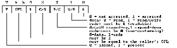 

 If the Present bit (P) is * notset in the descriptor,

|  | The DPL field must be equal to the caller's CP. |
| --- | --- |
|  | The "must be 1" field must be set to 1. |
|  | The other fields can contain any values. |

 Your application should use the LAR (Load Access Rights) instruction to examine the access rights of a descriptor.

---

<a id="000AH"></a>

### Function 000AH (Create Alias Descriptor)

*Keywords: 000AH*

[DPMI Function Reference](#DPMIFunctionReference)

 Purpose

 Creates a new LDT data descriptor that has the same base and limit as the specified descriptor. The selector passed to the function in BX can be either code or data.
#### Parameters
```c
AX = 000AH

 BX = selector
```
#### Return Value
 If successful, this function returns the carry flag clear and the alias for the selector which was passed in BX in the AX register. If unsuccessful, this function returns the carry flag set.
#### Remarks
 The selector supplied to the function may be either a data selector or an executable selector.

 If an alias is created with this function and the base or limit of the original segment is then changed, the two descriptors no longer map to the same memory.

---

<a id="000BH"></a>

### Function 000BH (Get Descriptor)

*Keywords: 000BH*

[DPMI Function Reference](#DPMIFunctionReference)

 Purpose

 Copies a specified selector's local descriptor table (LDT) entry into an 8-byte buffer.
#### Parameters
```c
AX = 000BH

 BX = selector

 ES:(E)DI = selector:offset of 8-byte buffer
```
#### Return Value
 If the function is successful, the carry flag is clear, and the buffer pointed to by ES:(E)DI contains the selector's specified LDT. If this function is unsuccessful, the carry flag is set.

---

<a id="000CH"></a>

### Function 000CH (Set Descriptor)

*Keywords: 000CH*

[DPMI Function Reference](#DPMIFunctionReference)

 Purpose

 Copies the contents of an 8-byte buffer into the local descriptor table entry (LDT) for the specified selector.
#### Parameters
```c
AX = 000CH

 BX = selector

 ES:(E)DI = selector:offset of 8-byte buffer containing descriptor
```
#### Return Value
 If successful, this function returns the carry flag clear. If unsuccessful, this function returns the carry flag set.
#### Remarks
 The descriptor's access rights/type byte (byte 5) follows the same format and restrictions as the access rights/type parameter (in CL) for the Set Descriptor Access Rights function (Function 0009H).

 If the descriptor's present bit is not set, then error checking is limited to checking that the program's current privilege level (CPL) is the same as the descriptor's privilege level (DPL) and that the "must be 1" bit in the descriptor's byte 5 is set.

---

<a id="0200H"></a>

### Function 0200H (Get Real-Mode Interrupt Vector)

*Keywords: 0200H*

[DPMI Function Reference](#DPMIFunctionReference)

 Purpose

 Returns the contents of the real-mode interrupt vector for the specified real-mode interrupt.
#### Parameters
```c
AX = 0200H

 BL = interrupt number
```
#### Return Value
 This function, which is always successful, returns the carry flag clear and the segment:offset of the real-mode interrupt handler in the CS:(E)DX registers.
#### Remarks
 The value returned in CX is a real-mode segment address, not a selector. Attempts to place this value into a segment register in protected mode may cause a general protection (GP) fault.

---

<a id="0201H"></a>

### Function 0201H (Set Real-Mode Interrupt Vector)

*Keywords: 0201H*

[DPMI Function Reference](#DPMIFunctionReference)

 Purpose

 Sets the real-mode interrupt vector for the specified interrupt.
#### Parameters
```c
AX = 0201H

 BL = interrupt number

 CS:(E)DX = segment:offset of real mode interrupt handler
```
#### Return Value
 This function, which is always successful, returns the carry flag clear.
#### Remarks
 The address passed in CX must be a real-mode segment address, not a selector. Therefore, the interrupt handler must either reside in DOS memory (that is, below the 1 MB boundary), or the application must allocate a real-mode callback address (Function 303H).

 If the interrupt being used is a hardware interrupt, the memory that the interrupt handler uses must be locked.

---

<a id="0202H"></a>

### Function 0202H (Get Processor Exception Handler Vector)

*Keywords: 0202H*

[DPMI Function Reference](#DPMIFunctionReference)

 Purpose

 Returns the address of the protected-mode exception handler for the specified exception number.
#### Parameters
```c
AX = 0202H

 BL = exception number (00H-1FH)
```
#### Return Value
 If successful, this function returns the carry flag clear and the selector:offset of the exception handler in the CS:(E)DX registers. If unsuccessful, this function returns the carry flag set.
#### Remarks
 The value returned in CX is a valid protected-mode selector, not a real-mode segment address.

---

<a id="0203H"></a>

### Function 0203H (Set Processor Exception Handler Vector)

*Keywords: 0203H*

[DPMI Function Reference](#DPMIFunctionReference)

 Purpose

 Sets the address of a handler for a CPU exception or fault, thus allowing a protected-mode application to intercept processor exceptions (such as segment not present faults) that are not handled by the DPMI server and would otherwise generate a fatal error.
#### Parameters
```c
AX = 0203H

 BL = exception/fault number (00H-1FH)

 CS:(E)DX = selector:offset of the exception handler
```
#### Return Value
 If successful, this function returns the carry flag clear. If unsuccessful, this function returns the carry flag set.
#### Remarks
 The value passed in CX should be a valid protected-mode code (executable) selector, not a real-mode segment address.

 Every exception is first examined by the DPMI server. If the server does not handle the exception, it sends the exception to the first handler in the protected-mode exception handler chain.

---

<a id="0204H"></a>

### Function 0204H (Get Protected-Mode Interrupt Vector)

*Keywords: 0204H*

[DPMI Function Reference](#DPMIFunctionReference)

 Purpose

 Returns the address of the protected-mode interrupt handler for the specified interrupt.
#### Parameters
```c
AX = 0204H

 BL = interrupt number
```
#### Return Value
 This function, which is always successful, returns the carry flag clear and the selector:offset of the exception handler in the CS:(E)DX registers.
#### Remarks
 The value returned in CX is a valid protected-mode selector, not a real-mode segment address.

---

<a id="0205H"></a>

### Function 0205H (Set Protected-Mode Interrupt Vector)

*Keywords: 0205H*

[DPMI Function Reference](#DPMIFunctionReference)

 Purpose

 Sets the protected-mode interrupt vector for the specified interrupt.
#### Parameters
```c
AX = 0205H

 BL = interrupt number

 CS:(E)DX = selector:offset of exception handler
```
#### Return Value
 If successful, this function returns the carry flag clear. If unsuccessful, this function returns the carry flag set.
#### Remarks
 The value passed in CX should be a valid protected-mode code selector, not a real-mode segment address.

---

<a id="0300H"></a>

### Function 0300H (Simulate Real-Mode Interrupt)

*Keywords: 0300H*

[DPMI Function Reference](#DPMIFunctionReference)

 Purpose

 Simulates a real-mode interrupt from protected-mode. The function transfers control to the address specified by the real-mode interrupt vector. The real-mode handler must return by executing an IRET (interrupt return) instruction.
#### Parameters
```c
AX = 0300H

 BL = interrupt number

 BH = 0

 CX = number of words to copy from protected-mode to real-mode stack

 ES:(E)DI = selector:offset of real-mode register data structure in the

            following format:

            Offset   Length  Contents

            00H      4       DI or EDI

            04H      4       SI or ESI

            08H      4       BP or EBP

            0CH      4       (reserved, should be zero)

            10H      4       BX or EBX

            14H      4       DX or EDX

            18H      4       CX or ECX

            1CH      4       AX or EAX

            20H      2       CPU status flags

            22H      2       ES

            24H      2       DS

 26H      2       FS (reserved, should be zero)

            28H      2       GS (reserved, should be zero)

            2AH      2       IP (reserved, ignored)

            2CH      2       CS (reserved, ignored)

            2EH      2       SP

            30H      2       SS
```
#### Return Value
 If successful, this function returns the carry flag clear and the selector:offset of the modified real-mode register in ES:(E)DI. If unsuccessful, this function returns the carry flag set.
#### Remarks
 32-bit programs must use ES:(E)DI to point to the real mode data structure. 16-bit programs use ES:DI.

 The CS:IP in the real-mode register data structure is ignored by this function. The appropriate interrupt handler is called based on the value passed in BL.

 If the SS:SP fields in the real-mode register data structure are zero, a real-mode stack is provided by the DPMI server. Otherwise, the real-mode SS:SP is set to the specified values before the interrupt handler is called.

 The flags specified in the real-mode register data structure are pushed on the real-mode stack's IRET (interrupt return instruction) frame. The interrupt handler is called with the interrupt and trace flags clear.

 Values placed in the segment register positions of the data structure must be valid for real mode; that is, the values must be paragraph addresses and not selectors.

 All general register fields in the data structure are DWORDs so that 32-bit registers can be passed to real mode. Note, however, that 16-bit hosts are not required to pass the high word of 32-bit general registers or the FS and GS registers to real mode even when running on an 80386 or later CPU.

 The target real-mode handler must return with the stack in the same state as when it was called. This means that although the real-mode code may switch stacks while it is running, it must return on the same stack that it was called on and must return with an IRET.

 When this function returns, the real-mode register data structure contains the values that were returned by the real-mode interrupt handler.

 It is the caller's responsibility to remove any parameters that were pushed on the protected-mode stack.

---

<a id="0301H"></a>

### Function 0301H (Call Real-Mode Procedure With Far Return Frame)

*Keywords: 0301H*

[DPMI Function Reference](#DPMIFunctionReference)

 Purpose

 Simulates a FAR CALL to a real-mode procedure. The called procedure must return by executing a RETF (far return) instruction.
#### Parameters
```c
AX = 0301H

 BH = 0

 CX = number of words to copy from protected-mode to real-mode stack

 ES:(E)DI = selector:offset of real-mode register data structure in the

            following format:

            Offset   Length  Contents

            00H      4       DI or EDI

            04H      4       SI or ESI

            08H      4       BP or EBP

            0CH      4       (reserved, ignored)

            10H      4       BX or EBX

            14H      4       DX or EDX

            18H      4       CX or ECX

            1CH      4       AX or EAX

            20H      2       CPU status flags

            22H      2       ES

            24H      2       DS

            26H      2       FS (reserved, should be zero)

 28H      2       GS (reserved, should be zero)

            2AH      2       IP

            2CH      2       CS

            2EH      2       SP

            30H      2       SS
```
#### Return Value
 If successful, this function returns the carry flag clear and the selector:offset of the modified real-mode register data structure in the ES:(E)DI register. If unsuccessful, this function returns the carry flag set.
#### Remarks
 32-bit programs must use ES:(E)DI to point to the real-mode register data structure. 16-bit programs should use ES:DI.

 The CS:IP in the real-mode register data structure specifies the address of the real-mode procedure to call.

 If the SS:SP fields in the real-mode register data structure are zero, a real-mode stack is provided by the DPMI server. Otherwise, the real-mode SS:SP is set to the specified values before the interrupt handler is called.

 Values placed in the segment register positions of the data structure must be valid for real mode; that is, the values must be paragraph addresses and not selectors.

 All general register fields in the data structure are DWORDs so that 32-bit registers can be passed to real mode. Note, however, that 16-bit hosts are not required to pass the high word of 32-bit general registers or the FS and GS segment registers to real mode even when running on an 80386 or later CPU.

 The target real-mode procedure must return with the stack in the same state as when it was called. This means that although the real-mode code may switch stacks while it is running, it must return on the same stack that it was called on, must exit with a RETF (far return), and should not clear the stack of any other parameters that were passed to it on the stack.

 When this function returns, the real-mode register data structure contains the values that the real-mode procedure returned.

 It is the caller's responsibility to remove any parameters that were pushed on the protected-mode stack.

---

<a id="0302H"></a>

### Function 0302H (Call Real-Mode Procedure With IRET Frame)

*Keywords: 0302H*

[DPMI Function Reference](#DPMIFunctionReference)

 Purpose

 Simulates a FAR CALL with flags pushed on the stack to a real-mode procedure. The real-mode routine must return by executing an IRET instruction.
#### Parameters
```c
AX = 0302H

 BH = 0

 CX = number of words to copy from protected-mode to real-mode stack

 ES:(E)DI = selector:offset of real-mode register data structure in the

            following format:

            Offset   Length  Contents

            00H      4       DI or EDI

            04H      4       SI or ESI

            08H      4       BP or EBP

            0CH      4       (reserved, ignored)

            10H      4       BX or EBX

            14H      4       DX or EDX

            18H      4       CX or ECX

            1CH      4       AX or EAX

            20H      2       CPU status flags

            22H      2       ES

            24H      2       DS

            26H      2       FS (reserved, should be zero)

 28H      2       GS (reserved, should be zero)

            2AH      2       IP

            2CH      2       CS

            2EH      2       SP

            30H      2       SS
```
#### Return Value
 If successful, this function returns the carry flag clear and the selector:offset of the modified real-mode register data structure in ES:(E)DI. If unsuccessful, this function returns the carry flag set.
#### Remarks
 32-bit programs must use ES:(E)DI to point to the real-mode register data structure. 16-bit programs should use ES:DI.

 The CS:IP in the real-mode register data structure specifies the address of the real-mode procedure to call.

 If the SS:SP fields in the real-mode register data structure are zero, a real-mode stack is provided by the DPMI server. Otherwise, the real-mode SS:SP is set to the specified values before the interrupt handler is called.

 The flags specified in the real-mode register data structure are pushed on the real-mode stack's IRET (interrupt return instruction) frame. The procedure is called with the interrupt and trace flags clear.

 Values placed in the segment register positions of the data structure must be valid for real mode; that is, the values must be paragraph addresses and not selectors.

 All general register fields in the data structure are DWORDs so that 32-bit registers can be passed to real mode. Note, however, that 16-bit hosts are not required to pass the high word of 32-bit general registers or the FS and GS segment registers to real mode even when running on an 80386 or later CPU.

 The target real-mode handler or procedure must return with the stack in the same state as when it was called. This means that although the real-mode code may switch stacks while it is running, it must return on the same stack that it was called on and must return with an IRET or discard the flags from the stack with a RETF(2).

 When this function returns, the real-mode register data structure contains the values returned by the real-mode procedure.

 It is the caller's responsibility to remove any parameters that were pushed on the protected-mode stack.

---

<a id="0303H"></a>

### Function 0303H (Allocate Real-Mode Callback Address)

*Keywords: 0303H*

[DPMI Function Reference](#DPMIFunctionReference)

 Purpose

 Returns a unique real-mode segment offset, known as a "real-mode callback," that transfers control from a real-mode to a protected-mode procedure. Callback addresses obtained with this function can be passed by a protected-mode program to a real-mode application, interrupt handler, device driver, or TSR, so that the real-mode program can call procedures within the protected-mode program or notify the protected-mode program of an event.
#### Parameters
```c
AX = 0303H

 DS:(E)SI = selector:offset of protected-mode procedure to call

 ES:(E)DI = selector:offset of 32H-byte buffer for real mode register data structure to be used when calling callback routine.
```
#### Return Value
 If successful, this function returns the carry flag clear and the segment:offset of the real-mode callback in CS:(E)DX. If unsuccessful, this function returns the carry flag set.
#### Remarks
 The DPMI server provides a minimum of 16 callback addresses per application.

 A descriptor may be allocated for each callback to hold the real-mode SS descriptor. Because real-mode callbacks are a limited system resource, an application should use the Free Real-Mode Callback Address function (Function 0304H) to release a callback that it is no longer using.

 The contents of the real-mode register data structure are valid only during, but not after, the actual callback.

---

<a id="0304H"></a>

### Function 0304H (Free Real-Mode Callback Address)

*Keywords: 0304H*

[DPMI Function Reference](#DPMIFunctionReference)

 Purpose

 Releases a real-mode callback address that was previously allocated with the Allocate Real-Mode Callback Address function (Function 0303H).
#### Parameters
```c
AX = 0304H

 CS:(E)DX = real-mode callback address to be freed
```
#### Return Value
 If successful, this function returns the carry flag clear. If unsuccessful, this function returns the carry flag set.
#### Remarks
 Because real-mode callbacks are a limited system resource, an application should release any callback that it is no longer using.

---

<a id="0305H"></a>

### Function 0305H (Get State Save/Restore Addresses)

*Keywords: 0305H*

[DPMI Function Reference](#DPMIFunctionReference)

 Purpose

 Returns the addresses of two procedures used to save and restore the state of the current task's registers in the mode which is * notcurrently executing.
#### Parameters
```c
AX = 0305H
```
#### Return Value
```c
Carry flag = clear (this function always succeeds)

 AX = size of buffer in bytes required to save state

 BX:CX = real-mode addressof routine used to save/restore state

 SI:(E)DI = protected-mode address of routine used to save/restore state
```
#### Remarks
 The real-mode address returned by this function in BX:CX is called * onlyin real mode to save/restore the state of the protected-mode registers. The protected-mode address returned by this function in SI:DI, 32-bit programs is called only in protected-mode to save/restore the state of the real-mode registers; 16-bit programs should call the address in SI:DI, 32-bit programs should call the address in SI:(E)DI. Registers for the current mode can be saved by just pushing them on the stack.

 Both of the state-save procedures are entered by a FAR CALL with the following parameters:

 
```c
 AL = 0 to save state

  = 1 to restore state

 ES:(E)DI = (selector or segment):offset of state-save buffer
```
 The state-save buffer must be at least as large as the value returned in AX by Int 31H Function 0305H. The state save/restore procedures do not modify any registers.

 Some DPMI hosts will not require the state to be saved, indicating this by returning a buffer size of zero in AX. In such cases, the addresses returned by this function can still be called, although they just return without performing any useful function.

 Clients do not need to call the state save/restore procedures before using Int 32H Functions 0300H, 0301H, or 0302H. The state save/restore procedures are provided specifically for clients that use the raw mode switch services.

 A client can use the function to save its state in the destination mode before switching modes using the raw-mode switch or issuing real-mode calls from a protected-mode hardware interrupt handler.

---

<a id="0306H"></a>

### Function 0306H (Get Raw Mode Switch Addresses)

*Keywords: 0306H*

[DPMI Function Reference](#DPMIFunctionReference)

 Purpose

 Returns addresses that can be called for low-level mode switching.
#### Parameters
```c
AX = 0306H
```
#### Return Value
```c
Carry flag = clear (this function always succeeds)

 BX:CX = real-to-protected mode switch address

 SI:(E)DI = protected-to-real mode switch address
```
#### Remarks
 The address returned in BX:CX must only be called in real mode to switch into protected mode. The address returned in SI:(E)DI must only be called in protected mode to switch into real mode; 16-bit programs should call the address returned by this function in SI:DI, while 32-bit programs should call the address returned in SI:(E)DI.

 The mode switch procedures are entered by a FAR JMP to the appropriate address with the following parameters:

 
```c
 AX = new DS

 CX = new ES

 DX = new SS

 (E)BX = new (E)SP

 SI = new CS

 (E) = new (E)IP
```
 The processor is placed into the desired mode, and the DS, ES, SS, (E)SP, CS, and (E)IP registers are updated with the specified values; in other words, execution of the client continues in the requested mode at the address provided in registers SI:(E)DI. The values specified to be placed into the segment registers must be appropriate for the destination mode; if invalid selectors are supplied when switching into protected mode, an exception will occur.

 The values in (E)AX, (E)CX, (E)DX, (E)SI, and (D)DI after the mode switch are undefined. (E)BP will be preserved across the mode switch call so it can be used as a pointer. On an 80386 or later CPU, the FS and GS sement registers will contain zero after the mode switch.

 If interrupts are disabled when the mode switch procedure is invoked, they will not be reenabled by the DPMI host (even temporarily).

 It is up to the client to save and restore the state of the task when using this function to switch modes. This usually requires using the state save/restore procedures whose addresses are returned by Int 31H Function [0305H.](#0305H)

 Clients may find it more convenient to use Int 31H Functions 0300H, 0301H, and 0302H rather than this function.

---

<a id="0400H"></a>

### Function 0400H (Get Version)

*Keywords: 0400H*

[DPMI Function Reference](#DPMIFunctionReference)

 Purpose

 Returns the version number of the DPMI Specification implemented by the DPMI server. Your application can use this information to determine which function calls are supported in the current environment.
#### Parameters
```c
AX = 0400H
```
#### Return Value
 This function, which is always successful, returns the carry flag clear and the following values:

 
```c
 AH = DPMI major version in ASCII code

 AL = DPMI minor version in ASCII code

 BX = flags

      Bits   Significance

      0      0 = DPMI server is 16-bit implementation

             1 = DPMI server is 32-bit (80386) implementation

      1      0 = CPU returned to Virtual 86 mode for reflected interrupts

             1 = CPU returned to real mode for reflected interrupts

      2      0 = virtual memory not supported

             1 = virtual memory supported

      3      reserved, for historical reasons

      4-15   reserved for later use

 CL = processor type

      02H = 80286

      03H = 80386

      04H = 80486

 05H-FFH   reserved for future Intel processors

 DH = current primary hardware interrupt offset value

 DL = current secondary hardware interrupt offset value
```
#### Remarks
 Under DPMI servers, the major version number is returned in AH and the minor version number is returned in AL. There are two decimal digits for the minor version number, with the least-significant digit representing the revision number of the minor version number. Under DPMI version 0.9, zero is returned in AH and decimal 90 (5AH) in AL.

---

<a id="0900H"></a>

### Function 0900H (Get and Disable Virtual Interrupt State)

*Keywords: 0900H*

[DPMI Function Reference](#DPMIFunctionReference)

 Purpose

 Disables the virtual interrupt flag and returns the previous state of the virtual interrupt flag.
#### Parameters
```c
AX = 0900H
```
#### Return Value
 This function, which is always successful, returns virtual interrupts enabled and the carry flag clear. The AL register contains 0 if virtual interrupts were previously disabled, or 1 if virtual interrupts were previously enabled.
#### Remarks
 This function does not change the value of the AH register. Therefore, the previous state can be restored by simply executing another INT 31H.

 An application that does not need to know the prior interrupt state can execute the CLI (clear interrupt) instruction rather than call this function. However, because the DPMI server might trap the CLI instruction to manipulate the virtual flag, using the CLI instruction can decrease the speed of your application.

---

<a id="0901H"></a>

### Function 0901H (Get and Enable Virtual Interrupt State)

*Keywords: 0901H*

[DPMI Function Reference](#DPMIFunctionReference)

 Purpose

 Enables the virtual interrupt flag and returns the previous state of the virtual interrupt flag.
#### Parameters
```c
AX = 0901H
```
#### Return Value
 This function, which is always successful, returns virtual interrupts enabled and the carry flag clear. The AL register contains 0 if virtual interrupts were previously disabled, or 1 if virtual interrupts were previously enabled.
#### Remarks
 This function does not change the value of the AH register. Therefore, the previous state can be restored by simply executing another INT 31H.

 An application that does not need to know the prior interrupt state can execute the STI (set interrupt) instruction rather than call this function. However, because the DPMI server might trap the STI instruction to manipulate the virtual flag, using the STI instruction can decrease the speed of your application.

---

<a id="0902H"></a>

### Function 0902H (Get Virtual Interrupt State)

*Keywords: 0902H*

[DPMI Function Reference](#DPMIFunctionReference)

 Purpose

 Returns the current state of the virtual interrupt flag.
#### Parameters
```c
AX = 0902H
```
#### Return Value
 This function, which is always successful, returns the carry flag clear. The AL register contains 0 if virtual interrupts are disabled, or 1 if virtual interrupts are enabled.
#### Remarks
 This function should be used instead of the PUSHF (push flags register onto the stack) instruction to examine the interrupt flag because the PUSHF instruction returns the physical interrupt flag rather than the virtualized interrupt flag. The physical interrupt flag will always be enabled even when hardware interrupts are not being passed through to the application.

---

<a id="1686H"></a>

### Function 1686H (Get CPU Mode)

*Keywords: 1686H*

[DPMI Function Reference](#DPMIFunctionReference)

 Purpose

 Returns information about the current CPU mode. Programs that execute only in protected mode do not need to call this function.
#### Parameters
```c
AX = 1686H
```
#### Return Value
 If executing in protected mode, this function returns 0 in the AX register. If executing in real mode, this function returns nonzero in the AX register.
#### Remarks
 If you are writing sections of * bimodalcode (code that can execute in both real and protected mode), you can call INT 2FH function 1686H to detect at run-time whether the CPU is executing in real or protected mode. Unlike other DPMI functions, INT 2FH function 1686H is supported in both real and protected mode.

 This function should not be used to determine if a DPMI server is present. Your program should verify that the DPMI server is available*  beforeit calls this function. If this is not done, the results returned by the function may be invalid.

---

<a id="DOSandBIOSFunctionCallsinProtectedMode"></a>

### DOS and BIOS Function Calls in Protected Mode

*Keywords: BIOS function calls, DOS function calls, protected mode function calls*

[See Also](#95CQPT)

 Programs running in protected mode under a DPMI server can make DOS and BIOS function calls just as they would in real mode. As in real mode, DOS and BIOS functions are called by executing * software interruptinstructions. For example, DOS functions are called by executing an INT 21H, and BIOS video functions are called by executing an INT 10H. The DPMI server transparently intercepts DOS and BIOS software interrupts in protected mode and re-issues them in real mode.

 [Supported Functions](#VCEVUX)

 [Partially Supported Functions](#244OYMP)

 [Unsupported Functions](#125ROL1)

 [File Control Block (FCB) Based Functions](#FileControlBlockFCBBasedFunctions)

 [Terminate and Stay Resident (TSR) Programs](#TerminateandStayResidentTSRPrograms)

 [Allocating DOS Memory in Protected Mode](#AllocatingDOSMemoryinProtectedMode)

 [Ctrl-Break and Critical Error Handlers](#CtrlBreakandCriticalErrorHandlers)

 [BIOS Functions](#BIOSFunctions)

---

<a id="95CQPT"></a>

#### See Also
 [DPMI Compiler Switches](#DPMICompilerSwitches)

 [DPMI Linker Switches](#DPMILinkerSwitches)

 [DPMI Programming](#DPMIProgramming)

 [Numeric Listing of DOS and BIOS Protected Mode Function Calls](#1KT_XZP)

---

<a id="1KT_XZP"></a>

### DOS and BIOS Function Calls in Protected Mode (Numeric Listing)

*Keywords: BIOS function calls, DOS function calls, protected mode function calls*

This is a numeric listing of the DOS and BIOS Function Calls supported in protected-mode programs:

 [11H (Equipment Determination)](#INT11H)

 [12H (Memory Size Determination)](#INT12H)

 [13H (Diskette/Fixed Disk Interface)](#INT13H)

 [14H (Asynchronous Communications)](#INT14H)

 [15H (System Services)](#INT15H)

 [16H (Keyboard Functions)](#INT16H)

 [17H (Printer Functions)](#INT17H)

 [1AH (System-timer and Real-time Clock Services)](#INT1AH)

 [23H (Ctrl-Break Handler)](#23H)

 [24H (Critical Error Handler)](#24H)

 [25H (Set Interrupt Vector)](#25H)

 [35H (Get Interrupt Vector)](#35H)

 [38H (Get/Set Country Dependent Information)](#38H)

 [44H (I/O Control)](#44H)

 [4BH (Load Or Execute Program)](#4BH)

 [65H (Get Extended Country Information)](#65H)

---

<a id="VCEVUX"></a>

### Supported DOS and BIOS Protected Mode Functions

*Keywords: BIOS function calls, DOS function calls, protected mode function calls*

The DOS INT 21H functions that are fully supported in protected mode:

 Function	 Description

 

| AH = 01H | Keyboard input |
| --- | --- |
| AH = 02H | Display output |
| AH = 03H | Auxiliary input |
| AH = 04H | Auxiliary output |
| AH = 05H | Printer output |
| AH = 06H | Direct console I/O |
| AH = 07H | Direct console input without echo |
| AH = 08H | Console input without echo |
| AH = 09H | Print string |
| AH = 0AH | Buffered keyboard input |
| AH = 0BH | Check standard input status |
| AH = 0CH | Clear keyboard buffer |
| AH = 0DH | Disk reset |
| AH = 0EH | Select disk |
| AH = 19H | Current disk |
| AH = 1AH | Set disk transfer address |
| AH = 1BH | Allocation table information for current drive |
| AH = 1CH | Allocation table information for specific drive |
| AH = 29H | Parse filename |
| AH = 2AH | Get date |
| AH = 2BH | Set date |
| AH = 2CH | Get time |
| AH = 2DH | Set time |
| AH = 2EH | Set/reset verify switch |
| AH = 2FH | Get disk transfer address |
| AH = 30H | Get DOS version number |
| AH = 33H | Ctrl-Break check |
| AH = 36H | Get disk free space |
| AH = 39H | Create subdirectory |
| AH = 3AH | Remove subdirectory |
| AH = 3BH | Change current directory |
| AH = 3CH | Create file |
| AH = 3DH | Open file |
| AH = 3EH | Close file |
| AH = 3FH | Read from file |
| AH = 40H | Write to file |
| AH = 41H | Delete file |
| AH = 42H | Set file pointer |
| AH = 43H | Change file mode |
| AH = 45H | Duplicate file handle |
| AH = 46H | Force duplicate file handle |
| AH = 47H | Get current directory |
| AH = 4CH | Terminate process |
| AH = 4DH | Get process return code |
| AH = 4EH | Find first matching file |
| AH = 4FH | Find next matching file |
| AH = 50H | Set current PSP |
| AH = 51H | Get current PSP |
| AH = 54H | Get verify setting |
| AH = 56H | Rename file |
| AH = 57H | Get/set date and time of file |
| AH = 58H | Get/set memory allocation strategy |
| AH = 59H | Get extended error |
| AH = 5AH | Create unique file |
| AH = 5BH | Create new file |
| AH = 5CH | Lock/unlock file access |
| AH = 62H | Get current PSP |
| AH = 66H | Get/set global code page table |
| AH = 67H | Set handle count |
| AH = 68H | Commit file |

---

<a id="244OYMP"></a>

### Partially Supported DOS and BIOS Protected Mode Functions

*Keywords: BIOS function calls, DOS function calls, protected mode function calls*

The DOS INT 21H functions that are partially supported in protected mode:

 Function	 Description

 

| [AH = 25H](#25H) | Set interrupt vector |
| --- | --- |
| [AH = 35H](#35H) | Get interrupt vector |
| [AH = 38H](#38H) | Get/set country dependent information |
| [AH = 44H](#44H) | I/O control |
| [AH = 4BH](#4BH) | Load or execute program |
| [AH = 65H](#65H) | Get extended country information |

---

<a id="25H"></a>

### Function 25H (Set Interrupt Vector)

*Keywords: 25H*

This function sets the protected-mode interrupt vector for the specified interrupt corresponding to DPMI function 0205H. To set a real-mode interrupt vector, use DPMI function 0201H. To set a protected-mode exception vector, use DPMI function 0203H.

---

<a id="35H"></a>

### Function 35H (Get Interrupt Vector)

*Keywords: 35H*

This function returns the protected-mode interrupt vector for the specified interrupt corresponding to DPMI function 0204H. To get the address stored in a real-mode interrupt vector, use DPMI function 0200H. To get the address stored in a protected-mode exception vector, use DPMI function 0202H.

---

<a id="38H"></a>

### Function 38H (Get/Set Country Dependent Information)

*Keywords: 38H*

The case map call address returned at offset 12H in the country information structure is a * real-mode address. To call the case mapping routine, use DPMI function 0301H (call real-mode procedure with far return frame).

---

<a id="44H"></a>

### Function 44H (I/O Control)

*Keywords: 44H*

Subfunctions 02H, 03H, 04H, and 05H are only supported for transfers of up to 2 kilobytes, unless the buffer resides in real-mode addressable memory.

 Except for register-based subfunctions, no other I/O control functions are supported in protected mode.

---

<a id="4BH"></a>

### Function 4BH (Load Or Execute Program)

*Keywords: 4BH*

Only subfunction 00H (load and execute program) is supported. Subfunctions 01H (load program) and 03H (load overlay) cannot be used in protected mode.

 The environment segment address (the word at offset 0) in the parameter block is ignored in protected mode and should be set to zero.

---

<a id="65H"></a>

### Function 65H (Get Extended Country Information)

*Keywords: 65H*

All pointer entries in the structures returned by this function contain * real-mode addresses. To access any of the country information tables, you must first create a selector that points to the particular memory area. To call the case mapping routine, use DPMI function 0301H (call real-mode procedure with far return frame).

---

<a id="125ROL1"></a>

### Unsupported DOS and BIOS Protected Mode Functions

*Keywords: BIOS function calls, DOS function calls, protected mode function calls*

The DOS interrupts that are not supported in protected mode:

 Unsupported DOS Interrupts

 Function	 Description

 

| INT 20H | Terminate program |
| --- | --- |
| INT 25H | Absolute disk read |
| INT 26H | Absolute disk write |
| INT 27H | Terminate and stay resident |

 Unsupported DOS Functions

 Function	 Description

 

| AH = 00H | Terminate process |
| --- | --- |
| AH = 0FH | Open file using FCB |
| AH = 10H | Close file using FCB |
| AH = 14H | Sequential readc using FCB |
| AH = 15H | Sequential write using FCB |
| AH = 16H | Create file using FCB |
| AH = 21H | Random read using FCB |
| AH = 22H | Random write using FCB |
| AH = 23H | Get file size using FCB |
| AH = 24H | Set relative record using FCB |
| AH = 27H | Random block read using FCB |
| AH = 28H | Random block write using FCB |
| AH = 31H | Terminate and stay resident |
| AH = 48H | Allocate memory |
| AH = 49H | Free allocated memory |
| AH = 4AH | Modify allocated memory blocks |

---

<a id="FileControlBlockFCBBasedFunctions"></a>

### File Control Block (FCB) Based Functions

*Keywords: fcb, file control block-based functions*

FCB based DOS functions are not supported in protected mode. Any code that uses these functions should be rewritten to use the newer handle-based file handling routines.

---

<a id="TerminateandStayResidentTSRPrograms"></a>

### Terminate and Stay Resident (TSR) Programs

*Keywords: terminate-and-stay resident programs, tsr*

Terminate and Stay Resident (TSR) programs are not supported by DPMI, so INT 27H and INT 21H function 31H should not be used in protected mode. For TSR-like functionality, use INT 21H function 4BH (corresponding to the * Execroutine in the * Dosunit) to execute COMMAND.COM. This, for example, is how the RTMRES.EXE utility makes the DPMI server and RTM.EXE resident.

---

<a id="AllocatingDOSMemoryinProtectedMode"></a>

### Allocating DOS Memory in Protected Mode

*Keywords: allocating dos memory, memory management, protected mode*

DOS functions 48H, 49H, and 4AH cannot be used to allocate DOS memory in protected mode. Instead, protected-mode programs should use the * GlobalDOSAllocand * GlobalDOSFreeroutines.

---

<a id="CtrlBreakandCriticalErrorHandlers"></a>

### Ctrl-Break and Critical Error Handlers

*Keywords: critical error handlers, Ctrl-Break*

DOS allows a program to install Ctrl-Break and critical error handlers by hooking [INT 23H](#23H) and [INT 24H.](#24H) Although most DPMI servers correctly reflect these interrupts in protected mode, the interrupts should be hooked in * real modein order for the handlers to function under all DPMI servers.

 To install a protected-mode Ctrl-Break or critical error handler, you should first allocate a real-mode callback (using DPMI function 0303H), and then set the real-mode interrupt vector to point to the real-mode callback (using DPMI function 0201H). Alternatively, you can store the handler in a real-mode code segment, and, if required, use raw mode switching to execute protected-mode code in the handler.

 Protected-mode code executed in INT 23H and INT 24H handlers must reside in fixed, non-discardable code segments.

 It is not possible to terminate a protected-mode application in an INT 23H or INT 24H handler--unlike a real-mode application, an INT 23H or INT 24H handler in a protected-mode application * mustreturn using an IRET instruction.

---

<a id="23H"></a>

### INT 23H (Ctrl-Break Handler)

*Keywords: INT 23H*

Because an INT 23H handler in a protected-mode application cannot terminate an application, returning from an INT 23H handler with the carry flag set has no effect. Likewise, executing an INT 21H function 4CH in a protected-mode INT 23H handler will have unpredictable results.

 The Borland C++ run-time library implements Ctrl-Break termination by capturing both INT 21H and INT 23H. The INT 23H handler simply sets an internal flag to indicate that the user pressed Ctrl-Break, and then returns using an IRET. The INT 21H handler first calls the previous INT 21H handler, and then examines the internal Ctrl-Break flag. If the Ctrl-Break flag is set, indicating that an INT 23H was executed by DOS during the function call, the INT 21H terminates the application.

---

<a id="24H"></a>

### INT 24H (Critical Error Handler)

*Keywords: INT 24H*

Because an INT 24H handler in a protected-mode application cannot terminate an application, returning from an INT 24H handler with AL = 02H (terminate program) has the same affect as returning with AL = 03H (fail system call in progress).

---

<a id="BIOSFunctions"></a>

### BIOS Functions

*Keywords: BIOS functions*

These topics describe the BIOS functions that are supported and partially supported in protected mode.

 [INT 10H Video Functions](#INT10HVideoFunctions)

 [Equipment, System, and Memory Interrupts](#EquipmentSystemandMemoryInterrupts)

 [Ctrl-Break and Timer Tick Interrupt Handlers](#CtrlBreakandTimerTickInterruptHandlers)

 [Mouse Driver Functions](#MouseDriverFunctions)

---

<a id="INT10HVideoFunctions"></a>

### INT 10H Video Functions

*Keywords: INT 10H, video functions*

Supported INT 10H Video Functions

 The INT 10H video functions that are fully supported in protected mode:

 Function	 Description

 

| AH = 00H | Set mode |
| --- | --- |
| AH = 01H | Set cursor type |
| AH = 02H | Set cursor position |
| AH = 03H | Read cursor position |
| AH = 05H | Select active display page |
| AH = 06H | Scroll active page up |
| AH = 07H | Scroll active page down |
| AH = 08H | Read attribute/character at current cursor position |
| AH = 09H | Write attribute/character at current cursor position |
| AH = 0AH | Write character at current cursor position |
| AH = 0BH | Set color palette |
| AH = 0CH | Write dot |
| AH = 0DH | Read dot |
| AH = 0EH | Write teletype to active page |
| AH = 0FH | Read current video state |
| AH = 10H | Set palette registers |
| AH = 1AH | Read/write display combination code |

 

 Partially Supported INT 10H Video Functions

 The INT 10H video functions that are partially supported in protected mode:

 Function	 Description

 

| AH = 11H | Character generator |
| --- | --- |
| AH = 12H | Alternate select |
| AH = 13H | Write string |
| AH = 14H | Load LCD character font |
| AH = 15H | Return physical display parameters |
| AH = 1BH | Return functionality/state information |
| AH = 1CH | Save/restore video state |

 

 Function 13H is supported for buffer sizes of up to 2 kilobytes. For the remaining video functions, register-based subfunctions are supported, but pointer-based subfunctions are not.

---

<a id="EquipmentSystemandMemoryInterrupts"></a>

### Equipment, System, and Memory Interrupts

*Keywords: equipment interrupts, interrupts, memory interrupts, system interrupts*

Function	 Description

 

| [INT 11H](#INT11H) | Equipment Determination |
| --- | --- |
| [INT 12H](#INT12H) | Memory Size Determination |
| [INT 13H](#INT13H) | Diskette/Fixed Disk Interface |
| [INT 14H](#INT14H) | Asynchronous Communications |
| [INT 15H](#INT15H) | System Services |
| [INT 16H](#INT16H) | Keyboard Functions |
| [INT 17H](#INT17H) | Printer Functions |
| [INT 1AH](#INT1AH) | System-timer and Real-time Clock Services |

---

<a id="INT11H"></a>

### INT 11H (Equipment Determination)

*Keywords: INT 11H*

The INT 11H equipment determination function call is fully supported in protected mode.

---

<a id="INT12H"></a>

### INT 12H (Memory Size Determination)

*Keywords: INT 12H*

The INT 12H memory size determination function call is fully supported in protected mode.

---

<a id="INT13H"></a>

### INT 13H (Diskette/Fixed Disk Interface)

*Keywords: INT 13H*

The INT 13H diskette/fixed disk interface is * notsupported in protected mode.

---

<a id="INT14H"></a>

### INT 14H (Asynchronous Communications)

*Keywords: INT 14H*

All INT 14H asynchronous communications functions are supported in protected mode.

 Function	 Description

 

| AH = 00H | Initialize communications port |
| --- | --- |
| AH = 01H | Send character |
| AH = 02H | Receive character |
| AH = 03H | Read status |
| AH = 04H | Extended initialize |
| AH = 05H | Extended communications port control |

---

<a id="INT15H"></a>

### INT 15H (System Services)

*Keywords: INT 15H*

All register-based functions are supported, but pointer-based functions are not. The only exception is function 0C0H (return system configuration parameters), which returns a pointer to the ROM system description vector.

---

<a id="INT16H"></a>

### INT 16H (Keyboard Functions)

*Keywords: INT 16H*

All INT 16H keyboard functions are supported in protected mode.

 Function	 Description

 

| AH = 00H | Keyboard read |
| --- | --- |
| AH = 01H | Keyboard status |
| AH = 02H | Shift status |
| AH = 03H | Set typematic rate |
| AH = 04H | Keyboard click adjustment |
| AH = 05H | Keyboard write |
| AH = 10H | Extended keyboard read |
| AH = 11H | Extended keyboard status |
| AH = 12H | Extended shift status |

---

<a id="INT17H"></a>

### INT 17H (Printer Functions)

*Keywords: INT 17H*

All INT 17H printer functions are supported in protected mode.

 Function	 Description

 

| AH = 00H | Print character |
| --- | --- |
| AH = 01H | Initialize printer port |
| AH = 02H | Read status |

---

<a id="INT1AH"></a>

### INT 1AH (System-timer and Real-time Clock Services)

*Keywords: INT 1AH*

All INT 1AH system-timer and real-time clock functions are supported in protected mode.

 Function	 Description

 

| AH = 00H | Read system-timer time counter |
| --- | --- |
| AH = 01H | Set system-timer time counter |
| AH = 02H | Read real-time clock time |
| AH = 03H | Set real-time clock time |
| AH = 04H | Read real-time clock date |
| AH = 05H | Set real-time clock date |
| AH = 06H | Set real-time clock alarm |
| AH = 07H | Reset real-time clock alarm |
| AH = 08H | Set real-time clock activated power-on mode |
| AH = 09H | Read real-time clock alarm time and status |
| AH = 0AH | Read system-timer day counter |
| AH = 0BH | Set system-timer day counter |

 Before calling function 06H (set real-time clock alarm), you must hook INT 4AH in * real mode. To install a protected-mode alarm interrupt handler, you should first allocate a real-mode callback (using DPMI function 0303H), and then set real-mode interrupt vector 4AH to point to the real-mode callback (using DPMI function 0201H). Alternatively, you can store the handler in a real-mode code segment, and, if required, use raw mode switching to execute protected-mode code in the handler.

---

<a id="CtrlBreakandTimerTickInterruptHandlers"></a>

### Ctrl-Break and Timer Tick Interrupt Handlers

*Keywords: Ctrl-Break, timer tick interrupt handlers*

An application can install Ctrl-Break and timer tick interrupt handlers by hooking INT 1BH and INT 1CH. Although most DPMI servers will correctly reflect these interrupts in protected mode, the interrupts should be hooked in * real modein order for the handlers to function under all DPMI servers.

 To install a protected-mode Ctrl-Break or timer tick interrupt handler, you should first allocate a real-mode callback (using DPMI function 0303H), and then set the real-mode interrupt vector to point to the real-mode callback (using DPMI function 0201H). Alternatively, you can store the handler in a real-mode code segment, and, if required, use raw mode switching to execute protected-mode code in the handler.

 Protected-mode code executed in INT 1BH and INT 1CH handlers must reside in fixed, non-discardable code segments.

---

<a id="MouseDriverFunctions"></a>

### Mouse Driver Functions

*Keywords: mouse, mouse driver functions*

Supported and unsupported mouse driver INT 33H functions:

 Supported Functions

 The mouse driver INT 33H functions that are fully supported in protected mode:

 Function	 Description

 

| AX = 0000H | Reset mouse and get status |
| --- | --- |
| AX = 0001H | Show mouse pointer |
| AX = 0002H | Hide mouse pointer |
| AX = 0003H | Get mouse position and button status |
| AX = 0004H | Set mouse position |
| AX = 0005H | Get button press information |
| AX = 0006H | Get button release information |
| AX = 0007H | Set horizontal mouse pointer range |
| AX = 0008H | Set vertical mouse pointer range |
| AX = 0009H | Set graphics mouse pointer shape |
| AX = 000AH | Set text mouse pointer shape |
| AX = 000BH | Read mouse motion counters |
| AX = 000CH | Set user-defined mouse event handler |
| AX = 000DH | Light pen emulation mode on |
| AX = 000EH | Light pen emulation mode off |
| AX = 000FH | Set mickey/pixel ratio |
| AX = 0010H | Set mouse pointer exclusion area |
| AX = 0013H | Set double-speed threshold |
| AX = 0015H | Get driver state buffer size |
| AX = 001AH | Set mouse sensitivity |
| AX = 001BH | Get mouse sensitivity |
| AX = 001CH | Set mouse interrupt rate |
| AX = 001DH | Set display page number |
| AX = 001EH | Get display page number |
| AX = 0020H | Enable mouse driver |
| AX = 0021H | Reset mouse driver |
| AX = 0022H | Set language for messages |
| AX = 0023H | Get language for messages |
| AX = 0024H | Get mouse information |

 Unsupported Functions

 The mouse driver INT 33H functions that are * notsupported in protected mode:

 Function	 Description

 

| AX = 0014H | Swap user-defined mouse event handlers |
| --- | --- |
| AX = 0016H | Save driver state |
| AX = 0017H | Restore driver state |
| AX = 0018H | Set alternate mouse event handler |
| AX = 0019H | Get alternate mouse event handler |
| AX = 001FH | Disable mouse driver |

 The save and restore mouse driver state functions (0016H and 0017H) are supported by Borland's DPMI server, but not by some other servers. To save and restore the mouse driver state, use DPMI function 0302H (call real-mode procedure with interrupt return frame). Alternatively, you can use raw mode switching to execute the INT 33H in real mode.

---

<a id="UQP2JN"></a>

### Borland C++ DPMI Functions

*Keywords: DPMI, protected-mode*

Borland C++ provides several functions for protected-mode applications:

 [GetLoaderVersion](#GetLoaderVersion)

 [int386](#int386)[int386x](#int386)

 [MEMcloseSwapFile](#MEMcloseSwapFile)

 [MEMinitSwapFile](#MEMinitSwapFile)

 [RTMgetVersion](#RTMgetVersion)

---

<a id="GetLoaderVersion"></a>

### GetLoaderVersion

*Keywords: GetLoaderVersion*

[Portability](#2D470NB)
#### Syntax
```c
#include <dos.h>

 unsigned short _ _stdcall GetLoaderVersion(void);
```
#### Description
 The * GetLoaderVersionfunction returns the version number of the runtime manager (32RTM.EXE). The major version is in the high byte, the minor version in the low byte.

---

<a id="int386"></a>

### int386, int386x

*Keywords: DPMI, int386, int386x, protected-mode*

[See Also](#13NLQDW)	 [Portability](#2D470NB)
#### Syntax
```c
#include <dos.h>

 int int386(int intno, union REGS *inregs, union REGS *outregs);

 int int386x(int intno, union REGS *inregs, union REGS *outregs, struct SREGS *segregs);
```
#### Description
 The * int386and * int386xfunctions are for use only in 32-bit protected mode. These functions are used to execute a software interrupt on an 80386, 80486, or Pentium. These functions are nearly identical to the 16-bit functions [int86](#INT86@bcw.hlp) and [int86x,](#INT86X@bcw.hlp) respectively. The differences are

|  | when segment registers are loaded/saved, FS and GS are included. |
| --- | --- |
|  | when registers are loaded/saved, the extended registers are also loaded/saved. |
#### Return Value
 int386 and int386x return the value of EAX after completion of the software interrupt. If the carry flag is set (outregs -> x.cflag  != 0), indicating an error, these functions set the global variable [_doserrno](#2_XK0YP@bcw.hlp) to the error code. Note that when the carry flag is * notset (outregs -> x.cflag  = 0), you may or may not have an error. To be certain, always check _doserrno.

---

<a id="LC62AM"></a>

#### See Also
 [bdos](#BDOS@bcw.hlp)

 [bdosptr](#5W_27P@bcw.hlp)

 [geninterrupt](#R04RIB@bcw.hlp)

 [int86](#INT86@bcw.hlp)

 [int86x](#INT86X@bcw.hlp)

 [intdos](#INTDOS@bcw.hlp)

 [intdosx](#HU75O7@bcw.hlp)

 [intr](#INTR@bcw.hlp)

 [segread](#TGI1ME@bcw.hlp)

---

<a id="MEMcloseSwapFile"></a>

### MEMcloseSwapFile

*Keywords: DPMI, MEMcloseSwapFile, protected-mode*

[Portability](#2D470NB)
#### Syntax
```c
#include <dos.h>

 RTMstatus_t _ _far _ _pascal MEMcloseSwapFile(int delete);
```
#### Description
 The * MEMcloseSwapFilefunction closes the virtual memory swap file, if it was created by the current process. If delete != 0 the file is deleted from the disk.
#### Return Value
 The * MEMcloseSwapFilefunction returns one of the following * RTMstatus_tvalues:

 Value	 Description

 

| * RTM_OK | Successful |
| --- | --- |
| * RTM_NO_MEMORY | Not enough physical memory to run without the swap file |
| * RTM_FILE_IO_ERROR | Could not close/delete the file |

---

<a id="MEMinitSwapFile"></a>

### MEMinitSwapFile

*Keywords: DPMI, MEMinitSwapFile, protected-mode*

[Portability](#2D470NB)
#### Syntax
```c
#include <dos.h>

 RTMstatus_t _ _far _ _pascal MEMinitSwapFile ( char _ _far * fileName, unsigned long fileSize );
```
#### Description
 The * MEMinitSwapFilefunction makes sure that there is at least * fileSizedisk storage that can be used for virtual memory. If a swapfile already exists, it expands its size to * fileSize. If no swapfile exists, it opens/creates * fileNameand expands its size to * fileSize.
#### Return Value
 The * MEMinitSwapFilefunction returns one of the following * RTMstatus_tvalues:

 Value	 Description

 

| * RTM_OK | Successful |
| --- | --- |
| * RTM_NO_MEMORY | Not enough disk space |
| * RTM_FILE_IO_ERROR | Could not open/grow file |

---

<a id="RTMgetVersion"></a>

### RTMgetVersion

*Keywords: DPMI, protected-mode, RTMgetVersion*

[Portability](#2D470NB)
#### Syntax
```c
#include <dos.h>

 unsigned short __pascal RTMgetVersion(void);
```
#### Description
 The * RTMgetVersionfunction returns the version number of the runtime manager (RTM.EXE). The major version is in the high byte, the minor version in the low byte.

---

<a id="fpbase"></a>

### fpbase Class

*Keywords: fpbase*

[Inheritance](#TVFlow_1)
#### Header File
 tobjstrm.h
#### Description
 fpbaseprovides the basic operations common to all object file stream I/O.

 Constructor

 
```c
fpbase
```

```c
HZE_CJ();

  fpbase
```

```c
HZE_CJ( const char *name, int omode, int prot = filebuf::openprot );

  fpbase
```

```c
HZE_CJ( int f);

  fpbase
```

```c
HZE_CJ( int f, char *b, int len);

 ~ fpbase
```

```c
HZE_CJ ();
```
#### Member Functions
```c
void  attach
```

```c
D3W_3M( int f);

 void  close
```

```c
fpbase_close();

 void  open
```

```c
fpbase_open( const char *name, int mode, int prot = filebuf::openprot );

 filebuf *  rdbuf
```

```c
fpbase_rdbuf();

 void  setbuf
```

```c
3IJ1.M5( char *buf, int len);
```

---

<a id="HZE_CJ"></a>

### fpbase::fpbase

*Keywords: fpbase::fpbase*

[fpbase class](#fpbase)

 Form 1

 
```c
fpbase();
```
 Form 2

 
```c
fpbase( const char *name, int omode, int prot = filebuf::openprot );
```
 Form 3

 
```c
fpbase( int f);
```
 Form 4

 
```c
fpbase( int f, char *b, int len);
```
#### Description
 Form 1:Creates a buffered  fpbaseobject. 

  Forms 2 & 3:You can open a file and attach it to the stream by specifying the * name, * mode, and protection (* prot) arguments, or via the file descriptor, * f.

  Form 4:You can set the size and initial contents of the buffer with the * lenand * barguments. 

 Destructor

 
```c
~fpbase ();
```
 Destroys the fpbase object.

---

<a id="D3W_3M"></a>

### fpbase::attach

*Keywords: attach*

[fpbase class](#fpbase)
#### Syntax
```c
void attach( int f);
```
#### Description
 Attaches the file with descriptor * fto this stream if possible. Sets  ios::stateaccordingly.

---

<a id="fpbase_close"></a>

### fpbase::close

*Keywords: close*

[fpbase class](#fpbase)
#### Syntax
```c
void close();
```
#### Description
 Closes the stream and associated file.

---

<a id="fpbase_open"></a>

### fpbase::open

*Keywords: open*

[fpbase class](#fpbase)
#### Syntax
```c
void open( const char *name, int mode, int prot = filebuf::openprot );
```
#### Description
 Opens the named file in the given * mode(* app, * ate, * in, * out, * binary, * trunc, * nocreate, * noreplace) and protection. The opened file is attached to this stream.

---

<a id="fpbase_rdbuf"></a>

### fpbase::rdbuf

*Keywords: rdbuf*

[fpbase class](#fpbase)
#### Syntax
```c
filebuf * rdbuf();
```
#### Description
 Returns a pointer to the current file buffer.

---

<a id="3IJ1.M5"></a>

### fpbase::setbuf

*Keywords: setbuf*

[fpbase class](#fpbase)
#### Syntax
```c
void setbuf( char *buf, int len);
```
#### Description
 Allocates a buffer of size * len.

---

<a id="fpstream"></a>

### fpstream Class

*Keywords: fpstream*

[Inheritance](#TVFlow_1)
#### Header File
 tobjstrm.h
#### Description
 fpstreamis a simple "mix" of its bases,  fpbaseand  iopstream. It provides the base class for simultaneous writing and reading of streamable objects to bidirectional file streams. It is analogous to  fstream, defined in fstream.h for the Borland C++ stream library.

 Constructor

 
```c
fpstream
```

```c
3_G.GG4();

  fpstream
```

```c
3_G.GG4( const char name*, int mode = ios::in, int prot = filebuf::openprot );

  fpstream
```

```c
3_G.GG4( int f );

  fpstream
```

```c
3_G.GG4( int f, char *b, int len);

 ~ fpstream
```

```c
3_G.GG4();
```
#### Member Functions
```c
void  open
```

```c
fpstream_open( const char *name, int mode = ios::in, int prot = filebuf::openprot );

 filebuf *  rdbuf
```

```c
fpstream_rdbuf();
```

---

<a id="3_G.GG4"></a>

### fpstream::fpstream

*Keywords: fpstream::fpstream*

[fpstream class](#fpstream)

 Form 1

 
```c
fpstream();
```
 Form 2

 
```c
fpstream( const char name*, int mode = ios::in, int prot = filebuf::openprot );
```
 Form 3

 
```c
fpstream( int f );
```
 Form 4

 
```c
fpstream( int f, char *b, int len);
```
#### Description
 Form 1:Creates a buffered  fpstreamobject.

  Forms 2 & 3:You can open a file and attach it to the stream by specifying the name, mode, and protection arguments, or by using the file descriptor, * f.

  Form 4:You can set the size and initial contents of the buffer with the * lenand * barguments. 

 Destructor

 
```c
~fpstream();
```
 Destroys the  fpstreamobject.

---

<a id="fpstream_open"></a>

### fpstream::open

*Keywords: open*

[fpstream class](#fpstream)
#### Syntax
```c
void open( const char *name, int mode = ios::in, int prot = filebuf::openprot );
```
#### Description
 Opens the named file in the given * mode(* app, * ate, * in, * out, * binary, * trunc, * nocreate, * noreplace) and protection. The opened file is attached to this stream.

---

<a id="fpstream_rdbuf"></a>

### fpstream::rdbuf

*Keywords: rdbuf*

[fpstream class](#fpstream)
#### Syntax
```c
filebuf * rdbuf();
```
#### Description
 Returns the data member * bp.

---

<a id="ifpstream"></a>

### ifpstream Class

*Keywords: ifpstream*

[Inheritance](#TVFlow_1)
#### Header File
 tobjstrm.h
#### Description
 ifpstreamis a simple "mix" of its bases,  fpbaseand  ipstream. It provides the base class for reading (extracting) streamable objects from file streams.

 Constructor

 
```c
ifpstream
```

```c
2P033XE();

  ifpstream
```

```c
2P033XE( const char *name, int mode = ios::in, int prot = filebuf::openprot);

  ifpstream
```

```c
2P033XE( int f);

  ifpstream
```

```c
2P033XE( int f, char *b, int len);

 ~ ifpstream
```

```c
2P033XE();
```
#### Member Functions
```c
void  open
```

```c
ifpstream_open( const char *name, int mode = ios::in, int prot = filebuf::openprot );

 filebuf *  rdbuf
```

```c
ifpstream_rdbuf();
```

---

<a id="2P033XE"></a>

### ifpstream::ifpstream

*Keywords: ifpstream::ifpstream*

[ifpstream class](#ifpstream)

 Form 1

 
```c
ifpstream();
```
 Form 2

 
```c
ifpstream( const char *name, int mode = ios::in, int prot = filebuf::openprot);
```
 Form 3

 
```c
ifpstream( int f);
```
 Form 4

 
```c
ifpstream( int f, char *b, int len);
```
#### Description
 Form 1:Creates a buffered  ifpstreamobject. 

  Forms 2 & 3:You can open a file and attach it to the stream by specifying the name, mode, and protection arguments, or via the file descriptor, * f.

  Form 4:You can set the size and initial contents of the buffer with the * lenand * barguments. 

 Destructor

 
```c
~ifpstream();
```
 Destroys the  ifpstreamobject.

---

<a id="ifpstream_open"></a>

### ifpstream::open

*Keywords: open*

[ifpstream class](#ifpstream)
#### Syntax
```c
void open( const char *name, int mode = ios::in, int prot = filebuf::openprot );
```
#### Description
 Opens the named file in the given * mode(* app, * ate, * in, * out, * binary, * trunc, * nocreate, or * noreplace) and protection. The default mode is * in(input) with * openprotprotection. The opened file is attached to this stream.

---

<a id="ifpstream_rdbuf"></a>

### ifpstream::rdbuf

*Keywords: rdbuf*

[ifpstream class](#ifpstream)
#### Syntax
```c
filebuf * rdbuf();
```
#### Description
 Returns a pointer to the current file buffer.

---

<a id="iopstream"></a>

### iopstream Class

*Keywords: iopstream class*

[Inheritance](#TVFlow_1)
#### Header File
 tobjstrm.h
#### Description
 iopstreamis a simple "mix" of its bases,  opstreamand  ipstream. It provides the base class for simultaneous writing and reading of streamable objects.

 Constructor

 
```c
iopstream
```

```c
26AF__P( streambuf * buf);
```

---

<a id="26AF__P"></a>

### iopstream::iopstream

*Keywords: iopstream::iopstream*

[iopstream class](#iopstream)
#### Syntax
```c
iopstream( streambuf * buf);
```
#### Description
 Creates a buffered  iopstreamwith the given buffer and sets the * bpdata member to * buf. The state is set to 0.

---

<a id="ipstream"></a>

### ipstream Class

*Keywords: ipstream*

[Inheritance](#TVFlow_1)
#### Header File
 tobjstrm.h
#### Description
 ipstream, a specialized input stream derivative of  pstream, is the base class for reading (extracting) streamable objects. It is analogous to  istream, defined in iostream.h for the Borland C++ stream library.  ipstreamis a friend class of  TPReadObjects.

 Constructor

 
```c
ipstream
```

```c
CFXH7M( streambuf * );

 ~ ipstream
```

```c
CFXH7M();
```
 Public Member Functions

 
```c
uchar  readByte
```

```c
Z1LVI4();

 void  readBytes
```

```c
IEV9Y5( void *data, size_t sz);

 char *  readString
```

```c
PQUBVQ();

 char *  readString
```

```c
PQUBVQ( char *buf, unsigned maxLen);

 ushort  readWord
```

```c
.SULZN();

 ipstream&  seekg
```

```c
ipstream_seekg( streampos pos);

 ipstream&  seekg
```

```c
ipstream_seekg( streamoff off, seek_dir dir);

 streampos  tellg
```

```c
ipstream_tellg();
```
 Protected Member Functions

 
```c
const void *  find
```

```c
ipstream_find( P_id_type id );  //protected

 void *  readData
```

```c
3MVS.PE( const TStreamableClass *c, void *mem );  //protected

 const TStreamableClass *  readPrefix
```

```c
3AIM_YL();  //protected

 void  readSuffix
```

```c
3DLN_YL();  //protected

 void  registerObject
```

```c
E0YPUA( const void *adr );  //protected
```
 Friends

 
```c
friend ipstream& operator  >>
```

```c
JRUL.G( ipstream& ps, char& ch );

 friend ipstream& operator  >>
```

```c
JRUL.G( ipstream& ps, signed char& ch );

 friend ipstream& operator  >>
```

```c
JRUL.G( ipstream& ps, unsigned char& ch );

 friend ipstream& operator  >>
```

```c
JRUL.G( ipstream& ps, signed short& sh);

 friend ipstream& operator  >>
```

```c
JRUL.G( ipstream& ps, unsigned short& sh);

 friend ipstream& operator  >>
```

```c
JRUL.G( ipstream& ps, signed int& i);

 friend ipstream& operator  >>
```

```c
JRUL.G( ipstream& ps, unsigned int& i);

 friend ipstream& operator  >>
```

```c
JRUL.G( ipstream& ps, signed long& l);

 friend ipstream& operator  >>
```

```c
JRUL.G( ipstream& ps, unsigned long& l);

 friend ipstream& operator  >>
```

```c
JRUL.G( ipstream& ps, float& f);

 friend ipstream& operator  >>
```

```c
JRUL.G( ipstream& ps, double& d);

 friend ipstream& operator  >>
```

```c
JRUL.G( ipstream& ps, long double& d);

 friend ipstream& operator  >>
```

```c
JRUL.G( ipstream& ps, TStreamable& t);

 friend ipstream& operator  >>
```

```c
JRUL.G( ipstream& ps, void *& t);
```

---

<a id="CFXH7M"></a>

### ipstream::ipstream

*Keywords: ipstream::ipstream*

[ipstream class](#ipstream)
#### Syntax
```c
ipstream( streambuf * );
```
#### Description
 Creates a buffered  ipstreamwith the given buffer and sets the * bpdata member to * buf. The state is set to 0.

 Destructor

 
```c
~ipstream();
```
 Destroys the  ipstreamobject.

---

<a id="ipstream_find"></a>

### ipstream::find

*Keywords: find*

[ipstream class](#ipstream)
#### Syntax
```c
const void * find( P_id_type id );  //protected
```
#### Description
 Returns a pointer to the object corresponding to * id.

---

<a id="Z1LVI4"></a>

### ipstream::readByte

*Keywords: readByte*

[ipstream class](#ipstream)
#### Syntax
```c
uchar readByte();
```
#### Description
 Returns the character at the current stream position.

---

<a id="IEV9Y5"></a>

### ipstream::readBytes

*Keywords: readBytes*

[ipstream class](#ipstream)
#### Syntax
```c
void readBytes( void *data, size_t sz);
```
#### Description
 Reads * szbytes from current stream position, and writes them to * data.

---

<a id="3MVS.PE"></a>

### ipstream::readData

*Keywords: readData*

[See Also](#1199OL4)	 [ipstream class](#ipstream)
#### Syntax
```c
void * readData( const TStreamableClass *c, void *mem );  //protected
```
#### Description
 Invokes the appropriate  readfunction to read from the stream to the object mem. If * memis 0, the appropriate  buildfunction is called first.

---

<a id="1199OL4"></a>

#### See Also
 [TStreamableClass](#TStreamableClass)

---

<a id="3AIM_YL"></a>

### ipstream::readPrefix

*Keywords: readPrefix*

[ipstream class](#ipstream)
#### Syntax
```c
const TStreamableClass * readPrefix();  //protected
```
#### Description
 Returns the  TStreamableClassobject corresponding to the class  namestored at the current position.

---

<a id="PQUBVQ"></a>

### ipstream::readString

*Keywords: readString*

[ipstream class](#ipstream)

 Form 1

 
```c
char * readString();
```
 Form 2

 
```c
char * readString( char *buf, unsigned maxLen);
```
#### Description
 Form 1:Reads in the string by allocating the necessary memory to hold the string. Then returns the address of the allocated memory.

  Form 2:Reads the string into a user-supplied buffer of fixed length. Then returns the address of the allocated memory.

---

<a id="3DLN_YL"></a>

### ipstream::readSuffix

*Keywords: readSuffix*

[See Also](#AZY.DV)	 [ipstream class](#ipstream)
#### Syntax
```c
void readSuffix();  //protected
```
#### Description
 Reads and checks the final byte of an object's name field.

---

<a id="AZY.DV"></a>

#### See Also
 [ipstream::readPrefix](#3AIM_YL)

---

<a id=".SULZN"></a>

### ipstream::readWord

*Keywords: readWord*

[ipstream class](#ipstream)
#### Syntax
```c
ushort readWord();
```
#### Description
 Returns the word at the current stream position.

---

<a id="E0YPUA"></a>

### ipstream::registerObject

*Keywords: registerObject*

[ipstream class](#ipstream)
#### Syntax
```c
void registerObject( const void *adr );  //protected
```
#### Description
 Registers the class of the object adr.

---

<a id="ipstream_seekg"></a>

### ipstream::seekg

*Keywords: seekg*

[ipstream class](#ipstream)

 Form 1

 
```c
ipstream& seekg( streampos pos);
```
 Form 2

 
```c
ipstream& seekg( streamoff off, seek_dir dir);
```
#### Description
 Form 1:Moves the stream position to the absolute position given by * pos.

  Form 2:Moves to a position relative to the current position by an offset * off(+ or -) starting at * dir. * dircan be set to * beg(start of stream), * cur(current stream position), or * end(end of stream).

---

<a id="ipstream_tellg"></a>

### ipstream::tellg

*Keywords: tellg*

[ipstream class](#ipstream)
#### Syntax
```c
streampos tellg();
```
#### Description
 Returns the (absolute) current stream position.

---

<a id="JRUL.G"></a>

### ipstream::operator >>

*Keywords: operator >>*

[ipstream class](#ipstream)
#### Syntax
```c
friend ipstream& operator >> ( ipstream& ps, char& ch );

 friend ipstream& operator >> ( ipstream& ps, signed char& ch );

 friend ipstream& operator >> ( ipstream& ps, unsigned char& ch );

 friend ipstream& operator >> ( ipstream& ps, signed short& sh);

 friend ipstream& operator >> ( ipstream& ps, unsigned short& sh);

 friend ipstream& operator >> ( ipstream& ps, signed int& i);

 friend ipstream& operator >> ( ipstream& ps, unsigned int& i);

 friend ipstream& operator >> ( ipstream& ps, signed long& l);

 friend ipstream& operator >> ( ipstream& ps, unsigned long& l);

 friend ipstream& operator >> ( ipstream& ps, float& f);

 friend ipstream& operator >> ( ipstream& ps, double& d);

 friend ipstream& operator >> ( ipstream& ps, long double& d);

 friend ipstream& operator >> ( ipstream& ps, TStreamable& t);

 friend ipstream& operator >> ( ipstream& ps, void *& t);
```
#### Description
 Extracts (reads) from the  ipstream* ps, to the given argument. A reference to the stream is returned, allowing you to chain  >>operations in the usual way. The data type of the argument determines how the read is performed. For example, reading a signed  charis done using  readByte.

---

<a id="ofpstream"></a>

### ofpstream Class

*Keywords: ofpstream*

[Inheritance](#TVFlow_1)
#### Header File
 tobjstrm.h
#### Description
 ofpstreamis a simple "mix" of its bases,  fpbaseand  opstream. It provides the base class for writing (inserting) streamable objects to file streams.

 Constructor

 
```c
ofpstream
```

```c
16SK4.2();

  ofpstream
```

```c
16SK4.2( const char *name, int mode = ios::out, int prot = filebuf::openprot);

  ofpstream
```

```c
16SK4.2( int f );

  ofpstream
```

```c
16SK4.2( int f, char *b, int len);

 ~ ofpstream
```

```c
16SK4.2();
```
#### Member Functions
```c
void  open
```

```c
ofpstream_open( const char *name,int mode = ios::out, int prot = filebuf::openprot);

 filebuf *  rdbuf
```

```c
ofpstream_rdbuf();
```
 Operators

 
```c
ipstream& operator  >>
```

```c
FSMINA( ipstream& is, * TClassName
```

```c
& cl );

 ipstream& operator  >>
```

```c
FSMINA( ipstream& is, * TClassName*
```

```c
& cl );

 opstream& operator  <<
```

```c
7A27.I( opstream& os, * TClassName
```

```c
& cl );

 opstream& operator  <<
```

```c
7A27.I( opstream& os, * TClassName
```

```c
* cl );
```

---

<a id="16SK4.2"></a>

### ofpstream::ofpstream

*Keywords: ofpstream::ofpstream*

[ofpstream class](#ofpstream)

 Form 1

 
```c
ofpstream();
```
 Form 2

 
```c
ofpstream( const char *name, int mode = ios::out, int prot = filebuf::openprot);
```
 Form 3

 
```c
ofpstream( int f );
```
 Form 4

 
```c
ofpstream( int f, char *b, int len);
```
#### Description
 Form 1:Creates a buffered  ofpstreamobject. 

  Forms 2 & 3:You can open a file and attach it to the stream by specifying the * name, * mode, and protection (* prot) arguments, or with the file descriptor, * f.

  Form 4:You can set the size and initial contents of the buffer using the * lenand * barguments. 

 Destructor

 
```c
~ofpstream();
```
 Destroys the  ofpstreamobject.

---

<a id="ofpstream_open"></a>

### ofpstream::open

*Keywords: open*

[ofpstream class](#ofpstream)
#### Syntax
```c
void open( const char *name,int mode = ios::out, int prot = filebuf::openprot);
```
#### Description
 Opens the named file in the given * mode(* app, * ate, * in, * out, * binary, * trunc, * nocreate, or * noreplace) and protection. The default mode is * out(output) with * openprotprotection. The opened file is attached to this stream.

---

<a id="ofpstream_rdbuf"></a>

### ofpstream::rdbuf

*Keywords: rdbuf*

[ofpstream class](#ofpstream)
#### Syntax
```c
filebuf * rdbuf();
```
#### Description
 Returns the current file buffer.

---

<a id="FSMINA"></a>

### ofpstream::operator >>

*Keywords: operator >>*

[See Also](#A7E5EP)	 [ofpstream class](#ofpstream)
#### Syntax
```c
ipstream& operator >> ( ipstream& is, * TClassName
```

```c
& cl );

 ipstream& operator >> ( ipstream& is, * TClassName*
```

```c
& cl );
```
#### Description
 Reads a  TClassNameobject from the input stream * isand writes it to * cl. A reference to the stream is returned, permitting the usual chaining of  >>operators.

 Note:	 Streamable classes all declare four operators: two each of  operator >>and  operator <<. The two  operator >>functions differ in that the first takes * a referenceto a  TClassNameobject and the second takes * a pointer to a referenceto a  TClassNameobject. Likewise, the two  operator <<functions differ in that the first takes * a referenceto a  TClassNameobject and the second takes * a pointerto a  TClassNameobject. These operators are frequently unnecessary, but will ensure no ambiguities arise in cases of multiple inheritance.

---

<a id="A7E5EP"></a>

#### See Also
 [ipstream](#ipstream)

---

<a id="7A27.I"></a>

### ofpstream::operator <<

*Keywords: operator <<*

[See Also](#3AQLYJS)	 [ofpstream class](#ofpstream)
#### Syntax
```c
opstream& operator << ( opstream& os, * TClassName
```

```c
& cl );

 opstream& operator << ( opstream& os, * TClassName
```

```c
* cl );
```
#### Description
 Writes the  TClassNameobject * clto the output stream * os. A reference to the stream is returned, permitting the usual chaining of  <<operators.

 Note:	 Streamable classes all declare four operators: two each of  operator >>and  operator <<. The two  operator >>functions differ in that the first takes * a referenceto a  TClassNameobject and the second takes * a pointer to a referenceto a  TClassNameobject. Likewise, the two  operator <<functions differ in that the first takes * a referenceto a  TClassNameobject and the second takes * a pointerto a  TClassNameobject. These operators are frequently unnecessary, but will ensure no ambiguities arise in cases of multiple inheritance.

---

<a id="3AQLYJS"></a>

#### See Also
 [opstream](#opstream)

---

<a id="opstream"></a>

### opstream Class

*Keywords: opstream*

[Inheritance](#TVFlow_1)
#### Header File
 tobjstrm.h
#### Description
 opstream, a specialized derivative of  pstream, is the base class for writing (inserting) streamable objects.  opstreamis a friend class of  TPWrittenObjects.

 Constructor

 
```c
opstream
```

```c
70DERS( streambuf *buf );

  opstream
```

```c
70DERS();   // protected

 ~ opstream
```

```c
70DERS();
```
 Public Member Functions

 
```c
ostream&  flush
```

```c
opstream_flush();

 opstream&  seekp
```

```c
opstream_seekp( streampos pos);

 opstream&  seekp
```

```c
opstream_seekp( streamoff off, seek_dir dir);

 streampos  tellp
```

```c
opstream_tellp();

 void  writeByte
```

```c
31S.OEP( uchar ch);

 void  writeBytes
```

```c
123DFXP( const void *data, size_t sz );

 void  writeString
```

```c
K53OPZ( const char *str );

 void  writeWord
```

```c
_YLG.0( ushort us);
```
 Protected Member Functions

 
```c
P_id_type  find
```

```c
opstream_find( const void *adr );  //protected

 void  registerObject
```

```c
1..QP9K( const void *adr );  //protected

 void  writeData
```

```c
3O1J721( TStreamable& );     //protected

 void  writePrefix
```

```c
10.2L8P( const TStreamable& );   //protected

 void  writeSuffix
```

```c
2LQKK.E( const TStreamable& );   //protected
```
 Friends

 
```c
friend opstream& operator  <<
```

```c
FU4.G8( opstream& ps, char ch);

 friend opstream& operator  <<
```

```c
FU4.G8( opstream& ps, signed char ch);

 friend opstream& operator  <<
```

```c
FU4.G8( opstream& ps, unsigned char ch);

 friend opstream& operator  <<
```

```c
FU4.G8( opstream& ps, signed short sh);

 friend opstream& operator  <<
```

```c
FU4.G8( opstream& ps, unsigned short sh);

 friend opstream& operator  <<
```

```c
FU4.G8( opstream& ps, signed int i);

 friend opstream& operator  <<
```

```c
FU4.G8( opstream& ps, unsigned int i);

 friend opstream& operator  <<
```

```c
FU4.G8( opstream& ps, signed long l);

 friend opstream& operator  <<
```

```c
FU4.G8( opstream& ps, unsigned long l);

 friend opstream& operator  <<
```

```c
FU4.G8( opstream& ps, float f);

 friend opstream& operator  <<
```

```c
FU4.G8( opstream& ps, double d);

 friend opstream& operator  <<
```

```c
FU4.G8( opstream& ps, long double d);

 friend opstream& operator  <<
```

```c
FU4.G8( opstream& ps, TStreamable& t);

 friend opstream& operator  <<
```

```c
FU4.G8( opstream& ps, TStreamable * t);
```

---

<a id="70DERS"></a>

### opstream::opstream

*Keywords: opstream::opstream*

[opstream class](#opstream)

 Form 1

 
```c
opstream( streambuf *buf );
```
 Form 2

 
```c
opstream();   // protected
```
#### Description
 Form 1:Creates a buffered  opstreamwith the given buffer and sets the * bpdata member to * buf. The state is set to 0. 

  Form 2:Allocates a default buffer.

 Destructor

 
```c
~opstream();
```
 Destroys the  opstreamobject.

---

<a id="opstream_find"></a>

### opstream::find

*Keywords: find*

[opstream class](#opstream)
#### Syntax
```c
P_id_type find( const void *adr );  //protected
```
#### Description
 Returns the type ID for the object adr.

---

<a id="opstream_flush"></a>

### opstream::flush

*Keywords: flush*

[opstream class](#opstream)
#### Syntax
```c
ostream& flush();
```
#### Description
 Flushes the stream.

---

<a id="1..QP9K"></a>

### opstream::registerObject

*Keywords: registerObject*

[opstream class](#opstream)
#### Syntax
```c
void registerObject( const void *adr );  //protected
```
#### Description
 Registers the class of the object adr.

---

<a id="opstream_seekp"></a>

### opstream::seekp

*Keywords: seekp*

[opstream class](#opstream)

 Form 1

 
```c
opstream& seekp( streampos pos);
```
 Form 2

 
```c
opstream& seekp( streamoff off, seek_dir dir);
```
#### Description
 Form 1:Moves the stream's current position to the absolute position given by * pos. 

  Form 2:Moves to a position relative to the current position by an offset * off(+ or -) starting at * dir. * dircan be set to * beg(start of stream), * cur(current stream position), or * end(end of stream).

---

<a id="opstream_tellp"></a>

### opstream::tellp

*Keywords: tellp*

[opstream class](#opstream)
#### Syntax
```c
streampos tellp();
```
#### Description
 Returns the (absolute) current stream position.

---

<a id="31S.OEP"></a>

### opstream::writeByte

*Keywords: writeByte*

[opstream class](#opstream)
#### Syntax
```c
void writeByte( uchar ch);
```
#### Description
 Writes the byte * chto the stream.

---

<a id="123DFXP"></a>

### opstream::writeBytes

*Keywords: writeBytes*

[opstream class](#opstream)
#### Syntax
```c
void writeBytes( const void *data, size_t sz );
```
#### Description
 Writes * szbytes from * databuffer to the stream.

---

<a id="3O1J721"></a>

### opstream::writeData

*Keywords: writeData*

[See Also](#1EC3ZXD)	 [opstream class](#opstream)
#### Syntax
```c
void writeData( TStreamable& );     //protected
```
#### Description
 Writes data to the stream by calling the appropriate class's  writemember function for the object being written.

---

<a id="1EC3ZXD"></a>

#### See Also
 [TStreamable](#TStreamable)

---

<a id="10.2L8P"></a>

### opstream::writePrefix

*Keywords: writePrefix*

[See Also](#8OOQXE)	 [opstream class](#opstream)
#### Syntax
```c
void writePrefix( const TStreamable& );   //protected
```
#### Description
 Writes the class name prefix to the stream. The  <<operator uses this function to write a prefix and suffix around the data written with  writeData. The prefix/suffix is used to ensure type-safe stream I/O.

---

<a id="8OOQXE"></a>

#### See Also
 [ipstream::readPrefix](#3AIM_YL)

---

<a id="K53OPZ"></a>

### opstream::writeString

*Keywords: writeString*

[opstream class](#opstream)
#### Syntax
```c
void writeString( const char *str );
```
#### Description
 Writes * strto the stream (together with a leading length byte).

---

<a id="2LQKK.E"></a>

### opstream::writeSuffix

*Keywords: writeSuffix*

[See Also](#3_WD8X4)	 [opstream class](#opstream)
#### Syntax
```c
void writeSuffix( const TStreamable& );   //protected
```
#### Description
 Writes the class name suffix to the stream. The  <<operator uses this function to write a prefix and suffix around the data written with  writeData. The prefix/suffix is used to ensure type-safe stream I/O.

---

<a id="3_WD8X4"></a>

#### See Also
 [ipstream::readPrefix](#3AIM_YL)

---

<a id="_YLG.0"></a>

### opstream::writeWord

*Keywords: writeWord*

[opstream class](#opstream)
#### Syntax
```c
void writeWord( ushort us);
```
#### Description
 Writes the word * usto the stream.

---

<a id="FU4.G8"></a>

### opstream::operator <<

*Keywords: operator <<*

[opstream class](#opstream)
#### Syntax
```c
friend opstream& operator << ( opstream& ps, char ch);

 friend opstream& operator << ( opstream& ps, signed char ch);

 friend opstream& operator << ( opstream& ps, unsigned char ch);

 friend opstream& operator << ( opstream& ps, signed short sh);

 friend opstream& operator << ( opstream& ps, unsigned short sh);

 friend opstream& operator << ( opstream& ps, signed int i);

 friend opstream& operator << ( opstream& ps, unsigned int i);

 friend opstream& operator << ( opstream& ps, signed long l);

 friend opstream& operator << ( opstream& ps, unsigned long l);

 friend opstream& operator << ( opstream& ps, float f);

 friend opstream& operator << ( opstream& ps, double d);

 friend opstream& operator << ( opstream& ps, long double d);

 friend opstream& operator << ( opstream& ps, TStreamable& t);

 friend opstream& operator << ( opstream& ps, TStreamable * t);
```
#### Description
 Inserts (writes) the given argument to the given  ipstreamobject. The data type of the argument determines the form of write operation employed.

---

<a id="pstream"></a>

### pstream Class

*Keywords: pstream*

[Inheritance](#TVFlow_1)
#### Header File
 tobjstrm.h
#### Description
 pstreamis the base class for handling streamable objects. It is analogous to  ios, declared in iostream.h for the Borland C++ stream library. Note that the following object streams work with the same  streambufclasses as used with the standard Borland C++ iostream classes. This means that if you have developed an  iostreamvariant that reads and writes to a modem, you could also transmit objects via that modem.

 Constructor

 
```c
pstream
```

```c
7Z2IS8( streambuf *buf );

  pstream
```

```c
7Z2IS8();     //protected

 virtual ~ pstream
```

```c
7Z2IS8();
```
 Public Member Functions

 
```c
int  bad
```

```c
pstream_bad() const;

 void  clear
```

```c
pstream_clear( int aState = 0 );

 int  eof
```

```c
pstream_eof() const;

 void  error
```

```c
pstream_error( StreamableError );

 int  fail
```

```c
pstream_fail() const;

 int  good
```

```c
pstream_good() const;

 static void  initTypes
```

```c
FHZUA8();

 operator void  *()
```

```c
.K0ZTN const;

 int operator  !
```

```c
4P.V.WZ() const;

 streambuf *  rdbuf
```

```c
pstream_rdbuf() const;

 int  rdstate
```

```c
16OSFNK() const;
```
 Protected Member Functions

 
```c
streambuf * bp
```

```c
pstream_bp;    //protected

 int  state
```

```c
pstream_state;    //protected

 static TStreamableTypes * types
```

```c
pstream_types;     //protected

 void  error
```

```c
pstream_error( StreamableError, const TStreamable& );    //protected

 void  init
```

```c
pstream_init( streambuf *sbp );    /protected

 void  setstate
```

```c
1DOZ6( int b );    //protected
```
 Friends

 The class  TStreamableTypesis a friend of  pstream.

---

<a id="7Z2IS8"></a>

### pstream::pstream

*Keywords: pstream::pstream*

[pstream class](#pstream)

 Form 1

 
```c
pstream( streambuf *buf );
```
 Form 2

 
```c
pstream();     //protected
```
#### Description
 Form 1:Creates a buffered  pstreamwith the given buffer and sets the * bpdata member to * buf. The state is set to 0. 

  Form 2:Allocates a default buffer.

 Destructor

 
```c
virtual ~pstream();
```
 Destroys the  pstreamobject.

---

<a id="pstream_bp"></a>

### pstream::bp

*Keywords: bp*

[pstream class](#pstream)
#### Syntax
```c
streambuf *bp;    //protected
```
#### Description
 Pointer to the stream buffer.

---

<a id="pstream_state"></a>

### pstream::state

*Keywords: state*

[See Also](#29JSZKZ)	 [pstream class](#pstream)
#### Syntax
```c
int state;    //protected
```
#### Description
 The format state flags, as enumerated in  ios. Use  rdstateto access the current state.

---

<a id="29JSZKZ"></a>

#### See Also
 [pstream::rdstate](#16OSFNK)

---

<a id="pstream_types"></a>

### pstream::types

*Keywords: types*

[See Also](#VTZDX5)	 [pstream class](#pstream)
#### Syntax
```c
static TStreamableTypes *types;     //protected
```
#### Description
 Pointer to the  TStreamableTypesdata base of all registered types in this application.

---

<a id="VTZDX5"></a>

#### See Also
 [TStreamableTypes](#TStreamableTypes)

 [pstream::initTypes](#FHZUA8)

---

<a id="pstream_bad"></a>

### pstream::bad

*Keywords: bad*

[pstream class](#pstream)
#### Syntax
```c
int bad() const;
```
#### Description
 Returns nonzero if an error occurs.

---

<a id="pstream_clear"></a>

### pstream::clear

*Keywords: clear*

[pstream class](#pstream)
#### Syntax
```c
void clear( int aState = 0 );
```
#### Description
 Sets the stream * stateto the given value (defaults to 0).

---

<a id="pstream_eof"></a>

### pstream::eof

*Keywords: eof*

[pstream class](#pstream)
#### Syntax
```c
int eof() const;
```
#### Description
 Returns nonzero on end of stream.

---

<a id="pstream_error"></a>

### pstream::error

*Keywords: error*

[pstream class](#pstream)

 Form 1

 
```c
void error( StreamableError, const TStreamable& );    //protected
```
 Form 2

 
```c
void error( StreamableError );
```
#### Description
 Sets the given error condition, where  StreamableErroris defined as follows:

 
```c
 enum StreamableError \- peNotRegistered, peInvalidType ;
```

---

<a id="pstream_fail"></a>

### pstream::fail

*Keywords: fail*

[pstream class](#pstream)
#### Syntax
```c
int fail() const;
```
#### Description
 Returns nonzero if a stream operation fails.

---

<a id="pstream_good"></a>

### pstream::good

*Keywords: good*

[pstream class](#pstream)
#### Syntax
```c
int good() const;
```
#### Description
 Returns nonzero if no state bits set (that is, no errors occurred).

---

<a id="pstream_init"></a>

### pstream::init

*Keywords: init*

[pstream class](#pstream)
#### Syntax
```c
void init( streambuf *sbp );    /protected
```
#### Description
 Initializes the stream: sets * stateto 0 and * bpto * sbp.

---

<a id="FHZUA8"></a>

### pstream::initTypes

*Keywords: initTypes*

[See Also](#CYB1EE)	 [pstream class](#pstream)
#### Syntax
```c
static void initTypes();
```
#### Description
 Creates the associated  TStreamableTypesobject, types. Called by the  TStreamableClassconstructor.

---

<a id="CYB1EE"></a>

#### See Also
 [TStreamableTypes](#TStreamableTypes)

 [TStreamableClass](#TStreamableClass)

---

<a id=".K0ZTN"></a>

### pstream::operator void *()

*Keywords: operator void *()*

[See Also](#F.VFJJ)	 [pstream class](#pstream)
#### Syntax
```c
operator void *() const;
```
#### Description
 Overloads the pointer-to- voidcast operator. Returns 0 if operation has failed (that is,  pstream::failreturned nonzero); otherwise returns nonzero.

---

<a id="F.VFJJ"></a>

#### See Also
 [pstream::fail](#pstream_fail)

---

<a id="4P.V.WZ"></a>

### pstream::operator !

*Keywords: operator !*

[See Also](#9WF7NM)	 [pstream class](#pstream)
#### Syntax
```c
int operator ! () const;
```
#### Description
 Overloads the NOT operator. Returns the value returned by  pstream::fail.

---

<a id="9WF7NM"></a>

#### See Also
 [pstream::fail](#pstream_fail)

---

<a id="pstream_rdbuf"></a>

### pstream::rdbuf

*Keywords: rdbuf*

[See Also](#1DC0XX3)	 [pstream class](#pstream)
#### Syntax
```c
streambuf * rdbuf() const;
```
#### Description
 Returns the * bppointer to this stream's assigned buffer.

---

<a id="1DC0XX3"></a>

#### See Also
 [pstream::bp](#pstream_bp)

---

<a id="16OSFNK"></a>

### pstream::rdstate

*Keywords: rdstate*

[pstream class](#pstream)
#### Syntax
```c
int rdstate() const;
```
#### Description
 Returns the current * statevalue.

---

<a id="1DOZ6"></a>

### pstream::setstate

*Keywords: setstate*

[pstream class](#pstream)
#### Syntax
```c
void setstate( int b );    //protected
```
#### Description
 Updates the * statedata member with state |= (b&0xFF).

---

<a id="TApplication"></a>

### TApplication Class

*Keywords: TApplication*

[Inheritance](#TVFlow_1)
#### Header File
 app.h
#### Description
 TApplicationis a simple "wrapper" around  TProgram, and only differs from  TProgramin its constructors and destructors. Turbo Vision's subsystems (the memory, video, event, system error, and history list managers) are all static objects, so they are constructed before entry into  main, and are all destroyed on exit from  main.

 Normally, you will want to derive your own applications from  TApplication. Should you require a different sequence of subsystem initialization and shut down, however, you can derive your application from  TProgram, and manually initialize and shut down the Turbo Vision subsystems along with your own.

 Constructor

 
```c
TApplication
```

```c
2B4J0.5();     //protected

 virtual  TApplication
```

```c
2B4J0.5();    //protected
```
 Protected Member Functions

 
```c
void  resume
```

```c
1Y6S4_P();   //protected

 void  suspend
```

```c
2KDYBL3();    //protected
```

---

<a id="2B4J0.5"></a>

### TApplication::TApplication

*Keywords: TApplication::TApplication*

[See Also](#1MZD0GE)	 [TApplication class](#TApplication)
#### Syntax
```c
TApplication();     //protected
```
#### Description
 The implementation of  TApplication::TApplicationis as follows:

 
```c
 TApplication::TApplication() :

    TProgInit( initStatusLine, initMenuBar, initDeskTop )

 \-

    initHistory();
```
 This creates a default   TApplicationobject by passing the three * initfunction pointers to the  TProgInitconstructor. The net result is that  TApplicationobjects get a full-screen view,  initScreenis called to set up various screen-mode-dependent variables, and a screen buffer is allocated.  initDeskTop, init Status Line, and  init MenuBar are then called to create the three basic Turbo Vision views for your application. The desktop, status line, and menu bar objects are inserted in the application group. The stated at a member is set to(* sfVisible|* sfSelected|* sfFocused|* sfModal|* sfExposed). The options data member is set to zero. Finally, the* applicationpointer is set (to this object) and initHistoryis called to initialize an associated  THistoryobject.

 Destructor

 
```c
virtual TApplication();    //protected
```
#### Description
 Destroys the application object and, via the base destructors destroys all its associated objects frees all memory allocationsThe implementation is as follows:

 
```c
 TApplication::~TApplication

 \-

    doneHistory();
```

---

<a id="1MZD0GE"></a>

#### See Also
 [TProgInit::TProgInit](#189B._H)

---

<a id="1Y6S4_P"></a>

### TApplication::resume

*Keywords: resume*

[TApplication class](#TApplication)
#### Syntax
```c
void resume();   //protected
```
#### Description
 Calls  TScreen::resume,  TEventQueue::resume, and  TSystemError::resumeto resume Turbo Vision after, for example, a DOS shell.

---

<a id="2KDYBL3"></a>

### TApplication::suspend

*Keywords: suspend*

[TApplication class](#TApplication)
#### Syntax
```c
void suspend();    //protected
```
#### Description
 Calls  TSystemError::suspend,  TEventQueue::suspend, and  TScreen::suspendto suspend Turbo Vision during, for example, a DOS shell.

---

<a id="TBackground"></a>

### TBackground Class

*Keywords: TBackground*

[Inheritance](#TVFlow_2)
#### Header File
 app.h
#### Description
 TBackgroundis a simple view consisting of a uniformly patterned rectangle. It is usually owned by a  TDeskTopobject.

 Constructors

 
```c
TBackground
```

```c
D.0I2V(const TRect& bounds, char aPattern);

  TBackground
```

```c
D.0I2V( StreamableInit streamableInit);   //protected
```
 Data Member

 
```c
char  pattern
```

```c
F.IMXK;    //protected
```
#### Member Functions
```c
static TStreamable * build
```

```c
TBackground_build();

 virtual void  draw
```

```c
TBackground_draw();

 virtual TPalette&  getPalette
```

```c
73METX() const;

 virtual void * read
```

```c
TBackground_read( ipstream& is);   //protected

 virtual void  write
```

```c
TBackground_write( opstream& os);   //protected
```
 Palette

 Background objects use the default palette * cpBackgroundto map onto the first entry in the application palette.

 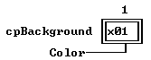

---

<a id="D.0I2V"></a>

### TBackground::TBackground

*Keywords: TBackground::TBackground*

[See Also](#HAZR21)	 [TBackground class](#TBackground)

 Form 1

 
```c
TBackground(const TRect& bounds, char aPattern);
```
 Form 2

 
```c
TBackground( StreamableInit streamableInit);   //protected
```
#### Description
 Form 1:Creates a  TBackgroundclass with the given * boundsby calling the  TViewconstructor. * growModeis set to * gfGrowHiX| * gfGrowHiY, and the * patterndata member is set to * aPattern.

  Form 2:Each streamable class needs a "builder" to allocate the correct memory for its objects together with the initialized vtable pointers. This is achieved by calling this constructor with an argument of type  StreamableInit.

---

<a id="HAZR21"></a>

#### See Also
 [TView::TView](#TView_TView)

 [TBackground::pattern](#F.IMXK)

---

<a id="F.IMXK"></a>

### TBackground::pattern

*Keywords: pattern*

[TBackground class](#TBackground)
#### Syntax
```c
char pattern;    //protected
```
#### Description
 The character giving the view's background.

---

<a id="TBackground_build"></a>

### TBackground::build

*Keywords: build*

[See Also](#19HN3_.)	 [TBackground class](#TBackground)
#### Syntax
```c
static TStreamable *build();
```
#### Description
 Called to create an object in certain stream-reading situations.

---

<a id="19HN3_."></a>

#### See Also
 [TStreamableClass](#TStreamableClass)

 [ipstream::readData](#3MVS.PE)

 [TStreamable](#TStreamable)

---

<a id="TBackground_draw"></a>

### TBackground::draw

*Keywords: draw*

[TBackground class](#TBackground)
#### Syntax
```c
virtual void draw();
```
#### Description
 Fills the background view rectangle with the current * patternin the default color.

---

<a id="73METX"></a>

### TBackground::getPalette

*Keywords: getpalette*

[TBackground class](#TBackground)
#### Syntax
```c
virtual TPalette& getPalette() const;
```
#### Description
 Returns the default background palette string, * cpBackground, "".

---

<a id="TBackground_read"></a>

### TBackground::read

*Keywords: read*

[See Also](#Y84UZD)	 [TBackground class](#TBackground)
#### Syntax
```c
virtual void *read( ipstream& is);   //protected
```
#### Description
 Reads from the input stream * is.

---

<a id="Y84UZD"></a>

#### See Also
 [TStreamable](#TStreamable)

 [ipstream](#ipstream)

---

<a id="TBackground_write"></a>

### TBackground::write

*Keywords: write*

[See Also](#M6OAXF)	 [TBackground class](#TBackground)
#### Syntax
```c
virtual void write( opstream& os);   //protected
```
#### Description
 Writes to the output stream * os.

---

<a id="M6OAXF"></a>

#### See Also
 [TStreamableClass](#TStreamableClass)

 [TStreamable](#TStreamable)

 [opstream](#opstream)

---

<a id="TBufListEntry"></a>

### TBufListEntry Class

*Keywords: TBufListEntry*

[See Also](#P8TK3N)	 [Inheritance](#TVFlow_1)
#### Header File
 buffers.h
#### Description
 TBufListEntry, in conjunction with  TVMemMgr, is used internally by Trbo Vision to create and manage the video cache buffers for group drawing operations. All its members are private and will seldom if ever be referenced explicitly in normal applications.  TVMemMgris a friend class and the global operator  newis a friend function.

---

<a id="P8TK3N"></a>

#### See Also
 [TGroup::draw](#TGroup_draw)

 [TGroup::buffer](#1T8H3XN)

---

<a id="TButton"></a>

### TButton Class

*Keywords: TButton*

[Inheritance](#TVFlow_2)
#### Description
 A  TButtonobject is a box with a title and a shadow that generates a command when pressed. A button can be selected by typing the highlighted letter, by tabbing to the button and pressing Spacebar, by pressing Enter when the button is the default (indicated by highlighting), or by clicking on the button with a mouse.

 With color and black-and-white palettes, a button has a three-dimensional look that moves when selected. On monochrome systems, a button is bordered by brackets, and other ASCII characters are used to indicate whether the button is default, selected, and so on.

 Like the other controls defined in  TDialogs,  TButtonis a "terminal" class. It can be inserted into any group and is intended for use without having to override any of its member functions.

 You initialize a button by passing it a  TRect, a title string, the command to generate when the button is pressed, and * aflags, an unsigned short integer. To define a hot key for the button, the title string may contain tildes () around one of its characters, which then becomes the hot key. The hot-key * aFlagsparameter indicates whether the title should be centered or left justified, and whether the button should be the default (and therefore selectable by Enter).

 There can only be one default button in a window or dialog at any given time. Buttons that are peers in a group grab and release the default state via * evBroadcastmessages. Buttons can be enabled or disabled using  setStateand the  enableCommandand  disableCommandmember functions.

 Constructors

 
```c
TButton
```

```c
1ZGCN2P(const TRect& bounds, const char *aTitle, ushort aCommand, ushort aFlags);

  TButton
```

```c
1ZGCN2P( StreamableInit streamableInit );   //protected

 ~ TButton
```

```c
1ZGCN2P();
```
 Data members

 
```c
const char * title
```

```c
TButton_title;
```
 Protected Data members

 
```c
Boolean  amDefault
```

```c
128DJCT;   //protected

 ushort  command
```

```c
2XYFZ78;   //protected

 uchar  flags
```

```c
TButton_flags;   //protected
```
#### Member Functions
```c
static TStreamable * build
```

```c
TButton_build();

 virtual void  draw
```

```c
TButton_draw();

 void  drawState
```

```c
9326FV(Boolean down);

 virtual TPalette&  getPalette
```

```c
4O2M_TQ() const;

 virtual void  handleEvent
```

```c
BC5CFF(TEvent& event);

 void  makeDefault
```

```c
DYZRQ.(Boolean enable);

 void  press
```

```c
TButton_press();

 virtual void * read
```

```c
TButton_read( ipstream& is);   //protected

 void  setState
```

```c
21JTB4M(ushort aState, Boolean enable);

 virtual void  write
```

```c
TButton_write( opstream& os);   //protected
```
 Palette

 Button objects use the default palette * cpButtonto map onto * cpDialogpalette entries10 through 15.

 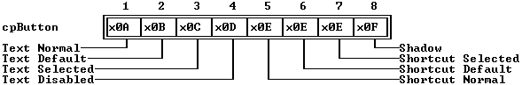

---

<a id="1ZGCN2P"></a>

### TButton::TButton

*Keywords: TButton::TButton*

[See Also](#1K_G_JA)	 [TButton class](#TButton)

 Form 1

 
```c
TButton(const TRect& bounds, const char *aTitle, ushort aCommand, ushort aFlags);
```
 Form 2

 
```c
TButton( StreamableInit streamableInit );   //protected
```
#### Description
 Form 1:Creates a  TButtonclass with the given size by calling the constructor  TView(* bounds). The * aTitlestring is assigned to * title. If the * bfDefaultbit is set in * aFlags, this button will be highlighted as the default button. The button title will be centered if the * bfLeftJustbit is clear, or left-justified if * bfLeftJustis set.

 The * optionsdata member is set to (* ofSelectable| * ofFirstClick| * ofPreProcess| * ofPostProcess) so that by default  TButtonresponds to these events. * eventMaskis set to * evBroadcast. The value of * aCommandsets the * statedata member: If the given * aCommandis not enabled, * sfDisabledis set in the * statedata member.

 Form 2:Each streamable class needs a "builder" to allocate the correct memory for its objects together with the initialized vtable pointers. This is achieved by calling this constructor with an argument of type  StreamableInit.

 Destructor

 
```c
~TButton();
```
 Frees the memory assigned to the button's * title then destroys the view with  ~TView.

---

<a id="1K_G_JA"></a>

#### See Also
 [TView::TView](#TView_TView)

---

<a id="128DJCT"></a>

### TButton::amDefault

*Keywords: amDefault*

[TButton class](#TButton)
#### Syntax
```c
Boolean amDefault;   //protected
```
#### Description
 If * True, the button is the default (and therefore selected when Enter is pressed). Otherwise, the button is "normal."

---

<a id="2XYFZ78"></a>

### TButton::command

*Keywords: command*

[See Also](#0D5RSM)	 [TButton class](#TButton)
#### Syntax
```c
ushort command;   //protected
```
#### Description
 The command word of the event generated when this button is pressed.

---

<a id="0D5RSM"></a>

#### See Also
 [TButton::TButton](#1ZGCN2P)

---

<a id="TButton_flags"></a>

### TButton::flags

*Keywords: flags*

[See Also](#V3U6VE)	 [TButton class](#TButton)
#### Syntax
```c
uchar flags;   //protected
```
#### Description
 *flagsis a bitmapped data member used to indicate whether button text is left-justified or centered.

---

<a id="V3U6VE"></a>

#### See Also
 [TButton::draw](#TButton_draw)

---

<a id="TButton_title"></a>

### TButton::title

*Keywords: title*

[TButton class](#TButton)
#### Syntax
```c
const char *title;
```
#### Description
 A string giving the label text for the button.

---

<a id="TButton_build"></a>

### TButton::build

*Keywords: build*

[See Also](#LZ1GUA)	 [TButton class](#TButton)
#### Syntax
```c
static TStreamable *build();
```
#### Description
 Called to create an object in certain stream-reading situations.

---

<a id="LZ1GUA"></a>

#### See Also
 [TStreamableClass](#TStreamableClass)

 [ipstream::readData](#3MVS.PE)

---

<a id="TButton_draw"></a>

### TButton::draw

*Keywords: draw*

[See Also](#D.OW__)	 [TButton class](#TButton)
#### Syntax
```c
virtual void draw();
```
#### Description
 Draws the button by calling  TButton::drawState(* False).

---

<a id="D.OW__"></a>

#### See Also
 [TButton::drawState](#9326FV)

---

<a id="9326FV"></a>

### TButton::drawState

*Keywords: drawState*

[See Also](#WIW2W_)	 [TButton class](#TButton)
#### Syntax
```c
void drawState(Boolean down);
```
#### Description
 Draws the button in the "down" state (no shadow) if * downis * True; otherwise, it draws the button in the "up" state if * downis * False. The appropriate palettes are used to reflect the current state (normal, default, disabled). The button label is positioned according to the * bfLeftJustbit in the * flagsdata member.

---

<a id="WIW2W_"></a>

#### See Also
 [TButton::draw](#TButton_draw)

 [bf XXXX flags](#bfXXXX)

---

<a id="4O2M_TQ"></a>

### TButton::getPalette

*Keywords: getpalette*

[TButton class](#TButton)
#### Syntax
```c
virtual TPalette& getPalette() const;
```
#### Description
 Returns the default button palette string, * cpButton,

 "ABCDEEEF".

---

<a id="BC5CFF"></a>

### TButton::handleEvent

*Keywords: handleEvent*

[See Also](#_FSDVT)	 [TButton class](#TButton)
#### Syntax
```c
virtual void handleEvent(TEvent& event);
```
#### Description
 There are three ways to initiate  handleEvent: (1) a mouse click on the button, (2) by having its hot key pressed, or (3) by being the default button when a * cmDefaultbroadcast arrives. When the button is pressed, a command event is generated with  TView::putEvent, with the * TButton::commanddata member assigned to * event::commandand * event::infoPtrset to  this.

 Buttons also recognize the broadcast commands * cmGrabDefaultand * cmReleaseDefault, to become or "unbecome" the default button, as appropriate, and * cmCommandSetChanged, which causes them to check whether their commands have been enabled or disabled.

---

<a id="_FSDVT"></a>

#### See Also
 [TView::handleEvent](#4H2TBJ)

---

<a id="DYZRQ."></a>

### TButton::makeDefault

*Keywords: makeDefault*

[See Also](#XWA9_G)	 [TButton class](#TButton)
#### Syntax
```c
void makeDefault(Boolean enable);
```
#### Description
 Used to make this button the default with * enableset * True, or to release the default with * enableset * False. These changes are usually the result of tabbing within a dialog box. The status is changed without actually operating the button. The default button can be subsequently "pressed" by using the Enter key.  makeDefaultdoes nothing if the button is already the default button. Otherwise, the button's owner is told of the change in the button's default status. If * enableis * Truethe * cmGrabDefaultcommand is broadcast; otherwise, the * cmReleaseDefaultis broadcast. The button is redrawn if necessary to show the new status.

---

<a id="XWA9_G"></a>

#### See Also
 [TButton::amDefault](#128DJCT)

 [TButton::press](#TButton_press)

 [bfDefault](#bfXXXX)

---

<a id="TButton_press"></a>

### TButton::press

*Keywords: press*

[TButton class](#TButton)
#### Syntax
```c
void press();
```
#### Description
 pressbroadcasts a message that a button press event has occurred. Used internally by  handleEventwhen a mouse click "press" is detected when the default button is "pressed" with the Enter key.

---

<a id="TButton_read"></a>

### TButton::read

*Keywords: read*

[See Also](#4YVG_PK)	 [TButton class](#TButton)
#### Syntax
```c
virtual void *read( ipstream& is);   //protected
```
#### Description
 Reads from the input stream * is.

---

<a id="4YVG_PK"></a>

#### See Also
 [TStreamableClass](#TStreamableClass)

 [TStreamable](#TStreamable)

 [ipstream](#ipstream)

---

<a id="21JTB4M"></a>

### TButton::setState

*Keywords: setstate*

[See Also](#HB4IY1)	 [TButton class](#TButton)
#### Syntax
```c
void setState(ushort aState, Boolean enable);
```
#### Description
 Calls  TView::setState(* aState, * enable), then  drawViews the button if the button has been made * sfSelectedor * sfActive. If focus is received (that is, if * aStateis * sfFocused), the button grabs or releases default from the default button by calling  makeDefault(* enable).

---

<a id="HB4IY1"></a>

#### See Also
 [TView::setState](#DL958G)

 [TButton::makeDefault](#DYZRQ.)

---

<a id="TButton_write"></a>

### TButton::write

*Keywords: write*

[See Also](#5H2VEK)	 [TButton class](#TButton)
#### Syntax
```c
virtual void write( opstream& os);   //protected
```
#### Description
 Writes to the output stream * os.

---

<a id="5H2VEK"></a>

#### See Also
 [TStreamableClass](#TStreamableClass)

 [TStreamable](#TStreamable)

 [opstream](#opstream)

---

<a id="TChDirDialog"></a>

### TChDirDialog Class

*Keywords: TChDirDialog*

[Inheritance](#TVFlow_1)
#### Header File
 stddlg.h
#### Description
 TChDirDialogimplements a dialog box labeled "Change Directory". An input line is provided to accept a directory name from the user. A history window and directory list box with vertical scroll bar are available to show recent directory selections and a tree of all available directories. Mouse and keyboard selections can be made in the usual way by highlighting and clicking. The displayed options are:

|  | Directory  name |
| --- | --- |
|  | Directory  tree |
|  | O K(the default) |
|  | Chdir |
|  | Revert |
|  | Help |

 TChDirDialog::handleEventgenerates the appropriate commands for these selections.

  TDirListBoxis a friend of  TChDirDialog, so that the member functions of  TDirListBoxcan access the private members of  TChDirDialog:  setUpDialog, * dirInput, * dirList, * okButton, and * chDirButton.

 Command Constants

 
```c
The following commands are generated by  TChDirDialog
```

```c
:
```
 Constant	 Value	 Meaning

 

| * cmChangeDir | 1005 | Generated when Chdir is selected |
| --- | --- | --- |
| * cmRevert | 1006 | Generated when Revert is selected |

 Constructor

 
```c
TChDirDialog
```

```c
FOMRD7(ushort aOptions, ushort histId);
```
#### Member Functions
```c
static TStreamable  *build
```

```c
TChDirDialog_build();

 virtual ushort  dataSize
```

```c
_XIAU0();

 virtual void  getData
```

```c
11_OL23(void *rec);

 virtual void  handleEvent
```

```c
7UK7MH(TEvent& event);

 virtual void  *read
```

```c
TChDirDialog_read(ipstream& os);   //protected

 virtual void  setData
```

```c
1DKZSRP(void *rec);

 virtual void  shutDown
```

```c
QBTOGJ();

 virtual Boolean  valid
```

```c
TChDirDialog_valid(ushort command);

 virtual void  write
```

```c
TChDirDialog_write(opstream& os);   //protected
```

---

<a id="FOMRD7"></a>

### TChDirDialog::TChDirDialog

*Keywords: TChDirDialog::TChDirDialog*

[TChDirDialog class](#TChDirDialog)
#### Syntax
```c
TChDirDialog(ushort aOptions, ushort histId);
```
#### Description
 Creates a change directory dialog object with the given history ID. The * aOptionsargument can be set as follows:

|  | * cdNormal: option to use the dialog immediately. |
| --- | --- |
|  | * cdNoLoadDir: option to initialize the dialog without loading the current directory into the dialog. Used if you intend to use  setDatato reset the directory, or prior to storage on a stream. |
|  | * cdHelpButton: option to put a help button in the dialog. |

 The constructor creates and inserts a  TInputLineobject (labeled "Directory n~ame"), a  THistoryobject, a vertical scroll bar, a  TDirListBoxobject (labeled "Directory ~t~ree"), and three buttons ("O~K~", "~C~hdir", "~R~evert"). If * aOptionshas the * cdHelpButtonflag set, a fourth help button is created. Unless the * cdNoLoadDiroption is set, the dialog box is loaded with the current directory.

---

<a id="TChDirDialog_build"></a>

### TChDirDialog::build

*Keywords: build*

[See Also](#1TCEXY)	 [TChDirDialog class](#TChDirDialog)
#### Syntax
```c
static TStreamable *build();
```
#### Description
 Called to create an object in certain stream-reading situations.

---

<a id="1TCEXY"></a>

#### See Also
 [TStreamableClass](#TStreamableClass)

 [ipstream::readData](#3MVS.PE)

---

<a id="_XIAU0"></a>

### TChDirDialog::dataSize

*Keywords: dataSize*

[See Also](#1N7_7OT)	 [TChDirDialog class](#TChDirDialog)
#### Syntax
```c
virtual ushort dataSize();
```
#### Description
 By default,  dataSizereturns 0. Override to return the size (in bytes) of the data used by  getDataand  setData to store and retrieve dialog box input data.

---

<a id="1N7_7OT"></a>

#### See Also
 [TView::dataSize](#1MP16EK)

 [TView::setData](#XH19WS)

 [TView::getData](#E9Q276)

---

<a id="11_OL23"></a>

### TChDirDialog::getData

*Keywords: getData*

[See Also](#PDN02R)	 [TChDirDialog class](#TChDirDialog)
#### Syntax
```c
virtual void getData(void *rec);
```
#### Description
 By default,  getDatadoes nothing. Override to copy  dataSizebytes from the view to * rec. Used in combination with  dataSizeand  setDatato store and retrieve dialog box input data.

---

<a id="PDN02R"></a>

#### See Also
 [TView::dataSize](#1MP16EK)

 [TView::setData](#XH19WS)

 [TView::getData](#E9Q276)

---

<a id="7UK7MH"></a>

### TChDirDialog::handleEvent

*Keywords: handleEvent*

[See Also](#12LT3YQ)	 [TChDirDialog class](#TChDirDialog)
#### Syntax
```c
virtual void handleEvent(TEvent& event);
```
#### Description
 Calls  TDialog::handleEventthen processes * cmRevert(restore previously current directory) and * cmChangeDir(switch to selected directory) events. The dialog is redrawn if necessary.

---

<a id="12LT3YQ"></a>

#### See Also
 [TDialog::handleEvent](#AW0Q7G)

---

<a id="TChDirDialog_read"></a>

### TChDirDialog::read

*Keywords: read*

[See Also](#4IKC_Y9)	 [TChDirDialog class](#TChDirDialog)
#### Syntax
```c
virtual void *read(ipstream& os);   //protected
```
#### Description
 Reads from the input stream * is.

---

<a id="4IKC_Y9"></a>

#### See Also
 [TStreamableClass](#TStreamableClass)

 [ipstream](#ipstream)

---

<a id="1DKZSRP"></a>

### TChDirDialog::setData

*Keywords: setData*

[See Also](#8A1R4R)	 [TChDirDialog class](#TChDirDialog)
#### Syntax
```c
virtual void setData(void *rec);
```
#### Description
 By default,  setDatadoes nothing. Override to copy  dataSizebytes from * recto the view. Used in combination with  dataSizeand  getDatato store and retrieve dialog box input data.

---

<a id="8A1R4R"></a>

#### See Also
 [TView::dataSize](#1MP16EK)

 [TView::setData](#XH19WS)

 [TView::getData](#E9Q276)

---

<a id="QBTOGJ"></a>

### TChDirDialog::shutDown

*Keywords: shutDown*

[TChDirDialog class](#TChDirDialog)
#### Syntax
```c
virtual void shutDown();
```
#### Description
 Used internally by  TObject::destroyto ensure correct destruction of derived and related objects.  shutDownis overridden in many classes to ensure the proper setting of related data members when  destroyis called.

---

<a id="TChDirDialog_valid"></a>

### TChDirDialog::valid

*Keywords: valid*

[See Also](#NOJVED)	 [TChDirDialog class](#TChDirDialog)
#### Syntax
```c
virtual Boolean valid(ushort command);
```
#### Description
 Returns * Trueif * commandis other than * cmOK. If the OK button has been pressed,  validchecks the input line and returns * Truefor a valid directory. An invalid directory invokes the "Invalid directory" message box and returns * False.

---

<a id="NOJVED"></a>

#### See Also
 [TDialog::valid](#TDialog_valid)

---

<a id="TChDirDialog_write"></a>

### TChDirDialog::write

*Keywords: write*

[See Also](#7KPT5H)	 [TChDirDialog class](#TChDirDialog)
#### Syntax
```c
virtual void write(opstream& os);   //protected
```
#### Description
 Writes to the output stream * os.

---

<a id="7KPT5H"></a>

#### See Also
 [TStreamableClass](#TStreamableClass)

 [opstream](#opstream)

---

<a id="TCheckBoxes"></a>

### TCheckBoxes Class

*Keywords: TCheckBoxes*

[Inheritance](#TVFlow_2)
#### Header File
 dialogs.h
#### Description
 TCheckBoxesis a specialized cluster of one to sixteen controls. Unlike radio buttons, any number of check boxes can be marked independently, so there is no default check box in the group. Marking can be done with mouse clicks, cursor movements, and Alt-letter shortcuts. Each check box can be highlighted and toggled on/off (with the Spacebar). An * Xappears in the box when it is selected. Other parts of your application typically examine the state of the check boxes to determine which options have been chosen by the user. Check box clusters are often associated with  TLabelobjects.

 Constructors

 
```c
TCheckBoxes
```

```c
._VWQL(const TRect& bounds, TSItem *aStrings);

  TCheckBoxes
```

```c
._VWQL(StreamableInit streamableInit);   //protected
```
 Data members

 Apart from * value, * sel, and certain strings, which are all inherited from  TCluster, there are no other public data members. The  ushort* valueis interpreted as a set of 16 bits (0 through 15), with a 1 in the * item'th bit position, meaning that the * item'th check box is marked.

 Member functions

 
```c
static TStreamable * build
```

```c
TCheckBoxes_build();

 virtual void  draw
```

```c
TCheckBoxes_draw();

 virtual Boolean  mark
```

```c
TCheckBoxes_mark(int item);

 virtual void  press
```

```c
TCheckBoxes_press(int item);
```
 Palette

 By default, check box objects use * cpCluster, the default palette for all cluster objects.

 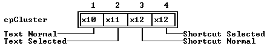

---

<a id="._VWQL"></a>

### TCheckBoxes::TCheckBoxes

*Keywords: TCheckBoxes::TCheckBoxes*

[See Also](#323HHM3)	 [TCheckBoxes class](#TCheckBoxes)

 Form 1

 
```c
TCheckBoxes(const TRect& bounds, TSItem *aStrings);
```
 Form 2

 
```c
TCheckBoxes(StreamableInit streamableInit);   //protected
```
#### Description
 Form 1:Invokes the constructors  TCluster(* bounds, * aStrings) and  TView(* bounds) to create a  TCheckBoxobject with the given * bounds. The  TStringCollectionstringsdata member is set from the * aStringsargument, a linked list of  TSItemobjects. The * seland * valuedata members are set to zero. * optionsis set to (* ofSelectable | ofFirstClick | ofPreProcess | ofPostProcess).

  Form 2:Each streamable class needs a "builder" to allocate the correct memory for its objects together with the initialized vtable pointers. This is achieved by calling this constructor with an argument of type  StreamableInit.

 Destructor

 TCheckBoxesuses  TClusterthe base class destructor to delete strings. The  TViewdestructor then disposes of the view.

---

<a id="323HHM3"></a>

#### See Also
 [TCluster::TCluster](#1MX4.PM)

 [TSItem](#TSItem)

---

<a id="TCheckBoxes_build"></a>

### TCheckBoxes::build

*Keywords: build*

[See Also](#54J6_FC)	 [TCheckBoxes class](#TCheckBoxes)
#### Syntax
```c
static TStreamable *build();
```
#### Description
 Called to create an object in certain stream-reading situations.

---

<a id="54J6_FC"></a>

#### See Also
 [TStreamableClass](#TStreamableClass)

 [ipstream::readData](#3MVS.PE)

---

<a id="TCheckBoxes_draw"></a>

### TCheckBoxes::draw

*Keywords: draw*

[See Also](#SISDVL)	 [TCheckBoxes class](#TCheckBoxes)
#### Syntax
```c
virtual void draw();
```
#### Description
 Draws the TCheckBoxes object by calling the inherited TCluster::drawBox member function. The default check box is " [ ] " when unselected and " [X] " when selected.

 Note that if the boundaries of the view are sufficiently wide, check boxes can be displayed in multiple columns.

---

<a id="SISDVL"></a>

#### See Also
 [TCluster::drawBox](#OL_.8P)

---

<a id="TCheckBoxes_mark"></a>

### TCheckBoxes::mark

*Keywords: mark*

[See Also](#JN2XWO)	 [TCheckBoxes class](#TCheckBoxes)
#### Syntax
```c
virtual Boolean mark(int item);
```
#### Description
 Returns * Trueif the * item'th bit of * valueis set; that is, if the * item'th check box is marked. These bits have no intrinsic meaning. You are free to override mark, press, and other check box member functions to give * valueyour own interpretation. By default, the items are numbered 0 through 15 and each bit of * valuerepresents the state (on or off) of a check box.

---

<a id="JN2XWO"></a>

#### See Also
 [TCheckBoxes::press](#TCheckBoxes_press)

 [TCluster::value](#TCluster_value)

---

<a id="TCheckBoxes_press"></a>

### TCheckBoxes::press

*Keywords: press*

[See Also](#DYT4WZ)	 [TCheckBoxes class](#TCheckBoxes)
#### Syntax
```c
virtual void press(int item);
```
#### Description
 Toggles the * item'th bit of * value. These bits have no intrinsic meaning. You are free to override mark, press, and other check box member functions to give * valueyour own interpretation. By default, the items are numbered 0 through 15.

---

<a id="DYT4WZ"></a>

#### See Also
 [TCheckBoxes::mark](#TCheckBoxes_mark)

 [TCluster::value](#TCluster_value)

---

<a id="TCluster"></a>

### TCluster Class

*Keywords: TCluster*

InheritanceTVFlow_2
#### Header File
 dialogs.h
#### Description
 A cluster is a group of controls that all respond in the same way.  TClusteris an abstract class from which the useful group controls such as  TRadioButtons,  TCheckBoxes, and  TMonoSelectorare derived. Cluster controls are often associated with  TLabelobjects, letting you select the control by selecting on the adjacent explanatory label.

 While buttons are used to generate commands and input lines are used to edit strings, clusters are used to toggle bit values in the * valuedata member, which is of type  ushort. The two standard descendants of  TClusteruse different algorithms when changing * value:  TCheckBoxessimply toggles a bit, while  TRadioButtonstoggles the enabled one and clears the previously selected bit. Both inherit most of their behavior from  TCluster.

 Constructor

 
```c
TCluster
```

```c
1MX4.PM(const TRect& bounds, TSItem *aStrings);

  TCluster
```

```c
1MX4.PM( StreamableInit streamableInit);   //protected

 ~ TCluster
```

```c
1MX4.PM();
```
#### Data Members
```c
int  sel
```

```c
TCluster_sel;

 TStringCollection * strings
```

```c
73HRF3;

 unsigned long  value
```

```c
TCluster_value;
```
#### Member Functions
```c
virtual Tstreamable * build
```

```c
TCluster_build();

 virtual ushort  dataSize
```

```c
62G.T_();

 void  drawBox
```

```c
OL_.8P(const char *icon, char marker);

 void  drawMultiBox
```

```c
3YHTAD( const char *icon, const char *marker );

 virtual void  getData
```

```c
O9P_5O(void *rec);

 ushort  getHelpCtx
```

```c
15GIIVZ();

 virtual TPalette&  getPalette
```

```c
8OO5SN() const;

 virtual void  handleEvent
```

```c
57NK_NG(TEvent& event) const;

 virtual Boolean  mark
```

```c
TCluster_mark(int item);

 virtual void  movedTo
```

```c
1FGGCR3(int item);

 virtual void  press
```

```c
TCluster_press(int item);

 virtual void * read
```

```c
TCluster_read( ipstream& is);...//protected

 virtual void  setData
```

```c
1TQ.DBQ(void *rec);

 virtual void  setState
```

```c
.A.0JY(ushort aState, Boolean enable);

 virtual void  write
```

```c
TCluster_write( opstream& os);...//protected
```
 Palette

 TClusterobjects use * cpCluster, the default palette for all cluster objects, to map onto entries 16 through 18 of the standard dialog box palette.

 

---

<a id="1MX4.PM"></a>

### TCluster::TCluster

*Keywords: TCluster::TCluster*

See Also2.GHUW3	  TCluster classTCluster

 Form 1

 
```c
TCluster(const TRect& bounds, TSItem *aStrings);
```
 Form 2

 
```c
TCluster( StreamableInit streamableInit);   //protected
```
#### Description
 Form 1:Calls  TView(* bounds) to create a  TClusterobject with the given * bounds. Clears the * valueand * seldata members. The  TStringCollectionstringsdata member is set from the * aStringsargument, a linked list of  TSItemobjects.

  Form 2:Each streamable class needs a "builder" to allocate the correct memory for its objects together with the initialized vtable pointers. This is achieved by calling this constructor with an argument of type  StreamableInit.

 Destructor

 
```c
~TCluster();
```
#### Description
 Deletes the cluster's string collection, then destroys the view with  ~TView.

---

<a id="2.GHUW3"></a>

#### See Also
 TSItemTSItem

 TView::TViewTView_TView

---

<a id="TCluster_sel"></a>

### TCluster::sel

*Keywords: sel*

TCluster classTCluster
#### Syntax
```c
int sel;
```
#### Description
 The currently selected item of the cluster.

---

<a id="73HRF3"></a>

### TCluster::strings

*Keywords: strings*

TCluster classTCluster
#### Syntax
```c
TStringCollection *strings;
```
#### Description
 The list of items in the cluster.

---

<a id="TCluster_value"></a>

### TCluster::value

*Keywords: value*

TCluster classTCluster
#### Syntax
```c
unsigned long value;
```
#### Description
 Current value of the control. The actual meaning of this data member is determined by the member functions developed in the classes derived from  TCluster. For example,  TCheckBoxesinterprets each of the 32 bits of * valueas the state (on or off) of 32 distinct check boxes. In  TRadioButtons, on the other hand, * valuecan represent the state of a cluster of up to 4 billion buttons, since only one radio button can be "on" at any one time.

---

<a id="TCluster_build"></a>

### TCluster::build

*Keywords: build*

See Also1QI6R4O	  TCluster classTCluster
#### Syntax
```c
virtual Tstreamable *build();
```
#### Description
 Called to create an object in certain stream-reading situations.

---

<a id="1QI6R4O"></a>

#### See Also
 TStreamableClassTStreamableClass

  ipstream::readData3MVS.PE

---

<a id="62G.T_"></a>

### TCluster::dataSize

*Keywords: dataSize*

See Also_E.0OT	  TCluster classTCluster
#### Syntax
```c
virtual ushort dataSize();
```
#### Description
 Returns the size of * value. Must be overridden in derived classes that change * valueor add other data members, in order to work with  getDataand  setData.

---

<a id="_E.0OT"></a>

#### See Also
 TCluster::getDataO9P_5O

  TCluster::setData1TQ.DBQ

---

<a id="OL_.8P"></a>

### TCluster::drawBox

*Keywords: drawBox*

See Also3T2V_MJ	  TCluster classTCluster
#### Syntax
```c
void drawBox(const char *icon, char marker);
```
#### Description
 Called by the  drawmember functions of derived classes to draw the box in front of the string for each item in the cluster. * iconis a five-character string (" [ ] " for check boxes, " ( ) " for radio buttons). * markeris the character to use to indicate the box has been marked ("X" for check boxes, "·" for radio buttons).

---

<a id="3T2V_MJ"></a>

#### See Also
 TCheckBoxes::drawTCheckBoxes_draw

  TRadioButtons::drawTRadioButtons_draw

---

<a id="3YHTAD"></a>

### TCluster::drawMultiBox

*Keywords: drawMultiBox*

TCluster classTCluster
#### Syntax
```c
void drawMultiBox( const char *icon, const char *marker );
```
#### Description
 Called by the draw member functions of the  TMultiCheckBoxclass to draw the box in front of the string for each item in the cluster. * iconis a five-character string (" [ ] "). * markeris a string of characters that are used to indicate the current state of the item.

---

<a id="O9P_5O"></a>

### TCluster::getData

*Keywords: getData*

See Also1UP9IB	  TCluster classTCluster
#### Syntax
```c
virtual void getData(void *rec);
```
#### Description
 Writes the * valuedata member to the given record and calls  drawView. Must be overridden in derived classes that change the * valuedata member in order to work with  dataSizeand  setData.

---

<a id="1UP9IB"></a>

#### See Also
 TCluster::dataSize62G.T_

  TCluster::setData1TQ.DBQ

  TView::drawView8P08.AT

---

<a id="15GIIVZ"></a>

### TCluster::getHelpCtx

*Keywords: getHelpCtx*

TCluster classTCluster
#### Syntax
```c
ushort getHelpCtx();
```
#### Description
 Returns (* sel+ * helpCtx). This enables you to have separate help contexts for each item in the cluster. Use it to reserve a range of help contexts equal to * helpCtxplus the number of cluster items minus one.

---

<a id="8OO5SN"></a>

### TCluster::getPalette

*Keywords: getpalette*

TCluster classTCluster
#### Syntax
```c
virtual TPalette& getPalette() const;
```
#### Description
 Returns a pointer to the default palette, * cpCluster, "\".

---

<a id="57NK_NG"></a>

### TCluster::handleEvent

*Keywords: handleEvent*

See AlsoKPT7PH	  TCluster classTCluster
#### Syntax
```c
virtual void handleEvent(TEvent& event) const;
```
#### Description
 Calls  TView::handleEvent, then handles all mouse and keyboard events appropriate to this cluster. Controls are selected by mouse click or cursor movement keys (including Spacebar). The cluster is redrawn to show the selected controls.

---

<a id="KPT7PH"></a>

#### See Also
 TView::handleEvent4H2TBJ

---

<a id="TCluster_mark"></a>

### TCluster::mark

*Keywords: mark*

See AlsoN78P.P	  TCluster classTCluster
#### Syntax
```c
virtual Boolean mark(int item);
```
#### Description
 Called by  drawto determine which items are marked. The default  TCluster::markreturns * False.  markshould be overridden to return * Trueif the * item'th control in the cluster is marked; otherwise, it should return * False.

---

<a id="N78P.P"></a>

#### See Also
 TCheckBoxes::markTCheckBoxes_mark

  TRadioButtons::markTRadioButtons_mark

---

<a id="1FGGCR3"></a>

### TCluster::movedTo

*Keywords: movedTo*

TCluster classTCluster
#### Syntax
```c
virtual void movedTo(int item);
```
#### Description
 Called by  handleEventto move the selection bar to the * item'th control of the cluster.

---

<a id="TCluster_press"></a>

### TCluster::press

*Keywords: press*

See AlsoH10G05	  TCluster classTCluster
#### Syntax
```c
virtual void press(int item);
```
#### Description
 Called by  handleEventwhen the * item'th control in the cluster is pressed either by mouse click or keyboard event.

---

<a id="H10G05"></a>

#### See Also
 TCheckBoxes::pressTCheckBoxes_press

  TRadioButtons::pressTRadioButtons_press

---

<a id="TCluster_read"></a>

### TCluster::read

*Keywords: read*

See AlsoL6RPWA	  TCluster classTCluster
#### Syntax
```c
virtual void *read( ipstream& is);...//protected
```
#### Description
 Reads from the input stream * is.

---

<a id="L6RPWA"></a>

#### See Also
 TStreamableClassTStreamableClass

  TStreamableTStreamable

  ipstreamipstream

---

<a id="1TQ.DBQ"></a>

### TCluster::setData

*Keywords: setData*

See AlsoT9KPO7	  TCluster classTCluster
#### Syntax
```c
virtual void setData(void *rec);
```
#### Description
 Reads the * valuedata member from the given record and calls  drawView. Must be overridden in derived cluster types that require other data members to work with  dataSizeand  getData.

---

<a id="T9KPO7"></a>

#### See Also
 TCluster::dataSize62G.T_

  TCluster::getDataO9P_5O

  TView::drawView8P08.AT

---

<a id=".A.0JY"></a>

### TCluster::setState

*Keywords: setstate*

See AlsoZZYVWQ	  TCluster classTCluster
#### Syntax
```c
virtual void setState(ushort aState, Boolean enable);
```
#### Description
 Calls  TView::setState, then calls  drawViewif * aStateis * sfSelected.

---

<a id="ZZYVWQ"></a>

#### See Also
 TView::setStateDL958G

  TView::drawView8P08.AT

---

<a id="TCluster_write"></a>

### TCluster::write

*Keywords: write*

See AlsoGXW68I	  TCluster classTCluster
#### Syntax
```c
virtual void write( opstream& os);...//protected
```
#### Description
 Writes to the output stream * os.

---

<a id="GXW68I"></a>

#### See Also
 TStreamableClassTStreamableClass

  TStreamableTStreamable

  opstreamopstream

---

<a id="TColorGroupList"></a>

### TColorGroupList Class

*Keywords: TColorGroupList*

[Inheritance](#TVFlow_2)
#### Header File
 colorsel.h
#### Description
 The interrelated classes  TColorItem,  TColorGroup,  TColorSelector,  TMonoSelector,  TColorDisplay,  TColorGroupList,  TColorItemList, and  TColorDialog provide viewers and dialog boxes from which the user can select and change the color assignments from available palettes with immediate effect on the screen.

  TColorGroupList is a specialized derivative of  TListViewer providing a scrollable list of named color groups. Groups can be selected in any of the usual ways (by mouse or keyboard).  TColorGroupList uses the  TListViewer event handler without modification.

 Constructor

 
```c
TColorGroupList
```

```c
4DTF_XH( const TRect& bounds, TScrollBar *aScrollBar, TColorGroup *aGroups);

 virtual ~ TColorGroupList
```

```c
4DTF_XH();
```
#### Data Members
```c
TColorGroup * groups
```

```c
VDNHY4;   //protected
```
#### Member Functions
```c
static TStreamable * build
```

```c
TColorGroupList_build();

 virtual void  focusItem
```

```c
LCLB09( short item );

 virtual void  getText
```

```c
2TJ20YE( char *dest, short item, short maxLen );

 virtual void * read
```

```c
TColorGroupList_read( ipstream& is);   //protected

 virtual void  write
```

```c
TColorGroupList_write( opstream& os);   //protected
```

---

<a id="4DTF_XH"></a>

### TColorGroupList::TColorGroupList

*Keywords: TColorGroupList::TColorGroupList*

[TColorGroupList class](#TColorGroupList)
#### Syntax
```c
TColorGroupList( const TRect& bounds, TScrollBar *aScrollBar, TColorGroup *aGroups);
```
#### Description
 Calls  TListViewer( bounds, 1, 0, aScrollBar) to create a single-column list viewer with a single vertical scroll bar. Then, sets * groupsto * aGroups.

 Destructor

 
```c
virtual ~TColorGroupList();
```
 Destroys the list viewer and all associated groups and their items.

---

<a id="VDNHY4"></a>

### TColorGroupList::groups

*Keywords: groups*

[TColorGroupList class](#TColorGroupList)
#### Syntax
```c
TColorGroup *groups;   //protected
```
#### Description
 The color group for this list viewer.

---

<a id="TColorGroupList_build"></a>

### TColorGroupList::build

*Keywords: build*

[See Also](#LI5_O0)	 [TColorGroupList class](#TColorGroupList)
#### Syntax
```c
static TStreamable *build();
```
#### Description
 Called to create an object in certain stream-reading situations.

---

<a id="LI5_O0"></a>

#### See Also
 [TStreamableClass](#TStreamableClass)

 [ipstream::readData](#3MVS.PE)

---

<a id="LCLB09"></a>

### TColorGroupList::focusItem

*Keywords: focusItem*

[See Also](#WH28UW)	 [TColorGroupList class](#TColorGroupList)
#### Syntax
```c
virtual void focusItem( short item );
```
#### Description
 Selects the given * itemby calling  TListViewer::focusItem( * item) and then broadcasts a * cmNewColorItemevent.

---

<a id="WH28UW"></a>

#### See Also
 [TListViewer::focusItem](#125_J34)

---

<a id="2TJ20YE"></a>

### TColorGroupList::getText

*Keywords: getText*

[TColorGroupList class](#TColorGroupList)
#### Syntax
```c
virtual void getText( char *dest, short item, short maxLen );
```
#### Description
 Copies the group name corresponding to * itemto the * deststring.

---

<a id="TColorGroupList_read"></a>

### TColorGroupList::read

*Keywords: read*

[See Also](#MPLTA8)	 [TColorGroupList class](#TColorGroupList)
#### Syntax
```c
virtual void *read( ipstream& is);   //protected
```
#### Description
 Reads from the input stream * is.

---

<a id="MPLTA8"></a>

#### See Also
 [TStreamableClass](#TStreamableClass)

 [TStreamable](#TStreamable)

 [ipstream](#ipstream)

---

<a id="TColorGroupList_write"></a>

### TColorGroupList::write

*Keywords: write*

[See Also](#1DINKC9)	 [TColorGroupList class](#TColorGroupList)
#### Syntax
```c
virtual void write( opstream& os);   //protected
```
#### Description
 Writes to the output stream * os.

---

<a id="1DINKC9"></a>

#### See Also
 [TStreamableClass](#TStreamableClass)

 [TStreamable](#TStreamable)

 [opstream](#opstream)

---

<a id="TColorItemList"></a>

### TColorItemList Class

*Keywords: TColorItemList*

[Inheritance](#TVFlow_2)
#### Header File
 colorsel.h
#### Description
 The interrelated classes  TColorItem,  TColorGroup,  TColorSelector,  TMonoSelector,  TColorDisplay,  TColorGroupList,  TColorItemList, and  TColorDialog provide viewers and dialog boxes from which the user can select and change the color assignments from available palettes with immediate effect on the screen.

  TColorItemList is a simpler variant of  TColorGroupList for viewing and selecting single color items rather than groups of colors. Like  TColorGroupList,  TColorItemList is specialized derivative of  TListViewer. Color items can be selected in any of the usual ways (by mouse or keyboard). Unlike  TColorGroupList,  TColorItemList overrides the  TListViewer event handler.

 Constructor

 
```c
TColorItemList
```

```c
AE3XIQ( const TRect& bounds, TScrollBar *aScrollBar, TColorItem *aItems );

  TColorItemList
```

```c
AE3XIQ( StreamableInit );   //protected
```
#### Data Members
```c
TColorItem * items
```

```c
TColorItemList_items;   //protected
```
#### Member Functions
```c
static TStreamable * build
```

```c
TColorItemList_build();

 virtual void  focusItem
```

```c
8Y5D46( short item );

 virtual void  getText
```

```c
16F8OUK( char *dest, short item, short maxLen );

 virtual void  handleEvent
```

```c
G39ZH8( TEvent& event );
```

---

<a id="AE3XIQ"></a>

### TColorItemList::TColorItemList

*Keywords: TColorItemList::TColorItemList*

Form 1

 
```c
TColorItemList( const TRect& bounds, TScrollBar *aScrollBar, TColorItem *aItems );
```
 Form 2

 
```c
TColorItemList( StreamableInit );   //protected
```
#### Description
 Form 1:Calls  TListViewer( * bounds, 1, 0, * aScrollBar) to create a single-column list viewer with a single vertical scroll bar. Then, the constructor sets * itemsto * aItemsand * rangeto the number of items.

  Form 2:Each streamable class needs a "builder" to allocate the correct memory for its objects together with the initialized vtable pointers. This is achieved by calling this constructor with an argument of type  StreamableInit.

---

<a id="TColorItemList_items"></a>

### TColorItemList::items

*Keywords: items*

[TColorItemList class](#TColorItemList)
#### Syntax
```c
TColorItem *items;   //protected
```
#### Description
 The color item list for this viewer.

---

<a id="TColorItemList_build"></a>

### TColorItemList::build

*Keywords: build*

[See Also](#22NX_N5)	 [TColorItemList class](#TColorItemList)
#### Syntax
```c
static TStreamable *build();
```
#### Description
 Called to create an object in certain stream-reading situations.

---

<a id="22NX_N5"></a>

#### See Also
 [TStreamableClass](#TStreamableClass)

 [ipstream::readData](#3MVS.PE)

 [TStreamable](#TStreamable)

---

<a id="8Y5D46"></a>

### TColorItemList::focusItem

*Keywords: focusItem*

[See Also](#JWDDB8)	 [TColorItemList class](#TColorItemList)
#### Syntax
```c
virtual void focusItem( short item );
```
#### Description
 Selects the given * itemby calling  TListViewer::focusItem( * item), then broadcasts a * cmNewColorIndexevent.

---

<a id="JWDDB8"></a>

#### See Also
 [TListViewer::focusItem](#125_J34)

---

<a id="16F8OUK"></a>

### TColorItemList::getText

*Keywords: getText*

[TColorItemList class](#TColorItemList)
#### Syntax
```c
virtual void getText( char *dest, short item, short maxLen );
```
#### Description
 Copies the item * namecorresponding to * itemto the * deststring.

---

<a id="G39ZH8"></a>

### TColorItemList::handleEvent

*Keywords: handleEvent*

[See Also](#G0C4UG)	 [TColorItemList class](#TColorItemList)
#### Syntax
```c
virtual void handleEvent( TEvent& event );
```
#### Description
 Calls  TListViewer::handleEvent. If the event is * cmNewColorItem, the appropriate item is focused and the viewer is redrawn.

---

<a id="G0C4UG"></a>

#### See Also
 [TListViewer::handleEvent](#1TNG9E9)

---

<a id="TColorItem"></a>

### TColorItem Class

*Keywords: TColorItem*

[Inheritance](#TVFlow_2)
#### Header File
 colorsel.h
#### Description
 The interrelated classes  TColorItem,  TColorGroup,  TColorSelector,  TMonoSelector,  TColorDisplay,  TColorGroupList,  TColorItemList, and  TColorDialog provide viewers and dialog boxes from which the user can select and change the color assignments from available palettes with immediate effect on the screen.

  TColorItem defines a linked list of color names and indexes.

 Constructor

 
```c
TColorItem
```

```c
I9KNGU( const char *nm, uchar idx, TColorItem *nxt = 0 );

 virtual ~ TColorItem
```

```c
I9KNGU();
```
#### Data Members
```c
uchar  index
```

```c
TColorItem_index;

 const char * name
```

```c
TColorItem_name;

 TColorItem * next
```

```c
TColorItem_next;
```
 Friends

 
```c
friend TColorGroup& operator  +
```

```c
LNXX2E( TColorGroup& grp, TColorItem& item );

 friend TColorItem& operator  +
```

```c
LNXX2E( TColorItem& item1, TColorItem& item2 );
```

---

<a id="I9KNGU"></a>

### TColorItem::TColorItem

*Keywords: TColorItem::TColorItem*

[TColorItem class](#TColorItem)
#### Syntax
```c
TColorItem( const char *nm, uchar idx, TColorItem *nxt = 0 );
```
#### Description
 Creates a color item object with * nameset to * nm; * indexset to * idx; and, by default, * nextset to 0.

 Destructor

 
```c
virtual ~TColorItem();
```

---

<a id="TColorItem_index"></a>

### TColorItem::index

*Keywords: index*

[TColorItem class](#TColorItem)
#### Syntax
```c
uchar index;
```
#### Description
 The color index of the item.

---

<a id="TColorItem_name"></a>

### TColorItem::name

*Keywords: name*

[TColorItem class](#TColorItem)
#### Syntax
```c
const char *name;
```
#### Description
 The name of the color item.

---

<a id="TColorItem_next"></a>

### TColorItem::next

*Keywords: next*

[TColorItem class](#TColorItem)
#### Syntax
```c
TColorItem *next;
```
#### Description
 Link to the next color item, or 0 if there is no next item.

---

<a id="LNXX2E"></a>

### TColorItem::operator +

*Keywords: operator +*

[TColorItem class](#TColorItem)
#### Syntax
```c
friend TColorGroup& operator + ( TColorGroup& grp, TColorItem& item );

 friend TColorItem& operator + ( TColorItem& item1, TColorItem& item2 );
```
#### Description
 These operators allow you to create a  TColorGroupwithout using nested function calls to  TColorItem.

---

<a id="TCollection"></a>

### TCollection Class

*Keywords: TCollection*

[Inheritance](#TVFlow_1)
#### Header File
 objects.h
#### Description
 TCollectionimplements a streamable collection of arbitrary items, including other objects. Its main purpose is to provide a base class for more useful streamable collection classes.  TNSCollection(the nonstreamable collection class) is a virtual base class for  TCollection, providing the functions for adding, accessing, and removing items from a collection.  TStreamableprovides  TCollectionwith the ability to create and name streams. Several friend functions and the overloaded operators,  >>and  <<, provide the ability to write and read collections to and from streams.

 A collection is a more general concept than the traditional array, set, or list.  TCollectionobjects size themselves dynamically at run time and offer a base for more specialized derived classes such as  TSortedCollection,  TStringCollection, and  TResourceCollection.  TCollectioninherits from  TNSCollectionthe member functions for adding and deleting items, as well as several * iteratorroutines that call a function for each item in the collection.

 Constructors

 
```c
TCollection
```

```c
_1BR_.( ccIndex aLimit, ccIndex aDelta );

  TCollection
```

```c
_1BR_.( StreamableInit streamableInit);   //protected
```
#### Data Members
```c
static const char *const  name
```

```c
TCollection_name;
```
#### Member Functions
```c
void  read
```

```c
TCollection_read( ipstream& is );   //protected

 virtual void * readItem
```

```c
LOJDWJ( ipstream& is ) = 0;   //private

 void  write
```

```c
TCollection_write( opstream& os );   //protected

 virtual void  writeItem
```

```c
1EE_ZX1( void *item, opstream& os ) = 0;   //private
```

---

<a id="_1BR_."></a>

### TCollection::TCollection

*Keywords: TCollection::TCollection*

[See Also](#4XHPPD)	 [TCollection class](#TCollection)

 Form 1

 
```c
TCollection( ccIndex aLimit, ccIndex aDelta );
```
 Form 2

 
```c
TCollection( StreamableInit streamableInit);   //protected
```
#### Description
 Form 1:Creates a collection with * limitset to * aLimit* deltaset to * adeltaThe initial number of items will be limited to * aLimit but the collection is allowed to grow in increments of * aDeltauntil memory runs out or the number of items reaches * maxCollectionSize.

  Form 2:Each streamable class needs a "builder" to allocate the correct memory for its objects together with the initialized vtable pointersThis is achieved by calling this constructor with an argument of type  StreamableInit.

---

<a id="4XHPPD"></a>

#### See Also
 [TNSCollection::TNSCollection](#2YCTTE)

 [TNSCollection::limit](#TNSCollection_limit)

 [TNSCollection::delta](#TNSCollection_delta)

---

<a id="TCollection_name"></a>

### TCollection::name

*Keywords: name*

[TCollection class](#TCollection)
#### Syntax
```c
static const char *const name;
```
#### Description
 The name of the collection class, "TCollection". Used internally by the stream manager.

---

<a id="TCollection_read"></a>

### TCollection::read

*Keywords: read*

[See Also](#18IKL7R)	 [TCollection class](#TCollection)
#### Syntax
```c
void read( ipstream& is );   //protected
```
#### Description
 Reads a collection from the input stream * isto the associated  TCollectionobject.

---

<a id="18IKL7R"></a>

#### See Also
 [ipstream](#ipstream)

---

<a id="LOJDWJ"></a>

### TCollection::readItem

*Keywords: readItem*

[TCollection class](#TCollection)
#### Syntax
```c
virtual void *readItem( ipstream& is ) = 0;   //private
```
#### Description
 You must define this pure virtual function in your derived class to read and return an item from the  ipstreamin a type-safe manner. This is usually done with a sequence of  >>operations for each data member in your derived class.

---

<a id="TCollection_write"></a>

### TCollection::write

*Keywords: write*

[See Also](#901QHH)	 [TCollection class](#TCollection)
#### Syntax
```c
void write( opstream& os );   //protected
```
#### Description
 Writes the associated collection to the output stream * os.

---

<a id="901QHH"></a>

#### See Also
 [opstream](#opstream)

---

<a id="1EE_ZX1"></a>

### TCollection::writeItem

*Keywords: writeItem*

[TCollection class](#TCollection)
#### Syntax
```c
virtual void writeItem( void *item, opstream& os ) = 0;   //private
```
#### Description
 You must define this pure virtual function in your derived class to write an item to the  opstream. This is usually done with a sequence of  <<operations for each data member in your derived class.

---

<a id="TColorDisplay"></a>

### TColorDisplay Class

*Keywords: TColorDisplay*

[Inheritance](#TVFlow_2)
#### Header File
 colorsel.h
#### Description
 The interrelated classes  TColorItem,  TColorGroup,  TColorSelector,  TMonoSelector,  TColorDisplay,  TColorGroupList,  TColorItemList, and  TColorDialog provide viewers and dialog boxes from which the user can select and change the screen attributes and color assignments from available palettes with immediate effect on the screen.

  TColorDisplay is a view for displaying text so that the user can select a suitable palette.

 Constructor

 
```c
TColorDisplay
```

```c
CSHBS2( const TRect& bounds, const char *aText );

 virtual ~ TColorDisplay
```

```c
CSHBS2();
```
#### Data Members
```c
uchar * color
```

```c
TColorDisplay_Color;

 const char * text
```

```c
TColorDisplay_text;
```
#### Member Functions
```c
static TStreamable * build
```

```c
TColorDisplay_build();

 virtual void  draw
```

```c
TColorDisplay_draw();

 virtual void  handleEvent
```

```c
2AKM_QA( TEvent& event );

 virtual void * read
```

```c
TColorDisplay_read( ipstream& is);   //protected

 virtual void  setColor
```

```c
38HSYVH( uchar *aColor );

 virtual void  write
```

```c
TColorDisplay_write( opstream& os);   //protected
```

---

<a id="CSHBS2"></a>

### ColorDisplay::TColorDisplay

*Keywords: ColorDisplay::TColorDisplay*

[TColorDisplay class](#TColorDisplay)
#### Syntax
```c
TColorDisplay( const TRect& bounds, const char *aText );
```
#### Description
 Creates a view of the given size with  TView(* bounds), then sets * textto the * aTextargument.

 Destructor

 
```c
virtual ~TColorDisplay();
```
#### Description
 Destroys both the view and the * textstring.

---

<a id="TColorDisplay_Color"></a>

### TColorDisplay::color

*Keywords: color*

[TColorDisplay class](#TColorDisplay)
#### Syntax
```c
uchar *color;
```
#### Description
 The current color for this display.

---

<a id="TColorDisplay_text"></a>

### TColorDisplay::text

*Keywords: text*

[TColorDisplay class](#TColorDisplay)
#### Syntax
```c
const char *text;
```
#### Description
 The text string to be displayed.

---

<a id="TColorDisplay_build"></a>

### TColorDisplay::build

*Keywords: build*

[See Also](#14IMHN)	 [TColorDisplay class](#TColorDisplay)
#### Syntax
```c
static TStreamable *build();
```
#### Description
 Called to create an object in certain stream-reading situations.

---

<a id="14IMHN"></a>

#### See Also
 [TStreamableClass](#TStreamableClass)

 [ipstream::readData](#3MVS.PE)

---

<a id="TColorDisplay_draw"></a>

### TColorDisplay::draw

*Keywords: draw*

[TColorDisplay class](#TColorDisplay)
#### Syntax
```c
virtual void draw();
```
#### Description
 Draws the view with given text and current color.

---

<a id="2AKM_QA"></a>

### TColorDisplay::handleEvent

*Keywords: handleEvent*

[See Also](#2FE09P5)	 [TColorDisplay class](#TColorDisplay)
#### Syntax
```c
virtual void handleEvent( TEvent& event );
```
#### Description
 Calls  TView::handleEventand redraws the view as appropriate in response to the * cmColorBackgroundChangedand * cmColorForegroundChangedbroadcast events.

---

<a id="2FE09P5"></a>

#### See Also
 [TView::handleEvent](#4H2TBJ)

---

<a id="TColorDisplay_read"></a>

### TColorDisplay::read

*Keywords: read*

[See Also](#DYIYVF)	 [TColorDisplay class](#TColorDisplay)
#### Syntax
```c
virtual void *read( ipstream& is);   //protected
```
#### Description
 Reads from the input stream * is.

---

<a id="DYIYVF"></a>

#### See Also
 [TStreamableClass](#TStreamableClass)

 [TStreamable](#TStreamable)

 [ipstream](#ipstream)

---

<a id="38HSYVH"></a>

### TColorDisplay::setColor

*Keywords: setcolor*

[See Also](#.YDOSK)	 [TColorDisplay class](#TColorDisplay)
#### Syntax
```c
virtual void setColor( uchar *aColor );
```
#### Description
 Sets * colorto * aColor, broadcasts the change to the owning group, then calls  drawView.

---

<a id=".YDOSK"></a>

#### See Also
 [TView::drawView](#8P08.AT)

---

<a id="TColorDisplay_write"></a>

### TColorDisplay::write

*Keywords: write*

[See Also](#3GZ.YD7)	 [TColorDisplay class](#TColorDisplay)
#### Syntax
```c
virtual void write( opstream& os);   //protected
```
#### Description
 Writes to the output stream * os.

---

<a id="3GZ.YD7"></a>

#### See Also
 [TStreamableClass](#TStreamableClass)

 [TStreamable](#TStreamable)

 [opstream](#opstream)

---

<a id="TColorDialog"></a>

### TColorDialog Class

*Keywords: TColorDialog*

[Inheritance](#TVFlow_2)
#### Header File
 colorsel.h
#### Description
 The interrelated classes  TColorItem,  TColorGroup,  TColorSelector,  TMonoSelector,  TColorDisplay,  TColorGroupList,  TColorItemList, and  TColorDialog provide viewers and dialog boxes from which the user can select and change the color assignments from available palettes with immediate effect on the screen.

  TColorDialog is a specialized scrollable dialog box called "Colors" from which various palette selections can be examined before selection is made.  TColorDialoguses many of the classes listed in the previous paragraph. We recommend that you read the Descriptions for each of those classes.

 Constructors

 
```c
TColorDialog
```

```c
C5400G( TPalette aPalette, TColorGroup *aGroups );

  TColorDialog
```

```c
C5400G( StreamableInit );   //protected
```
#### Data Members
```c
TLabel * bakLabel
```

```c
3G2E_ZZ;

 TColorSelector * bakSel
```

```c
17B4SS;

 TColorDisplay * display
```

```c
KOX1AD;

 TLabel * forLabel
```

```c
27EG0Z.;

 TColorSelector * forSel
```

```c
5EI4SS;

 TColorGroupList * groups
```

```c
6HF73Z;

 TLabel * monoLabel
```

```c
.R5FGG;

 TMonoSelector * monoSel
```

```c
1K1H_YN;

 uchar * pal
```

```c
TColorDialog_pal;
```
#### Member Functions
```c
static TStreamable * build
```

```c
TColorDialog_build();

 virtual ushort  dataSize
```

```c
1APLUSC();

 virtual void  getData
```

```c
6M0T52( void *rec );

 virtual void  handleEvent
```

```c
1180IZ7( TEvent& event );

 virtual void * read
```

```c
TColorDialog_read( ipstream& is);   //protected

 virtual void  setData
```

```c
1YC2ZYD( void *rec);

 virtual void  write
```

```c
TColorDialog_write( opstream& os);   //protected
```

---

<a id="C5400G"></a>

### TColorDialog::TColorDialog

*Keywords: TColorDialog::TColorDialog*

[TColorDialog class](#TColorDialog)

 Form1

 
```c
TColorDialog( TPalette aPalette, TColorGroup *aGroups );
```
 Form2

 
```c
TColorDialog( StreamableInit );   //protected
```
#### Description
 Form 1:The first format calls the  TDialogand  TScrollBarconstructors to create a fixed, framed window titled "Colors" with two scroll barsIf a * paldata member is set to 0 a copy is made assigned to * pal Otherwise*  palis set to 0 setData must be used to initialize the dialogThe given * aGroupsargument creates inserts a  TColorGroupobject with an associated label: "G~roup"The items in * aGroupsinitialize a  TColorItemsListobject which is also inserted in the dialog labeled as "~I~tem".

  Form 2:Foreground background color selectors are created and inserted, labeled as "~F~oreground" "~B~ackground"The string "Text " is displayed in the current text colorA  TMonoSelectorobject is created inserted labeled "~C~olor" All the items are displayed in their correct colors attributes. Finally "O~K~" "Cancel" buttons are inserted.

---

<a id="3G2E_ZZ"></a>

### TColorDialog::bakLabel

*Keywords: bakLabel*

[See Also](#2J.XN_)	 [TColorDialog class](#TColorDialog)
#### Syntax
```c
TLabel *bakLabel;
```
#### Description
 The background color label.

---

<a id="2J.XN_"></a>

#### See Also
 [TLabel](#TLabel)

---

<a id="17B4SS"></a>

### TColorDialog::bakSel

*Keywords: bakSel*

[See Also](#KEQX77)	 [TColorDialog class](#TColorDialog)
#### Syntax
```c
TColorSelector *bakSel;
```
#### Description
 The background color selector.

---

<a id="KEQX77"></a>

#### See Also
 [TColorSelector](#TColorSelector)

---

<a id="KOX1AD"></a>

### TColorDialog::display

*Keywords: display*

[See Also](#I62J2F)	 [TColorDialog class](#TColorDialog)
#### Syntax
```c
TColorDisplay *display;
```
#### Description
 The color display object for this dialog box.

---

<a id="I62J2F"></a>

#### See Also
 [TColorDisplay](#TColorDisplay)

---

<a id="27EG0Z."></a>

### TColorDialog::forLabel

*Keywords: forLabel*

[See Also](#1H8M_OP)	 [TColorDialog class](#TColorDialog)
#### Syntax
```c
TLabel *forLabel;
```
#### Description
 The foreground color label.

---

<a id="1H8M_OP"></a>

#### See Also
 [TLabel](#TLabel)

---

<a id="5EI4SS"></a>

### TColorDialog::forSel

*Keywords: forSel*

[See Also](#6T9T.C)	 [TColorDialog class](#TColorDialog)
#### Syntax
```c
TColorSelector *forSel;
```
#### Description
 The foreground color selector.

---

<a id="6T9T.C"></a>

#### See Also
 [TColorSelector](#TColorSelector)

---

<a id="6HF73Z"></a>

### TColorDialog::groups

*Keywords: groups*

[See Also](#15DKUGD)	 [TColorDialog class](#TColorDialog)
#### Syntax
```c
TColorGroupList *groups;
```
#### Description
 The color group for this dialog box.

---

<a id="15DKUGD"></a>

#### See Also
 [TColorGroupList](#TColorGroupList)

---

<a id=".R5FGG"></a>

### TColorDialog::monoLabel

*Keywords: monoLabel*

[See Also](#29UR_L3)	 [TColorDialog class](#TColorDialog)
#### Syntax
```c
TLabel *monoLabel;
```
#### Description
 The monochrome label.

---

<a id="29UR_L3"></a>

#### See Also
 [TLabel](#TLabel)

---

<a id="1K1H_YN"></a>

### TColorDialog::monoSel

*Keywords: monoSel*

[See Also](#1QHHHHJ)	 [TColorDialog class](#TColorDialog)
#### Syntax
```c
TMonoSelector *monoSel;
```
#### Description
 The selector for monochrome attributes.

---

<a id="1QHHHHJ"></a>

#### See Also
 [TMonoSelector](#TMonoSelector)

---

<a id="TColorDialog_pal"></a>

### TColorDialog::pal

*Keywords: pal*

[See Also](#F54YRX)	 [TColorDialog class](#TColorDialog)
#### Syntax
```c
uchar *pal;
```
#### Description
 The current palette selection.

---

<a id="F54YRX"></a>

#### See Also
 [TPalette](#TPalette)

---

<a id="TColorDialog_build"></a>

### TColorDialog::build

*Keywords: build*

[See Also](#1LSHDZK)	 [TColorDialog class](#TColorDialog)
#### Syntax
```c
static TStreamable *build();
```
#### Description
 Called to create an object in certain stream-reading situations.

---

<a id="1LSHDZK"></a>

#### See Also
 [TStreamableClass](#TStreamableClass)

 [ipstream::readData](#3MVS.PE)

---

<a id="1APLUSC"></a>

### TColorDialog::dataSize

*Keywords: dataSize*

[See Also](#1NRXQGC)	 [TColorDialog class](#TColorDialog)
#### Syntax
```c
virtual ushort dataSize();
```
#### Description
 By default, dataSize returns the size of the current palette.

---

<a id="1NRXQGC"></a>

#### See Also
 [TPalette](#TPalette)

---

<a id="6M0T52"></a>

### TColorDialog::getData

*Keywords: getData*

[TColorDialog class](#TColorDialog)
#### Syntax
```c
virtual void getData( void *rec );
```
#### Description
 Copies  dataSizebytes from * palto * rec.

---

<a id="1180IZ7"></a>

### TColorDialog::handleEvent

*Keywords: handleEvent*

[See Also](#KTELQJ)	 [TColorDialog class](#TColorDialog)
#### Syntax
```c
virtual void handleEvent( TEvent& event );
```
#### Description
 Calls  TDialog::handleEventand redisplays if the broadcast event generated is * cmNewColorIndex.

---

<a id="KTELQJ"></a>

#### See Also
 [TDialog::handleEvent](#AW0Q7G)

---

<a id="TColorDialog_read"></a>

### TColorDialog::read

*Keywords: read*

[See Also](#6_60XV)	 [TColorDialog class](#TColorDialog)
#### Syntax
```c
virtual void *read( ipstream& is);   //protected
```
#### Description
 Reads from the input stream * is.

---

<a id="6_60XV"></a>

#### See Also
 [TStreamableClass](#TStreamableClass)

 [TStreamable](#TStreamable)

 [ipstream](#ipstream)

---

<a id="1YC2ZYD"></a>

### TColorDialog::setData

*Keywords: setData*

[TColorDialog class](#TColorDialog)
#### Syntax
```c
virtual void setData( void *rec);
```
#### Description
 The reverse of  getData:copies from * recto * pal, restoring the saved color selections.

---

<a id="TColorDialog_write"></a>

### TColorDialog::write

*Keywords: write*

[See Also](#C8_T3E)	 [TColorDialog class](#TColorDialog)
#### Syntax
```c
virtual void write( opstream& os);   //protected
```
#### Description
 Writes to the output stream * os.

---

<a id="C8_T3E"></a>

#### See Also
 [TStreamableClass](#TStreamableClass)

 [TStreamable](#TStreamable)

 [opstream](#opstream)

---

<a id="TColorGroup"></a>

### TColorGroup Class

*Keywords: TColorGroup*

[Inheritance](#TVFlow_2)
#### Header File
 colorsel.h
#### Description
 The interrelated classes  TColorItem,  TColorGroup,  TColorSelector,  TMonoSelector,  TColorDisplay,  TColorGroupList,  TColorItemList, and  TColorDialog provide viewers and dialog boxes from which the user can select and change the color assignments from available palettes with immediate effect on the screen.

 The  TColorGroup class defines a group of linked lists of  TColorItem objects. Each member of a color group consists of a set of color names and their associated color codes.

 Constructor

 
```c
TColorGroup
```

```c
14DWNED( const char *nm, TColorItem *itm = 0, TColorGroup *nxt = 0 );

 virtual ~ TColorGroup
```

```c
14DWNED();
```
#### Data Members
```c
TColorItem * items
```

```c
TColorGroup_items;

 const char * name
```

```c
TColorGroup_name;

 TColorGroup * next
```

```c
TColorGroup_next;
```
 Friends

 
```c
friend TColorGroup& operator  +
```

```c
12DK6PM( TColorGroup& grp, TColorItem& item );

 friend TColorGroup& operator  +
```

```c
12DK6PM( TColorGroup& g1, TColorGroup& g2 );
```

---

<a id="14DWNED"></a>

### TColorGroup::TColorGroup

*Keywords: TColorGroup::TColorGroup*

[TColorGroup class](#TColorGroup)
#### Syntax
```c
TColorGroup( const char *nm, TColorItem *itm = 0, TColorGroup *nxt = 0 );
```
#### Description
 Creates a color group with the given argument values.

 Destructor

 
```c
virtual ~TColorGroup();
```

---

<a id="TColorGroup_items"></a>

### TColorGroup::items

*Keywords: items*

[TColorGroup class](#TColorGroup)
#### Syntax
```c
TColorItem *items;
```
#### Description
 Pointer to the associated list of color items associated with this color group.

---

<a id="TColorGroup_name"></a>

### TColorGroup::name

*Keywords: name*

[TColorGroup class](#TColorGroup)
#### Syntax
```c
const char *name;
```
#### Description
 The name of the color group.

---

<a id="TColorGroup_next"></a>

### TColorGroup::next

*Keywords: next*

[TColorGroup class](#TColorGroup)
#### Syntax
```c
TColorGroup *next;
```
#### Description
 Pointer to next color group, or 0 if no next.

---

<a id="12DK6PM"></a>

### TColorGroup::operator +

*Keywords: operator +*

[TColorGroup class](#TColorGroup)
#### Syntax
```c
friend TColorGroup& operator + ( TColorGroup& grp, TColorItem& item );

 friend TColorGroup& operator + ( TColorGroup& g1, TColorGroup& g2 );
```
#### Description
 These operators allow you to create a  TColorGroupwithout using nested function calls to  TColorGroup.

---

<a id="TColorSelector"></a>

### TColorSelector Class

*Keywords: TColorSelector*

[Inheritance](#TVFlow_2)
#### Header File
 colorsel.h
#### Description
 The interrelated classes  TColorItem,  TColorGroup,  TColorSelector,  TMonoSelector,  TColorDisplay,  TColorGroupList,  TColorItemList, and  TColorDialog provide viewers and dialog boxes from which the user can select and change the color assignments from available palettes with immediate effect on the screen.

  TColorSelector is a view for displaying the color selections available.

 Constructor

 
```c
TColorSelector
```

```c
F_W07R( const TRect& bounds, ColorSel sSelType );
```
#### Data Members
```c
uchar  color
```

```c
TColorSelector_Color;   //protected

 ColorSel  selType
```

```c
10BZ1V7;   //protected
```
#### Member Functions
```c
static TStreamable * build
```

```c
TColorSelector_build();

 virtual void  draw
```

```c
TColorSelector_draw();

 virtual void  handleEvent
```

```c
12REHJE( TEvent& event );

 virtual void * read
```

```c
TColorSelector_read(ipstream& is);   //protected

 virtual void  write
```

```c
TColorSelector_write(opstream& os);   //protected
```

---

<a id="F_W07R"></a>

### TColorSelector::TColorSelector

*Keywords: TColorSelector::TColorSelector*

[TColorSelector class](#TColorSelector)
#### Syntax
```c
TColorSelector( const TRect& bounds, ColorSel sSelType );
```
#### Description
 Calls  TView(* bounds) to create a view with the given * bounds. Sets options * ofSelectable, * ofFirstClick, and * ofFramed. Sets * eventMaskto * evBroadcast, * selTypeto * aSelType, and * colorto 0.

---

<a id="TColorSelector_Color"></a>

### TColorSelector::color

*Keywords: color*

[TColorSelector class](#TColorSelector)
#### Syntax
```c
uchar color;   //protected
```
#### Description
 Holds the currently selected color.

---

<a id="10BZ1V7"></a>

### TColorSelector::selType

*Keywords: selType*

[TColorSelector class](#TColorSelector)
#### Syntax
```c
ColorSel selType;   //protected
```
#### Description
 Gives attribute (foreground or background) of the currently selected color. * ColorSelis an enum defined as follows:

 
```c
    enum ColorSel \- csBackground, csForeground ;
```

---

<a id="TColorSelector_build"></a>

### TColorSelector::build

*Keywords: build*

[See Also](#1JQPVGM)	 [TColorSelector class](#TColorSelector)
#### Syntax
```c
static TStreamable *build();
```
#### Description
 Called to create an object in certain stream-reading situations.

---

<a id="1JQPVGM"></a>

#### See Also
 [TStreamableClass](#TStreamableClass)

 [ipstream::readData](#3MVS.PE)

---

<a id="TColorSelector_draw"></a>

### TColorSelector::draw

*Keywords: draw*

[TColorSelector class](#TColorSelector)
#### Syntax
```c
virtual void draw();
```
#### Description
 Draws the color selector.

---

<a id="12REHJE"></a>

### TColorSelector::handleEvent

*Keywords: handleEvent*

[TColorSelector class](#TColorSelector)
#### Syntax
```c
virtual void handleEvent( TEvent& event );
```
#### Description
 Handles mouse and key events: You can click on a given color indicator to select that color, or you select colors by positioning the cursor with the arrow keys. Changes invoke  drawViewwhen appropriate.

---

<a id="TColorSelector_read"></a>

### TColorSelector::read

*Keywords: read*

[See Also](#A5GW86)	 [TColorSelector class](#TColorSelector)
#### Syntax
```c
virtual void *read(ipstream& is);   //protected
```
#### Description
 Reads from the input stream * is.

---

<a id="A5GW86"></a>

#### See Also
 [TStreamableClass](#TStreamableClass)

 [TStreamable](#TStreamable)

 [ipstream](#ipstream)

---

<a id="TColorSelector_write"></a>

### TColorSelector::write

*Keywords: write*

[See Also](#A6F0KG)	 [TColorSelector class](#TColorSelector)
#### Syntax
```c
virtual void write(opstream& os);   //protected
```
#### Description
 Writes to the output stream * os.

---

<a id="A6F0KG"></a>

#### See Also
 [TStreamableClass](#TStreamableClass)

 [TStreamable](#TStreamable)

 [opstream](#opstream)

---

<a id="TCommandSet"></a>

### TCommandSet Class

*Keywords: TCommandSet*

[Inheritance](#TVFlow_1)
#### Header File
 views.h
#### Description
 TCommandSet is a non-view class for handling command sets. Member functions are provided for enabling and disabling commands and for testing for the presence of a given command. Several operators are overloaded to allow natural testing for equality and so on. Commands can be considered as integers in the range of 0 to 255.

 Constructors

 
```c
TCommandSet
```

```c
8JX2NG();

  TCommandSet
```

```c
8JX2NG(const TCommandSet& commands);
```
#### Member Functions
```c
void  disableCmd
```

```c
12BVAKG(int cmd);

 void  disableCmd
```

```c
12BVAKG(const TCommandSet& tc);

 void  enableCmd
```

```c
KTWER4(int cmd);

 void  enableCmd
```

```c
KTWER4(const TCommandSet& tc);

 Boolean  has
```

```c
TCommandSet_has(int cmd);

 Boolean  isEmpty
```

```c
7XTP8L();

 void operator  +=
```

```c
3O8.MHC(int cmd);

 void operator  +=
```

```c
3O8.MHC(const TCommandSet& tc);

 void operator  -=
```

```c
R_RHGH(int cmd);

 void operator  -=
```

```c
R_RHGH(const TCommandSet& tc);

 TCommandSet& operator  &=
```

```c
7X4H3W(const TCommandSet& tc);

 TCommandSet& operator  |=
```

```c
30N9IKP (const TCommandSet& tc);
```
 Friends

 
```c
friend TCommandSet& operator  &
```

```c
0Y6GBQ(const TCommandSet& tc1, const TCommandSet& tc1);

 friend int operator  ==
```

```c
G5OBD_(const TCommandSet& tc1, const TCommandSet& tc2);

 friend int operator  !=
```

```c
Y67QVA(const TCommandSet& tc1, const TCommandSet& tc2);

 friend TCommandSet& operator  |
```

```c
0D3QXD(const TCommandSet& tc1, const TCommandSet& tc2);
```

---

<a id="8JX2NG"></a>

### TCommandSet::TCommandSet

*Keywords: TCommandSet::TCommandSet*

[TCommandSet class](#TCommandSet)

 Form 1

 
```c
TCommandSet();
```
 Form 2

 
```c
TCommandSet(const TCommandSet& commands);
```
#### Description
 Form 1:Creates and clears a command set. 

  Form 2:Creates a command set and initializes it from the * commandsargument.

---

<a id="12BVAKG"></a>

### TCommandSet::disableCmd

*Keywords: disableCmd*

[TCommandSet class](#TCommandSet)

 Form 1

 
```c
void disableCmd(int cmd);
```
 Form 2

 
```c
void disableCmd(const TCommandSet& tc);
```
#### Description
 Form 1 and Form 2 both remove * cmd(or the commands in * tc) from the calling command set. One disables a single command and the other disables multiple commands.

---

<a id="KTWER4"></a>

### TCommandSet::enableCmd

*Keywords: enableCmd*

[TCommandSet class](#TCommandSet)

 Form 1

 
```c
void enableCmd(int cmd);
```
 Form 2

 
```c
void enableCmd(const TCommandSet& tc);
```
#### Description
 Form 1:adds a single command to the calling command set. The command is specified by * cmd.

 Form 2: adds the commands in * tcto the calling command set.

---

<a id="TCommandSet_has"></a>

### TCommandSet::has

*Keywords: has*

[TCommandSet class](#TCommandSet)
#### Syntax
```c
Boolean has(int cmd);
```
#### Description
 Returns * Trueif * cmdis in the calling command set.

---

<a id="7XTP8L"></a>

### TCommandSet::isEmpty

*Keywords: isEmpty*

[TCommandSet class](#TCommandSet)
#### Syntax
```c
Boolean isEmpty();
```
#### Description
 Returns * Trueif the calling command set is empty.

---

<a id="3O8.MHC"></a>

### TCommandSet::operator +=

*Keywords: operator +=*

[TCommandSet class](#TCommandSet)

 Form 1

 
```c
void operator += (int cmd);
```
 Form 2

 
```c
void operator += (const TCommandSet& tc);
```
#### Description
 A synonym for * enableCmd: adds * cmd(or the commands in * tc) to the calling command set.

---

<a id="R_RHGH"></a>

### TCommandSet::operator -=

*Keywords: operator -=*

[TCommandSet class](#TCommandSet)

 Form 1

 
```c
void operator -= (int cmd);
```
 Form 2

 
```c
void operator -= (const TCommandSet& tc);
```
#### Description
 A synonym for * disableCmd: removes * cmd(or the commands in * tc) from the calling command set.

---

<a id="7X4H3W"></a>

### TCommandSet::operator &=

*Keywords: operator &=*

[TCommandSet class](#TCommandSet)
#### Syntax
```c
TCommandSet& operator &= (const TCommandSet& tc);
```
#### Description
 Returns the intersection of * tcand sets the calling command set to its intersection with * tc, then returns the result.

---

<a id="30N9IKP"></a>

### TCommandSet::operator |=

*Keywords: operator |=*

[TCommandSet class](#TCommandSet)
#### Syntax
```c
TCommandSet& operator |= (const TCommandSet& tc);
```
#### Description
 Returns the union of * tcand sets the calling command set.

---

<a id="0Y6GBQ"></a>

### TCommandSet::operator &

*Keywords: operator &*

[TCommandSet class](#TCommandSet)
#### Syntax
```c
friend TCommandSet& operator & (const TCommandSet& tc1, const TCommandSet& tc2);
```
#### Description
 Returns the intersection of * tc1and * tc2(that is, those commands common to both sets).

---

<a id="G5OBD_"></a>

### TCommandSet::operator ==

*Keywords: operator ==*

[TCommandSet class](#TCommandSet)
#### Syntax
```c
friend int operator == (const TCommandSet& tc1, const TCommandSet& tc2);
```
#### Description
 Returns * Trueif the sets * tc1and * tc2are not equal.

---

<a id="Y67QVA"></a>

### TCommandSet::operator !=

*Keywords: operator !=*

[TCommandSet class](#TCommandSet)
#### Syntax
```c
friend int operator != (const TCommandSet& tc1, const TCommandSet& tc2);
```
#### Description
 Returns * Trueif the sets * tc1and * tc2are unequal.

---

<a id="0D3QXD"></a>

### TCommandSet::operator |

*Keywords: operator |*

[TCommandSet class](#TCommandSet)
#### Syntax
```c
friend TCommandSet& operator | (const TCommandSet& tc1, const TCommandSet& tc2);
```
#### Description
 Returns the union of  TCommandSetand a  TCommandSetspecified by * tc. The operator sets the calling command set.

---

<a id="TDeskInit"></a>

### TDeskInit lass

*Keywords: TDeskInit*

[Inheritance](#TVFlow_1)
#### Header File
 app.h
#### Description
 TDeskInitis used as a virtual base class for a number of classes, providing a constructor and  createBackgroundmember function used in creating and inserting a background object.

 Constructor

 
```c
TDeskInit
```

```c
4T23ZZ( TBackground *(*cBackground) ( TRect bounds ) );
```
#### Member Functions
```c
TBackground *( *createBackground
```

```c
T6A0QL) ( TRect bounds );   //protected
```

---

<a id="4T23ZZ"></a>

### TDeskInit::TDeskInit

*Keywords: TDeskInit::TDeskInit*

[See Also](#2DRTA7)	 [TDeskInit class](#TDeskInit)
#### Syntax
```c
TDeskInit( TBackground *(*cBackground) ( TRect bounds ) );
```
#### Description
 This constructor takes a function address argument, usually * initBackground. The  TDeskTopconstructor invokes  TGroup*(bounds)and  TDeskInit(* initBackground) to create a desktop object of size * boundsand associated background. The latter is inserted in the desktop group object.

---

<a id="2DRTA7"></a>

#### See Also
 [TDeskTop::TDeskTop](#3MIDH8)

 [TDeskTop::initBackground](#OHUR2G)

---

<a id="T6A0QL"></a>

### TDeskInit ::createBackground

*Keywords: createBackground*

[See Also](#5BXVUE)	 [TDeskInit class](#TDeskInit)
#### Syntax
```c
TBackground *(*createBackground) ( TRect bounds );   //protected
```
#### Description
 Called by the  TDeskInitconstructor to create a background object of size * boundsfor the desktop.

---

<a id="5BXVUE"></a>

#### See Also
 [TDeskTop::TDeskTop](#3MIDH8)

  TDeskTopInit::TDeskTopInitTDeskTopInit_TDeskTopInit

---

<a id="TDeskTop"></a>

### TDeskTop Class

*Keywords: TDeskTop*

[Inheritance](#TVFlow_1)
#### Header File
 app.h
#### Description
 TDeskTopinherits multiply from  TGroupand the virtual base class  TDeskInit.TDeskInitprovides a constructor and  createBackgroundmember function used in creating and inserting a background object.  TDeskTopis a simple group that owns the  TBackgroundview upon which the application's windows and other views appear.  TDeskToprepresents the desktop area of the screen between the top menu bar and bottom status line (but only when the bar and line exist).  TDeskTopobjects can be written to and read from streams using the overloaded  >>and  <<operators.

 Constructors

 
```c
TDeskTop
```

```c
3MIDH8(const TRect& bounds);

  TDeskTop
```

```c
3MIDH8( StreamableInit streamableInit);   //protected
```
 Data members

 
```c
TBackground * background
```

```c
1171XYB;   //protected

 Boolean  tileColumnsFirst
```

```c
_ODKPI  //protected
```
 Member functions

 
```c
static TStreamable * build
```

```c
TDeskTop_build();

 void  cascade
```

```c
.B0EC5(TRect& R);

 virtual void  handleEvent
```

```c
21KNDV5(TEvent& event);

 static TBackGround * initBackground
```

```c
OHUR2G( TRect );

 virtual void  shutDown
```

```c
1GBUOS4();

 void  tile
```

```c
TDeskTop_tile(TRect& r);

 virtual void  tileError
```

```c
2ELZ4VP();
```

---

<a id="3MIDH8"></a>

### TDeskTop::TDeskTop

*Keywords: TDeskTop::TDeskTop*

[See Also](#B390XT)	 [TDeskTop class](#TDeskTop)

 Form 1

 
```c
TDeskTop(const TRect& bounds);
```
 Form 2

 
```c
TDeskTop( StreamableInit streamableInit);
```
 //protected Description

 Form 1:Creates a  TDeskTopgroup with size * boundsby calling its base constructors:  TGroup(* bounds)and  TDeskInit(* initBackground). The resulting  TBackgoundobject is then inserted into the desktop. * growModeis set to * gfGrowHiX| * gfGrowHiY.

  Form 2: Each streamable class needs a "builder" to allocate the correct memory for its objects together with the initialized vtable pointers. This is achieved by calling this constructor with an argument of type  StreamableInit.

---

<a id="B390XT"></a>

#### See Also
 [TDeskTop::initBackground](#OHUR2G)

 [TGroup::TGroup](#1HLH_Q.)

---

<a id="1171XYB"></a>

### TDeskTop ::background

*Keywords: background*

[See Also](#J7_IHS)	 [TDeskTop class](#TDeskTop)
#### Syntax
```c
TBackground *background;   //protected
```
#### Description
 A pointer to the  TBackgroundobject associated with this desktop.

---

<a id="J7_IHS"></a>

#### See Also
 [TDeskTop::initBackground](#OHUR2G)

---

<a id="_ODKPI"></a>

### TDeskTop ::tileColumnsFirst

*Keywords: tileColumnsFirst*

[TDeskTop class](#TDeskTop)
#### Syntax
```c
Boolean tileColumnsFirst   //protected
```
#### Description
 Specifies whether windows should be tiled column first or row first.

---

<a id="TDeskTop_build"></a>

### TDeskTop ::build

*Keywords: build*

[See Also](#_U6L7K)	 [TDeskTop class](#TDeskTop)
#### Syntax
```c
static TStreamable *build();
```
#### Description
 Called to create an object in certain stream-reading situations.

---

<a id="_U6L7K"></a>

#### See Also
 [TStreamableClass](#TStreamableClass)

 [ipstream::readData](#3MVS.PE)

---

<a id=".B0EC5"></a>

### TDeskTop ::cascade

*Keywords: cascade*

[See Also](#18Y7.QN)	 [TDeskTop class](#TDeskTop)
#### Syntax
```c
void cascade(TRect& R);
```
#### Description
 Redisplays all tileable windows owned by the desktop in cascaded format. The first tileable window in Z-order (the window "in back") is zoomed to fill the desktop, and each succeeding window fills a region beginning one line lower and one space farther to the right. The active window appears "on top" as the smallest window.

---

<a id="18Y7.QN"></a>

#### See Also
 [TDeskTop::tile](#TDeskTop_tile)

---

<a id="21KNDV5"></a>

### TDeskTop ::handleEvent

*Keywords: handleEvent*

[See Also](#KYHFY7)	 [TDeskTop class](#TDeskTop)
#### Syntax
```c
virtual void handleEvent(TEvent& event);
```
#### Description
 Calls  TGroup::handleEventand takes care of the commands  cmNext(usually the hot key F6) and  cmPreviousby cycling through the windows (starting with the currently selected view) owned by the desktop.

---

<a id="KYHFY7"></a>

#### See Also
 [TGroup::handleEvent](#29EKHW)

---

<a id="OHUR2G"></a>

### TDeskTop ::initBackground

*Keywords: initBackground*

[See Also](#806KM2)	 [TDeskTop class](#TDeskTop)
#### Syntax
```c
static TBackGround *initBackground( TRect );
```
#### Description
 The address of this member function is passed as an argument to the  TDeskInitconstructor. The latter invokes  initBackgroundto create a new  TBackgroundobject with the same * boundsas the calling  TDeskTopobject. The  TDeskTop::backgrounddata member is set to point at the new  TBackgroundobject.

---

<a id="806KM2"></a>

#### See Also
 [TDeskTop::TDeskTop](#3MIDH8)

---

<a id="1GBUOS4"></a>

### TDeskTop ::shutDown

*Keywords: shutDown*

[TDeskTop class](#TDeskTop)
#### Syntax
```c
virtual void shutDown();
```
#### Description
 Used internally by  TObject::destroyto ensure correct destruction of derived and related objects.  shutDownis overridden in many classes to ensure the proper setting of related data members when  destroyis called.

---

<a id="TDeskTop_tile"></a>

### TDeskTop ::tile

*Keywords: tile*

[See Also](#_TDT3X)	 [TDeskTop class](#TDeskTop)
#### Syntax
```c
void tile(TRect& r);
```
#### Description
 Redisplays all * ofTileableviews owned by the desktop in tiled format.

---

<a id="_TDT3X"></a>

#### See Also
 [TDeskTop::cascade](#.B0EC5)

---

<a id="2ELZ4VP"></a>

### TDeskTop ::tileError

*Keywords: tileError*

[See Also](#8TZ4TL)	 [TDeskTop class](#TDeskTop)
#### Syntax
```c
virtual void tileError();
```
#### Description
 tileErroris called if an error occurs during  TDeskTop::tileor  TDeskTop::cascade. By default, it does nothing. You may wish to override it to notify the user that the application is unable to rearrange the windows.

---

<a id="8TZ4TL"></a>

#### See Also
 [TDeskTop::tile](#TDeskTop_tile)

 [TDeskTop::cascade](#.B0EC5)

---

<a id="TDialog"></a>

### TDialog Class

*Keywords: TDialog*

[Inheritance](#TVFlow_2)
#### Header File
 dialogs.h
#### Description
 TDialogis a simple child of  TWindowwith the following properties:

|  | * growModeis zero; that is, dialog boxes are not growable. |
| --- | --- |
|  | The * flagsdata member is set for * wfMoveand * wfClose; that is, dialog boxes are movable and closable (a close icon is provided). |
|  | The  TDialogevent handler calls  TWindow::handleEventbut additionally handles the special cases of Esc and Enter key responses. The Esc key generates a * cmCancelcommand, while Enter generates the * cmDefaultcommand. |
|  | The  TDialog::validmember function returns * Trueon * cmCancel; otherwise, it calls its  TGroup::valid. |

 Constructors

 
```c
TDialog
```

```c
50PY9KO(const TRect& bounds, const char *aTitle);

  TDialog
```

```c
50PY9KO( StreamableInit streamableInit);  // protected
```
#### Member Functions
```c
static TStreamable * build
```

```c
TDialog_build();

 virtual TPalette&  getPalette
```

```c
3YWP.7() const;

 virtual void  handleEvent
```

```c
AW0Q7G(TEvent& event);

 virtual Boolean  valid
```

```c
TDialog_valid(ushort command);
```
 Palette

 Dialog box objects use the default palette * cpDialogto map onto the thirty-second through sixty-third entries in the application palette.

 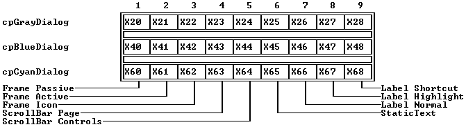

 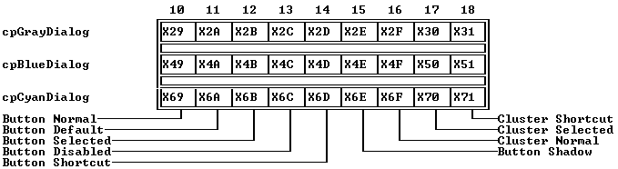

 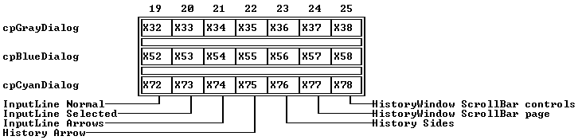

 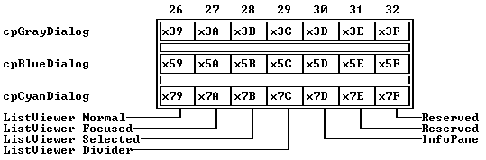

---

<a id="50PY9KO"></a>

### TDialog::TDialog

*Keywords: TDialog::TDialog*

[See Also](#45L0.I)	 [TDialog class](#TDialog)

 Form 1

 
```c
TDialog(const TRect& bounds, const char *aTitle);
```
 Form 2

 
```c
TDialog( StreamableInit streamableInit);  // protected
```
#### Description
 Form 1:Creates a dialog box with the given size and title by calling

 
```c
 TWindow::TWindow(bounds, aTitle, wnNoNumber);

 TWindowInit(initFrame);
```
* growModeis set to 0, and * flagsis set to * wfMove| * wfClose. This means that, by default, dialog boxes can move and close (via the close icon) but cannot grow (resize).

  Form 2: Each streamable class needs a "builder" to allocate the correct memory for its objects together with the initialized vtable pointers. This is achieved by calling this constructor with an argument of type  StreamableInit.

 Note:	  TDialogdoes not define its own destructor, but uses  closeand the destructors inherited from  TWindow,  TGroup, and  TView.

---

<a id="45L0.I"></a>

#### See Also
 [TWindow::TWindow](#1CPIMWX)

---

<a id="TDialog_build"></a>

### TDialog ::build

*Keywords: build*

[See Also](#9AV9RM)	 [TDialog class](#TDialog)
#### Syntax
```c
static TStreamable *build();
```
#### Description
 Called to create an object in certain stream-reading situations.

---

<a id="9AV9RM"></a>

#### See Also
 [TStreamableClass](#TStreamableClass)

 [ipstream::readData](#3MVS.PE)

---

<a id="3YWP.7"></a>

### TDialog ::getPalette

*Keywords: getpalette*

[TDialog class](#TDialog)
#### Syntax
```c
virtual TPalette& getPalette() const;
```
#### Description
 Returns the default palette string, * cpDialog:

 "ABCDEF

  ABCDEF"

---

<a id="AW0Q7G"></a>

### TDialog ::handleEvent

*Keywords: handleEvent*

[See Also](#AXCSIP)	 [TDialog class](#TDialog)
#### Syntax
```c
virtual void handleEvent(TEvent& event);
```
#### Description
 Calls  TWindow::handleEvent(* event), then handles Enter and Esc key events specially. In particular, Esc generates a * cmCancelcommand, and Enter broadcasts a * cmDefaultcommand. This member function also handles * cmOK, * cmCancel, * cmYes, and * cmNocommand events by ending the modal state of the dialog box. For each of the above events handled successfully, this member function calls  clearEvent.

---

<a id="AXCSIP"></a>

#### See Also
 [TWindow::handleEvent](#62MM_0Z)

---

<a id="TDialog_valid"></a>

### TDialog ::valid

*Keywords: valid*

[See Also](#93QJRS)	 [TDialog class](#TDialog)
#### Syntax
```c
virtual Boolean valid(ushort command);
```
#### Description
 Returns * Trueif the command argument is * cmCancel. This is the command generated by  handleEventwhen the Esc key is detected. If the command argument is not * cmCancel,  validcalls  TGroup::valid(* command) and returns the result of this call.  TGroup's  validcalls the  validmember functions of each of its subviews. The net result is that  validreturns * Trueonly if the group controls all return * True; otherwise, it returns * False. A modal state cannot terminate until all subviews return * Truewhen polled with  valid.

---

<a id="93QJRS"></a>

#### See Also
 [TGroup::valid](#TGroup_valid)

---

<a id="TDirCollection"></a>

### TDirCollection Class

*Keywords: TDirCollection*

[Inheritance](#TVFlow_1)
#### Header File
 stddlg.h
#### Description
 TDirCollectionis a simple  TCollectionderivative used for storing  TDirEntryobjects.  TDirCollectionis a streamable class, inheriting  TStreamablefrom its base class.

 Constructor

 
```c
TDirCollection
```

```c
UTODEN(ccIndex aLimit, ccIndex aDelta) : TCollection(aLimit, aDelta);
```
#### Member Functions
```c
TDirEntry * at
```

```c
TDirCollection_at(ccIndex index);

 void  atInsert
```

```c
GI5O35(ccIndex index, TDirEntry *item);

 void  atPut
```

```c
TDirCollection_atPut(ccIndex index, TDirEntry *item);

 static TStreamable * build
```

```c
TDirCollection_build();

 TDirEntry * firstThat
```

```c
4K.P_RE(ccTestFunc Test, void *arg);

 void  free
```

```c
TDirCollection_free(TDirEntry *item);

 virtual ccIndex  indexOf
```

```c
GTD6U5(TDirEntry *item);

 virtual ccIndex  insert
```

```c
1XCFDO.(TDirEntry *item);

 TDirEntry * lastThat
```

```c
WHVUIH(ccTestFunc Test, void *arg);

 virtual void * read
```

```c
TDirCollection_read(ipstream& os, void * t);   //protected

 void *TDirCollection:: readItem
```

```c
9W10UQ( ipstream& is );

 void  remove
```

```c
4IGP7S(TDirEntry *item);

 virtual void  write
```

```c
TDirCollection_write(opstream& os);   //protected

 void TDirCollection:: writeItem
```

```c
1MXVL_C( void *obj, opstream& os );
```

---

<a id="UTODEN"></a>

### TDirCollection::TDirCollection

*Keywords: TDirCollection::TDirCollection*

[See Also](#F5S3V1)	 [TDirCollection class](#TDirCollection)
#### Syntax
```c
TDirCollection(ccIndex aLimit, ccIndex aDelta) : TCollection(aLimit, aDelta);
```
#### Description
 Calls the base  TCollectionconstructor to create a directory collection with the given * limitand * delta.

---

<a id="F5S3V1"></a>

#### See Also
 [TCollection::TCollection](#_1BR_.)

---

<a id="TDirCollection_at"></a>

### TDirCollection ::at

*Keywords: at*

[See Also](#N0JR6P)	 [TDirCollection class](#TDirCollection)
#### Syntax
```c
TDirEntry *at(ccIndex index);
```
#### Description
 Returns a pointer to the  TDirEntryobject indexed by * indexin this directory collection.

---

<a id="N0JR6P"></a>

#### See Also
 [TNSCollection::at](#TNSCollection_at)

---

<a id="GI5O35"></a>

### TDirCollection ::atInsert

*Keywords: atInsert*

[See Also](#3_5ZZZ)	 [TDirCollection class](#TDirCollection)
#### Syntax
```c
void atInsert(ccIndex index, TDirEntry *item);
```
#### Description
 Inserts the given * iteminto the collection at the given * indexand moves the following items down one position. The collection will be expanded by * deltaif the insertion causes the * limitto be exceeded.

---

<a id="3_5ZZZ"></a>

#### See Also
 [TNSCollection::atInsert](#17BJT2F)

---

<a id="TDirCollection_atPut"></a>

### TDirCollection ::atPut

*Keywords: atPut*

[See Also](#1GTWLUQ)	 [TDirCollection class](#TDirCollection)
#### Syntax
```c
void atPut(ccIndex index, TDirEntry *item);
```
#### Description
 Replaces the item at * indexwith the given * item.

---

<a id="1GTWLUQ"></a>

#### See Also
 [TNSCollection::atPut](#TNSCollection_atPut)

---

<a id="TDirCollection_build"></a>

### TDirCollection ::build

*Keywords: build*

[See Also](#11XJFIR)	 [TDirCollection class](#TDirCollection)
#### Syntax
```c
static TStreamable *build();
```
#### Description
 Called to create an object in certain stream-reading situations.

---

<a id="11XJFIR"></a>

#### See Also
 [TStreamableClass](#TStreamableClass)

 [ipstream::readData](#3MVS.PE)

---

<a id="4K.P_RE"></a>

### TDirCollection ::firstThat

*Keywords: firstThat*

[See Also](#1JO55P)	 [TDirCollection class](#TDirCollection)
#### Syntax
```c
TDirEntry *firstThat(ccTestFunc Test, void *arg);
```
#### Description
 This iterator returns a pointer to the first  TDirEntryobject in the collection for which the  Testfunction returns * True. See  TNSCollection::firstThatfor a complete explanation.

---

<a id="1JO55P"></a>

#### See Also
 [TDirCollection::lastThat](#WHVUIH)

---

<a id="TDirCollection_free"></a>

### TDirCollection ::free

*Keywords: free*

[See Also](#NDITC9)	 [TDirCollection class](#TDirCollection)
#### Syntax
```c
void free(TDirEntry *item);
```
#### Description
 Removes (deletes) the given item from the collection and frees the space in the collection.

---

<a id="NDITC9"></a>

#### See Also
 [TNSCollection::free](#TNSCollection_free)

 [TNSCollection::remove](#1MLEZH9)

---

<a id="GTD6U5"></a>

### TDirCollection ::indexOf

*Keywords: indexOf*

[See Also](#2CB.P05)	 [TDirCollection class](#TDirCollection)
#### Syntax
```c
virtual ccIndex indexOf(TDirEntry *item);
```
#### Description
 Returns the * indexof the given * itemin this directory collection.

---

<a id="2CB.P05"></a>

#### See Also
 [TNSCollection::indexOf](#M9SIVW)

---

<a id="1XCFDO."></a>

### TDirCollection ::insert

*Keywords: insert*

[See Also](#SE5_G1)	 [TDirCollection class](#TDirCollection)
#### Syntax
```c
virtual ccIndex insert(TDirEntry *item);
```
#### Description
 Inserts the * iteminto the collection, and adjusts the other indexes if necessary. By default, insertions are made at the end of the collection. The index of the inserted item is returned.

---

<a id="SE5_G1"></a>

#### See Also
 [TNSCollection::insert](#1DUKPDH)

---

<a id="WHVUIH"></a>

### TDirCollection ::lastThat

*Keywords: lastThat*

[See Also](#1G0KG4P)	 [TDirCollection class](#TDirCollection)
#### Syntax
```c
TDirEntry *lastThat(ccTestFunc Test, void *arg);
```
#### Description
 This iterator scans the collection from the last  TDirEntryobject to the first. It returns a pointer to the first (that is, the nearest to the end) item in the collection for which the * Testfunction returns * True. See  TNSCollection::lastThatfor a complete explanation.

---

<a id="1G0KG4P"></a>

#### See Also
 [TDirCollection::firstThat](#4K.P_RE)

---

<a id="TDirCollection_read"></a>

### TDirCollection ::read

*Keywords: read*

[See Also](#1MXJVX_)	 [TDirCollection class](#TDirCollection)
#### Syntax
```c
virtual void *read(ipstream& os, void * t);   //protected
```
#### Description
 Reads from the input stream * is.

---

<a id="1MXJVX_"></a>

#### See Also
 [TStreamableClass](#TStreamableClass)

 [ipstream](#ipstream)

---

<a id="9W10UQ"></a>

### TDirCollection ::readItem

*Keywords: readItem*

[See Also](#IMCT9.)	 [TDirCollection class](#TDirCollection)
#### Syntax
```c
void *TDirCollection::readItem( ipstream& is );
```
#### Description
 Called for each item in the collection. You'll need to override these in everything derived from  TCollectionor  TSortedCollectionin order to read the items correctly.  TSortedCollectionalready overrides this function.

---

<a id="IMCT9."></a>

#### See Also
 [TStreamableClass](#TStreamableClass)

 [TStreamable](#TStreamable)

 [ipstream](#ipstream)

---

<a id="4IGP7S"></a>

### TDirCollection ::remove

*Keywords: remove*

[See Also](#125H0X9)	 [TDirCollection class](#TDirCollection)
#### Syntax
```c
void remove(TDirEntry *item);
```
#### Description
 Removes (deletes) the given * itemfrom this collection. (The space in the collection is not freed.)

---

<a id="125H0X9"></a>

#### See Also
 [TNSCollection::remove](#1MLEZH9)

 [TNSCollection::free](#TNSCollection_free)

---

<a id="TDirCollection_write"></a>

### TDirCollection ::write

*Keywords: write*

[See Also](#EFKU01)	 [TDirCollection class](#TDirCollection)
#### Syntax
```c
virtual void write(opstream& os);   //protected
```
#### Description
 Writes to the output stream * os.

---

<a id="EFKU01"></a>

#### See Also
 [TStreamableClass](#TStreamableClass)

 [opstream](#opstream)

---

<a id="1MXVL_C"></a>

### TDirCollection ::writeItem

*Keywords: writeItem*

[See Also](#41RSZ4_)	 [TDirCollection class](#TDirCollection)
#### Syntax
```c
void TDirCollection::writeItem( void *obj, opstream& os );
```
#### Description
 Called for each item in the collection. You'll need to override these in everything derived from  TCollectionor  TSortedCollectionin order to write the items correctly.  TSortedCollectionalready overrides this function.

---

<a id="41RSZ4_"></a>

#### See Also
 [TStreamableClass](#TStreamableClass)

 [TStreamable](#TStreamable)

 [opstream](#opstream)

---

<a id="TDirEntry"></a>

### TDirEntry Class

*Keywords: TDirEntry*

[Inheritance](#TVFlow_2)
#### Header File
 stddlg.h
#### Description
 TDirEntryis a simple class providing directory paths and Descriptions.  TDirEntryobjects are stored in  TDirCollectionobjects.  TDirEntryhas two private * char *data members that can be accessed via the member functions dir and text.

 
```c
 TDirEntry( const char *txt, const char *dir );
```
 Constructor

 
```c
TDirEntry
```

```c
16_L72H( const char *txt, const char *dir );

 ~ TDirEntry
```

```c
16_L72H();
```
#### Member Functions
```c
char * dir
```

```c
TDirEntry_Dir();

 char * text
```

```c
TDirEntry_text();
```

---

<a id="16_L72H"></a>

### TDirEntry::TDirEntry

*Keywords: TDirEntry::TDirEntry*

[TDirEntry class](#TDirEntry)
#### Syntax
```c
TDirEntry( const char *txt, const char *dir );
```
#### Description
 Creates an object and initializes the * dirand * textdata members with the given strings.

 Destructor

 
```c
~TDirEntry();
```
#### Description
 Destroys the TDirEntry object.

---

<a id="TDirEntry_Dir"></a>

### TDirEntry ::dir

*Keywords: dir*

[TDirEntry class](#TDirEntry)
#### Syntax
```c
char *dir();
```
#### Description
 Returns the current directory (the value of the private member * directory).

---

<a id="TDirEntry_text"></a>

### TDirEntry ::text

*Keywords: text*

[TDirEntry class](#TDirEntry)
#### Syntax
```c
char *text();
```
#### Description
 Returns the current display text (the value of the private member * displayText).

---

<a id="TDirListBox"></a>

### TDirListBox Class

*Keywords: TDirListBox class*

[Inheritance](#TVFlow_2)
#### Header File
 stddlg.h
#### Description
 TDirListBoxis a specialized derivative of  TListBoxfor displaying and selecting directories stored in a  TDirCollectionobject. By default, these are displayed in a single column with an optional vertical scroll bar.

 Constructors

 
```c
TDirListBox
```

```c
1O4I9WD(const TRect& bounds, TScrollBar *aScrollBar);

 ~ TDirListBox
```

```c
1O4I9WD();
```
#### Member Functions
```c
static TStreamable * build
```

```c
TDirListBox_build();

 virtual void  getText
```

```c
2SOI_H8(char *dest, short item, short maxLen);

 virtual void  handleEvent
```

```c
8_TVFL(TEvent& event);

 virtual Boolean  isSelected
```

```c
23KFDZ(short item);

 TDirCollection * list
```

```c
TDirListBox_List();

 void  newDirectory
```

```c
11R3N_6(const char *);

 virtual void * read
```

```c
TDirListBox_read(ipstream& os);   //protected

 virtual void  setState
```

```c
1QILYC9(ushort aState, Boolean enable);

 virtual void  write
```

```c
TDirListBox_write(opstream& os);   //protected
```

---

<a id="1O4I9WD"></a>

### TDirListBox::TDirListBox

*Keywords: TDirListBox::TDirListBox*

[See Also](#6LJ7QV)	 [TDirListBox class](#TDirListBox)
#### Syntax
```c
TDirListBox(const TRect& bounds, TScrollBar *aScrollBar);
```
#### Description
 Calls TListBox::TListBox(bounds, 1, aScrollBar) to create a single-column list box with the given bounds and vertical scroll bar.

 Destructor

 
```c
~TDirListBox();
```
#### Description
 Calls its base destructors to dispose of the list box.

---

<a id="6LJ7QV"></a>

#### See Also
 [TListBox::TListBox](#EHVOQ)

---

<a id="TDirListBox_build"></a>

### TDirListBox ::build

*Keywords: build*

[See Also](#0FDVOG)	 [TDirListBox class](#TDirListBox)
#### Syntax
```c
static TStreamable *build();
```
#### Description
 Called to create an object in certain stream-reading situations.

---

<a id="0FDVOG"></a>

#### See Also
 [TStreamableClass](#TStreamableClass)

 [ipstream::readData](#3MVS.PE)

---

<a id="2SOI_H8"></a>

### TDirListBox ::getText

*Keywords: getText*

[TDirListBox class](#TDirListBox)
#### Syntax
```c
virtual void getText(char *dest, short item, short maxLen);
```
#### Description
 Grabs the text string at index * itemand copies it to * dest.

---

<a id="8_TVFL"></a>

### TDirListBox ::handleEvent

*Keywords: handleEvent*

[See Also](#12WR7C6)	 [TDirListBox class](#TDirListBox)
#### Syntax
```c
virtual void handleEvent(TEvent& event);
```
#### Description
 Handles double-click mouse events with  putEvent(cmChangeDir). This allows a double click to change to the selected directory. Other events are handled by  TListBox::handleEvent.

---

<a id="12WR7C6"></a>

#### See Also
 [TView::putEvent](#8AOV_S5)

---

<a id="23KFDZ"></a>

### TDirListBox ::isSelected

*Keywords: isSelected*

[TDirListBox class](#TDirListBox)
#### Syntax
```c
virtual Boolean isSelected(short item);
```
#### Description
 Returns  Trueif * itemis selected; otherwise returns  False.

---

<a id="TDirListBox_List"></a>

### TDirListBox ::list

*Keywords: list*

[See Also](#21..M3U)	 [TDirListBox class](#TDirListBox)
#### Syntax
```c
TDirCollection *list();
```
#### Description
 Returns a pointer to the  TDirCollectionobject currently associated with this directory list box.

---

<a id="21..M3U"></a>

#### See Also
 [TSortedListBox::list](#TSortedListBox_List)

---

<a id="11R3N_6"></a>

### TDirListBox ::newDirectory

*Keywords: newDirectory*

[See Also](#M4MANB)	 [TDirListBox class](#TDirListBox)
#### Syntax
```c
void newDirectory(const char *);
```
#### Description
 Deletes the existing  TDirEntryobject associated with this list box and replaces it with the file collection given by * aList. The first item of the new collection will receive the focus.

---

<a id="M4MANB"></a>

#### See Also
 [TSortedListBox::newList](#85J9WL)

---

<a id="TDirListBox_read"></a>

### TDirListBox ::read

*Keywords: read*

[See Also](#YHE9QZ)	 [TDirListBox class](#TDirListBox)
#### Syntax
```c
virtual void *read(ipstream& os);   //protected
```
#### Description
 Reads from the input stream * is.

---

<a id="YHE9QZ"></a>

#### See Also
 [TStreamableClass](#TStreamableClass)

 [ipstream](#ipstream)

---

<a id="1QILYC9"></a>

### TDirListBox ::setState

*Keywords: setstate*

[See Also](#IF.DD.)	 [TDirListBox class](#TDirListBox)
#### Syntax
```c
virtual void setState(ushort aState, Boolean enable);
```
#### Description
 By default, uses the ancestral  TListViewer::setState.

---

<a id="IF.DD."></a>

#### See Also
 [TListViewer::setState](#2NDWTVM)

---

<a id="TDirListBox_write"></a>

### TDirListBox ::write

*Keywords: write*

[See Also](#12G39CF)	 [TDirListBox class](#TDirListBox)
#### Syntax
```c
virtual void write(opstream& os);   //protected
```
#### Description
 Writes to the output stream * os.

---

<a id="12G39CF"></a>

#### See Also
 [TStreamableClass](#TStreamableClass)

 [opstream](#opstream)

---

<a id="TDisplay"></a>

### TDisplay Class

*Keywords: TDisplay*

[Inheritance](#TVFlow_1)
#### Header File
 system.h
#### Description
 TDisplay provides low-level video functions for its derived class  TScreen. These, and the other systems classes in system.h, are listed briefly for guidance only: they are used internally by Turbo Vision and you would not need to use them explicitly for normal applications.  TViewis a friend class of  TDisplay.

 Constructors

 
```c
TDisplay
```

```c
1J9LLAZ();

  TDisplay
```

```c
1J9LLAZ( const TDisplay& );
```
#### Member Functions
```c
static void  clearScreen
```

```c
82HL0RX( uchar w, uchar h );

 static ushort  getCols
```

```c
QJ6LCJ();

 static ushort  getCrtMode
```

```c
1R9VILJ();

 static ushort  getCursorType
```

```c
0DRC84();

 static ushort  getRows
```

```c
4A9M70();

 static void  setCrtMode
```

```c
50B3KB( ushort vmode );

 static void  setCursorType
```

```c
17GYRVO( ushort ct );

 enum  videoModes
```

```c
1V9W0T9
```

---

<a id="1J9LLAZ"></a>

### TDisplay::TDisplay

*Keywords: TDisplay::TDisplay*

[TDisplay class](#TDisplay)

 Form 1

 
```c
TDisplay();   //protected
```
 Form 2

 
```c
TDisplay( const TDisplay& );   //protected
```
#### Description
 Form 1:is the default constructor.

  Form 2:is a copy constructor.

 Constructors are called internally by other routines and do not need to be called by the programmer.

 Destructor

 
```c
~TDisplay();   //protected
```
#### Description
 Destroys the  TDisplayobject.

---

<a id="82HL0RX"></a>

### TDisplay ::clearScreen

*Keywords: clearScreen*

[TDisplay class](#TDisplay)
#### Syntax
```c
static void clearScreen( uchar w, uchar h );
```
#### Description
 Clears the screen of width * wand height * h.

---

<a id="QJ6LCJ"></a>

### TDisplay ::getCols

*Keywords: getCols*

[TDisplay class](#TDisplay)
#### Syntax
```c
static ushort getCols();
```
#### Description
 Returns the number of screen columns.

---

<a id="1R9VILJ"></a>

### TDisplay ::getCrtMode

*Keywords: getCrtMode*

[See Also](#4.LOYLP)	 [TDisplay class](#TDisplay)
#### Syntax
```c
static ushort getCrtMode();
```
#### Description
 Returns the current video mode.

---

<a id="4.LOYLP"></a>

#### See Also
 [TDisplay::setCrtMode](#50B3KB)

 [TDisplay::videoModes](#1V9W0T9)

---

<a id="0DRC84"></a>

### TDisplay ::getCursorType

*Keywords: getCursorType*

[See Also](#CDGPUK)	 [TDisplay class](#TDisplay)
#### Syntax
```c
static ushort getCursorType();
```
#### Description
 Returns the cursor type.

---

<a id="CDGPUK"></a>

#### See Also
 [TDisplay::setCursorType](#17GYRVO)

---

<a id="4A9M70"></a>

### TDisplay ::getRows

*Keywords: getRows*

[TDisplay class](#TDisplay)
#### Syntax
```c
static ushort getRows();
```
#### Description
 Returns the number of screen rows.

---

<a id="50B3KB"></a>

### TDisplay ::setCrtMode

*Keywords: setCrtMode*

[See Also](#1SI39K4)	 [TDisplay class](#TDisplay)
#### Syntax
```c
static void setCrtMode( ushort vmode );
```
#### Description
 Sets the video mode to * vmodeif possible. The available hardware is examined and the video mode is set to the "best possible" mode available.

---

<a id="1SI39K4"></a>

#### See Also
 [TDisplay::getCrtMode](#1R9VILJ)

 [TDisplay::videoModes](#1V9W0T9)

---

<a id="17GYRVO"></a>

### TDisplay ::setCursorType

*Keywords: setCursorType*

[See Also](#QIF4X6)	 [TDisplay class](#TDisplay)
#### Syntax
```c
static void setCursorType( ushort ct );
```
#### Description
 The cursor is set by specifying two numbers from 0 to 100 and placing values in the high and low bytes of * ctrespectively. The low byte represents the position, as a percentage, where the top of the cursor starts. The high byte indicates the position where the cursor stops. To set a blank cursor, * ctis set to 0. In the 32-bit flat memory model, the high byte is ignored.

---

<a id="QIF4X6"></a>

#### See Also
 [TDisplay::getCursorType](#0DRC84)

---

<a id="1V9W0T9"></a>

### TDisplay ::videoModes

*Keywords: videoModes*

[See Also](#Q.P_M0)	 [TDisplay class](#TDisplay)
#### Syntax
```c
enum videoModes

 \-

    smBW80    = 0x0002,

    smCO80    = 0x0003,

    smMono    = 0x0007,

    smFont8x8 = 0x0100

 ;
```
#### Description
 Mnemonics for the video modes used by  TDisplay.

---

<a id="Q.P_M0"></a>

#### See Also
 [TDisplay::setCrtMode](#50B3KB)

 [TDisplay::getCrtMode](#1R9VILJ)

---

<a id="TDrawBuffer"></a>

### TDrawBuffer Class

*Keywords: TDrawBuffer*

[Inheritance](#TVFlow_1)
#### Header File
 drawbuf.h
#### Description
 TDrawBufferimplements a simple, non-view buffer class with member functions for moving characters, attributes, and strings to and from a draw buffer. The contents of a draw buffer are typically used with  TView::writeBufor  TView::writeLineto display text.
#### Member Functions
```c
ushort  data
```

```c
TDrawBuffer_data[maxViewWidth];   //protected

 void  moveBuf
```

```c
.NFY73(ushort indent, const void far *source, ushort attr, ushort count);

 void  moveChar
```

```c
DKY284(ushort indent, char c, ushort attr, ushort count);

 void  moveCStr
```

```c
DKY_K4(ushort indent, const char far *str, ushort attrs);

 void  moveStr
```

```c
3MQX.U9(ushort indent, const char far *str, ushort attrs);

 void  putAttribute
```

```c
11EIYQZ(ushort indent, ushort attr);

 void  putChar
```

```c
1I45ZE(ushort indent, ushort c);
```
 Friends

 The classes  TSystemErrorand  TViewand the function  genRefsare friends of  TDrawBuf.

---

<a id="TDrawBuffer_data"></a>

### TDrawBuffer ::data

*Keywords: data*

[TDrawBuffer class](#TDrawBuffer)
#### Syntax
```c
ushort data[maxViewWidth];   //protected
```
#### Description
 Defines the array for this draw buffer.

---

<a id=".NFY73"></a>

### TDrawBuffer ::moveBuf

*Keywords: moveBuf*

[TDrawBuffer class](#TDrawBuffer)
#### Syntax
```c
void moveBuf(ushort indent, const void *source, ushort attr, ushort count);
```
#### Description
 Moves text to the calling draw buffer. * countbytes are copied from * source. Copying starts at the offset given by * indent. The high bytes of the words copied are set to * attr, or remain unchanged if * attris zero.

---

<a id="DKY284"></a>

### TDrawBuffer ::moveChar

*Keywords: moveChar*

[See Also](#1I5J_BS)	 [TDrawBuffer class](#TDrawBuffer)
#### Syntax
```c
void moveChar(ushort indent, char c, ushort attr, ushort count);
```
#### Description
 Moves * countcopies of the character * cand attribute * attrinto the calling draw buffer. Copying starts at the offset given by * indent. The low byte of each affected word in the buffer receives * c, while the high (attribute) bytes are set to * attrprovided * attris nonzero. If * attris zero, the high bytes are unchanged.

---

<a id="1I5J_BS"></a>

#### See Also
 [TDrawBuffer::putChar](#1I45ZE)

---

<a id="DKY_K4"></a>

### TDrawBuffer ::moveCStr

*Keywords: moveCStr*

[See Also](#V8X0LA)	 [TDrawBuffer class](#TDrawBuffer)
#### Syntax
```c
void moveCStr(ushort indent, const char *str, ushort attrs);
```
#### Description
 Moves the two-color string * strto the calling draw buffer. Copying starts at the offset given by * indent. The characters in * strare set in the low bytes of each buffer word. The high bytes of the buffer words are set to lo(attrs) or hi(attrs). Tilde characters () in the string are used to toggle between the two attribute bytes passed via * attrs.

---

<a id="V8X0LA"></a>

#### See Also
 [TDrawBuffer::moveStr](#3MQX.U9)

---

<a id="3MQX.U9"></a>

### TDrawBuffer ::moveStr

*Keywords: moveStr*

[See Also](#J_.NWR)	 [TDrawBuffer class](#TDrawBuffer)
#### Syntax
```c
void moveStr(ushort indent, const char *str, ushort attrs);
```
#### Description
 Moves the string * strto the calling draw buffer. Copying starts at the offset given by * indent. The characters in * strare set in the low bytes of each buffer word. The high bytes of the buffer words are set to * attrs, or remain unchanged if * attrsis zero.

---

<a id="J_.NWR"></a>

#### See Also
 [TDrawBuffer::moveCStr](#DKY_K4)

---

<a id="11EIYQZ"></a>

### TDrawBuffer ::putAttribute

*Keywords: putAttribute*

[See Also](#9IB4YN)	 [TDrawBuffer class](#TDrawBuffer)
#### Syntax
```c
void putAttribute(ushort indent, ushort attr);
```
#### Description
 Inserts * attrinto the upper byte of the calling buffer. The insertion position is offset by the value of * indent.

---

<a id="9IB4YN"></a>

#### See Also
 [TDrawBuffer::putChar](#1I45ZE)

---

<a id="1I45ZE"></a>

### TDrawBuffer ::putChar

*Keywords: putChar*

[See Also](#V4V.H1)	 [TDrawBuffer class](#TDrawBuffer)
#### Syntax
```c
void putChar(ushort indent, ushort c);
```
#### Description
 Inserts * cinto the lower byte of the calling buffer. The insertion position is offset by the value of * indent.

---

<a id="V4V.H1"></a>

#### See Also
 [TDrawBuffer::moveChar](#DKY284)

---

<a id="TEditor"></a>

### TEditor Class

*Keywords: TEditor*

[Inheritance](#TVFlow_1)
#### Header File
 editors.h
#### Description
 TEditoris the base class for all editors. It implements most of the editor's functionality. If a  TEditorobject is created, it allocates a buffer of the given size out of the heap. The buffer is initially empty.

 The use of  TEditoris demonstrated in TVEDIT.CPP for editing files and in TVFORMS.CPP as a memo data member. Both of these files can be found in the demos directory of the distribution disks.

 The TEditor Buffer

 TEditorimplements a * buffer gap editor, which stores the text in two sections. Any text before the cursor is stored at the beginning of the buffer, and text after the cursor is stored at the end of the buffer. The space between the text is called the * gap. When a character is inserted into the editor, it is inserted into the gap. The editor supports undo by recording deleted text in the gap and keeping track of the number of characters inserted and deleted. When asked to perform an undo, it deletes the characters that were inserted, copies them to the beginning of the gap, and positions the cursor after the formerly-deleted text.

 Block Selection

 The selection or block mark is always placed either before or after the cursor. If text is inserted into the editor, either through a key press or through  insertText, the contents of the selection are replaced by the inserted text. If there is no selection, the text is just inserted. The selection is marked by the data members * selStartand * selEnd. The selection can be set by the call  setSelect, which also moves the cursor.

 Options

 TEditorprovides several options, the states of which are stored in Boolean data members. * canUndoindicates whether the editor records undo information. Since  undotakes space temporarily from inserts, you might find it advantageous to disable the undo feature. This is done automatically for the Clipboard. * overwriteindicates whether the editor is in overwrite or insert mode. * autoIndentrecords whether the editor will, when the Enter key is pressed, indent the cursor to the column of the first non-space character of the previous line. This is convenient if the editor is used to edit source code.

 Key Bindings

 Keys are bound to many of the key mappings used in the Borland IDE. The only exceptions are the block commands. Since  TEditordoes not use persistent blocks, the block commands are simulated by copying the information to and from the Clipboard. For example, Ctrl-K Ctrl-B begins selecting text. Ctrl-K Ctrl-K copies the text to the Clipboard. Ctrl-K Ctrl-C pastes the contents from the Clipboard to the editor. Block selection can be started by holding down the shift key with any of the cursor movement commands instead of using the Ctrl-K bindings.

 These key bindings can be changed by overriding the  convertEventmember function which translates the given key event to a command event.

 Constants

 The constants in this section are defined in editors.h.

 * maxLineLengthis defined to be 256.

 Item	 Value	 Item	 Value

 

 Command constants:

| * cmSave | 80 | * cmPageDown | 509 |
| --- | --- | --- | --- |
| * cmSaveAs | 81 | * cmTextStart | 510 |
| * cmFind | 82 | * cmTextEnd | 511 |
| * cmReplace | 83 | * cmNewLine | 512 |
| * cmSearchAgain | 84 | * cmBackSpace | 513 |
| * cmCharLeft | 500 | * cmDelChar | 514 |
| * cmCharRight | 501 | * cmDelWord | 515 |
| * cmWordLeft | 502 | * cmDelStart | 516 |
| * cmWordRight | 503 | * cmDelEnd | 517 |
| * cmLineStart | 504 | * cmDelLine | 518 |
| * cmLineEnd | 505 | * cmInsMode | 519 |
| * cmLineUp | 506 | * cmStartSelect | 520 |
| * cmLineDown | 507 | * cmHideSelect | 521 |
| * cmPageUp | 508 | * cmIndentMode | 522 |
| * cmUpdateTitle | 523 |  |  |

  TEditordialog constants:

| * edOutOfMemory | 0 | * edSaveAs | 6 |
| --- | --- | --- | --- |
| * edReadError | 1 | * edFind | 7 |
| * edWriteError | 2 | * edSearchFailed | 8 |
| * edCreateError | 3 | * edReplace | 9 |
| * edSaveModify | 4 | * edReplacePrompt | 10 |
| * edSaveUntitled | 5 |  |  |

  TEditoreditor flags:

| * efCaseSensitive | 0x0001 | * efReplaceAll | 0x0008 |
| --- | --- | --- | --- |
| * efWholeWordsOnly | 0x0002 | * efDoReplace | 0x0010 |
| * efPromptOnReplace | 0x0004 | * efBackupFiles | 0x0100 |

 Editor palettes:

| * cpIndicator | "" | * cpEditor | "" |
| --- | --- | --- | --- |
| * cpMemo | "AB" |  |  |

 Constructors

 
```c
TEditor
```

```c
OP2ZHT( const TRect& bounds, TScrollBar *aHScrollBar, TScrollBar *aVScrollBar, TIndicator *anIndicator, ushort 

 virtual ~ TEditor
```

```c
OP2ZHT();aBufSize);
```
#### Data Members
```c
Boolean  autoIndent
```

```c
HM9OVF;

 char * buffer
```

```c
19ARBH3;

 ushort  bufLen
```

```c
19ARHGZ;

 ushort  bufSize
```

```c
QAGCY9;

 Boolean  canUndo
```

```c
1_IIHCC;

 static TEditor * clipboard
```

```c
2_FYBFP;

 TPoint  curPos
```

```c
H8RM0O;

 ushort  curPtr
```

```c
10B3LW3;

 ushort  delCount
```

```c
1JRQBW1;

 TPoint  delta
```

```c
TEditor_delta;

 int  drawLine
```

```c
481F_P4;

 ushort  drawPtr
```

```c
LKRL8A;

 static TEditorDialog  editorDialog
```

```c
2ZKA05;

 typedef  ushort
```

```c
2ZKA05(*TEditorDialog)( int, ... );

 static ushort  editorFlags
```

```c
C64BZG;

 static char  findStr
```

```c
B.FPH.[80];

 ushort  gapLen
```

```c
1_Y1HGZ;

 TScrollBar * hScrollBar
```

```c
12HVXIZ;

 TIndicator * indicator
```

```c
143.DSF;

 ushort  insCount
```

```c
978YCE;

 Boolean  isValid
```

```c
1JSJJLT;

 int  keyState
```

```c
I6RN74;

 TPoint  limit
```

```c
TEditor_limit;

 uchar  lockCount
```

```c
1Q0.S94;

 Boolean  modified
```

```c
3MHH_VD;

 Boolean  overwrite
```

```c
1_HAXXL;

 static char  replaceStr
```

```c
XV7IP_[80];

 Boolean  selecting
```

```c
1J.N7S5;

 ushort  selEnd
```

```c
1J1XAPP;

 ushort  selStart
```

```c
DYO347;

 uchar  updateFlags
```

```c
RDAVC0;

 TScrollBar * vScrollBar
```

```c
2OALQYP;
```
 Member functions

 
```c
char  bufChar
```

```c
47VBT6( ushort p);

 ushort  bufPtr
```

```c
19ARLW3( ushort p);

 static TStreamable * build
```

```c
TEditor_build();

 virtual void  changeBounds
```

```c
PXIQ_( const TRect& bounds );

 int  charPos
```

```c
4TYKJR( ushort p, ushort target );

 ushort  charPtr
```

```c
4TYKOQ( ushort p, int target );

 void  checkScrollBar
```

```c
9P0FL7( const TEvent& event, TScrollBar *p, int& d);

 Boolean  clipCopy
```

```c
94NPM5();

 clipboard-> insertFrom
```

```c
94NPM5( this );

 void  clipCut
```

```c
1HDD_TH();

 void  clipPaste
```

```c
.8RUXL();

  insertFrom
```

```c
.8RUXL( clipboard );

 virtual void  convertEvent
```

```c
MS4Q4P( TEvent& ev );

 Boolean  cursorVisible
```

```c
1D_HHXN();

 void  deleteRange
```

```c
M05QRK( ushort startPtr, ushort endPtr, Boolean delSelect);

 void  deleteSelect
```

```c
1XP99T();

 virtual void  doneBuffer
```

```c
H2.TQ5();

 void  doSearchReplace
```

```c
AA64W();

 void  doUpdate
```

```c
3MF74F9();

 virtual void  draw
```

```c
TEditor_draw();

 void  drawLines
```

```c
LGNGJI( int y, int count, ushort linePtr );

 void  find
```

```c
TEditor_find();

 void  formatLine
```

```c
BIA6J_(void *buff, ushort linePtr, int x, ushort color );

 ushort  getMousePtr
```

```c
_SHNTW( TPoint m);

 virtual TPalette&  getPalette
```

```c
IB158P() const;

 virtual void  handleEvent
```

```c
26PFZZP( TEvent& ev );

 Boolean  hasSelection
```

```c
4WC3G0();

 void  hideSelect
```

```c
3VYJD2();

 virtual void  initBuffer
```

```c
1.BJTRY();

 Boolean  insertBuffer
```

```c
4XVT_7I( char *p, ushort offset, ushort length,

 virtual Boolean  insertFrom
```

```c
75NKTP( TEditor *editor );

 Boolean  insertText
```

```c
28QU_N1( void *text, ushort length, Boolean selectText );

 Boolean  isClipboard
```

```c
2NLJYQ6();

 ushort  lineEnd
```

```c
ZH_F2Z( ushort p);

 ushort  lineMove
```

```c
BXAPNB( ushort p, int count);

 ushort  lineStart
```

```c
1Y6VE6G( ushort p);

 void  lock
```

```c
TEditor_lock();

 void  newLine
```

```c
U5KKBV();

 ushort  nextChar
```

```c
D7BUCN( ushort p );

 ushort  nextLine
```

```c
D7KVPA( ushort p);

 ushort  nextWord
```

```c
4GDHZ4J( ushort p);

 ushort  prevChar
```

```c
186.A85( ushort p);

 ushort  prevLine
```

```c
EX9BXC( ushort );

 ushort  prevWord
```

```c
EXDI1B( ushort );

 virtual void * read
```

```c
TEditor_read( ipstream& is );   //protected

 void  replace
```

```c
QLYEWL();

 void  scrollTo
```

```c
42IQ0E1( int x, int y);

 Boolean  search
```

```c
0J5OB4( const char *findStr, ushort opts);

 void  setBufLen
```

```c
4R8B_RM( ushort length);

 virtual Boolean  setBufSize
```

```c
31W53C0( ushort newSize );

 void  setCmdState
```

```c
3D.CYN( ushort command, Boolean enable );

 void  setCurPtr
```

```c
OW1DVG( ushort p, uchar selectMode );

 void  setSelect
```

```c
B_J9Y9( ushort newStart, ushort newEnd, Boolean curStart);

 virtual void  setState
```

```c
LYO35S( ushort aState, Boolean enable );

 virtual void  shutDown
```

```c
.VYCE7();

 void  startSelect
```

```c
13X6WHO();

 void  toggleInsMode
```

```c
41CE9SN();

 void  trackCursor
```

```c
1_9OBOL( Boolean center );

 void  undo
```

```c
TEditor_undo();

 void  unlock
```

```c
Z1LKYG();

 void  update
```

```c
1L.P_VQ( uchar aFlags );

 void  updateCommands
```

```c
CSRLDK();

 virtual Boolean  valid
```

```c
TEditor_valid( ushort command );

 virtual void  write
```

```c
TEditor_write( opstream& os );   //protected
```
 Friends

 The function  genRefsis a friend of  TEditor.

---

<a id="OP2ZHT"></a>

### TEditor::TEditor

*Keywords: TEditor::TEditor*

[See Also](#IHV591)	 [TEditor class](#TEditor)
#### Syntax
```c
TEditor( const TRect& bounds, TScrollBar *aHScrollBar, TScrollBar *aVScrollBar, TIndicator *anIndicator, ushort aBufSize);
```
#### Description
 Calls  TView(* bounds) by creating a view with the given bounds. The * hScrollBar, * vScrollBar, * indicator, and * bufSizedata members are set from the given arguments. The scroll bar and indicator arguments can be set to 0 if you do not want these objects. The following default values are set:

| * canUndo | True |
| --- | --- |
| selecting | False |
| overwrite | False |
| autoIndent | False |
| lockCount | 0 |
| KeyState | 0 |
| growMode | gfGrowHiX | gfGrowHiY |
| options | ofSelectable |
| eventMask | evMouseDown | evKeyDown | evCommand | evBroadcast |

 The buffer is allocated and cleared. If insufficient memory exists, the * edOutOfMemorydialog box is displayed using * editorDialog, and * isValidis set * False. Otherwise * isValidis set * True. The data members associated with the editor buffer are initialized in the obvious way: * bufLento 0, * gapLento * bufSize, * selStartto 0, * modifiedto * False, and so on.

 Destructor

 
```c
virtual ~TEditor();
```
#### Description
 Destroys the editor deletes the buffer.

---

<a id="IHV591"></a>

#### See Also
 [TView::Tview](#TView_TView)

 [TEditor::editorDialog](#2ZKA05)

 [TScrollBar](#TScrollBar)

---

<a id="HM9OVF"></a>

### TEditor ::autoIndent

*Keywords: autoIndent*

[TEditor class](#TEditor)
#### Syntax
```c
Boolean autoIndent;
```
#### Description
 *Trueif the editor is in autoindent mode.

---

<a id="19ARBH3"></a>

### TEditor ::buffer

*Keywords: buffer*

[TEditor class](#TEditor)
#### Syntax
```c
char *buffer;
```
#### Description
 Pointer to the buffer used to hold the text.

---

<a id="19ARHGZ"></a>

### TEditor ::bufLen

*Keywords: bufLen*

[TEditor class](#TEditor)
#### Syntax
```c
ushort bufLen;
```
#### Description
 The number of characters in the buffer.

---

<a id="QAGCY9"></a>

### TEditor ::bufSize

*Keywords: bufSize*

[TEditor class](#TEditor)
#### Syntax
```c
ushort bufSize;
```
#### Description
 Size of the buffer.

---

<a id="1_IIHCC"></a>

### TEditor ::canUndo

*Keywords: canUndo*

[See Also](#0QQL7Z)	 [TEditor class](#TEditor)
#### Syntax
```c
Boolean canUndo;
```
#### Description
 *Trueif the editor is to support  undo. Otherwise * False.

---

<a id="0QQL7Z"></a>

#### See Also
 [TEditor::undo](#TEditor_undo)

---

<a id="2_FYBFP"></a>

### TEditor ::Clipboard

*Keywords: Clipboard*

[TEditor class](#TEditor)
#### Syntax
```c
static TEditor *clipboard;
```
#### Description
 Pointer to the Clipboard. Any  TEditorcan be the Clipboard; it just needs to be assigned to this variable. The Clipboard should not support undo (that is, its * canUndoshould be false).

---

<a id="H8RM0O"></a>

### TEditor ::curPos

*Keywords: curPos*

[TEditor class](#TEditor)
#### Syntax
```c
TPoint curPos;
```
#### Description
 Line/column location of the cursor in the file.

---

<a id="10B3LW3"></a>

### TEditor ::curPtr

*Keywords: curPtr*

[TEditor class](#TEditor)
#### Syntax
```c
ushort curPtr;
```
#### Description
 Offset of the cursor.

---

<a id="1JRQBW1"></a>

### TEditor ::delCount

*Keywords: delCount*

[TEditor class](#TEditor)
#### Syntax
```c
ushort delCount;
```
#### Description
 Number of characters in the end of the gap that were deleted from the text. Used to implement undo.

---

<a id="TEditor_delta"></a>

### TEditor ::delta

*Keywords: delta*

[TEditor class](#TEditor)
#### Syntax
```c
TPoint delta;
```
#### Description
 Top line and leftmost column shown in the view.

---

<a id="481F_P4"></a>

### TEditor ::drawLine

*Keywords: drawLine*

[TEditor class](#TEditor)
#### Syntax
```c
int drawLine;
```
#### Description
 Column position on the screen where inserted characters are drawn. Used internally by  draw.

---

<a id="LKRL8A"></a>

### TEditor ::drawPtr

*Keywords: drawPtr*

[TEditor class](#TEditor)
#### Syntax
```c
ushort drawPtr;
```
#### Description
 Buffer offset corresponding to the current cursor. Used internally by  draw.

---

<a id="2ZKA05"></a>

### TEditor ::editorDialog

*Keywords: editorDialog*

[TEditor class](#TEditor)
#### Syntax
```c
static TEditorDialog editorDialog;
```
#### Description
 The  TEditorDialogdata type is a pointer to a function returning ushort and taking one int argument and a variable number of additional arguments. It is defined in editors.h as follows:

 
```c
 typedef ushort (*TEditorDialog)( int, ... );
```
* editorDialogis a function pointer used by  TEditorobjects to display various dialog boxes. Since dialog boxes are application-dependent, a  TEditorobject does not display its own dialog boxes directly. Instead it controls them through this function pointer. For an example of an * editorDialogfunction, see TVEDIT.CPP.

 The various dialog values, passed in the first  intargument, are self-explanatory:

| * edOutOfMemory | edSaveAs |
| --- | --- |
| * edReadErro | * edFind |
| * edWriteError | edSearchFailed |
| * edCreateError | edReplace |
| * edSaveModify | edReplacePrompt |

 * edSaveUntitled

 The default * editorDialog, * defEditorDialog, simply returns * cmCancel.

---

<a id="C64BZG"></a>

### TEditor ::editorFlags

*Keywords: editorFlags*

[TEditor class](#TEditor)
#### Syntax
```c
static ushort editorFlags;
```
#### Description
 *editorFlagscontains various flags for use in the editor:

| * efCaseSensitive | Default to case-sensitive search |
| --- | --- |
| * efWholeWordsOnly | Default to whole words only search |
| * efPromptOnReplace | Prompt on replace |
| * efReplaceAll | Replace all occurrences |
| * efDoReplace | Do replace |
| * efBackupFiles | Create .BAK files on saves |

 The default value is * efBackupFiles | efPromptOnReplace.

---

<a id="B.FPH."></a>

### TEditor ::findStr

*Keywords: findStr*

[See Also](#1802ZZ.)	 [TEditor class](#TEditor)
#### Syntax
```c
static char findStr[80];
```
#### Description
 Stores the last string value used for a find operation.

---

<a id="1802ZZ."></a>

#### See Also
 [TEditor::doSearchReplace](#AA64W)

---

<a id="1_Y1HGZ"></a>

### TEditor ::gapLen

*Keywords: gapLen*

[TEditor class](#TEditor)
#### Syntax
```c
ushort gapLen;
```
#### Description
 Size of the "gap" between the text before the cursor and the text after the cursor.

---

<a id="12HVXIZ"></a>

### TEditor ::hScrollBar

*Keywords: hScrollBar*

[TEditor class](#TEditor)
#### Syntax
```c
TScrollBar *hScrollBar;
```
#### Description
 Pointer to the horizontal scroll bar; 0 if the scroll bar does not exist.

---

<a id="143.DSF"></a>

### TEditor ::indicator

*Keywords: indicator*

[TEditor class](#TEditor)
#### Syntax
```c
TIndicator *indicator;
```
#### Description
 Pointer to the indicator; 0 if the indicator does not exist.

---

<a id="978YCE"></a>

### TEditor ::insCount

*Keywords: insCount*

[TEditor class](#TEditor)
#### Syntax
```c
ushort insCount;
```
#### Description
 Number of characters inserted into the text since the last cursor movement. Used to implement undo.

---

<a id="1JSJJLT"></a>

### TEditor ::isValid

*Keywords: isValid*

[See Also](#ZT38UM)	 [TEditor class](#TEditor)
#### Syntax
```c
Boolean isValid;
```
#### Description
 *Trueif the view is valid. Used by the  validmember function.

---

<a id="ZT38UM"></a>

#### See Also
 [TEditor::valid](#TEditor_valid)

---

<a id="I6RN74"></a>

### TEditor ::keyState

*Keywords: keyState*

[TEditor class](#TEditor)
#### Syntax
```c
int keyState;
```
#### Description
 Indicates that a special key, such as Ctrl-K, has been pressed. Used by  handleEventto keep track of "double" control keys such as Ctrl-K-H and Ctrl-K-B.

---

<a id="TEditor_limit"></a>

### TEditor ::limit

*Keywords: limit*

[TEditor class](#TEditor)
#### Syntax
```c
TPoint limit;
```
#### Description
 Maximum number of columns to display, and the number of lines in the file. Records the limits of the scroll bars.

---

<a id="1Q0.S94"></a>

### TEditor ::lockCount

*Keywords: lockCount*

[See Also](#10S0YRR)	 [TEditor class](#TEditor)
#### Syntax
```c
uchar lockCount;
```
#### Description
 Holds the lock count semaphore that controls when a view is redrawn. * lockCountis incremented by  lockand decremented by  unlock.

---

<a id="10S0YRR"></a>

#### See Also
 [TGroup::lock](#TGroup_lock)

 [TGroup::unlock](#WJ6_RR)

 [TGroup::lockFlag](#81FA1B)

---

<a id="3MHH_VD"></a>

### TEditor ::modified

*Keywords: modified*

[TEditor class](#TEditor)
#### Syntax
```c
Boolean modified;
```
#### Description
 *Trueif buffer has been modified.

---

<a id="1_HAXXL"></a>

### TEditor ::overwrite

*Keywords: overwrite*

[TEditor class](#TEditor)
#### Syntax
```c
Boolean overwrite;
```
#### Description
 *Trueif in overwrite mode; otherwise editor is in insert mode.

---

<a id="XV7IP_"></a>

### TEditor ::replaceStr

*Keywords: replaceStr*

[See Also](#21_O04Q)	 [TEditor class](#TEditor)
#### Syntax
```c
static char replaceStr[80];
```
#### Description
 Stores the last string value of a replace operation.

---

<a id="21_O04Q"></a>

#### See Also
 [TEditor::doSearchReplace](#AA64W)

---

<a id="1J.N7S5"></a>

### TEditor ::selecting

*Keywords: selecting*

[TEditor class](#TEditor)
#### Syntax
```c
Boolean selecting;
```
#### Description
 *Trueif editor is in selecting mode (that is, if Ctrl-K Ctrl-B has been pressed).

---

<a id="1J1XAPP"></a>

### TEditor ::selEnd

*Keywords: selEnd*

[TEditor class](#TEditor)
#### Syntax
```c
ushort selEnd;
```
#### Description
 Offset of the end of the text selected by Ctrl-K Ctrl-K.

---

<a id="DYO347"></a>

### TEditor ::selStart

*Keywords: selStart*

[TEditor class](#TEditor)
#### Syntax
```c
ushort selStart;
```
#### Description
 Offset of the start of the text selected by Ctrl-K Ctrl-B.

---

<a id="RDAVC0"></a>

### TEditor ::updateFlags

*Keywords: updateFlags*

[TEditor class](#TEditor)
#### Syntax
```c
uchar updateFlags;
```
#### Description
 Set of flags indicating the state of the editor.  doUpdateand other member functions examine these flags to determine whether the view needs to be redrawn.

---

<a id="2OALQYP"></a>

### TEditor ::vScrollBar

*Keywords: vScrollBar*

[TEditor class](#TEditor)
#### Syntax
```c
TScrollBar *vScrollBar;
```
#### Description
 Pointer to the vertical scroll bar; 0 if the scroll bar does not exist.

---

<a id="47VBT6"></a>

### TEditor ::bufChar

*Keywords: bufChar*

[TEditor class](#TEditor)
#### Syntax
```c
char bufChar( ushort p);
```
#### Description
 Returns the * p'th character in the file, factoring in the gap.

---

<a id="19ARLW3"></a>

### TEditor ::bufPtr

*Keywords: bufPtr*

[TEditor class](#TEditor)
#### Syntax
```c
ushort bufPtr( ushort p);
```
#### Description
 Returns the offset into * bufferof the * p'th character in the file, factoring in the gap.

---

<a id="TEditor_build"></a>

### TEditor ::build

*Keywords: build*

[See Also](#CWO33)	 [TEditor class](#TEditor)
#### Syntax
```c
static TStreamable *build();
```
#### Description
 Called to create an object in certain stream reading situations.

---

<a id="CWO33"></a>

#### See Also
 [TStreamableClass](#TStreamableClass)

 [ipstream::readData](#3MVS.PE)

---

<a id="PXIQ_"></a>

### TEditor ::changeBounds

*Keywords: changeBounds*

[TEditor class](#TEditor)
#### Syntax
```c
virtual void changeBounds( const TRect& bounds );
```
#### Description
 Changes the views bounds, adjusting the delta value and redrawing the scroll bars and view if necessary. Overridden to ensure the file stays within view if the parent size changes.

---

<a id="4TYKJR"></a>

### TEditor ::charPos

*Keywords: charPos*

[TEditor class](#TEditor)
#### Syntax
```c
int charPos( ushort p, ushort target );
```
#### Description
 Calculates and returns the number of character positions from * pto * target. Any tab codes encountered are counted as spaces modulo the tab setting.

---

<a id="4TYKOQ"></a>

### TEditor ::charPtr

*Keywords: charPtr*

[TEditor class](#TEditor)
#### Syntax
```c
ushort charPtr( ushort p, int target );
```
#### Description
 The reverse of  charPos. Calculates and returns the buffer position corresponding to a cursor position.

---

<a id="9P0FL7"></a>

### TEditor ::checkScrollBar

*Keywords: checkScrollBar*

[TEditor class](#TEditor)
#### Syntax
```c
void checkScrollBar( const TEvent& event, TScrollBar *p, int& d);
```
#### Description
 Called by  handleEventin response to a * cmScrollBarChangedbroadcast event. If the scroll bar's current * valueis different from * d, the scroll bar is redrawn.

---

<a id="94NPM5"></a>

### TEditor ::clipCopy

*Keywords: clipCopy*

[See Also](#.JNXN8)	 [TEditor class](#TEditor)
#### Syntax
```c
Boolean clipCopy();
```
#### Description
 Returns * Falseif this editor has no active Clipboard. Otherwise, copies the selected text from the editor to the Clipboard using

 
```c
 clipboard->insertFrom( this );
```
 The selected text is deselected (highlight removed) and the view redrawn. Returns * Trueif all goes well.

---

<a id=".JNXN8"></a>

#### See Also
 [TEditor::insertFrom](#75NKTP)

---

<a id="1HDD_TH"></a>

### TEditor ::clipCut

*Keywords: clipCut*

[See Also](#H8WX6X)	 [TEditor class](#TEditor)
#### Syntax
```c
void clipCut();
```
#### Description
 The same as for  clipCopy, but the selected text is deleted after being copied to the Clipboard.

---

<a id="H8WX6X"></a>

#### See Also
 [TEditor::clipCopy](#94NPM5)

 [TEditor::insertFrom](#75NKTP)

---

<a id=".8RUXL"></a>

### TEditor ::clipPaste

*Keywords: clipPaste*

[See Also](#N02BDX)	 [TEditor class](#TEditor)
#### Syntax
```c
void clipPaste();
```
#### Description
 The reverse of  clipCopy: the contents of the Clipboard (if any) are copied to the current position of the editor using

 
```c
 insertFrom( clipboard );
```

---

<a id="N02BDX"></a>

#### See Also
 [TEditor::clipCopy](#94NPM5)

 [TEditor::insertFrom](#75NKTP)

---

<a id="MS4Q4P"></a>

### TEditor ::convertEvent

*Keywords: convertEvent*

[See Also](#2UME_W9)	 [TEditor class](#TEditor)
#### Syntax
```c
virtual void convertEvent( TEvent& ev );
```
#### Description
 Used by  handleEventto provide basic editing operations by converting various key events to command events. You can change or extend these default key bindings by overriding the  convertEventmember function.

---

<a id="2UME_W9"></a>

#### See Also
 [TEditor::handleEvent](#26PFZZP)

---

<a id="1D_HHXN"></a>

### TEditor ::cursorVisible

*Keywords: cursorVisible*

[TEditor class](#TEditor)
#### Syntax
```c
Boolean cursorVisible();
```
#### Description
 Returns * Trueif the cursor (insertion point) is visible within the view.

---

<a id="M05QRK"></a>

### TEditor ::deleteRange

*Keywords: deleteRange*

[See Also](#89.0_1)	 [TEditor class](#TEditor)
#### Syntax
```c
void deleteRange( ushort startPtr, ushort endPtr, Boolean delSelect);
```
#### Description
 If * delSelectis * Trueand a current selection exists, the current selection is deleted; otherwise, the range * startPtrto * endPtris selected and deleted.

---

<a id="89.0_1"></a>

#### See Also
 [TEditor::deleteSelect](#1XP99T)

---

<a id="1XP99T"></a>

### TEditor ::deleteSelect

*Keywords: deleteSelect*

[See Also](#2L_LVQ)	 [TEditor class](#TEditor)
#### Syntax
```c
void deleteSelect();
```
#### Description
 Deletes the selection if one exists. For example, after a successful  clipCut, the selected block is deleted.

---

<a id="2L_LVQ"></a>

#### See Also
 [TEditor::deleteRange](#M05QRK)

---

<a id="H2.TQ5"></a>

### TEditor ::doneBuffer

*Keywords: doneBuffer*

[TEditor class](#TEditor)
#### Syntax
```c
virtual void doneBuffer();
```
#### Description
 Deletes the buffer.

---

<a id="AA64W"></a>

### TEditor ::doSearchReplace

*Keywords: doSearchReplace*

[See Also](#FI2BVU)	 [TEditor class](#TEditor)
#### Syntax
```c
void doSearchReplace();
```
#### Description
 Can be used in both find and find/replace operations, depending on the state of * editorFlagsand user-dialog box interactions. If * edDoReplaceis not set,  doSearchReplaceacts as a simple search for * findStrwith no replacement. Otherwise, this function attempts to replace occurrences of * findStrwith * replaceStr. In all cases, if the target string is not found, an  editorDialog( * edSearchFailed) call is invoked. If * efPromptOnReplaceis set in * editorFlags, an * edReplacePromptdialog box appears. Replacement then depends on the user response. If * efRelaceAllis set, replacement proceeds for all matching strings without prompting until a * cmCancelcommand is detected.

---

<a id="FI2BVU"></a>

#### See Also
 [TEditor::findStr](#B.FPH.)

 [TEditor::replaceStr](#XV7IP_)

 [TEditor::editorDialog](#2ZKA05)

 [TEditor::find](#TEditor_find)

 [TEditor::replace](#QLYEWL)

 [TEditor::editorFlags](#C64BZG)

---

<a id="3MF74F9"></a>

### TEditor ::doUpdate

*Keywords: doUpdate*

[TEditor class](#TEditor)
#### Syntax
```c
void doUpdate();
```
#### Description
 If * updateFlagsis 0, nothing happens. Otherwise, the view and its scroll bars are updated and redrawn depending on the state of the * updateFlagsbits. For example, if * ufViewis set, the view is redrawn with  drawView. If the view is * sfActive, the command set is updated with  updateCommands. After these updates, * updateFlagsis set to 0.

---

<a id="TEditor_draw"></a>

### TEditor ::draw

*Keywords: draw*

[TEditor class](#TEditor)
#### Syntax
```c
virtual void draw();
```
#### Description
 Overrides  TView::drawto draw the editor.

---

<a id="LGNGJI"></a>

### TEditor ::drawLines

*Keywords: drawLines*

[TEditor class](#TEditor)
#### Syntax
```c
void drawLines( int y, int count, ushort linePtr );
```
#### Description
 Draws the next * countlines, starting at line position * y.

---

<a id="TEditor_find"></a>

### TEditor ::find

*Keywords: find*

[See Also](#1MJ.EH7)	 [TEditor class](#TEditor)
#### Syntax
```c
void find();
```
#### Description
 Finds occurrences of the existing * findStror a new user-supplied string.  finddisplays an editor dialog inviting the input of a find string or the acceptance of the existing * findStr. If a new find string is entered, it replaces the previous * findStr(unless the user cancels).  findfirst creates a  TFindDialogRecobject defined as follows:

 
```c
 struct TFindDialogRec

 \-

   TFindDialogRec( const char *str, ushort flgs )

   \-

     strcpy( find, str );

     options = flgs;

   

   char find[80];

   ushort options;

 ;
```
 The constructor is called with * strset to the current * findStr, and * flgsset to the current * editorFlags. The * edFindeditor dialog then invites change or acceptance of the * findStr. Finally,  doSearchReplaceis called for a simple find-no-replace (* efDoReplaceswitched off).

---

<a id="1MJ.EH7"></a>

#### See Also
 [TEditor::findStr](#B.FPH.)

 [TEditor::replaceStr](#XV7IP_)

 [TEditor::doSearchReplace](#AA64W)

 [TEditor::editorDialog](#2ZKA05)

 [TEditor::replace](#QLYEWL)

 [TEditor::editorFlags](#C64BZG)

---

<a id="BIA6J_"></a>

### TEditor ::formatLine

*Keywords: formatLine*

[TEditor class](#TEditor)
#### Syntax
```c
void formatLine(void *buff, ushort linePtr, int x, ushort color );
```
#### Description
 Formats the line at * linePtrin the given * colorand sets result in * buff. Used by  drawLines.

---

<a id="_SHNTW"></a>

### TEditor ::getMousePtr

*Keywords: getMousePtr*

[See Also](#DCE_IB)	 [TEditor class](#TEditor)
#### Syntax
```c
ushort getMousePtr( TPoint m);
```
#### Description
 Returns the buffer character pointer corresponding to the point * mon the screen.

---

<a id="DCE_IB"></a>

#### See Also
 [TEditor::charPtr](#4TYKOQ)

---

<a id="IB158P"></a>

### TEditor ::getPalette

*Keywords: getpalette*

[TEditor class](#TEditor)
#### Syntax
```c
virtual TPalette& getPalette() const;
```
#### Description
 Returns the default  TEditorpalette, * cpEditor, defined as "\". Override if you wish to change the palette of the editor.

---

<a id="26PFZZP"></a>

### TEditor ::handleEvent

*Keywords: handleEvent*

[TEditor class](#TEditor)
#### Syntax
```c
virtual void handleEvent( TEvent& ev );
```
#### Description
 Provides the event handling for the editor. Override if you wish to extend the commands the editor handles. The default handler calls  TView::handleEvent( * ev), then converts all relevant editing key events to command events by calling  convertEvent.

---

<a id="4WC3G0"></a>

### TEditor ::hasSelection

*Keywords: hasSelection*

[See Also](#AVFE.G)	 [TEditor class](#TEditor)
#### Syntax
```c
Boolean hasSelection();
```
#### Description
 Returns * Trueif a selection has been made; that is, if * selStartdoes not equal * selEnd. If these two data members are equal, no selection exists, and * Falseis returned.

---

<a id="AVFE.G"></a>

#### See Also
 [TEditor::setSelect](#B_J9Y9)

---

<a id="3VYJD2"></a>

### TEditor ::hideSelect

*Keywords: hideSelect*

[See Also](#JXNW51)	 [TEditor class](#TEditor)
#### Syntax
```c
void hideSelect();
```
#### Description
 Sets * selectingto * Falseand hides the current selection with setSelect( curPtr, CurPtr, false ).

---

<a id="JXNW51"></a>

#### See Also
 [TEditor::setSelect](#B_J9Y9)

 [TEditor::selecting](#1J.N7S5)

---

<a id="1.BJTRY"></a>

### TEditor ::initBuffer

*Keywords: initBuffer*

[TEditor class](#TEditor)
#### Syntax
```c
virtual void initBuffer();
```
#### Description
 Allocates a buffer of size * bufSizeand sets * bufferto point at it.

---

<a id="4XVT_7I"></a>

### TEditor ::insertBuffer

*Keywords: insertBuffer*

[See Also](#1TDLQG3)	 [TEditor class](#TEditor)
#### Syntax
```c
Boolean insertBuffer( char *p, ushort offset, ushort length,
```
#### Description
 Boolean allowUndo, Boolean selectText);

 This is the lowest-level text insertion member function. It inserts * lengthbytes of text from the array * p(starting at p[offset]) into the buffer (starting at the * curPtr). If * allowUndois set * True,  insertBufferrecords undo information. If * selectTextis set * True, the inserted text will be selected.  insertBufferreturns * Truefor a successful operation. Failure invokes a suitable dialog box and returns * False.  insertBufferis used by  InsertFromand  InsertText; you will seldom need to call it directly.

---

<a id="1TDLQG3"></a>

#### See Also
 [TEditor::insertFrom](#75NKTP)

 [TEditor::insertText](#28QU_N1)

---

<a id="75NKTP"></a>

### TEditor ::insertFrom

*Keywords: insertFrom*

[See Also](#5QF0IA)	 [TEditor class](#TEditor)
#### Syntax
```c
virtual Boolean insertFrom( TEditor *editor );
```
#### Description
 Inserts the current block-marked selection from the argument * editorinto this editor. This member function implements  clipCut,  clipCopy, and  clipPaste.

 
```c
 Boolean TEditor::insertFrom( TEditor *editor )

 \-

    return insertBuffer( editor->buffer, editor->bufPtr(editor->selStart), editor->selEnd - editor->selStart, canUndo, isClipboard());
```
 Note that the * allowUndoargument is set to the value of the data member * canUndo. The * selectTextargument will be * Trueif there is an active Clipboard for this editor.

---

<a id="5QF0IA"></a>

#### See Also
 [TEditor::insertBuffer](#4XVT_7I)

 [TEditor::isClipboard](#2NLJYQ6)

---

<a id="28QU_N1"></a>

### TEditor ::insertText

*Keywords: insertText*

[See Also](#3O2LS4)	 [TEditor class](#TEditor)
#### Syntax
```c
Boolean insertText( void *text, ushort length, Boolean selectText );
```
#### Description
 Copies * lengthbytes from the given * textinto this object's buffer. If * selectTextis * True, the inserted text will be selected. This is a simplified version of  InsertBuffer.

---

<a id="3O2LS4"></a>

#### See Also
 [TEditor::insertBuffer](#4XVT_7I)

---

<a id="2NLJYQ6"></a>

### TEditor ::isClipboard

*Keywords: isClipboard*

[See Also](#T7MZN7)	 [TEditor class](#TEditor)
#### Syntax
```c
Boolean isClipboard();
```
#### Description
 Returns * Trueif this editor has an attached Clipboard; otherwise returns * False.

---

<a id="T7MZN7"></a>

#### See Also
 [TEditor::Clipboard](#2_FYBFP)

---

<a id="ZH_F2Z"></a>

### TEditor ::lineEnd

*Keywords: lineEnd*

[See Also](#4KKB3U)	 [TEditor class](#TEditor)
#### Syntax
```c
ushort lineEnd( ushort p);
```
#### Description
 Returns the buffer pointer (offset) of the end of the line containing the given pointer * p.

---

<a id="4KKB3U"></a>

#### See Also
 [TEditor::lineStart](#1Y6VE6G)

---

<a id="BXAPNB"></a>

### TEditor ::lineMove

*Keywords: lineMove*

[See Also](#2GT8_TN)	 [TEditor class](#TEditor)
#### Syntax
```c
ushort lineMove( ushort p, int count);
```
#### Description
 Moves the current position in the buffer by the specified number of lines; moves the current position up if * countis negative or down if positive.

---

<a id="2GT8_TN"></a>

#### See Also
 [TEditor::prevLine](#EX9BXC)

 [TEditor::nextLine](#D7KVPA)

---

<a id="1Y6VE6G"></a>

### TEditor ::lineStart

*Keywords: lineStart*

[See Also](#1Q43_JC)	 [TEditor class](#TEditor)
#### Syntax
```c
ushort lineStart( ushort p);
```
#### Description
 Returns the buffer pointer (offset) of the start of the line contaning the given pointer * p.

---

<a id="1Q43_JC"></a>

#### See Also
 [TEditor::lineEnd](#ZH_F2Z)

---

<a id="TEditor_lock"></a>

### TEditor ::lock

*Keywords: lock*

[See Also](#1ORO4TK)	 [TEditor class](#TEditor)
#### Syntax
```c
void lock();
```
#### Description
 Increments the semaphore  lockCount.

---

<a id="1ORO4TK"></a>

#### See Also
 [TEditor::lockCount](#1Q0.S94)

 [TEditor::unlock](#Z1LKYG)

---

<a id="U5KKBV"></a>

### TEditor ::newLine

*Keywords: newLine*

[See Also](#12GUTNF)	 [TEditor class](#TEditor)
#### Syntax
```c
void newLine();
```
#### Description
 Inserts a newline (carriage return/linefeed pair) at the current pointer. If * autoIndentis set, appropriate tabs (if needed) are also inserted at the start of the new line.

---

<a id="12GUTNF"></a>

#### See Also
 [TEditor::autoIndent](#HM9OVF)

---

<a id="D7BUCN"></a>

### TEditor ::nextChar

*Keywords: nextChar*

[TEditor class](#TEditor)
#### Syntax
```c
ushort nextChar( ushort p );
```
#### Description
 Returns the buffer offset for the character following the one at the given offset * p.

---

<a id="D7KVPA"></a>

### TEditor ::nextLine

*Keywords: nextLine*

[TEditor class](#TEditor)
#### Syntax
```c
ushort nextLine( ushort p);
```
#### Description
 Returns the buffer offset for the start of the line following the line containing the given offset * p.

---

<a id="4GDHZ4J"></a>

### TEditor ::nextWord

*Keywords: nextWord*

[TEditor class](#TEditor)
#### Syntax
```c
ushort nextWord( ushort p);
```
#### Description
 Returns the buffer offset for the start of the word following the word containing the given offset * p.

---

<a id="186.A85"></a>

### TEditor ::prevChar

*Keywords: prevChar*

[TEditor class](#TEditor)
#### Syntax
```c
ushort prevChar( ushort p);
```
#### Description
 Returns the buffer offset for the character preceding the one at the given offset * p.

---

<a id="EX9BXC"></a>

### TEditor ::prevLine

*Keywords: prevLine*

[TEditor class](#TEditor)
#### Syntax
```c
ushort prevLine( ushort );
```
#### Description
 Returns the buffer offset for the start of the line preceding the line containing the given offset * p.

---

<a id="EXDI1B"></a>

### TEditor ::prevWord

*Keywords: prevWord*

[TEditor class](#TEditor)
#### Syntax
```c
ushort prevWord( ushort );
```
#### Description
 Returns the buffer offset corresponding to the start of the word preceding the word containing the current cursor.

---

<a id="TEditor_read"></a>

### TEditor ::read

*Keywords: read*

[See Also](#2EWHZHI)	 [TEditor class](#TEditor)
#### Syntax
```c
virtual void *read( ipstream& is );   //protected
```
#### Description
 Reads an editor object from the input stream * is.

---

<a id="2EWHZHI"></a>

#### See Also
 [TStreamableClass](#TStreamableClass)

 [ipstream](#ipstream)

---

<a id="QLYEWL"></a>

### TEditor ::replace

*Keywords: replace*

[See Also](#1C75ZDO)	 [TEditor class](#TEditor)
#### Syntax
```c
void replace();
```
#### Description
 Replaces occurrences of the existing * findStr(or a new user-supplied find string) with the existing * replaceStr(or a new user-supplied replace string).  replacedisplays an editor dialog box that prompts for both strings or the acceptance of the existing * findStrand * replaceStr. If new strings are entered, they will replace the previous values (unless the user cancels).  replacefirst creates a  TReplaceDialogRecobject defined as follows:

 
```c
 struct TReplaceDialogRec

 \-

   TReplaceDialogRec( const char *str, const char *rep, ushort flgs )

   \-

     strcpy( find, str );

     strcpy( replace, rep );

     options = flgs;

   

   char find[80];

   char replace[80];

   ushort options;

 ;
```
 The constructor is called with * strand * repset to the current * findStrand * replaceStr, and with * flgset to the current * editorFlags. The * edReplaceeditor dialog then invites change or acceptance of the two strings. Finally,  doSearchReplaceis called for a find-replace operation (* efDoReplaceswitched on).

---

<a id="1C75ZDO"></a>

#### See Also
 [TEditor::findStr](#B.FPH.)

 [TEditor::replaceStr](#XV7IP_)

 [TEditor::doSearchReplace](#AA64W)

 [TEditor::editorDialog](#2ZKA05)

 [TEditor::find](#TEditor_find)

 [TEditor::editorFlags](#C64BZG)

---

<a id="42IQ0E1"></a>

### TEditor ::scrollTo

*Keywords: scrollTo*

[TEditor class](#TEditor)
#### Syntax
```c
void scrollTo( int x, int y);
```
#### Description
 Moves column * xand line * yto the upper-left corner of the editor.

---

<a id="0J5OB4"></a>

### TEditor ::search

*Keywords: search*

[TEditor class](#TEditor)
#### Syntax
```c
Boolean search( const char *findStr, ushort opts);
```
#### Description
 Searches for the given string in the editor buffer (starting at * CurPtr) with the given options. The options are:

| * efCaseSensitive | Case sensitive search |
| --- | --- |
| * efWholeWordsOnly | Find whole words only |

 Returns * Trueif a match is found; otherwise returns * False. If a match is found, the matching text is selected.

---

<a id="4R8B_RM"></a>

### TEditor ::setBufLen

*Keywords: setBufLen*

[See Also](#4KNIZM)	 [TEditor class](#TEditor)
#### Syntax
```c
void setBufLen( ushort length);
```
#### Description
 Sets * bufLento * length, then adjusts * gapLenand * limitaccordingly. * selStart, * selEnd, * curPtr, * delta.x, * delta.y, * drawLine, * drawPtr, * delCount, and * insCountare all set to 0. * curPosis set to * delta, * modifiedis set to * False, and the view is updated and redrawn as needed. The  TEditorconstructor calls  setBufLen(0).  setBufLenis also used by  insertBuffer.

---

<a id="4KNIZM"></a>

#### See Also
 [TEditor::update](#1L.P_VQ)

 [TEditor::TEditor](#OP2ZHT)

 [TEditor](#TEditor)

 [TEditor::insertBuffer](#4XVT_7I)

---

<a id="31W53C0"></a>

### TEditor ::setBufSize

*Keywords: setBufSize*

[TEditor class](#TEditor)
#### Syntax
```c
virtual Boolean setBufSize( ushort newSize );
```
#### Description
 Should be called before changing the buffer size to * newSize. It should return * Trueif the buffer can be of this new size. By default, it returns * Trueif * newSizeis less than or equal to * bufSize.

---

<a id="3D.CYN"></a>

### TEditor ::setCmdState

*Keywords: setCmdState*

[TEditor class](#TEditor)
#### Syntax
```c
void setCmdState( ushort command, Boolean enable );
```
#### Description
 Enables or disables the given command depending on whether * enableis * Trueor * Falseand whether the editor is * sfActive. The command is always disabled if the editor is not the selected view. Offers a convenient alter_native to  enableCommandsand  disableCommands.

---

<a id="OW1DVG"></a>

### TEditor ::setCurPtr

*Keywords: setCurPtr*

[See Also](#ZTAKX9)	 [TEditor class](#TEditor)
#### Syntax
```c
void setCurPtr( ushort p, uchar selectMode );
```
#### Description
 Calls  setSelectand repositions * curPtrto the offset * p. Some adjustments may be made, depending on the value of * selectMode, if * curPtris at the beginning or end of a selected text.

---

<a id="ZTAKX9"></a>

#### See Also
 [TEditor::setSelect](#B_J9Y9)

 [TEditor::curPtr](#10B3LW3)

---

<a id="B_J9Y9"></a>

### TEditor ::setSelect

*Keywords: setSelect*

[TEditor class](#TEditor)
#### Syntax
```c
void setSelect( ushort newStart, ushort newEnd, Boolean curStart);
```
#### Description
 Sets the selection to the given offsets into the file, and redraws the view as needed. This member function will either place the cursor in front of or behind the selection, depending on the value (* Trueor * False, respectively) of * curStart.

---

<a id="LYO35S"></a>

### TEditor ::setState

*Keywords: setstate*

[TEditor class](#TEditor)
#### Syntax
```c
virtual void setState( ushort aState, Boolean enable );
```
#### Description
 Overrides  TView::setState to hide and show the indicator and scroll bars. It first calls  TView::setStateto enable and disable commands. If you wish to enable and disable additional commands, override  updateCommandsinstead. This is called whenever the command states should be updated.

---

<a id=".VYCE7"></a>

### TEditor ::shutDown

*Keywords: shutDown*

[TEditor class](#TEditor)
#### Syntax
```c
virtual void shutDown();
```
#### Description
 Used internally by  TObject::destroyto ensure correct destruction of derived and related objects.  shutDownis overridden in many classes to ensure the proper setting of related data members when  destroyis called.

---

<a id="13X6WHO"></a>

### TEditor ::startSelect

*Keywords: startSelect*

[See Also](#A1GNLD)	 [TEditor class](#TEditor)
#### Syntax
```c
void startSelect();
```
#### Description
 Called by  handleEventwhen a Ctrl-K Ctrl-B selection is detected. Hides the previous selection and sets * selectingto * True.

---

<a id="A1GNLD"></a>

#### See Also
 [TEditor::handleEvent](#26PFZZP)

 [TEditor::hideSelect](#3VYJD2)

---

<a id="41CE9SN"></a>

### TEditor ::toggleInsMode

*Keywords: toggleInsMode*

[See Also](#2Z1Y_LI)	 [TEditor class](#TEditor)
#### Syntax
```c
void toggleInsMode();
```
#### Description
 Toggles the * overwritedata member from * Trueto * Falseand from * Falseto * True. Changes the cursor shape by calling  setState.

---

<a id="2Z1Y_LI"></a>

#### See Also
 [TEditor::overwrite](#1_HAXXL)

---

<a id="1_9OBOL"></a>

### TEditor ::trackCursor

*Keywords: trackCursor*

[TEditor class](#TEditor)
#### Syntax
```c
void trackCursor( Boolean center );
```
#### Description
 Forces the cursor to be visible. If * centeris * True, the cursor is forced to be in the center of the screen in the * y(line) direction. The * x(column) position is not changed.

---

<a id="TEditor_undo"></a>

### TEditor ::undo

*Keywords: undo*

[TEditor class](#TEditor)
#### Syntax
```c
void undo();
```
#### Description
 Undoes the changes since the last cursor movement.

---

<a id="Z1LKYG"></a>

### TEditor ::unlock

*Keywords: unlock*

[See Also](#GJ7GSQ)	 [TEditor class](#TEditor)
#### Syntax
```c
void unlock();
```
#### Description
 Decrements the data member * lockCountuntil it reaches the value 0, at which point a  doUpdateis triggered. The lock/unlock mechanism prevents over-frequent redrawing of the view.

---

<a id="GJ7GSQ"></a>

#### See Also
 [TEditor::doUpdate](#3MF74F9)

 [TEditor::lock](#TEditor_lock)

 [TEditor::lockCount](#1Q0.S94)

---

<a id="1L.P_VQ"></a>

### TEditor ::update

*Keywords: update*

[See Also](#1OQKK8C)	 [TEditor class](#TEditor)
#### Syntax
```c
void update( uchar aFlags );
```
#### Description
 Sets * aFlagsin the * updateFlagsdata member. If lockCount is 0, calls  doUpdate.

---

<a id="1OQKK8C"></a>

#### See Also
 [TEditor::doUpdate](#3MF74F9)

 [TEditor::lock](#TEditor_lock)

 [TEditor::lockCount](#1Q0.S94)

 [TEditor::updateFlags](#RDAVC0)

---

<a id="CSRLDK"></a>

### TEditor ::updateCommands

*Keywords: updateCommands*

[TEditor class](#TEditor)
#### Syntax
```c
void updateCommands();
```
#### Description
 Called whenever the commands should be updated. This is used to enable and disable commands such as * cmUndo, * cmClip, and * cmCopy.

---

<a id="TEditor_valid"></a>

### TEditor ::valid

*Keywords: valid*

[TEditor class](#TEditor)
#### Syntax
```c
virtual Boolean valid( ushort command );
```
#### Description
 Returns whether the view is valid for the given * command. By default it returns the value of * isValid, which is * Trueif * bufferis not 0.

---

<a id="TEditor_write"></a>

### TEditor ::write

*Keywords: write*

[See Also](#SDF1R2)	 [TEditor class](#TEditor)
#### Syntax
```c
virtual void write( opstream& os );   //protected
```
#### Description
 Writes to the output stream * os.

---

<a id="SDF1R2"></a>

#### See Also
 [TStreamableClass](#TStreamableClass)

 [opstream](#opstream)

---

<a id="TEditWindow"></a>

### TEditWindow Class

*Keywords: TEditWindow*

[Inheritance](#TVFlow_1)
#### Header File
 editors.h
#### Description
 TEditWindowis a window designed to hold a  TFileEditoror the Clipboard. It changes its title to display the file name being edited and initializes scroll bars and an indicator for the editor. If the name passed to  TEditWindowis blank, it assumes you are initializing the Clipboard.

 Constructor

 
```c
TEditWindow
```

```c
_S8UM_( const TRect& bounds, const char *fileName, int aNumber);
```
#### Data Members
```c
TFileEditor * editor
```

```c
546Y_QF;
```
#### Member Functions
```c
static TStreamable * build
```

```c
TEditWindow_build();

 virtual void  close
```

```c
TEditWindow_close();

 virtual const char * getTitle
```

```c
COM79X( short );

 virtual void  handleEvent
```

```c
_BEJUV( TEvent& );

 virtual void * read
```

```c
TEditWindow_read(ipstream& os);   //protected

 virtual void  sizeLimits
```

```c
HYH4IH( TPoint& min, TPoint& max );

 virtual void  write
```

```c
TEditWindow_write(opstream& os);   //protected
```

---

<a id="_S8UM_"></a>

### TEditWindow::TEditWindow

*Keywords: TEditWindow::TEditWindow*

[TEditWindow class](#TEditWindow)
#### Syntax
```c
TEditWindow( const TRect& bounds, const char *fileName, int aNumber);
```
#### Description
 Creates a  TEditWindowobject that will edit the given file name with window number * aNumber. Initializes a framed, tileable window with scroll bars and an indicator. If * fileNameis 0, it is assumed to be an untitled file. If * editoris equal to * Clipboard, the editor is assumed to be the Clipboard.

---

<a id="546Y_QF"></a>

### TEditWindow ::editor

*Keywords: editor*

[TEditWindow class](#TEditWindow)
#### Syntax
```c
TFileEditor *editor;
```
#### Description
 Pointer to the editor associated with this window.

---

<a id="TEditWindow_build"></a>

### TEditWindow ::build

*Keywords: build*

[See Also](#14Q2GNO)	 [TEditWindow class](#TEditWindow)
#### Syntax
```c
static TStreamable *build();
```
#### Description
 Called to create an object in certain stream-reading situations.

---

<a id="14Q2GNO"></a>

#### See Also
 [TStreamableClass](#TStreamableClass)

 [ipstream::readData](#3MVS.PE)

---

<a id="TEditWindow_close"></a>

### TEditWindow ::close

*Keywords: close*

[See Also](#JPAI5E)	 [TEditWindow class](#TEditWindow)
#### Syntax
```c
virtual void close();
```
#### Description
 Overrides  TWindow::closeto hide rather than close the window if the editor is a Clipboard.

---

<a id="JPAI5E"></a>

#### See Also
 [TWindow::close](#TWindow_close)

---

<a id="COM79X"></a>

### TEditWindow ::getTitle

*Keywords: getTitle*

[TEditWindow class](#TEditWindow)
#### Syntax
```c
virtual const char *getTitle( short );
```
#### Description
 Returns the name of the file being edited, or "Clipboard" if the editor is the Clipboard.

---

<a id="_BEJUV"></a>

### TEditWindow ::handleEvent

*Keywords: handleEvent*

[See Also](#2B9H0T5)	 [TEditWindow class](#TEditWindow)
#### Syntax
```c
virtual void handleEvent( TEvent& );
```
#### Description
 Calls  TWindow::handleEventfirst then handles * cmUpdateTitleto redraw the frame of the window. Used in  TFileEditor::saveAsto change the title of the window if the file being edited changes names.

---

<a id="2B9H0T5"></a>

#### See Also
 [TFileEditor::SaveAs](#57UPBT)

 [TWindow::handleEvent](#62MM_0Z)

---

<a id="TEditWindow_read"></a>

### TEditWindow ::read

*Keywords: read*

[See Also](#1ZWGKPP)	 [TEditWindow class](#TEditWindow)
#### Syntax
```c
virtual void *read(ipstream& os);   //protected
```
#### Description
 Reads from the input stream * is.

---

<a id="1ZWGKPP"></a>

#### See Also
 [TStreamableClass](#TStreamableClass)

 [ipstream](#ipstream)

---

<a id="HYH4IH"></a>

### TEditWindow ::sizeLimits

*Keywords: sizeLimits*

[TEditWindow class](#TEditWindow)
#### Syntax
```c
virtual void sizeLimits( TPoint& min, TPoint& max );
```
#### Description
 Sets the minimum and maximum size of the edit window.

---

<a id="TEditWindow_write"></a>

### TEditWindow ::write

*Keywords: write*

[See Also](#1WQKUBN)	 [TEditWindow class](#TEditWindow)
#### Syntax
```c
virtual void write(opstream& os);   //protected
```
#### Description
 Writes to the output stream * os.

---

<a id="1WQKUBN"></a>

#### See Also
 [TStreamableClass](#TStreamableClass)

 [opstream](#opstream)

---

<a id="TEvent"></a>

### TEvent Class

*Keywords: TEvent*

[See Also](#TVFlow_1)
#### Header File
 system.h
#### Description
 The  TEventstructure is defined as follows:

 
```c
 struct TEvent

 \-

    ushort what;

    union

    \-

       MouseEventType mouse;

       KeyDownEvent keyDown;

       MessageEvent message;

    ;

    void getMouseEvent();

    void getKeyEvent();

 ;
```
 TEventholds a union of objects of type  MouseEventType,  KeyDownEvent, and  MessageEventtypes, keyed by the  whatfield. The  handleEventmember functions for  TViewand its derived classes take a  TEventobject as argument and respond with the appropriate action. The  getMouseEventmember function of  TEventextracts the appropriate fields from the event queue by calling  TEventQueue::getMouseEvent.  TEvent::getKeyEventgrabs key events directly (using int 16h calls).

---

<a id="NDNWW7"></a>

#### See Also
 [KeyDownEvent](#KeyDownEvent)

 [MessageEvent](#MessageEvent)

 [MouseEventType](#MouseEventType)

 [TView::handleEvent](#4H2TBJ)

 [TEventQueue](#TEventQueue)

---

<a id="TEventQueue"></a>

### TEventQueue Class

*Keywords: TEventQueue*

[Inheritance](#TVFlow_1)
#### Header File
 system.h
#### Description
 TEventQueueimplements a FIFO queue of mouse events. The inner details will seldom be of interest in normal applications. It will usually be sufficient to know how the  TEventstructure interacts with  TView::handleEventand its derivatives.

 Constructor

 
```c
TEventQueue
```

```c
6C29_KK();

 ~ TEventQueue
```

```c
6C29_KK();
```
 Data members

 
```c
static ushort  doubleDelay
```

```c
M5RG98;

 static Boolean  mouseReverse
```

```c
J.G0FP;
```
 Member functions

 
```c
static void  getMouseEvent
```

```c
KZ3J14( TEvent& e );

 static void  resume
```

```c
0WDK_P();

 static void  suspend
```

```c
ORQ_O6();
```
 Friends

 The class  TViewand the function  genRefsare friends of  TEventQueue.

---

<a id="6C29_KK"></a>

### TEventQueue::TEventQueue

*Keywords: TEventQueue::TEventQueue*

[See Also](#HOIXE9)	 [TEventQueue class](#TEventQueue)
#### Syntax
```c
TEventQueue();
```
#### Description
 Creates a  TEventQueueobject and calls  resume.

 Destructor

 
```c
~TEventQueue();
```
#### Description
 Destroys the  TEventQueueobject calls  suspend.

---

<a id="HOIXE9"></a>

#### See Also
 [TEventQueue::resume](#0WDK_P)

 [TEventQueue::suspend](#ORQ_O6)

---

<a id="M5RG98"></a>

### TEventQueue ::doubleDelay

*Keywords: doubleDelay*

[TEventQueue class](#TEventQueue)
#### Syntax
```c
static ushort doubleDelay;
```
#### Description
 *doubleDelayis used to time successive mouse clicks when determining when to generate a double-click event.

---

<a id="J.G0FP"></a>

### TEventQueue ::mouseReverse

*Keywords: mouseReverse*

[TEventQueue class](#TEventQueue)
#### Syntax
```c
static Boolean mouseReverse;
```
#### Description
 When set to * True, the mouse buttons are reversed.

---

<a id="KZ3J14"></a>

### TEventQueue ::getMouseEvent

*Keywords: getMouseEvent*

[See Also](#LG_ZWI)	 [TEventQueue class](#TEventQueue)
#### Syntax
```c
static void getMouseEvent( TEvent& e );
```
#### Description
 Extracts a mouse event (if one) from the FIFO queue and sets the  TEventdata members accordingly.

---

<a id="LG_ZWI"></a>

#### See Also
 [TEvent::getMouseEvent](#TEvent)

---

<a id="0WDK_P"></a>

### TEventQueue ::resume

*Keywords: resume*

[See Also](#F3T638)	 [TEventQueue class](#TEventQueue)
#### Syntax
```c
static void resume();
```
#### Description
 Does nothing if a mouse is not currently present. Otherwise grabs the next mouse event (if any, by calling  TMouse::getEvent), and registers (or reregisters if necessary) the mouse handler.

---

<a id="F3T638"></a>

#### See Also
 [TMouse::present](#F68CP4)

 [TMouse::registerHandler](#1T84_KX)

---

<a id="ORQ_O6"></a>

### TEventQueue ::suspend

*Keywords: suspend*

[See Also](#E7_P04)	 [TEventQueue class](#TEventQueue)
#### Syntax
```c
static void suspend();
```
#### Description
 Calls  TMouse::suspendfor the current  TMouseobject.

---

<a id="E7_P04"></a>

#### See Also
 [TMouse::suspend](#1GS.E4J)

---

<a id="TFileCollection"></a>

### TFileCollection Class

*Keywords: TFileCollection*

[Inheritance](#TVFlow_1)
#### Header File
 stddlg.h
#### Description
 TFileCollectionis a simple derivative of  TSortedCollection. It offers a sorted collection of file names, which are stored as objects of type  TSearchRec, defined as follows:

 
```c
 struct TSearchRec

 \-

     uchar attr;

     long time;

     long size;

     char name[MAXFILE+MAXEXT-1];

 ;
```
 The fields of  TSearchRechave their usual DOS meanings. Drive and directory paths are handled separately with  TDirEntryobjects.

 Constructor

 
```c
TFileCollection
```

```c
1PFXDH8(ccIndex aLimit, ccIndex aDelta) : TSortedCollection(aLimit, aDelta) \-
```
#### Member Functions
```c
TSearchRec * at
```

```c
TFileCollection_at(ccIndex index)

 void  atInsert
```

```c
PSLHW7(ccIndex index, TSearchRec *item)

 void  atPut
```

```c
TFileCollection_atPut(ccIndex index, TSearchRec *item)

 static TStreamable * build
```

```c
TFileCollection_build();

 virtual int  compare
```

```c
Y3WFEZ(void *key1, void *key2);

 TSearchRec * firstThat
```

```c
3MIB_MW(ccTestFunc Test, void *arg);

 void  free
```

```c
TFileCollection_free(TSearchRec *item)

 virtual ccIndex  indexOf
```

```c
RX76GL(TSearchRec *item)

 virtual ccIndex  insert
```

```c
QBKGEP(TSearchRec *item)

 TSearchRec * lastThat
```

```c
CJ6OV0(ccTestFunc Test, void *arg);

 virtual void * read
```

```c
TFileCollection_read(ipstream& os);   //protected

 void *TFileCollection:: readItem
```

```c
C6H4NS( ipstream& is );

 void  remove
```

```c
Z9EQIA(TSearchRec *item)

 virtual void  write
```

```c
TFileCollection_write(opstream& os);   //protected

 void TFileCollection:: writeItem
```

```c
31.LLE( void *obj, opstream& os );
```

---

<a id="1PFXDH8"></a>

### TFileCollection::TFileCollection

*Keywords: TFileCollection::TFileCollection*

[See Also](#5FI22H)	 [TFileCollection class](#TFileCollection)
#### Syntax
```c
TFileCollection(ccIndex aLimit, ccIndex aDelta) : TSortedCollection(aLimit, aDelta) \-
```
#### Description
 Calls the base  TSortedCollectionconstructor to create a collection with the given * limitand * delta.

---

<a id="5FI22H"></a>

#### See Also
 [TSortedCollection::TSortedCollection](#8S1JDY)

---

<a id="TFileCollection_at"></a>

### TFileCollection::at

*Keywords: at*

[See Also](#3L32KN)	 [TFileCollection class](#TFileCollection)
#### Syntax
```c
TSearchRec *at(ccIndex index)
```
#### Description
 Returns a pointer to the  TSearchRecobject indexed by * indexin this file collection.

---

<a id="3L32KN"></a>

#### See Also
 [TNSCollection::at](#TNSCollection_at)

---

<a id="PSLHW7"></a>

### TFileCollection::atInsert

*Keywords: atInsert*

[See Also](#CHNWXF)	 [TFileCollection class](#TFileCollection)
#### Syntax
```c
void atInsert(ccIndex index, TSearchRec *item)
```
#### Description
 Inserts the  TSearchRecfile referenced by * iteminto the collection at the given * indexand moves the following items down one position. The collection will be expanded by * deltaif the insertion causes the * limitto be exceeded.

---

<a id="CHNWXF"></a>

#### See Also
 [TNSCollection::atInsert](#17BJT2F)

---

<a id="TFileCollection_atPut"></a>

### TFileCollection::atPut

*Keywords: atPut*

[See Also](#110TAOV)	 [TFileCollection class](#TFileCollection)
#### Syntax
```c
void atPut(ccIndex index, TSearchRec *item)
```
#### Description
 Replaces the  TSearchRecfile found at * indexwith the given * item.

---

<a id="110TAOV"></a>

#### See Also
 [TNSCollection::atPut](#TNSCollection_atPut)

---

<a id="TFileCollection_build"></a>

### TFileCollection::build

*Keywords: build*

[See Also](#1UQ40GL)	 [TFileCollection class](#TFileCollection)
#### Syntax
```c
static TStreamable *build();
```
#### Description
 Called to create an object in certain stream-reading situations.

---

<a id="1UQ40GL"></a>

#### See Also
 [TStreamableClass](#TStreamableClass)

 [ipstream::readData](#3MVS.PE)

---

<a id="Y3WFEZ"></a>

### TFileCollection::compare

*Keywords: compare*

[See Also](#1YHUACB)	 [TFileCollection class](#TFileCollection)
#### Syntax
```c
virtual int compare(void *key1, void *key2);   //private
```
#### Description
 Performs a standard file-string compare and returns a value depending on the results.

|  | It returns 0 if the file names at * key1and * key2are the same |
| --- | --- |
|  | It returns > 0 |
| - | if the * key1name is lexicographically higher than that at * key2 |
| - | if * key1name is the directory ".." |
| - | if * key1is a directory and * key2is not a directory |
|  | It returns < 0 |
| - | if the * key1name is lexicographically lower than that at * key2 |
| - | if * key2references the directory ".." |
| - | if * key2is a directory and * key1is not a directory |

---

<a id="1YHUACB"></a>

#### See Also
 [TSortedCollection::compare](#3A13_0P)

---

<a id="3MIB_MW"></a>

### TFileCollection::firstThat

*Keywords: firstThat*

[See Also](#Y_JS)	 [TFileCollection class](#TFileCollection)
#### Syntax
```c
TSearchRec *firstThat(ccTestFunc Test, void *arg);
```
#### Description
 This iterator returns a pointer to the first  TSearchRecobject in the collection for which the * Testfunction returns * True. See  TNSCollection::firstThatfor a complete explanation.

---

<a id="Y_JS"></a>

#### See Also
 [TFileCollection::lastThat](#CJ6OV0)

---

<a id="TFileCollection_free"></a>

### TFileCollection::free

*Keywords: free*

[See Also](#2MH7VTH)	 [TFileCollection class](#TFileCollection)
#### Syntax
```c
void free(TSearchRec *item)
```
#### Description
 Removes (deletes) the given TSearchRec file * itemfrom the collection and frees the space in the collection.

---

<a id="2MH7VTH"></a>

#### See Also
 [TNSCollection::free](#TNSCollection_free)

 [TNSCollection::remove](#1MLEZH9)

---

<a id="RX76GL"></a>

### TFileCollection::indexOf

*Keywords: indexOf*

[See Also](#J__NAD)	 [TFileCollection class](#TFileCollection)
#### Syntax
```c
virtual ccIndex indexOf(TSearchRec *item)
```
#### Description
 Returns the * indexof the given TSearchRec file * itemin this file collection.

---

<a id="J__NAD"></a>

#### See Also
 [TNSCollection::indexOf](#M9SIVW)

---

<a id="QBKGEP"></a>

### TFileCollection::insert

*Keywords: insert*

[See Also](#KG2SI_)	 [TFileCollection class](#TFileCollection)
#### Syntax
```c
virtual ccIndex insert(TSearchRec *item)
```
#### Description
 Inserts the TSearchRec * iteminto the collection, and adjusts the other indexes if necessary. By default, insertions are made at the end of the collection. The index of the inserted item is returned.

---

<a id="KG2SI_"></a>

#### See Also
 [TNSCollection::insert](#1DUKPDH)

---

<a id="CJ6OV0"></a>

### TFileCollection::lastThat

*Keywords: lastThat*

[See Also](#H3LDYG)	 [TFileCollection class](#TFileCollection)
#### Syntax
```c
TSearchRec *lastThat(ccTestFunc Test, void *arg);
```
#### Description
 This iterator scans the collection from last item to first. It returns a pointer to the first item (the item nearest to the end) in the collection for which the * Testfunction returns * True. See TNSCollection::lastThat for a complete explanation.

---

<a id="H3LDYG"></a>

#### See Also
 [TFileCollection::firstThat](#3MIB_MW)

---

<a id="TFileCollection_read"></a>

### TFileCollection::read

*Keywords: read*

[See Also](#2_IKZ0W)	 [TFileCollection class](#TFileCollection)
#### Syntax
```c
virtual void *read(ipstream& os);   //protected
```
#### Description
 Reads from the input stream * is.

---

<a id="2_IKZ0W"></a>

#### See Also
 [TStreamableClass](#TStreamableClass)

 [ipstream](#ipstream)

---

<a id="C6H4NS"></a>

### TFileCollection::readItem

*Keywords: readItem*

[See Also](#.OPQJC)	 [TFileCollection class](#TFileCollection)
#### Syntax
```c
void *TFileCollection::readItem( ipstream& is );
```
#### Description
 Called for each item in the collection. You'll need to override these in order to read the items correctly.

---

<a id=".OPQJC"></a>

#### See Also
 [TStreamableClass](#TStreamableClass)

 [TStreamable](#TStreamable)

 [ipstream](#ipstream)

---

<a id="Z9EQIA"></a>

### TFileCollection::remove

*Keywords: remove*

[See Also](#7Y9QC5)	 [TFileCollection class](#TFileCollection)
#### Syntax
```c
void remove(TSearchRec *item)
```
#### Description
 Removes (deletes) the given TSearchRec file * itemfrom this file collection. (The space in the collection is not freed.)

---

<a id="7Y9QC5"></a>

#### See Also
 [TNSCollection::remove](#1MLEZH9)

 [TNSCollection::free](#TNSCollection_free)

---

<a id="TFileCollection_write"></a>

### TFileCollection::write

*Keywords: write*

[See Also](#L5TIKF)	 [TFileCollection class](#TFileCollection)
#### Syntax
```c
virtual void write(opstream& os);   //protected
```
#### Description
 Writes to the output stream * os.

---

<a id="L5TIKF"></a>

#### See Also
 [TStreamableClass](#TStreamableClass)

 [opstream](#opstream)

---

<a id="31.LLE"></a>

### TFileCollection::writeItem

*Keywords: writeItem*

[See Also](#J5M9UF)	 [TFileCollection class](#TFileCollection)
#### Syntax
```c
void TFileCollection::writeItem( void *obj, opstream& os );
```
#### Description
 Called for each item in the collection. You'll need to override these in order to write the items correctly.

---

<a id="J5M9UF"></a>

#### See Also
 [TStreamableClass](#TStreamableClass)

 [TStreamable](#TStreamable)

 [opstream](#opstream)

---

<a id="TFileEditor"></a>

### TFileEditor Class

*Keywords: TFileEditor*

[Inheritance](#TVFlow_1)
#### Header File
 editors.h
#### Description
 TFileEditoris a specialized derivative of  TEditorfor editing the contents of a file.

 Constructor

 
```c
TFileEditor
```

```c
10N747N( const TRect& bounds, TScrollBar *aHScrollBar, TScrollBar *aVScrollBar, TIndicator *anIndicator,       const char *aFileName );
```
#### Data Members
```c
char  fileName
```

```c
E8M.PI[MAXPATH];
```
#### Member Functions
```c
static TStreamable * build
```

```c
TFileEditor_build();

 virtual void  doneBuffer
```

```c
8US51X();

 virtual void  handleEvent
```

```c
10RL29H( TEvent& event);

 virtual void  initBuffer
```

```c
1JDB4K6();

 Boolean  loadFile
```

```c
JC_IT9();

 virtual void * read
```

```c
TFileEditor_read(ipstream& os);   //protected

 Boolean  save
```

```c
TFileEditor_save();

 Boolean  saveAs
```

```c
57UPBT();

 Boolean  saveFile
```

```c
2OT92GX();

 virtual Boolean  setBufSize
```

```c
4278_RR( ushort newSize);

 virtual void  shutDown
```

```c
20S4_T2();

 virtual void  updateCommands
```

```c
69HBU5();

 virtual Boolean  valid
```

```c
TFileEditor_valid( ushort );

 virtual void  write
```

```c
TFileEditor_write(opstream& os);   //protected
```

---

<a id="10N747N"></a>

### TFileEditor::TFileEditor

*Keywords: TFileEditor::TFileEditor*

[TFileEditor class](#TFileEditor)
#### Syntax
```c
TFileEditor( const TRect& bounds, TScrollBar *aHScrollBar, TScrollBar *aVScrollBar, TIndicator *anIndicator,       const char *aFileName );
```
#### Description
 Creates a  TFileEditorobject with the given scroll bars and indicator and loads the contents of the given file. If the file is not found or is invalid, an error message is displayed and the object's  validmember function returns * False. The * optionsvariable is set to * sfSelectableand the * eventMaskset to allow the handling of broadcast events. Any of * aHScrollBar, * aVScrollBar, or * anIndicatorarguments can be set to 0 if you do not want them.

---

<a id="E8M.PI"></a>

### TFileEditor::fileName

*Keywords: fileName*

[TFileEditor class](#TFileEditor)
#### Syntax
```c
char fileName[MAXPATH];
```
#### Description
 The name of the file being edited.

---

<a id="TFileEditor_build"></a>

### TFileEditor::build

*Keywords: build*

[See Also](#4MXA.MV)	 [TFileEditor class](#TFileEditor)
#### Syntax
```c
static TStreamable *build();
```
#### Description
 Called to create an object in certain stream-reading situations.

---

<a id="4MXA.MV"></a>

#### See Also
 [TStreamableClass](#TStreamableClass)

 [ipstream::readData](#3MVS.PE)

---

<a id="8US51X"></a>

### TFileEditor::doneBuffer

*Keywords: doneBuffer*

[TFileEditor class](#TFileEditor)
#### Syntax
```c
virtual void doneBuffer();
```
#### Description
 Deletes the buffer.

---

<a id="10RL29H"></a>

### TFileEditor::handleEvent

*Keywords: handleEvent*

[See Also](#LUB24J)	 [TFileEditor class](#TFileEditor)
#### Syntax
```c
virtual void handleEvent( TEvent& event);
```
#### Description
 Calls  TEditor::handleEvent, then handles * cmSaveand * cmSaveAscommands. The * cmSavecommand invokes  save; the * smSaveAscommand invokes  saveAs.

---

<a id="LUB24J"></a>

#### See Also
 [TFileEditor::save](#TFileEditor_save)

 [TFileEditor::saveAs](#57UPBT)

---

<a id="1JDB4K6"></a>

### TFileEditor::initBuffer

*Keywords: initBuffer*

[TFileEditor class](#TFileEditor)
#### Syntax
```c
virtual void initBuffer();
```
#### Description
 Allocates * bufSizebytes of memory for the file editor buffer.

---

<a id="JC_IT9"></a>

### TFileEditor::loadFile

*Keywords: loadFile*

[See Also](#494IGL)	 [TFileEditor class](#TFileEditor)
#### Syntax
```c
Boolean loadFile();
```
#### Description
 Reads the * fileNamefile from disk and checks for errors. Returns * Trueif all is well; otherwise returns * False. Depending on the reason for failure, the * edOutOfMemoryor * edReadErrordialog box is displayed.

---

<a id="494IGL"></a>

#### See Also
 [TEditor::editorDialog](#2ZKA05)

---

<a id="TFileEditor_read"></a>

### TFileEditor::read

*Keywords: read*

[See Also](#0MMKOM)	 [TFileEditor class](#TFileEditor)
#### Syntax
```c
virtual void *read(ipstream& os);   //protected
```
#### Description
 Reads from the input stream * is.

---

<a id="0MMKOM"></a>

#### See Also
 [TStreamableClass](#TStreamableClass)

 [ipstream](#ipstream)

---

<a id="TFileEditor_save"></a>

### TFileEditor::save

*Keywords: save*

[See Also](#OH_T2P)	 [TFileEditor class](#TFileEditor)
#### Syntax
```c
Boolean save();
```
#### Description
 Calls  saveAsif the file being edited is "Untitled" (that is, no * fileNameis allocated) and returns the return value from  saveAs. If there is a valid * fileName,  saveFileis invoked, and  savereturns the return value of  saveFile.

---

<a id="OH_T2P"></a>

#### See Also
 [TFileEditor::saveAs](#57UPBT)

 [TFileEditor::saveFile](#2OT92GX)

---

<a id="57UPBT"></a>

### TFileEditor::saveAs

*Keywords: saveAs*

[See Also](#M41GVM)	 [TFileEditor class](#TFileEditor)
#### Syntax
```c
Boolean saveAs();
```
#### Description
 Invokes the * edSaveAsdialog, which prompts for a "save as" file name. If a valid file name is supplied, the current text will be saved with this name using the  saveFilemember function. The file editor's owner is informed of this event via a broadcast * cmUpdateTitlemessage.  saveAsreturns * Trueif the  saveFilecall is successful; otherwise * Falseis returned. * Falseis also returned if the * edSaveAsdialog is cancelled.

---

<a id="M41GVM"></a>

#### See Also
 [TFileEditor::saveFile](#2OT92GX)

 [TEditor::editorDialog](#2ZKA05)

---

<a id="2OT92GX"></a>

### TFileEditor::saveFile

*Keywords: saveFile*

[See Also](#1B4LU40)	 [TFileEditor class](#TFileEditor)
#### Syntax
```c
Boolean saveFile();
```
#### Description
 Saves the * fileNamefile to disk. Returns * Falseif the save fails; otherwise returns * True. If * editorFlagshas the * efBackupFilesbit set, a .BAK file is created. The * edCreateErroror * edWriteErrordialog box will be displayed to indicate the reason for failure.

---

<a id="1B4LU40"></a>

#### See Also
 [TEditor::editorDialog](#2ZKA05)

 [TFileEditor::saveAs](#57UPBT)

 [TFileEditor::save](#TFileEditor_save)

---

<a id="4278_RR"></a>

### TFileEditor::setBufSize

*Keywords: setBufSize*

[TFileEditor class](#TFileEditor)
#### Syntax
```c
virtual Boolean setBufSize( ushort newSize);
```
#### Description
 Overrides  TEditor::setBufSizeto grow and shrink the buffer in 4K byte increments. * gapLenis adjusted appropriately.

---

<a id="20S4_T2"></a>

### TFileEditor::shutDown

*Keywords: shutDown*

[TFileEditor class](#TFileEditor)
#### Syntax
```c
virtual void shutDown();
```
#### Description
 Used internally by  TObject::destroyto ensure correct destruction of derived and related objects.  shutDownis overridden in many classes to ensure the proper setting of related data members when  destroyis called.

---

<a id="69HBU5"></a>

### TFileEditor::updateCommands

*Keywords: updateCommands*

[See Also](#I.E4MM)	 [TFileEditor class](#TFileEditor)
#### Syntax
```c
virtual void updateCommands();
```
#### Description
 Calls  TEditor::updateComands, then enables the * cmSaveand * cmSaveAscommands. These commands are valid only if the selected view is an editor; otherwise they should be disabled.

---

<a id="I.E4MM"></a>

#### See Also
 [TEditor::updateCommands](#CSRLDK)

---

<a id="TFileEditor_valid"></a>

### TFileEditor::valid

*Keywords: valid*

[TFileEditor class](#TFileEditor)
#### Syntax
```c
virtual Boolean valid( ushort );
```
#### Description
 Overrides  TEditor::validto warn that the file might need saving before the program exits. The * edSaveUntitledor * edSaveModifydialog boxes are displayed as appropriate. Returns * Falseif the user cancels the save.

---

<a id="TFileEditor_write"></a>

### TFileEditor::write

*Keywords: write*

[See Also](#39PN2V)	 [TFileEditor class](#TFileEditor)
#### Syntax
```c
virtual void write(opstream& os);   //protected
```
#### Description
 Writes to the output stream * os.

---

<a id="39PN2V"></a>

#### See Also
 [TStreamableClass](#TStreamableClass)

 [opstream](#opstream)

---

<a id="TFileDialog"></a>

### TFileDialog Class

*Keywords: TFileDialog*

[Inheritance](#TVFlow_1)
#### Header File
 stddlg.h
#### Description
 TFileDialogimplements a file dialog box, history pick list, and input line from which file names (including wildcards) can be input, edited, selected, and opened for editing.

 Constructor

 
```c
TFileDialog
```

```c
77YLVJ(const char *aWildCard, const char *aTitle, const char *inputName, ushort aOptions, uchar histId );

 ~ TFileDialog
```

```c
77YLVJ();
```
 Data members

 
```c
const char * directory
```

```c
140.FKZ;

 TFileList * fileList
```

```c
13H_IIF;

 TFileInputLine * fileName
```

```c
6F.I_R6;

 char  wildCard
```

```c
4ABDQBK[MAXPATH];
```
 Member functions

 
```c
static TStreamable * build
```

```c
TFileDialog_build();

 void  getFileName
```

```c
3M86.LP(char *s);

 virtual void  getData
```

```c
FIWS51( void *rec );

 virtual void  handleEvent
```

```c
87KRXO(TEvent& event);

 virtual void * read
```

```c
TFileDialog_read(ipstream& os);   //protected

 virtual void  getData
```

```c
YX7ZUN( void *rec );

 virtual void  shutDown
```

```c
RFXCVF();

 virtual Boolean  valid
```

```c
TFileDialog_valid(ushort command);

 virtual void  write
```

```c
TFileDialog_write(opstream& os);   //protected
```
 Options

 These options perform the specified operations.

 Constant	 Value	 Meaning

 

| * fdOKButton | 0x0001 | Put an OK button in the dialog box |
| --- | --- | --- |
| * fdOpenButton | 0x0002 | Put an Open button in the dialog box |
| * fdReplaceButton | 0x0004 | Put a Replace button in the dialog box |
| * fdClearButton | 0x0008 | Put a Clear button in the dialog box |
| * fdHelpButton | 0x0010 | Put a Help button in the dialog box |
| * fdNoLoadDir | 0x0100 | Do not load the current directory contents into the dialog box when initialized. This means you intend to change the wildcard by using  setDataor intend to store the dialog box on a stream |

 Command Constants

 The following commands are returned by  TFileDialog:

 Constant	 Value	 Meaning

 

| * cmFileOpen | 1001 | Returned when Open is pressed. |
| --- | --- | --- |
| * cmFileReplace | 1002 | Returned when Replace is pressed. |
| * cmFileClear | 1003 | Returned when Clear is pressed. |
| * cmFileInit | 1004 | Used by  TFileDialog::valid. |

---

<a id="77YLVJ"></a>

### TFileDialog::TFileDialog

*Keywords: TFileDialog::TFileDialog*

[See Also](#56N1N0)	 [TFileDialog class](#TFileDialog)
#### Syntax
```c
TFileDialog(const char *aWildCard, const char *aTitle, const char *inputName, ushort aOptions, uchar histId );
```
#### Description
 Creates a fixed-size, framed dialog box with the given title. A  TFileInputLineobject (referenced by the * fileNamedata member) is created and inserted, labeled with * inputNameand with its * datafield set to * aWildCard. The wild card argument is expanded (if necessary) to provide a  TFileListobject, referenced by the * fileListdata member. A  THistoryobject is created and inserted with the given history ID. A vertical scrollbar is created and inserted. Depending on the * aOptionsflags, the appropriate buttons are set up (see  TFileDialogoptions section). A  TFileInfoPaneobject is created and inserted. If the * fdNoLoadDirflag is not set, the files in the current directory are loaded into the file list.

 Destructor

 
```c
~TFileDialog();
```
#### Description
 Deletes * directory then destroys the file dialog.

---

<a id="56N1N0"></a>

#### See Also
 [TDialog::TDialog](#50PY9KO)

 [TFileInputLine::TFileInputLine](#18V1KWC)

 [TFileList::TFileList](#H3M0_X)

 [THistory::THistory](#4A.N0ZP)

---

<a id="140.FKZ"></a>

### TFileDialog::directory

*Keywords: directory*

[TFileDialog class](#TFileDialog)
#### Syntax
```c
const char *directory;
```
#### Description
 The current directory.

---

<a id="13H_IIF"></a>

### TFileDialog::fileList

*Keywords: fileList*

[See Also](#HUAIWR)	 [TFileDialog class](#TFileDialog)
#### Syntax
```c
TFileList *fileList;
```
#### Description
 Pointer to the associated file list.

---

<a id="HUAIWR"></a>

#### See Also
 [TFileList](#TFileList)

---

<a id="6F.I_R6"></a>

### TFileDialog::fileName

*Keywords: fileName*

[See Also](#5ZTWYNN)	 [TFileDialog class](#TFileDialog)
#### Syntax
```c
TFileInputLine *fileName;
```
#### Description
 Pointer to the associated input line.

---

<a id="5ZTWYNN"></a>

#### See Also
 [TFileInputLine](#TFileInputLine)

---

<a id="4ABDQBK"></a>

### TFileDialog::wildCard

*Keywords: wildCard*

[TFileDialog class](#TFileDialog)
#### Syntax
```c
char wildCard[MAXPATH];
```
#### Description
 The current drive, path, and file name.

---

<a id="TFileDialog_build"></a>

### TFileDialog::build

*Keywords: build*

[See Also](#1ERYTNK)	 [TFileDialog class](#TFileDialog)
#### Syntax
```c
static TStreamable *build();
```
#### Description
 Called to create an object in certain stream-reading situations.

---

<a id="1ERYTNK"></a>

#### See Also
 [TStreamableClass](#TStreamableClass)

 [ipstream::readData](#3MVS.PE)

---

<a id="3M86.LP"></a>

### TFileDialog::getFileName

*Keywords: getFileName*

[TFileDialog class](#TFileDialog)
#### Syntax
```c
void getFileName(char *s);
```
#### Description
 Takes the * fileName->datafield and expands it to a full path format. The result is set in * s.

---

<a id="FIWS51"></a>

### TFileDialog::getData

*Keywords: getData*

[TFileDialog class](#TFileDialog)
#### Syntax
```c
virtual void getData( void *rec );
```
#### Description
 Sets the filename in the  TFileDialogto the specified value.

---

<a id="87KRXO"></a>

### TFileDialog::handleEvent

*Keywords: handleEvent*

[See Also](#JM2DFO)	 [TFileDialog class](#TFileDialog)
#### Syntax
```c
virtual void handleEvent(TEvent& event);
```
#### Description
 Calls  TDialog::handleEvent, then handles * cmFileOpen, * cmFileReplace, and * cmFileClearevents. These all call  endModaland pass their commands to the view that opened the file dialog.

---

<a id="JM2DFO"></a>

#### See Also
 [TDialog::handleEvent](#AW0Q7G)

 [TView::endModal](#X4QVRW)

---

<a id="TFileDialog_read"></a>

### TFileDialog::read

*Keywords: read*

[See Also](#665L_J)	 [TFileDialog class](#TFileDialog)
#### Syntax
```c
virtual void *read(ipstream& os);   //protected
```
#### Description
 Reads from the input stream * is.

---

<a id="665L_J"></a>

#### See Also
 [TStreamableClass](#TStreamableClass)

 [ipstream](#ipstream)

---

<a id="YX7ZUN"></a>

### TFileDialog::setData

*Keywords: setData*

[TFileDialog class](#TFileDialog)
#### Syntax
```c
virtual void getData( void *rec );
```
#### Description
 Retrieves the filename currently displayed in the  TFileDialog.

---

<a id="RFXCVF"></a>

### TFileDialog::shutDown

*Keywords: shutDown*

[TFileDialog class](#TFileDialog)
#### Syntax
```c
virtual void shutDown();
```
#### Description
 Used internally by  TObject::destroyto ensure correct destruction of derived and related objects.  shutDownis overridden in many classes to ensure the proper setting of related data members when  destroyis called.

---

<a id="TFileDialog_valid"></a>

### TFileDialog::valid

*Keywords: valid*

[See Also](#1EDU0NQ)	 [TFileDialog class](#TFileDialog)
#### Syntax
```c
virtual Boolean valid(ushort command);
```
#### Description
 Returns * Trueif * commandis * cmValid, indicating a successful construction. Otherwise calls  TDialog::valid. If this returns * True, the current * fileNameis checked for validity. Valid names will return * True. Invalid names invoke an "Invalid file name"  message box and return * False.

---

<a id="1EDU0NQ"></a>

#### See Also
 [TDialog::valid](#TDialog_valid)

---

<a id="TFileDialog_write"></a>

### TFileDialog::write

*Keywords: write*

[See Also](#.7O8RE)	 [TFileDialog class](#TFileDialog)
#### Syntax
```c
virtual void write(opstream& os);   //protected
```
#### Description
 Writes to the output stream * os.

---

<a id=".7O8RE"></a>

#### See Also
 [TStreamableClass](#TStreamableClass)

 [opstream](#opstream)

---

<a id="TFileInfoPane"></a>

### TFileInfoPane::TFileInfoPane class

*Keywords: TFileInfoPane Class*

[Inheritance](#TVFlow_2)
#### Header File
 stddlg.h
#### Description
 TFileInfoPaneimplements a simple, streamable view for displaying file information in the owning file dialog box.

 Constructor

 
```c
TFileInfoPane
```

```c
2LHB_US(const TRect& bounds);
```
#### Data Members
```c
TSearchRec  file_block
```

```c
8JD.P5;
```
#### Member Functions
```c
static TStreamable * build
```

```c
TFileInfoPane_build();

 virtual void  draw
```

```c
TFileInfoPane_draw();

 virtual TPalette&  getPalette
```

```c
Y5CJ8A() const;

 virtual void  handleEvent
```

```c
209J068(TEvent& event);

 virtual void * read
```

```c
TFileInfoPane_read(ipstream& os);   //protected

 virtual void  write
```

```c
TFileInfoPane_write(opstream& os);   //protected
```

---

<a id="2LHB_US"></a>

### TFileInfoPane::TFileInfoPane

*Keywords: TFileInfoPane::TFileInfoPane*

[TFileInfoPane class](#TFileInfoPane)
#### Syntax
```c
TFileInfoPane(const TRect& bounds);
```
#### Description
 Calls  TView::TView(* bounds) to create a file information pane with the given * bounds. * evBroadcastis set in * eventMask.

---

<a id="8JD.P5"></a>

### TFileInfoPane::file_block

*Keywords: file_block*

[TFileInfoPane class](#TFileInfoPane)
#### Syntax
```c
TSearchRec file_block;
```
#### Description
 The file name and attributes for this information pane.  TSearchRecis defined as follows:

 
```c
 struct TSearchRec

 \-

     uchar attr;

     long time;

     long size;

     char name[MAXFILE+MAXEXT-1];

 ;
```
 where the fields have their obvious DOS file meanings.

---

<a id="TFileInfoPane_build"></a>

### TFileInfoPane::build

*Keywords: build*

[See Also](#YL.DHY)	 [TFileInfoPane class](#TFileInfoPane)
#### Syntax
```c
static TStreamable *build();
```
#### Description
 Called to create an object in certain stream-reading situations.

---

<a id="YL.DHY"></a>

#### See Also
 [TStreamableClass](#TStreamableClass)

 [ipstream::readData](#3MVS.PE)

---

<a id="TFileInfoPane_draw"></a>

### TFileInfoPane::draw

*Keywords: draw*

[TFileInfoPane class](#TFileInfoPane)
#### Syntax
```c
virtual void draw();
```
#### Description
 Draws the file information pane in the default palette. The block size and date/time stamp are displayed.

---

<a id="Y5CJ8A"></a>

### TFileInfoPane::getPalette

*Keywords: getpalette*

[TFileInfoPane class](#TFileInfoPane)
#### Syntax
```c
virtual TPalette& getPalette() const;
```
#### Description
 Returns the default palette * cpInfoPane= "E"

---

<a id="209J068"></a>

### TFileInfoPane::handleEvent

*Keywords: handleEvent*

[See Also](#035YLC)	 [TFileInfoPane class](#TFileInfoPane)
#### Syntax
```c
virtual void handleEvent(TEvent& event);
```
#### Description
 Calls  TView::handleEvent, then handles broadcast * cmFileFocusedevents (triggered when a new file is focused in a file list) by displaying the file information pane.

---

<a id="035YLC"></a>

#### See Also
 [TView::handleEvent](#4H2TBJ)

---

<a id="TFileInfoPane_read"></a>

### TFileInfoPane::read

*Keywords: read*

[See Also](#19DU98Z)	 [TFileInfoPane class](#TFileInfoPane)
#### Syntax
```c
virtual void *read(ipstream& os);   //protected
```
#### Description
 Reads from the input stream * is.

---

<a id="19DU98Z"></a>

#### See Also
 [TStreamableClass](#TStreamableClass)

 [ipstream](#ipstream)

---

<a id="TFileInfoPane_write"></a>

### TFileInfoPane::write

*Keywords: write*

[See Also](#B0_S98)	 [TFileInfoPane class](#TFileInfoPane)
#### Syntax
```c
virtual void write(opstream& os);   //protected
```
#### Description
 Writes to the output stream * os.

---

<a id="B0_S98"></a>

#### See Also
 [TStreamableClass](#TStreamableClass)

 [opstream](#opstream)

---

<a id="TFileInputLine"></a>

### TFileInputLine Class

*Keywords: TFileInputLine*

[Inheritance](#TVFlow_2)
#### Header File
 stddlg.h
#### Description
 TFileInputLineimplements a specialized  TInputLineallowing the input and editing of file names, including optional paths and wild cards. A  TFileInputLineobject is associated with a file dialog box.

 Constructor

 
```c
TFileInputLine
```

```c
18V1KWC(const TRect& bounds, short aMaxLen);
```
#### Member Functions
```c
static TStreamable * build
```

```c
TFileInputLine_build();

 virtual void  handleEvent
```

```c
MVJ2XN(TEvent& event);

 virtual void * read
```

```c
TFileInputLine_read(ipstream& os);   //protected

 virtual void  write
```

```c
TFileInputLine_write(opstream& os);   //protected
```

---

<a id="18V1KWC"></a>

### TFileInputLine::TFileInputLine

*Keywords: TFileInputLine::TFileInputLine*

[See Also](#2BBUGUK)	 [TFileInputLine class](#TFileInputLine)
#### Syntax
```c
TFileInputLine(const TRect& bounds, short aMaxLen);
```
#### Description
 Calls TInputLine::TInputLine(bounds, aMaxLen) to create a file input line with the given bounds and maximum length. * evBroadcastis set in the * eventMask.

---

<a id="2BBUGUK"></a>

#### See Also
 [TInputLine::TInputLine](#32BKZ6M)

---

<a id="TFileInputLine_build"></a>

### TFileInputLine::build

*Keywords: build*

[See Also](#H6_BRK)	 [TFileInputLine class](#TFileInputLine)
#### Syntax
```c
static TStreamable *build();
```
#### Description
 Called to create an object in certain stream-reading situations.

---

<a id="H6_BRK"></a>

#### See Also
 [TStreamableClass](#TStreamableClass)

 [ipstream::readData](#3MVS.PE)

---

<a id="MVJ2XN"></a>

### TFileInputLine::handleEvent

*Keywords: handleEvent*

[See Also](#HBMXR9)	 [TFileInputLine class](#TFileInputLine)
#### Syntax
```c
virtual void handleEvent(TEvent& event);
```
#### Description
 Calls  TInputLine::handleEvent, then handles broadcast * cmFileFocusedevents by copying the entered file name into the input line's * datadata member and redrawing the view. If the edited name is a directory, the current file name in the owning  TFileDialogobject is appended first.

---

<a id="HBMXR9"></a>

#### See Also
 [TInputLine::handleEvent](#1MO5.4I)

---

<a id="TFileInputLine_read"></a>

### TFileInputLine::read

*Keywords: read*

[See Also](#58CZVN)	 [TFileInputLine class](#TFileInputLine)
#### Syntax
```c
virtual void *read(ipstream& os);   //protected
```
#### Description
 Reads from the input stream * is.

---

<a id="58CZVN"></a>

#### See Also
 [TStreamableClass](#TStreamableClass)

 [ipstream](#ipstream)

---

<a id="TFileInputLine_write"></a>

### TFileInputLine::write

*Keywords: write*

[See Also](#MXJPZ0)	 [TFileInputLine class](#TFileInputLine)
#### Syntax
```c
virtual void write(opstream& os);   //protected
```
#### Description
 Writes to the output stream * os.

---

<a id="MXJPZ0"></a>

#### See Also
 [TStreamableClass](#TStreamableClass)

 [opstream](#opstream)

---

<a id="TFileList"></a>

### TFileList::TFileList Class

*Keywords: TFileList*

[Inheritance](#TVFlow_2)
#### Header File
 stddlg.h
#### Description
 TFileListimplements a sorted two-column list box of file names (held in a  TFileCollectionobject). You can select (highlight) a file name by mouse or keyboard cursor actions. An optional vertical scroll bar is available.  TFileListinherits most of its functionality from  TSortedListBox.

 Command Constants

 The following commands are broadcast by  TFileList:

 Constant	 Value	 Meaning

 

| * cmFileFocused | 102 | A new file was focused in the  TFileListobject. |
| --- | --- | --- |
| * cmFileDoubleClicked | 103 | A file was selected in the  TFileListobject. |

 Constructors

 
```c
TFileList
```

```c
H3M0_X( const TRect& bounds, TScrollBar *aScrollBar );

  TFileList
```

```c
H3M0_X();
```
#### Member Functions
```c
virtual void  awaken
```

```c
GHP97_();

 static TStreamable * build
```

```c
TFileList_build();

 virtual void  focusItem
```

```c
2F0VYWF(short item);

 Boolean  focusNext
```

```c
DJ7LOH( Boolean forward );

 virtual void  getText
```

```c
K5NJO9(char *dest, short item, short maxLen);

 void  insertView
```

```c
1XTNVDD( TView *p, TView *target );

 TFileCollection * list
```

```c
TFileList_List();

 void  newList
```

```c
6SCSK5(TFileCollection *aList);

 virtual void * read
```

```c
TFileList_read(ipstream& os);   //protected

 void  readDirectory
```

```c
41YNWBU(const char *dir, const char *wildCard);

 virtual void  resetCursor
```

```c
4O8LT3();

 virtual void  write
```

```c
TFileList_write(opstream& os);   //protected
```

---

<a id="H3M0_X"></a>

### TFileList::TFileList

*Keywords: TFileList::TFileList*

[TFileList class](#TFileList)
#### Syntax
```c
TFileList( const TRect& bounds, TScrollBar *aScrollBar );
```
#### Description
 Calls the  TSortedListBoxconstructor to create a two-column  TFileListobject with the given bounds and, if * aScrollBaris non-zero, a vertical scroll bar.

 Destructor

 
```c
~TFileList();
```
#### Description
 Deletes the file list.

---

<a id="GHP97_"></a>

### TFileList::awaken

*Keywords: awaken*

[TFileList class](#TFileList)
#### Syntax
```c
virtual void awaken();
```
#### Description
 awakenis called after an object is streamed in. By overriding this function in a derived class, you can specify for certain initializations to occur after an instance of a class is streamed in. The default behavior of  awakenis to do nothing.

---

<a id="TFileList_build"></a>

### TFileList::build

*Keywords: build*

[See Also](#82ESKS)	 [TFileList class](#TFileList)
#### Syntax
```c
static TStreamable *build();
```
#### Description
 Called to create an object in certain stream-reading situations.

---

<a id="82ESKS"></a>

#### See Also
 [TStreamableClass](#TStreamableClass)

 [ipstream::readData](#3MVS.PE)

---

<a id="2F0VYWF"></a>

### TFileList::focusItem

*Keywords: focusItem*

[TFileList class](#TFileList)
#### Syntax
```c
virtual void focusItem(short item);
```
#### Description
 Focuses the given item in the list. Calls  TSortedListBox::focusItemand broadcasts a * cmFileFocusedevent.

---

<a id="DJ7LOH"></a>

### TFileList::focusNext

*Keywords: focusNext*

[TFileList class](#TFileList)
#### Syntax
```c
Boolean focusNext( Boolean forward );
```
#### Description
 If * forwardis * True,  focusNextgives the input focus to the next selectable subview (one with its * ofSelectablebit set) in the group's Z-order. If * forwardis * False, it focuses the previous selectable subview. Returns * Trueif successful; otherwise, returns * False.

---

<a id="K5NJO9"></a>

### TFileList::getText

*Keywords: getText*

[TFileList class](#TFileList)
#### Syntax
```c
virtual void getText(char *dest, short item, short maxLen);
```
#### Description
 Grabs the  TSearchRecobject at * itemand sets the file name in * dest.

  "\\" is appended if the name is a directory.

---

<a id="1XTNVDD"></a>

### TFileList::insertView

*Keywords: insertView*

[TFileList class](#TFileList)
#### Syntax
```c
void insertView( TView *p, TView *target );
```
#### Description
 Used internally by  insertBefore().

---

<a id="TFileList_List"></a>

### TFileList::list

*Keywords: list*

[See Also](#SIBESD)	 [TFileList class](#TFileList)
#### Syntax
```c
TFileCollection *list();
```
#### Description
 Returns the private * itemsdata member, a pointer to the  TFileCollectionobject currently associated with this file list box.

---

<a id="SIBESD"></a>

#### See Also
 [TSortedListBox::list](#TSortedListBox_List)

 [TListBox::items](#TListBox_items)

---

<a id="6SCSK5"></a>

### TFileList::newList

*Keywords: newList*

[See Also](#AIK2OH)	 [TFileList class](#TFileList)
#### Syntax
```c
void newList(TFileCollection *aList);
```
#### Description
 Calls  TSortedListBox::newListto delete the existing  TFileCollectionobject associated with this list box and replace it with the file collection given by * aList. The first item of the new collection will receive the focus.

---

<a id="AIK2OH"></a>

#### See Also
 [TSortedListBox::newList](#85J9WL)

---

<a id="TFileList_read"></a>

### TFileList::read

*Keywords: read*

[See Also](#C3W22Y)	 [TFileList class](#TFileList)
#### Syntax
```c
virtual void *read(ipstream& os);   //protected
```
#### Description
 Reads from the input stream * is.

---

<a id="C3W22Y"></a>

#### See Also
 [TStreamableClass](#TStreamableClass)

 [ipstream](#ipstream)

---

<a id="41YNWBU"></a>

### TFileList::readDirectory

*Keywords: readDirectory*

[See Also](#155E_IM)	 [TFileList class](#TFileList)

 Form 1

 
```c
void readDirectory(const char *dir, const char *wildCard);
```
 Form 2

 
```c
void readDirectory(const char *wildCard);
```
#### Description
 Expands the * wildCardstring to generate the file collection associated with this file list. The first form allows the separate submission of a relative or absolute path in the * dirargument. Either '/' or '\' can be used as subdirectory separators (but '/' is converted to '\' for output). The resulting  TFileCollectionobject (a sorted set of  TSearchRecobjects) is assigned to the private * itemsdata member (accessible via the  listmember function). If too many files are generated, a warning message box appears.  readDirectoryknows about file attributes and will not generate hidden file names.

---

<a id="155E_IM"></a>

#### See Also
 [TFileList::TFileList](#H3M0_X)

---

<a id="4O8LT3"></a>

### TFileList::resetCursor

*Keywords: resetCursor*

[TFileList class](#TFileList)
#### Syntax
```c
virtual void resetCursor();
```
#### Description
 Calls  resetCursor()on the currently selected subview.

---

<a id="TFileList_write"></a>

### TFileList::write

*Keywords: write*

[See Also](#_TS6SB)	 [TFileList class](#TFileList)
#### Syntax
```c
virtual void write(opstream& os);   //protected
```
#### Description
 Writes to the output stream * os.

---

<a id="_TS6SB"></a>

#### See Also
 [TStreamableClass](#TStreamableClass)

 [opstream](#opstream)

---

<a id="TFilterValidator"></a>

### TFilterValidator::TFilterValidator class

*Keywords: TFilterValidator class*

#### Header File
 validate.h
#### Description
 Filter validator objects check an input field as the user types into it. The validator holds a set of allowed characters. If the user types one of the legal characters, the filter validator indicates that the character is valid. If the user types any other character, the validator indicates that the input is invalid.

 Protected Data Members

 
```c
char * validChars
```

```c
6VPO6S;   //protected
```
#### Member Functions
```c
virtual void  error
```

```c
TFilterValidator_error();

 virtual Boolean  isValid
```

```c
4KLW_Y9( char *S );

 virtual Boolean  isValidInput
```

```c
K0FSVQ( char *S, Boolean suppressFill );
```
 Constructor

 
```c
TFilterValidator
```

```c
HV_LJV( const char *aValidChars );

  TFilterValidator
```

```c
HV_LJV();
```

---

<a id="HV_LJV"></a>

### TFilterValidator::TFilterValidator

*Keywords: TFilterValidator::TFilterValidator*

#### Syntax
```c
TFilterValidator( const char *aValidChars );
```
#### Description
 Constructs a filter validator object by first calling the constructor inherited from  TValidator, then setting * validCharsto * aValidChars.

 Destructor

 
```c
~TFilterValidator();
```

---

<a id="6VPO6S"></a>

### TFilterValidator::validChars

*Keywords: validChars*

[TFilterValidator class](#TFilterValidator)
#### Syntax
```c
char *validChars;   //protected
```
#### Description
 Contains the set of all characters the user can type. For example, to allow only numeric digits, set * validCharsto "0123456789". * validCharsis set by the * aValidCharsparameter passed to the constructor.

---

<a id="TFilterValidator_error"></a>

### TFilterValidator::error

*Keywords: error*

[TFilterValidator class](#TFilterValidator)
#### Syntax
```c
virtual void error();
```
#### Description
 Displays a message box indicating that the text string contains an invalid character.

---

<a id="4KLW_Y9"></a>

### TFilterValidator::isValid

*Keywords: isValid*

[TFilterValidator class](#TFilterValidator)
#### Syntax
```c
virtual Boolean isValid( char *S );
```
#### Description
 Returns * Trueif all characters in * Sare in the set of allowed characters, * ValidChar; otherwise returns * False.

---

<a id="K0FSVQ"></a>

### TFilterValidator::isValidInput

*Keywords: isValidInput*

[TFilterValidator class](#TFilterValidator)
#### Syntax
```c
virtual Boolean isValidInput( char *S, Boolean suppressFill );
```
#### Description
 Checks each character in the string * Sto make sure it is in the set of allowed characters, * validChars. Returns * Trueif all characters in * Sare valid; otherwise, returns * False.

---

<a id="TFrame"></a>

### TFrame Class

*Keywords: TFrame*

[Inheritance](#TVFlow_2)
#### Header File
 views.h
#### Description
 TFrameprovides the distinctive frames around windows and dialog boxes. Users will probably never need to deal with frame objects directly, because they are added to window objects by default.

 Constructor

 
```c
TFrame
```

```c
2U9I_C6(const TRect& bounds);

  TFrame
```

```c
2U9I_C6( StreamableInit streamableInit);   //protected
```
#### Member Functions
```c
static TStreamable * build
```

```c
TFrame_build();

 virtual void  draw
```

```c
TFrame_draw();

 virtual TPalette&  getPalette
```

```c
KJ.40D() const;

 virtual void  handleEvent
```

```c
XX53ZV(TEvent& event);

 virtual void  setState
```

```c
H2D6M4(ushort aState, Boolean enable);
```
 Friends

 TDisplayis a friend of  TFrame's.

 Palette

 Frame objects use the default palette, * cpFrame, to map onto the first three entries in the standard window palette.

 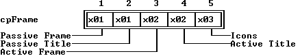

---

<a id="2U9I_C6"></a>

### TFrame::TFrame

*Keywords: TFrame::TFrame*

[See Also](#12MOQIQ)	 [TFrame class](#TFrame)

 Form 1

 
```c
TFrame(const TRect& bounds);
```
 Form 2

 
```c
TFrame( StreamableInit streamableInit);   //protected
```
#### Description
 Form 1: Calls  TView(* bounds), then sets * growModeto * gfGrowHiX| * gfGrowHiYand sets * eventMaskto * eventMask| * evBroadcast, so  TFrameobjects default to handling broadcast events.

 Form 2: Each streamable class needs a "builder" to allocate the correct memory for its objects together with the initialized vtable pointers. This is achieved by calling this constructor with an argument of type  StreamableInit.

---

<a id="12MOQIQ"></a>

#### See Also
 [TView::TView](#TView_TView)

---

<a id="TFrame_build"></a>

### TFrame::build

*Keywords: build*

[See Also](#SGP1AW)	 [TFrame class](#TFrame)
#### Syntax
```c
static TStreamable *build();
```
#### Description
 Called to create an object in certain stream-reading situations.

---

<a id="SGP1AW"></a>

#### See Also
 [TStreamableClass](#TStreamableClass)

 [ipstream::readData](#3MVS.PE)

 [TStreamable](#TStreamable)

---

<a id="TFrame_draw"></a>

### TFrame::draw

*Keywords: draw*

[TFrame class](#TFrame)
#### Syntax
```c
virtual void draw();
```
#### Description
 Draws the frame with color attributes and icons appropriate to the current * stateflags: active, inactive, being dragged. Adds zoom, close, and resize icons depending on the owner window's * flags. Adds the title, if any, from the owning window's * titledata member. Active windows are drawn with a double-lined frame and any icons; inactive windows are drawn with a single-lined frame and no icons.

---

<a id="KJ.40D"></a>

### TFrame::getPalette

*Keywords: getpalette*

[TFrame class](#TFrame)
#### Syntax
```c
virtual TPalette& getPalette() const;
```
#### Description
 Returns the default frame palette string, * cpFrame,

 "".

---

<a id="XX53ZV"></a>

### TFrame::handleEvent

*Keywords: handleEvent*

[See Also](#HP6JPG)	 [TFrame class](#TFrame)
#### Syntax
```c
virtual void handleEvent(TEvent& event);
```
#### Description
 Calls  TView::handleEvent, then handles mouse events. If the mouse is clicked on the close icon,  TFrame::handleEventgenerates a * cmCloseevent. Clicking on the zoom icon or double-clicking on the top line of the frame generates a * cmZoomevent. Dragging the top line of the frame moves the window, and dragging the resize icon moves the lower right corner of the view and therefore changes its size.

---

<a id="HP6JPG"></a>

#### See Also
 [TView::handleEvent](#4H2TBJ)

---

<a id="H2D6M4"></a>

### TFrame::setState

*Keywords: setstate*

[See Also](#H4WFZG)	 [TFrame class](#TFrame)
#### Syntax
```c
virtual void setState(ushort aState, Boolean enable);
```
#### Description
 Calls  TView::setState(* aState, enable). If the new state is * sfActiveor * sfDragging, calls  drawViewto redraw the view.

---

<a id="H4WFZG"></a>

#### See Also
 [TView::setState](#DL958G)

 [TView::drawView](#8P08.AT)

---

<a id="TGroup"></a>

### TGroup Class

*Keywords: TGroup*

[Inheritance](#TVFlow_2)
#### Header File
 views.h
#### Description
 TGroupobjects and their derivatives (called groups for short) provide the central driving power to Turbo Vision. A group is a special kind of view. In addition to all the members derived from  TViewand  TStreamable, a group has additional members and many overrides that allow it to control a dynamically linked list of views (including other groups) as though they were a single object. The subviews of a group are often groups in their own right.

 Although a group has a rectangular boundary from its  TViewancestry, a group is only visible through the displays of its subviews. A group conceptually draws itself via the  drawmember function of its subviews. A group owns its subviews, and together they must be capable of drawing (filling) the group's entire rectangular * bounds. During the life of an application, subviews and subgroups are created, inserted into groups, and displayed as a result of user activity and events generated by the application itself. The subviews can just as easily be hidden, deleted from the group, or disposed of by user actions (such as closing a window or quitting a dialog box).

 The three subclasses of  TGroup, namely  TWindow,  TDeskTop, and  TApplication(via  TProgram), illustrate the group and subgroup concept. A  TApplicationwill typically own a  TDeskTopobject, a  TStatusLineobject, and a  TMenuViewobject.  TDeskTopis a  TGroupsubclass, so it, in turn, can own  TWindowobjects, which in turn own  TFrameobjects,  TScrollBarobjects, and so on.

  TGroupobjects delegate both drawing and event handling to their subviews.

  TGroupobjects are not usually instantiated; rather you would instantiate one or more of  TGroup's subclasses:  TApplication,  TDeskTop, and  TWindow.

 All  TGroupobjects are streamable, inheriting from  TStreamableby way of  TView. This means that  TGroupobjects (including your entire application group) can be written to and read from streams in a type-safe manner using the familiar C++  iostreamoperators.

 Constructor

 
```c
TGroup
```

```c
1HLH_Q.(TRect& bounds);

  TGroup
```

```c
1HLH_Q.( StreamableInit streamableInit);   //protected

  TGroup
```

```c
1HLH_Q.();
```
 Data members

 
```c
uchar * buffer
```

```c
1T8H3XN;

 TRect  clip
```

```c
TGroup_clip;

 TView * current
```

```c
NIP81_;

 ushort  endState
```

```c
1WMDABN;

 TView * last
```

```c
TGroup_last;

 uchar  lockFlag
```

```c
81FA1B;

 phaseType  phase
```

```c
TGroup_phase;
```
 Member functions

 
```c
TView * at
```

```c
TGroup_at(short index);

 static TStreamable * build
```

```c
TGroup_build();

 virtual void  changeBounds
```

```c
FKXPQ7(TRect& bounds);

 virtual ushort  dataSize
```

```c
KFPP2D();

 virtual void  draw
```

```c
TGroup_draw();

 void  drawSubViews
```

```c
3A3Y_QP(TView *p, TView *bottom);

 virtual void  endModal
```

```c
H4RDW5(ushort command);

 virtual void  eventError
```

```c
2K7H9RC(TEvent& event);

 virtual ushort  execute
```

```c
2B.IZD();

 ushort  execView
```

```c
12U2PA7(TView *p);

 TView * first
```

```c
TGroup_first();

 TView * firstMatch
```

```c
PHFPT9(ushort aState, ushort aOptions)

 TView * firstThat
```

```c
6UM805(Boolean(*func)(TView*, void*), void *args);

 void  forEach
```

```c
7F2627(void (*func)(TView *, void *), void *args);

 void  freeBuffer
```

```c
1N2_CUH();

 void  getBuffer
```

```c
3XZ2_EU();

 virtual void  getData
```

```c
2.ZI5FP(void *rec);

 virtual ushort  getHelpCtx
```

```c
_FJ8MX();

 virtual void  handleEvent
```

```c
29EKHW(TEvent& event);

 short  indexOf
```

```c
B_XO6K(TView *p);

 void  insert
```

```c
41MN1UU(TView *p);

 void  insertBefore
```

```c
MJQ57(TView *p, TView *target);

 void  lock
```

```c
TGroup_lock();

 Boolean  matches
```

```c
2A9ALN(TView * p);

 virtual void * read
```

```c
TGroup_read( ipstream& is);   //protected

 void  redraw
```

```c
77MA9N();

 void  remove
```

```c
1FJC_R1(TView *p);

 void  removeView
```

```c
1.IAZCW(TView *p);

 void  resetCurrent
```

```c
EPFS2J();

 void  selectNext
```

```c
6B5.IG(Boolean forwards);

 void  setCurrent
```

```c
1E20JEP(TView *p, selectMode mode);

 virtual void  setData
```

```c
234H_P2(void *rec);

 virtual void  setState
```

```c
4L9N.P(ushort aState, Boolean enable);

 virtual void  shutDown
```

```c
ARP38D();

 void  unlock
```

```c
WJ6_RR();

 virtual Boolean  valid
```

```c
TGroup_valid(ushort command);

 virtual void  write
```

```c
TGroup_write( opstream& os);   //protected
```
 Friends

 The function  genRefsis a friend of  TGroup.

---

<a id="1HLH_Q."></a>

### TGroup::TGroup

*Keywords: TGroup::TGroup*

[See Also](#2JOOIG)	 [TGroup class](#TGroup)

 Form 1

 
```c
TGroup(TRect& bounds);
```
 Form 2

 
```c
TGroup( StreamableInit streamableInit);   //protected
```
#### Description
 Form 1:Calls  TView::TView(* bounds), sets * ofSelectable* ofBufferedin * options, sets * eventMaskto 0xFFFFThe members * last, current, buffer, lockFlag, endStateare all set to zero.

  Form 2:Each streamable class needs a "builder" to allocate the correct memory for its objects together with the initialized vtable pointers. This is achieved by calling this constructor with an argument of type  StreamableInit.

 Destructor

 
```c
~TGroup();
```
#### Description
 Hides the group using  hide, then disposes of each subview in the group using  delete* p.Finally, the buffer (if there is one) is freed.

---

<a id="2JOOIG"></a>

#### See Also
 [TView::hide](#TView_hide)

 [TView::TView](#TView_TView)

---

<a id="1T8H3XN"></a>

### TGroup::buffer

*Keywords: buffer*

[See Also](#4G_ZQD)	 [TGroup class](#TGroup)
#### Syntax
```c
uchar *buffer;
```
#### Description
 Points to a buffer used to cache redraw operations, or is 0 if the group has no cache buffer. Cache buffers are created and destroyed automatically, unless the * ofBufferedflag is cleared in the group's * optionsmember.

---

<a id="4G_ZQD"></a>

#### See Also
 [TGroup::draw](#TGroup_draw)

 [TGroup::lock](#TGroup_lock)

 [TGroup::unlock](#WJ6_RR)

---

<a id="TGroup_clip"></a>

### TGroup::clip

*Keywords: clip*

[See Also](#X_WWFT)	 [TGroup class](#TGroup)
#### Syntax
```c
TRect clip;
```
#### Description
 Holds the clip extent of the group, as returned by  getExtentor  getClipRect. The clip extent is defined as the minimum area that needs redrawing when  drawis called.

---

<a id="X_WWFT"></a>

#### See Also
 [TView::getClipRect](#184ADTN)

 [TView::getExtent](#_QNEP5)

---

<a id="NIP81_"></a>

### TGroup::current

*Keywords: current*

[See Also](#BBCBW)	 [TGroup class](#TGroup)
#### Syntax
```c
TView *current;
```
#### Description
 Points to the subview that is currently selected, or is 0 if no subview is selected.

---

<a id="BBCBW"></a>

#### See Also
 [TView::select](#1JH798S)

---

<a id="1WMDABN"></a>

### TGroup::endState

*Keywords: endState*

[See Also](#WJ0GYR)	 [TGroup class](#TGroup)
#### Syntax
```c
ushort endState;
```
#### Description
 Holds the state of the group after a call to  endModal.

---

<a id="WJ0GYR"></a>

#### See Also
 [TGroup::endModal](#H4RDW5)

---

<a id="TGroup_last"></a>

### TGroup::last

*Keywords: last*

[TGroup class](#TGroup)
#### Syntax
```c
TView *last;
```
#### Description
 Points to the last subview in the group (the one farthest from the top in Z-order).

---

<a id="81FA1B"></a>

### TGroup::lockFlag

*Keywords: lockFlag*

[See Also](#2S_G_E_)	 [TGroup class](#TGroup)
#### Syntax
```c
uchar lockFlag;
```
#### Description
 Acts as a semaphore to control buffered group draw operations.  lockFlagkeeps a count of the number of locks set during a set of nested  drawcalls.  lockand  unlockincrement and decrement this value. When it reaches zero, the whole group will draw itself from its buffer. Intensive draw operations should be sandwiched between calls to  lockand  unlockto prevent excessive screen flicker.

---

<a id="2S_G_E_"></a>

#### See Also
 [TGroup::draw](#TGroup_draw)

 [TGroup::lock](#TGroup_lock)

 [TGroup::unlock](#WJ6_RR)

---

<a id="TGroup_phase"></a>

### TGroup::phase

*Keywords: phase*

[See Also](#10HO7BQ)	 [TGroup class](#TGroup)
#### Syntax
```c
phaseType phase;
```
#### Description
 The current phase of processing for a focused event. Subviews that have the * ofPreProcessor * ofPostProcessflags set can examine * owner->phaseto determine whether a call to their  handleEventis happening in the * phPreProcess, * phFocused, or * phPostProcessphase.

  phaseTypeis an enumeration defined as follows in  TView:

 
```c
 enum phaseType \-phFocussed, phPreProcess, phPostProcess;
```

---

<a id="10HO7BQ"></a>

#### See Also
 [TGroup::handleEvent](#29EKHW)

---

<a id="TGroup_at"></a>

### TGroup::at

*Keywords: at*

[See Also](#H0A9J2)	 [TGroup class](#TGroup)
#### Syntax
```c
TView *at(short index);
```
#### Description
 Returns a pointer to the subview at index position in Z-order.

---

<a id="H0A9J2"></a>

#### See Also
 [TGroup:indexOf](#B_XO6K)

---

<a id="TGroup_build"></a>

### TGroup::build

*Keywords: build*

[See Also](#6H72G7)	 [TGroup class](#TGroup)
#### Syntax
```c
static TStreamable *build();
```
#### Description
 Called to create an object in certain stream-reading situations.

---

<a id="6H72G7"></a>

#### See Also
 [TStreamableClass](#TStreamableClass)

 [ipstream::readData](#3MVS.PE)

---

<a id="FKXPQ7"></a>

### TGroup::changeBounds

*Keywords: changeBounds*

[See Also](#OU2T6N)	 [TGroup class](#TGroup)
#### Syntax
```c
virtual void changeBounds (TRect& bounds);
```
#### Description
 Overrides  TView::changeBounds. Changes the group's bounds to * bounds and then calls  calcBoundsfollowed by  changeBoundsfor each subview in the group.

---

<a id="OU2T6N"></a>

#### See Also
 [TView::calcBounds](#KW36MH)

 [TView::changeBounds](#SH_KT2)

---

<a id="KFPP2D"></a>

### TGroup::dataSize

*Keywords: dataSize*

[See Also](#4D.J_UP)	 [TGroup class](#TGroup)
#### Syntax
```c
virtual ushort dataSize();
```
#### Description
 Overrides  TView::dataSize. Returns total size of group by calling and accumulating  dataSizefor each subview.

---

<a id="4D.J_UP"></a>

#### See Also
 [TView::dataSize](#1MP16EK)

---

<a id="TGroup_draw"></a>

### TGroup::draw

*Keywords: draw*

[See Also](#GTJNP0)	 [TGroup class](#TGroup)
#### Syntax
```c
virtual void draw();
```
#### Description
 Overrides  TView::draw. If a cache buffer exists (see  TGroup::bufferdata member), then the buffer is written to the screen using  TView::writeBuf. Otherwise, each subview is told to draw itself using a call to  TGroup::redraw.

---

<a id="GTJNP0"></a>

#### See Also
 [TGroup::buffer](#1T8H3XN)

 [TGroup::redraw](#77MA9N)

 [TView::draw](#TView_draw)

---

<a id="3A3Y_QP"></a>

### TGroup::drawSubViews

*Keywords: drawSubViews*

[TGroup class](#TGroup)
#### Syntax
```c
void drawSubViews(TView *p, TView *bottom);
```
#### Description
 Calls  drawViewfor each subview starting at p, until the subview bottomis reached.

---

<a id="H4RDW5"></a>

### TGroup::endModal

*Keywords: endModal*

[See Also](#LZ7NTH)	 [TGroup class](#TGroup)
#### Syntax
```c
virtual void endModal(ushort command);
```
#### Description
 If this group is the current modal view,  endModalterminates its modal state. * commandis passed to  execView(which made this view modal in the first place), which returns * commandas its result. If this group is * notthe current modal view, it calls  TView::endModal.

---

<a id="LZ7NTH"></a>

#### See Also
 [TGroup::execView](#12U2PA7)

 [TGroup::execute](#2B.IZD)

 [TView::endModal](#X4QVRW)

---

<a id="2K7H9RC"></a>

### TGroup::eventError

*Keywords: eventError*

[See Also](#2BDS5Y.)	 [TGroup class](#TGroup)
#### Syntax
```c
virtual void eventError(TEvent& event);
```
#### Description
 eventErroris called whenever the modal  TGroup::executeevent-handling loop encounters an event that cannot be handled. The default action is: If the group's * owneris nonzero,  eventErrorcalls its owner's  eventError. Normally this chains back to  TApplication's  eventError. You can override  eventErrorto trigger appropriate action.

---

<a id="2BDS5Y."></a>

#### See Also
 [TGroup::execute](#2B.IZD)

 [TGroup::execView](#12U2PA7)

---

<a id="2B.IZD"></a>

### TGroup::execute

*Keywords: execute*

[See Also](#2IX_9V5)	 [TGroup class](#TGroup)
#### Syntax
```c
virtual ushort execute();
```
#### Description
 Overrides  TView::execute.  executeis a group's main event loop: It repeatedly gets events using  getEventand handles them using  handleEvent. The event loop is terminated by the group or some subview through a call to  endModal. Before returning, however,  executecalls  validto verify that the modal state can indeed be terminated.

---

<a id="2IX_9V5"></a>

#### See Also
 [TGroup::endModal](#H4RDW5)

 [TGroup::endState](#1WMDABN)

 [TGroup::handleEvent](#29EKHW)

 [TGroup::valid](#TGroup_valid)

---

<a id="12U2PA7"></a>

### TGroup::execView

*Keywords: execView*

[See Also](#1M._0MU)	 [TGroup class](#TGroup)
#### Syntax
```c
ushort execView(TView *p);
```
#### Description
 execViewis the "modal" counterpart of the "modeless"  insertand  removemember functions. Unlike  insert, after inserting a view into the group,  execViewwaits for the view to execute, then removes the view, and finally returns the result of the execution.  execViewis used in a number of places throughout Turbo Vision, most notably to implement  TApplication::runand to execute modal dialog boxes.

  execViewsaves the current context (the selected view, the modal view, and the command set), makes * pmodal by calling * p->setState(sfModal, True), inserts * pinto the group (if it isn't already inserted), and calls * p->execute. When * p->executereturns, the group is restored to its previous state, and the result of * p->executeis returned as the result of the  execViewcall. If * pis 0 upon a call to  execView, a value of * cmCancelis returned.

---

<a id="1M._0MU"></a>

#### See Also
 [TGroup::insert](#41MN1UU)

 [TGroup::execute](#2B.IZD)

---

<a id="TGroup_first"></a>

### TGroup::first

*Keywords: first*

[See Also](#15JR3VF)	 [TGroup class](#TGroup)
#### Syntax
```c
TView *first();
```
#### Description
 Returns a pointer to the first subview (the one closest to the top in Z-order), or 0 if the group has no subviews.

---

<a id="15JR3VF"></a>

#### See Also
 [TGroup::last](#TGroup_last)

---

<a id="PHFPT9"></a>

### TGroup::firstMatch

*Keywords: firstMatch*

[TGroup class](#TGroup)
#### Syntax
```c
TView *firstMatch(ushort aState, ushort aOptions)
```
#### Description
 Returns a pointer to the first subview that matches its * statewith * aStateand its * optionswith * aOptions.

---

<a id="6UM805"></a>

### TGroup::firstThat

*Keywords: firstThat*

[See Also](#2BZ8ZMS)	 [TGroup class](#TGroup)
#### Syntax
```c
TView *firstThat(Boolean(*func)(TView*, void*), void *args);
```
#### Description
 firstThatapplies a user-supplied Boolean function  *func,along with an argument list given by * args(possibly empty), to each subview in the group (in Z-order) until  *funcreturns * True. The returned result is the subview pointer for which  *funcreturns * True, or 0 if  *funcreturns * False for all items.

 The first pointer argument of  *funcscans the subview. The second argument of  *funcis set from the * argspointer of  firstThat, as shown in the following implementation:

 
```c
 TView *TGroup::firstThat( Boolean (*func)(TView *, void *), void *args )

 \-

     TView *temp = last;

     if( temp == 0 )

 return 0;

     do  \-

         temp = temp->next;

         if( func( temp, args ) == True )

             return temp;

      while( temp != last );

     return 0;
```

---

<a id="2BZ8ZMS"></a>

#### See Also
 [TGroup::forEach](#7F2627)

---

<a id="7F2627"></a>

### TGroup::forEach

*Keywords: forEach*

[See Also](#INNYRG)	 [TGroup class](#TGroup)
#### Syntax
```c
void forEach(void (*func)(TView *, void *), void *args);
```
#### Description
 forEachapplies an action, given by the function  *func, to each subview in the group in Z-order. The * argsargument lets you pass arbitrary arguments to the action function:

 
```c
 void TGroup::forEach( void (*func)(TView*, void *), void *args )

 \-

    TView *term = last;

    TView *temp = last;

    if( temp == 0 )

 return;

    TView *next = temp->next;

    do  \-

       temp = next;

       next = temp->next;

       func( temp, args );

     while( temp != term );
```

---

<a id="INNYRG"></a>

#### See Also
 [TGroup::firstThat](#6UM805)

---

<a id="1N2_CUH"></a>

### TGroup::freeBuffer

*Keywords: freeBuffer*

[See Also](#DUNKYR)	 [TGroup class](#TGroup)
#### Syntax
```c
void freeBuffer();
```
#### Description
 Frees the group's draw buffer (if one exists) by calling  delete* bufferand setting buffer to 0.

---

<a id="DUNKYR"></a>

#### See Also
 [TGroup::buffer](#1T8H3XN)

 [TGroup::getBuffer](#3XZ2_EU)

 [TGroup::draw](#TGroup_draw)

---

<a id="3XZ2_EU"></a>

### TGroup::getBuffer

*Keywords: getBuffer*

[See Also](#9SL65Z)	 [TGroup class](#TGroup)
#### Syntax
```c
void getBuffer();
```
#### Description
 If the group is * sfExposedand * ofBuffered, a draw buffer is created. The buffer size will be (* size.x size.y) and the * bufferdata member is set to point at the new buffer.

---

<a id="9SL65Z"></a>

#### See Also
 [TGroup::buffer](#1T8H3XN)

 [TGroup::freeBuffer](#1N2_CUH)

 [TGroup::draw](#TGroup_draw)

---

<a id="2.ZI5FP"></a>

### TGroup::getData

*Keywords: getData*

[See Also](#_EWJGG)	 [TGroup class](#TGroup)
#### Syntax
```c
virtual void getData(void *rec);
```
#### Description
 Overrides  TView::getData. Calls  getDatafor each subview in reverse Z-order, incrementing the location given by * recby the * dataSizeof each subview.

---

<a id="_EWJGG"></a>

#### See Also
 [TView::getData](#E9Q276)

 [TGroup::setData](#234H_P2)

---

<a id="_FJ8MX"></a>

### TGroup::getHelpCtx

*Keywords: getHelpCtx*

[TGroup class](#TGroup)
#### Syntax
```c
virtual ushort getHelpCtx();
```
#### Description
 Returns the help context of the current focused view by calling the selected subviews'  getHelpCtxmember function. If no help context is specified by any subview,  getHelpCtxreturns the value of its own * HelpCtxmember.

---

<a id="29EKHW"></a>

### TGroup::handleEvent

*Keywords: handleEvent*

[See Also](#5QT7_DK)	 [TGroup class](#TGroup)
#### Syntax
```c
virtual void handleEvent(TEvent& event);
```
#### Description
 Overrides  TView::handleEvent. A group basically handles events by passing them to the  handleEventmember functions of one or more of its subviews. The actual routing, however, depends on the event class.

 For focused events (by default, * evKeyDownand * evCommand; see * focusedEventsvariable), event handling is done in three phases: First, the group's * phasemember is set to * phPreProcessand the event is passed to the  handleEventof all subviews that have the * ofPreProcess flag set. Next, * phaseis set to * phFocusedand the event is passed to the  handleEventof the currently selected view. Finally, * phaseis set to * phPostProcessand the event is passed to the  handleEventof all subviews that have the * ofPostProcessflag set.

 For positional events (by default, * evMouse; see * PositionalEventsvariable), the event is passed to the  handleEventof the first subview whose bounding rectangle contains the point given by * event.where.

 For broadcast events (events that aren't focused or positional), the event is passed to the  handleEventof each subview in the group in Z-order.

 If a subview's * eventMaskmember masks out an event class,  TGroup::handleEventwill  neversend events of that class to the subview. For example, the default * eventMaskof  TViewdisables * evMouseUp, * evMouseMove, and * evMouseAuto, so  TGroup::handleEvent will never send such events to a standard  TView.

---

<a id="5QT7_DK"></a>

#### See Also
 [TView::eventMask](#HQ.SC1)

---

<a id="B_XO6K"></a>

### TGroup::indexOf

*Keywords: indexOf*

[See Also](#3NG2_HM)	 [TGroup class](#TGroup)
#### Syntax
```c
short indexOf(TView *p);
```
#### Description
 Returns the Z-order position (index) of the subview p.

---

<a id="3NG2_HM"></a>

#### See Also
 [TGroup::at](#TGroup_at)

---

<a id="41MN1UU"></a>

### TGroup::insert

*Keywords: insert*

[See Also](#1TGSKBJ)	 [TGroup class](#TGroup)
#### Syntax
```c
void insert(TView *p);
```
#### Description
 Inserts the view given by * pin the group's subview list. The new subview is placed on top of all other subviews. If the subview has the * ofCenterXand/or * ofCenterYflags set, it is centered accordingly in the group. If the view has the * sfVisibleflag set, it will be shown in the group--otherwise, it remains invisible until specifically shown. If the view has the * ofSelectableflag set, it becomes the currently selected subview.

---

<a id="1TGSKBJ"></a>

#### See Also
 [TGroup::remove](#1FJC_R1)

 [TGroup::execView](#12U2PA7)

---

<a id="MJQ57"></a>

### TGroup::insertBefore

*Keywords: insertBefore*

[See Also](#04K984O)	 [TGroup class](#TGroup)
#### Syntax
```c
void insertBefore(TView *p, TView *target);
```
#### Description
 Inserts the view given by * pin front of the view given by * target. If * targetis 0, the view is placed behind all other subviews in the group.

---

<a id="04K984O"></a>

#### See Also
 [TGroup::insert](#41MN1UU)

 [TGroup::remove](#1FJC_R1)

---

<a id="TGroup_lock"></a>

### TGroup::lock

*Keywords: lock*

[See Also](#1HDC._5)	 [TGroup class](#TGroup)
#### Syntax
```c
void lock();
```
#### Description
 Locks the group, delaying any screen writes by subviews until the group is unlocked.  lockhas no effect unless the group has a cache buffer (see * ofBufferedand * TGroup::buffer).  lockworks by incrementing the data member * lockFlag. This semaphore is likewise decremented by  unlock. When a call to  unlockdecrements the count to zero, the entire group is written to the screen using the image constructed in the cache buffer.

 By "sandwiching" draw-intensive operations between calls to  lockand  unlock, unpleasant "screen flicker" can be reduced or eliminated. For example, the  TDeskTop::tileand  TDeskTop::cascademember functions use  lockand  unlockto reduce flicker.

 lockand  unlockcalls * mustbe balanced; otherwise, a group may end up in a permanently locked state, causing it to not redraw itself properly when so requested.

---

<a id="1HDC._5"></a>

#### See Also
 [TGroup::unlock](#WJ6_RR)

 [TGroup::lockFlag](#81FA1B)

---

<a id="2A9ALN"></a>

### TGroup::matches

*Keywords: matches*

[TGroup class](#TGroup)
#### Syntax
```c
Boolean matches(TView * p);
```
#### Description
 Returns * Trueif the * stateand * optionssettings of the view pare identical to those of the calling view.

---

<a id="TGroup_read"></a>

### TGroup::read

*Keywords: read*

[See Also](#52CB58H)	 [TGroup class](#TGroup)
#### Syntax
```c
virtual void *read( ipstream& is);   //protected
```
#### Description
 Reads from the input stream * is.

---

<a id="52CB58H"></a>

#### See Also
 [TStreamableClass](#TStreamableClass)

 [TStreamable](#TStreamable)

 [ipstream](#ipstream)

---

<a id="77MA9N"></a>

### TGroup::redraw

*Keywords: redraw*

[See Also](#E_70Y)	 [TGroup class](#TGroup)
#### Syntax
```c
void redraw();
```
#### Description
 Redraws the group's subviews in Z-order.  TGroup::redrawdiffers from  TGroup::drawin that  redrawwill never draw from the cache buffer.

---

<a id="E_70Y"></a>

#### See Also
 [TGroup::draw](#TGroup_draw)

---

<a id="1FJC_R1"></a>

### TGroup::remove

*Keywords: remove*

[See Also](#1GBJ8M)	 [TGroup class](#TGroup)
#### Syntax
```c
void remove(TView *p);
```
#### Description
 Removes the subview * pfrom the group and redraws the other subviews as required. * p's * ownerand * nextmembers are set to 0.

---

<a id="1GBJ8M"></a>

#### See Also
 [TGroup::insert](#41MN1UU)

 [TGroup::removeView](#1.IAZCW)

---

<a id="1.IAZCW"></a>

### TGroup::removeView

*Keywords: removeView*

[See Also](#H078CH)	 [TGroup class](#TGroup)
#### Syntax
```c
void removeView(TView *p);
```
#### Description
 Removes the subview * pfrom this group. Used internally by  TGroup::remove.

---

<a id="H078CH"></a>

#### See Also
 [TGroup::remove](#1FJC_R1)

---

<a id="EPFS2J"></a>

### TGroup::resetCurrent

*Keywords: resetCurrent*

[See Also](#F9XQL1)	 [TGroup class](#TGroup)
#### Syntax
```c
void resetCurrent();
```
#### Description
 Selects (makes current) the first subview in the chain that is * sfVisibleand * ofSelectable.  resetCurrentworks by calling:

 
```c
 setCurrent(firstMatch(sfVisible, ofSelectable), normalSelect).
```
 The following  enumtype is useful for select mode arguments:

 
```c
 enum selectMode \- normalSelect, enterSelect, leaveSelect ;
```

---

<a id="F9XQL1"></a>

#### See Also
 [TGroup::setCurrent](#1E20JEP)

---

<a id="6B5.IG"></a>

### TGroup::selectNext

*Keywords: selectNext*

[TGroup class](#TGroup)
#### Syntax
```c
void selectNext(Boolean forwards);
```
#### Description
 If * forwardsis * True,  selectNextselects (makes current) the next selectable subview (one with its * ofSelectablebit set) in the group's Z-order. If * forwardsis * False, the member function selects the previous selectable subview.

---

<a id="1E20JEP"></a>

### TGroup::setCurrent

*Keywords: setCurrent*

[See Also](#4RR4OQ)	 [TGroup class](#TGroup)
#### Syntax
```c
void setCurrent(TView *p, selectMode mode);
```
#### Description
 selectModeis an enumeration defined in  TGroupas follows:

 
```c
 enum selectMode \-normalSelect, enterSelect, leaveSelect;
```
 If pis the current subview,  setCurrentdoes nothing. Otherwise, pis made current (that is, selected) by a call to  setState.

---

<a id="4RR4OQ"></a>

#### See Also
 [TGroup::resetCurrent](#EPFS2J)

---

<a id="234H_P2"></a>

### TGroup::setData

*Keywords: setData*

[See Also](#BKG75W)	 [TGroup class](#TGroup)
#### Syntax
```c
virtual void setData(void *rec);
```
#### Description
 Overrides  TView::setData. Calls  setDatafor each subview in reverse Z-order, incrementing the location given by * recby the  dataSizeof each subview.

---

<a id="BKG75W"></a>

#### See Also
 [TGroup::getData](#2.ZI5FP)

 [TView::setData](#XH19WS)

---

<a id="4L9N.P"></a>

### TGroup::setState

*Keywords: setstate*

[See Also](#13EK1RC)	 [TGroup class](#TGroup)
#### Syntax
```c
virtual void setState(ushort aState, Boolean enable);
```
#### Description
 Overrides  TView::setState. First calls the inherited  TView::setState, then updates the subviews as follows:

|  | If * aStateis * sfActiveor * sfDragging, then each subview's  setStateis called to update the subview correspondingly. |
| --- | --- |
|  | If * aStateis * sfFocused, then the currently selected subview is called to focus itself correspondingly. If * aStateis * sfExposed,  doExposeis called for each subview. Finally, if * enableis * False,  freeBufferis called. |

---

<a id="13EK1RC"></a>

#### See Also
 [TView::setState](#DL958G)

 [TGroup::freeBuffer](#1N2_CUH)

---

<a id="ARP38D"></a>

### TGroup::shutDown

*Keywords: shutDown*

[TGroup class](#TGroup)
#### Syntax
```c
virtual void shutDown();
```
#### Description
 Used internally by  TObject::destroyto ensure correct destruction of derived and related objects.  shutDownis overridden in many classes to ensure the proper setting of related data members when  destroyis called.

---

<a id="WJ6_RR"></a>

### TGroup::unlock

*Keywords: unlock*

[See Also](#195.4HR)	 [TGroup class](#TGroup)
#### Syntax
```c
void unlock();
```
#### Description
 Unlocks the group by decrementing * lockFlag. If * lockFlagbecomes zero, then the entire group is written to the screen using the image constructed in the cache buffer.

---

<a id="195.4HR"></a>

#### See Also
 [TGroup::lock](#TGroup_lock)

---

<a id="TGroup_valid"></a>

### TGroup::valid

*Keywords: valid*

[See Also](#602CG_)	 [TGroup class](#TGroup)
#### Syntax
```c
virtual Boolean valid(ushort command);
```
#### Description
 Overrides  TView::valid. Returns * Trueif all the subview's  validcalls return * True.  TGroup::validis used at the end of the event-handling loop in  TGroup::executeto confirm that termination is allowed. A modal state cannot terminate until all  validcalls return * True. A subview can return * Falseif it wants to retain control.

---

<a id="602CG_"></a>

#### See Also
 [TView::valid](#TView_valid)

 [TGroup::execute](#2B.IZD)

---

<a id="TGroup_write"></a>

### TGroup::write

*Keywords: write*

[See Also](#5O3N_2P)	 [TGroup class](#TGroup)
#### Syntax
```c
virtual void write( opstream& os);   //protected
```
#### Description
 Writes to the output stream * os.

---

<a id="5O3N_2P"></a>

#### See Also
 [TStreamableClass](#TStreamableClass)

 [TStreamable](#TStreamable)

 [opstream](#opstream)

---

<a id="THistinit"></a>

### THistInit Class

*Keywords: THistInit*

[Inheritance](#TVFlow_1)
#### Header File
 dialogs.h
#### Description
 THistInitprovides a constructor and a  createListViewermember function used in creating and inserting a list viewer into a history window.

 Constructor

 
```c
THistInit
```

```c
8_3BJE( TListViewer *(*cListViewer)( TRect r, TWindow *w, ushort histID );
```
 Protected Member Function

 
```c
TListViewer *(* createListViewer
```

```c
IJIV4A)(TRect r, TWindow *w, ushort histId);   //protected
```

---

<a id="8_3BJE"></a>

### THistInit::THistInit

*Keywords: THistInit::THistInit*

[See Also](#YF2UH.)	 Syntax

 
```c
THistInit( TListViewer *(*cListViewer)( TRect r, TWindow *w, ushort histID );
```
#### Description
 The  THistoryWindowconstructor calls this base constructor,  THistInit::THistInit, passing the address of  THistory::initViewer, which is of type  cListViewer. This creates and inserts a list viewer into the given history window with the given size and history list.

---

<a id="YF2UH."></a>

#### See Also
 [THistoryWindow](#THistoryWindow)

---

<a id="IJIV4A"></a>

### THistInit::createListViewer

*Keywords: createListViewer*

[See Also](#1S8.3UP)	 [THistInit class](#THistinit)
#### Syntax
```c
TListViewer *(*createListViewer)(TRect r, TWindow *w, ushort histId);   //protected
```
#### Description
 Called by the  THistInitconstructor to create a list viewer for the window * wwith size * rand history list given by * histId.

---

<a id="1S8.3UP"></a>

#### See Also
 [THistory](#THistory)

 [TListViewer](#TListViewer)

 [THistoryWindow](#THistoryWindow)

---

<a id="THistory"></a>

### THistory Class

*Keywords: THistory*

[Inheritance](#TVFlow_2)
#### Header File
 dialogs.h
#### Description
 A  THistoryobject implements a pick list of previous entries, actions, or choices from which the user can select a "rerun."  THistoryobjects are linked to a  TInputLineobject and to a history list. History list information is stored in a block of memory on the heap. When the block fills up, the oldest history items are deleted as new ones are added.

  THistoryitself shows up as an icon next to an input line. When the user clicks on the history icon, Turbo Vision opens up a history window (see [THistoryWindow](#THistoryWindow)) with a history viewer (see [THistoryViewer](#THistoryViewer)) containing a list of previous entries for that list.

 Different input lines can share the same history list by using the same ID number.

 Constructor

 
```c
THistory
```

```c
4A.N0ZP(const TRect& bounds, TInputLine *aLink, ushort aHistoryId);

  THistory
```

```c
4A.N0ZP( StreamableInit streamableInit);   //protected
```
 Data Member

 
```c
TInputLine * link
```

```c
THistory_link;
```
 Protected Data Member

 
```c
ushort  historyId
```

```c
1DWU0NS;   //protected
```
#### Member Functions
```c
static TStreamable * build
```

```c
THistory_build();

 virtual void  draw
```

```c
THistory_draw();

 virtual TPalette&  getPalette
```

```c
12FRRQ0() const;

 virtual void  handleEvent
```

```c
FK.W3T(TEvent& event);

 virtual THistoryWindow * initHistoryWindow
```

```c
12NSWMW(const TRect& bounds)

 virtual void * read
```

```c
THistory_read( ipstream& is);   //protected

 virtual void  recordHistory
```

```c
UMTLGA( const char *s );

 virtual void  shutDown
```

```c
AJ9L3N();

 virtual void  write
```

```c
THistory_write( opstream& os);   //protected
```
 Palette

 History icons use the default palette, * cpHistory, to map onto the twenty-second and twenty-third entries in the standard dialog box palette.

 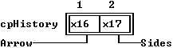

---

<a id="4A.N0ZP"></a>

### THistory::THistory

*Keywords: THistory::THistory*

[See Also](#10.JFPS)	 [THistory class](#THistory)

 Form 1

 
```c
THistory(const TRect& bounds, TInputLine *aLink, ushort aHistoryId);
```
 Form 2

 
```c
THistory( StreamableInit streamableInit);   //protected
```
#### Description
 Form 1: Creates a  THistoryobject of the given size by calling  TView(* bounds), then setting the * linkand * historyIdmembers with the given argument values. The * optionsmember is set to * ofPostProcess. The * evBroadcastbit is set in * eventMaskin addition to the * evMouseDown, * evKeyDown, and * evCommandbits set by  TView(* bounds).

  Form 2: Each streamable class needs a "builder" to allocate the correct memory for its objects together with the initialized vtable pointers. This is achieved by calling this constructor with an argument of type  StreamableInit.

---

<a id="10.JFPS"></a>

#### See Also
 [TView::TView](#TView_TView)

---

<a id="1DWU0NS"></a>

### THistory::historyID

*Keywords: historyID*

[THistory class](#THistory)
#### Syntax
```c
ushort historyId;   //protected
```
#### Description
 Each history list has a unique ID number, assigned by the programmer. Different history objects in different windows may share a history list by using the same history ID.

---

<a id="THistory_link"></a>

### THistory::link

*Keywords: link*

[THistory class](#THistory)
#### Syntax
```c
TInputLine *link;
```
#### Description
 A pointer to the linked  TInputLineobject.

---

<a id="THistory_build"></a>

### THistory::build

*Keywords: build*

[See Also](#51BN.B)	 [THistory class](#THistory)
#### Syntax
```c
static TStreamable *build();
```
#### Description
 Called to create an object in certain stream-reading situations.

---

<a id="51BN.B"></a>

#### See Also
 [TStreamableClass](#TStreamableClass)

 [ipstream::readData](#3MVS.PE)

---

<a id="THistory_draw"></a>

### THistory::draw

*Keywords: draw*

[THistory class](#THistory)
#### Syntax
```c
virtual void draw();
```
#### Description
 Draws the  THistoryicon in the default palette.

---

<a id="12FRRQ0"></a>

### THistory::getPalette

*Keywords: getpalette*

[THistory class](#THistory)
#### Syntax
```c
virtual TPalette& getPalette() const;
```
#### Description
 Returns a pointer to the default palette, * cpHistory,

 "".

---

<a id="FK.W3T"></a>

### THistory::handleEvent

*Keywords: handleEvent*

[See Also](#7096LF)	 [THistory class](#THistory)
#### Syntax
```c
virtual void handleEvent(TEvent& event);
```
#### Description
 Calls  TView::handleEvent(* event), then handles relevant mouse and key events to select the linked input line and create a history window.

---

<a id="7096LF"></a>

#### See Also
 [THistory::initHistoryWindow](#12NSWMW)

---

<a id="12NSWMW"></a>

### THistory::initHistoryWindow

*Keywords: initHistoryWindow*

[THistory class](#THistory)
#### Syntax
```c
virtual THistoryWindow *initHistoryWindow(const TRect& bounds)
```
#### Description
 Creates a  THistoryWindowobject and returns a pointer to it. The new object has the given * boundsand the same * historyIdas the calling  THistoryobject. The new object gets its * helpCtxfrom the calling object's linked  TInputLine.

---

<a id="THistory_read"></a>

### THistory::read

*Keywords: read*

[See Also](#325DZ8.)	 [THistory class](#THistory)
#### Syntax
```c
virtual void *read( ipstream& is);   //protected
```
#### Description
 Reads from the input stream * is.

---

<a id="325DZ8."></a>

#### See Also
 [TStreamableClass](#TStreamableClass)

 [TStreamable](#TStreamable)

 [ipstream](#ipstream)

---

<a id="UMTLGA"></a>

### THistory::recordHistory

*Keywords: recordHistory*

[THistory class](#THistory)
#### Syntax
```c
virtual void recordHistory( const char *s );
```
#### Description
 Adds the string * sto the history list.

---

<a id="AJ9L3N"></a>

### THistory::shutDown

*Keywords: shutDown*

[THistory class](#THistory)
#### Syntax
```c
virtual void shutDown();
```
#### Description
 Used internally by  TObject::destroyto ensure correct destruction of derived and related objects.  shutDownis overridden in many classes to ensure the proper setting of related data members when  destroyis called.

---

<a id="THistory_write"></a>

### THistory::write

*Keywords: write*

[See Also](#0SP1D1)	 [THistory class](#THistory)
#### Syntax
```c
virtual void write( opstream& os);   //protected
```
#### Description
 Writes to the output stream * os.

---

<a id="0SP1D1"></a>

#### See Also
 [TStreamableClass](#TStreamableClass)

 [TStreamable](#TStreamable)

 [opstream](#opstream)

---

<a id="THistoryViewer"></a>

### THistoryViewer Class

*Keywords: THistoryViewer*

[Inheritance](#TVFlow_2)
#### Header File
 dialogs.h
#### Description
 THistoryVieweris a rather straightforward descendant of  TListViewer. It is used by the history list system, and appears inside the history window set up by clicking on the history icon.

 Constructor

 
```c
THistoryViewer
```

```c
AY7C3X(const TRect& bounds, TScrollBar *aHScrollBar, TScrollBar *aVScrollBar, ushort
```
 Data Member

 
```c
ushort  historyId
```

```c
1NS5WW3;   //protected
```
#### Member Functions
```c
virtual TPalette&  getPalette
```

```c
PH_6UL() const;

 virtual void  getText
```

```c
1MFX6CG(char *dest, short item, short maxLen);

 virtual void  handleEvent
```

```c
D9XRSW(TEvent& event);

 int  historyWidth
```

```c
1.IMX1Q();
```
 Palette

 History viewer objects use the default palette * cpHistoryViewerto map onto the sixth and seventh entries in the standard dialog box palette.

 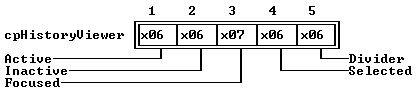

---

<a id="AY7C3X"></a>

### THistoryViewer::THistoryViewer

*Keywords: THistoryViewer::THistoryViewer*

[See Also](#6Y5E0E)	 [THistoryViewer class](#THistoryViewer)
#### Syntax
```c
THistoryViewer(const TRect& bounds, TScrollBar *aHScrollBar, TScrollBar *aVScrollBar, ushort aHistoryId);
```
#### Description
 Initializes the viewer list by first calling the  TListViewerconstructor to set up the boundaries, a single column, and the two scroll bar pointers passed in * aHScrollBarand * aVScrollBar. The view is then linked to a history list, with the * historyIDdata member set to the value passed in * aHistory. That list is then checked for length, so the range of the list is set to the number of items in the list. The first item in the history list is given the focus, and the horizontal scrolling range is set to accommodate the widest item in the list.

---

<a id="6Y5E0E"></a>

#### See Also
 [TListViewer::TListViewer](#R7.FAU)

---

<a id="1NS5WW3"></a>

### THistoryViewer::historyId

*Keywords: historyID*

[THistoryViewer class](#THistoryViewer)
#### Syntax
```c
ushort historyId;   //protected
```
#### Description
 *historyIdis the ID number of the history list to be displayed in the view.

---

<a id="PH_6UL"></a>

### THistoryViewer::getPalette

*Keywords: getpalette*

[THistoryViewer class](#THistoryViewer)
#### Syntax
```c
virtual TPalette& getPalette() const;
```
#### Description
 Returns the default palette string, * cpHistoryViewer,

 "".

---

<a id="1MFX6CG"></a>

### THistoryViewer::getText

*Keywords: getText*

[See Also](#1F9WPBR)	 [THistoryViewer class](#THistoryViewer)
#### Syntax
```c
virtual void getText(char *dest, short item, short maxLen);
```
#### Description
 Set * destto the * item'th string in the associated history list.  getTextis called by the virtual  drawmember function for each visible item in the list.

---

<a id="1F9WPBR"></a>

#### See Also
 [TListViewer::draw](#TListViewer_draw)

---

<a id="D9XRSW"></a>

### THistoryViewer::handleEvent

*Keywords: handleEvent*

[See Also](#3AB9_UU)	 [THistoryViewer class](#THistoryViewer)
#### Syntax
```c
virtual void handleEvent(TEvent& event);
```
#### Description
 The history viewer handles two kinds of events itself; all others are passed to  TListViewer::handleEvent. Double clicking or pressing the Enter key terminates the modal state of the history window with a * cmOKcommand. Pressing the Esc key, or any * cmCancelcommand event, cancels the history list selection.

---

<a id="3AB9_UU"></a>

#### See Also
 [TListViewer::handleEvent](#1TNG9E9)

---

<a id="1.IMX1Q"></a>

### THistoryViewer::historyWidth

*Keywords: historyWidth*

[THistoryViewer class](#THistoryViewer)
#### Syntax
```c
int historyWidth();
```
#### Description
 Returns the length of the longest string in the history list associated with * historyID.

---

<a id="THistoryWindow"></a>

### THistoryWindow Class

*Keywords: THistoryWindow*

[Inheritance](#TVFlow_1)
#### Header File
 dialogs.h
#### Description
 THistoryWindowis a specialized descendant of  TWindowand  THistInit(multiple inheritance) used for holding a history list viewer when the user clicks on the history icon next to an input line. By default, the window has no title and no number. The history window's frame has only a close icon: the window can be closed, but not resized or zoomed.

 Constructors

 
```c
THistoryWindow
```

```c
1.JVQUL(const TRect& bounds, ushort aHistoryId);
```
 Data Member

 
```c
TListViewer * viewer
```

```c
FJC30_;   //protected
```
#### Member Functions
```c
virtual TPalette&  getPalette
```

```c
1ZJO4() const;

 virtual void  getSelection
```

```c
5_1I6M(char * dest);

 static TListViewer * initViewer
```

```c
DH.PQX(TRect bounds, TWindow *w, ushort aHistoryId);
```
 Palette

 History window objects use the default palette * cpHistoryWindowto map onto the 19th through 25th entries in the standard dialog box palette.

 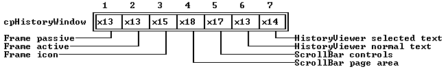

---

<a id="1.JVQUL"></a>

### THistoryWindow::THistoryWindow

*Keywords: THistoryWindow::THistoryWindow*

[See Also](#V065FE)	 [THistoryWindow class](#THistoryWindow)
#### Syntax
```c
THistoryWindow(const TRect& bounds, ushort aHistoryId);
```
#### Description
 Calls the  THistInitconstructor with the argument  &THistoryWindow::initViewer. This creates the list viewer. Next, the  TWindowconstructor is called to set up a window with the given * bounds, a null title string, and no window number (* wnNoNumber). Then the  TWindowInitconstructor is called with the argument  &THistoryWindow::initFrameto create a frame for the history window. Finally, the  TWindow::flagsdata member is set to * wfCloseto provide a close icon, and a history viewer object is created and inserted in the history window to show the items in the history list given by * ahistoryID.

---

<a id="V065FE"></a>

#### See Also
 [TWindow constructor](#1CPIMWX)

 [THistoryWindow::initViewer](#DH.PQX)

---

<a id="FJC30_"></a>

### THistoryWindow::viewer

*Keywords: viewer*

[THistoryWindow class](#THistoryWindow)
#### Syntax
```c
TListViewer *viewer;   //protected
```
#### Description
 *viewerpoints to the list viewer to be contained in this history window.

---

<a id="1ZJO4"></a>

### THistoryWindow::getPalette

*Keywords: getpalette*

[THistoryWindow class](#THistoryWindow)
#### Syntax
```c
virtual TPalette& getPalette() const;
```
#### Description
 Returns the default palette string, * cpHistoryWindow, "\".

---

<a id="5_1I6M"></a>

### THistoryWindow::getSelection

*Keywords: getSelection*

[See Also](#4BENW4P)	 [THistoryWindow class](#THistoryWindow)
#### Syntax
```c
virtual void getSelection(char * dest);
```
#### Description
 Returns in * destthe string value of the focused item in the associated history viewer.

---

<a id="4BENW4P"></a>

#### See Also
 [THistoryViewer::getText](#1MFX6CG)

---

<a id="DH.PQX"></a>

### THistoryWindow::initViewer

*Keywords: initViewer*

[See Also](#3GNK_4)	 [THistoryWindow class](#THistoryWindow)
#### Syntax
```c
static TListViewer *initViewer(TRect bounds, TWindow *w, ushort aHistoryId);
```
#### Description
 Instantiates and inserts a  THistoryViewerobject inside the boundaries of the history window for the list associated with the ID * aHistoryId. Standard scroll bars are placed on the frame of the window to scroll the list.

---

<a id="3GNK_4"></a>

#### See Also
 [THistoryViewer constructor](#AY7C3X)

---

<a id="THWMouse"></a>

### THWMouse Class

*Keywords: THWMouse*

[Inheritance](#TVFlow_1)
#### Header File
 system.h
#### Description
 THWMouse provides low-level mouse handling functions for its derived ClassHeader File class  TMouse. These, and the other systems classes in system.h, are listed briefly for guidance only: they are used internally by Turbo Vision and you would not need to use them explicitly for normal applications.

 Constructor

 
```c
THWMouse
```

```c
150J911();   //protected

  THWMouse
```

```c
150J911( const THWMouse& m);   //protected

  THWMouse
```

```c
150J911();   //protected
```
#### Data Members
```c
static uchar  buttonCount
```

```c
027HUV;   //protected
```
#### Member Functions
```c
static void  getEvent
```

```c
1JOK1YD( MouseEventType& me );   //protected

 static void  hide
```

```c
THWMouse_hide();   //protected

 static void  inhibit
```

```c
VIDD1V();   //protected

 static Boolean  present
```

```c
F6KL7R();   //protected

 static void  registerHandler
```

```c
.OVNTE( unsigned mask, void (*func)() );   //protected

 static void  resume
```

```c
DH_9GK();   //protected

 static void  setRange
```

```c
1X0F_0N( ushort rx, ushort ry );   //protected

 static void  show
```

```c
THWMouse_show();   //protected

 static void  suspend
```

```c
8A7NCH();   //protected
```

---

<a id="150J911"></a>

### THWMouse::THWMouse

*Keywords: THWMouse::THWMouse*

[See Also](#X9IVTT)

 Form 1

 
```c
THWMouse();   //protected
```
 Form 2

 
```c
THWMouse( const THWMouse& m);   //protected
```
#### Description
 Calls  THWMouse::resume.

 Destructor

 
```c
~THWMouse();   //protected
```
 Calls  THWMouse::suspend.

---

<a id="X9IVTT"></a>

#### See Also
 [THWMouse::suspend](#8A7NCH)

 [THWMouse::resume](#DH_9GK)

---

<a id="027HUV"></a>

### THWMouse::buttonCount

*Keywords: buttonCount*

[THWMouse class](#THWMouse)
#### Syntax
```c
static uchar buttonCount;   //protected
```
#### Description
 Holds the number of buttons on the mouse, or 0 if no mouse is detected.

---

<a id="1JOK1YD"></a>

### THWMouse::getEvent

*Keywords: getEvent*

[See Also](#8WZZ85)	 [THWMouse class](#THWMouse)
#### Syntax
```c
static void getEvent( MouseEventType& me );   //protected
```
#### Description
 Gets a mouse event from the event queue and sets the * buttons, * where.x, * where.yand * doubleClickdata members of the  MouseEventTypestructure,  me.

---

<a id="8WZZ85"></a>

#### See Also
 [MouseEventType](#MouseEventType)

---

<a id="THWMouse_hide"></a>

### THWMouse::hide

*Keywords: hide*

[THWMouse class](#THWMouse)
#### Syntax
```c
static void hide();   //protected
```
#### Description
 Hides the mouse cursor.

---

<a id="VIDD1V"></a>

### THWMouse::inhibit

*Keywords: inhibit*

[THWMouse class](#THWMouse)
#### Syntax
```c
static void inhibit();   //protected
```
#### Description
 Forces Turbo Vision to ignore a mouse, if one is found. This allows you to test your program as it is used in an environment without a mouse.

---

<a id="F6KL7R"></a>

### THWMouse::present

*Keywords: present*

[THWMouse class](#THWMouse)
#### Syntax
```c
static Boolean present();   //protected
```
#### Description
 Returns * Trueif a mouse is physically present and active; otherwise returns * False.

---

<a id=".OVNTE"></a>

### THWMouse::registerHandler

*Keywords: registerHandler*

[THWMouse class](#THWMouse)
#### Syntax
```c
static void registerHandler( unsigned mask, void (*func)() );   //protected
```
#### Description
 Registers * funcas the current mouse handler, and sets * handlerInstalledas * True.

---

<a id="DH_9GK"></a>

### THWMouse::resume

*Keywords: resume*

[THWMouse class](#THWMouse)
#### Syntax
```c
static void resume();   //protected
```
#### Description
 Restores the mouse by (re-)registering the handler and (re-)setting * buttonCount.

---

<a id="1X0F_0N"></a>

### THWMouse::setRange

*Keywords: setRange*

[THWMouse class](#THWMouse)
#### Syntax
```c
static void setRange( ushort rx, ushort ry );   //protected
```
#### Description
 Sets the mouse range to the given * x, * yarguments.

---

<a id="THWMouse_show"></a>

### THWMouse::show

*Keywords: show*

[THWMouse class](#THWMouse)
#### Syntax
```c
static void show();   //protected
```
#### Description
 Displays the mouse cursor.

---

<a id="8A7NCH"></a>

### THWMouse::suspend

*Keywords: suspend*

[See Also](#1RQ3GH2)	 [THWMouse class](#THWMouse)
#### Syntax
```c
static void suspend();   //protected
```
#### Description
 Does nothing if  presentreturns * False; otherwise, hides the mouse, unregisters the handler, and sets * buttonCountto zero.

---

<a id="1RQ3GH2"></a>

#### See Also
 [THWMouse::present](#F6KL7R)

---

<a id="TIndicator"></a>

### TIndicator Class

*Keywords: TIndicator*

[Inheritance](#TVFlow_1)
#### Header File
 editors.h
#### Description
 TIndicatoris the line and column counter in the lower left corner of the edit window. It is initialized by the  TEditWindowconstructor and passed as the fourth argument to the  TEditorconstructor.

 Constructor

 
```c
TIndicator
```

```c
1OGVAD5( const TRect& bounds);
```
#### Data Members
```c
TPoint  location
```

```c
1CBK8H;   //protected

 Boolean  modified
```

```c
3L4X0BP;   //protected
```
#### Member Functions
```c
static TStreamable * build
```

```c
TIndicator_build();

 virtual void  draw
```

```c
TIndicator_draw();

 virtual TPalette&  getPalette
```

```c
D89B8Z() const;

 virtual void * read
```

```c
TIndicator_read(ipstream& os);   //protected

 virtual void  setState
```

```c
KF3ZM4( ushort aState, Boolean enable );

 void  setValue
```

```c
KHL0N4( const TPoint& aLocation, Boolean aModified);

 virtual void  write
```

```c
TIndicator_write(opstream& os);   //protected
```

---

<a id="1OGVAD5"></a>

### TIndicator::TIndicator

*Keywords: TIndicator::TIndicator*

[TIndicator class](#TIndicator)
#### Syntax
```c
TIndicator( const TRect& bounds);
```
#### Description
 Creates a  TIndicatorobject.

---

<a id="1CBK8H"></a>

### TIndicator::location

*Keywords: location*

[TIndicator class](#TIndicator)
#### Syntax
```c
TPoint location;   //protected
```
#### Description
 Stores the location to display. Updated by the associated  TEditor.

---

<a id="3L4X0BP"></a>

### TIndicator::modified

*Keywords: modified*

[See Also](#2VMY.W3)	 [TIndicator class](#TIndicator)
#### Syntax
```c
Boolean modified;   //protected
```
#### Description
 *Trueif the associated  TEditorhas been modified.

---

<a id="2VMY.W3"></a>

#### See Also
 [TIndicator::draw](#TIndicator_draw)

---

<a id="TIndicator_build"></a>

### TIndicator::build

*Keywords: build*

[See Also](#1N4RLIY)	 [TIndicator class](#TIndicator)
#### Syntax
```c
static TStreamable *build();
```
#### Description
 Called to create an object in certain stream reading situations.

---

<a id="1N4RLIY"></a>

#### See Also
 [TStreamableClass](#TStreamableClass)

 [ipstream::readData](#3MVS.PE)

---

<a id="TIndicator_draw"></a>

### TIndicator::draw

*Keywords: draw*

[TIndicator class](#TIndicator)
#### Syntax
```c
virtual void draw();
```
#### Description
 Draws the indicator. If * modifiedis * True, a special character (ASCII value 15) is displayed.

---

<a id="D89B8Z"></a>

### TIndicator::getPalette

*Keywords: getpalette*

[TIndicator class](#TIndicator)
#### Syntax
```c
virtual TPalette& getPalette() const;
```
#### Description
 Returns * cpIndicator= "" (the  TIndicatordefault palette).

---

<a id="TIndicator_read"></a>

### TIndicator::read

*Keywords: read*

[See Also](#2IKUNDP)	 [TIndicator class](#TIndicator)
#### Syntax
```c
virtual void *read(ipstream& os);   //protected
```
#### Description
 Reads from the input stream * is.

---

<a id="2IKUNDP"></a>

#### See Also
 [TStreamableClass](#TStreamableClass)

 [ipstream](#ipstream)

---

<a id="KF3ZM4"></a>

### TIndicator::setState

*Keywords: setstate*

[TIndicator class](#TIndicator)
#### Syntax
```c
virtual void setState( ushort aState, Boolean enable );
```
#### Description
 Draws the indicator in the frame-dragging color if the view is being dragged.

---

<a id="KHL0N4"></a>

### TIndicator::setValue

*Keywords: setValue*

[TIndicator class](#TIndicator)
#### Syntax
```c
void setValue( const TPoint& aLocation, Boolean aModified);
```
#### Description
 Method called by  TEditorto update and display the values of the data members of the associated  TIndicatorobject.

---

<a id="TIndicator_write"></a>

### TIndicator::write

*Keywords: write*

[See Also](#1SW4ZQH)	 [TIndicator class](#TIndicator)
#### Syntax
```c
virtual void write(opstream& os);   //protected
```
#### Description
 Writes to the output stream * os.

---

<a id="1SW4ZQH"></a>

#### See Also
 [TStreamableClass](#TStreamableClass)

 [opstream](#opstream)

---

<a id="TInputLine"></a>

### TInputLine Class

*Keywords: TInputLine*

[Inheritance](#TVFlow_2)
#### Header File
 dialogs.h
#### Description
 A  TInputLineobject provides a basic input line string editor. It handles keyboard input and mouse clicks and drags for block marking and a variety of line editing functions (see  TInputLine::handleEvent). The selected text is deleted and then replaced by the first text input. If * maxLenis greater than the * xdimension (* size.x), horizontal scrolling is supported and indicated by left and right arrows.

 The  getDataand  setDatamember functions are available for writing and reading data strings (referenced via the * datastring data member) into the given record.  TInputLine::setStatesimplifies the redrawing of the view with appropriate colors when the state changes from or to * sfActiveand * sfSelected.

 An input line frequently has a  TLabeland/or a  THistoryobject associated with it.

  TInputLinecan be extended to handle data types other than strings. To do so, you'll generally add additional data members and then override the constructors and the  store,  valid,  dataSize,  getData, and  setDatamember functions.

 Constructor

 
```c
TInputLine
```

```c
32BKZ6M( const TRect& bounds int aMaxLen TValidator *aValid = 0 );

  TInputLine
```

```c
32BKZ6M( StreamableInit streamableInit);  // protected

  InputLine
```

```c
32BKZ6M();
```
#### Data Members
```c
int  curPos
```

```c
AJBVZD;

 char * data
```

```c
TInputLine_data;

 int  firstPos
```

```c
MDG2P_;

 int  maxLen
```

```c
1ZI5QT4;

 int  selEnd
```

```c
Q0.KY5;

 int  selStart
```

```c
58MM_GX;
```
#### Member Functions
```c
static TStreamable * build
```

```c
TInputLine_build();

 virtual ushort  dataSize
```

```c
2FDSAKC();

 virtual void  draw
```

```c
TInputLine_draw();

 virtual void  getData
```

```c
7QYZKU(void *rec);

 virtual TPalette&  getPalette
```

```c
1OGP2NG() const;

 void  handleEvent
```

```c
1MO5.4I(TEvent& event);

 virtual void * read
```

```c
TInputLine_read( ipstream& is);   //protected

 void  selectAll
```

```c
EF.KDJ(Boolean enable);

 virtual void  setData
```

```c
K507AG(void *rec);

 virtual void  setState
```

```c
62VY_5Y(ushort aState, Boolean enable);

 virtual Boolean  valid
```

```c
TInputLine_valid( ushort cmd );

 void  setValidator
```

```c
BTCPRZ( TValidator *aValidator );

 virtual void  write
```

```c
TInputLine_write( opstream& os);   //protected
```
 Palette

 Input lines use the default palette, * cpInputLine, to map onto the 19th through 21st entries in the standard dialog palette.

 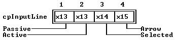

---

<a id="32BKZ6M"></a>

### TInputLine::TInputLine

*Keywords: TInputLine::TInputLine*

[See Also](#C_UQAY)	 [TInputLine class](#TInputLine)

 Form 1

 
```c
TInputLine( const TRect& bounds int aMaxLen TValidator *aValid = 0 );
```
 Form 2

 
```c
TInputLine( StreamableInit streamableInit);   //protected
```
#### Description
 Form 1:Creates an input box control with the given values by calling  TView(* bounds). * stateis then set to * sfCursorVis, optionsis set to (* ofSelectable| * ofFirstClick), and * maxLenis set to * aMaxLen- 1. Memory is allocated cleared for * aMaxlen+ 1 bytes and the the * datadata member set to point at this allocation. * validatoris initialized with the value of * aValid.

  Form 2:Each streamable class needs a "builder" to allocate the correct memory for its objects together with the initialized vtable pointers. This is achieved by calling this constructor with an argument of type  StreamableInit. 

 Destructor

 
```c
~InputLine();
```
#### Description
 Deletes the * datamemory allocation, then calls  ~TViewto destroy the  TInputLineobject.

---

<a id="C_UQAY"></a>

#### See Also
 [~TView](#TView_TView)

 [TView::TView](#TView_TView)

---

<a id="AJBVZD"></a>

### TInputLine::curPos

*Keywords: curPos*

[See Also](#GAGZXK)	 [TInputLine class](#TInputLine)
#### Syntax
```c
int curPos;
```
#### Description
 Index to insertion point (that is, to the current cursor position).

---

<a id="GAGZXK"></a>

#### See Also
 [TInputLine::selectAll](#EF.KDJ)

---

<a id="TInputLine_data"></a>

### TInputLine::data

*Keywords: data*

[TInputLine class](#TInputLine)
#### Syntax
```c
char *data;
```
#### Description
 The string containing the edited information.

---

<a id="MDG2P_"></a>

### TInputLine::firstPos

*Keywords: firstPos*

[See Also](#F_YQ7D)	 [TInputLine class](#TInputLine)
#### Syntax
```c
int firstPos;
```
#### Description
 Index to the first displayed character.

---

<a id="F_YQ7D"></a>

#### See Also
 [TInputLine::selectAll](#EF.KDJ)

---

<a id="1ZI5QT4"></a>

### TInputLine::maxLen

*Keywords: maxLen*

[See Also](#196IZP)	 [TInputLine class](#TInputLine)
#### Syntax
```c
int maxLen;
```
#### Description
 Maximum length allowed for string to grow (excluding the final 0).

---

<a id="196IZP"></a>

#### See Also
 [TInputLine::dataSize](#2FDSAKC)

---

<a id="Q0.KY5"></a>

### TInputLine::selEnd

*Keywords: selEnd*

[See Also](#04UZTJ)	 [TInputLine class](#TInputLine)
#### Syntax
```c
int selEnd;
```
#### Description
 Index to the end of the selection area (that is, to the last character block marked).

---

<a id="04UZTJ"></a>

#### See Also
 [TInputLine::selectAll](#EF.KDJ)

---

<a id="58MM_GX"></a>

### TInputLine::selStart

*Keywords: selStart*

[See Also](#HHRPCY)	 [TInputLine class](#TInputLine)
#### Syntax
```c
int selStart;
```
#### Description
 Index to the beginning of the selection area (that is, to the first character block marked).

---

<a id="HHRPCY"></a>

#### See Also
 [TInputLine::selectAll](#EF.KDJ)

---

<a id="TInputLine_build"></a>

### TInputLine::build

*Keywords: build*

[See Also](#3FBZ1ZP)	 [TInputLine class](#TInputLine)
#### Syntax
```c
static TStreamable *build();
```
#### Description
 Called to create an object in certain stream-reading situations.

---

<a id="3FBZ1ZP"></a>

#### See Also
 [TStreamableClass](#TStreamableClass)

 [ipstream::readData](#3MVS.PE)

---

<a id="2FDSAKC"></a>

### TInputLine::dataSize

*Keywords: dataSize*

[See Also](#52OOO1)	 [TInputLine class](#TInputLine)
#### Syntax
```c
virtual ushort dataSize();
```
#### Description
 Returns the size of the record for  TInputLine::getDataand  TInputLine::setDatacalls. By default, it returns * maxLen+ 1. Override this member function if you define descendants to handle other data types.

---

<a id="52OOO1"></a>

#### See Also
 [TInputLine::getData](#7QYZKU)

 [TInputLine::setData](#K507AG)

---

<a id="TInputLine_draw"></a>

### TInputLine::draw

*Keywords: draw*

[TInputLine class](#TInputLine)
#### Syntax
```c
virtual void draw();
```
#### Description
 Draws the input box and its data. The box is drawn with the appropriate colors depending on whether the box is * sfFocused(that is, whether the box view owns the cursor), and arrows are drawn if the input string exceeds the size of the view (in either or both directions). Any selected (block-marked) characters are drawn with the appropriate palette.

---

<a id="7QYZKU"></a>

### TInputLine::getData

*Keywords: getData*

[See Also](#1275FA8)	 [TInputLine class](#TInputLine)
#### Syntax
```c
virtual void getData(void *rec);
```
#### Description
 Writes the number of bytes (obtained from a call to  dataSize) from the * datastring to the array given by * rec. Used with  setDatafor a variety of applications; for example, temporary storage, or passing on the input string to other views. Override  getDataif you define  TInputLinedescendants to handle non-string data types. You can also use  getDatato convert from a string to other data types after editing by  TInputLine.

---

<a id="1275FA8"></a>

#### See Also
 [TInputLine::dataSize](#2FDSAKC)

 [TInputLine::setData](#K507AG)

---

<a id="1OGP2NG"></a>

### TInputLine::getPalette

*Keywords: getpalette*

[TInputLine class](#TInputLine)
#### Syntax
```c
virtual TPalette& getPalette() const;
```
#### Description
 Returns the default palette string, * cpInputLine, "".

---

<a id="1MO5.4I"></a>

### TInputLine::handleEvent

*Keywords: handleEvent*

[See Also](#RYJJ90)	 [TInputLine class](#TInputLine)
#### Syntax
```c
void handleEvent(TEvent& event);
```
#### Description
 Calls  TView::handleEvent, then handles all mouse and keyboard events if the input box is selected. This member function implements the standard editing capability of the input box.

 Editing features include: block marking with mouse click and drag; block deletion; insert or overwrite control with automatic cursor shape change; automatic and manual scrolling as required (depending on relative sizes of the * datastring and * size.x); manual horizontal scrolling via mouse clicks on the arrow icons; manual cursor movement by arrow, Home, and End keys (and their standard control-key equivalents); character and block deletion with Del and Ctrl-G. The view is redrawn as required and the  TInputLinedata members are adjusted appropriately.

---

<a id="RYJJ90"></a>

#### See Also
 [TView::handleEvent](#4H2TBJ)

 [TInputLine::selectAll](#EF.KDJ)

---

<a id="TInputLine_read"></a>

### TInputLine::read

*Keywords: read*

[See Also](#2TZ9QNP)	 [TInputLine class](#TInputLine)
#### Syntax
```c
virtual void *read( ipstream& is);   //protected
```
#### Description
 Reads from the input stream * is.

---

<a id="2TZ9QNP"></a>

#### See Also
 [TStreamableClass](#TStreamableClass)

 [TStreamable](#TStreamable)

 [ipstream](#ipstream)

---

<a id="EF.KDJ"></a>

### TInputLine::selectAll

*Keywords: selectAll*

[See Also](#5LQD_2N)	 [TInputLine class](#TInputLine)
#### Syntax
```c
void selectAll(Boolean enable);
```
#### Description
 Sets * curPos, * firstPos, and * selStartto 0. If * enableis set to * True, * selEndis set to the length of the * datastring, thereby selecting the whole input line; if * enableis set to * False, * selEndis set to 0, thereby deselecting the whole line. Finally, the view is redrawn by calling  drawView.

---

<a id="5LQD_2N"></a>

#### See Also
 [TView::drawView](#8P08.AT)

---

<a id="K507AG"></a>

### TInputLine::setData

*Keywords: setData*

[See Also](#E3D3C8)	 [TInputLine class](#TInputLine)
#### Syntax
```c
virtual void setData(void *rec);
```
#### Description
 By default, copies the number of bytes (as returned by  dataSize) from the * recarray to the * datastring, and then calls  selectAll(* True). This zeros * curPos, * firstPos, and * selStart. Finally,  drawViewis called to redraw the input box.

 Override  setDataif you define descendants to handle non-string data types. You also use  setDatato convert other data types to a string for editing by  TInputLine.

---

<a id="E3D3C8"></a>

#### See Also
 [TInputLine::dataSize](#2FDSAKC)

 [TInputLine::getData](#7QYZKU)

 [TInputLine::selectAll](#EF.KDJ)

---

<a id="62VY_5Y"></a>

### TInputLine::setState

*Keywords: setstate*

[See Also](#60.L_0X)	 [TInputLine class](#TInputLine)
#### Syntax
```c
virtual void setState(ushort aState, Boolean enable);
```
#### Description
 Called when the input box needs redrawing (for example, if the palette is changed) following a change of * state. Calls  TView::setStateto set or clear the view's * statewith the given * aStatebit(s). Then if * aStateis * sfSelected(or * sfActiveand the input box is * sfSelected),  selectAll(* enable) is called (which, in turn, calls  drawView).

---

<a id="60.L_0X"></a>

#### See Also
 [TView::setState](#DL958G)

 [TInputLine::selectAll](#EF.KDJ)

---

<a id="TInputLine_valid"></a>

### TInputLine::valid

*Keywords: valid*

[TInputLine class](#TInputLine)
#### Syntax
```c
virtual Boolean valid( ushort cmd );
```
#### Description
 If the input line has no associated validator object or * cmdis * cmCancel,  validreturns the value returned from a call to the  validmember function inherited from  TView.

 If the input line has a validator, the  validfunction checks the validator to determine its return value. If * cmdis * cmValid,  validreturns * Trueif the validator's * statusis * vsOk. Otherwise it returns * False. If * cmdis anything other than * cmValidor * cmCancel,  validpasses * Datapointer to the validator's  validmember function. If the validator's  validreturns * False, the input line calls  selectto take the input focus and returns * False.

---

<a id="BTCPRZ"></a>

### TInputLine::setValidator

*Keywords: setValidator*

[TInputLine class](#TInputLine)
#### Syntax
```c
void setValidator( TValidator *aValidator );
```
#### Description
 Set the validator for the input line.

---

<a id="TInputLine_write"></a>

### TInputLine::write

*Keywords: write*

[See Also](#1JICAG0)	 [TInputLine class](#TInputLine)
#### Syntax
```c
virtual void write( opstream& os);   //protected
```
#### Description
 Writes to the output stream * os.

---

<a id="1JICAG0"></a>

#### See Also
 [TStreamableClass](#TStreamableClass)

 [TStreamable](#TStreamable)

 [opstream](#opstream)

---

<a id="TLabel"></a>

### TLabel Class

*Keywords: TLabel*

[Inheritance](#TVFlow_2)
#### Header File
 dialogs.h
#### Description
 A  TLabelobject is a piece of text in a view that can be selected (highlighted) by a mouse click, cursor keys, or Alt-* letterhot key. The label is usually "attached" via a pointer to  TView(called * link) to some other control view such as an input line, cluster, or list viewer to guide the user. Selecting (or "pressing") the label selects the attached control. Conversely, the label is highlighted when the linked control is selected.

 Constructor

 
```c
TLabel
```

```c
11BTX8C(const TRect& bounds, const char *aText, TView *aLink);

  TLabel
```

```c
11BTX8C( StreamableInit streamableInit);   //protected
```
#### Data Members
```c
Boolean  light
```

```c
TLabel_light;   //protected

 TView * link
```

```c
TLabel_link;   //protected
```
#### Member Functions
```c
static TStreamable * build
```

```c
TLabel_build();

 virtual void  draw
```

```c
TLabel_draw();

 virtual TPalette&  getPalette
```

```c
9UOQJ2() const;

 virtual void  handleEvent
```

```c
8QQ878(TEvent& event);

 virtual void * read
```

```c
TLabel_read( ipstream& is);...//protected

 virtual void  shutDown
```

```c
1_LKKGB();

 virtual void  write
```

```c
TLabel_write( opstream& os);...//protected
```
 Palette

 Labels use the default palette, * cpLabel, to map onto the seventh, eighth, and ninth entries in the standard dialog palette.

 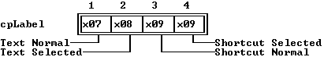

---

<a id="11BTX8C"></a>

### TLabel::TLabel

*Keywords: TLabel::TLabel*

[See Also](#IKRR5E)	 [TLabel class](#TLabel)

 Form 1

 
```c
TLabel(const TRect& bounds, const char *aText, TView *aLink);
```
 Form 2

 
```c
TLabel( StreamableInit streamableInit);   //protected
```
#### Description
 Form 1:Creates a  TLabelobject of the given size and text by calling  TStaticText(* bounds, * aText), then setting the * linkdata member to * aLinkfor the associated control (make * aLink0 if no control is needed). The * optionsdata member is set to * ofPreProcessand * ofPostProcess. The * eventMaskis set to * evBroadcast. * aTextcan designate a hot key letter for the label by surrounding the letter with tildes ().

  Form 2:Each streamable class needs a "builder" to allocate the correct memory for its objects together with the initialized vtable pointers. This is achieved by calling this constructor with an argument of type  StreamableInit.

---

<a id="IKRR5E"></a>

#### See Also
 [TStaticText::TStaticText](#5MT6_PV)

---

<a id="TLabel_light"></a>

### TLabel::light

*Keywords: light*

[TLabel class](#TLabel)
#### Syntax
```c
Boolean light;   //protected
```
#### Description
 If * True, the label and its linked control has been selected and will be highlighted. Otherwise, * lightis set to * False.

---

<a id="TLabel_link"></a>

### TLabel::link

*Keywords: link*

[TLabel class](#TLabel)
#### Syntax
```c
TView *link;   //protected
```
#### Description
 Pointer to the  TViewcontrol associated with this label.

---

<a id="TLabel_build"></a>

### TLabel::build

*Keywords: build*

[See Also](#CH1OYP)	 [TLabel class](#TLabel)
#### Syntax
```c
static TStreamable *build();
```
#### Description
 Called to create an object in certain stream-reading situations.

---

<a id="CH1OYP"></a>

#### See Also
 [TStreamableClass](#TStreamableClass)

 [ipstream::readData](#3MVS.PE)

---

<a id="TLabel_draw"></a>

### TLabel::draw

*Keywords: draw*

[TLabel class](#TLabel)
#### Syntax
```c
virtual void draw();
```
#### Description
 Draws the label with the appropriate colors from the default palette.

---

<a id="9UOQJ2"></a>

### TLabel::getPalette

*Keywords: getpalette*

[TLabel class](#TLabel)
#### Syntax
```c
virtual TPalette& getPalette() const;
```
#### Description
 Returns the default palette string, * cpLabel, "".

---

<a id="8QQ878"></a>

### TLabel::handleEvent

*Keywords: handleEvent*

[See Also](#3BD54JP)	 [TLabel class](#TLabel)
#### Syntax
```c
virtual void handleEvent(TEvent& event);
```
#### Description
 Calls  TStaticText::handleEventfirst. If an * evMouseDownor hot key event is received, the appropriate linked control (if any) is selected by calling  link->select.  handleEventalso handles * cmReceivedFocusand * cmReleasedFocusbroadcast events from the linked control in order to adjust the value of the * lightdata member and redraw the label as necessary.

---

<a id="3BD54JP"></a>

#### See Also
 [TView::handleEvent](#4H2TBJ)

---

<a id="TLabel_read"></a>

### TLabel::read

*Keywords: read*

[See Also](#329V00)	 [TLabel class](#TLabel)
#### Syntax
```c
virtual void *read( ipstream& is);...//protected
```
#### Description
 Reads from the input stream * is.

---

<a id="329V00"></a>

#### See Also
 [TStreamableClass](#TStreamableClass)

 [TStreamable](#TStreamable)

 [ipstream](#ipstream)

---

<a id="1_LKKGB"></a>

### TLabel::shutDown

*Keywords: shutDown*

[TLabel class](#TLabel)
#### Syntax
```c
virtual void shutDown();
```
#### Description
 Used internally by  TObject::destroyto ensure correct destruction of derived and related objects.  shutDownis overridden in many classes to ensure the proper setting of related data members when  destroyis called.

---

<a id="TLabel_write"></a>

### TLabel::write

*Keywords: write*

[See Also](#1XQW204)	 [TLabel class](#TLabel)
#### Syntax
```c
virtual void write( opstream& os);...//protected
```
#### Description
 Writes to the output stream * os.

---

<a id="1XQW204"></a>

#### See Also
 [TStreamableClass](#TStreamableClass)

 [TStreamable](#TStreamable)

 [opstream](#opstream)

---

<a id="TListBox"></a>

### TListBox Class

*Keywords: TListBox*

[Inheritance](#TVFlow_2)
#### Header File
 dialogs.h
#### Description
 TListBoxis derived from  TListViewerto help you set up the most commonly used list boxes, namely those displaying collections of strings, such as file names.  TListBoxobjects represent displayed lists of such items in one or more columns with an optional vertical scroll bar. The horizontal scroll bars of  TListViewerare not supported. The inherited  TListViewermember functions let you select (and highlight) items by mouse and keyboard cursor actions.  TListBoxdoes not override   TListViewer::handleEventor  TListViewer::draw, so you should refer to the sections describing these before using  TListBoxin your applications.

  TListBoxhas an additional (private) data member called * itemsnot found in  TListViewer. * itemspoints to a  TCollectionobject that provides the items to be listed and selected. The public member function  listreturns the * itemspointer. Inserting data into the  TCollectionobject is your responsibility, as are the actions to be performed when an item is selected.

 TListViewerinherits its destructor from  TView, so it is also your responsibility to dispose of the contents of * itemswhen you are finished with it. A call to  newListdisposes of the old list, so calling  newList(0) and then disposing of the list box will free everything.

 Constructors

 
```c
TListBox
```

```c
EHVOQ( const TRect& bounds ushort aNumCols TScrollBar *aScrollBar );

  TListBox
```

```c
EHVOQ(StreamableInit streamableInit);   //protected

  TListBox
```

```c
EHVOQ();
```
#### Data Members
```c
TCollection * items
```

```c
TListBox_items;   //protected
```
#### Member Functions
```c
static TStreamable * build
```

```c
TListBox_build();

 virtual ushort  dataSize
```

```c
A5D6.9();

 virtual void  getData
```

```c
9OW__Q(void *rec);

 virtual void  getText
```

```c
9P.AB9(char *dest, short item, short maxLen);

 TCollection * list
```

```c
TListBox_List();

 virtual void  newList
```

```c
BL_IUE(TCollection *aList);

 virtual void * read
```

```c
TListBox_read( ipstream& is);   //protected

 virtual void  setData
```

```c
M37E3C(void *rec);

 virtual void  write
```

```c
TListBox_write( opstream& os);   //protected
```
 Palette

 List boxes use the default palette, * cpListViewer, to map onto the twenty-sixth through twenty-ninth entries in the standard application palette.

 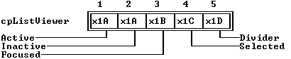

---

<a id="EHVOQ"></a>

### TListBox::TListBox

*Keywords: TListBox::TListBox*

[See Also](#57I5_0A)	 [TListBox class](#TListBox)

 Form 1

 
```c
TListBox( const TRect& bounds ushort aNumCols TScrollBar *aScrollBar );
```
 Form 2

 
```c
TListBox(StreamableInit streamableInit);   //protected
```
#### Description
 Form 1: Creates a list box control with the given size, number of columns, a vertical scroll bar referenced by the * aScrollBarpointer. This constructor calls  TListViewer(* bounds, aNumCols, 0, aScrollBar), thereby suppressing the horizontal scroll bar.

 The * listdata member is initially empty collection, the inherited * rangedata member is set to zero. Your application must provide a suitable  TCollectionholding the strings (or other objects) to be listed. The * listdata member must be set to point to this collection using  newList.

 Form 2: Each streamable class needs a "builder" to allocate the correct memory for its objects, together with the initialized vtable pointers. This is achieved by calling this constructor with an argument of type  StreamableInit.

 Destructor

 
```c
~TListBox();
```

---

<a id="57I5_0A"></a>

#### See Also
 [TListViewer constructor](#R7.FAU)

 [TListBox::newList](#BL_IUE)

---

<a id="TListBox_items"></a>

### TListBox::items

*Keywords: items*

[See Also](#_U9VSK)	 [TListBox class](#TListBox)
#### Syntax
```c
TCollection *items;   //protected
```
#### Description
 *itemspoints at the collection of items to scroll through. Typically, this might be a collection of strings representing the item texts. User can access this protected member only by calling the function  list.

---

<a id="_U9VSK"></a>

#### See Also
 [TListBox::list](#TListBox_List)

---

<a id="TListBox_build"></a>

### TListBox::build

*Keywords: build*

[See Also](#4N25_KJ)	 [TListBox class](#TListBox)
#### Syntax
```c
static TStreamable *build();
```
#### Description
 Called to create an object in certain stream-reading situations.

---

<a id="4N25_KJ"></a>

#### See Also
 [TStreamableClass](#TStreamableClass)

 [ipstream::readData](#3MVS.PE)

---

<a id="A5D6.9"></a>

### TListBox::dataSize

*Keywords: dataSize*

[See Also](#Z6GNNK)	 [TListBox class](#TListBox)
#### Syntax
```c
virtual ushort dataSize();
```
#### Description
 Returns the size of the data read and written to the records passed to  getDataand  setData. These three member functions are useful for initializing groups. By default,  TListBox::dataSizereturns the size of * &TCollectionplus the size of  ushort(for * itemsand the selected item). You may need to override this member function for your own applications.

---

<a id="Z6GNNK"></a>

#### See Also
 [TListBox::getData](#9OW__Q)

 [TListBox::setData](#M37E3C)

---

<a id="9OW__Q"></a>

### TListBox::getData

*Keywords: getData*

[See Also](#5NQL_0Z)	 [TListBox class](#TListBox)
#### Syntax
```c
virtual void getData(void *rec);
```
#### Description
 Writes  TListBoxobject data to the target record. By default,  getDatawrites the current * itemsand * focuseddata members to * rec. You may need to override this member function for your own applications.

---

<a id="5NQL_0Z"></a>

#### See Also
 [TListBox::dataSize](#A5D6.9)

 [TListBox::setData](#M37E3C)

---

<a id="9P.AB9"></a>

### TListBox::getText

*Keywords: getText*

[See Also](#EBCYX1)	 [TListBox class](#TListBox)
#### Syntax
```c
virtual void getText(char *dest, short item, short maxLen);
```
#### Description
 Sets a string in * destfrom the calling  TListBoxobject. By default, the returned string is obtained from the * item'th item in the  TCollectionusing * (char *)((list())->at(item)). If  listreturns a collection containing non-string objects, you will need to override this member function. If  listreturns 0,  getTextsets * destto " ".

---

<a id="EBCYX1"></a>

#### See Also
 [TNSCollection::at](#TNSCollection_at)

---

<a id="TListBox_List"></a>

### TListBox::list

*Keywords: list*

[See Also](#DA71JN)	 [TListBox class](#TListBox)
#### Syntax
```c
TCollection *list();
```
#### Description
 listreturns the private * itemspointer.

---

<a id="DA71JN"></a>

#### See Also
 [TListBox::items](#TListBox_items)

---

<a id="BL_IUE"></a>

### TListBox::newList

*Keywords: newList*

[TListBox class](#TListBox)
#### Syntax
```c
virtual void newList(TCollection *aList);
```
#### Description
 Creates a new list by deleting the current one and replacing it with the given * aList.

---

<a id="TListBox_read"></a>

### TListBox::read

*Keywords: read*

[See Also](#3VKHU8)	 [TListBox class](#TListBox)
#### Syntax
```c
virtual void *read( ipstream& is);   //protected
```
#### Description
 Reads from the input stream * is.

---

<a id="3VKHU8"></a>

#### See Also
 [TStreamableClass](#TStreamableClass)

 [TStreamable](#TStreamable)

 [ipstream](#ipstream)

---

<a id="M37E3C"></a>

### TListBox::setData

*Keywords: setData*

[See Also](#13A_X1P)	 [TListBox class](#TListBox)
#### Syntax
```c
virtual void setData(void *rec);
```
#### Description
 Replaces the current list with * itemsand * focusedvalues read from the given * recarray.  setDatacalls  newListso that the new list is displayed with the correct focused item. As with  getDataand  dataSize, you may need to override this member function for your own applications.

---

<a id="13A_X1P"></a>

#### See Also
 [TListBox::dataSize](#A5D6.9)

 [TListBox::getData](#9OW__Q)

 [TListBox::newList](#BL_IUE)

---

<a id="TListBox_write"></a>

### TListBox::write

*Keywords: write*

[See Also](#PGPNGZ)	 [TListBox class](#TListBox)
#### Syntax
```c
virtual void write( opstream& os);   //protected
```
#### Description
 Writes to the output stream * os.

---

<a id="PGPNGZ"></a>

#### See Also
 [TStreamableClass](#TStreamableClass)

 [TStreamable](#TStreamable)

 [opstream](#opstream)

---

<a id="TListViewer"></a>

### TListViewer Class

*Keywords: TListViewer*

[Inheritance](#TVFlow_2)
#### Header File
 views.h
#### Description
 TListVieweris an abstract class from which you can derive list viewers of various kinds, such as  TListBox.  TListViewer's members offer the following functionality:

|  | A view for displaying linked lists of items (but no list) |
| --- | --- |
|  | Control over one or two scroll bars |
|  | Basic scrolling of lists in two dimensions |
|  | Reading and writing the view and its scroll bars from and to a stream |
|  | Ability to use a mouse or the keyboard to select (highlight) items on list |
|  | drawmember function that copes with resizing and scrolling |

 TListViewerhas a pure virtual  getTextmember function, so you need to supply the mechanism for creating and manipulating the text of the items to be displayed.  TListViewerhas no list storage mechanism of its own. Use it to display scrollable lists of arrays, linked lists, or similar data structures. You can also use classes derived from  TListViewer, such as  TListBox, which associates a collection with a list viewer.

 Constructor

 
```c
TListViewer
```

```c
R7.FAU(const TRect& bounds, ushort aNumCols, TScrollBar *aHScrollBar, TScrollBar *aVScrollBar);

  TListViewer
```

```c
R7.FAU( StreamableInit streamableInit);   //protected
```
#### Data Members
```c
short  focused
```

```c
1V4WG5P;

 TScrollBar * hScrollBar
```

```c
7VZJAI;

 short  numCols
```

```c
F_IIMV;

 short  range
```

```c
TListViewer_range;

 short  topItem
```

```c
XLER7Q;

 TScrollBar * vScrollBar
```

```c
E_8DMJ;
```
#### Member Functions
```c
static TStreamable * build
```

```c
TListViewer_build();

 virtual void  changeBounds
```

```c
H3OV4P(TRect& bounds);

 virtual void  draw
```

```c
TListViewer_draw();

 virtual void  focusItem
```

```c
125_J34(short item);

 virtual void  focusItemNum
```

```c
26H200F(short item);

 virtual TPalette&  getPalette
```

```c
137LQ44() const;

 virtual void  getText
```

```c
1Z.J01P(char *dest, short item, short maxLen)=0;

 virtual void  handleEvent
```

```c
1TNG9E9(TEvent& event);

 virtual Boolean  isSelected
```

```c
13GJQ68(short item);

 virtual void * read
```

```c
TListViewer_read( ipstream& is);   //protected

 virtual void  selectItem
```

```c
16LLM3C(short item);

 void  setRange
```

```c
LRL7YH(short aRange);

 virtual void  setState
```

```c
2NDWTVM(ushort aState, Boolean enable);

 virtual void  shutDown
```

```c
1L8V0NL();

 virtual void  write
```

```c
TListViewer_write( opstream& os);   //protected
```
 Palette

 List viewers use the default palette, * cpListViewer, to map onto the twenty-sixth through twenty-ninth entries in the standard application palette.

 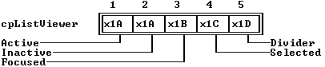

---

<a id="R7.FAU"></a>

### TListViewer::TListViewer

*Keywords: TListViewer::TListViewer*

[See Also](#X2NZJ8)	 [TListViewer class](#TListViewer)

 Form 1

 
```c
TListViewer(const TRect& bounds, ushort aNumCols, TScrollBar *aHScrollBar, TScrollBar *aVScrollBar);
```
 Form 2

 
```c
TListViewer( StreamableInit streamableInit);   //protected
```
#### Description
 Form 1: Creates and initializes a  TListViewerobject with the given size by first calling  TView(* bounds). The * numColsdata member is set to * aNumCols. * optionsis set to (* ofFirstClick| * ofSelectable) so that mouse clicks that select this view will be passed first to  TListViewer::handleEvent. The * eventMas is set to * evBroadcast.The initial values of * range and * focused are zero. You can supply pointers to vertical and/or horizontal scrollbars by way of the * aVScrollBarand * aHScrollBararguments. Setting either or both to 0 suppresses one or both scroll bars. These two pointer arguments are assigned to the * vScrollBarand * hScrollBardata members.

 If you provide valid scroll bars, their * pgStepand * arStepdata members will be adjusted according to the  TListViewersize and number of columns. For a single-column  TListViewer, for example, the default vertical * pgStepis * size.y- 1, and the default vertical * arStepis 1.

 Form 2: Each streamable class needs a "builder" to allocate the correct memory for its objects together with the initialized vtable pointers. This is achieved by calling this constructor with an argument of type  StreamableInit.

---

<a id="X2NZJ8"></a>

#### See Also
 [TView::TView](#TView_TView)

 [TScrollBar::setStep](#.PA32W)

---

<a id="1V4WG5P"></a>

### TListViewer::focused

*Keywords: focused*

[See Also](#18R29X5)	 [TListViewer class](#TListViewer)
#### Syntax
```c
short focused;
```
#### Description
 The item number of the focused item. Items are numbered from 0 to * range- 1. Initially set to 0, the first item, * focused, can be changed by mouse click or Spacebar selection.

---

<a id="18R29X5"></a>

#### See Also
 [TListViewer::range](#TListViewer_range)

---

<a id="7VZJAI"></a>

### TListViewer::hScrollBar

*Keywords: hScrollBar*

[TListViewer class](#TListViewer)
#### Syntax
```c
TScrollBar *hScrollBar;
```
#### Description
 Pointer to the horizontal scroll bar associated with this view. If 0, the view does not have such a scroll bar.

---

<a id="F_IIMV"></a>

### TListViewer::numCols

*Keywords: numCols*

[TListViewer class](#TListViewer)
#### Syntax
```c
short numCols;
```
#### Description
 The number of columns in the list control.

---

<a id="TListViewer_range"></a>

### TListViewer::range

*Keywords: range*

[See Also](#C_DD0E)	 [TListViewer class](#TListViewer)
#### Syntax
```c
short range;
```
#### Description
 The current total number of items in the list. Items are numbered from 0 to * range- 1.

---

<a id="C_DD0E"></a>

#### See Also
 [TListViewer::setRange](#LRL7YH)

---

<a id="XLER7Q"></a>

### TListViewer::topItem

*Keywords: topItem*

[See Also](#1N5KKLP)	 [TListViewer class](#TListViewer)
#### Syntax
```c
short topItem;
```
#### Description
 The item number of the top item to be displayed. This value changes during scrolling. Items are numbered from 0 to * range- 1. This number depends on the number of columns, the size of the view, and the value of * range.

---

<a id="1N5KKLP"></a>

#### See Also
 [TListViewer::range](#TListViewer_range)

---

<a id="E_8DMJ"></a>

### TListViewer::vScrollBar

*Keywords: vScrollBar*

[TListViewer class](#TListViewer)
#### Syntax
```c
TScrollBar *vScrollBar;
```
#### Description
 Pointer to the vertical scroll bar associated with this view. If 0, the view does not have such a scroll bar.

---

<a id="TListViewer_build"></a>

### TListViewer::build

*Keywords: build*

[See Also](#9WOB1B)	 [TListViewer class](#TListViewer)
#### Syntax
```c
static TStreamable *build();
```
#### Description
 Called to create an object in certain stream-reading situations.

---

<a id="9WOB1B"></a>

#### See Also
 [TStreamableClass](#TStreamableClass)

 [ipstream::readData](#3MVS.PE)

---

<a id="H3OV4P"></a>

### TListViewer::changeBounds

*Keywords: changeBounds*

[See Also](#SUD2XK)	 [TListViewer class](#TListViewer)
#### Syntax
```c
virtual void changeBounds(TRect& bounds);
```
#### Description
 Changes the size of the  TListViewerobject by calling  TView::changeBounds(* bounds). If a horizontal scroll bar has been assigned, * pgStepis updated by way of * setStep.

---

<a id="SUD2XK"></a>

#### See Also
 [TView::changeBounds](#SH_KT2)

 [TScrollBar::setStep](#.PA32W)

---

<a id="TListViewer_draw"></a>

### TListViewer::draw

*Keywords: draw*

[See Also](#I.AT3S)	 [TListViewer class](#TListViewer)
#### Syntax
```c
virtual void draw();
```
#### Description
 Draws the  TListViewerobject with the default palette by repeatedly calling  getTextfor each visible item. Takes into account the focused and selected items and whether the view is * sfActive.

---

<a id="I.AT3S"></a>

#### See Also
 [TListViewer::getText](#1Z.J01P)

---

<a id="125_J34"></a>

### TListViewer::focusItem

*Keywords: focusItem*

[See Also](#31Y.O9)	 [TListViewer class](#TListViewer)
#### Syntax
```c
virtual void focusItem(short item);
```
#### Description
 Makes the given item focused by setting the * focuseddata member to * item. Also sets the * valuedata member of the vertical scroll bar (if any) to * itemand adjusts * topItem.

---

<a id="31Y.O9"></a>

#### See Also
 [TListViewer::isSelected](#13GJQ68)

 [TScrollBar::setValue](#FHJB0R)

---

<a id="26H200F"></a>

### TListViewer::focusItemNum

*Keywords: focusItemNum*

[See Also](#2GDTZAI)	 [TListViewer class](#TListViewer)
#### Syntax
```c
virtual void focusItemNum(short item);
```
#### Description
 Used internally by  focusItem. Makes the given item focused by setting the * focuseddata member to * item.

---

<a id="2GDTZAI"></a>

#### See Also
 [TListViewer::focusItemNum](#26H200F)

---

<a id="137LQ44"></a>

### TListViewer::getPalette

*Keywords: getpalette*

[TListViewer class](#TListViewer)
#### Syntax
```c
virtual TPalette& getPalette() const;
```
#### Description
 Returns * cpListViewer, the default  TListViewerpalette string,

 "AABCD\".

---

<a id="1Z.J01P"></a>

### TListViewer::getText

*Keywords: getText*

[See Also](#1ONJMV2)	 [TListViewer class](#TListViewer)
#### Syntax
```c
virtual void getText(char *dest, short item, short maxLen)=0;
```
#### Description
 This is a pure virtual function. Derived classes must either redeclare this member as a pure virtual function or override it with a function that returns a string not exceeding * maxLen, given an item index referenced by * item. Note that  TListViewer::drawneeds to call  getText.

---

<a id="1ONJMV2"></a>

#### See Also
 [TListViewer::draw](#TListViewer_draw)

---

<a id="1TNG9E9"></a>

### TListViewer::handleEvent

*Keywords: handleEvent*

[See Also](#L5246Q)	 [TListViewer class](#TListViewer)
#### Syntax
```c
virtual void handleEvent(TEvent& event);
```
#### Description
 First calls  TView::handleEvent(* event). Then, mouse clicks and "auto" movements over the list will change the focused item. Items can be selected with double mouse clicks. Keyboard events are handled as follows: Spacebar selects the currently focused item; the arrow keys, PgUp, PgDn, Ctrl-PgDn, Ctrl-PgUp, Home, and End keys are tracked to set the focused item. Broadcast events from the scroll bars are handled by changing the focused item and redrawing the view as required.

---

<a id="L5246Q"></a>

#### See Also
 [TView::handleEvent](#4H2TBJ)

 [TListViewer::focusItem](#125_J34)

---

<a id="13GJQ68"></a>

### TListViewer::isSelected

*Keywords: isSelected*

[See Also](#KP.8PZ)	 [TListViewer class](#TListViewer)
#### Syntax
```c
virtual Boolean isSelected(short item);
```
#### Description
 Returns * Trueif the given * itemis selected (focused), that is, if * item== * focused.

---

<a id="KP.8PZ"></a>

#### See Also
 [TListViewer::focusItem](#125_J34)

---

<a id="TListViewer_read"></a>

### TListViewer::read

*Keywords: read*

[See Also](#1MRS.S.)	 [TListViewer class](#TListViewer)
#### Syntax
```c
virtual void *read( ipstream& is);   //protected
```
#### Description
 Reads from the input stream * is.

---

<a id="1MRS.S."></a>

#### See Also
 [TStreamableClass](#TStreamableClass)

 [TStreamable](#TStreamable)

 [ipstream](#ipstream)

---

<a id="16LLM3C"></a>

### TListViewer::selectItem

*Keywords: selectItem*

[See Also](#8G9HGR)	 [TListViewer class](#TListViewer)
#### Syntax
```c
virtual void selectItem(short item);
```
#### Description
 Selects the * item'th element of the list, then broadcasts this fact to the owning group by calling:

 
```c
 message(owner, evBroadcast, cmListItemSelected, this);
```

---

<a id="8G9HGR"></a>

#### See Also
 [TListViewer::focusItem](#125_J34)

---

<a id="LRL7YH"></a>

### TListViewer::setRange

*Keywords: setRange*

[See Also](#6BV80XU)	 [TListViewer class](#TListViewer)
#### Syntax
```c
void setRange(short aRange);
```
#### Description
 Sets the * rangedata member to * aRange. If a vertical scroll bar has been assigned, its parameters are adjusted as necessary (and  TScrollBar::drawViewis invoked if redrawing is needed). If the currently focused item falls outside the new * range, the * focuseddata member is set to zero.

---

<a id="6BV80XU"></a>

#### See Also
 [TListViewer::range](#TListViewer_range)

 [TScrollBar::setParams](#MNK5IW)

---

<a id="2NDWTVM"></a>

### TListViewer::setState

*Keywords: setstate*

[See Also](#IGL7BR)	 [TListViewer class](#TListViewer)
#### Syntax
```c
virtual void setState(ushort aState, Boolean enable);
```
#### Description
 Calls  TView::setState(* aState, enable) to change the  TListViewerobject's state if * enableis * True. Depending on the * aStateargument, this can result in displaying or hiding the view. Additionally, if * aStateis * sfSelectedand * sfActive, the scroll bars are redrawn; if * aStateis * sfSelectedbut not * sfActive, the scroll bars are hidden.

---

<a id="IGL7BR"></a>

#### See Also
 [TView::setState](#DL958G)

---

<a id="1L8V0NL"></a>

### TListViewer::shutDown

*Keywords: shutDown*

[TListViewer class](#TListViewer)
#### Syntax
```c
virtual void shutDown();
```
#### Description
 Used internally by  TObject::destroyto ensure correct destruction of derived and related objects.  shutDownis overridden in many classes to ensure the proper setting of related data members when  destroyis called.

---

<a id="TListViewer_write"></a>

### TListViewer::write

*Keywords: write*

[See Also](#11X_OPA)	 [TListViewer class](#TListViewer)
#### Syntax
```c
virtual void write( opstream& os);   //protected
```
#### Description
 Writes to the output stream * os.

---

<a id="11X_OPA"></a>

#### See Also
 [TStreamableClass](#TStreamableClass)

 [TStreamable](#TStreamable)

 [opstream](#opstream)

---

<a id="TLookupValidator"></a>

### TLookupValidator Class

*Keywords: TLookupValidator*

[Inheritance](#TVFlow_1)
#### Header File
 validate.h
#### Description
 A lookup validator compares the string typed by a user with a list of acceptable values.  TLookupValidatoris an abstract validator type from which you can derive usefull lookup validators. You will never create an instance of  TLookupValidator. When you create a lookup validator type, you need to specify a list of valid items and override the lookup method to return  Trueonly if the user input matches an item in that list. One example of a working descendant of  TLookupValidaoris [TStringLookupValidator](#TStringLookupValidator).
#### Member Functions
```c
virtual Boolean  isValid
```

```c
3.PJK81 ( const char *s );

 virtual Boolean  lookup
```

```c
CQWBK9 ( const char *s );
```

---

<a id="3.PJK81"></a>

### TLookupValidator::isValid

*Keywords: TLookupValidator::isValid*

[See Also](#X07PSN)	 [TLookupValidator class](#TLookupValidator)
#### Syntax
```c
virtual Boolean isValid( const char *s );
```
#### Description
 Calls  lookupto find the string * sin the list of valid input items. Returns  Trueif  lookupreturns  True, meaning  lookupfound * sin the list; otherwise, return  False.

---

<a id="X07PSN"></a>

#### See Also
 [TLookupValidator::lookup](#CQWBK9)

---

<a id="CQWBK9"></a>

### TLookupValidator::lookup

*Keywords: TLookupValidator::lookup*

[TLookupValidator class](#TLookupValidator)
#### Syntax
```c
virtual Boolean lookup( const char *s );
```
#### Description
 Searches for the string * sin the list of valid entries and returns  Trueif it finds * s; otherwise, returns  False.  TLookupValidator's  lookupis a pure virtual function that always returns  False. Descendant lookup validator classes must override  lookupto perform a search based on the actual list of acceptable items.

---

<a id="TMemo"></a>

### TMemo Class

*Keywords: TMemo*

[Inheritance](#TVFlow_1)
#### Header File
 editors.h
#### Description
 TMemo, which is derived from  TEditor, is designed for insertion into a dialog box or form. It supports  dataSizeand allows the Tab key to be processed by  TDialog. It also has a different palette from that of  TEditor.  dataSizeuses the following structure:

 
```c
 struct TMemoRec

 \-

    ushort length;

    char *buffer;
```
 giving a size of (bufSize + sizeof( ushort )).

 Constructors

 
```c
TMemo
```

```c
TMemo_TMemo( const TRect& bounds, TScrollBar *HScrollBar, TScollBar *aVScrollBar, TIndicator *Indicator, ushort aBufSize );
```
#### Member Functions
```c
static TStreamable * build
```

```c
TMemo_build();

 virtual ushort  dataSize
```

```c
5U3LHE();

 virtual void  getData
```

```c
345WLVZ( void *rec );

 virtual TPalette&  getPalette
```

```c
HW37VG() const;

 virtual void  handleEvent
```

```c
1KRIMQP( TEvent& event);

 virtual void * read
```

```c
TMemo_read( ipstream& is );   //protected

 virtual void  setData
```

```c
SJ2VE7( void *rec );

 virtual void  write
```

```c
TMemo_write( opstream& os );   //protected
```

---

<a id="TMemo_TMemo"></a>

### TMemo::TMemo

*Keywords: TMemo::TMemo*

[TMemo class](#TMemo)
#### Syntax
```c
TMemo( const TRect& bounds, TScrollBar *HScrollBar, TScollBar *aVScrollBar, TIndicator *Indicator, ushort aBufSize );
```
#### Description
 Creates a  TMemoobject via the  TEditorbase constructor.

---

<a id="TMemo_build"></a>

### TMemo::build

*Keywords: build*

[See Also](#17_GY5L)	 [TMemo class](#TMemo)
#### Syntax
```c
static TStreamable *build();
```
#### Description
 Called to create an object in certain stream-reading situations.

---

<a id="17_GY5L"></a>

#### See Also
 [TStreamableClass](#TStreamableClass)

 [ipstream::readData](#3MVS.PE)

---

<a id="5U3LHE"></a>

### TMemo::dataSize

*Keywords: dataSize*

[See Also](#2CP4_SV)	 [TMemo class](#TMemo)
#### Syntax
```c
virtual ushort dataSize();
```
#### Description
 Used with  setDataand  getDatawhen saving and restoring  TMemoobjects. Used with  getDataand  setData, which are inherited from  TView. By default it returns (sizeOf( ushort ) + bufSize).

---

<a id="2CP4_SV"></a>

#### See Also
 [TView::getData](#E9Q276)

 [TView::setData](#XH19WS)

---

<a id="345WLVZ"></a>

### TMemo::getData

*Keywords: getData*

[TMemo class](#TMemo)
#### Syntax
```c
virtual void getData( void *rec );
```
#### Description
 Copies the memo's buffer into the buffer * rec.

---

<a id="HW37VG"></a>

### TMemo::getPalette

*Keywords: getpalette*

[TMemo class](#TMemo)
#### Syntax
```c
virtual TPalette& getPalette() const;
```
#### Description
 Returns * cpMemo= "AB", the default memo palette.

---

<a id="1KRIMQP"></a>

### TMemo::handleEvent

*Keywords: handleEvent*

[See Also](#AB5800)	 [TMemo class](#TMemo)
#### Syntax
```c
virtual void handleEvent( TEvent& event);
```
#### Description
 Prevents  TMemofrom handling * kbTabkey events; otherwise handles events the same as  TEditor.

---

<a id="AB5800"></a>

#### See Also
 [TEditor::handleEvent](#26PFZZP)

---

<a id="TMemo_read"></a>

### TMemo::read

*Keywords: read*

[See Also](#XCKCUP)	 [TMemo class](#TMemo)
#### Syntax
```c
virtual void *read( ipstream& is );   //protected
```
#### Description
 Reads from the input stream * is.

---

<a id="XCKCUP"></a>

#### See Also
 [TStreamableClass](#TStreamableClass)

 [ipstream](#ipstream)

---

<a id="SJ2VE7"></a>

### TMemo::setData

*Keywords: setData*

[TMemo class](#TMemo)
#### Syntax
```c
virtual void setData( void *rec );
```
#### Description
 Copies the data pointed to by * recinto thememo's buffer.

---

<a id="TMemo_write"></a>

### TMemo::write

*Keywords: write*

[See Also](#JVI.PV)	 [TMemo class](#TMemo)
#### Syntax
```c
virtual void write( opstream& os );   //protected
```
#### Description
 Writes to the output stream * os.

---

<a id="JVI.PV"></a>

#### See Also
 [TStreamableClass](#TStreamableClass)

 [opstream](#opstream)

---

<a id="TMenu"></a>

### TMenu Class

*Keywords: TMenu*

[Inheritance](#TVFlow_1)
#### Header File
 menus.h
#### Description
 TMenuserves as a "wrapper" for the various other menu classes, such as  TMenuItem,  TSubMenuand  TMenuView.

 Constructor

 
```c
TMenu
```

```c
TMenu_TMenu();

  TMenu
```

```c
TMenu_TMenu( TMenuItem& itemList );

  TMenu
```

```c
TMenu_TMenu( TMenuItem& itemList, TMenuItem& TheDefault );

  TMenu
```

```c
TMenu_TMenu();
```
#### Data Members
```c
TMenuItem * deflt
```

```c
TMenu_deflt;

 TMenuItem * items
```

```c
TMenu_items;
```

---

<a id="TMenu_TMenu"></a>

### TMenu::TMenu

*Keywords: TMenu::TMenu*

[TMenu class](#TMenu)

 Form 1

 
```c
TMenu();
```
 Form 2

 
```c
TMenu( TMenuItem& itemList );
```
 Form 3

 
```c
TMenu( TMenuItem& itemList, TMenuItem& TheDefault );
```
#### Description
 Form 1: Creates a  TMenuobject without setting * defltor * items.

 Form 2: Creates a  TMenuobject consisting only of * itemList; sets * itemsand * defltto that item.

 Form 3: Creates a  TMenuobject; sets * itemsto * itemListand * defltto * TheDefault.

 Destructor

 
```c
~TMenu();
```
#### Description
 Deletes the menu item list in * items.

---

<a id="TMenu_deflt"></a>

### TMenu::deflt

*Keywords: deflt*

[TMenu class](#TMenu)
#### Syntax
```c
TMenuItem *deflt;
```
#### Description
 Points to the default (highlighted) menu item. Determine how to react when the user presses Enter.

---

<a id="TMenu_items"></a>

### TMenu::items

*Keywords: items*

[TMenu class](#TMenu)
#### Syntax
```c
TMenuItem *items;
```
#### Description
 Points to the list of menu items. Used by various  drawmember functions when parts of the menu structure need to be redrawn.

---

<a id="TMenuBar"></a>

### TMenuBar Class

*Keywords: TMenuBar*

[Inheritance](#TVFlow_2)
#### Header File
 menus.h
#### Description
 TMenuBarobjects represent the horizontal menu bars from which menu selections can be made by:

|  | direct clicking |
| --- | --- |
|  | F10 selection and hot keys |
|  | selection (highlighting) and pressing Enter |
|  | hot keys |

 The main menu selections are displayed in the top menu bar. This is represented by an object of type  TMenuBar, usually owned by your  TApplicationobject. Submenus are displayed in objects of type  TMenuBox. Both  TMenuBarand  TMenuBoxare derived from  TMenuView(which is in turn derived from  TView).

 For most Turbo Vision applications, you will not be involved directly with menu objects. By overriding  TApplication::initMenuBarwith a suitable set of nested new TMenuItem and new TMenu calls, Turbo Vision takes care of all the standard menu mechanisms.

 Constructor

 
```c
TMenuBar
```

```c
3_MO_HL(const TRect& bounds, TSubMenu *aMenu);

  TMenuBar
```

```c
3_MO_HL(const TRect& bounds, TMenu *aMenu);

  TMenuBar
```

```c
3_MO_HL( StreamableInit streamableInit);   //protected

  TMenuBar
```

```c
3_MO_HL();
```
#### Member Functions
```c
static TStreamable * build
```

```c
TMenuBar_build();

 virtual void  draw
```

```c
TMenuBar_draw();

 virtual TRect  getItemRect
```

```c
1WVP0RT(TMenuItem *item);
```
 Palette

 Menu bars, like all menu views, use the default palette * cpMenuViewto map onto the second through seventh entries in the standard application palette.

 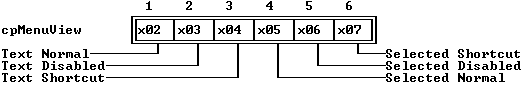

---

<a id="3_MO_HL"></a>

### TMenuBar::TMenuBar

*Keywords: TMenuBar::TMenuBar*

[See Also](#1ML6HI9)	 [TMenuBar class](#TMenuBar)

 Form 1

 
```c
TMenuBar(const TRect& bounds, TSubMenu *aMenu);

 TMenuBar(const TRect& bounds, TMenu *aMenu);
```
 Form 2

 
```c
TMenuBar( StreamableInit streamableInit);   //protected
```
#### Description
 Form 1:Creates a menu bar by calling  TMenuView(* bounds). The grow mode is set to * gfGrowHiX. The * optionsdata member is set to * ofPreProcessto allow hot keys to operate. The * menudata member is set to * aMenu, providing the menu selections.

  Form 2:Each streamable class needs a "builder" to allocate the correct memory for its objects together with the initialized vtable pointers. This is achieved by calling this constructor with an argument of type  StreamableInit. 

 Destructor

 
```c
~TMenuBar();
```

---

<a id="1ML6HI9"></a>

#### See Also
 [TMenuView::TMenuView](#1SE3BS4)

 [TMenuView::menu](#TMenuView_Menu)

 [TMenu](#TMenu)

---

<a id="TMenuBar_build"></a>

### TMenuBar::build

*Keywords: build*

[See Also](#1NU28LP)	 [TMenuBar class](#TMenuBar)
#### Syntax
```c
static TStreamable *build();
```
#### Description
 Called to create an object in certain stream-reading situations.

---

<a id="1NU28LP"></a>

#### See Also
 [TStreamableClass](#TStreamableClass)

 [ipstream::readData](#3MVS.PE)

 [TStreamable](#TStreamable)

---

<a id="TMenuBar_draw"></a>

### TMenuBar::draw

*Keywords: draw*

[TMenuBar class](#TMenuBar)
#### Syntax
```c
virtual void draw();
```
#### Description
 Draws the menu bar with the default palette. The * nameand * disableddata members of each  TMenuItemobject in the * menulinked list are read to give the menu legends in the correct colors. The * current(selected) item is highlighted.

---

<a id="1WVP0RT"></a>

### TMenuBar::getItemRect

*Keywords: getItemRect*

[See Also](#1ZRK69Z)	 [TMenuBar class](#TMenuBar)
#### Syntax
```c
virtual TRect getItemRect(TMenuItem *item);
```
#### Description
 Overrides  TMenuView::getItemRect. Returns the rectangle occupied by the given menu item. It can be used with  mouseInViewto determine if a mouse click has occurred on a given menu selection.

---

<a id="1ZRK69Z"></a>

#### See Also
 [TMenuView::getItemRect](#_O524I)

 [TView::mouseInView](#1L64_W)

---

<a id="TMenuBox"></a>

### TMenuBox Class

*Keywords: TMenuBox*

[Inheritance](#TVFlow_2)
#### Header File
 menus.h
#### Description
 TMenuBoxobjects represent vertical menu boxes. These can contain arbitrary lists of selectable actions, including submenu items. As with menu bars, color coding is used to indicate disabled items. Menu boxes can be instantiated as submenus of the menu bar or other menu boxes, or can be used alone as pop-up menus.

 Constructor

 
```c
TMenuBox
```

```c
0XC3W6(const TRect& bounds, TMenu *aMenu);

  TMenuBox
```

```c
0XC3W6(const TRect& bounds, TMenu *aMenu, TMenuView *aParentMenu=0);

  TMenuBox
```

```c
0XC3W6( StreamableInit streamableInit);   //protected
```
#### Member Functions
```c
static TStreamable * build
```

```c
TMenuBox_build();

 virtual void  draw
```

```c
TMenuBox_draw();

 virtual TRect  getItemRect
```

```c
M0G85C(TMenuItem *item);

 virtual void * read
```

```c
TMenuBox_read( ipstream& is);   //protected

 virtual void  write
```

```c
TMenuBox_write( opstream& os);   //protected
```
 Palette

 Menu boxes, like all menu views, use the default palette * cpMenuViewto map onto the second through seventh entries in the standard application palette.

 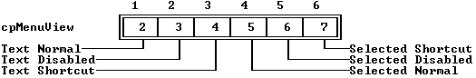

---

<a id="0XC3W6"></a>

### TMenuBox::TMenuBox

*Keywords: TMenuBox::TMenuBox*

[See Also](#5PLPPO)	 [TMenuBox class](#TMenuBox)

 Form 1

 
```c
TMenuBox(const TRect& bounds, TMenu *aMenu);

 TMenuBox(const TRect& bounds, TMenu *aMenu, TMenuView *aParentMenu=0);
```
 Form 2

 
```c
TMenuBox( StreamableInit streamableInit);   //protected
```
#### Description
 Form 1:Creates a  TMenuBoxobject by calling  TMenuView(* bounds). The * boundsparameter is then adjusted to accommodate the width and length of the items in * aMenu.

 The * ofPreProcessbit in the * optionsdata member is set so that hot keys will operate. * stateis set to include * sfShadow. The * menudata member is set to * aMenu, which provides the menu selections. The second form of the constructor allows an explicit * aParentMenuargument (defaulting to 0) which is set to * parentMenu.

  Form 2:Each streamable class needs a "builder" to allocate the correct memory for its objects together with the initialized vtable pointers. This is achieved by calling this constructor with an argument of type  StreamableInit.

---

<a id="5PLPPO"></a>

#### See Also
 [TMenuView::TMenuView](#1SE3BS4)

 [TMenuView::menu](#TMenuView_Menu)

 [TMenuView::parentMenu](#_VC62X)

---

<a id="TMenuBox_build"></a>

### TMenuBox::build

*Keywords: build*

[See Also](#F7MQBK)	 [TMenuBox class](#TMenuBox)
#### Syntax
```c
static TStreamable *build();
```
#### Description
 Called to create an object in certain stream-reading situations.

---

<a id="F7MQBK"></a>

#### See Also
 [TStreamableClass](#TStreamableClass)

 [ipstream::readData](#3MVS.PE)

---

<a id="TMenuBox_draw"></a>

### TMenuBox::draw

*Keywords: draw*

[TMenuBox class](#TMenuBox)
#### Syntax
```c
virtual void draw();
```
#### Description
 Draws the framed menu box and associated menu items in the default colors.

---

<a id="M0G85C"></a>

### TMenuBox::getItemRect

*Keywords: getItemRect*

[See Also](#1ATJSB6)	 [TMenuBox class](#TMenuBox)
#### Syntax
```c
virtual TRect getItemRect(TMenuItem *item);
```
#### Description
 Overrides  TMenuView::getItemRect. Returns the rectangle occupied by the given menu item. It can be used to determine if a mouse click has occurred on a given menu selection.

---

<a id="1ATJSB6"></a>

#### See Also
 [TMenuView::getItemRect](#_O524I)

 [TView::mouseInView](#1L64_W)

---

<a id="TMenuBox_read"></a>

### TMenuBox::read

*Keywords: read*

[See Also](#3F9V_Y8)	 [TMenuBox class](#TMenuBox)
#### Syntax
```c
virtual void *read( ipstream& is);   //protected
```
#### Description
 Reads from the input stream * is.

---

<a id="3F9V_Y8"></a>

#### See Also
 [TStreamableClass](#TStreamableClass)

 [TStreamable](#TStreamable)

 [ipstream](#ipstream)

---

<a id="TMenuBox_write"></a>

### TMenuBox::write

*Keywords: write*

[See Also](#5ADY1AT)	 [TMenuBox class](#TMenuBox)
#### Syntax
```c
virtual void write( opstream& os);   //protected
```
#### Description
 Writes to the output stream * os.

---

<a id="5ADY1AT"></a>

#### See Also
 [TStreamableClass](#TStreamableClass)

 [TStreamable](#TStreamable)

 [opstream](#opstream)

---

<a id="TMenuItem"></a>

### TMenuItem Class

*Keywords: TMenuItem*

[Inheritance](#TVFlow_2)
#### Header File
 menus.h
#### Description
 Instances of  TMenuItemserve as elements of a menu. They can be individual menu items that cause a command to be generated or a  TSubMenupull-down menu that contains other  TMenuIteminstances.  TMenuItem's different constructors set the data members appropriately.

 individual menu items in a menu box.  TMenuItemalso serves as a base class for  TSubMenu.

 Constructor

 
```c
TMenuItem
```

```c
2O44CGD(const char *aName, ushort aCommand, ushort aKeyCode, ushort aHelpCtx = hcNoContext, char *p = 0, TMenuItem *aNext = 0);

  TMenuItem
```

```c
2O44CGD(const char *aName, ushort aKeyCode, TMenu *aSubMenu,  ushort aHelpCtx = hcNoContext, 

  TMenuItem
```

```c
2O44CGD();TMenuItem *aNext = 0);
```
#### Data Members
```c
ushort  command
```

```c
7Z4VJ5;

 Boolean  disabled
```

```c
XRR0S.;

 ushort  helpCtx
```

```c
2042ZI4;

 ushort  keyCode
```

```c
1744_XB;

 const char * name
```

```c
TMenuItem_name;

 TMenuItem * next
```

```c
TMenuItem_next;

 const char * param
```

```c
TMenuItem_param;

 TMenu * subMenu
```

```c
GB0HI;
```
#### Member Functions
```c
void  append
```

```c
8X5J_74( TMenuItem *aNext );
```

---

<a id="2O44CGD"></a>

### TMenuItem::TMenuItem

*Keywords: TMenuItem::TMenuItem*

[TMenuItem class](#TMenuItem)

 Form 1

 
```c
TMenuItem(const char *aName, ushort aCommand, ushort aKeyCode, ushort aHelpCtx = hcNoContext, char *p = 0, TMenuItem *aNext = 0);
```
 Form 2

 
```c
TMenuItem(const char *aName, ushort aKeyCode, TMenu *aSubMenu,  ushort aHelpCtx = hcNoContext, TMenuItem *aNext = 0);
```
#### Description
 Form 1: Creates an individual menu item. Creates a  TMenuItemobject with the given values. * disabledis set if * aCommandis disbled.

 Form 2: Creates a pull-down submenu. Creates a  TMenuItemobject with the given values. * commandis set to zero.

 Destructor

 
```c
~TMenuItem();
```
 Deallocates the space used to store * nameand * param.

---

<a id="7Z4VJ5"></a>

### TMenuItem::command

*Keywords: command*

[TMenuItem class](#TMenuItem)
#### Syntax
```c
ushort command;
```
#### Description
 The command word of the event generated when this menu item is selected if there isn't a submenu item.

---

<a id="XRR0S."></a>

### TMenuItem::disabled

*Keywords: disabled*

[TMenuItem class](#TMenuItem)
#### Syntax
```c
Boolean disabled;
```
#### Description
 *Trueif the menu item is disabled. Menu item will be drawn using the appropriate palette entry.

---

<a id="2042ZI4"></a>

### TMenuItem::helpCtx

*Keywords: helpCtx*

[TMenuItem class](#TMenuItem)
#### Syntax
```c
ushort helpCtx;
```
#### Description
 The menu item's help context. When the menu item is selected, this data member represents the help context of the application, unless the context number is * hcNoContext, in which case there is no help context.

---

<a id="1744_XB"></a>

### TMenuItem::keyCode

*Keywords: keyCode*

[TMenuItem class](#TMenuItem)
#### Syntax
```c
ushort keyCode;
```
#### Description
 The scan code for the associated hot key.

---

<a id="TMenuItem_name"></a>

### TMenuItem::name

*Keywords: name*

[TMenuItem class](#TMenuItem)
#### Syntax
```c
const char *name;
```
#### Description
 The name of the item that appears in the menu box.

---

<a id="TMenuItem_next"></a>

### TMenuItem::next

*Keywords: next*

[TMenuItem class](#TMenuItem)
#### Syntax
```c
TMenuItem *next;
```
#### Description
 A nonzero * nextpoints to the next  TMenuItemobject in the linked list associated with a menu. A zero value indicated that this is the last item in the list.

---

<a id="TMenuItem_param"></a>

### TMenuItem::param

*Keywords: param*

[TMenuItem class](#TMenuItem)
#### Syntax
```c
const char *param;
```
#### Description
 Used to display the hot key associated with this menu item.

---

<a id="GB0HI"></a>

### TMenuItem::subMenu

*Keywords: subMenu*

[TMenuItem class](#TMenuItem)
#### Syntax
```c
TMenu *subMenu;
```
#### Description
 Points to the submenu to be created when this menu item is selected, if a command isn't generated.

---

<a id="8X5J_74"></a>

### TMenuItem::append

*Keywords: append*

[TMenuItem class](#TMenuItem)
#### Syntax
```c
void append( TMenuItem *aNext );
```
#### Description
 Appends the given  TMenuItemto the list of  TMenuItems by setting * nextto * aNext.

---

<a id="TMenuView"></a>

### TMenuView Class

*Keywords: TMenuView*

[Inheritance](#TVFlow_2)
#### Header File
 menus.h
#### Description
 TMenuViewprovides an abstract base from which menu bar and menu box classes (either pull down or pop up) are derived. You cannot instantiate a  TMenuViewitself.

 Constructor

 
```c
TMenuView
```

```c
1SE3BS4( const TRect& bounds TMenu *aMenu = 0, TMenuView *aParent = 0 );

  TMenuView
```

```c
1SE3BS4( StreamableInit streamableInit);   //protected
```
 Data members

 
```c
TMenuItem * current
```

```c
22WSH3C;   //protected

 TMenu * menu
```

```c
TMenuView_Menu;   //protected

 TMenuView * parentMenu
```

```c
_VC62X;   //protected
```
 Member functions

 
```c
static TStreamable * build
```

```c
TMenuView_build();

 virtual ushort  execute
```

```c
2_RZXU();

 TMenuItem * findItem
```

```c
1_GOAEM(char ch);

 virtual ushort  getHelpCtx
```

```c
LQ882J();

 virtual TRect  getItemRect
```

```c
_O524I(TMenuItem *item);

 virtual TPalette&  getPalette
```

```c
B7INFN() const;

 virtual void  handleEvent
```

```c
32WD8D9(TEvent& event);

 TMenuItem * hotKey
```

```c
27CNKF(ushort keyCode);

 TMenuView * newSubView
```

```c
8YHY2V( const TRect& bounds, TMenu *aMenu, TMenuView *aParentMenu );

 virtual void * read
```

```c
TMenuView_read( ipstream& is);   //protected

 virtual void  write
```

```c
TMenuView_write( opstream& os);   //protected
```
 Palette

 All menu views use the default palette cpMenuView to map onto the second through seventh entries in the standard application palette.

 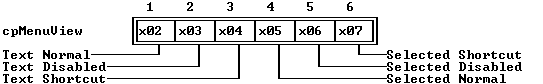

---

<a id="1SE3BS4"></a>

### TMenuView::TMenuView

*Keywords: TMenuView::TMenuView*

[See Also](#6Q_84N)	 [TMenuView class](#TMenuView)

 Form 1

 
```c
TMenuView( const TRect& bounds TMenu *aMenu = 0, TMenuView *aParent = 0 );
```
 Form 2

 
```c
TMenuView( StreamableInit streamableInit);   //protected
```
#### Description
 Form 1: Calls  TView::TView(* bounds) to create a  TMenuViewobject of size * Bounds. The * currentTMenuItempointer is set to 0. The * parentMenuand * menupointers are initialized to * aMenuand * aParent, respectively. The default * eventMaskis set to * evBroadcast. The  TMenuViewconstructors are called by the derived classes,  TMenuBarand  TMenuBox, and  would rarely, if ever, be invoked directly.

 Form 2: Each streamable class needs a "builder" to allocate the correct memory for its objects together with the initialized vtable pointersThis is achieved by calling this constructor with an argument of type  StreamableInit.

---

<a id="6Q_84N"></a>

#### See Also
 [TView::TView](#TView_TView)

 [TMenuBar::TMenuBar](#3_MO_HL)

 [TMenuBox::TMenuBox](#0XC3W6)

---

<a id="22WSH3C"></a>

### TMenuView::current

*Keywords: current*

[TMenuView class](#TMenuView)
#### Syntax
```c
TMenuItem *current;   //protected
```
#### Description
 A pointer to the currently selected menu item.

---

<a id="TMenuView_Menu"></a>

### TMenuView::menu

*Keywords: menu*

[See Also](#149KBJV)	 [TMenuView class](#TMenuView)
#### Syntax
```c
TMenu *menu;   //protected
```
#### Description
 A pointer to the  TMenuobject for this menu, which provides a linked list of menu items. The * menupointer allows access to all the data members of the menu items in this menu view.

---

<a id="149KBJV"></a>

#### See Also
 [TMenuView::findItem](#1_GOAEM)

 [TMenuView::getItemRect](#_O524I)

 [TMenu struct](#TMenu)

---

<a id="_VC62X"></a>

### TMenuView::parentMenu

*Keywords: parentMenu*

[See Also](#I5Q87O)	 [TMenuView class](#TMenuView)
#### Syntax
```c
TMenuView *parentMenu;   //protected
```
#### Description
 A pointer to the  TMenuViewobject (or any class derived from  TMenuView) that owns this menu. Note that  TMenuViewis not a group. Ownership here is a much simpler concept than  TGroupownership, allowing menu nesting: the selection of submenus and the return back to the "parent" menu. Selections from menu bars, for example, usually result in a submenu being "pulled down." The menu bar in that case is the parent menu of the menu box.

---

<a id="I5Q87O"></a>

#### See Also
 [TMenuBox::TMenuBox](#0XC3W6)

---

<a id="TMenuView_build"></a>

### TMenuView::build

*Keywords: build*

[See Also](#.XDE81)	 [TMenuView class](#TMenuView)
#### Syntax
```c
static TStreamable *build();
```
#### Description
 Called to create an object in certain stream-reading situations.

---

<a id=".XDE81"></a>

#### See Also
 [TStreamableClass](#TStreamableClass)

 [ipstream::readData](#3MVS.PE)

---

<a id="2_RZXU"></a>

### TMenuView::execute

*Keywords: execute*

[See Also](#12PPA92)	 [TMenuView class](#TMenuView)
#### Syntax
```c
virtual ushort execute();
```
#### Description
 Executes a menu view until the user selects a menu item or cancels the process. Returns the command assigned to the selected menu item, or zero if the menu was canceled. This member function should * neverbe called except by  execView.

---

<a id="12PPA92"></a>

#### See Also
 [TGroup::execView](#12U2PA7)

---

<a id="1_GOAEM"></a>

### TMenuView::findItem

*Keywords: findItem*

[TMenuView class](#TMenuView)
#### Syntax
```c
TMenuItem *findItem(char ch);
```
#### Description
 Returns a pointer to the menu item that has  toupper(* ch) as its hot key (the highlighted character). Returns 0 if no such menu item is found or if the menu item is disabled. Note that * chis case insensitive.

---

<a id="LQ882J"></a>

### TMenuView::getHelpCtx

*Keywords: getHelpCtx*

[TMenuView class](#TMenuView)
#### Syntax
```c
virtual ushort getHelpCtx();
```
#### Description
 By default, this member function returns the help context of the current menu selection. If this is * hcNoContext, the parent menu's current context is checked. If there is no parent menu,  getHelpCtxreturns * hcNoContext.

---

<a id="_O524I"></a>

### TMenuView::getItemRect

*Keywords: getItemRect*

[See Also](#JS0AIF)	 [TMenuView class](#TMenuView)
#### Syntax
```c
virtual TRect getItemRect(TMenuItem *item);
```
#### Description
 Classes derived from  TMenuView* mustoverride this member function in order to respond to mouse events. Your overriding functions in derived classes must return the rectangle occupied by the given menu item. It is used with  mouseInViewto determine if a mouse click has occurred on a given menu selection, and to then determine the required action.

---

<a id="JS0AIF"></a>

#### See Also
 [TMenuBar::getItemRect](#1WVP0RT)

 [TMenuBox::getItemRect](#M0G85C)

 [TView::mouseInView](#1L64_W)

---

<a id="B7INFN"></a>

### TMenuView::getPalette

*Keywords: getpalette*

[TMenuView class](#TMenuView)
#### Syntax
```c
virtual TPalette& getPalette() const;
```
#### Description
 Returns the default palette string, cpMenuView, "".

---

<a id="32WD8D9"></a>

### TMenuView::handleEvent

*Keywords: handleEvent*

[See Also](#048K8Y)	 [TMenuView class](#TMenuView)
#### Syntax
```c
virtual void handleEvent(TEvent& event);
```
#### Description
 Called whenever a menu event needs to be handled. Determines which menu item has been mouse or keyboard selected (including hot keys) and generates the appropriate command event with  putEvent.

---

<a id="048K8Y"></a>

#### See Also
 [TView::handleEvent](#4H2TBJ)

 [TView::putEvent](#8AOV_S5)

 [TMenuView::hotKey](#27CNKF)

---

<a id="27CNKF"></a>

### TMenuView::hotKey

*Keywords: hotKey*

[TMenuView class](#TMenuView)
#### Syntax
```c
TMenuItem *hotKey(ushort keyCode);
```
#### Description
 Returns a pointer to the menu item associated with the hot key given by keyCode. Returns 0 if no such menu item exists, or if the item is disabled. Hot keys are usually function keys or Alt key combinations, determined by  TProgram::initMenuBar.  hotKeyis used by  handleEventto determine whether a keystroke event selects an item in the menu.

---

<a id="8YHY2V"></a>

### TMenuView::newSubView

*Keywords: newSubView*

[TMenuView class](#TMenuView)
#### Syntax
```c
TMenuView *newSubView( const TRect& bounds, TMenu *aMenu, TMenuView *aParentMenu );
```
#### Description
 Used internally by TMenuView. Returns a new  TMenuBox(bounds, aMenu, aParentMenu  ).

---

<a id="TMenuView_read"></a>

### TMenuView::read

*Keywords: read*

[See Also](#9MQ4UV)	 [TMenuView class](#TMenuView)
#### Syntax
```c
virtual void *read( ipstream& is);   //protected
```
#### Description
 Reads from the input stream is.

---

<a id="9MQ4UV"></a>

#### See Also
 [TStreamableClass](#TStreamableClass)

 [TStreamable](#TStreamable)

 [ipstream](#ipstream)

---

<a id="TMenuView_write"></a>

### TMenuView::write

*Keywords: write*

[See Also](#36IVQG5)	 [TMenuView class](#TMenuView)
#### Syntax
```c
virtual void write( opstream& os);   //protected
```
#### Description
 Writes to the output stream os.

---

<a id="36IVQG5"></a>

#### See Also
 [TStreamableClass](#TStreamableClass)

 [TStreamable](#TStreamable)

 [opstream](#opstream)

---

<a id="TMonoSelector"></a>

### TMonoSelector Class

*Keywords: TMonoSelector*

[Inheritance](#TVFlow_2)
#### Header File
 colorsel.h
#### Description
 The interrelated classes  TColorItem,  TColorGroup,  TColorSelector,  TMonoSelector,  TColorDisplay,  TColorGroupList,  TColorItemList, and  TColorDialogare used to provide viewers and dialog boxes from which the user can select and change the color assignments from available palettes with immediate effect on the screen.

  TMonoSelectorimplements a cluster from which you can select normal, highlight, underline, or inverse video attributes on monochrome screens.

 Constructor

 
```c
TMonoSelector
```

```c
12WJ1UG( const TRect& bounds );
```
#### Member Functions
```c
static TStreamable * build
```

```c
TMonoSelector_build();

 virtual void  draw
```

```c
TMonoSelector_draw();

 virtual void  handleEvent
```

```c
1534YWZ( TEvent& event );

 virtual Boolean  mark
```

```c
TMonoSelector_mark( int item );

 void  movedTo
```

```c
1LFVNUI( int item );

 void  newColor
```

```c
IT__BU();

 virtual void  press
```

```c
TMonoSelector_press( int item );
```

---

<a id="12WJ1UG"></a>

### TMonoSelector::TMonoSelector

*Keywords: TMonoSelector::TMonoSelector*

#### Syntax
```c
TMonoSelector( const TRect& bounds );
```
#### Description
 Creates a cluster by calling the  TClusterconstructor with four buttons : Normal, Highlight, Underline, and Inverse. The * evBroadcastflag is set in * eventMask.

---

<a id="TMonoSelector_build"></a>

### TMonoSelector::build

*Keywords: build*

[See Also](#NVKWOO)	 [TMonoSelector class](#TMonoSelector)
#### Syntax
```c
static TStreamable *build();
```
#### Description
 Called to create an object in certain stream-reading situations.

---

<a id="NVKWOO"></a>

#### See Also
 [TStreamableClass](#TStreamableClass)

 [ipstream::readData](#3MVS.PE)

 [TStreamable](#TStreamable)

---

<a id="TMonoSelector_draw"></a>

### TMonoSelector::draw

*Keywords: draw*

[TMonoSelector class](#TMonoSelector)
#### Syntax
```c
virtual void draw();
```
#### Description
 Draws the selector cluster.

---

<a id="1534YWZ"></a>

### TMonoSelector::handleEvent

*Keywords: handleEvent*

[See Also](#1_H1EEM)	 [TMonoSelector class](#TMonoSelector)
#### Syntax
```c
virtual void handleEvent( TEvent& event );
```
#### Description
 Calls  TCluster::handleEventand responds to * cmColorSetevents by changing the data member * valueaccordingly. The view is redrawn if necessary. * valueactually holds a video attribute corresponding to the selected attribute.

---

<a id="1_H1EEM"></a>

#### See Also
 [TCluster::handleEvent](#57NK_NG)

 [TCluster::value](#TCluster_value)

---

<a id="TMonoSelector_mark"></a>

### TMonoSelector::mark

*Keywords: mark*

[TMonoSelector class](#TMonoSelector)
#### Syntax
```c
virtual Boolean mark( int item );
```
#### Description
 Returns * Trueif the * item'th button has been selected; otherwise returns * False.

---

<a id="1LFVNUI"></a>

### TMonoSelector::movedTo

*Keywords: movedTo*

[See Also](#0O7LPR)	 [TMonoSelector class](#TMonoSelector)
#### Syntax
```c
void movedTo( int item );
```
#### Description
 Sets * valueto the * item'th attribute (same effect as press).

---

<a id="0O7LPR"></a>

#### See Also
 [TMonoSelector::press](#TMonoSelector_press)

---

<a id="IT__BU"></a>

### TMonoSelector::newColor

*Keywords: newColor*

[TMonoSelector class](#TMonoSelector)
#### Syntax
```c
void newColor();
```
#### Description
 Informs the owning group if the attribute has changed.

---

<a id="TMonoSelector_press"></a>

### TMonoSelector::press

*Keywords: press*

[See Also](#TQ.KXU)	 [TMonoSelector class](#TMonoSelector)
#### Syntax
```c
virtual void press( int item );
```
#### Description
 "Presses" the * item'th button and calls newColor.

---

<a id="TQ.KXU"></a>

#### See Also
 [TMonoSelector::newColor](#IT__BU)

---

<a id="TMouse"></a>

### TMouse Class

*Keywords: TMouse*

[Inheritance](#TVFlow_1)
#### Header File
 system.h
#### Description
 TMouseprovides low-level mouse handling functions. These, and the other systems classes in system.h, are listed briefly for guidance only: they are used internally by Turbo Vision and you would not need to use them explicitly for normal applications.

 Constructor

 
```c
TMouse
```

```c
5PRRPJ();

  TMouse
```

```c
5PRRPJ();
```
#### Data Members
```c
static uchar  buttonCount
```

```c
31A2KCD;
```
#### Member Functions
```c
static void  getEvent
```

```c
0TUK7O( MouseEventType& me);

 static void  hide
```

```c
TMouse_hide();

 static Boolean  present
```

```c
F68CP4();

 static void  registerHandler
```

```c
1T84_KX( unsigned mask, void (*func)() );

 static void  resume
```

```c
3HVRJJ();

 static void  setRange
```

```c
1WR_UGN( ushort rx, ushort ry );

 static void  show
```

```c
TMouse_show();

 static void  suspend
```

```c
1GS.E4J();
```

---

<a id="5PRRPJ"></a>

### TMouse::TMouse

*Keywords: TMouse::TMouse*

[See Also](#02HCDW)	 [TMouse class](#TMouse)
#### Syntax
```c
TMouse();
```
#### Description
 Calls  TMouse::showto display the mouse cursor.

 Destructor

 
```c
~TMouse();
```
 Calls  THWMouse::hideto hide the mouse cursor.

---

<a id="02HCDW"></a>

#### See Also
 [TMouse::show](#TMouse_show)

 [THWMouse::hide](#THWMouse_hide)

---

<a id="31A2KCD"></a>

### TMouse::buttonCount

*Keywords: TMouse::buttonCount*

[TMouse class](#TMouse)
#### Syntax
```c
static uchar  buttonCount
```

```c
31A2KCD;   //protected
```
#### Description
 Holds the number of buttons on the mouse, or 0 if no mouse is detected.

---

<a id="0TUK7O"></a>

### TMouse::getEvent

*Keywords: getEvent*

[See Also](#P8GRW1)	 [TMouse class](#TMouse)
#### Syntax
```c
static void getEvent( MouseEventType& me);
```
#### Description
 Calls THWMouse::getEvent( me ) to set the * buttons, * where.x, * where.yand * doubleClickdata members of the MouseEventType structure,  me.

---

<a id="P8GRW1"></a>

#### See Also
 [THWMouse::getEvent](#1JOK1YD)

 [MouseEventType](#MouseEventType)

---

<a id="TMouse_hide"></a>

### TMouse::hide

*Keywords: hide*

[See Also](#5GKMVQ)	 [TMouse class](#TMouse)
#### Syntax
```c
static void hide();
```
#### Description
 Calls  THWMouse::hideto hide the mouse cursor.

---

<a id="5GKMVQ"></a>

#### See Also
 [THWMouse::hide](#THWMouse_hide)

---

<a id="F68CP4"></a>

### TMouse::present

*Keywords: present*

[See Also](#1WQ6AW_)	 [TMouse class](#TMouse)
#### Syntax
```c
static Boolean present();
```
#### Description
 Calls  THWMouse::present. Returns * Trueif a mouse is active (that is, if * buttonCountis nonzero); otherwise, returns * False.

---

<a id="1WQ6AW_"></a>

#### See Also
 [THWMouse::present](#F6KL7R)

---

<a id="1T84_KX"></a>

### TMouse::registerHandler

*Keywords: registerHandler*

[See Also](#C10LEY)	 [TMouse class](#TMouse)
#### Syntax
```c
static void registerHandler( unsigned mask, void (*func)() );
```
#### Description
 Calls  THWMouse::registerHandler( mask, func ) to register  funcas the current mouse handler.

---

<a id="C10LEY"></a>

#### See Also
 [THWMouse::registerHandler](#.OVNTE)

---

<a id="3HVRJJ"></a>

### TMouse::resume

*Keywords: resume*

[See Also](#E52TP)	 [TMouse class](#TMouse)
#### Syntax
```c
static void resume();
```
#### Description
 Calls  THWMouse::resume. Restores the mouse by reregistering the handler and resetting * buttonCount.

---

<a id="E52TP"></a>

#### See Also
 [THWMouse::resume](#DH_9GK)

---

<a id="1WR_UGN"></a>

### TMouse::setRange

*Keywords: setRange*

[See Also](#1XMYR2C)	 [TMouse class](#TMouse)
#### Syntax
```c
static void setRange( ushort rx, ushort ry );
```
#### Description
 Calls  THWMouse::setRange( rx, ry ) to set the mouse range to the given arguments.

---

<a id="1XMYR2C"></a>

#### See Also
 [THWMouse::setRange](#1X0F_0N)

---

<a id="TMouse_show"></a>

### TMouse::show

*Keywords: show*

[See Also](#2DW70PV)	 [TMouse class](#TMouse)
#### Syntax
```c
static void show();
```
#### Description
 Calls  THWMouse::showto display the mouse cursor.

---

<a id="2DW70PV"></a>

#### See Also
 [THWMouse::show](#THWMouse_show)

---

<a id="1GS.E4J"></a>

### TMouse::suspend

*Keywords: suspend*

[See Also](#41BH5VU)	 [TMouse class](#TMouse)
#### Syntax
```c
static void suspend();
```
#### Description
 Calls  THWMouse::suspend. Does nothing if  presentreturns * False; otherwise, hides the mouse, unregisters the handler, and sets * buttonCountto zero.

---

<a id="41BH5VU"></a>

#### See Also
 [THWMouse::suspend](#8A7NCH)

---

<a id="TMultiCheckBoxes"></a>

### TMultiCheckBoxes

*Keywords: TMultiCheckBoxes Class*

#### Header File
 dialogs.h

 Constructors

 
```c
TMultiCheckBoxes
```

```c
ANHCSX( TRect &bounds, TSItem *items, uchar aSelRange, ushort aFlags, const 

  TMultiCheckBoxes
```

```c
ANHCSX();char * aStates );
```
#### Member Functions
```c
virtual ushort  dataSize
```

```c
1_1J3FB();

 virtual void  draw
```

```c
TMultiCheckBoxes_draw();

 virtual void  getData
```

```c
15RGAA( void *rec );

 virtual uchar  multiMark
```

```c
.SC5NT( int item);

 virtual void  press
```

```c
TMultiCheckBoxes_press( int item );

 virtual void  setData
```

```c
DD2O73( void *rec );
```

---

<a id="ANHCSX"></a>

### TMultiCheckBoxes::TMultiCheckBoxes

*Keywords: TMultiCheckBoxes::TMultiCheckBoxes*

[See Also](#JBQWPP)	 [TMultiCheckBoxes class](#TMultiCheckBoxes)
#### Syntax
```c
TMultiCheckBoxes( TRect &bounds, TSItem *items, uchar aSelRange, ushort aFlags, const char * aStates );
```
#### Description
 Constructs a cluster of multistate check boxes by first calling the constructor inherited from  TCluster, then setting the * SelRange, and * Flagsdata members to the values passed in * aSelRangeand * aFlags, respectively, and allocating a dynamic copy of * aStatesand assigning it to * States.

 * aSelRangeindicates the number of states each check box can have. * aFlagsis one of the * cfXXXXconstants, indicating how many bits in * Valuerepresent each check box. * aStateshas a character to display for each possible state.

 Destructor

 
```c
~TMultiCheckBoxes();
```
#### Description
 Disposes of the multistate check boxes object by first deallocating the dynamic string * States,*  then calling the destructor inherited from  TCluster.

---

<a id="JBQWPP"></a>

#### See Also
 [TCluster](#TCluster)

---

<a id="1_1J3FB"></a>

### TMultiCheckBoxes::dataSize

*Keywords: dataSize*

[See Also](#1OQJL3Y)	 [TMultiCheckBoxes class](#TMultiCheckBoxes)
#### Syntax
```c
virtual ushort dataSize();
```
#### Description
 Returns the size of the data transferred by  getDataand  setData, which is  SizeOf(Longint).

---

<a id="1OQJL3Y"></a>

#### See Also
 [TMultiCheckBoxes::getData](#15RGAA)

 [TMultiCheckBoxes::setData](#DD2O73)

---

<a id="TMultiCheckBoxes_draw"></a>

### TMultiCheckBoxes::draw

*Keywords: draw*

[TMultiCheckBoxes class](#TMultiCheckBoxes)
#### Syntax
```c
virtual void draw();
```
#### Description
 Draws the cluster of multistate check boxes by drawing each check box in turn, using the same box as a regular check box, but using the characters in * Statesto represent the state of each box instead of the standard blank and 'X'.

---

<a id="15RGAA"></a>

### TMultiCheckBoxes::getData

*Keywords: getData*

[TMultiCheckBoxes class](#TMultiCheckBoxes)
#### Syntax
```c
virtual void getData( void *rec );
```
#### Description
 Typecasts * recinto a  longand copies * valueinto it.

---

<a id=".SC5NT"></a>

### TMultiCheckBoxes::MultiMark

*Keywords: MultiMark*

[TMultiCheckBoxes class](#TMultiCheckBoxes)
#### Syntax
```c
virtual uchar multiMark( int item);
```
#### Description
 Returns the state of the * itemth check box in the cluster.

---

<a id="TMultiCheckBoxes_press"></a>

### TMultiCheckBoxes::press

*Keywords: press*

[TMultiCheckBoxes class](#TMultiCheckBoxes)
#### Syntax
```c
virtual void press( int item );
```
#### Description
 Changes the state of the * itemth check box in the cluster. Unlike regular check boxes that simply toggle on and off, multistate check boxes cycle through all the states available to them.

---

<a id="DD2O73"></a>

### TMultiCheckBoxes::setData

*Keywords: setData*

[TMultiCheckBoxes class](#TMultiCheckBoxes)
#### Syntax
```c
virtual void setData( void *rec );
```
#### Description
 Typecasts * recinto a  long, and copies its value into * value, then calls  drawViewto redraw the checkboxes to reflect their new states.

---

<a id="TNode"></a>

### TNode Class

*Keywords: TNode*

#### Header File
 outline.h
#### Description
 TOutlineuses the  TNodeclass to hold lists of linked strings that form the outline.

 Outline objects use records of type * TNodeto hold the lists of linked strings that form the outline. Each node record holds the text for that item in the outline in its * textfield. * childListpoints to the first in a list of subordinate nodes, or holds NULL if there are no items subordinate to the node. * nextpoints to the next node at the same outline level as the current node. * expandedis * Trueif the outline view shows the subordinate views listed in * childListor * Falseif the subordinate nodes are hidden.

 When creating your outline list, allocate new nodes using * newNode, and dispose of the nodes with * disposeNode.

 Constructors

 [
```c
 TNode
```

```c
 TNode_TNode ( const char * aText ); TNode
```

```c
 TNode_TNode ( const char * aText, TNode * aChildren, TNode *aNext, Boolean aExpanded = True );
```
 ~ TNode](#TNode_TNode) ()
#### Member Functions
```c
TNode * next
```

```c
TNode_next;

 char * text
```

```c
TNode_text;

 TNode * childList
```

```c
32KWB7C;

 Boolean  expanded
```

```c
3IPX_I2;
```

---

<a id="TNode_TNode"></a>

### TNode::TNode

*Keywords: TNode::TNode*

Form 1

 
```c
TNode ( const char * aText );
```
 Form 2

 
```c
TNode ( const char * aText, TNode * aChildren, TNode *aNext, Boolean aExpanded = True );
```
#### Description
 Form 1:Constructs a  TNodeby making a copy of * aTextand storing it in the text data member. The * nextand * childListmembers are initialized to NULL. The expanded member variable is set to * False.

  Form 2:Constructs a  TNodeby making a copy of * aTextand storing it in the text data member. * childListis initialized to * aChildren, * nextis initialized to * aNext, and * expandedis initialized to * aExpanded.

 Destructor

 ~TNode ()

 Deletes the text member and destroys the TNode object.

---

<a id="TNode_next"></a>

### TNode::next

*Keywords: TNode::next*

#### Syntax
```c
TNode *next;
```
#### Description
 Points to the next node at the same outline level as the current node.

---

<a id="TNode_text"></a>

### TNode::text

*Keywords: TNode::text*

#### Syntax
```c
char *text;
```
#### Description
 Contains the text that is displayed for this outline node.

---

<a id="32KWB7C"></a>

### TNode::childList

*Keywords: TNode::childList*

#### Syntax
```c
TNode *childList;
```
#### Description
 Points to the list of children for the current node.

---

<a id="3IPX_I2"></a>

### TNode::expanded

*Keywords: TNode::expanded*

#### Syntax
```c
Boolean expanded;
```
#### Description
 If expanded is True, the outline will display the children of this node. If expanded is False, the children are not displayed.

---

<a id="TNSCollection"></a>

### TNSCollection ::TNSCollection class

*Keywords: TNSCollection class*

[Inheritance](#TVFlow_1)
#### Header File
 tvobjs.h
#### Description
 TNSCollectionimplements a nonstreamable collection of items (hence the prefix * NS) including other objects. Its main purpose is to provide a base class (together with  TStreamablevia multiple inheritance) for the streamable collection class,  TCollection.  TNSCollectionprovides  TCollectionwith the functions for adding, accessing, and removing items from a collection.  TStreamableprovides  TCollectionwith the ability to name and create streams that collections can be written to and read from.

 A collection is a more general concept than the traditional array, set, or list.  TNSCollectionobjects size themselves dynamically at run time and offer a base for more specialized derived classes such as  TCollection,  TNSSortedCollection,  TSortedCollection,  TStringCollection, and  TResourceCollection. In addition to member functions for adding and deleting items,  TNSCollectionoffers several iterator routines that call a function for each item in the collection.

 Constructors

 
```c
TNSCollection
```

```c
2YCTTE( ccIndex aLimit, ccIndex aDelta );

  TNSCollection
```

```c
2YCTTE();
```
#### Data Members
```c
ccIndex  count
```

```c
TNSCollection_count;

 ccIndex  delta
```

```c
TNSCollection_delta;

 void ** items
```

```c
TNSCollection_items;

 ccIndex  limit
```

```c
TNSCollection_limit;

 Boolean  shouldDelete
```

```c
2FRTRH8;

 virtual void  shutDown
```

```c
C06ZQF();
```
#### Member Functions
```c
void * at
```

```c
TNSCollection_at(ccIndex index);

 void  atFree
```

```c
JR32JT(ccIndex index);

 void  atInsert
```

```c
17BJT2F(ccIndex index, void *item);

 void  atPut
```

```c
TNSCollection_atPut(ccIndex index, void *item);

 void  atRemove
```

```c
QX42B(ccIndex index);

 static void  error
```

```c
TNSCollection_error(ccIndex code, ccIndex info);

 void * firstThat
```

```c
W3_QOP(ccTestFunc Test, void *arg);

 void  forEach
```

```c
1QTDZV8(ccAppFunc action, void *arg);

 void  free
```

```c
TNSCollection_free(void *item);

 virtual void  freeItem
```

```c
20HFG6( void *item );   //private

  remove
```

```c
TNSCollection_free( item );

 void  freeAll
```

```c
2FPPZKL();

 ccIndex  getCount
```

```c
1U5ZZWM();

 virtual ccIndex  indexOf
```

```c
M9SIVW(void *item);

 virtual void  insert
```

```c
1DUKPDH(void *item);

 void * lastThat
```

```c
2VTXYLN(ccTestFunc Test, void *arg);

 void  pack
```

```c
TNSCollection_pack();

 void  remove
```

```c
1MLEZH9(void *item);

 void  removeAll
```

```c
QE9FH0();

 virtual void  setLimit
```

```c
S5LV7F(ccIndex aLimit);

 virtual void  shutDown
```

```c
C06ZQF();
```

---

<a id="2YCTTE"></a>

### TNSCollection::TNSCollection

*Keywords: TNSCollection::TNSCollection*

[See Also](#38Z._CS)	 [TNSCollection class](#TNSCollection)

 Form 1

 
```c
TNSCollection( ccIndex aLimit, ccIndex aDelta );   //protected
```
 Form 2

 
```c
TNSCollection();
```
#### Description
 Form 1: Creates a collection with limit set to aLimit and delta set to adelta. count and items are both set to 0. shouldDelete is set True. The initial number of items will be limited to aLimit, but the collection is allowed to grow in increments of aDelta until memory runs out or the number of items reaches maxCollectionSize.

  Form 2: This constructor sets shouldDelete to true all other data members to 0.

 Destructor

 
```c
~TNSCollection();
```
#### Description
 Destroys the  TNSCollectionobject.

---

<a id="38Z._CS"></a>

#### See Also
 [TNSCollection::shouldDelete](#2FRTRH8)

 [TNSCollection::count](#TNSCollection_count)

 [TNSCollection::limit](#TNSCollection_limit)

 [TNSCollection::delta](#TNSCollection_delta)

 [TNSCollection::shouldDelete](#2FRTRH8)

 [TNSCollection::freeAll](#2FPPZKL)

 [TNSCollection::setLimit](#S5LV7F)

---

<a id="TNSCollection_count"></a>

### TNSCollection ::count

*Keywords: count*

[TNSCollection class](#TNSCollection)
#### Syntax
```c
ccIndex count;   //protected
```
#### Description
 The current number of items in the collection, up to * maxCollectionSize. Use  getCountto access this protected data member.

---

<a id="TNSCollection_delta"></a>

### TNSCollection ::delta

*Keywords: delta*

[TNSCollection class](#TNSCollection)
#### Syntax
```c
ccIndex delta;   //protected
```
#### Description
 The number of items by which to increase the * itemslist whenever it becomes full. If * deltais zero, the collection cannot grow beyond the size set by * limit.

---

<a id="TNSCollection_items"></a>

### TNSCollection ::items

*Keywords: items*

[TNSCollection class](#TNSCollection)
#### Syntax
```c
void **items;   //protected
```
#### Description
 A pointer to an array of generic item pointers.

---

<a id="TNSCollection_limit"></a>

### TNSCollection ::limit

*Keywords: limit*

[TNSCollection class](#TNSCollection)
#### Syntax
```c
ccIndex limit;   //protected
```
#### Description
 The currently allocated size (in elements) of the * itemslist.

---

<a id="2FRTRH8"></a>

### TNSCollection ::shouldDelete

*Keywords: shouldDelete*

[See Also](#68BMYI)	 [TNSCollection class](#TNSCollection)
#### Syntax
```c
Boolean shouldDelete;   //protected
```
#### Description
 If set * True(the default), the  TNSCollectiondestructor will call  freeAllbefore setting limit to 0. If set * False, the destructor simply sets * limitto 0.

---

<a id="68BMYI"></a>

#### See Also
 [TNSCollection::shutDown](#C06ZQF)

 [TNSCollection::freeAll](#2FPPZKL)

---

<a id="TNSCollection_at"></a>

### TNSCollection ::at

*Keywords: at*

[See Also](#6FJ068)	 [TNSCollection class](#TNSCollection)
#### Syntax
```c
void *at(ccIndex index);
```
#### Description
 Returns a pointer to the item indexed by index in the collection. This member function lets you treat a collection as an indexed array. If index is less than zero or greater than or equal to count, the  errormember function is called with an argument of coIndexError, and 0 is returned.

---

<a id="6FJ068"></a>

#### See Also
 [TNSCollection::indexOf](#M9SIVW)

---

<a id="JR32JT"></a>

### TNSCollection ::atFree

*Keywords: atFree*

[TNSCollection class](#TNSCollection)
#### Syntax
```c
void atFree(ccIndex index);
```
#### Description
 Removes the item at the indexth position, then destroys the item with  delete(item). The following items are moved up one position, and count is decremented by 1. If index is greater than or equal to count,  error(1, 0) is called.

---

<a id="17BJT2F"></a>

### TNSCollection ::atInsert

*Keywords: atInsert*

[See Also](#GWA0_S)	 [TNSCollection class](#TNSCollection)
#### Syntax
```c
void atInsert(ccIndex index, void *item);
```
#### Description
 Moves the following items down by one position, then inserts * itemat the * index'th position. If * indexis less than zero or greater than * count, the  errormember function is called with an argument of * coIndexError and the new * itemis not inserted. If * countis equal to * limitbefore the call to  atInsert, the allocated size of the collection is expanded by * deltaitems using a call to  setLimit. If the  setLimit call fails to expand the collection, the  errormember function is called with an argument of * coOverflowand the new * itemis not inserted.

---

<a id="GWA0_S"></a>

#### See Also
 [TNSCollection::at](#TNSCollection_at)

 [TNSCollection::atPut](#TNSCollection_atPut)

---

<a id="TNSCollection_atPut"></a>

### TNSCollection ::atPut

*Keywords: atPut*

[See Also](#.XB.5)	 [TNSCollection class](#TNSCollection)
#### Syntax
```c
void atPut(ccIndex index, void *item);
```
#### Description
 Replaces the item at index position index with the given item. If index is less than zero or greater than or equal to count, the  errormember function is called with an argument of coIndexError.

---

<a id=".XB.5"></a>

#### See Also
 [TNSCollection::at](#TNSCollection_at)

 [TNSCollection::atInsert](#17BJT2F)

---

<a id="QX42B"></a>

### TNSCollection ::atRemove

*Keywords: atRemove*

[See Also](#25ZA6RP)	 [TNSCollection class](#TNSCollection)
#### Syntax
```c
void atRemove(ccIndex index);
```
#### Description
 Removes the item at the index'th position by moving the following items up by one position. The item itself is not destroyed. count is decremented by 1, but the memory allocated to the collection (as given by limit) is not reduced. If index greater than or equal to count,  error(1,0) is called. Contrast the  atRemoveaction with  atFree. The latter does an  atRemove, then destroys the item with  delete(item).

---

<a id="25ZA6RP"></a>

#### See Also
 [TNSCollection::atFree](#JR32JT)

 [TNSCollection::remove](#1MLEZH9)

---

<a id="TNSCollection_error"></a>

### TNSCollection ::error

*Keywords: error*

[TNSCollection class](#TNSCollection)
#### Syntax
```c
static void error(ccIndex code, ccIndex info);
```
#### Description
 Called whenever a collection error is encountered. By default, this member function calls  exit(212 - * code).

---

<a id="W3_QOP"></a>

### TNSCollection ::firstThat

*Keywords: firstThat*

[See Also](#XJUP8Y)	 [TNSCollection class](#TNSCollection)
#### Syntax
```c
void *firstThat(ccTestFunc Test, void *arg);
```
#### Description
 firstThatapplies a Boolean function  *Test,along with an argument list given by arg (possibly empty), to each item in the collection until  *Testreturns True. The result is the item pointer for which  *Testreturns True, or 0 if  *Testreturns False for all items. ccTestFunc is defined as follows:

 
```c
    typedef Boolean (*ccTestFunc) (void *, void *);
```
 The first pointer argument of  *Testscans the collection. The second argument of  *Testis set from the arg pointer of  firstThat, as shown in the following implementation:

 
```c
 void *TNSCollection::firstThat( ccTestFunc Test, void *arg )

 \-

    for( ccIndex i = 0; i < count; i++ )

 \-

       if( Test( items[i], arg ) == True )

          return items[i];

       

    return 0;
```
 Recall that the protected data member items is of type  void **, so that items[i] is of type  void *.

---

<a id="XJUP8Y"></a>

#### See Also
 [TNSCollection::lastThat](#2VTXYLN)

 [TNSCollection::forEach](#1QTDZV8)

---

<a id="1QTDZV8"></a>

### TNSCollection ::forEach

*Keywords: forEach*

[See Also](#39GBZ4D)	 [TNSCollection class](#TNSCollection)
#### Syntax
```c
void forEach(ccAppFunc action, void *arg);
```
#### Description
 The  forEachiterator applies an action, given by the function  *action, to each item in the collection. The arg pointer can be used to pass additional arguments to the action. ccAppFunc is defined as follows:

 
```c
    typedef void (*ccAppFunc) ( void *, void *);
```
 The first pointer argument of  *actionscans the collection. The second argument of  *actionis set from the arg pointer of  forEach, as shown in the following implementation:

 
```c
 void TNSCollection::forEach( ccAppFunc action, void *arg )

 \-

    for( ccIndex i = 0; i < count; i++ )

 action( items[i], arg );
```
 Recall that the protected data member items is of type  void **, so that items[i] is of type  void *.

---

<a id="39GBZ4D"></a>

#### See Also
 [TNSCollection::firstThat](#W3_QOP)

 [TNSCollection::lastThat](#2VTXYLN)

---

<a id="TNSCollection_free"></a>

### TNSCollection ::free

*Keywords: free*

[See Also](#2HCX_WT)	 [TNSCollection class](#TNSCollection)
#### Syntax
```c
void free(void *item);
```
#### Description
 Removes and destroys the given item. Equivalent to

 
```c
 remove( item );

 delete( item );
```

---

<a id="2HCX_WT"></a>

#### See Also
 [TNSCollection::remove](#1MLEZH9)

---

<a id="20HFG6"></a>

### TNSCollection::freeItem

*Keywords: freeItem*

[TNSCollection class](#TNSCollection)
#### Syntax
```c
virtual void freeItem( void *item );   //private
```
#### Description
 Frees the given item from the collection by deleting both the key and the item. For collections of user-defined objects, it might be necessary to derive from  TNSCollectionand override  freeItemin order to properly delete the user-defined object.

---

<a id="2FPPZKL"></a>

### TNSCollection ::freeAll

*Keywords: freeAll*

[See Also](#GF3PNJ)	 [TNSCollection class](#TNSCollection)
#### Syntax
```c
void freeAll();
```
#### Description
 Removes and destroys all items in the collection and sets count to 0.

---

<a id="GF3PNJ"></a>

#### See Also
 [TNSCollection::removeAll](#QE9FH0)

---

<a id="1U5ZZWM"></a>

### TNSCollection ::getCount

*Keywords: getCount*

[TNSCollection class](#TNSCollection)
#### Syntax
```c
ccIndex getCount();
```
#### Description
 Returns the value of the protected data member count.

---

<a id="M9SIVW"></a>

### TNSCollection ::indexOf

*Keywords: indexOf*

[See Also](#VKGAFK)	 [TNSCollection class](#TNSCollection)
#### Syntax
```c
virtual ccIndex indexOf(void *item);
```
#### Description
 Returns the index of the given item; that is, the converse operation to  TNSCollection::at. If item is not in the collection,  indexOfcalls  error(1,0).

---

<a id="VKGAFK"></a>

#### See Also
 [TNSCollection::at](#TNSCollection_at)

---

<a id="1DUKPDH"></a>

### TNSCollection ::insert

*Keywords: insert*

[See Also](#7BWMJ5)	 [TNSCollection class](#TNSCollection)
#### Syntax
```c
virtual void insert(void *item);
```
#### Description
 Inserts item into the collection, and adjusts other indexes if necessary. By default, insertions are made at the end of the collection by calling  atInsert(count, item);

---

<a id="7BWMJ5"></a>

#### See Also
 [TNSCollection::atInsert](#17BJT2F)

---

<a id="2VTXYLN"></a>

### TNSCollection ::lastThat

*Keywords: lastThat*

[See Also](#2N37PYY)	 [TNSCollection class](#TNSCollection)
#### Syntax
```c
void *lastThat(ccTestFunc Test, void *arg);
```
#### Description
 lastThatapplies the Boolean function  *Test, together with the arg argument list (possibly empty), to each item in the collection, starting at the last item, and scanning in reverse order until  *Test returns True. The result is the item pointer for which  *Testreturns True, or 0 if  *Testreturns False for all items. ccTestFunc is defined as follows:

 
```c
    typedef Boolean (*ccTestFunc) (void *, void *);
```
 The first pointer argument of  Testscans the collection. The second argument of  Testis set from the arg pointer of  lastThat, as shown in the following implementation:

 
```c
 void *TNSCollection::lastThat( ccTestFunc Test, void *arg )

 \-

    for( ccIndex i = count; i > 0; i-- )

 \-

       if( Test( items[i-1], arg ) == True )

           return items[i-1];

       

    return 0;
```
 Recall that the protected data member items is of type  void **, so that items[i] is of type  void *.

---

<a id="2N37PYY"></a>

#### See Also
 [TNSCollection::firstThat](#W3_QOP)

 [TNSCollection::forEach](#1QTDZV8)

---

<a id="TNSCollection_pack"></a>

### TNSCollection ::pack

*Keywords: pack*

[See Also](#2_0K7CD)	 [TNSCollection class](#TNSCollection)
#### Syntax
```c
void pack();
```
#### Description
 Deletes all null pointers in the collection and moves items up to fill any gaps.

---

<a id="2_0K7CD"></a>

#### See Also
 [TNSCollection::remove](#1MLEZH9)

 [TNSCollection::removeAll](#QE9FH0)

---

<a id="1MLEZH9"></a>

### TNSCollection ::remove

*Keywords: remove*

[See Also](#13.KJGM)	 [TNSCollection class](#TNSCollection)
#### Syntax
```c
void remove(void *item);
```
#### Description
 Removes the item given by item from the collection. Equivalent to  atRemove( indexOf(item)).

---

<a id="13.KJGM"></a>

#### See Also
 [TNSCollection::atRemove](#QX42B)

 [TNSCollection::indexOf](#M9SIVW)

---

<a id="QE9FH0"></a>

### TNSCollection ::removeAll

*Keywords: removeAll*

[See Also](#VXPZI9)	 [TNSCollection class](#TNSCollection)
#### Syntax
```c
void removeAll();
```
#### Description
 Removes all items from the collection by setting count to zero.

---

<a id="VXPZI9"></a>

#### See Also
 [TNSCollection::remove](#1MLEZH9)

 [TNSCollection::atRemove](#QX42B)

---

<a id="S5LV7F"></a>

### TNSCollection ::setLimit

*Keywords: setLimit*

[See Also](#TWL__5)	 [TNSCollection class](#TNSCollection)
#### Syntax
```c
virtual void setLimit(ccIndex aLimit);
```
#### Description
 Expands or shrinks the collection by changing the allocated size to aLimit. If aLimit is less than count, it is set to count, and if aLimit is greater than maxCollectionSize, it is set to maxCollectionSize. Then, if aLimit is different from the current limit, a new items array of aLimit elements is allocated, the old items array is copied into the new array, and the old array is deleted.

---

<a id="TWL__5"></a>

#### See Also
 [TNSCollection::limit](#TNSCollection_limit)

 [TNSCollection::count](#TNSCollection_count)

---

<a id="C06ZQF"></a>

### TNSCollection ::shutDown

*Keywords: shutDown*

[TNSCollection class](#TNSCollection)

 Syntax (data member)

 
```c
virtual void shutDown();
```
 Syntax (member function)

 
```c
virtual void shutDown();
```
#### Description
 (data member) - If * shouldDeleteis * True, the  shutDownfunction removes and destroys all items in the collection by calling  TNSCollection::freeAlland setting * limitto 0. If * shouldDeleteis * False,  shutDownsets * limitto zero but does not destroy the collection.

 (member function) - Used internally by  TObject::destroyto ensure correct destruction of derived and related objects.  shutDownis overridden in many classes to ensure the proper setting of related data members when  destroyis called.

---

<a id="TNSSortedCollection"></a>

### TNSSortedCollection ::TNSSortedCollection class

*Keywords: TNSSortedCollection class*

[Inheritance](#TVFlow_1)
#### Header File
 tvobjs.h
#### Description
 The abstract class  TNSSortedCollectionis a specialized derivative of  TNSCollectionimplementing nonstreamable collections sorted by a key (with or without duplicates). No instances of  TNSSortedCollectionare allowed. It exists solely as a base for other standard or user-defined derived classes.

 Sorting is implied by the pure virtual (and private) member function  compare, which you * mustoverride (or redefine as pure virtual). Eventually, you would override it in your derived classes to provide a particular ordering of the collection. As new items are added they are automatically inserted in the order given by  compare. Items can be located using the binary (by default)  searchfunction (also virtual). The virtual  indexOffunction, which returns a pointer for  compare, can also be overridden if  compareneeds additional information.

 For streamable sorted collections, you must use the class  TSortedCollection, which is multiply derived from  TNSSortedCollectionand  TCollection(which has  TStreamableas a base). Apart from streamability, the two classes  TSortedCollectionand  TNSSortedCollectionoffer the same functionality.

 Constructors

 
```c
TNSSortedCollection
```

```c
1I.KOCF(ccIndex aLimit, ccIndex aDelta);
```
#### Data Members
```c
Boolean  duplicates
```

```c
192.68A;
```
#### Member Functions
```c
virtual int  compare
```

```c
44U7MC(void *key1, void *key2) = 0;

 virtual cclNdex  indexOf
```

```c
2LS9PVJ( void *item );

 virtual void  insert
```

```c
HB36.A(void *item);

 virtual void * keyOf
```

```c
TNSSortedCollection_keyOf( void *item );

 virtual Boolean  search
```

```c
R8LBX5(void *key, ccIndex& index);
```

---

<a id="1I.KOCF"></a>

### TNSSortedCollection::TNSSortedCollection

*Keywords: TNSSortedCollection::TNSSortedCollection*

[See Also](#18GY9B0)	 [TNSSortedCollection class](#TNSSortedCollection)
#### Syntax
```c
TNSSortedCollection(ccIndex aLimit, ccIndex aDelta);
```
#### Description
 Invokes the  TCollectionconstructor to set * count, * items, and * limitto zero; calls  setLimit(* aLimit) to set the collection limit to * aLimit, then sets * deltato * aDelta. Note that * ccIndexis a  typedefed  int. * duplicatesis set to * False. If you want to allow duplicate keys, you must set * duplicatesto * True.

---

<a id="18GY9B0"></a>

#### See Also
 [TCollection](#TCollection)

---

<a id="192.68A"></a>

### TNSSortedCollection ::duplicates

*Keywords: duplicates*

[TNSSortedCollection class](#TNSSortedCollection)
#### Syntax
```c
Boolean duplicates;
```
#### Description
 Set to * Trueif duplicate indexes are allowed; otherwise set to * False. The default is * False. If * duplicateis * True, the * search, * insert, and * indexOfmember functions work differently (see these member function entries).

---

<a id="44U7MC"></a>

### TNSSortedCollection ::compare

*Keywords: compare*

[TNSSortedCollection class](#TNSSortedCollection)
#### Syntax
```c
virtual int compare(void *key1, void *key2) = 0;   //private
```
#### Description
 compareis a pure virtual function that must be overridden in all derived classes.  compareshould compare the two key values, and return a result as follows:

| < 0 | if key1 < key2 |
| --- | --- |
| 0 | if key1 = key2 |
| > 0 | if key1 > key2 |

 * key1and * key2are generic pointers, as extracted from their corresponding collection items by the  keyOfmember function. The  searchmember function implements a binary search through the collection's items using  compareto compare the items.

---

<a id="2LS9PVJ"></a>

### TNSSortedCollection ::indexOf

*Keywords: indexOf*

[TNSSortedCollection class](#TNSSortedCollection)
#### Syntax
```c
virtual cclNdex indexOf( void *item );
```
#### Description
 Returns the index of a given item in the collection.

---

<a id="HB36.A"></a>

### TNSSortedCollection ::insert

*Keywords: insert*

[See Also](#3_X4EPP)	 [TNSSortedCollection class](#TNSSortedCollection)
#### Syntax
```c
virtual void insert(void *item);
```
#### Description
 If * duplicatesis * False,  insertworks as follows: If the target item is not found in the sorted collection, it is inserted at the correct index position. Calls  searchto determine if the item exists, and if not, where to insert it.  insertis implemented as follows:

 
```c
 \-

    ccIndex i;

    if (search(keyOf(item), i) == 0)

 atInsert(i,item);
```
 If * duplicatesis * True, the item is inserted ahead of any items (if any) with the same key.

---

<a id="3_X4EPP"></a>

#### See Also
 [TNSSortedCollection::search](#R8LBX5)

 [TNSCollection::atInsert](#17BJT2F)

---

<a id="TNSSortedCollection_keyOf"></a>

### TNSSortedCollection ::keyOf

*Keywords: keyOf*

[TNSSortedCollection class](#TNSSortedCollection)
#### Syntax
```c
virtual void *keyOf( void *item );
```
#### Description
 Returns the key of a given item in the collection.

---

<a id="R8LBX5"></a>

### TNSSortedCollection ::search

*Keywords: search*

[See Also](#P9YWE)	 [TNSSortedCollection class](#TNSSortedCollection)
#### Syntax
```c
virtual Boolean search(void *key, ccIndex& index);
```
#### Description
 Returns * Trueif the item identified by * keyis found in the sorted collection. If the item is found, * indexis set to the found index; otherwise * indexis set to the index where the item would be placed if inserted. Note that if * duplicatesis * Trueand the key is duplicated, search will locate the * firstitem that matches.

---

<a id="P9YWE"></a>

#### See Also
 [TNSSortedCollection::compare](#44U7MC)

 [TNSSortedCollection::insert](#HB36.A)

---

<a id="TObject"></a>

### TObject::TObject

*Keywords: TObject*

#### Header File
 tvobjs.h
#### Description
 TObjectis the starting point for much of Turbo Vision's class hierarchy. It has no parents but many descendants. Apart from  TPointand  TRect(and various initialization and stream management classes and structures), most of Turbo Vision's standard classes are ultimately derived from  TObject.

 Destructor

 
```c
virtual ~TObject();
```
#### Member Functions
```c
static void  destroy
```

```c
G308ZH( TObject *ob);

 virtual void  shutDown
```

```c
F0MD2C();
```

---

<a id="CE_6LF"></a>

### TObject::TObject

*Keywords: TObject::TObject*

[TObject class](#TObject)
#### Syntax
```c
virtual ~TObject();
```
#### Description
 Performs the necessary cleanup and disposal for dynamic objects.

---

<a id="G308ZH"></a>

### TObject::destroy

*Keywords: TObject::destroy*

[TObject class](#TObject)
#### Syntax
```c
static void destroy( TObject *ob);
```
#### Description
 Whenever you want to delete an object (* ob) of a type derived from  TObject(that is, any object created with operator  new), call  destroy.  destroyterminates the object, correctly freeing the memory that it occupies. Use this function in place of the C++ operator  delete.

 For example:

 
```c
 TDialog *dlg = new TDialog( ... );

 // delete dlg; // DON'T DO THIS

 destroy( dlg ); // DO IT THIS WAY
```

---

<a id="F0MD2C"></a>

### TObject::shutDown

*Keywords: TObject::shutDown*

[TObject class](#TObject)
#### Syntax
```c
virtual void shutDown();
```
#### Description
 Used internally by  TObject::destroyto ensure correct destruction of derived and related objects.  shutDownis overridden in many classes to ensure the proper setting of related data members when  destroyis called.

---

<a id="TOutline"></a>

### TOutline Class

*Keywords: TOutline*

#### Header File
 outline.h
#### Description
 TOutlineimplements a simple but useful type of outline viewer.It assumes that the outline is a linked list of records of type  TNode, so each node consists of a text string, a pointer to any child nodes, and a pointer to the next node at the same level.

 Constructor

 
```c
TOutline
```

```c
32IJ4DM( TRect& bounds, TScrollBar* aHScrollBar, TScrollBar* aVScrollBar, TNode* aRoot);

  TOutLine
```

```c
32IJ4DM();
```
#### Data Members
```c
TNode * root
```

```c
TOutline_Root;
```
#### Member Functions
```c
virtual void  adjust
```

```c
HJUZXW(TNode* node, Boolean expand);

 virtual TNode*  getRoot
```

```c
PJL_VD();

 virtual int  getNumChildren
```

```c
6R0X8.(TNode* node);

 virtual TNode*  getChild
```

```c
M720OZ(TNode* node, int i);

 virtual char*  getText
```

```c
3AB4H4(TNode* node);

 virtual Boolean  hasChildren
```

```c
66MAV8(TNode* node);

 virtual Boolean  isExpanded
```

```c
16OHLKK(TNode* node);
```

---

<a id="32IJ4DM"></a>

### TOutline::TOutline

*Keywords: TOutline::TOutline*

[See Also](#1S_XNGX)	 [TOutline class](#TOutline)
#### Syntax
```c
TOutline( TRect& bounds, TScrollBar* aHScrollBar, TScrollBar* aVScrollBar, TNode* aRoot);
```
#### Description
 Constructs an outline view by passing * bounds, * aHScrollBar, and * aVScrollBarto the constructor inherited from  OutlineViewer. Sets * rootto * aRoot, then calls  updateto set the scrolling limits of the view based on the data in the outline.

 Destructor

 
```c
~TOutLine();
```
 Disposes of the outline view by first disposing of the root node which recursively disposes of all child nodes then calling the destructor inherited from  TScroller.

---

<a id="1S_XNGX"></a>

#### See Also
 [TScroller](#TScroller)

---

<a id="TOutline_Root"></a>

### TOutline::Root

*Keywords: Root*

[TOutline class](#TOutline)
#### Syntax
```c
TNode *root;
```
#### Description
 Points to the root node of the outline tree.

---

<a id="HJUZXW"></a>

### TOutline::adjust

*Keywords: adjust*

[TOutline class](#TOutline)
#### Syntax
```c
virtual void adjust(TNode* node, Boolean expand);
```
#### Description
 Sets the * Expandedfield of * nodeto the value passed in * expand. If * expandis * True, this causes the child nodes linked to * nodeto be displayed. If * expandis * False, * node's child nodes are hidden.

---

<a id="PJL_VD"></a>

### TOutline::getRoot

*Keywords: getRoot*

[TOutline class](#TOutline)
#### Syntax
```c
virtual TNode* getRoot();
```
#### Description
 Returns * root, which points to the top of the list of nodes for the outline.

---

<a id="6R0X8."></a>

### TOutline::getNumChildren

*Keywords: getNumChildren*

[TOutline class](#TOutline)
#### Syntax
```c
virtual int getNumChildren(TNode* node);
```
#### Description
 Returns the number of nodes in * node's * childList, or zero if * childListis NULL.

---

<a id="M720OZ"></a>

### TOutline::getChild

*Keywords: getChild*

[TOutline class](#TOutline)
#### Syntax
```c
virtual TNode* getChild(TNode* node, int i);
```
#### Description
 Returns a pointer to the * ith child in * node's * childList.

---

<a id="3AB4H4"></a>

### TOutline::getText

*Keywords: getText*

[TOutline class](#TOutline)
#### Syntax
```c
virtual char* getText(TNode* node);
```
#### Description
 Returns the string pointed to by * node's * textfield.

---

<a id="66MAV8"></a>

### TOutline::hasChildren

*Keywords: hasChildren*

[TOutline class](#TOutline)
#### Syntax
```c
virtual Boolean hasChildren(TNode* node);
```
#### Description
 Returns * Trueif * node's * childListis non-NULL; otherwise returns * False.

---

<a id="16OHLKK"></a>

### TOutline::isExpanded

*Keywords: isExpanded*

[TOutline class](#TOutline)
#### Syntax
```c
virtual Boolean isExpanded(TNode* node);
```
#### Description
 Returns the value of * node's * Expandedfield.

---

<a id="TOutlineViewer"></a>

### TOutlineViewer Class

*Keywords: TOutlineViewer*

#### Header File
 outline.h
#### Description
 The outline viewer object type declares the abstract member functions for displaying, expanding, and iterating the items in an outline.  TOutlineViewer, however, makes no assumptions about the actual items in the outline. Descendants of  TOutlineViewer, such as  TOutline, display outlines of specific kinds of items.

 Constructor

 
```c
TOutlineViewer
```

```c
4G1L.9P( TRect& bounds, TScrollBar* aHScrollBar, TScrollBar* aVScrollBar);

  TOutlineViewer
```

```c
4G1L.9P(StreamableInit s);
```
#### Data Members
```c
int  foc
```

```c
TOutlineViewer_foc;
```
#### Member Functions
```c
virtual void  adjust
```

```c
19196UK( TNode* node, Boolean expand) = 0;

 char*  createGraph
```

```c
3N07E99( int level, long lines, ushort flags, int levWidth, int endWidth, const char* chars );

 virtual void  draw
```

```c
TOutlineViewer_draw();

 void  expandAll
```

```c
_93EDD(TNode* node);

 TNode*  firstThat
```

```c
1AGSDZH( Boolean (*test) (TOutlineViewer*, TNode* cur, int level, int position, long lines, ushort 

 virtual void  focused
```

```c
8WOPK9(int i);flags) );

 TNode*  forEach
```

```c
1HMW_M2(Boolean (*action)(TOutlineViewer*, TNode* cur, int level, int position, long lines, ushort 

 virtual TNode*  getChild
```

```c
6.UO.IP(TNode* node, int i) = 0;flags) );

 virtual char*  getGraph
```

```c
81C8RE(int level, long lines, ushort flags);

 virtual int  getNumChildren
```

```c
536__E6(TNode* node) = 0;

 virtual TNode*  getNode
```

```c
_4.M2U(int i);

 virtual TPalette&  getPalette
```

```c
31._LK() const;

 virtual TNode*  getRoot
```

```c
Z_LLUI() = 0;

 virtual char*  getText
```

```c
_4BCG9(TNode* node) = 0;

 virtual void  handleEvent
```

```c
6E467W(TEvent& event);

 virtual Boolean  hasChildren
```

```c
22YS58E(TNode* node) = 0;

 virtual Boolean  isExpanded
```

```c
5CNT2Z(TNode* node) = 0;

 virtual Boolean  isSelected
```

```c
3A0_NO(int i);

 virtual void  selected
```

```c
_8DMZZ(int i);

 virtual void  setState
```

```c
1TYB0BP(ushort aState, Boolean enable);

 void  update
```

```c
_UENRG();
```

---

<a id="4G1L.9P"></a>

### TOutlineViewer::TOutlineViewer

*Keywords: TOutlineViewer::TOutlineViewer*

[See Also](#1ASGZ1Q)	 [TOutlineViewer class](#TOutlineViewer)

 Form 1

 
```c
TOutlineViewer( TRect& bounds, TScrollBar* aHScrollBar, TScrollBar* aVScrollBar);
```
 Form 2

 
```c
TOutlineViewer(StreamableInit s);
```
#### Description
 Form 1: Constructs an outline viewer object by first calling the constructor inherited from  TScroller, passing * bounds, * aHScrollBar, and * aVScrollBar. Sets * growModeto * gfGrowHiX+ * gfGrowHiYand sets * focto zero.

 Form 2: Each streamable class needs a "builder" to allocate the correct memory for its objects together with the initialized vtable pointers. This is achieved by calling this constructor with an argument of type  StreamableInit.

---

<a id="1ASGZ1Q"></a>

#### See Also
 [TScroller](#TScroller)

---

<a id="TOutlineViewer_foc"></a>

### TOutlineViewer::foc

*Keywords: foc*

[TOutlineViewer class](#TOutlineViewer)
#### Syntax
```c
int foc;
```
#### Description
 Indicates the item number of the focused node in the outline.

---

<a id="19196UK"></a>

### TOutlineViewer::adjust

*Keywords: adjust*

[See Also](#F9EG91)	 [TOutlineViewer class](#TOutlineViewer)
#### Syntax
```c
virtual void adjust( TNode* node, Boolean expand) = 0;
```
#### Description
 adjustis an pure member function that descendant outline viewer types must override to show the child nodes of * nodeif * expandis * True, or hide them if * expandis * False. Called when the user expands or collapses * node. If  hasChildrenreturns * Falsefor * node, * adjustwill never be called for that node.

---

<a id="F9EG91"></a>

#### See Also
 [TOutlineViewer::hasChildren](#22YS58E)

---

<a id="3N07E99"></a>

### TOutlineViewer::createGraph

*Keywords: createGraph*

[TOutlineViewer class](#TOutlineViewer)
#### Syntax
```c
char* createGraph( int level, long lines, ushort flags, int levWidth, int endWidth, const char* chars );
```
#### Description
 Draws a graph string suitable for returning from  getGraph. * levelindicates the outline level. * linesis the set of bits decribing the levels which have a "continuation" mark (usually a vertical line). For example, if bit 3 is set, level 3 is continued beyond this level.

 * flagsgives extra information about how to draw the end of the graph (see the * ovXXXXconstants). * levWidthis the number of characters to indent for each level. * endWidthis the length of the end characters.

 The graphic is divided into two parts: the level marks, and the end or node graphic. The level marks consist of the Level Mark character separated by Level Filler. What marks are present is determined by * lines.

 The end graphic is constructed by placing one of the End First characters followed by * endWidth- 4 End Filler characters, followed by the End Child character, followed by the Retract/Expand character. If * endWidthequals 2, End First and Retract/Expand are used. If * endWidthequals 1, only the Retract/Expand character is used. Which characters are selected is determined by * flags.

 The layout for the characters in the * charsstring is:

 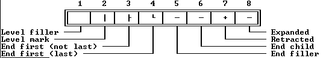

 To have the children line drop off prior to the text instead of underneath, use the following call:

 
```c
 createGraph(level, lines, flags, 2, 4, ' '#179#195#192#196#194'+'#196);
```

---

<a id="TOutlineViewer_draw"></a>

### TOutlineViewer::draw

*Keywords: draw*

[See Also](#4SC5_P0)	 [TOutlineViewer class](#TOutlineViewer)
#### Syntax
```c
virtual void draw();
```
#### Description
 Called to draw the outline view. Essentially,  drawcalls  getGraphto get the graphical part of the outline, then appends the string returned from  getText.

 The line containing the focused node in the outline displays in a distinct color. Nodes whose child nodes are not displayed are highlighted.

---

<a id="4SC5_P0"></a>

#### See Also
 [TOutlineViewer::getGraph](#81C8RE)

 [TOutlineViewer::GetText](#_4BCG9)

---

<a id="_93EDD"></a>

### TOutlineViewer::expandAll

*Keywords: expandAll*

[See Also](#4APN7IP)	 [TOutlineViewer class](#TOutlineViewer)
#### Syntax
```c
void expandAll(TNode* node);
```
#### Description
 If * nodehas child nodes,  expandAllrecursively expands * nodeby calling  adjustwith the * expandparameter * True, then expands all its child nodes by calling  expandAllfor each of them.

---

<a id="4APN7IP"></a>

#### See Also
 [TOutlineViewer::adjust](#19196UK)

---

<a id="1AGSDZH"></a>

### TOutlineViewer::firstThat

*Keywords: firstThat*

[TOutlineViewer class](#TOutlineViewer)
#### Syntax
```c
TNode* firstThat( Boolean (*test) (TOutlineViewer*, TNode* cur, int level, int position, long lines, ushort flags) );
```
#### Description
 firstThatiterates over the nodes of the outline, calling the function pointed to by * Testuntil * Testreturns * True.

 The parameters are as follows:

| * cur | A pointer to the node being checked. |
| --- | --- |
| * level | The level of the node (how many nodes are above it), zero-based. This can be used in a call to either  getGraphor  createGraph. |
| * position | The display order position of the node in the list. This can be used in a call to  focusedor  selected. If in range, * position- * delta.Yis the location at which the node is displayed on the view. |
| * lines | Bits indicating the active levels. This can be used in a call to  getGraphor  createGraph. It dictates which horizontal lines need to be drawn. |
| * flags | Various flags for drawing (see * ovXXXXflags). Can be used in a call to  getGraphor  createGraph. |

---

<a id="8WOPK9"></a>

### TOutlineViewer::focused

*Keywords: focused*

[TOutlineViewer class](#TOutlineViewer)
#### Syntax
```c
virtual void focused(int i);
```
#### Description
 Called whenever a node receives focus. The * iparameter indicates the position of the newly focused node in the outline. By default, * focusedjust sets * focto * i.

---

<a id="1HMW_M2"></a>

### TOutlineViewer::forEach

*Keywords: forEach*

[TOutlineViewer class](#TOutlineViewer)
#### Syntax
```c
TNode* forEach(Boolean (*action)(TOutlineViewer*, TNode* cur, int level, int position, long lines, ushort flags) );
```
#### Description
 Iterates over all the nodes. * actionpoints to a function that * forEachcalls for each node in the outline.

 The parameters are as follows:

| * cur | A pointer to the node being checked. |
| --- | --- |
| * level | The level of the node (how many nodes are above it), zero-based. This can be used in a call to either  getGraphor  createGraph. |
| * position | The display order position of the node in the list. This can be used in a call to  focusedor  selected. If in range, * position- * Delta.Yis location the node is displayed on the view. |
| * lines | Bits indicating the active levels. This can be used in a call to  getGraphor  createGraph. It dictates which horizontal lines need to be drawn. |
| * flags | Various flags for drawing (see * ovXXXXflags). Can be used in a call to  getGraphor  createGraph. |

---

<a id="6.UO.IP"></a>

### TOutlineViewer::getChild

*Keywords: getChild*

[See Also](#4ON2_ZH)	 [TOutlineViewer class](#TOutlineViewer)
#### Syntax
```c
virtual TNode* getChild(TNode* node, int i) = 0;
```
#### Description
 getChildis an pure virtual function that descendant outline viewer types must override to return a pointer to the * ith child of the given * node.

 If  hasChildrenreturns * False, indicating that * nodehas no child nodes,  getChildwill not be called for that node. You can safely assume that when an outline viewer calls  getChild, the given node has at least * ichild nodes.

---

<a id="4ON2_ZH"></a>

#### See Also
 [TOutlineViewer::hasChildren](#22YS58E)

---

<a id="81C8RE"></a>

### TOutlineViewer::getGraph

*Keywords: getGraph*

[TOutlineViewer class](#TOutlineViewer)
#### Syntax
```c
virtual char* getGraph(int level, long lines, ushort flags);
```
#### Description
 Returns a string of graphics characters to display to the left of the text returned by  getText. By default,  getGraphcalls  createGraphwith the default character values. You only need to override  getGraphif you want to change the appearance of the outline.

 For example, instead of calling  createGraphto show the hierarchy, you might return a string of characters to merely indent the text by a given amount for each level.

---

<a id="536__E6"></a>

### TOutlineViewer::ggetNumChildren

*Keywords: ggetNumChildren*

[See Also](#5CJLWY)	 [TOutlineViewer class](#TOutlineViewer)
#### Syntax
```c
virtual int getNumChildren(TNode* node) = 0;
```
#### Description
 getNumChildrenis a pure virtual member function that descendant outline viewer types must override to return the number of child nodes in * node. If  hasChildrenreturns * Falsefor * node,  getNumChildrenwill never be called.

---

<a id="5CJLWY"></a>

#### See Also
 [TOutlineViewer::hasChildren](#22YS58E)

---

<a id="_4.M2U"></a>

### TOutlineViewer::getNode

*Keywords: getNode*

[TOutlineViewer class](#TOutlineViewer)
#### Syntax
```c
virtual TNode* getNode(int i);
```
#### Description
 Returns a pointer to the * ith node in the outline; that is, the node shown * ilines from the top of the complete outline.

---

<a id="31._LK"></a>

### TOutlineViewer::getPalette

*Keywords: getpalette*

[TOutlineViewer class](#TOutlineViewer)
#### Syntax
```c
virtual TPalette& getPalette() const;
```
#### Description
 Returns a reference to the default outline palette, * COutlineViewer.

---

<a id="Z_LLUI"></a>

### TOutlineViewer::getRoot

*Keywords: getRoot*

[TOutlineViewer class](#TOutlineViewer)
#### Syntax
```c
virtual TNode* getRoot() = 0;
```
#### Description
 getRootis a pure virtual member function that descendant outline viewer types must override to return a pointer to the root node of the outline.

---

<a id="_4BCG9"></a>

### TOutlineViewer::getText

*Keywords: getText*

[TOutlineViewer class](#TOutlineViewer)
#### Syntax
```c
virtual char* getText(TNode* node) = 0;
```
#### Description
 getTextis an pure virtual function that descendant outline viewer types must override to return the text of * node.

---

<a id="6E467W"></a>

### TOutlineViewer::handleEvent

*Keywords: handleEvent*

[TOutlineViewer class](#TOutlineViewer)
#### Syntax
```c
virtual void handleEvent(TEvent& event);
```
#### Description
 Handles most events for the outline viewer by calling the  handleEventmember function inherited from  TScroller, then handles certain mouse and keyboard events.

---

<a id="22YS58E"></a>

### TOutlineViewer::hasChildren

*Keywords: hasChildren*

[TOutlineViewer class](#TOutlineViewer)
#### Syntax
```c
virtual Boolean hasChildren(TNode* node) = 0;
```
#### Description
 hasChildrenis a pure virtual member function that descendant outline viewers must override to return * Trueif the given * nodehas child nodes and * Falseif * nodehas no child nodes.

 If  hasChildrenreturns * Falsefor a particular node, the following functions are never called for that node:  adjust,  expandAll,  getChild,  getNumChildren, and  isExpanded.

 Those member functions can assume that if they are called, there are child nodes for them to act on.

---

<a id="5CNT2Z"></a>

### TOutlineViewer::isExpanded

*Keywords: isExpanded*

[TOutlineViewer class](#TOutlineViewer)
#### Syntax
```c
virtual Boolean isExpanded(TNode* node) = 0;
```
#### Description
 isExpandedis an pure virtual function that descendant outline viewer types must override to return * Trueif * node's child nodes should be displayed. If  hasChildrenreturns * Falsefor * node,  isExpandedwill never be called for that node.

---

<a id="3A0_NO"></a>

### TOutlineViewer::isSelected

*Keywords: isSelected*

[TOutlineViewer class](#TOutlineViewer)
#### Syntax
```c
virtual Boolean isSelected(int i);
```
#### Description
 Returns * Trueif * nodeis selected. By default,  TOutlineViewerassumes a single-selection outline, so it returns * Trueif * nodeis * Focused. You can override  isSelectedto handle multiple selections.

---

<a id="_8DMZZ"></a>

### TOutlineViewer::selected

*Keywords: selected*

[TOutlineViewer class](#TOutlineViewer)
#### Syntax
```c
virtual void selected(int i);
```
#### Description
 Called whenever a node is selected by the user, either by keyboard control or by the mouse. The * iparameter indicates the position in the outline of the newly selected node.

 By default,  selecteddoes nothing; descendant types can override  selectedto perform some action in response to selection.

---

<a id="1TYB0BP"></a>

### TOutlineViewer::setState

*Keywords: setstate*

[See Also](#31W_W8)	 [TOutlineViewer class](#TOutlineViewer)
#### Syntax
```c
virtual void setState(ushort aState, Boolean enable);
```
#### Description
 Sets or clears the * AStatestate flags for the view by calling the  setStatemember function inherited from  TScroller. If the new state includes a focus change,  setStatecalls  drawViewto redraw the outline.

---

<a id="31W_W8"></a>

#### See Also
 [TScroller::setState](#1F03DD.)

---

<a id="_UENRG"></a>

### TOutlineViewer::update

*Keywords: update*

[TOutlineViewer class](#TOutlineViewer)
#### Syntax
```c
void update();
```
#### Description
 Updates the limits of the outline viewer. The limit in the vertical direction is number of nodes in the outline. The limit in the horizontal direction is the length of the longest displayed line.

 Your program should call  updatewhenever the data in the outline changes.  TOutlineViewerassumes that the outline is empty, so if the outline becomes non-empty during initialization, you must explicitly call  update. Also, if during the operation of the outline viewer the data being displayed change, you must call  updateand the inherited  drawView.

---

<a id="TPalette"></a>

### TPalette Class

*Keywords: TPalette*

[Inheritance](#TVFlow_1)
#### Header File
 views.h
#### Description
 TPaletteis a simple class used to create and manipulate palette arrays without bothering you with their internal structure. Although palettes are arrays of  char, and are often referred to as strings, they are not the conventional null-terminated strings found in C. In fact, there may well be a 0-byte within a palette. Because of this, normal C string functions cannot be used. The first byte of a palette string holds its length (not counting the first byte itself). Each basic view has a default palette that determines (by indexing into its owner's palette) the usual colors assigned to the various parts of a view, such as scroll bars, frames, buttons, text, and so on.

 Constructors

 
```c
TPalette
```

```c
Y6OIPZ( const char *d, ushort len );

  TPalette
```

```c
Y6OIPZ( const TPalette& tp );

 ~ TPalette
```

```c
Y6OIPZ();
```
#### Data Members
```c
char * data
```

```c
TPalette_data;
```
#### Member Functions
```c
TPalette&  operator =
```

```c
ERBMG5( const TPalette& tp );

 char&  operator[]
```

```c
VCJBE5( int index );
```

---

<a id="Y6OIPZ"></a>

### TPalette::TPalette

*Keywords: TPalette::TPalette*

#### Syntax
```c
TPalette( const char *d, ushort len );

 TPalette( const TPalette& tp );
```
 The first form creates a  TPaletteobject with string * dand length * len. The private member * datais set with * lenin its first byte, followed by the array * d. The second form creates a new palette by copying the palette * tp.

 Destructor

 
```c
~TPalette();
```
 Destroys the palette.

---

<a id="TPalette_data"></a>

### TPalette::data

*Keywords: data*

[TPalette class](#TPalette)
#### Syntax
```c
char *data;
```
#### Description
 The palette data is pointed to by this data member.

---

<a id="ERBMG5"></a>

### TPalette::operator =

*Keywords: operator =*

[TPalette class](#TPalette)
#### Syntax
```c
TPalette& operator = ( const TPalette& tp );
```
#### Description
 The code p = tp; copies the palette * tpto the palette * p.

---

<a id="VCJBE5"></a>

### TPalette::operator []

*Keywords: operator []*

[TPalette class](#TPalette)
#### Syntax
```c
char& operator[] ( int index );
```
#### Description
 The subscripting operator returns the character at the * index'th position.

---

<a id="TParamText"></a>

### TParamText Class

*Keywords: TParamText*

[Inheritance](#TVFlow_2)
#### Header File
 dialogs.h
#### Description
 TParamTextis derived from  TStaticText. It uses parameterized text strings for formatted output using the  stdiofunction  vsprintf.

 Constructor

 
```c
TParamText
```

```c
XCP_I0(const TRect& bounds );

  TParamText
```

```c
XCP_I0( StreamableInit streamableInit);

 ~ TParamText
```

```c
XCP_I0();
```
#### Data Members
```c
char * str
```

```c
TParamText_str;   //protected
```
#### Member Functions
```c
static TStreamable * build
```

```c
TParamText_build();

 virtual void  getText
```

```c
2.MWT8P(char *s);

 virtual int  getTextLen
```

```c
1IXSS2O();

 virtual void  setText
```

```c
1732QX( char *fmt, ... );
```
 Palette

 TParamTextobjects use the default palette * cpStaticTextto map onto the sixth entry in the standard dialog palette.

 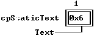

---

<a id="XCP_I0"></a>

### TParamText::TParamText

*Keywords: TParamText::TParamText*

[See Also](#ZIDGWK)	 [TParamText class](#TParamText)

 Form 1

 
```c
TParamText(const TRect& bounds);
```
 Form 2

 
```c
TParamText( StreamableInit streamableInit);   //protected
```
#### Description
 Form 1:Sets up the bounding rectangle and initializes * strto point to a dynamic buffer 256 characters long.

  Form 2:Each streamable class needs a "builder" to allocate the correct memory for its objects together with the initialized vtable pointers. This is achieved by calling this constructor with an argument of type  StreamableInit.

 Destructor

 
```c
~TParamText();
```
 The destructor calls  operator deleteto release memory previously allocated for * str.

---

<a id="ZIDGWK"></a>

#### See Also
 [TStaticText::TStaticText](#5MT6_PV)

---

<a id="TParamText_str"></a>

### TParamText::str

*Keywords: str*

[TParamText class](#TParamText)
#### Syntax
```c
char *str;   //protected
```
#### Description
 Pointer to character buffer in which the complete string is stored.

---

<a id="TParamText_build"></a>

### TParamText::build

*Keywords: build*

[See Also](#1VMLGPY)	 [TParamText class](#TParamText)
#### Syntax
```c
static TStreamable *build();
```
#### Description
 Called to create an object in certain stream-reading situations.

---

<a id="1VMLGPY"></a>

#### See Also
 [TStreamableClass](#TStreamableClass)

 [ipstream::readData](#3MVS.PE)

---

<a id="2.MWT8P"></a>

### TParamText::getText

*Keywords: getText*

[TParamText class](#TParamText)
#### Syntax
```c
virtual void getText(char *s);
```
#### Description
 Copies * strinto * s. You must be sure that * sis large enough to allow this copy process.

---

<a id="1IXSS2O"></a>

### TParamText::getTextLen

*Keywords: getTextLen*

[TParamText class](#TParamText)
#### Syntax
```c
virtual int getTextLen();
```
#### Description
 Returns the length of the string. This is useful for getting the right amount of space to call  getTextsafely.

---

<a id="1732QX"></a>

### TParamText::setText

*Keywords: setText*

[TParamText class](#TParamText)
#### Syntax
```c
virtual void setText( char *fmt, ... );
```
#### Description
 Initializes the string displayed by this view. * fmtis a standard  printfstyle format string.  setTextalso accepts a variable number of arguments. The runtime library function  vsprintfis used to format the string and store it in * str.

---

<a id="TPoint"></a>

### TPoint Class

*Keywords: TPoint*

[Inheritance](#TVFlow_1)
#### Header File
 objects.h
#### Description
 TPointis a class implementing points on the screen with several overloaded operators for point manipulation.
#### Data Members
```c
int  x
```

```c
TPoint_X;

 int  y
```

```c
TPoint_Y;
```
#### Member Functions
```c
TPoint&  operator+=
```

```c
JENU48(const TPoint& adder);

 TPoint&  operator-=
```

```c
1GN_E1O(const TPoint& subber);
```
 Friends

 
```c
friend TPoint&  operator-
```

```c
1459YH5(const TPoint& one, const TPoint& two);

 friend TPoint&  operator+
```

```c
1LPK_11(const TPoint& one, const TPoint& two);

 friend int  operator==
```

```c
VJL0RO(const TPoint& one, const TPoint& two);

 friend int  operator!=
```

```c
2ERC.RB(const TPoint& one, const TPoint& two);
```

---

<a id="TPoint_X"></a>

### TPoint::x

*Keywords: x*

[TPoint class](#TPoint)
#### Syntax
```c
int x;
```
#### Description
 x is the screen column of the point.

---

<a id="TPoint_Y"></a>

### TPoint::y

*Keywords: y*

[TPoint class](#TPoint)
#### Syntax
```c
int y;
```
#### Description
 y is the screen row of the point.

---

<a id="JENU48"></a>

### TPoint::operator +=

*Keywords: operator +=*

[TPoint class](#TPoint)
#### Syntax
```c
TPoint& operator+=(const TPoint& adder);
```
#### Description
 Increments x by adder.x, and y by adder.y. Returns *this.

---

<a id="1GN_E1O"></a>

### TPoint::operator -=

*Keywords: operator -=*

[TPoint class](#TPoint)
#### Syntax
```c
TPoint& operator-=(const TPoint& subber);
```
#### Description
 Decrements x by adder.x, and y by adder.y. Returns *this.

---

<a id="1459YH5"></a>

### TPoint::operator -

*Keywords: operator -*

[TPoint class](#TPoint)
#### Syntax
```c
friend TPoint& operator-(const TPoint& one, const TPoint& two);
```
#### Description
 Subtracts coordinate two from coordinate one. Sets x to (one.x - two.x) and sets y to (one.y - two.y). The arguments one and two are unchanged. Returns *this.

---

<a id="1LPK_11"></a>

### TPoint::operator +

*Keywords: operator +*

[TPoint class](#TPoint)
#### Syntax
```c
friend TPoint& operator+(const TPoint& one, const TPoint& two);
```
#### Description
 Adds coordinate two to coordinate one. Sets x to (one.x | two.x) and sets y to (one.y | two.y). The arguments one and two are unchanged. Returns *this.

---

<a id="VJL0RO"></a>

### TPoint::operator ==

*Keywords: operator ==*

[TPoint class](#TPoint)
#### Syntax
```c
friend int operator==(const TPoint& one, const TPoint& two);
```
#### Description
 Returns true (nonzero) if the points one and two are identical (that is, if one.x == two.x && one.y == two.y). Otherwise, false (0) is returned.

---

<a id="2ERC.RB"></a>

### TPoint::operator !=

*Keywords: operator !=*

[TPoint class](#TPoint)
#### Syntax
```c
friend int operator!=(const TPoint& one, const TPoint& two);
```
#### Description
 Returns true (nonzero) if the points one and two are different (that is, if one.x != two.x || one.y != two.y). Otherwise, false (0) is returned.

---

<a id="TPReadObjects"></a>

### TPReadObjects Class

*Keywords: TPReadObjects*

[Inheritance](#TVFlow_1)
#### Header File
 tobjstrm.h
#### Description
 TPReadObjects(together with  TPWrittenObjects) solves the problem of spurious duplications when writing and reading objects to and from streams via pointers. This class maintains a database of all objects that have been read from the current object stream. This is used by  ipstreamwhen it reads a pointer from a stream to determine if other addresses for that objects exist. With this mechanism, if * ptr1and * ptr2point to the same streamable object and you write both pointers to a  opstream, only one copy of the object is saved. When you read back from the stream, only one copy of ptr1is created, and both * ptr1and * ptr2will still point to it.

 Constructors

 
```c
TPReadObjects
```

```c
G6QM37();

 ~ TPReadObjects
```

```c
G6QM37();  // private
```
#### Member Functions
```c
void  removeAll
```

```c
P.YWRF();
```
 Friends

 The class  ipstreamis a friend of  TPReadObjects, so all its member functions can access the private members of  TPReadObjects.

---

<a id="G6QM37"></a>

### TPReadObjects::TPReadObjects

*Keywords: TPReadObjects::TPReadObjects*

[See Also](#1IC0UR)	 [TPReadObjects class](#TPReadObjects)
#### Syntax
```c
TPReadObjects();  //private
```
#### Description
 This private constructor creates a nonstreamable collection by calling the base  TNSSortedCollectionconstructor. It is accessible only by member functions and friends.

 Destructor

 
```c
~TPReadObjects();  // private
```
#### Description
 Sets the collection * limitto 0 without destroying the collection (since the * shouldDeletedata member is set to * False).

---

<a id="1IC0UR"></a>

#### See Also
 [TNSCollection::~TNSCollection](#2YCTTE)

 [TNSCollection::shouldDelete](#2FRTRH8)

 [TNSSortedCollection::TNSSortedCollection](#1I.KOCF)

---

<a id="P.YWRF"></a>

### TPReadObjects::removeAll

*Keywords: removeAll*

[TPReadObjects class](#TPReadObjects)
#### Syntax
```c
void removeAll();
```
#### Description
 Used internally by  TPReadObjects. This function removes all the items in the  TPReadObjectscollection.

---

<a id="TProgInit"></a>

### TProgInit Class

*Keywords: TProgInit*

[Inheritance](#TVFlow_1)
#### Header File
 app.h
#### Description
 TProgInitis a virtual base class for  TProgram. The  TProgramconstructor calls the  TProgInitbase constructor, passing to it the addresses of three initialization functions that create your status line, menu bar, and desktop. See the entries for the  TProgramand  TApplicationconstructors.

 Constructor

 
```c
TProgInit
```

```c
189B._H( TStatusLine *(*cStatusLine)( TRect r ), TMenuBar *(*cMenuBar)( TRect r ), TDeskTop *(*cDeskTop )(
```
#### Member Functions
```c
TDeskTop *(* createDeskTop
```

```c
19FZ4VW)( TRect r );

 TMenuBar *(* createMenuBar
```

```c
NA.SYP)( TRect r );

 TStatusLine *(* createStatusLine
```

```c
16VXLVB)( TRect r );
```

---

<a id="189B._H"></a>

### TProgInit::TProgInit

*Keywords: TProgInit::TProgInit*

#### Syntax
```c
TProgInit( TStatusLine *(*cStatusLine)( TRect r ), TMenuBar *(*cMenuBar)( TRect r ), TDeskTop *(*cDeskTop )( TRect r ) );
```
#### Description
 The  TProgInitconstructor creates a status line menu bar desktop. See [TProgram](#TProgram) for additional details.

---

<a id="19FZ4VW"></a>

### TProgInit::createDeskTop

*Keywords: createDeskTop*

[See Also](#GDJWFZ)	 [TProgInit class](#TProgInit)
#### Syntax
```c
TDeskTop *(*createDeskTop)( TRect r );   //protected
```
#### Description
 Creates the desktop with the given size.

---

<a id="GDJWFZ"></a>

#### See Also
 [TApplication::TApplication](#2B4J0.5)

---

<a id="NA.SYP"></a>

### TProgInit::createMenuBar

*Keywords: createMenuBar*

[See Also](#4O8KXVN)	 [TProgInit class](#TProgInit)
#### Syntax
```c
TMenuBar *(*createMenuBar)( TRect r );   // protected
```
#### Description
 Creates the menu bar with the given size.

---

<a id="4O8KXVN"></a>

#### See Also
 [TApplication::TApplication](#2B4J0.5)

---

<a id="16VXLVB"></a>

### TProgInit::createStatusLine

*Keywords: createStatusLine*

[See Also](#7L565A)	 [TProgInit class](#TProgInit)
#### Syntax
```c
TStatusLine *(*createStatusLine)( TRect r );   // protected
```
#### Description
 Creates the status line with the given size.

---

<a id="7L565A"></a>

#### See Also
 [TApplication::TApplication](#2B4J0.5)

---

<a id="TProgram"></a>

### TProgram Class

*Keywords: TProgram*

[Inheritance](#TVFlow_1)
#### Header File
 app.h
#### Description
 TProgramprovides the basic template for all standard Turbo Vision applications. All such programs must be derived from  TProgramor its immediate derived class,  TApplication.  TApplicationdiffers from  TProgramonly in its default constructor and destructor. Both classes are provided for added flexibility when designing nonstandard applications. For most Turbo Vision work, your program will be derived from  TApplication.

  TProgramis derived from  TGroupsince it needs to contain (own) your  TDeskTop,  TStatusLine, and  TMenuBarobjects.

 Constructor

 
```c
TProgram
```

```c
1MMNQ8M();

 virtual ~ TProgram
```

```c
1MMNQ8M();
```
#### Data Members
```c
static TProgram * application
```

```c
FLJ76Z;

 static int  appPalette
```

```c
ICFCIE;

 static TDeskTop * deskTop
```

```c
3V.PPD;

 static TMenuBar * menuBar
```

```c
X87CW2;

 static TEvent  pending
```

```c
19_LM1_;

 static TStatusLine * statusLine
```

```c
JX0BMZ;
```
#### Member Functions
```c
virtual Boolean  canMoveFocus
```

```c
12YI.RC();

 virtual ushort  executeDialog
```

```c
34Y76H5( TDialog *dialog, void *data );

 virtual  getEvent
```

```c
B3BIC.(TEvent& event);

 virtual TPalette&  getPalette
```

```c
DL3IV0() const;

 virtual  handleEvent
```

```c
4M5KL0(TEvent& event);

 virtual void  idle
```

```c
TProgram_idle();

 static TDeskTop * initDeskTop
```

```c
2N04JNI(TRect);

 static TMenuBar * initMenuBar
```

```c
3GFZ_U7(TRect);

 virtual void  initScreen
```

```c
V1M_XZ();

 static TStatusLine * initStatusLine
```

```c
H0GVHJ(TRect);

 virtual TWindow * insertWindow
```

```c
0GMK94( TWindow *window );

 virtual void  outOfMemory
```

```c
2BLT_NN();

 virtual void  putEvent
```

```c
F53V5K(TEvent& event);

 virtual void  resume
```

```c
7.OON3();

 virtual void  run
```

```c
TProgram_run();

 void  setScreenMode
```

```c
42WO4C_(ushort mode);

 virtual void  shutDown
```

```c
1NZGWDJ();

 virtual void  suspend
```

```c
1UHSJTP();

 TView * validView
```

```c
0YR55K(TView *p);
```
 Palettes

 The palette for an application object controls the final color mappings for all views in the application. All other palette mappings eventually result in the selection of an entry in the application's palette, which provides text attributes.
#### Description
 The first entry is used by  TBackgroundfor the background color. Entries 2 through 7 are used by both menu views and status lines.

 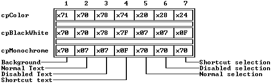

 Entries 8 through 15 are used by blue windows (text windows, by default).

 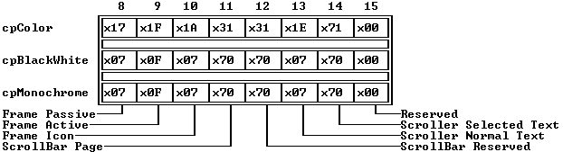

 Entries 16 through 23 are used by cyan windows (messages, by default).

 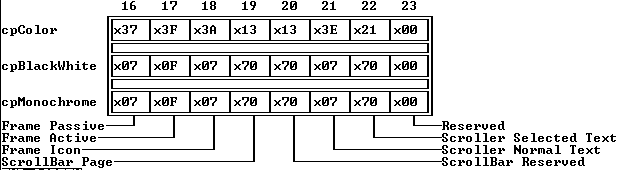

 Entries 24 through 31 are used by gray windows (dialog boxes, by default).

 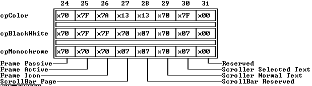

 Entries 32 through 63 are used by dialog box objects. See TDialog for individual entries.

 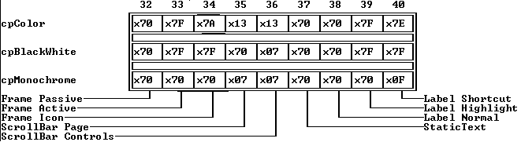

 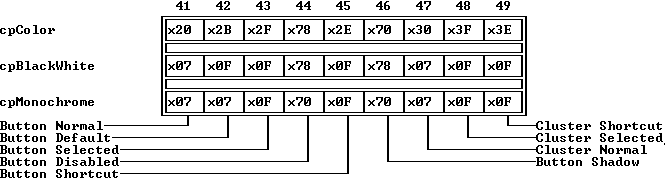

 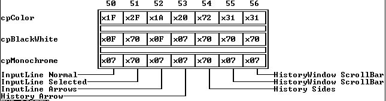

 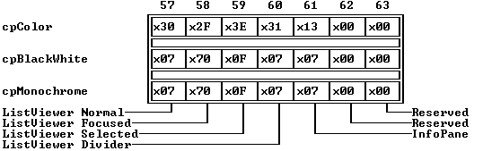

---

<a id="1MMNQ8M"></a>

### TProgram::TProgram

*Keywords: TProgram::TProgram*

[See Also](#10D_LRF)
#### Syntax
```c
TProgram();
```
#### Description
 The  TProgramconstructor calls the  TProgInitbase constructor passing to it the addresses of three init functions:

 
```c
 TProgram::TProgram() :

     TProgInit( &TProgram::initStatusLine

 &TProgram::initMenuBar

 &TProgram::initDeskTop

 ),

   .

   .

   .
```
 The  TProgInitconstructor creates a status line menu bar desktop:

 
```c
 TProgInit::TProgInit( TStatusLine *(*cStatusLine)( TRect )

 TMenuBar *(*cMenuBar)( TRect )

 TDeskTop *(*cDeskTop )( TRect )

                      ) :

     createStatusLine( cStatusLine ),

     createMenuBar( cMenuBar ),

     createDeskTop( cDeskTop )

   .

   .

   .
```
 If these calls are successful the three objects are inserted into the TProgram groupThe static member pointers * statusLine, menuBar, deskTop, application( =  this) are set to point at these new objectsThe  TGroupconstructor is also invoked to create a full screen view; the video buffer default palettes are initialized; the following state flags are set:

 
```c
 state = sfVisible | sfSelected | sfFocused | sfModal | sfExposed;
```
 Destructor

 
```c
virtual ~TProgram();
```
 Sets the application static member to 0.

---

<a id="10D_LRF"></a>

#### See Also
 [TProgInit](#TProgInit)

 [TGroup::TGroup](#1HLH_Q.)

---

<a id="FLJ76Z"></a>

### TProgram::application

*Keywords: application*

[See Also](#9GE9WM)	 [TProgram class](#TProgram)
#### Syntax
```c
static TProgram *application;
```
#### Description
 A pointer to the current application, set to  thisby the  TProgInitconstructor.

---

<a id="9GE9WM"></a>

#### See Also
 [TProgInit class](#TProgInit)

---

<a id="ICFCIE"></a>

### TProgram::appPalette

*Keywords: appPalette*

[TProgram class](#TProgram)
#### Syntax
```c
static int appPalette;
```
#### Description
 Indexes the default palette for this application as set by  initScreen. The  TPaletteobject corresponding to * appPaletteis returned by  TProgram::getPalette.

---

<a id="3V.PPD"></a>

### TProgram::deskTop

*Keywords: deskTop*

[See Also](#1NWWX2O)	 [TProgram class](#TProgram)
#### Syntax
```c
static TDeskTop *deskTop;
```
#### Description
 A pointer to the current desktop object, set by a call to  createDeskTopin the  TProgramconstructor. The resulting desktop is inserted into the  TProgramgroup.

---

<a id="1NWWX2O"></a>

#### See Also
 [TProgInit::createDeskTop](#19FZ4VW)

 [TProgram::initDeskTop](#2N04JNI)

---

<a id="X87CW2"></a>

### TProgram::menuBar

*Keywords: menuBar*

[See Also](#CWO23D)	 [TProgram class](#TProgram)
#### Syntax
```c
static TMenuBar *menuBar;
```
#### Description
 A pointer to the current menu bar object, set by a call to  createMenuBarin the  TProgramconstructor. The resulting menu bar is inserted into the  TProgramgroup.

---

<a id="CWO23D"></a>

#### See Also
 [TProgInit::createMenuBar](#NA.SYP)

 [TProgram::initMenuBar](#3GFZ_U7)

---

<a id="19_LM1_"></a>

### TProgram::pending

*Keywords: pending*

[TProgram class](#TProgram)
#### Syntax
```c
static TEvent pending;   //protected
```
#### Description
 This event is modified by the  putEventmember function. It essentially implements a single event queue in which you can place events.

---

<a id="JX0BMZ"></a>

### TProgram::statusLine

*Keywords: statusLine*

[See Also](#Z2GFD5)	 [TProgram class](#TProgram)
#### Syntax
```c
static TStatusLine *statusLine;
```
#### Description
 A pointer to the current status line object, set by a call to  createStatusLinein the  TProgramconstructor. The resulting status line is inserted into the  TProgramgroup.

---

<a id="Z2GFD5"></a>

#### See Also
 [TProgInit::createStatusLine](#16VXLVB)

 [TProgram::initStatusLine](#H0GVHJ)

---

<a id="12YI.RC"></a>

### TProgram::canMoveFocus

*Keywords: canMoveFocus*

[TProgram class](#TProgram)
#### Syntax
```c
virtual Boolean canMoveFocus();
```
#### Description
 canMoveFocusreturns * Trueif the desktop can safely change its selected window. It determines this by calling the active windows  validfunction with the command * cmReleasedFocus. If the window holds invalid data that would possibly not get validated if the focus changed, its  validfunction should return * False, causing  canMoveFocusto also return * False. This prevents the window from losing focus.

---

<a id="34Y76H5"></a>

### TProgram::executeDialog

*Keywords: executeDialog*

[TProgram class](#TProgram)
#### Syntax
```c
virtual ushort executeDialog( TDialog *dialog, void *data );
```
#### Description
 The  executeDialogfunction calls  validViewto ensure that * dialogis a valid dialog box, then executes the dialog in the desktop. When the user closes the dialog box,  executeDialogdisposes of the dialog box and returns the command that ended the modal state, as returned by  execView. If  validViewreturns NULL, meaning the dialog box was not valid,  executeDialogreturns * cmCancel.

 If * datais not NULL,  executeDialogautomatically handles the setting and reading of the dialog box's controls  using * dataas the record. If you do not cancel the dialog box,  executeDialogcalls  getDatato read the new values of the dialog box's controls before disposing of the dialog box.

 You should call your application object's  executeDialogmember function rather than calling  execViewdirectly.  executeDialogis a much more convenient way to handle setting and reading of control values and also has built-in validity checks.

---

<a id="B3BIC."></a>

### TProgram::getEvent

*Keywords: getEvent*

[See Also](#1GU7QW4)	 [TProgram class](#TProgram)
#### Syntax
```c
virtual getEvent(TEvent& event);
```
#### Description
 The default  TView::getEventsimply calls its owner's  getEvent, and since a  TProgram(or  TApplication) object is the ultimate owner of every view, every  getEventcall ends up in  TProgram::getEvent (unless some view along the way has overridden  getEvent).

  TProgram::getEventfirst checks if  TProgram::putEventhas generated a pending event (in the static  TEventmember * pending); if so,  getEventreturns that event. If there is no pending event,  getEventcalls  getMouseEvent; if that returns * evNothing, it then calls  getKeyEvent. If both return * evNothing, indicating that no user input is available,  getEventcalls  TProgram::idleto allow "background" tasks to be performed while the application is waiting for user input. Before returning,  getEvent passes any * evKeyDownand * evMouseDownevents to the  statusLinefor it to map into associated * evCommandhot key events.

---

<a id="1GU7QW4"></a>

#### See Also
 [TProgram::putEvent](#F53V5K)

---

<a id="DL3IV0"></a>

### TProgram::getPalette

*Keywords: getpalette*

[See Also](#CUP5DL)	 [TProgram class](#TProgram)
#### Syntax
```c
virtual TPalette& getPalette() const;
```
#### Description
 Returns the palette string given by the palette index in the * appPalettestatic data member.  TProgramsupports three palettes, * apColor, * apBlackWhite, and * apMonochrome. * appPaletteis initialized by  TProgram::initScreen.

---

<a id="CUP5DL"></a>

#### See Also
 [TProgram::initScreen](#V1M_XZ)

 [TProgram::AppPalette](#ICFCIE)

---

<a id="4M5KL0"></a>

### TProgram::handleEvent

*Keywords: handleEvent*

[See Also](#_THG.X)	 [TProgram class](#TProgram)
#### Syntax
```c
virtual handleEvent(TEvent& event);
```
#### Description
 Handles Alt-1 through Alt-9 keyboard events by generating an * evBroadcastevent with a * commandvalue of * cmSelectWindowNumand an * infoIntvalue of 1 to 9.  TWindow::handleEventreacts to such broadcasts by selecting the window if it has the given number.

 Handles an * evCommandevent with a * commandvalue of * cmQuitby calling  endModal(* cmQuit), which in effect terminates the application.

  TProgram::handleEventis almost always overridden to introduce handling of commands that are specific to your own application.

---

<a id="_THG.X"></a>

#### See Also
 [TGroup::handleEvent](#29EKHW)

---

<a id="TProgram_idle"></a>

### TProgram::idle

*Keywords: idle*

[TProgram class](#TProgram)
#### Syntax
```c
virtual void idle();
```
#### Description
 idleis called by  TProgram::getEventwhenever the event queue is empty, allowing the application to perform background tasks while waiting for user input.

 The default  TProgram::idlecalls * statusLine->updateto allow the status line to update itself according to the current help context. Then, if the command set has changed since the last call to  TProgram::idle, an * evBroadcastwith a * commandvalue of * cmCommandSetChangedis generated to allow views that depend on the command set to enable or disable themselves.

 If you override  idle,always make sure to call the inherited  idle. Also, make sure that any tasks performed by your  idledo not suspend the application for any noticeable length of time, since this would block user input and give an unresponsive feel to the application.

---

<a id="2N04JNI"></a>

### TProgram::initDeskTop

*Keywords: initDeskTop*

[See Also](#D582G4)	 [TProgram class](#TProgram)
#### Syntax
```c
static TDeskTop *initDeskTop(TRect);
```
#### Description
 The address of this function is passed to the  TProgInitconstructor, which creates a  TDeskTopobject for the application and stores a pointer to it in the * deskTopglobal variable.  initDeskTopshould never be called directly.  initDeskTopis almost always overridden to instantiate a user-defined  TDeskTop instead of the default empty  TDeskTop.

---

<a id="D582G4"></a>

#### See Also
 [TProgram::TProgram](#1MMNQ8M)

 [TDeskTop](#TDeskTop)

---

<a id="3GFZ_U7"></a>

### TProgram::initMenuBar

*Keywords: initMenuBar*

[See Also](#HGG6KI)	 [TProgram class](#TProgram)
#### Syntax
```c
static TMenuBar *initMenuBar(TRect);
```
#### Description
 The address of this function is passed to the  TProgInitconstructor, which creates a  TMenuBarobject for the application and stores a pointer to it in the * menuBarstatic member.  initMenuBarshould never be called directly.  initMenuBaris almost always overridden to instantiate a user-defined  TMenuBar instead of the default empty  TMenuBar.

---

<a id="HGG6KI"></a>

#### See Also
 [TProgram::TProgram](#1MMNQ8M)

 [TMenuBar](#TMenuBar)

---

<a id="V1M_XZ"></a>

### TProgram::initScreen

*Keywords: initScreen*

[See Also](#D4_0QR)	 [TProgram class](#TProgram)
#### Syntax
```c
virtual void initScreen();
```
#### Description
 Called by  TProgram::TProgramand  TProgram::setScreenModeevery time the screen mode is initialized or changed. This is the member function that actually performs the updating and adjustment of screen mode-dependent variables for shadow size, markers, and application palette.

---

<a id="D4_0QR"></a>

#### See Also
 [TProgram::TProgram](#1MMNQ8M)

 [TProgram::setScreenMode](#42WO4C_)

---

<a id="H0GVHJ"></a>

### TProgram::initStatusLine

*Keywords: initStatusLine*

[See Also](#26Y4IN)	 [TProgram class](#TProgram)
#### Syntax
```c
static TStatusLine *initStatusLine(TRect);
```
#### Description
 The address of this function is passed to the  TProgInitconstructor, which creates a  TStatusLineobject for the application and stores a pointer to it in the * statusLinestatic member.  initStatusLineshould never be called directly.  initStatusLineis almost always overridden to instantiate a user-defined  TStatusLine instead of the default empty  TStatusLine.

---

<a id="26Y4IN"></a>

#### See Also
 [TProgram::TProgram](#1MMNQ8M)

 [TStatusLine](#TStatusLine)

---

<a id="0GMK94"></a>

### TProgram::insertWindow

*Keywords: insertWindow*

[TProgram class](#TProgram)
#### Syntax
```c
virtual TWindow *insertWindow( TWindow *window );
```
#### Description
 Calls  validViewto ensure that window is a valid window, and if it is, calls  canMoveFocusto see if inserting the window would cause a validation problem with the current window. If  canMoveFocusreturns * True,  insertWindowinserts the window into the desktop and returns a pointer to the window. If  canMoveFocusreturns * False,  insertWindowdisposes of the window and returns NULL.

 You should call your application's  insertWindowmember function rather than calling * deskTop->insert()directly. Not only does  insertWindowautomatically check the validity of the window objects, it also uses  canMoveFocusto protect the validation of data in the active window.

---

<a id="2BLT_NN"></a>

### TProgram::outOfMemory

*Keywords: outOfMemory*

[See Also](#1Y080CQ)	 [TProgram class](#TProgram)
#### Syntax
```c
virtual void outOfMemory();
```
#### Description
 outOfMemoryis called by  TProgram::validViewwhenever it detects that * lowMemoryis * True.  TProgram's default  outOfMemorydoes nothing, but you should redefine  outOfMemoryto alert the user to the fact that there is not enough memory to complete an operation, for example, by using  messageBox:

 
```c
 virtual void TMyApp::outOfMemory

 \-

    messageBox("Not enough memory to complete operation.", 0, mfError | mfOKButton);

 ;
```

---

<a id="1Y080CQ"></a>

#### See Also
 [TProgram::validView](#0YR55K)

---

<a id="F53V5K"></a>

### TProgram::putEvent

*Keywords: putEvent*

[See Also](#AJD5BQ)	 [TProgram class](#TProgram)
#### Syntax
```c
virtual void putEvent(TEvent& event);
```
#### Description
 The default  TView::putEventsimply calls its owner's  putEvent, and since a  TProgram(or  TApplication) object is the ultimate owner of every view, every  putEventcall ends up in  TProgram::putEvent (unless some view along the way has overridden  putEvent).

  TProgram::putEventstores a copy of the  eventstructure in the  pendingglobal variable, and the next call to  TProgram::getEventwill return that copy.

---

<a id="AJD5BQ"></a>

#### See Also
 [TProgram::getEvent](#B3BIC.)

 [TView::putEvent](#8AOV_S5)

---

<a id="7.OON3"></a>

### TProgram::resume

*Keywords: resume*

[TProgram class](#TProgram)
#### Syntax
```c
virtual void resume();
```
#### Description
 This function does nothing in  TProgram. It is overridden by  TApplication.

---

<a id="TProgram_run"></a>

### TProgram::run

*Keywords: run*

[See Also](#1AKFIE)	 [TProgram class](#TProgram)
#### Syntax
```c
virtual void run();
```
#### Description
 Runs the  TProgramby calling the  executemember function (inherited from  TGroup).

---

<a id="1AKFIE"></a>

#### See Also
 [TGroup::execute](#2B.IZD)

---

<a id="42WO4C_"></a>

### TProgram::setScreenMode

*Keywords: setScreenMode*

[See Also](#23P1G)	 [TProgram class](#TProgram)
#### Syntax
```c
void setScreenMode(ushort mode);
```
#### Description
 Sets the screen mode. mode is one of the constants smCO80, smBW80, or smMono, optionally with smFont8x8 added to select 43- or 50-line mode on an EGA or VGA.  setScreenModehides the mouse, calls  TScreen::setVideoModeto change the screen mode, sets up the screen buffer, initializes any screen mode-dependent variables, calls  changeBoundswith the new screen rectangle, and finally unhides the mouse.

---

<a id="23P1G"></a>

#### See Also
 [TScreen::setVideoMode](#DJ75JC)

---

<a id="1NZGWDJ"></a>

### TProgram::shutDown

*Keywords: shutDown*

[TProgram class](#TProgram)
#### Syntax
```c
virtual void shutDown();
```
#### Description
 Sets the * statusLine, * menuBar, and * deskTopmember variables to 0 and calls  TGroup::shutDown().

---

<a id="1UHSJTP"></a>

### TProgram::suspend

*Keywords: suspend*

[TProgram class](#TProgram)
#### Syntax
```c
virtual void suspend();
```
#### Description
 This function does nothing in  TProgram. It is overridden by  TApplication.

---

<a id="0YR55K"></a>

### TProgram::validView

*Keywords: validView*

[See Also](#70MPV9)	 [TProgram class](#TProgram)
#### Syntax
```c
TView *validView(TView *p);
```
#### Description
 Checks the validity of *p, a newly instantiated view, returning p if the view is valid, 0 if not. First, if p is 0, a value of 0 is returned. Second, if lowMemory is True upon the call to  validView, the view given by p is deleted,  outOfMemoryis called, and a value of 0 is returned. Third, if the call p->Valid(0) returns False, the p is deleted and a value of 0 is returned. Otherwise, the view is considered valid, and p is returned.

  validViewis often used to validate a new view before inserting it in its owner group. For example,  validViewis used by  insertWindowto validate a view before it's inserted into the desktop.

 
```c
 deskTop->insertWindow( new TMyWindow);
```

---

<a id="70MPV9"></a>

#### See Also
 [TProgram::outOfMemory](#2BLT_NN)

---

<a id="TPWObj"></a>

### TPWObj Class

*Keywords: TPWObj*

[Inheritance](#TVFlow_1)
#### Header File
 tobjstrm.h
#### Description
 TPWObjis used internally by  TPWrittenObjects.

 Friends

 The class  TPWrittenObjectsis a friend of  TPWobj, so all its member functions can access the private members of  TPWObj.

---

<a id="TPWrittenObjects"></a>

### TPWrittenObjects Class

*Keywords: TPWrittenObjects*

[Inheritance](#TVFlow_1)
#### Header File
 tobjstrm.h
#### Description
 TPWrittenObjects(together with  TPReadObjects) solves the problem of spurious duplications when writing and reading objects to and from streams via pointers. This class maintains a database of all objects that have been written to the current object stream. This is used by  opstreamwhen it writes a pointer onto a stream: it must determine if the object pointed to has already been written to the stream. With this mechanism, if * ptr1and * ptr2point to the same streamable object and you write both pointers to a  opstream, only one copy of the object is saved. When you read back from the stream, only one copy of ptr1is created, and both * ptr1and * ptr2will still point to it.

 Constructor

 
```c
TPWrittenObjects
```

```c
1WLK.O5();

 ~ TPWrittenObjects
```

```c
1WLK.O5();
```
#### Member Functions
```c
void  removeAll
```

```c
NHPOUE();
```
 Friend

 The class  opstreamis a friend of  TPWrittenObjects, so all its member functions can access the private members of  TPWrittenObjects.

---

<a id="1WLK.O5"></a>

### TPWrittenObjects::TPWrittenObjects

*Keywords: TPWrittenObjects::TPWrittenObjects*

[See Also](#E32H9K)	 [TPWrittenObjects class](#TPWrittenObjects)
#### Syntax
```c
TPWrittenObjects();   //private
```
#### Description
 This private constructor creates a nonstreamable collection by calling the base  TNSSortedCollectionconstructor. It is accessible only by the member functions and friends.

 destructor

 
```c
~TPWrittenObjects();   // private
```
 Sets the collection * limitto 0 without destroying the collection (since the * shouldDeletedata member is set to * False).

---

<a id="E32H9K"></a>

#### See Also
 [TNSCollection::shouldDelete](#2FRTRH8)

 [TNSSortedCollection::TNSSortedCollection](#1I.KOCF)

---

<a id="NHPOUE"></a>

### TPWrittenObjects::removeAll

*Keywords: removeAll*

[TPWrittenObjects class](#TPWrittenObjects)
#### Syntax
```c
void removeAll();
```
#### Description
 This function is called internally to remove all the items in the collection.

---

<a id="TPXPictureValidator"></a>

### TPXPictureValidator Class

*Keywords: TPXPictureValidator*

#### Header File
 validate.h
#### Description
 Picture validator objects compare user input with a picture of a data format to determine the validity of entered data. The pictures are compatible with the pictures Borland's Paradox relational database uses to control data entry. For a complete description of picture specifiers, see [TPXPictureValidator::picture](#G.HVHF) member function.

 Constructors

 
```c
TPXPictureValidator
```

```c
JC.8Q7( const char *aPic, Boolean autoFill );

 ~ TPXPictureValidator
```

```c
JC.8Q7();
```
#### Data Members
```c
char * pic
```

```c
TPXPictureValidator_Pic;
```
#### Member Functions
```c
virtual void  error
```

```c
TPXPictureValidator_error();

 virtual Boolean  isValidInput
```

```c
2_RR_VQ( char *s, Boolean autoFill );

 virtual Boolean  isValid
```

```c
HUWHR9( const char *s);

 virtual TPicResult  picture
```

```c
G.HVHF( char *input, Boolean autoFill );
```

---

<a id="JC.8Q7"></a>

### TPXPictureValidator::TPXPictureValidator

*Keywords: TPXPictureValidator::TPXPictureValidator*

[See Also](#29R3WZO)	 [TPXPictureValidator class](#TPXPictureValidator)
#### Syntax
```c
TPXPictureValidator( const char *aPic, Boolean autoFill );
```
#### Description
 Constructs a picture validator object by first calling the constructor inherited from * TValidator, then allocating a copy of * aPicon the heap and setting * picto point to it, then setting the * voFillbit in * optionsif * autoFillis * True.

 Destructor

 
```c
~TPXPictureValidator();
```
#### Description
 Disposes of the string pointed to by * pic, then disposes of the picture validator object by calling the destructor inherited from  TValidator.

---

<a id="29R3WZO"></a>

#### See Also
 [TValidator](#TValidator)

---

<a id="TPXPictureValidator_Pic"></a>

### TPXPictureValidator::pic

*Keywords: pic*

[TPXPictureValidator class](#TPXPictureValidator)
#### Syntax
```c
char *pic;
```
#### Description
 Points to a string containing the picture that specifies the format for data in the associated input line. The constructor sets * picto a string passed as one of its parameters.

---

<a id="TPXPictureValidator_error"></a>

### TPXPictureValidator::error

*Keywords: error*

[TPXPictureValidator class](#TPXPictureValidator)
#### Syntax
```c
virtual void error();
```
#### Description
 Displays a message box indicating an error in the picture format, displaying the string pointed to by * pic.

---

<a id="2_RR_VQ"></a>

### TPXPictureValidator::isValidInput

*Keywords: isValidInput*

[See Also](#IDKNIU)	 [TPXPictureValidator class](#TPXPictureValidator)
#### Syntax
```c
virtual Boolean isValidInput( char *s, Boolean autoFill );
```
#### Description
 Checks the string passed in * sagainst the format picture specified in * picand returns * Trueif * picis NULL or * picturedoes not return * prErrorfor * s; otherwise, returns * False. The * autoFillparameter overrides the value in * voFillfor the duration of the call to  isValidInput.

  isValidInputcan modify the contents of * s. For example, if * autoFillis * Falseand * voFillis set, the call to * picturereturns a filled string based on * s, so the image in the input line automatically reflects the format specified in * pic.

---

<a id="IDKNIU"></a>

#### See Also
 [TPXPictureValidator::picture](#G.HVHF)

---

<a id="HUWHR9"></a>

### TPXPictureValidator::isValid

*Keywords: isValid*

[See Also](#1OWFZPE)	 [TPXPictureValidator class](#TPXPictureValidator)
#### Syntax
```c
virtual Boolean isValid( const char *s);
```
#### Description
 Compares the string passed in * swith the format picture specified in * picand returns * Trueif * picis NULL or if  picturereturns * prCompletefor * s, indicating that * sneeds no further input to meet the specified format.

---

<a id="1OWFZPE"></a>

#### See Also
 [TPXPictureValidator::picture](#G.HVHF)

---

<a id="G.HVHF"></a>

### TPXPictureValidator::picture

*Keywords: picture*

[TPXPictureValidator class](#TPXPictureValidator)
#### Syntax
```c
virtual TPicResult picture( char *input, Boolean autoFill );
```
#### Description
 Formats the string passed in * inputaccording to the format specified by the picture string pointed to by * pic. Returns * prErrorif there is an error in the picture string or if * inputcontains data that cannot fit the specified picture. Returns * prCompleteif * inputcan fully satisfy the specifed picture. Returns * prIncompleteif * inputcontains data that fits the specified picture but not completely.

 Picture Format Characters

 Type Of Character	 Character	 Description

 

| Special | # | Accept only a digit |
| --- | --- | --- |
|  | ? | Accept only a letter (case-insensitive) |
|  | & | Accept only a letter, force to uppercase |
|  | @ | Accept any character |
|  | ! | Accept any character, force to uppercase |
| Match | ; | Take next character literally |
|  | * | Repetition count |
|  | [] | Option |
|  | \- | Grouping operators |
|  | , | Set of alternatives |
| All Others |  | Taken literally |

---

<a id="TRadioButtons"></a>

### TRadioButtons Class

*Keywords: TRadioButtons*

[Inheritance](#TVFlow_2)
#### Header File
 dialogs.h
#### Description
 TRadioButtonsobjects are clusters of up to * maxCollectionSize(16,380) controls with the special property that only one control button in the cluster can be selected at any moment. Selecting an unselected button will automatically deselect (restore) the previously selected button. Most of the functionality is derived from  TCluster, including the constructors and destructor. Radio buttons are often associated with a  TLabelobject.

  TRadioButtonsinterprets the inherited * TCluster::valuedata member as the number of the "pressed" button, with the first button in the cluster being number 0.

 Constructor

 
```c
TRadioButtons
```

```c
19894VN( const TRect& bounds, TSItem *aString );

  TRadioButtons
```

```c
19894VN( StreamableInit );
```
#### Member Functions
```c
static TStreamable * build
```

```c
TRadioButtons_build();

 virtual void  draw
```

```c
TRadioButtons_draw();

 virtual Boolean  mark
```

```c
TRadioButtons_mark(int item);

 virtual void  movedTo
```

```c
07TSOV(int item);

 virtual void  press
```

```c
TRadioButtons_press(int item);

 virtual void  setData
```

```c
10JUSWY(void *rec);
```
 Palette

 TRadioButtonsobjects use * cpCluster, the default palette for all cluster objects, to map onto the sixteenth through eighteenth entries in the standard dialog palette.

 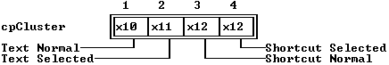

---

<a id="19894VN"></a>

### TRadioButtons::TRadioButtons

*Keywords: TRadioButtons::TRadioButtons*

Form 1

 
```c
TRadioButtons( const TRect& bounds, TSItem *aString );
```
 Form 2

 
```c
TRadioButtons( StreamableInit );   //protected
```
#### Description
 Form 1:Invokes the constructors  TCluster(* bounds, * aStrings) and  TView(* bounds) to create a  TRadioButtonsobject with the given * bounds. The  TStringCollectionstringsdata member is set from the * aStringsargument, a linked list of  TSItemobjects. The * seland * valuedata members are set to zero. * optionsis set to (* ofSelectable | ofFirstClick | ofPreProcess | ofPostProcess).

  Form 2:Each streamable class needs a "builder" to allocate the correct memory for its objects together with the initialized vtable pointers. This is achieved by calling this constructor with an argument of type  StreamableInit.

---

<a id="TRadioButtons_build"></a>

### TRadioButtons::build

*Keywords: build*

[See Also](#2AXX0RK)	 [TRadioButtons class](#TRadioButtons)
#### Syntax
```c
static TStreamable *build();
```
#### Description
 Called to create an object in certain stream-reading situations.

---

<a id="2AXX0RK"></a>

#### See Also
 [TStreamableClass](#TStreamableClass)

 [ipstream::readData](#3MVS.PE)

---

<a id="TRadioButtons_draw"></a>

### TRadioButtons::draw

*Keywords: draw*

[TRadioButtons class](#TRadioButtons)
#### Syntax
```c
virtual void draw();
```
#### Description
 Draws buttons as " ( ) " surrounded by a box.

---

<a id="TRadioButtons_mark"></a>

### TRadioButtons::mark

*Keywords: mark*

[See Also](#92LJ42)	 [TRadioButtons class](#TRadioButtons)
#### Syntax
```c
virtual Boolean mark(int item);
```
#### Description
 Returns * Trueif * itemis equal to * value; that is, if the * item'th button represents the current * valuedata member (the "pressed" button).

---

<a id="92LJ42"></a>

#### See Also
 [TCluster::value](#TCluster_value)

 [TCluster::mark](#TCluster_mark)

---

<a id="07TSOV"></a>

### TRadioButtons::movedTo

*Keywords: movedTo*

[See Also](#ED0KZJ)	 [TRadioButtons class](#TRadioButtons)
#### Syntax
```c
virtual void movedTo(int item);
```
#### Description
 Assigns * itemto * value, the selected radio button.

---

<a id="ED0KZJ"></a>

#### See Also
 [TCluster::movedTo](#1FGGCR3)

 [TRadioButtons::mark](#TRadioButtons_mark)

---

<a id="TRadioButtons_press"></a>

### TRadioButtons::press

*Keywords: press*

[TRadioButtons class](#TRadioButtons)
#### Syntax
```c
virtual void press(int item);
```
#### Description
 Assigns * itemto * value. Called when the * item'th button is pressed.

---

<a id="10JUSWY"></a>

### TRadioButtons::setData

*Keywords: setData*

[See Also](#SXB2_N)	 [TRadioButtons class](#TRadioButtons)
#### Syntax
```c
virtual void setData(void *rec);
```
#### Description
 Calls  TCluster::setDatato set * value, then sets * selto * value, since the selected item * isthe "pressed" button at startup.

---

<a id="SXB2_N"></a>

#### See Also
 [TCluster::setData](#1TQ.DBQ)

---

<a id="TRangeValidator"></a>

### TRangeValidator Class

*Keywords: TRangeValidator*

#### Header File
 validate.h
#### Description
 A range validator object determines whether the data typed by a user falls within a designated range of integers.

 Constructor

 
```c
TRangeValidator
```

```c
9FX2GQ( long aMin, long aMax );
```
#### Data Members
```c
long  max
```

```c
TRangeValidator_max;

 long  min
```

```c
TRangeValidator_min;
```
#### Member Functions
```c
virtual void  error
```

```c
TRangeValidator_error();

 virtual Boolean  isValid
```

```c
162KD3W( const char *s);

 virtual ushort  transfer
```

```c
5L26IQ( char *s, void *buffer, TVTransfer flag );
```

---

<a id="9FX2GQ"></a>

### TRangeValidator::TRangeValidator

*Keywords: TRangeValidator*

[See Also](#121AAGE)	 [TRangeValidator class](#TRangeValidator)
#### Syntax
```c
TRangeValidator( long aMin, long aMax );
```
#### Description
 Constructs a range validator object by first calling the constructor inherited from  TFilterValidator, passing a set of characters containing the digits '0'..'9' and the characters '+' and '-'. Sets * minto * aMinand * maxto * aMax, establishing the range of acceptable long integer values.

---

<a id="121AAGE"></a>

#### See Also
 [TFilterValidator](#TFilterValidator)

---

<a id="TRangeValidator_max"></a>

### TRangeValidator::max

*Keywords: max*

[TRangeValidator class](#TRangeValidator)
#### Syntax
```c
long max;
```
#### Description
 *maxis the highest valid long integer value for the input line.

---

<a id="TRangeValidator_min"></a>

### TRangeValidator::min

*Keywords: min*

[TRangeValidator class](#TRangeValidator)
#### Syntax
```c
long min;
```
#### Description
 *minis the lowest valid long integer value for the input line.

---

<a id="TRangeValidator_error"></a>

### TRangeValidator::error

*Keywords: error*

[TRangeValidator class](#TRangeValidator)
#### Syntax
```c
virtual void error();
```
#### Description
 Displays a message box indicating that the entered value did not fall in the specified range.

---

<a id="162KD3W"></a>

### TRangeValidator::isValid

*Keywords: isValid*

[TRangeValidator class](#TRangeValidator)
#### Syntax
```c
virtual Boolean isValid( const char *s);
```
#### Description
 Converts the string * sinto an integer number and returns * Trueif the result meets all three of these conditions:

|  | It is a valid integer number. |
| --- | --- |
|  | Its value is greater than or equal to * min. |
|  | It's value is less than or equal to * max. |

 If any of those tests fails, isValid returns * False.

---

<a id="5L26IQ"></a>

### TRangeValidator::transfer

*Keywords: transfer*

[TRangeValidator class](#TRangeValidator)
#### Syntax
```c
virtual ushort transfer( char *s, void *buffer, TVTransfer flag );
```
#### Description
 Incorporates the three functions  dataSize,  getData, and  setDatathat a range validator can handle for its associated input line. Instead of setting and reading the value of the numeric input line by passing a string representation of the number,  transfercan use a  longas its data record, which keeps your application from having to handle the conversion.

 * sis the input line's string value, and * bufferis the data record passed to the input line. Depending on the value of * flag,  transfereither sets * sfrom the number in * bufferor sets the number at * bufferto the value of the string * s. If * flagis * vtsetData,  transfersets * sfrom * buffer. If * flagis * vtgetData,  transfersets * bufferfrom * s. If * flagis * vtDataSize,  transferneither sets nor reads data.

 transferalways returns the size of the data transferred, in this case the size of a  long.

---

<a id="TRect"></a>

### TRect Class

*Keywords: TRect*

[Inheritance](#TVFlow_1)
#### Header File
 objects.h
#### Description
 TRectobjects represent two  TPointobjects (the top-left and bottom-right corners of the rectangle) together with several inline member functions for manipulating rectangles. The operators  ==and  !=are overloaded to provide the comparison of two rectangles in a natural way.  TPointhas data members * xand * y, the point's screen coordinates.

 Constructor

 
```c
TRect
```

```c
TRect_TRect(int ax, int ay, int bx, int by);

  TRect
```

```c
TRect_TRect(TPoint topleft, TPoint bottomright);

  TRect
```

```c
TRect_TRect();
```
#### Data Members
```c
TPoint  a
```

```c
TRect_A;

 TPoint  b
```

```c
TRect_B;
```
#### Member Functions
```c
Boolean  contains
```

```c
TEGSXW(const TPoint& p) const;

 void  grow
```

```c
TRect_grow(int aDX, int aDY);

 void  intersect
```

```c
4P_LZ1.(const TRect& r);

 Boolean  isEmpty
```

```c
EBOWU0();

 void  move
```

```c
TRect_move(int aDX, int aDY);

 Boolean  operator ==
```

```c
6CWKQS(const TRect& r) const;

 Boolean  operator !=
```

```c
167LQW8(const TRect& r) const;

 void  Union
```

```c
TRect_Union(const TRect& r);
```

---

<a id="TRect_TRect"></a>

### TRect::TRect

*Keywords: TRect::TRect*

Form 1

 
```c
TRect(int ax, int ay, int bx, int by);

 TRect(TPoint topleft, TPoint bottomright);
```
 Form 2

 
```c
TRect();
```
#### Description
 Form 1:Creates a  TRectobject initializes it with * a.x  =*ax; * a.y  =*ay; so on. Alternatively, you can construct a rectangle by supplying two  TPointarguments; in which case, * ais set to * topleft* bis set to * bottomright.

  Form 2:Allows the creation of an uninitialized  TRectobject using  newwithout arguments.

---

<a id="TRect_A"></a>

### TRect::a

*Keywords: a*

[See Also](#159ALAV)	 [TRect class](#TRect)
#### Syntax
```c
TPoint a;
```
#### Description
 *ais the point defining the top-left corner of a rectangle on the screen.

---

<a id="159ALAV"></a>

#### See Also
 [TPoint](#TPoint)

---

<a id="TRect_B"></a>

### TRect::b

*Keywords: b*

[See Also](#MTCGW2)	 [TRect class](#TRect)
#### Syntax
```c
TPoint b;
```
#### Description
 *bis the point defining the bottom-right corner of a rectangle on the screen.

---

<a id="MTCGW2"></a>

#### See Also
 [TPoint](#TPoint)

---

<a id="TEGSXW"></a>

### TRect::contains

*Keywords: contains*

[TRect class](#TRect)
#### Syntax
```c
Boolean contains(const TPoint& p) const;
```
#### Description
 Returns * Trueif the calling rectangle (including its boundary) contains the point * p.

---

<a id="TRect_grow"></a>

### TRect::grow

*Keywords: grow*

[TRect class](#TRect)
#### Syntax
```c
void grow(int aDX, int aDY);
```
#### Description
 Changes the size of the calling rectangle by subtracting * aDXfrom * a.x, adding * aDXto * b.x, subtracting * aDYfrom * a.y, and adding * aDYto * b.y.

---

<a id="4P_LZ1."></a>

### TRect::intersect

*Keywords: intersect*

[TRect class](#TRect)
#### Syntax
```c
void intersect(const TRect& r);
```
#### Description
 Changes the location and size of the calling rectangle to the region defined by the intersection of the current rectangle with * r.

---

<a id="EBOWU0"></a>

### TRect::isEmpty

*Keywords: isEmpty*

[TRect class](#TRect)
#### Syntax
```c
Boolean isEmpty();
```
#### Description
 Returns * Trueif the rectangle contains no character-sized interior; otherwise, returns * False. Empty means that * (a.x >=* b.* x || a.y >= b.y).

---

<a id="TRect_move"></a>

### TRect::move

*Keywords: move*

[TRect class](#TRect)
#### Syntax
```c
void move(int aDX, int aDY);
```
#### Description
 Moves the calling rectangle by adding * aDXto * a.xand * b.xand adding * aDYto * a.yand * b.y.

---

<a id="6CWKQS"></a>

### TRect::operator ==

*Keywords: operator ==*

[TRect class](#TRect)
#### Syntax
```c
Boolean operator == (const TRect& r) const;
```
#### Description
 Returns * Trueif * ris the same as the calling rectangle; otherwise, returns * False.

---

<a id="167LQW8"></a>

### TRect::operator !=

*Keywords: operator !=*

[TRect class](#TRect)
#### Syntax
```c
Boolean operator != (const TRect& r) const;
```
#### Description
 Returns * Trueif * ris not the same as the calling rectangle; otherwise, returns * False.

---

<a id="TRect_Union"></a>

### TRect::Union

*Keywords: Union*

[TRect class](#TRect)
#### Syntax
```c
void Union(const TRect& r);
```
#### Description
 Changes the calling rectangle to be the union of itself and the rectangle * r; that is, to the smallest rectangle containing both the object and * r.

---

<a id="TResourceCollection"></a>

### TResourceCollection Class

*Keywords: TResourceCollection*

[Inheritance](#TVFlow_1)
#### Header File
 resource.h
#### Description
 TResourceCollectionis a derivative of  TStringCollection, which makes it a sorted, streamable collection. It is used with  TResourceFileto implement collections of resources. A resource file is a stream that is indexed by key strings. Each resource item points to an object of type  TResourceItemdefined as follows:

 
```c
 struct TResourceItem

 \-

    long pos;

    long size;

    char *key;

 ;
```
 The fields provide the stream position and item size for the resource item matching the string * key. The overriding member functions of  TResourceCollectionare mainly concerned with handling the extra string element in its items.  TResourceCollectionis used internally by  TResourceFileobjects to maintain a resource file's index.

 Constructor

 
```c
TResourceCollection
```

```c
E4IQ_Y( short aLimit, short aDelta );

  TResouceCollection
```

```c
E4IQ_Y( StreamableInit streamableInit);
```
#### Data Members
```c
static const char * const  name
```

```c
TResourceCollection_name;
```
#### Member Functions
```c
static TStreamable * build
```

```c
TResourceCollection_build();

 virtual void  freeItem
```

```c
33BWQUE( void *item );   //private

 virtual void * keyOf
```

```c
TResourceCollection_keyOf( void *item);

 virtual void * read
```

```c
TResourceCollection_read( ipstream& is);   //protected

 void *TResourceCollection:: readItem
```

```c
DUDMDL( ipstream& is );   //private

 virtual void  write
```

```c
TResourceCollection_write( opstream& os );   //protected

 void  writeItem
```

```c
BF_CAP( void *obj, opstream& os );
```

---

<a id="E4IQ_Y"></a>

### TResourceCollection::TResourceCollection

*Keywords: TResourceCollection::TResourceCollection*

[See Also](#3G7O_QX)	 [TResourceCollection class](#TResourceCollection)

 Form 1

 
```c
TResourceCollection( short aLimit, short aDelta );
```
 Form 2

 
```c
TResouceCollection( StreamableInit streamableInit);   //protected
```
#### Description
 Form 1:Creates a resource collection with initial size * aLimitand the ability to resize by * aDelta.

  Form 2:Each streamable class needs a "builder" to allocate the correct memory for its objects together with the initialized vtable pointers. This is achieved by calling this constructor with an argument of type  StreamableInit.

---

<a id="3G7O_QX"></a>

#### See Also
 [TStringCollection::TStringCollection](#1TQX0E)

---

<a id="TResourceCollection_name"></a>

### TResourceCollection::name

*Keywords: name*

[TResourceCollection class](#TResourceCollection)
#### Syntax
```c
static const char * const name;
```
#### Description
 Class name used by the stream manager.

---

<a id="TResourceCollection_build"></a>

### TResourceCollection::build

*Keywords: build*

[See Also](#C3QFRK)	 [TResourceCollection class](#TResourceCollection)
#### Syntax
```c
static TStreamable *build();
```
#### Description
 Called to create an object in certain stream-reading situations.

---

<a id="C3QFRK"></a>

#### See Also
 [TStreamableClass](#TStreamableClass)

 [ipstream::readData](#3MVS.PE)

---

<a id="33BWQUE"></a>

### TResourceCollection::freeItem

*Keywords: freeItem*

[TResourceCollection class](#TResourceCollection)
#### Syntax
```c
virtual void freeItem( void *item );   //private
```
#### Description
 Frees the given item from the collection by deleting both the key and the item.

---

<a id="TResourceCollection_keyOf"></a>

### TResourceCollection::keyOf

*Keywords: keyOf*

[TResourceCollection class](#TResourceCollection)
#### Syntax
```c
virtual void *keyOf( void *item);
```
#### Description
 Returns the key of the given item. The implementation is

 
```c
 void* TResourceCollection::keyOf( void *item )

 \-

    return ((TResourceItem *)item)->key;
```

---

<a id="TResourceCollection_read"></a>

### TResourceCollection::read

*Keywords: read*

[See Also](#53ACZN)	 [TResourceCollection class](#TResourceCollection)
#### Syntax
```c
virtual void *read( ipstream& is);   //protected
```
#### Description
 Reads from the input stream * isto * ts.

---

<a id="53ACZN"></a>

#### See Also
 [TStreamableClass](#TStreamableClass)

 [TStreamable](#TStreamable)

 [ipstream](#ipstream)

---

<a id="DUDMDL"></a>

### TResourceCollection::readItem

*Keywords: readItem*

[See Also](#7NLV8J)	 [TResourceCollection class](#TResourceCollection)
#### Syntax
```c
void *TResourceCollection::readItem( ipstream& is );   //private
```
#### Description
 Called for each item in the collection. You'll need to override these in everything derived from  TCollectionor  TSortedCollectionin order to read the items correctly.  TSortedCollectionalready overrides this function.

---

<a id="7NLV8J"></a>

#### See Also
 [TStreamableClass](#TStreamableClass)

 [TStreamable](#TStreamable)

 [ipstream](#ipstream)

---

<a id="TResourceCollection_write"></a>

### TResourceCollection::write

*Keywords: write*

[See Also](#HV3TZ0)	 [TResourceCollection class](#TResourceCollection)
#### Syntax
```c
virtual void write( opstream& os );   //protected
```
#### Description
 Writes * tsto the * osstream.

---

<a id="HV3TZ0"></a>

#### See Also
 [TStreamableClass](#TStreamableClass)

 [TStreamable](#TStreamable)

 [opstream](#opstream)

---

<a id="BF_CAP"></a>

### TResourceCollection::writeItem

*Keywords: writeItem*

[See Also](#1MZ.NWU)	 [TResourceCollection class](#TResourceCollection)
#### Syntax
```c
void writeItem( void *obj, opstream& os );
```
#### Description
 Called for each item in the collection. You'll need to override these in everything derived from  TCollectionor  TSortedCollectionin order to write the items correctly.  TSortedCollectionalready overrides this function.

---

<a id="1MZ.NWU"></a>

#### See Also
 [TStreamableClass](#TStreamableClass)

 [TStreamable](#TStreamable)

 [opstream](#opstream)

---

<a id="TResourceFile"></a>

### TResourceFile Class

*Keywords: TResourceFile*

[Inheritance](#TVFlow_1)
#### Header File
 resource.h
#### Description
 TResourceFileimplements a stream (of type  fpstream) that can be indexed by string keys. When objects are stored in a resource file using  TResourceFile::put, a string key, which identifies the object, is also supplied. The objects can later be retrieved by specifying the string key in a call to  TResourceFile::get.

 To provide fast and efficient access to the objects stored in a resource file,  TResourceFileobjects store the keys in a sorted string collection (using the  TResourceCollectionclass) along with the position and size of the resource data in the resource file. The data member * indexpoints to the associated  TResourceCollectionobject, known appropriately as the index to the resource file.

 As with all stream I/O, the classes of all objects written to and read from resource files must be streamable and must be registered (that is, the stream manager must be notified of its existence).

 Constructor

 
```c
TResourceFile
```

```c
1XUISCF( fpstream *aStream );

 ~ TResourceFile
```

```c
1XUISCF();
```
#### Data Members
```c
long  basePos
```

```c
SVH_WG;

 TResourceCollection * index
```

```c
TResourceFile_index;

 long  indexPos
```

```c
_L8A3H;

 Boolean  modified
```

```c
OWXWQN;

 fpstream * stream
```

```c
XMZPJR;
```
#### Member Functions
```c
short  count
```

```c
TResourceFile_count();

 void  flush
```

```c
TResourceFile_flush();

 void * get
```

```c
TResourceFile_get( const char *key );

 const char * keyAt
```

```c
TResourceFile_keyAt(short i);

 void  put
```

```c
TResourceFile_put(TStreamable *item, const char *key);

 void  remove
```

```c
1IH6ZKZ(const char *key);

 fpstream * switchTo
```

```c
FII334( fpstream *aStream, Boolean pack );
```

---

<a id="1XUISCF"></a>

### TResourceFile::TResourceFile

*Keywords: TResourceFile::TResourceFile*

[See Also](#11CODF6)	 [TResourceFile class](#TResourceFile)
#### Syntax
```c
TResourceFile( fpstream *aStream );
```
#### Description
 Initializes a resource file using the stream given by * aStreamsets the * modifieddata member to * False. The stream must have already been initialized. For example,

 
```c
 TResourceFile *resFile = new TResourceFile(new fpstream("MYAPP.RES",

 ios::in | ios::out));
```
 During initialization, the  TResourceFileconstructor looks for a resource file header at the current position of the stream. If a header is not found, the constructor assumes that a new resource file is being created together with a new resource collection. You will not normally be concerned with the header internals, but advanced programmers may wish to know the following. The resource file header is defined by the following structure:

 
```c
 struct THeader

 \-

    ushort signature;

    union

    \-

       Count_type count;

       Info_type info;

    ;

 ;
```
 where  Count_typeis

 
```c
 struct Count_type

 \-

    ushort lastCount;

    ushort pageCount;

 ;
```
 Info_typeis

 
```c
 struct Info_type

 \-

    ushort infoType;

    long infoSize;

 ;
```
* signaturecontains either 0x5a4d or 0x4246. If the signature is 0x5a4d, the  Count_typefield of the union is used; if the signature is 0x4246, the  Info_typefield is used. If the constructor sees an EXE file signature at the current position of the stream, it seeks the stream to the end of the EXE file image, and then looks for a resource file header there. Likewise, the constructor will skip over an overlay file that was appended to theEXE file. This means that you can append both your overlay file and your resource file (in any order) to the end of your application's EXE file. In all cases, * basePosand * indexPos are set to the correct values allowing for any headers.

 Destructor

 
```c
~TResourceFile();
```
 Flushes the resource file, using  TResourceFile::flush, then deletes * index* stream.

---

<a id="11CODF6"></a>

#### See Also
 [TResourceFile constructor](#1XUISCF)

 [TResourceFile::flush](#TResourceFile_flush)

---

<a id="SVH_WG"></a>

### TResourceFile::basePos

*Keywords: basePos*

[See Also](#L.G682)	 [TResourceFile class](#TResourceFile)
#### Syntax
```c
long basePos;   //protected
```
#### Description
 The base position of the stream (ignoring header information).

---

<a id="L.G682"></a>

#### See Also
 [fpstream](#fpstream)

---

<a id="TResourceFile_index"></a>

### TResourceFile::index

*Keywords: index*

[See Also](#0DBY4W)	 [TResourceFile class](#TResourceFile)
#### Syntax
```c
TResourceCollection *index;   //protected
```
#### Description
 A pointer to the associated  TResourceCollectionobject.

---

<a id="0DBY4W"></a>

#### See Also
 [TResourceCollection](#TResourceCollection)

---

<a id="_L8A3H"></a>

### TResourceFile::indexPos

*Keywords: indexPos*

[TResourceFile class](#TResourceFile)
#### Syntax
```c
long indexPos;   //protected
```
#### Description
 The current position of the stream relative to the base position.

---

<a id="OWXWQN"></a>

### TResourceFile::modified

*Keywords: modified*

[See Also](#05_LDG)	 [TResourceFile class](#TResourceFile)
#### Syntax
```c
Boolean modified;   //protected
```
#### Description
 Set * Trueif the resource file has been modified since the last  flushcall; otherwise * False.

---

<a id="05_LDG"></a>

#### See Also
 [TResourceFile::flush](#TResourceFile_flush)

 [TResourceFile::put](#TResourceFile_put)

---

<a id="XMZPJR"></a>

### TResourceFile::stream

*Keywords: stream*

[See Also](#1UJ_85P)	 [TResourceFile class](#TResourceFile)
#### Syntax
```c
fpstream *stream;   //protected
```
#### Description
 Pointer to the file stream associated with this resource file.

---

<a id="1UJ_85P"></a>

#### See Also
 [fpstream](#fpstream)

---

<a id="TResourceFile_count"></a>

### TResourceFile::count

*Keywords: count*

[See Also](#135H.8V)	 [TResourceFile class](#TResourceFile)
#### Syntax
```c
short count();
```
#### Description
 Calls  index->getCountto return the number of resource items stored in the associated  TResourceCollection.

---

<a id="135H.8V"></a>

#### See Also
 [TNSCollection::getCount](#1U5ZZWM)

---

<a id="TResourceFile_flush"></a>

### TResourceFile::flush

*Keywords: flush*

[See Also](#32Q.TEE)	 [TResourceFile class](#TResourceFile)
#### Syntax
```c
void flush();
```
#### Description
 If the resource file has not been modified since the last  flush(that is, if * modifiedis * False),  flushdoes nothing. Otherwise,  flushstores the updated index at the end of the stream and updates the resource header at the beginning of the stream. It then calls  stream->flushand resets * modifiedto * False.

---

<a id="32Q.TEE"></a>

#### See Also
 [TResourceFile::modified](#OWXWQN)

 [opstream::flush](#opstream_flush)

---

<a id="TResourceFile_get"></a>

### TResourceFile::get

*Keywords: get*

[See Also](#19RHAUB)	 [TResourceFile class](#TResourceFile)
#### Syntax
```c
void *get( const char *key );
```
#### Description
 Searches for the given * keyin the associated resource file collection (given by the pointer * index). Returns 0 if the key is not found. Otherwise,  getseekg's the stream to the position given by the * posfield in the  TResourceItemobject located at * key. The object at (* basePos+ * pos) is created and a pointer to it is returned. For example,

 
```c
 deskTop->insert(validView(resFile.get("editorWindow")));
```

---

<a id="19RHAUB"></a>

#### See Also
 [TNSCollection::at](#TNSCollection_at)

 [TResourceFile::put](#TResourceFile_put)

 [TProgram::validView](#0YR55K)

 [ipstream::seekg](#ipstream_seekg)

---

<a id="TResourceFile_keyAt"></a>

### TResourceFile::keyAt

*Keywords: keyAt*

[See Also](#L9GXUO)	 [TResourceFile class](#TResourceFile)
#### Syntax
```c
const char *keyAt(short i);
```
#### Description
 Uses  index->at(* i) to return the string key of the * i'th resource in this resource file. The index of the first resource is zero and the index of the last resource is  TResourceFile::countminus one. Using * countand  keyAt, you can iterate over all resources in a resource file.

---

<a id="L9GXUO"></a>

#### See Also
 [TResourceFile::count](#TResourceFile_count)

 [TNSCollection::at](#TNSCollection_at)

---

<a id="TResourceFile_put"></a>

### TResourceFile::put

*Keywords: put*

[See Also](#1EZL3A5)	 [TResourceFile class](#TResourceFile)
#### Syntax
```c
void put(TStreamable *item, const char *key);
```
#### Description
 Adds the streamable object given by * itemto the resource file with the key string given by * keyand sets * modifiedto * True. The object is appended to the end of the stream file. If the index already contains the key, the index is modified to point to the new object. Otherwise, a new entry is added to the index. Note that old objects cannot be physically removed from the resource file by this function.

---

<a id="1EZL3A5"></a>

#### See Also
 [TResourceFile::get](#TResourceFile_get)

 [TNSSortedCollection::search](#R8LBX5)

---

<a id="1IH6ZKZ"></a>

### TResourceFile::remove

*Keywords: remove*

[See Also](#1J3VZL6)	 [TResourceFile class](#TResourceFile)
#### Syntax
```c
void remove(const char *key);
```
#### Description
 If the resource indexed by * keyis not found,  removedoes nothing. Otherwise it calls  index->freeto remove the resource.

---

<a id="1J3VZL6"></a>

#### See Also
 [TNSSortedCollection::search](#R8LBX5)

 [TNSCollection::free](#TNSCollection_free)

---

<a id="FII334"></a>

### TResourceFile::switchTo

*Keywords: switchTo*

[TResourceFile class](#TResourceFile)
#### Syntax
```c
fpstream *switchTo( fpstream *aStream, Boolean pack );
```
#### Description
 Switches the  TResourceFileto the new stream specified by * aStream, and returns the old stream that was being used by  TResourceFile.

---

<a id="TScreen"></a>

### TScreen Class

*Keywords: TScreen*

[Inheritance](#TVFlow_1)
#### Header File
 system.h
#### Description
 TScreenprovides low-level video attributes and functions. This class, and the other systems classes in system.h, are listed briefly for guidance only: they are used internally by Turbo Vision and you would not need to use them explicitly for normal applications.  TViewis a friend class of  TDisplay.

 Constructors

 
```c
TScreen
```

```c
1F4SLIP();

 ~ TScreen
```

```c
1F4SLIP();
```
#### Data Members
```c
static Boolean  checkSnow
```

```c
30_YZAP;

 static ushort  cursorLines
```

```c
1I_W6GO;

 static Boolean  hiResScreen
```

```c
2.JX9WT;

 static ushort *  screenBuffer
```

```c
2VLH8BO;

 static uchar  screenHeight
```

```c
ZKR0UL;

 static ushort  screenMode
```

```c
1OE7R2;

 static uchar  screenWidth
```

```c
12EPRU8;

 static ushort  startupCursor
```

```c
Y3_G80;

 static ushort  startupMode
```

```c
BOKB4K;
```
#### Member Functions
```c
static void  clearScreen
```

```c
3L5FG_();

 static ushort  fixCrtMode
```

```c
MT0T4K( ushort vmode );

 static void  resume
```

```c
2XX2_TQ();

 static void  setCrtData
```

```c
1Y9VWWK();

 static void  setVideoMode
```

```c
DJ75JC( ushort vmode );

 static void  suspend
```

```c
HDQLRF();
```

---

<a id="1F4SLIP"></a>

### TScreen::TScreen

*Keywords: TScreen::TScreen*

[See Also](#D0R7P9)	 [TScreen class](#TScreen)
#### Syntax
```c
TScreen();
```
#### Description
 Creates a  TScreenobject calls  resumeThis initializes * startupModevia  getCrtMode; * startupCursorvia  getCursorType; then sets the remaining data members by calling  setCrtData.

 Destructor

 
```c
~TScreen();
```
#### Description
 Calls  suspend. This restores the screen mode to the startup mode, clears the screen, then restores the cursor to the startup cursor.

---

<a id="D0R7P9"></a>

#### See Also
 [TDisplay::getCrtMode](#1R9VILJ)

 [TDisplay::getCursorType](#0DRC84)

 [TDisplay::setCrtMode](#50B3KB)

 [TDisplay::setCursorType](#17GYRVO)

 [TScreen::clearScreen](#3L5FG_)

 [TScreen::resume](#2XX2_TQ)

 [TScreen::setCrtData](#1Y9VWWK)

 [TScreen::suspend](#HDQLRF)

---

<a id="30_YZAP"></a>

### TScreen::checkSnow

*Keywords: checkSnow*

[TScreen class](#TScreen)
#### Syntax
```c
static Boolean checkSnow;
```
#### Description
 *Trueif the "check snow" feature is enabled; otherwise * False.

---

<a id="1I_W6GO"></a>

### TScreen::cursorLines

*Keywords: cursorLines*

[See Also](#29GU_P_)	 [TScreen class](#TScreen)
#### Syntax
```c
static ushort cursorLines;
```
#### Description
 Holds the current cursor type, set by  setCrtDatawith a call to  getCursorType. You should set this variable after calling  setCursorif you want a permanent cursor change. Otherwise, the cursor reverts to its previous state onthe next change of focus.

---

<a id="29GU_P_"></a>

#### See Also
 [TDisplay::getCursorType](#0DRC84)

 [TScreen::setCrtData](#1Y9VWWK)

---

<a id="2.JX9WT"></a>

### TScreen::hiResScreen

*Keywords: hiResScreen*

[See Also](#NGVAH3)	 [TScreen class](#TScreen)
#### Syntax
```c
static Boolean hiResScreen;
```
#### Description
 *Trueif * screenHeightis greater than 25; otherwise * False.

---

<a id="NGVAH3"></a>

#### See Also
 [TScreen::screenHeight](#ZKR0UL)

---

<a id="2VLH8BO"></a>

### TScreen::screenBuffer

*Keywords: screenBuffer*

[TScreen class](#TScreen)
#### Syntax
```c
static ushort * screenBuffer;
```
#### Description
 Points to the appropriate video buffer for the particular video configuration detected and its current mode.

---

<a id="ZKR0UL"></a>

### TScreen::screenHeight

*Keywords: screenHeight*

[See Also](#7_MC8E)	 [TScreen class](#TScreen)
#### Syntax
```c
static uchar screenHeight;
```
#### Description
 Holds the current screen height, set by  setCrtDatawith a call to  getRows.

---

<a id="7_MC8E"></a>

#### See Also
 [TDisplay::getRows](#4A9M70)

 [TScreen::setCrtData](#1Y9VWWK)

---

<a id="1OE7R2"></a>

### TScreen::screenMode

*Keywords: screenMode*

[See Also](#M91E7X)	 [TScreen class](#TScreen)
#### Syntax
```c
static ushort screenMode;
```
#### Description
 The current video mode.

---

<a id="M91E7X"></a>

#### See Also
 [TDisplay::getCrtMode](#1R9VILJ)

---

<a id="12EPRU8"></a>

### TScreen::screenWidth

*Keywords: screenWidth*

[See Also](#17_RM2N)	 [TScreen class](#TScreen)
#### Syntax
```c
static uchar screenWidth;
```
#### Description
 Holds the current screen width, set by  setCrtDatavia a call to  getCols.

---

<a id="17_RM2N"></a>

#### See Also
 [TDisplay::getCols](#QJ6LCJ)

 [TScreen::setCrtData](#1Y9VWWK)

---

<a id="Y3_G80"></a>

### TScreen::startupCursor

*Keywords: startupCursor*

[See Also](#17PCLGC)	 [TScreen class](#TScreen)
#### Syntax
```c
static ushort startupCursor;
```
#### Description
 Holds the initial cursor type set by  initScreenby way of the  TApplication/ TProgramconstructors.

---

<a id="17PCLGC"></a>

#### See Also
 [TProgram::initScreen](#V1M_XZ)

 [TDisplay::getCursorType](#0DRC84)

---

<a id="BOKB4K"></a>

### TScreen::startupMode

*Keywords: startupMode*

[See Also](#QJB4WP)	 [TScreen class](#TScreen)
#### Syntax
```c
static ushort startupMode;
```
#### Description
 Holds the initial video mode set by  initScreenby way of the  TApplication/ TProgramconstructors.

---

<a id="QJB4WP"></a>

#### See Also
 [TProgram::initScreen](#V1M_XZ)

---

<a id="3L5FG_"></a>

### TScreen::clearScreen

*Keywords: clearScreen*

[See Also](#2_..ZD2)	 [TScreen class](#TScreen)
#### Syntax
```c
static void clearScreen();
```
#### Description
 Calls  TDisplay::clearScreenwith the current * screenWidthand * screenHeightas arguments.

---

<a id="2_..ZD2"></a>

#### See Also
 [TDisplay::clearScreen](#82HL0RX)

---

<a id="MT0T4K"></a>

### TScreen::fixCrtMode

*Keywords: fixCrtMode*

[See Also](#PHAD2D)	 [TScreen class](#TScreen)
#### Syntax
```c
static ushort fixCrtMode( ushort vmode );
```
#### Description
 If the lower byte of the given * vmodeis not * smMono, * smCO80, or * smBW80,  fixCrtModereturns * smCO80. Used by  TScreen::setVideoModeto handle nonstandard modes.

---

<a id="PHAD2D"></a>

#### See Also
 [TDisplay::videoModes](#1V9W0T9)

---

<a id="2XX2_TQ"></a>

### TScreen::resume

*Keywords: resume*

[See Also](#KJ.26L)	 [TScreen class](#TScreen)
#### Syntax
```c
static void resume();
```
#### Description
 Called by the  TScreenconstructor to initialize * startupModevia  getCrtMode; * startupCursorvia  getCursorType; then sets the remaining data members by calling  setCrtData.

---

<a id="KJ.26L"></a>

#### See Also
 [TDisplay::getCrtMode](#1R9VILJ)

 [TDisplay::getCursorType](#0DRC84)

 [TScreen::setCrtData](#1Y9VWWK)

 [TScreen::TScreen](#1F4SLIP)

---

<a id="1Y9VWWK"></a>

### TScreen::setCrtData

*Keywords: setCrtData*

[See Also](#2N9AE6D)	 [TScreen class](#TScreen)
#### Syntax
```c
static void setCrtData();
```
#### Description
 Sets the * screenMode, * screenWidth, and * screenHeightdata members by calling  getCrtMode,  getCols, and  getRows. The * hiResScreendata member is set * Trueor * Falsedepending on the value of * screenHeight. Finally, depending on the current * screenMode, the * screenBufferand * checkSnowmembers are set.

---

<a id="2N9AE6D"></a>

#### See Also
 [TDisplay::getCrtMode](#1R9VILJ)

 [TDisplay::getCols](#QJ6LCJ)

 [TDisplay::getRows.](#4A9M70)

---

<a id="DJ75JC"></a>

### TScreen::setVideoMode

*Keywords: setVideoMode*

[TScreen class](#TScreen)
#### Syntax
```c
static void setVideoMode( ushort vmode );
```
#### Description
 Sets the video mode to * vmode, then adjusts the other  TScreendata members as appropriate.

---

<a id="HDQLRF"></a>

### TScreen::suspend

*Keywords: suspend*

[See Also](#1X_GVBU)	 [TScreen class](#TScreen)
#### Syntax
```c
static void suspend();
```
#### Description
 Called by the  TScreendestructor.  suspendrestores the screen mode to the startup mode, clears the screen, then restores the cursor to the startup cursor.

---

<a id="1X_GVBU"></a>

#### See Also
 [TScreen::~TScreen](#1F4SLIP)

---

<a id="TScrollBar"></a>

### TScrollBar Class

*Keywords: TScrollBar*

[Inheritance](#TVFlow_2)
#### Header File
 views.h

 Constructors

 
```c
TScrollBar
```

```c
1KIA1F4(const TRect& bounds);

  TScrollBar
```

```c
1KIA1F4( StreamableInit streamableInit);
```
#### Data Members
```c
int  arStep
```

```c
DKS15P;

 TScrollChars  chars
```

```c
TScrollBar_chars;

 int  maxVal
```

```c
31L3E.;

 int  minVal
```

```c
39B3E.;

 int  pgStep
```

```c
2U1KZPU;

 int  value
```

```c
TScrollBar_value;
```
#### Member Functions
```c
static TStreamable * build
```

```c
TScrollBar_build();

 void  draw
```

```c
TScrollBar_draw();

 virtual const char *  getPalette
```

```c
5GUPYH() const;

 virtual void  handleEvent
```

```c
KBNDDR(TEvent& event);

 virtual void * read
```

```c
TScrollBar_read( ipstream& is);   //protected

 virtual void  scrollDraw
```

```c
4.BWYVN();

 virtual int  scrollStep
```

```c
96J3O_(int part);

 void  setParams
```

```c
MNK5IW( int aValue, int aMin, int aMax, int aPgStep, int aArStep );

 void  setRange
```

```c
FDJCWR(int aMin, int aMax);

 void  setStep
```

```c
.PA32W(int aPgStep, int aArstep);

 void  setValue
```

```c
FHJB0R(int aValue);

 virtual void  write
```

```c
TScrollBar_write( opstream& os);   //protected
```
 Palette

 Scroll bar objects use the default palette, cpScrollBar, to map onto the fourth and fifth entries in the standard application palette.

 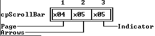

---

<a id="1KIA1F4"></a>

### TScrollBar::TScrollBar

*Keywords: TScrollbar::TScrollbar*

[TScrollBar class](#TScrollBar)

 Form 1

 
```c
TScrollBar(const TRect& bounds);
```
 Form 2

 
```c
TScrollBar( StreamableInit streamableInit);  //protected
```
#### Description
 Form 1: Creates initializes a scroll bar with the given * boundsby calling the  TViewconstructor* value, maxVal and minValare set to zero. * pgStep* arStepare set to 1. The shapes of the scroll bar parts are set to the defaults in  TScrollChars.

 If * boundsproduces * size.x = 1, you get a vertical scroll bar; otherwise, you get a horizontal scroll bar. Vertical scroll bars have the * growModedata member set to * gfGrowLoX| * gfGrowHiX| * gfGrowHiY; horizontal scroll bars have the * growModedata member set to * gfGrowLoY| * gfGrowHiX| * gfGrowHiY.

 Form 2: Each streamable class needs a "builder" to allocate the correct memory for its objects together with the initialized vtable pointers. This is achieved by calling this constructor with an argument of type StreamableInit.

---

<a id="DKS15P"></a>

### TScrollBar::arStep

*Keywords: arStep*

[See Also](#_WK23S)	 [TScrollBar class](#TScrollBar)
#### Syntax
```c
int arStep;
```
#### Description
 *arStepis the amount added or subtracted to the scroll bar's * valuedata member when an arrow area is clicked (* sbLeftArrow, * sbRightArrow, * sbUpArrow, or * sbDownArrow) or the equivalent keystroke made. The  TScrollBarconstructor sets * arStepto 1 by default.

---

<a id="_WK23S"></a>

#### See Also
 [TScrollBar::setStep](#.PA32W)

 [TScrollBar::setParams](#MNK5IW)

 [TScrollBar::scrollStep](#96J3O_)

---

<a id="TScrollBar_chars"></a>

### TScrollBar::chars

*Keywords: chars*

[TScrollBar class](#TScrollBar)
#### Syntax
```c
TScrollChars chars;
```
#### Description
 TScrollCharsis defined as:

 
```c
 typedef char TScrollChars[5];
```
* charsis set with the five basic character patterns used to draw the scroll bar parts.

---

<a id="31L3E."></a>

### TScrollBar::maxVal

*Keywords: maxVal*

[See Also](#_I7V5G)	 [TScrollBar class](#TScrollBar)
#### Syntax
```c
int maxVal;
```
#### Description
 *maxValrepresents the maximum value for the * valuedata member. The  TScrollBarconstructor sets * maxValto zero by default.

---

<a id="_I7V5G"></a>

#### See Also
 [TScrollBar::setRange](#FDJCWR)

 [TScrollBar::setParams](#MNK5IW)

---

<a id="39B3E."></a>

### TScrollBar::minVal

*Keywords: minVal*

[See Also](#7X0P)	 [TScrollBar class](#TScrollBar)
#### Syntax
```c
int minVal;
```
#### Description
 *minValrepresents the minimum value for the * valuedata member. The  TScrollBarconstructor sets * minValto zero by default.

---

<a id="7X0P"></a>

#### See Also
 [TScrollBar::setRange](#FDJCWR)

 [TScrollBar::setParams](#MNK5IW)

---

<a id="2U1KZPU"></a>

### TScrollBar::pgStep

*Keywords: pgStep*

[See Also](#FP2CE_)	 [TScrollBar class](#TScrollBar)
#### Syntax
```c
int pgStep;
```
#### Description
 *pgStepis the amount added or subtracted to the scroll bar's value data member when a mouse click event occurs in any of the page areas (* sbPageLeft, * sbPageRight, * sbPageUp, or * sbPageDown) or an equivalent keystroke is detected (Ctrl-Left, Ctrl-Right, PgUp, or PgDn). The  TScrollBarconstructor sets * pgStepto 1 by default. You can change * pgStepusing  TScrollBar::setStep,  TScrollBar::setParams, or  TScroller::setLimit.

---

<a id="FP2CE_"></a>

#### See Also
 [TScrollBar::setStep](#.PA32W)

 [TScrollBar::setParams](#MNK5IW)

 [TScroller::setLimit](#1F2SP9K)

 [TScrollBar::scrollStep](#96J3O_)

---

<a id="TScrollBar_value"></a>

### TScrollBar::value

*Keywords: value*

[See Also](#I7KJMW)	 [TScrollBar class](#TScrollBar)
#### Syntax
```c
int value;
```
#### Description
 The * valuedata member represents the current position of the scroll bar indicator. This specially colored marker moves along the scroll bar strip to indicate the relative position (horizontally or vertically, depending on the scroll bar orientation) of the scrollable text being viewed relative to the total text available for scrolling.

 Many events can directly or indirectly change * value, such as clicking on the designated scroll bar parts, resizing the window, or changing the text in the scroller. Similarly, changes in * valuemay need to trigger other events. The  TScrollBarconstructor sets * valueto zero by default.

---

<a id="I7KJMW"></a>

#### See Also
 [TScrollBar::setvalue](#FHJB0R)

 [TScrollBar::setParams](#MNK5IW)

 [TScrollBar::scrollDraw](#4.BWYVN)

 [TScroller::handleEvent](#0VMKQF)

 [TScrollBar::TScrollBar](#1KIA1F4)

---

<a id="TScrollBar_build"></a>

### TScrollBar::build

*Keywords: build*

[See Also](#2MU7T9R)	 [TScrollBar class](#TScrollBar)
#### Syntax
```c
static TStreamable *build();
```
#### Description
 Called to create an object in certain stream-reading situations.

---

<a id="2MU7T9R"></a>

#### See Also
 [TStreamableClass](#TStreamableClass)

 [ipstream::readData](#3MVS.PE)

---

<a id="TScrollBar_draw"></a>

### TScrollBar::draw

*Keywords: draw*

[See Also](#1ZEMZJ9)	 [TScrollBar class](#TScrollBar)
#### Syntax
```c
void draw();
```
#### Description
 Draws the scroll bar depending on the current * bounds, * value, and palette.

---

<a id="1ZEMZJ9"></a>

#### See Also
 [TScrollBar::scrollDraw](#4.BWYVN)

 [TScrollBar::value](#TScrollBar_value)

---

<a id="5GUPYH"></a>

### TScrollBar::getPalette

*Keywords: getpalette*

[TScrollBar class](#TScrollBar)
#### Syntax
```c
virtual const char * getPalette() const;
```
#### Description
 Returns * cpScrollBar, the default scroll bar palette string, "\".

---

<a id="KBNDDR"></a>

### TScrollBar::handleEvent

*Keywords: handleEvent*

[See Also](#6U9KCN)	 [TScrollBar class](#TScrollBar)
#### Syntax
```c
virtual void handleEvent(TEvent& event);
```
#### Description
 Handles scroll bar events by calling  TView::handleEvent, then analyzing * event.what. Mouse events are broadcast to the scroll bar's owner (see  messagefunction), which must handle the implications of the scroll bar changes (for example, by scrolling text).  TScrollBar::handleEventalso determines which scroll bar part has received a mouse click (or equivalent keystroke). The * valuedata member is adjusted according to the current * arStepor * pgStepvalues, and the scroll bar indicator is redrawn.

---

<a id="6U9KCN"></a>

#### See Also
 [TView::handleEvent](#4H2TBJ)

---

<a id="TScrollBar_read"></a>

### TScrollBar::read

*Keywords: read*

[See Also](#1OIGD0X)	 [TScrollBar class](#TScrollBar)
#### Syntax
```c
virtual void *read( ipstream& is);   //protected
```
#### Description
 Reads from the input stream * is.

---

<a id="1OIGD0X"></a>

#### See Also
 [TStreamableClass](#TStreamableClass)

 [TStreamable](#TStreamable)

 [ipstream class](#ipstream)

---

<a id="4.BWYVN"></a>

### TScrollBar::scrollDraw

*Keywords: scrollDraw*

[See Also](#.F7MM0)	 [TScrollBar class](#TScrollBar)
#### Syntax
```c
virtual void scrollDraw();
```
#### Description
 scrollDrawis called whenever the * valuedata member changes. This virtual member function defaults by sending a * cmScrollBarChangedmessage to the scroll bar's owner:

 
```c
 	 message(owner, evBroadcast, cmScrollBarChanged, this);
```

---

<a id=".F7MM0"></a>

#### See Also
 [TScrollBar::value](#TScrollBar_value)

---

<a id="96J3O_"></a>

### TScrollBar::scrollStep

*Keywords: scrollStep*

[See Also](#1_2O9VG)	 [TScrollBar class](#TScrollBar)
#### Syntax
```c
virtual int scrollStep(int part);
```
#### Description
 By default,  scrollStepreturns a positive or negative step value, depending on the scroll bar part given by part, and the current values of arStep and pgStep. The part argument should be one of the * sbXXXXscroll bar part constants.

---

<a id="1_2O9VG"></a>

#### See Also
 [TScrollBar::setStep](#.PA32W)

 [TScrollBar::setParams](#MNK5IW)

---

<a id="MNK5IW"></a>

### TScrollBar::setParams

*Keywords: setParams*

[See Also](#D01N2U)	 [TScrollBar class](#TScrollBar)
#### Syntax
```c
void setParams( int aValue, int aMin, int aMax, int aPgStep, int aArStep );
```
#### Description
 setParamssets the * value, * minVal, * maxVal, * pgStep, and * arStepdata members with the given argument values. Some adjustments are made if your arguments conflict. For example, * minValcannot be set higher than * maxVal, so if * aMax<* aMin, * maxValis set to * aMin. * valuemust lie in the closed range * [minVal, maxVal], so if * aValue<* aMin, * valueis set to * aMin; and if * aValue>* aMax, * valueis set to * aMax. The scrollbar is redrawn by calling  drawView. If * valueis changed,  scrollDrawis also called.

---

<a id="D01N2U"></a>

#### See Also
 [TView::drawView](#8P08.AT)

 [TScrollBar::scrollDraw](#4.BWYVN)

 [TScrollBar::setRange](#FDJCWR)

 [TScrollBar::setValue](#FHJB0R)

---

<a id="FDJCWR"></a>

### TScrollBar::setRange

*Keywords: setRange*

[See Also](#129HRMZ)	 [TScrollBar class](#TScrollBar)
#### Syntax
```c
void setRange(int aMin, int aMax);
```
#### Description
 setRangesets the legal range for the value data member by setting minVal and maxVal to the given arguments aMin and aMax.  setRangecalls  setParams, so  drawViewand  scrollDrawwill be called if the changes require the scroll bar to be redrawn.

---

<a id="129HRMZ"></a>

#### See Also
 [TScrollBar::setParams](#MNK5IW)

---

<a id=".PA32W"></a>

### TScrollBar::setStep

*Keywords: setStep*

[See Also](#91430LE)	 [TScrollBar class](#TScrollBar)
#### Syntax
```c
void setStep(int aPgStep, int aArstep);
```
#### Description
 setStepsets the data members pgStep and arStep to the given arguments aPgStep and aArStep. This member function calls  setParamswith the other arguments set to their current values.

---

<a id="91430LE"></a>

#### See Also
 [TScrollBar::setParams](#MNK5IW)

 [TScrollBar::scrollStep](#96J3O_)

---

<a id="FHJB0R"></a>

### TScrollBar::setValue

*Keywords: setValue*

[See Also](#3HTF1Q)	 [TScrollBar class](#TScrollBar)
#### Syntax
```c
void setValue(int aValue);
```
#### Description
 setValuesets the value data member to aValue by calling  setParamswith the other arguments set to their current values.  drawViewand  scrollDrawwill be called if this call changes value.

---

<a id="3HTF1Q"></a>

#### See Also
 [TScrollBar::setParams](#MNK5IW)

 [TView::drawView](#8P08.AT)

 [TScrollBar::scrollDraw](#4.BWYVN)

 [TScroller::scrollTo](#1EQON4K)

---

<a id="TScrollBar_write"></a>

### TScrollBar::write

*Keywords: write*

[See Also](#1D9X8_L)	 [TScrollBar class](#TScrollBar)
#### Syntax
```c
virtual void write( opstream& os);   //protected
```
#### Description
 Writes to the output stream os.

---

<a id="1D9X8_L"></a>

#### See Also
 [TStreamableClass](#TStreamableClass)

 [TStreamable](#TStreamable)

 [opstream](#opstream)

---

<a id="TScroller"></a>

### TScroller Class

*Keywords: TScroller*

[Inheritance](#TVFlow_2)
#### Header File
 views.h

 Constructors

 
```c
TScroller
```

```c
WFE_NJ( const TRect& bounds, TScrollBar *aHScrollBar, TScrollBar *aVScrollBar );

  TScroller
```

```c
WFE_NJ( StreamableInit streamableInit );
```
#### Data Members
```c
TPoint  delta
```

```c
TScroller_delta;

 Boolean  drawFlag
```

```c
2_BJSJ5;

 uchar  drawlock
```

```c
1K9DW4T;

 TScrollBar * hScrollBar
```

```c
BG2QKL;

 TPoint  limit
```

```c
TScroller_limit;

 TScrollBar * vScrollBar
```

```c
1B6GKD2;
```
#### Member Functions
```c
static TStreamable * build
```

```c
TScroller_build();

 virtual void  changeBounds
```

```c
120J3TN(const TRect& bounds)

 void  checkDraw
```

```c
8VNZXO();

 virtual TPalette&  getPalette
```

```c
KICXQR() const;

 virtual void  handleEvent
```

```c
0VMKQF(TEvent& event);

 virtual void * read
```

```c
TScroller_read( ipstream& is);   //protected

 virtual void  scrollDraw
```

```c
O7T9CN();

 void  scrollTo
```

```c
1EQON4K(short x, short y);

 void  setLimit
```

```c
1F2SP9K(short x, short y);

 virtual void  setState
```

```c
1F03DD.(ushort aState, Boolean enable);

 virtual void  shutDown
```

```c
167_TSK();

 virtual void  write
```

```c
TScroller_write( opstream& os);   //protected
```
 Palette

 Scroller objects use the default palette, * cpScroller, to map onto the sixth and seventh entries in the standard application palette.

 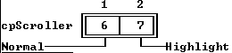

---

<a id="WFE_NJ"></a>

### TScroller::TScroller

*Keywords: TScroller::TScroller*

[See Also](#3VWGZG8)	 [TScroller class](#TScroller)

 Form 1

 
```c
TScroller( const TRect& bounds, TScrollBar *aHScrollBar, TScrollBar *aVScrollBar );
```
 Form 2

 
```c
TScroller( StreamableInit streamableInit );  //protected
```
#### Description
 Form 1: Creates and initializes a  TScrollerobject with the given size and scroll bars. Calls  TViewconstructor to set the view's size. * option sis set to * ofSelectableand * eventMaskis set to * evBroadcast. * aHScrollBarshould be 0 if you do not want a horizontal scroll bar; similarly, * aVScrollBarshould be 0 if you do not want a vertical scroll bar.

  Form 2: Each streamable class needs a "builder" to allocate the correct memory for its objects together with the initialized vtable pointers. This is achieved by calling this constructor with an argument of type  StreamableInit.

---

<a id="3VWGZG8"></a>

#### See Also
 [TView::TView](#TView_TView)

 [TView::options](#IKGEF4)

 [TView::eventMask](#HQ.SC1)

---

<a id="TScroller_delta"></a>

### TScroller::delta

*Keywords: delta*

[See Also](#XND23I)	 [TScroller class](#TScroller)
#### Syntax
```c
TPoint delta;
```
#### Description
 *deltaholds the * x(horizontal) and * y(vertical) components of the scroller's position relative to the virtual view being scrolled. Automatic scrolling is achieved by changing either or both of these components in response, for example, to scroll bar events that change the * valuedata member(s). Conversely, manual scrolling changes * delta, triggers changes in the scroll bar * valuedata members, and leads to updating of the scroll bar indicators.

---

<a id="XND23I"></a>

#### See Also
 [TScroller::scrollDraw](#O7T9CN)

 [TScroller::scrollTo](#1EQON4K)

---

<a id="2_BJSJ5"></a>

### TScroller::drawFlag

*Keywords: drawFlag*

[See Also](#4RW.JO)	 [TScroller class](#TScroller)
#### Syntax
```c
Boolean drawFlag;  //protected
```
#### Description
 Set * Trueif the scroller has to be redrawn.

---

<a id="4RW.JO"></a>

#### See Also
 [TView::drawView](#8P08.AT)

 [TScroller::drawLock](#1K9DW4T)

 [TScroller::checkDraw](#8VNZXO)

---

<a id="1K9DW4T"></a>

### TScroller::drawLock

*Keywords: drawLock*

[See Also](#AUBBX3)	 [TScroller class](#TScroller)
#### Syntax
```c
uchar drawlock;  //protected
```
#### Description
 A semaphore used to control the redrawing of scrollers.

---

<a id="AUBBX3"></a>

#### See Also
 [TView::drawView](#8P08.AT)

 [TScroller::drawFlag](#2_BJSJ5)

 [TScroller::checkDraw](#8VNZXO)

---

<a id="BG2QKL"></a>

### TScroller::hScrollBar

*Keywords: hScrollBar*

[TScroller class](#TScroller)
#### Syntax
```c
TScrollBar *hScrollBar;  //protected
```
#### Description
 *hScrollBarpoints to the horizontal scroll bar object associated with the scroller. If there is no such scroll bar, * hScrollBaris 0.

---

<a id="TScroller_limit"></a>

### TScroller::limit

*Keywords: limit*

[See Also](#GJ_HFM)	 [TScroller class](#TScroller)
#### Syntax
```c
TPoint limit;  //protected
```
#### Description
 *limit.xand * limit.yare the maximum allowed values for * delta.xand * delta.y

---

<a id="GJ_HFM"></a>

#### See Also
 [TScroller::delta](#TScroller_delta)

---

<a id="1B6GKD2"></a>

### TScroller::vScrollBar

*Keywords: vScrollBar*

[TScroller class](#TScroller)
#### Syntax
```c
TScrollBar *vScrollBar;  //protected
```
#### Description
 *vScrollBarpoints to the vertical scroll bar object associated with the scroller. If there is no such scroll bar, * vScrollBaris 0.

---

<a id="TScroller_build"></a>

### TScroller::build

*Keywords: build*

[See Also](#1MFTD9K)	 [TScroller class](#TScroller)
#### Syntax
```c
static TStreamable *build();
```
#### Description
 Called to create an object in certain stream-reading situations.

---

<a id="1MFTD9K"></a>

#### See Also
 [TStreamableClass](#TStreamableClass)

 [ipstream::readData](#3MVS.PE)

---

<a id="120J3TN"></a>

### TScroller::changeBounds

*Keywords: changeBounds*

[See Also](#FCZTC1)	 [TScroller class](#TScroller)
#### Syntax
```c
virtual void changeBounds(const TRect& bounds)
```
#### Description
 Changes the scroller's size by calling  setbounds. If necessary, the scroller and scroll bars are then redrawn by calling  drawViewand  setLimit.

---

<a id="FCZTC1"></a>

#### See Also
 [TView::setbounds](#3XWV_DV)

 [TView::drawView](#8P08.AT)

 [TScroller::setLimit](#1F2SP9K)

---

<a id="8VNZXO"></a>

### TScroller::checkDraw

*Keywords: checkDraw*

[TScroller class](#TScroller)
#### Syntax
```c
void checkDraw();
```
#### Description
 If * drawLockis zero and * drawFlagis * True, * drawFlagis set * Falseand  drawViewis called. If * drawLockis non-zero or * drawFlagis * False,  checkDrawdoes nothing.  scrollToand  setLimiteach call  checkDrawso that  drawViewis only called if needed.

---

<a id="KICXQR"></a>

### TScroller::getPalette

*Keywords: getpalette*

[TScroller class](#TScroller)
#### Syntax
```c
virtual TPalette& getPalette() const;
```
#### Description
 Returns * cpScroller, the default scroller palette string, "".

---

<a id="0VMKQF"></a>

### TScroller::handleEvent

*Keywords: handleEvent*

[See Also](#PH6HU3)	 [TScroller class](#TScroller)
#### Syntax
```c
virtual void handleEvent(TEvent& event);
```
#### Description
 Handles most events by calling  TView::handleEvent. Broadcast events such as * cmScrollBarChangedfrom either * hScrollBaror * vScrollBarresult in a call to  TScroller::scrollDraw.

---

<a id="PH6HU3"></a>

#### See Also
 [TView::handleEvent](#4H2TBJ)

 [TScroller::scrollDraw](#O7T9CN)

---

<a id="TScroller_read"></a>

### TScroller::read

*Keywords: read*

[See Also](#6_TFX5)	 [TScroller class](#TScroller)
#### Syntax
```c
virtual void *read( ipstream& is);   //protected
```
#### Description
 Reads from the input stream * is.

---

<a id="6_TFX5"></a>

#### See Also
 [TStreamableClass](#TStreamableClass)

 [TStreamable](#TStreamable)

 [ipstream](#ipstream)

---

<a id="O7T9CN"></a>

### TScroller::scrollDraw

*Keywords: scrollDraw*

[See Also](#1KU9_NT)	 [TScroller class](#TScroller)
#### Syntax
```c
virtual void scrollDraw();
```
#### Description
 Checks to see if * deltamatches the current positions of the scroll bars. If not, * deltais set to the correct value and  drawViewis called to redraw the scroller.

---

<a id="1KU9_NT"></a>

#### See Also
 [TView::drawView](#8P08.AT)

 [TScroller::delta](#TScroller_delta)

 [TScroller::hScrollBar](#BG2QKL)

 [TScroller::vScrollBar](#1B6GKD2)

---

<a id="1EQON4K"></a>

### TScroller::scrollTo

*Keywords: scrollTo*

[See Also](#11XRRE5)	 [TScroller class](#TScroller)
#### Syntax
```c
void scrollTo(short x, short y);
```
#### Description
 Sets the scroll bars to (* x,* y) by calling * hScrollBar->setValue(x)and * vScrollBar->setValue(y), and redraws the view by calling  drawView, if necessary.

---

<a id="11XRRE5"></a>

#### See Also
 [TView::drawView](#8P08.AT)

 [TScroller::checkDraw](#8VNZXO)

---

<a id="1F2SP9K"></a>

### TScroller::setLimit

*Keywords: setLimit*

[See Also](#1KABZHF)	 [TScroller class](#TScroller)
#### Syntax
```c
void setLimit(short x, short y);
```
#### Description
 Sets the * limitdata member and redraws the scroll bars and scroller if necessary.

---

<a id="1KABZHF"></a>

#### See Also
 [TScroller::limit](#TScroller_limit)

 [TScroller::hScrollBar](#BG2QKL)

 [TScroller::vScrollBar](#1B6GKD2)

 [TScrollBar::setParams](#MNK5IW)

 [TScroller::checkDraw](#8VNZXO)

---

<a id="1F03DD."></a>

### TScroller::setState

*Keywords: setstate*

[See Also](#19LTR9N)	 [TScroller class](#TScroller)
#### Syntax
```c
virtual void setState(ushort aState, Boolean enable);
```
#### Description
 This member function is called whenever the scroller's state changes. Calls  TView::setStateto set or clear the state flags in * aState. If the new state is * sfSelectedand * sfActive,  setStatedisplays the scroll bars; otherwise, they are hidden.

---

<a id="19LTR9N"></a>

#### See Also
 [TView::setState](#DL958G)

---

<a id="167_TSK"></a>

### TScroller::shutDown

*Keywords: shutDown*

[TScroller class](#TScroller)
#### Syntax
```c
virtual void shutDown();
```
#### Description
 Sets * hScrollBarand * vScrollBarpointers to 0 and calls  TView::shutDown().

---

<a id="TScroller_write"></a>

### TScroller::write

*Keywords: write*

[See Also](#CVIS_E)	 [TScroller class](#TScroller)
#### Syntax
```c
virtual void write( opstream& os);   //protected
```
#### Description
 Writes to the output stream * os.

---

<a id="CVIS_E"></a>

#### See Also
 [TStreamableClass](#TStreamableClass)

 [TStreamable](#TStreamable)

 [opstream](#opstream)

---

<a id="TSItem"></a>

### TSItem Class

*Keywords: TSItem*

[Inheritance](#TVFlow_1)
#### Header File
 dialogs.h
#### Description
 TSItemis a simple, non-view class providing a singly-linked list of character strings. This class is useful when the full flexibility of string collections is not needed (see  TClusterfor example).

 Constructors

 
```c
TSItem
```

```c
08L_0P(const char *aValue, TSItem *aNext);

 ~ TSItem
```

```c
08L_0P();
```
#### Data Members
```c
TSItem * next
```

```c
TSItem_next;

 const char * value
```

```c
TSItem_value;
```

---

<a id="08L_0P"></a>

### TSItem::TSItem

*Keywords: TSItem::TSItem*

[TSItem class](#TSItem)
#### Syntax
```c
TSItem(const char *aValue, TSItem *aNext);
```
#### Description
 Creates a  TSItemobject with the given values.

 Destructor

 
```c
~TSItem();
```
 Destroys the  TSItemobject by calling  delete* value.

---

<a id="TSItem_next"></a>

### TSItem::next

*Keywords: next*

[TSItem class](#TSItem)
#### Syntax
```c
TSItem *next;
```
#### Description
 Pointer to the next  TSItemobject in the linked list.

---

<a id="TSItem_value"></a>

### TSItem::value

*Keywords: value*

[TSItem class](#TSItem)
#### Syntax
```c
const char *value;
```
#### Description
 The string for this  TSItemobject.

---

<a id="TSortedCollection"></a>

### TSortedCollection Class

*Keywords: TSortedCollection*

[Inheritance](#TVFlow_1)
#### Header File
 objects.h
#### Description
 The abstract class  TSortedCollectionis a specialized derivative of both  TCollectionand  TNSSortedCollectionimplementing streamable collections sorted by a key (with or without duplicates). No instances of  TSortedCollectionare allowed. It exists solely as a base for other standard or user-defined derived classes.

 Sorting is implied by the pure virtual (and private) member function  compare, which you must override in your derived classes to provide your own definition of element ordering. As new items are added they are automatically inserted in the order given by  compare. Items can be located using the  searchfunction inherited from  TNSSortedCollection. The virtual  indexOffunction (also inherited from  TNSSortedCollection), which returns a pointer for  compare, can also be overridden if  compareneeds additional information.

 For streamable sorted collections, you must use this class. Apart from streamability, the two classes  TSortedCollectionand  TNSSortedCollectionoffer the same functionality.

 Constructors

 
```c
TSortedCollection
```

```c
8S1JDY(ccIndex aLimit, ccIndex aDelta);

  TTSortedCollection
```

```c
8S1JDY( StreamableInit streamableInit);
```
#### Member Functions
```c
virtual int  compare
```

```c
3A13_0P(void *key1, void *key2) = 0;

 void  read
```

```c
TSortedCollection_read( ipstream& is );   //protected

 void *TSortedCollection:: readItem
```

```c
2U5E06( ipstream& is ) = 0;

 void  write
```

```c
TSortedCollection_write( opstream& os );   //protected

 void TSortedCollection:: writeItem
```

```c
PZKWHR( void *obj, opstream& os ) = 0;
```

---

<a id="8S1JDY"></a>

### TSortedCollection::TSortedCollection

*Keywords: TSortedCollection::TSortedCollection*

[See Also](#PGMBOU)	 [TSortedCollection class](#TSortedCollection)

 Form 1

 
```c
TSortedCollection(ccIndex aLimit, ccIndex aDelta);
```
 Form 2

 
```c
TTSortedCollection( StreamableInit streamableInit);  //protected
```
#### Description
 Form 1: Invokes the  TCollectionconstructor to set * count, * items, and * limitto zero; calls  setLimit(* aLimit) to set the collection limit to * aLimit, then sets * deltato * aDelta. Note that * ccIndexis a typedef'd  int. * duplicatesis set to * False. If you want to allow duplicate keys, you must set * duplicates* True.

  Form 2: Each streamable class needs a "builder" to allocate the correct memory for its objects together with the initialized vtable pointers. This is achieved by calling this constructor with an argument of type  StreamableInit.

---

<a id="PGMBOU"></a>

#### See Also
 [TCollection::TCollection](#_1BR_.)

 [TCollection data members](#TCollection)

---

<a id="3A13_0P"></a>

### TSortedCollection::compare

*Keywords: compare*

[See Also](#HL_QEU)	 [TSortedCollection class](#TSortedCollection)
#### Syntax
```c
virtual int compare(void *key1, void *key2) = 0;  //private
```
#### Description
 compareis a pure virtual function that must be overridden in all derived classes (or redefined as pure virtual).

---

<a id="HL_QEU"></a>

#### See Also
 [TNSSortedCollection::compare](#44U7MC)

---

<a id="TSortedCollection_read"></a>

### TSortedCollection::read

*Keywords: read*

[See Also](#2_WHFUH)	 [TSortedCollection class](#TSortedCollection)
#### Syntax
```c
void read( ipstream& is );  //protected
```
#### Description
 Reads a sorted collection from the input stream * is.

---

<a id="2_WHFUH"></a>

#### See Also
 [TStreamableClass](#TStreamableClass)

 [TStreamable](#TStreamable)

 [ipstream](#ipstream)

---

<a id="2U5E06"></a>

### TSortedCollection::readItem

*Keywords: readItem*

[See Also](#77LVV8)	 [TSortedCollection class](#TSortedCollection)
#### Syntax
```c
void *TSortedCollection::readItem( ipstream& is ) = 0;  //protected
```
#### Description
 private

 Called for each item in the collection. You'll need to override these in everything derived from  TCollectionor  TSortedCollectionin order to read the items correctly.

---

<a id="77LVV8"></a>

#### See Also
 [TStreamableClass](#TStreamableClass)

 [TStreamable](#TStreamable)

 [ipstream](#ipstream)

---

<a id="TSortedCollection_write"></a>

### TSortedCollection::write

*Keywords: write*

[See Also](#.T59P6)	 [TSortedCollection class](#TSortedCollection)
#### Syntax
```c
void write( opstream& os );  //protected
```
#### Description
 Writes the associated  TSortedCollectionobject to the output stream os.

---

<a id=".T59P6"></a>

#### See Also
 [TStreamableClass](#TStreamableClass)

 [TStreamable](#TStreamable)

 [opstream](#opstream)

---

<a id="PZKWHR"></a>

### TSortedCollection::writeItem

*Keywords: writeItem*

[See Also](#DQ1AYE)	 [TSortedCollection class](#TSortedCollection)
#### Syntax
```c
void TSortedCollection::writeItem( void *obj, opstream& os ) = 0;  //private
```
#### Description
 Called for each item in the collection. You'll need to override these in everything derived from  TCollectionor  TSortedCollectionin order to write the items correctly.

---

<a id="DQ1AYE"></a>

#### See Also
 [TStreamableClass](#TStreamableClass)

 [TStreamable](#TStreamable)

 [opstream](#opstream)

---

<a id="TSortedListBox"></a>

### TSortedListBox Class

*Keywords: TSortedListBox*

[Inheritance](#TVFlow_2)
#### Header File
 stddlg.h
#### Description
 TSortedListBoxis a specialized  TListBoxderivative that maintains its items in a sorted sequence. It is intended as a base for other list box classes, such as  TFileList.

 Constructors

 
```c
TSortedListBox
```

```c
CKUTFD( const TRect& bounds, ushort aNumCols, TScrollBar *aScrollBar );
```
#### Member Functions
```c
virtual void * getKey
```

```c
29QKMG5(const char *s);

 virtual void  handleEvent
```

```c
NE05BA(TEvent& event);

 TSortedCollection * list
```

```c
TSortedListBox_List();

 void  newList
```

```c
85J9WL(TSortedCollection *aList);
```

---

<a id="CKUTFD"></a>

### TSortedListBox::TSortedListBox

*Keywords: TSortedListBox::TSortedListBox*

[TSortedListBox class](#TSortedListBox)
#### Syntax
```c
TSortedListBox( const TRect& bounds, ushort aNumCols, TScrollBar *aScrollBar );
```
#### Description
 Calls  TListBox::TListBox(* bounds, * aNumCols, * aScrollBar) to create a list box with the given size, number of columns, and vertical scroll bar. * shiftStateis set to 0 and the cursor is set at the first item.

---

<a id="29QKMG5"></a>

### TSortedListBox::getKey

*Keywords: getKey*

[TSortedListBox class](#TSortedListBox)
#### Syntax
```c
virtual void *getKey(const char *s);  //private
```
#### Description
 You must define this private member function in all derived classes to provide a means of returning the key for the given string * s. This will depend on the sorting strategy adopted in your derived class. By default,  getKeyreturns * s.

---

<a id="NE05BA"></a>

### TSortedListBox::handleEvent

*Keywords: handleEvent*

[See Also](#1_K.9LB)	 [TSortedListBox class](#TSortedListBox)
#### Syntax
```c
virtual void handleEvent(TEvent& event);
```
#### Description
 Calls  TListBox::handleEvent, then handles the special key and mouse events used to select items from the list.

---

<a id="1_K.9LB"></a>

#### See Also
 [TListViewer::handleEvent](#1TNG9E9)

---

<a id="TSortedListBox_List"></a>

### TSortedListBox::list

*Keywords: list*

[See Also](#B4PXRT)	 [TSortedListBox class](#TSortedListBox)
#### Syntax
```c
TSortedCollection *list();
```
#### Description
 Returns a pointer to the  TSortedCollectionobject currently associated with this sorted list box. This gives access to the private * itemsdata member, which is a pointer to the items to be listed and selected. Derived sorted list box classes typically override  listto provide a pointer to objects of a class derived from  TSortedCollection. For example,  TFileList::listreturns a pointer to the  TFileCollectionobject specified by  TFileList::items.

---

<a id="B4PXRT"></a>

#### See Also
 [TSortedListBox::list](#TSortedListBox_List)

 [TListBox::list](#TListBox_List)

 [TFileList::list](#TFileList_List)

---

<a id="85J9WL"></a>

### TSortedListBox::newList

*Keywords: newList*

[See Also](#1N8C2B6)	 [TSortedListBox class](#TSortedListBox)
#### Syntax
```c
void newList(TSortedCollection *aList);
```
#### Description
 Calls  TListBox::newListto delete the existing  TSortedCollectionobject associated with this list box and replace it with the collection given by * aList. The first item of the new collection will receive the focus.

---

<a id="1N8C2B6"></a>

#### See Also
 [TListBox::newList](#BL_IUE)

---

<a id="TStatusDef"></a>

### TStatusDef Class

*Keywords: TStatusDef*

[Inheritance](#TVFlow_2)
#### Header File
 menus.h
#### Description
 A  TStatusDefobject is not a view but represents a status line definition used by a  TStatusLineview to display context-sensitive status lines. The * nextdata member points to the next  TStatusDefobject in a list of status lines (or 0 if this is the last such). * minand * maxdefine the range of help contexts that correspond to the status line. * itemspoints to a list of status items that make up the status line.

 A  TStatusLineobject has a pointer called * defsto a linked list of  TStatusDefobjects.  TStatusLinealways displays the first status item for which the current help context value is within * minand * max.  TStatusLine::updatecan be called from  TProgram::idleto regularly update the status line view.

 Constructors

 
```c
TStatusDef
```

```c
ZHC86H( ushort aMin, ushort aMax, TStatusItem *someItems = 0, TStatusDef *aNext = 0 );

 TStatusItem * items
```

```c
TStatusDef_items;
```
#### Data Members
```c
ushort  max
```

```c
TStatusDef_min;
```

```c
ushort  min
```

```c
TStatusDef_min;
```

```c
TStatusDef * next
```

```c
TStatusDef_next;
```

---

<a id="ZHC86H"></a>

### TStatusDef::TStatusDef

*Keywords: TStatusDef::TStatusDef*

[TStatusDef class](#TStatusDef)
#### Syntax
```c
TStatusDef( ushort aMin, ushort aMax, TStatusItem *someItems = 0, TStatusDef *aNext = 0 );
```
#### Description
 Creates a  TStatusDefobject with the given values.

---

<a id="TStatusDef_items"></a>

### TStatusDef::items

*Keywords: items*

[See Also](#GD7S1K)	 [TStatusDef class](#TStatusDef)
#### Syntax
```c
TStatusItem *items;
```
#### Description
 *itemspoints to a list of status items that make up the status line. A value of 0 indicates that there are no status items.

---

<a id="GD7S1K"></a>

#### See Also
 [TStatusLine class](#TStatusLine)

 [TStatusItem class](#TStatusItem)

---

<a id="TStatusDef_min"></a>

### TStatusDef::min and TStatusDef::max

*Keywords: max, min*

[See Also](#7UG6B6)	 [TStatusDef class](#TStatusDef)
#### Syntax
```c
ushort min, max;
```
#### Description
 The minimum and maximum help context values for which this status definition is associated.  TStatusLinealways displays the first status item for which the current help context value is within * minand * max.

---

<a id="7UG6B6"></a>

#### See Also
 [TStatusLine::draw](#TStatusLine_draw)

---

<a id="TStatusDef_next"></a>

### TStatusDef::next

*Keywords: next*

[TStatusDef class](#TStatusDef)
#### Syntax
```c
TStatusDef *next;
```
#### Description
 A nonzero * nextpoints to the next  TStatusDefobject in a list of status definitions. A 0 value indicates that this  TStatusDefobject is the last such in the list.

---

<a id="TStatusItem"></a>

### TStatusItem Class

*Keywords: TStatusItem*

[Inheritance](#TVFlow_2)
#### Header File
 menus.h
#### Description
 A  TStatusItemobject is not a view but represents a component (status item) of a linked list associated with a  TStatusLineview. The latter can display a status line and handle status line events such as hot keys and clicking on items. Status items can be visible or invisible. In the latter case, the item serves only to define a hot key. * nextpoints to the next  TStatusItemin the list, or is 0 if this is the last item. * textis a character string holding an item legend (such as- "Alt-X~ Exit"). If * textis 0, the status item is invisible. * keyCodecontains the scan code of the hot key associated with the item, or zero if there is no such hot key. * commandholds the command event to be generated when the scan item is selected via hot key or mouse click.

 TStatusItemserves two purposes: it controls the visual appearance of the status line, and it defines hot keys by mapping key codes to commands.  TProgram::getEventcalls  TStatusLine::handleEventfor all * evKeyDownevents and the items in the current status line are scanned for matching key codes. If a match is found, the * evKeyDownevent is converted to the * evCommandevent given by the * commanddata member in the matching status item object.

 Constructors

 
```c
TStatusItem
```

```c
XLNXKR(const char *aText, ushort key, ushort cmd, TStatusItem *aNext = 0);
```
#### Data Members
```c
ushort  command
```

```c
N7G3LJ;

 ushort  keyCode
```

```c
_TYFW7;

 TStatusItem * next
```

```c
TStatusItem_next;

 const char * text
```

```c
TStatusItem_text;
```

---

<a id="XLNXKR"></a>

### TStatusItem::TStatusItem

*Keywords: TStatusItem::TStatusItem*

[TStatusItem class](#TStatusItem)
#### Syntax
```c
TStatusItem(const char *aText, ushort key, ushort cmd, TStatusItem *aNext = 0);
```
#### Description
 Creates a  TStatusItemobject with the given values.

---

<a id="N7G3LJ"></a>

### TStatusItem::command

*Keywords: command*

[TStatusItem class](#TStatusItem)
#### Syntax
```c
ushort command;
```
#### Description
 The value of the command associated with this status item.

---

<a id="_TYFW7"></a>

### TStatusItem::keyCode

*Keywords: keyCode*

[TStatusItem class](#TStatusItem)
#### Syntax
```c
ushort keyCode;
```
#### Description
 This is the scan code for the associated hot key.

---

<a id="TStatusItem_next"></a>

### TStatusItem::next

*Keywords: next*

[TStatusItem class](#TStatusItem)
#### Syntax
```c
TStatusItem *next;
```
#### Description
 A nonzero * nextpoints to the next  TStatusItemobject in the linked list associated with a status line. A 0 value indicates that this is the last item in the list.

---

<a id="TStatusItem_text"></a>

### TStatusItem::text

*Keywords: text*

[See Also](#LTC6YT)	 [TStatusItem class](#TStatusItem)
#### Syntax
```c
const char *text;
```
#### Description
 The text string to be displayed for this status item. If 0, no legend will display, meaning that the status item is intended only to define a hot key using the * keyCodemember.

---

<a id="LTC6YT"></a>

#### See Also
 [TStatusLine class](#TStatusLine)

---

<a id="TStatusLine"></a>

### TStatusLine Class

*Keywords: TStatusLine*

[Inheritance](#TVFlow_2)
#### Header File
 menus.h
#### Description
 The  TStatusLineobject is a specialized view, usually displayed at the bottom of the screen. Typical status line displays are lists of available hot keys, displays of available memory, time of day, current edit modes, and hints for users. The items to be displayed are set up in a linked list using  initStatusLinecalled by  TApplication, and the one displayed depends on the help context of the currently focused view. Like the menu bar and desktop, the status line is normally owned by a  TApplicationgroup.

 Status line items are  TStatusItem objects that contain data members for a text string to be displayed on the status line, a key code to bind a hot key (typically a function key or an Alt-key combination), and a command to be generated if the displayed text is clicked on with the mouse or the hot key is pressed.

 Each status line object contains a linked list of status line * defs(objects of class  TStatusDef), which define a range of help contexts and a list of status items to be displayed when the current help context is in that range. In addition, * hintsor predefined strings can be displayed according to the current help context.

 Constructors

 
```c
TStatusLine
```

```c
D6WQJE(const TRect& bounds, TStatusDef& aDefs);

  TStatusLine
```

```c
D6WQJE( StreamableInit streamableInit);

 ~ TStatusLine
```

```c
D6WQJE();
```
#### Data Members
```c
TStatusDef * defs
```

```c
TStatusLine_defs;

 TStatusItem * items
```

```c
TStatusLine_items;
```
#### Member Functions
```c
static TStreamable * build
```

```c
TStatusLine_build();

 virtual void  draw
```

```c
TStatusLine_draw();

 virtual const char *  getPalette
```

```c
17UK9DO() const;

 virtual void  handleEvent
```

```c
BODN9U(TEvent& event);

 virtual const char*  hint
```

```c
TStatusLine_hint(ushort aHelpCtx);

 virtual void * read
```

```c
TStatusLine_read( ipstream& is);   //protected

 void  update
```

```c
T1GDSE();

 virtual void  write
```

```c
TStatusLine_write( opstream& os);   //protected
```
 Palette

 Status lines use the default palette * cpStatusLineto map onto the second through seventh entries in the standard application palette.

 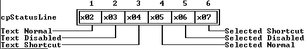

---

<a id="D6WQJE"></a>

### TStatusLine::TStatusLine

*Keywords: TStatusLine::TStatusLine*

[TStatusLine class](#TStatusLine)

 Form 1

 
```c
TStatusLine(const TRect& bounds, TStatusDef& aDefs);
```
 Form 2

 
```c
TStatusLine( StreamableInit streamableInit);  //protected
```
#### Description
 Form 1: Creates a  TStatusLineobject with the given * boundsby calling  TView(* bounds)The * ofPreProcessbit in * optionsis set, * eventMaskis set to include * evBroadcast, * GrowModeis set to * gfGrowLoY| * gfGrowHiX| * gfGrowHiY. The * defsdata member is set to * aDefsIf * aDefsis 0, * itemsis set to 0; otherwise, * itemsis set to * aDefs->items.

 Form 2: Each streamable class needs a "builder" to allocate the correct memory for its objects together with the initialized vtable pointers. This is achieved by calling this constructor with an argument of type StreamableInit.

 Destructor

 
```c
~TStatusLine();
```
#### Description
 Disposes of all the * items* defsin the  TStatusLineobject, then calls  ~View.

---

<a id="TStatusLine_defs"></a>

### TStatusLine::defs

*Keywords: defs*

[See Also](#1I.BMI)	 [TStatusLine class](#TStatusLine)
#### Syntax
```c
TStatusDef *defs;  //protected
```
#### Description
 A pointer to the current linked list of  TStatusDefobjects. The list to use is determined by the current help context.

---

<a id="1I.BMI"></a>

#### See Also
 [TStatusDef](#TStatusDef)

 [TStatusLine::update](#T1GDSE)

 [TStatusLine::hint](#TStatusLine_hint)

---

<a id="TStatusLine_items"></a>

### TStatusLine::items

*Keywords: items*

[See Also](#ECEJFY)	 [TStatusLine class](#TStatusLine)
#### Syntax
```c
TStatusItem *items;  //protected
```
#### Description
 A pointer to the current linked list of  TStatusItemrecords.

---

<a id="ECEJFY"></a>

#### See Also
 [TStatusItem](#TStatusItem)

---

<a id="TStatusLine_build"></a>

### TStatusLine::build

*Keywords: build*

[See Also](#26Q.37C)	 [TStatusLine class](#TStatusLine)
#### Syntax
```c
static TStreamable *build();
```
#### Description
 Called to create an object in certain stream-reading situations.

---

<a id="26Q.37C"></a>

#### See Also
 [TStreamableClass](#TStreamableClass)

 [ipstream::readData](#3MVS.PE)

---

<a id="TStatusLine_draw"></a>

### TStatusLine::draw

*Keywords: draw*

[See Also](#3BNK4X)	 [TStatusLine class](#TStatusLine)
#### Syntax
```c
virtual void draw();
```
#### Description
 Draws the status line by writing the * textstring for each status item that has one, then any  hints defined for the current help context, following a divider bar.  drawuses the appropriate palettes, * cpNormal, * cpSelect, * cpNormDisabled, or * cpSelDisabled, depending on each item's status.

---

<a id="3BNK4X"></a>

#### See Also
 [TStatusLine::hint](#TStatusLine_hint)

---

<a id="17UK9DO"></a>

### TStatusLine::getPalette

*Keywords: getpalette*

[TStatusLine class](#TStatusLine)
#### Syntax
```c
virtual const char * getPalette() const;
```
#### Description
 Returns the default palette string, * cpStatusLine, "".

---

<a id="BODN9U"></a>

### TStatusLine::handleEvent

*Keywords: handleEvent*

[See Also](#5A5UAU)	 [TStatusLine class](#TStatusLine)
#### Syntax
```c
virtual void handleEvent(TEvent& event);
```
#### Description
 Handles events sent to the status line by calling  TView::handleEvent, then checking for three kinds of special events. Mouse clicks that fall within the rectangle occupied by any status item generate a command event, with * event.whatset to the * commandin that status item. Key events are checked against the * keyCodedata member in each item; a match causes a command event with that item's * command. Broadcast events with the command * cmCommandSetChangedcause the status line to redraw itself to reflect any hot keys that might have been enabled or disabled.

---

<a id="5A5UAU"></a>

#### See Also
 [TView::handleEvent](#4H2TBJ)

 [TStatusLine::draw](#TStatusLine_draw)

---

<a id="TStatusLine_hint"></a>

### TStatusLine::hint

*Keywords: hint*

[See Also](#53KS_M5)	 [TStatusLine class](#TStatusLine)
#### Syntax
```c
virtual const char* hint(ushort aHelpCtx);
```
#### Description
 By default,  hintreturns an empty string (""). You must override it to provide a context-sensitive hint string for the * aHelpCtxargument. A nonzero string will be drawn on the status line after a divider bar.

---

<a id="53KS_M5"></a>

#### See Also
 [TStatusLine::draw](#TStatusLine_draw)

---

<a id="TStatusLine_read"></a>

### TStatusLine::read

*Keywords: read*

[See Also](#EOT4_1)	 [TStatusLine class](#TStatusLine)
#### Syntax
```c
virtual void *read( ipstream& is);   //protected
```
#### Description
 Reads from the input stream * is.

---

<a id="EOT4_1"></a>

#### See Also
 [TStreamableClass](#TStreamableClass)

 [TStreamable](#TStreamable)

 [ipstream classes](#ipstream)

---

<a id="T1GDSE"></a>

### TStatusLine::update

*Keywords: update*

[See Also](#YHR84D)	 [TStatusLine class](#TStatusLine)
#### Syntax
```c
void update();
```
#### Description
 Updates the status line by selecting the correct items from the lists in * defs, depending on the current help context, and then calls  drawViewto redraw the status line if the items have changed.

---

<a id="YHR84D"></a>

#### See Also
 [TStatusLine::defs](#TStatusLine_defs)

---

<a id="TStatusLine_write"></a>

### TStatusLine::write

*Keywords: write*

[See Also](#0WPBNX)	 [TStatusLine class](#TStatusLine)
#### Syntax
```c
virtual void write( opstream& os);   //protected
```
#### Description
 Writes to the output stream * os.

---

<a id="0WPBNX"></a>

#### See Also
 [TStreamableClass](#TStreamableClass)

 [TStreamable](#TStreamable)

 [opstream classes](#opstream)

---

<a id="TStaticText"></a>

### TStaticText Class

*Keywords: TStaticText*

[Inheritance](#TVFlow_2)
#### Header File
 dialogs.h
#### Description
 TStaticTextobjects represent the simplest possible views: they contain fixed text and ignore all events passed to them. They are generally used as messages or passive labels. Descendants of  TStaticText, such as  TLabelobjects, usually perform more active roles.

 Constructors

 
```c
TStaticText
```

```c
5MT6_PV(const TRect& bounds, const char *aText);

  TStaticText
```

```c
5MT6_PV( StreamableInit streamableInit);

 ~ TStaticText
```

```c
5MT6_PV();
```
#### Data Members
```c
const char * text
```

```c
TStaticText_Text;
```
#### Member Functions
```c
static TStreamable * build
```

```c
TStaticText_build();

 virtual void  draw
```

```c
TStaticText_draw();

 virtual TPalette&  getPalette
```

```c
8SHOTI() const;

 virtual void  getText
```

```c
G9N1J0( char * );

 virtual void * read
```

```c
TStaticText_read( ipstream& is);   //protected

 virtual void  write
```

```c
TStaticText_write( opstream& os);   //protected
```
 Palette

 Static text objects use the default palette, * cpStaticText, to map onto the sixth entry in the standard dialog palette.

 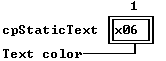

---

<a id="5MT6_PV"></a>

### TStaticText::TStaticText

*Keywords: TStaticText::TStaticText*

[See Also](#2NNU_X4)	 [TStaticText class](#TStaticText)

 Form 1

 
```c
TStaticText(const TRect& bounds, const char *aText);
```
 Form 2

 
```c
TStaticText( StreamableInit streamableInit);  //protected
```
#### Description
 Form 1: Creates a  TStaticTextobject of the given size by calling  TView(* bounds), then sets * textto  newStr(* aText).

  Form 2: Each streamable class needs a "builder" to allocate the correct memory for its objects together with the initialized vtable pointers. This is achieved by calling this constructor with an argument of type  StreamableInit. 

 Destructor

 
```c
~StaticText();
```
 Disposes of the * textstring, then calls  ~Viewto destroy the object.

---

<a id="2NNU_X4"></a>

#### See Also
 [TView::TView](#TView_TView)

---

<a id="TStaticText_Text"></a>

### TStaticText::text

*Keywords: text*

[TStaticText class](#TStaticText)
#### Syntax
```c
const char *text;  //protected
```
#### Description
 A pointer to the (constant) text string to be displayed in the view.*  textcan hold a maximum of 256 characters.

---

<a id="TStaticText_build"></a>

### TStaticText::build

*Keywords: build*

[See Also](#0FCAA8)	 [TStaticText class](#TStaticText)
#### Syntax
```c
static TStreamable *build();
```
#### Description
 Called to create an object in certain stream-reading situations.

---

<a id="0FCAA8"></a>

#### See Also
 [TStreamableClass](#TStreamableClass)

 [ipstream::readData](#3MVS.PE)

---

<a id="TStaticText_draw"></a>

### TStaticText::draw

*Keywords: draw*

[TStaticText class](#TStaticText)
#### Syntax
```c
virtual void draw();
```
#### Description
 Draws the text string inside the view, word wrapped if necessary. A '' in the text indicates the beginning of a new line. A line of text is centered in the view if the string begins with 0x03 (Ctrl-C).

---

<a id="8SHOTI"></a>

### TStaticText::getPalette

*Keywords: getpalette*

[TStaticText class](#TStaticText)
#### Syntax
```c
virtual TPalette& getPalette() const;
```
#### Description
 Returns the default palette string, * cpStaticText, "".

---

<a id="G9N1J0"></a>

### TStaticText::getText

*Keywords: getText*

[TStaticText class](#TStaticText)
#### Syntax
```c
virtual void getText( char * );
```
#### Description
 getTextreturns the current text of the  TStaticTextcontrol.

---

<a id="TStaticText_read"></a>

### TStaticText::read

*Keywords: read*

[See Also](#BD6NL7)	 [TStaticText class](#TStaticText)
#### Syntax
```c
virtual void *read( ipstream& is);   //protected
```
#### Description
 Reads from the input stream * is.

---

<a id="BD6NL7"></a>

#### See Also
 [TStreamableClass](#TStreamableClass)

 [TStreamable](#TStreamable)

 [ipstream](#ipstream)

---

<a id="TStaticText_write"></a>

### TStaticText::write

*Keywords: write*

[See Also](#12G1O57)	 [TStaticText class](#TStaticText)
#### Syntax
```c
virtual void write( opstream& os);   //protected
```
#### Description
 Writes to the output stream * os.

---

<a id="12G1O57"></a>

#### See Also
 [TStreamableClass](#TStreamableClass)

 [TStreamable](#TStreamable)

 [opstream](#opstream)

---

<a id="TStringCollection"></a>

### TStringCollection Class

*Keywords: TStringCollection*

[See Also](#11AQ6KI)	 [Inheritance](#TVFlow_1)
#### Header File
 resource.h
#### Description
 TStringCollectionis a simple derivative of  TSortedCollectionimplementing a sorted list of ASCII strings.  TStringCollection::compareis overridden to provide the conventional lexicographic ASCII string ordering. You can override  compareto allow for other orderings, such as those for non-English character sets.

 Constructors

 
```c
TStringCollection
```

```c
1TQX0E(short aLimit, short aDelta);

  TStringCollection
```

```c
1TQX0E( StreamableInit streamableInit);
```
#### Member Functions
```c
static TStreamable * build
```

```c
TStringCollection_build();

 virtual int  compare
```

```c
VHFL4W(void *key1, void *key2);

 virtual void  freeItem
```

```c
18GARI1(void *item);

 virtual void * read
```

```c
TStringCollection_read( ipstream& is );   //protected

 void *TStringCollection:: readItem
```

```c
KJRLS_( ipstream& is );

 virtual void  write
```

```c
TStringCollection_write( opstream& os );   //protected

 void  writeItem
```

```c
12VQV7A( void *obj, opstream& os );   //private
```

---

<a id="11AQ6KI"></a>

#### See Also
 [TSortedCollection::TSortedCollection](#8S1JDY)

---

<a id="1TQX0E"></a>

### TStringCollection::TStringCollection

*Keywords: TStringCollection::TStringCollection*

[TStringCollection class](#TStringCollection)

 Form 1

 
```c
TStringCollection(short aLimit, short aDelta);
```
 Form 2

 
```c
TStringCollection( StreamableInit streamableInit);  //protected
```
#### Description
 Form 1: Creates a  TStringCollectionobject with the given values.

  Form 2: Each streamable class needs a "builder" to allocate the correct memory for its objects together with the initialized vtable pointers. This is achieved by calling this constructor with an argument of type  StreamableInit.

---

<a id="TStringCollection_build"></a>

### TStringCollection::build

*Keywords: build*

[See Also](#2L_.Z5I)	 [TStringCollection class](#TStringCollection)
#### Syntax
```c
static TStreamable *build();
```
#### Description
 Called to create an object in certain stream-reading situations.

---

<a id="2L_.Z5I"></a>

#### See Also
 [TStreamableClass](#TStreamableClass)

 [ipstream::readData](#3MVS.PE)

---

<a id="VHFL4W"></a>

### TStringCollection::compare

*Keywords: compare*

[See Also](#11Z9UZ4)	 [TStringCollection class](#TStringCollection)
#### Syntax
```c
virtual int compare(void *key1, void *key2); //private
```
#### Description
 Compares the "strings" * key1and * key2as follows: return <0, 0, >0 if * key1< * key2; 0 if * key1= * key2; and +1 if * key1> * key2.

---

<a id="11Z9UZ4"></a>

#### See Also
 [TNSSortedCollection::search](#R8LBX5)

---

<a id="18GARI1"></a>

### TStringCollection::freeItem

*Keywords: freeItem*

[TStringCollection class](#TStringCollection)
#### Syntax
```c
virtual void freeItem(void *item);  //private
```
#### Description
 Removes the string * itemfrom the sorted collection and disposes of the string.

---

<a id="TStringCollection_read"></a>

### TStringCollection::read

*Keywords: read*

[See Also](#IKCF6N)	 [TStringCollection class](#TStringCollection)
#### Syntax
```c
virtual void *read( ipstream& is );   //protected
```
#### Description
 Reads from the input stream * is.

---

<a id="IKCF6N"></a>

#### See Also
 [TStreamableClass](#TStreamableClass)

 [TStreamable](#TStreamable)

 [ipstream](#ipstream)

---

<a id="KJRLS_"></a>

### TStringCollection::readItem

*Keywords: readItem*

[See Also](#4JAMS1)	 [TStringCollection class](#TStringCollection)
#### Syntax
```c
void *TStringCollection::readItem( ipstream& is );  //private
```
#### Description
 Called for each item in the collection. You'll need to override these in everything derived from  TCollectionor  TSortedCollectionin order to read the items correctly.  TSortedCollectionalready overrides this function.

---

<a id="4JAMS1"></a>

#### See Also
 [TStreamableClass](#TStreamableClass)

 [TStreamable](#TStreamable)

 [ipstream](#ipstream)

---

<a id="TStringCollection_write"></a>

### TStringCollection::write

*Keywords: write*

[See Also](#2R4J__8)	 [TStringCollection class](#TStringCollection)
#### Syntax
```c
virtual void write( opstream& os );   //protected
```
#### Description
 Writes to the output stream * os.

---

<a id="2R4J__8"></a>

#### See Also
 [TStreamableClass](#TStreamableClass)

 [TStreamable](#TStreamable)

 [opstream](#opstream)

---

<a id="12VQV7A"></a>

### TStringCollection::writeItem

*Keywords: writeItem*

[See Also](#1ZRE.2O)	 [TStringCollection class](#TStringCollection)
#### Syntax
```c
void writeItem( void *obj, opstream& os );   //private
```
#### Description
 Called for each item in the collection. You'll need to override these in everything derived from  TCollectionor  TSortedCollectionin order to write the items correctly.  TSortedCollectionalready overrides this function.

---

<a id="1ZRE.2O"></a>

#### See Also
 [TStreamableClass](#TStreamableClass)

 [TStreamable](#TStreamable)

 [opstream](#opstream)

---

<a id="TStringList"></a>

### TStringList Class

*Keywords: TStringList*

[Inheritance](#TVFlow_1)
#### Header File
 resource.h
#### Description
 TStringListprovides a mechanism for accessing strings stored on a stream. Each string in a string list is identified by a unique number (ushort key) between 0 and 65,535. String lists take up less memory than normal string literals, since the strings are stored on a stream instead of in memory. Also, string lists permit easy internationalization, because the strings are not hard-coded in your program.

  TStringListhas member functions only for accessing strings; you must use  TStrListMakerto create string lists.

 Constructors

 
```c
TStringList
```

```c
ZE.EA( StreamableInit streamableInit);

 ~ TStringList
```

```c
ZE.EA();
```
#### Member Functions
```c
static TStreamable * build
```

```c
TStringList_build();

 void  get
```

```c
TStringList_get(char *dest, ushort key);

 virtual void * read
```

```c
TStringList_read( ipstream& is);   //protected

 virtual void  write
```

```c
TStringList_write( opstream& os);   //protected
```

---

<a id="ZE.EA"></a>

### TStringList::TStringList

*Keywords: TStringList::TStringList*

[See Also](#YTNHIN)	 [TStringList class](#TStringList)
#### Syntax
```c
TStringList( StreamableInit streamableInit);  //protected
```
#### Description
 Each streamable class needs a "builder" to allocate the correct memory for its objects together with the initialized vtable pointers. This is achieved by calling this constructor with an argument of type  StreamableInit. 

 Destructor

 
```c
~TStringList();
```
 Deallocates the memory allocated to the string list.

---

<a id="YTNHIN"></a>

#### See Also
 [TStrListMaker::TStrListMaker](#NLUHH4)

 [TStringList::get](#TStringList_get)

 [~TStringList](#ZE.EA)

---

<a id="1IGWCIS"></a>

### TStringList::TStrIndexRec

*Keywords: TStrIndexRec*

[TStringList class](#TStringList)
#### Description
 The small class  TStrIndexRecis used with string lists. It is defined as follows in resource.h:

 
```c
 class TStrIndexRec

 \-

 public:

    TStringIndexRec();  // constructor sets count=0

    ushort key;

    ushort count;

    ushort offset;
```
 The * indexdata member in  TStringListpoints to a  TStrIndexRecobject.

---

<a id="TStringList_build"></a>

### TStringList::build

*Keywords: build*

[See Also](#5G4Y0P)	 [TStringList class](#TStringList)
#### Syntax
```c
static TStreamable *build();
```
#### Description
 Called to create an object in certain stream-reading situations.

---

<a id="5G4Y0P"></a>

#### See Also
 [TStreamableClass](#TStreamableClass)

 [ipstream::readData](#3MVS.PE)

---

<a id="TStringList_get"></a>

### TStringList::get

*Keywords: get*

[See Also](#12DBTE5)	 [TStringList class](#TStringList)
#### Syntax
```c
void get (char *dest, ushort key);
```
#### Description
 Returns in * destthe string given by * key, or an empty string if there is no string with the given * key.

---

<a id="12DBTE5"></a>

#### See Also
 [TStrListMaker::put](#TStrListMaker_put)

---

<a id="TStringList_read"></a>

### TStringList::read

*Keywords: read*

[See Also](#2O8YCF)	 [TStringList class](#TStringList)
#### Syntax
```c
virtual void *read( ipstream& is);   //protected
```
#### Description
 Reads from the input stream * is.

---

<a id="2O8YCF"></a>

#### See Also
 [TStreamableClass](#TStreamableClass)

 [TStreamable](#TStreamable)

 [ipstream](#ipstream)

---

<a id="TStringList_write"></a>

### TStringList::write

*Keywords: write*

[See Also](#2Z8G0IT)	 [TStringList class](#TStringList)
#### Syntax
```c
virtual void write( opstream& os);   //protected
```
#### Description
 Writes to the output stream * os.

---

<a id="2Z8G0IT"></a>

#### See Also
 [TStreamableClass](#TStreamableClass)

 [TStreamable](#TStreamable)

 [opstream](#opstream)

---

<a id="TStringLookupValidator"></a>

### TStringLookupValidator Class

*Keywords: TStringLookupValidator*

#### Header File
 validate.h
#### Description
 A string lookup validator object verifies the data in its associated input line by searching through a collection of valid strings. Use string lookup validators when your input line needs to accept only members of a certain set of strings.

 Constructors

 
```c
StringLookupValidator
```

```c
2SI97AP( TStringCollection *aStrings);

 ~ StringLookupValidator
```

```c
2SI97AP();
```
 Protected Data Members

 
```c
TStringCollection * strings
```

```c
171UNUY;
```
#### Member Functions
```c
virtual void  error
```

```c
TStringLookupValidator_error();

 virtual Boolean  lookup
```

```c
1.UJ.WG( const char *S);

 void  newStringList
```

```c
6FW5LG( TStringCollection *aStrings );
```

---

<a id="2SI97AP"></a>

### TStringLookupValidator::TStringLookupValidator

*Keywords: TStringLookupValidator::TStringLookupValidator*

[See Also](#0FIAK_)	 [TStringLookupValidator class](#TStringLookupValidator)
#### Syntax
```c
StringLookupValidator( TStringCollection *aStrings);
```
#### Description
 Constructs a string lookup validator object by first calling the constructor inherited from  TLookupValidator, then setting * stringsto * aStrings.

 Destructor

 
```c
~TStringLookupValidator();
```
 Disposes of the list of valid strings by calling * NewStringList(NULL), then disposes of the string lookup object by calling the destructor inherited from  TLookupValidator.

---

<a id="0FIAK_"></a>

#### See Also
 [TStringLookupValidator::newStringList](#6FW5LG)

---

<a id="171UNUY"></a>

### TStringLookupValidator::strings

*Keywords: strings*

[TStringLookupValidator class](#TStringLookupValidator)
#### Syntax
```c
TStringCollection *strings;
```
#### Description
 Points to a string collection containing all the valid strings the user can type. If * stringsis NULL, all input will be invalid.

---

<a id="TStringLookupValidator_error"></a>

### TStringLookupValidator::error

*Keywords: error*

[TStringLookupValidator class](#TStringLookupValidator)
#### Syntax
```c
virtual void error();
```
#### Description
 Displays a message box indicating that the typed string does not match an entry in the string list.

---

<a id="1.UJ.WG"></a>

### TStringLookupValidator::lookup

*Keywords: lookup*

[See Also](#JJ1BGC)	 [TStringLookupValidator class](#TStringLookupValidator)
#### Syntax
```c
virtual Boolean lookup( const char *S);
```
#### Description
 Returns * Trueif the string passed in * Smatches any of the strings in * strings. Uses the  searchmember function of the string collection to determine if * Sis present.

---

<a id="JJ1BGC"></a>

#### See Also
 [TNSSortedCollection_search](#R8LBX5)

---

<a id="6FW5LG"></a>

### TStringLookupValidator::newStringList

*Keywords: newStringList*

[TStringLookupValidator class](#TStringLookupValidator)
#### Syntax
```c
void newStringList( TStringCollection *aStrings );
```
#### Description
 Sets the list of valid input strings for the string lookup validator. Disposes of any existing string list, then sets * stringsto * AStrings. Passing NULL in * AStringsdisposes of the existing list without assigning a new one.

---

<a id="TStrListMaker"></a>

### TStrListMaker Class

*Keywords: TStrListMaker*

[Inheritance](#TVFlow_1)
#### Header File
 resource.h
#### Description
 TStrListMakeris a simple object type used to create string lists for use with  TStringList.

 Constructors

 
```c
TStrListMaker
```

```c
NLUHH4(ushort aStrSize, ushort aIndexSize);

  TStrListMaker
```

```c
NLUHH4( StreamableInit streamableInit);

 ~ TStrListMaker
```

```c
NLUHH4();
```
#### Member Functions
```c
static TStreamable * build
```

```c
TStrListMaker_build();

 void  put
```

```c
TStrListMaker_put(ushort key, const char *s);

 virtual void  write
```

```c
TStrListMaker_write( opstream& os);
```

---

<a id="NLUHH4"></a>

### TStrListMaker::TStrListMaker

*Keywords: TStrListMaker::TStrListMaker*

[See Also](#G.WSJO)	 [TStrListMaker class](#TStrListMaker)

 Form 1

 
```c
TStrListMaker(ushort aStrSize, ushort aIndexSize);
```
 Form 2

 
```c
TStrListMaker( StreamableInit streamableInit);  //protected
```
#### Description
 Form 1: Creates an in-memory string list of size * aStrSizewith an index of * aIndexSizeelements. A string buffer and an index buffer of the specified size is allocated on the heap.

 * aStrSizemust be large enough to hold all strings to be added to the string list--each string occupies its length plus a final 0.

 As strings are added to the string list (using  TStrListMaker::put), a string index is built. Strings with contiguous keys are recorded in one index record, up to 16 at a time. * aIndexSizemust be large enough to allow for all index records generated as strings are added. Each index entry occupies 6 bytes.

  Form 2: Each streamable class needs a "builder" to allocate the correct memory for its objects together with the initialized vtable pointers. This is achieved by calling this constructor with an argument of type  StreamableInit. 

 Destructor

 
```c
~TStrListMaker();
```
 Frees the memory allocated to the string list maker.

---

<a id="G.WSJO"></a>

#### See Also
 [TStrListMaker::TStrListMaker](#NLUHH4)

 [~TStrListMaker](#NLUHH4)

---

<a id="TStrListMaker_build"></a>

### TStrListMaker::build

*Keywords: build*

[See Also](#3CCG5KE)	 [TStrListMaker class](#TStrListMaker)
#### Syntax
```c
static TStreamable *build();
```
#### Description
 Called to create an object in certain stream-reading situations.

---

<a id="3CCG5KE"></a>

#### See Also
 [TStreamableClass](#TStreamableClass)

 [ipstream::readData](#3MVS.PE)

 [TStreamable](#TStreamable)

---

<a id="TStrListMaker_put"></a>

### TStrListMaker::put

*Keywords: put*

[TStrListMaker class](#TStrListMaker)
#### Syntax
```c
void put(ushort key, const char *s);
```
#### Description
 Adds the given string * sto the calling string list (with the given numerical * key).

---

<a id="TStrListMaker_write"></a>

### TStrListMaker::write

*Keywords: write*

[See Also](#87CF40)	 [TStrListMaker class](#TStrListMaker)
#### Syntax
```c
virtual void write( opstream& os);
```
#### Description
 Writes to the output stream * os.

---

<a id="87CF40"></a>

#### See Also
 [TStreamableClass](#TStreamableClass)

 [TStreamable](#TStreamable)

 [opstream](#opstream)

---

<a id="TStreamable"></a>

### TStreamable Class

*Keywords: TStreamable*

[Inheritance](#TVFlow_1)
#### Header File
 tobjstrm.h
#### Description
 TViewhas two base classes,  TObjectand the abstract class  TStreamable. All the viewable classes, derived ultimately from  TView, therefore also inherit from  TStreamable. Several non-view classes, such as  TCollection,  TStrListMaker,  TStringList, and  T* xxxInit, also have  TStreamableas a base class. Such classes are known as * streamable, meaning that their objects can be written to and read from streams using the Turbo Vision stream manager.

 If you want to develop your own streamable classes, make sure that  TStreamableis somewhere in their ancestry. Using an existing streamable class as a base class is an easy way to do this.

 Since  TStreamableis an abstract class, no objects of this class can be instantiated. Before a streamable class can be used with streams, the class must override the three pure virtual functions  streamableName,  read, and  write.
#### Member Functions
```c
virtual void * read
```

```c
TStreamable_read( ipstream& is) = 0;   //protected

 virtual const char * streamableName
```

```c
SNQZYA() const = 0;

 virtual const char * streamableName
```

```c
SNQZYA() const \- return TViewName; 

 virtual void  write
```

```c
TStreamable_write( opstream& os) = 0;   //protected
```
 The classes  opstreamand  ipstreamare friends of TStreamable, so all their member functions can access the private members of  TStreamable.

---

<a id="TStreamable_read"></a>

### TStreamable::read

*Keywords: read*

[See Also](#13HI9YA)	 [TStreamable class](#TStreamable)
#### Syntax
```c
virtual void *read( ipstream& is) = 0;  //protected
```
#### Description
 This pure virtual function must be overridden (or redeclared as pure virtual) in every derived class. The overriding  readfunction for each streamable class must read the necessary data members from the ipstream object * is.  readis usually implemented by calling the base class's  read(if any), then extracting any additional data members for the derived class.

---

<a id="13HI9YA"></a>

#### See Also
 [ipstream](#ipstream)

 [TStreamableClass](#TStreamableClass)

---

<a id="SNQZYA"></a>

### TStreamable::streamableName

*Keywords: streamableName*

[See Also](#Y3NMCW)	 [TStreamable class](#TStreamable)

 Form 1

 
```c
virtual const char *streamableName() const = 0;  //private
```
 Form 2

 
```c
virtual const char *streamableName() const \- return TViewName;
```
#### Description
 Form 1: TStreamablehas no constructor. This function must be overridden (or redeclared as pure virtual) by every derived class. Its purpose is to return the name of the streamable class of the object that invokes it. This name is used in the registering of streams by the stream manager. For example,  TViewoverrides the function as follows:

  Form 2: TView::TViewNameis a static character array holding the name "TView". The name returned must be a unique, 0-terminated string, so the safest strategy is to use the name of the streamable class.

---

<a id="Y3NMCW"></a>

#### See Also
 [TStreamableClass](#TStreamableClass)

 [opstream](#opstream)

 [ipstream](#ipstream)

---

<a id="TStreamable_write"></a>

### TStreamable::write

*Keywords: write*

[See Also](#JVTDFG)	 [TStreamable class](#TStreamable)
#### Syntax
```c
virtual void write( opstream& os) = 0;  //protected
```
#### Description
 This pure virtual function must be overridden (or redeclared as pure virtual) in every derived class. The overriding write function for each streamable class must write the necessary data members to the opstream object * os. write is usually implemented by calling the base class's write (if any), then inserting any additional data members in the derived class.

---

<a id="JVTDFG"></a>

#### See Also
 [TStreamableClass](#TStreamableClass)

 [opstream](#opstream)

---

<a id="TStreamableClass"></a>

### TStreamableClass Class

*Keywords: TStreamableClass*

[See Also](#81AC0B)	 [Inheritance](#TVFlow_1)
#### Header File
 tobjstrm.h
#### Description
 TStreamableClassis used by  TStreamableTypesand  pstreamin the registration of streamable classes.

 Constructors

 
```c
TStreamableClass
```

```c
XWFV4B( const char *n, BUILDER b, int d );
```

---

<a id="81AC0B"></a>

#### See Also
 [TStreamable](#TStreamable)

 [TStreamableTypes](#TStreamableTypes)

 [TStreamableTypes::registerTypes](#U2S5G)

 [ipstream](#ipstream)

 [opstream](#opstream)

---

<a id="XWFV4B"></a>

### TStreamableClass::TStreamableClass

*Keywords: TStreamableClass::TStreamableClass*

[TStreamableClass class](#TStreamableClass)
#### Syntax
```c
TStreamableClass( const char *n, BUILDER b, int d );
```
#### Description
 Creates a  TStreamableobject with the given name and the given builder function, then calls  registerType. Each streamable class  T* Classnamehas a  buildmember function. There are also the familiar nonmember overloaded  >>and  <<operators for stream I/O associated with each streamable class. For type-safe object-stream I/O, the stream manager needs to access the names and the type information for each class. To ensure that the appropriate functions are linked into any application using the stream manager, you must provide an  externreference such as:

 
```c
 	 extern TStreamableClass registerTClassName;
```
 where  TClassNameis the name of the class for which objects need to be streamed. (Note that * registerTClassNameis a single identifier.) This not only registers  TClassName(telling the stream manager which  buildfunction to use), it also automatically registers any dependent classes. You can register a class more than once without any harm or overhead.

 * BUILDERis  typedefed as follows:

 
```c
 	 typedef TStreamable *(*BUILDER)();
```
 The classes  TStreamableTypes,  opstream, and  ipstreamare friends of  TStreamableClass, so all their member functions can access the private members of  TStreamableClass.

---

<a id="TStreamableTypes"></a>

### TStreamableTypes Class

*Keywords: TStreamableTypes*

[Inheritance](#TVFlow_1)
#### Header File
 tobjstrm.h
#### Description
 TStreamableTypes, derived privately from  TNSSortedCollection, maintains a database of all registered streamable types used in an application.  opstreamand  ipstreamuse this database to determine the correct  readand  writefunctions for particular objects. Because of the private derivation, all the inherited members are private within  TStreamableTypes.

 Constructors

 
```c
TStreamableTypes
```

```c
Y7NEEY();

 ~ TStreamableTypes
```

```c
Y7NEEY();
```
#### Member Functions
```c
const TStreamableClass * lookup
```

```c
1O.GQQ9( const char *name );

 void  registerTypes
```

```c
U2S5G( const TStreamableClass *d );
```

---

<a id="Y7NEEY"></a>

### TStreamableTypes::TStreamableTypes

*Keywords: TStreamableTypes::TStreamableTypes*

[See Also](#YXGI56)	 [TStreamableTypes class](#TStreamableTypes)
#### Syntax
```c
TStreamableTypes();
```
#### Description
 Calls the base  TNSCollectionconstructor to create a  TStreamableTypescollection.

 Destructor

 
```c
~TStreamableTypes();
```
 Sets the collection * limitto 0 without destroying the collection (since the * shouldDeletedata member is set to * False).

---

<a id="YXGI56"></a>

#### See Also
 [TNSCollection::TNSCollection](#2YCTTE)

 [TNSCollection::~TNSCollection](#2YCTTE)

 [TNSCollection::shouldDelete](#2FRTRH8)

---

<a id="1O.GQQ9"></a>

### TStreamableTypes::lookup

*Keywords: lookup*

[TStreamableTypes class](#TStreamableTypes)
#### Syntax
```c
const TStreamableClass *lookup( const char *name );
```
#### Description
 Returns a pointer to the class in the collection corresponding to the argument * name, or returns 0 if no match.

---

<a id="U2S5G"></a>

### TStreamableTypes::registerTypes

*Keywords: registerTypes*

[See Also](#L3E953)	 [TStreamableTypes class](#TStreamableTypes)
#### Syntax
```c
void registerTypes( const TStreamableClass *d );
```
#### Description
 Registers the argument class by inserting * din the collection.

---

<a id="L3E953"></a>

#### See Also
 [TNSCollection::insert](#1DUKPDH)

 [TStreamableClass](#TStreamableClass)

---

<a id="TSubMenu"></a>

### TSubMenu Class

*Keywords: TSubMenu*

[Inheritance](#TVFlow_1)
#### Header File
 menus.h
#### Description
 TSubMenuis a class used to differentiate between different types of  TMenuItems: individual menu items and submenus. Turbo Vision supplies the overloaded  operator +so you can easily construct complete menus without dozens of nested parentheses. Using  TSubMenulets the compiler distinguish between attempts to use  operator +on individual menu items and their submenus.

 Constructors

 
```c
TSubMenu
```

```c
1599_JJ( const char *nm, ushort key, ushort helpCtx = hcNoContext);
```

---

<a id="1599_JJ"></a>

### TSubMenu::TSubMenu

*Keywords: TSubMenu::TSubMenu*

[TSubMenu class](#TSubMenu)
#### Syntax
```c
TSubMenu( const char *nm, ushort key, ushort helpCtx = hcNoContext);
```
#### Description
 Calls TMenuItem(nm, 0, key, helpCtx).

---

<a id="TSystemError"></a>

### TSystemError Class

*Keywords: TSystemError*

[Inheritance](#TVFlow_1)
#### Header File
 system.h
#### Description
 TSystemErrorprovides system error handlers and associated services. Most of its members are private and will not be of direct interest in normal Turbo Vision applications.

 Constructors

 
```c
TSystemError
```

```c
ETOVNA();

 ~ TSystemError
```

```c
ETOVNA();
```
#### Data Members
```c
static Boolean  ctrlBreakHit
```

```c
I1X21F;
```
#### Member Functions
```c
static void  resume
```

```c
.IMM99();

 static void  suspend
```

```c
1ORG9KQ();
```

---

<a id="ETOVNA"></a>

### TSystemError::TSystemError

*Keywords: TSystemError::TSystemError*

[TSystemError class](#TSystemError)
#### Syntax
```c
TSystemError();
```
#### Description
 Creates a  TSystemErrorobject and installs the system error handler by calling  resume.

 Destructor

 
```c
~TSystemError();
```
 Removes the system error handler by calling  suspend.

---

<a id="I1X21F"></a>

### TSystemError::ctrlBreakHit

*Keywords: ctrlBreakHit*

[TSystemError class](#TSystemError)
#### Syntax
```c
static Boolean ctrlBreakHit;
```
#### Description
 Set * Trueif Ctrl-Break is keyed during program execution. You must clear this flag if  ctrlBreakHitis to be detected again.

---

<a id=".IMM99"></a>

### TSystemError::resume

*Keywords: resume*

[TSystemError class](#TSystemError)
#### Syntax
```c
static void resume();
```
#### Description
 Installs the system error handler.

---

<a id="1ORG9KQ"></a>

### TSystemError::suspend

*Keywords: suspend*

[TSystemError class](#TSystemError)
#### Syntax
```c
static void suspend();
```
#### Description
 Removes the system error handler.

---

<a id="TTerminal"></a>

### TTerminal Class

*Keywords: TTerminal*

[Inheritance](#TVFlow_2)
#### Header File
 textview.h
#### Description
 TTerminalimplements a "dumb" terminal with buffered string writes. The default is a cyclic buffer of 64K bytes.

 Constructors

 
```c
TTerminal
```

```c
2N747AV(const TRect& bounds, TScrollBar *aHScrollBar, TScrollBar *aVScrollBar, ushort aBufSize);

 ~ TTerminal
```

```c
2N747AV();
```
#### Data Members
```c
char * buffer
```

```c
JSU_BF;

 ushort  bufSize
```

```c
1MV.WIO;

 ushort  queBack
```

```c
12VDYH_;

 ushort  queFront
```

```c
1OH0G2L;
```
#### Member Functions
```c
void  bufDec
```

```c
1_260YG(ushort& val);

 void  bufInc
```

```c
4N5G_VA(ushort& val);

 short  calcWidth
```

```c
M539_O();

 Boolean  canInsert
```

```c
428.4F(ushort amount);

 int  do_sputn
```

```c
177VTUO( const char *s, int );

 virtual void  draw
```

```c
TTerminal_draw();

 ushort  nextLine
```

```c
GAX6OS(ushort pos);

 ushort  prevLines
```

```c
NOL__B(ushort pos, ushort Lines);

 Boolean  queEmpty
```

```c
12_THLA();
```
 Friends

 The function  genRefsis a friend of  TTerminal.

 Palette

 Terminal objects use the default palette, * cpScroller, to map onto the sixth and seventh entries in the standard application palette.

 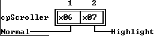

---

<a id="2N747AV"></a>

### TTerminal::TTerminal

*Keywords: TTerminal::TTerminal*

[See Also](#1NDE06J)	 [TTerminal class](#TTerminal)
#### Syntax
```c
TTerminal(const TRect& bounds, TScrollBar *aHScrollBar, TScrollBar *aVScrollBar, ushort aBufSize);
```
#### Description
 Creates a  TTerminalobject with the given * bounds, horizontal and vertical scroll bars, and buffer by calling  TTextDevice::TTextDevicewith the * boundsand scroller arguments, then creating a buffer (pointed to by * buffer) with * bufSizeequal to * aBufSize. * growModeis set to * gfGrowHiX| * gfGrowHiY. * queFrontand * queBackare both initialized to 0, indicating an empty buffer. The cursor is shown at the view's origin, (0,0).

 Destructor

 
```c
~TTerminal();
```
 Deallocates the buffer calls  ~TTextDevice.

---

<a id="1NDE06J"></a>

#### See Also
 [TScroller::TScroller](#WFE_NJ)

 [~TScroller](#WFE_NJ)

 [TTextDevice::TTextDevice](#17IY2._)

 [~TTextDevice](#17IY2._)

---

<a id="JSU_BF"></a>

### TTerminal::buffer

*Keywords: buffer*

[TTerminal class](#TTerminal)
#### Syntax
```c
char *buffer;  //protected
```
#### Description
 Pointer to the first byte of the terminal's buffer.

---

<a id="1MV.WIO"></a>

### TTerminal::bufSize

*Keywords: bufSize*

[TTerminal class](#TTerminal)
#### Syntax
```c
ushort bufSize;  //protected
```
#### Description
 The size of the terminal's buffer in bytes.

---

<a id="12VDYH_"></a>

### TTerminal::queBack

*Keywords: queBack*

[TTerminal class](#TTerminal)
#### Syntax
```c
ushort queBack;  //protected
```
#### Description
 Offset (in bytes) of the last byte stored in the terminal buffer.

---

<a id="1OH0G2L"></a>

### TTerminal::queFront

*Keywords: queFront*

[TTerminal class](#TTerminal)
#### Syntax
```c
ushort queFront;  //protected
```
#### Description
 Offset (in bytes) of the first byte stored in the terminal buffer.

---

<a id="1_260YG"></a>

### TTerminal::bufDec

*Keywords: bufDec*

[See Also](#4F9H_0S)	 [TTerminal class](#TTerminal)
#### Syntax
```c
void bufDec(ushort& val);  //protected
```
#### Description
 Used to manipulate queue offsets with wrap around: If * valis zero, * valis set to (* bufSize- 1); otherwise, * valis decremented.

---

<a id="4F9H_0S"></a>

#### See Also
 [TTerminal::bufInc](#4N5G_VA)

---

<a id="4N5G_VA"></a>

### TTerminal::bufInc

*Keywords: bufInc*

[See Also](#210R.P4)	 [TTerminal class](#TTerminal)
#### Syntax
```c
void bufInc(ushort& val);
```
#### Description
 Used to manipulate a queue offsets with wrap around: Increments * valby 1, then if * val>= * bufSize, * valis set to zero.

---

<a id="210R.P4"></a>

#### See Also
 [TTerminal::bufDec](#1_260YG)

---

<a id="M539_O"></a>

### TTerminal::calcWidth

*Keywords: calcWidth*

[TTerminal class](#TTerminal)
#### Syntax
```c
short calcWidth();
```
#### Description
 The function returns the length of the longest line in the buffer.

---

<a id="428.4F"></a>

### TTerminal::canInsert

*Keywords: canInsert*

[TTerminal class](#TTerminal)
#### Syntax
```c
Boolean canInsert(ushort amount);
```
#### Description
 Returns * Trueif the number of bytes given in * amountcan be inserted into the terminal buffer without having to discard the top line. Otherwise, returns * False.

---

<a id="177VTUO"></a>

### TTerminal::do_sputn

*Keywords: do_sputn*

[TTerminal class](#TTerminal)
#### Syntax
```c
int do_sputn( const char *s, int );
```
#### Description
 Overrides the corresponding function in class  streambuf. This is an internal function that is called whenever a character string is to be inserted into the internal buffer.

---

<a id="TTerminal_draw"></a>

### TTerminal::draw

*Keywords: draw*

[TTerminal class](#TTerminal)
#### Syntax
```c
virtual void draw();
```
#### Description
 Called whenever the  TTerminalscroller needs to be redrawn; for example, when the scroll bars are clicked on, the view is unhidden or resized, the * deltavalues are changed, or when added text forces a scroll.

---

<a id="GAX6OS"></a>

### TTerminal::nextLine

*Keywords: nextLine*

[See Also](#1W83ZWS)	 [TTerminal class](#TTerminal)
#### Syntax
```c
ushort nextLine(ushort pos);
```
#### Description
 Returns the buffer offset of the start of the line that follows the position given by * pos.

---

<a id="1W83ZWS"></a>

#### See Also
 [TTerminal::prevLines](#NOL__B)

---

<a id="NOL__B"></a>

### TTerminal::prevLines

*Keywords: prevLines*

[See Also](#2VDHCFC)	 [TTerminal class](#TTerminal)
#### Syntax
```c
ushort prevLines(ushort pos, ushort Lines);
```
#### Description
 Returns the offset of the start of the line that is * Lineslines previous to the position given by * pos.

---

<a id="2VDHCFC"></a>

#### See Also
 [TTerminal::nextLine](#GAX6OS)

---

<a id="12_THLA"></a>

### TTerminal::queEmpty

*Keywords: queEmpty*

[See Also](#_V2U53)	 [TTerminal class](#TTerminal)
#### Syntax
```c
Boolean queEmpty();
```
#### Description
 Returns * Trueif * queFrontis equal to * queBack.

---

<a id="_V2U53"></a>

#### See Also
 [TTerminal::queFront](#1OH0G2L)

 [TTerminal::queBack](#12VDYH_)

---

<a id="TTextDevice"></a>

### TTextDevice Class

*Keywords: TTextDevice*

[Inheritance](#TVFlow_2)
#### Header File
 textview.h
#### Description
 TTextDeviceis a scrollable TTY-type text viewer/device driver. Apart from the data members and member functions inherited from  TScroller,  TTextDevicedefines virtual member functions for reading and writing strings from and to the device.  TTextDeviceexists solely as a base type for deriving real terminal drivers.  TTextDeviceuses  TScroller'sdestructor.

 Constructors

 
```c
TTextDevice
```

```c
17IY2._(const TRect& bounds, TScrollBar *aHScrollBar, TScrollBar *aVScrollBar);
```
#### Member Functions
```c
int  do_sputn
```

```c
_IM3MI( const char *s, int );

 int  overflow
```

```c
49.Z_GY( int );
```
 Palette

 Text device objects use the default palette * cpScrollerto map onto the sixth and seventh entries in the standard application palette.

 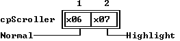

---

<a id="17IY2._"></a>

### TTextDevice::TTextDevice

*Keywords: TTextDevice::TTextDevice*

[See Also](#1AJI0LS)	 [TTextDevice class](#TTextDevice)
#### Syntax
```c
TTextDevice(const TRect& bounds, TScrollBar *aHScrollBar, TScrollBar *aVScrollBar);
```
#### Description
 Creates a  TTextDeviceobject with the given * bounds, horizontal and vertical scroll bars calling  TTextScroller::TTextScrollerwith the * boundsand scroller arguments.

---

<a id="1AJI0LS"></a>

#### See Also
 [TScroller::TScroller](#WFE_NJ)

---

<a id="_IM3MI"></a>

### TTextDevice::do_sputn

*Keywords: do_sputn*

[TTextDevice class](#TTextDevice)
#### Syntax
```c
int do_sputn( const char *s, int );
```
#### Description
 Overrides the corresponding function in class  streambuf. This is an internal function that is called whenever a character string is to be inserted into the internal buffer.

---

<a id="49.Z_GY"></a>

### TTextDevice::overflow

*Keywords: overflow*

[TTextDevice class](#TTextDevice)
#### Syntax
```c
int overflow( int );
```
#### Description
 Overrides the corresponding function in class  streambuf. When the internal buffer in a  streambufis full and the  iostreamassociated with that  streambuftries to put another character into the buffer,  overflowis called. Its argument is the character that caused the overflow. In  TTextDevice, the underlying  streambufhas no buffer, so every character results in an overflow. Classes derived from  TTextDevice, such as  TTerminal, should treat this character simply as another character in the output stream.

---

<a id="TValidator"></a>

### TValidator Class

*Keywords: TValidator*

#### Header File
 validate.h
#### Description
 TValidatordefines an abstract data validation object. You will never actuallycreate an instance of  TValidator, but it provides much of the abstract functionality for the other data validation objects.

 Constructors

 
```c
TValidator
```

```c
UY8KX0();
```
#### Data Members
```c
ushort  options
```

```c
34SO_IX;

 ushort  status
```

```c
56P6E3;
```
#### Member Functions
```c
virtual void  error
```

```c
TValidator_error();

 virtual Boolean  isValidInput
```

```c
48_NG1( char *S, Boolean SuppressFill );

 virtual Boolean  isValid
```

```c
HXX88C( char *s );

 virtual ushort  transfer
```

```c
DNRUN7( char *S, void *Buffer, TVTransfer Flag );

 Boolean  validate
```

```c
14R.T6.( const char *S );
```

---

<a id="UY8KX0"></a>

### TValidator::TValidator

*Keywords: TValidator::TValidator*

[TValidator class](#TValidator)
#### Syntax
```c
TValidator();
```
#### Description
 Constructs an abstract validator object sets the * options* statusdata members to zero.

---

<a id="34SO_IX"></a>

### TValidator::options

*Keywords: options*

[TValidator class](#TValidator)
#### Syntax
```c
ushort options;
```
#### Description
 *optionsis a bitmapped data member used to control options for various descendants of  TValidator. By default, the constructor clears all the bits in * options.

---

<a id="56P6E3"></a>

### TValidator::status

*Keywords: status*

[See Also](#BMENPJ)	 [TValidator class](#TValidator)
#### Syntax
```c
ushort status;
```
#### Description
 Indicates the status of the validator object. If * statusis * vsOK, the validator object constructed correctly. Any value other than * vsOKindicates that an error occurred.

---

<a id="BMENPJ"></a>

#### See Also
 [TInputLine::valid](#TInputLine_valid)

---

<a id="TValidator_error"></a>

### TValidator::error

*Keywords: error*

[TValidator class](#TValidator)
#### Syntax
```c
virtual void error();
```
#### Description
 erroris called by  Validwhen it detects that the user has entered invalid information. By default,  TValidator::errordoes nothing, but descendant types can override  errorto provide feedback to the user.

---

<a id="48_NG1"></a>

### TValidator::isValidInput

*Keywords: isValidInput*

[TValidator class](#TValidator)
#### Syntax
```c
virtual Boolean isValidInput( char *S, Boolean SuppressFill );
```
#### Description
 If an input line has an associated validator object, it calls  isValidInputafter processing each keyboard event. This gives validators such as filter validators an opportunity to catch errors before the user fills the entire item or screen.

 By default,  TValidator::isValidInputreturns * True. Descendant data validators can override  isValidInputto validate data as the user types it, returning * Trueif * Sholds valid data and * Falseotherwise.

 * Sis the current input string. * SuppressFilldetermines whether the validator should automatically format the string before validating it. If * SuppressFillis * True, validation takes place on the unmodified string * S. If * SuppressFillis * False, the validator should apply any filling or padding before validating data. Of the standard validator objects, only  TPXPictureValidatorchecks * SuppressFill.

 isValidInputcan modify the contents of the input string, such as forcing characters to uppercase or inserting literal characters from a format picture.  isValidInputshould not, however, delete invalid characters from the string. By returning * False,  isValidInputindicates that the input line should erase the offending characters.

---

<a id="HXX88C"></a>

### TValidator::isValid

*Keywords: isValid*

[See Also](#31XOQC3)	 [TValidator class](#TValidator)
#### Syntax
```c
virtual Boolean isValid( char *s );
```
#### Description
 By default,  TValidator::isValidreturns * True. Descendant validator types can override  isValidto validate data for a completed input line. If an input line has an associated validator object, its  validmember function calls the validator object's  validmember function, which in turn calls  isValidto determine whether the contents of the input line are valid.

---

<a id="31XOQC3"></a>

#### See Also
 [TInputLine::valid](#TInputLine_valid)

 [TValidator::validate](#14R.T6.)

---

<a id="DNRUN7"></a>

### TValidator::transfer

*Keywords: transfer*

[See Also](#5AJ405L)	 [TValidator class](#TValidator)
#### Syntax
```c
virtual ushort transfer( char *S, void *Buffer, TVTransfer Flag );
```
#### Description
 transferallows a validator to take over setting and reading the values of its associated input line, which is mostly useful for validators that check non-string data, such as numeric values. For example,  TRangeValidatoruses  transferto read and write  long-type values to a data record, rather than transferring an entire string.

 By default, input lines with validators give the validator the first chance to respond to  dataSize,  getData, and  setDataby calling the validator's  transfermember function. If  transferreturns anything other than 0, it indicates to the input line that it has handled the appropriate transfer. The default action of  TValidator::transferis to return 0 always. If you want the validator to transfer data, you need to override its  transfermember function.

 transfer's first two parameters are the associated input line's text string and the  getDataor  setDatadata record. Depending on the value of * Flag,  transfercan set * Sfrom * Bufferor read the data from * Sinto * Buffer. The return value is always the number of bytes transferred.

 If * Flagis * vtDataSize,  transferdoesn't change either * Sor * Buffer, but just returns the data size. If * Flagis * vtsetData,  transferreads the appropriate number of bytes from * Buffer, converts them into the proper string form, and sets them into * S, returning the number of bytes read. If * Flagis * vtgetData,  transferconverts * Sinto the appropriate data type and writes the value into * Buffer, returning the number of bytes written.

---

<a id="5AJ405L"></a>

#### See Also
 [TInputLine::dataSize](#2FDSAKC)

 [TInputLine::getData](#7QYZKU)

 [TInputLine::setData](#K507AG)

---

<a id="14R.T6."></a>

### TValidator::validate

*Keywords: validate*

[See Also](#NRWVS2)	 [TValidator class](#TValidator)
#### Syntax
```c
Boolean validate( const char *S );
```
#### Description
 Returns * Trueif * isValid(S)returns * True. Otherwise, calls  errorand returns * False. A validator's  validatemember function is called by the  validatemember function of its associated input line.

 Input lines with associated validators call the validator's  validatemember function under two conditions: either the input line has its * ofValidateoption set, in which case it calls  validatewhen it loses focus, or the dialog box that contains the input line calls  validatefor all its controls, usually because the user requested to close the dialog box or accept an entry screen.

---

<a id="NRWVS2"></a>

#### See Also
 [TInputLine::valid](#TInputLine_valid)

 [TValidator::error](#TValidator_error)

 [TValidator::isValid](#HXX88C)

---

<a id="TView"></a>

### TView Class

*Keywords: TView*

[Inheritance](#TVFlow_2)
#### Header File
 views.h
#### Description
 Most programs make use of the  TViewderivatives:  TFrame,  TScrollBar,  TScroller,  TListViewer,  TGroup, and  TWindowobjects.

  TViewobjects are rarely instantiated in Turbo Vision programs. The  TViewclass exists to provide basic data and functionality for its derived classes.

 Constructors

 
```c
TView
```

```c
TView_TView(const TRect& bounds);

  TView
```

```c
TView_TView( StreamableInit streamableInit);

 ~ TView
```

```c
TView_TView();
```
#### Data Members
```c
static Boolean  commandSetChanged
```

```c
HVLI.2;

 static TCommandSet  curCommandSet
```

```c
22TFQQ5;

 TPoint  cursor
```

```c
HO1GXA;

 uchar  dragMode
```

```c
1XN8FXN;

 static uchar  errorAttr
```

```c
4LEXNWE;

 ushort  eventMask
```

```c
HQ.SC1;

 uchar  growMode
```

```c
1ETXH5K;

 ushort  helpCtx
```

```c
5JE53X;

 TView * next
```

```c
TView_next;

 ushort  options
```

```c
IKGEF4;

 TPoint  origin
```

```c
7BG.0X;

 TGroup * owner
```

```c
TView_owner;

 static Boolean  showMarkers
```

```c
FOXYTF;

 TPoint  size
```

```c
TView_size;

 ushort  state
```

```c
TView_state;
```
#### Member Functions
```c
virtual void  awaken
```

```c
30JP_UR();

 void  blockCursor
```

```c
1G4JMAS();

 static TStreamable * build
```

```c
TView_build();

 virtual void  calcBounds
```

```c
KW36MH(TRect& bounds, TPoint delta);

 virtual void  changeBounds
```

```c
SH_KT2(const TRect& bounds);

 void  clearEvent
```

```c
1QH6Z4_(TEvent& event);

 static Boolean  commandEnabled
```

```c
BOTWCY(ushort command);

 Boolean  containsMouse
```

```c
181B9S4(TEvent& event);

 virtual ushort  dataSize
```

```c
1MP16EK();

 static void  disableCommand
```

```c
2P2B3GE(ushort command);

 static void  disableCommands
```

```c
5XS3.SB(TCommandSet& commands);

 virtual void  dragView
```

```c
82KW.UD(TEvent& event, uchar mode, TRect& limits, TPoint minSize, TPoint maxSize);

 virtual void  draw
```

```c
TView_draw();

 void  drawCursor
```

```c
11W9ELK();

 void  drawHide
```

```c
IKFATY(TView *lastView);

 void  drawShow
```

```c
04LM0OI(TView *lastView);

 void  drawUnderRect
```

```c
PVTZTX(TRect& r, TView *lastView);

 void  drawUnderView
```

```c
2RGR2G5(Boolean doShadow, TView *lastView);

 void  drawView
```

```c
8P08.AT();

 static void  enableCommand
```

```c
12A1PGP(ushort command);

 static void  enableCommands
```

```c
3XUP8J5(TCommandSet& commands);

 virtual void  endModal
```

```c
X4QVRW(ushort command);

 Boolean  eventAvail
```

```c
5OZE_Q0();

 virtual ushort  execute
```

```c
.__E0Z();

 Boolean  exposed
```

```c
.HIBVY();

 Boolean  focus
```

```c
TView_focus();

 TRect  getBounds
```

```c
0HONF4();

 TRect  getClipRect
```

```c
184ADTN();

 ushort  getColor
```

```c
4WHM0BU(ushort color);

 static void  getCommands
```

```c
UXJP6S(TCommandSet& commands);

 virtual void  getData
```

```c
E9Q276(void *rec);

 virtual void  getEvent
```

```c
74V6J_(TEvent& event);

 TRect  getExtent
```

```c
_QNEP5();

 virtual ushort  getHelpCtx
```

```c
22ZVNO5();

 virtual TPalette&  getPalette
```

```c
16810KT() const;

 Boolean  getState
```

```c
7BT2OY(ushort aState);

 void  growTo
```

```c
213FK63(short x, short y);

 virtual void  handleEvent
```

```c
4H2TBJ(TEvent& event);

 void  hide
```

```c
TView_hide();

 void  hideCursor
```

```c
.25384();

 void  keyEvent
```

```c
12OJSKG(TEvent& event);

 void  locate
```

```c
QHM624(TRect& bounds);

 void  makeFirst
```

```c
UJ._4X();

 TPoint  makeGlobal
```

```c
XN7.6H(TPoint source);

 TPoint  makeLocal
```

```c
UPAXMP(TPoint source);

 uchar  mapColor
```

```c
2M9H0FI(uchar);

 Boolean  mouseEvent
```

```c
M74OQ1(TEvent& event, ushort mask);

 Boolean  mouseInView
```

```c
1L64_W(TPoint mouse);

 void  moveTo
```

```c
1DRA9IN(short x, short y);

 TView * nextView
```

```c
Y3KX6W();

 void  normalCursor
```

```c
3UZT_8P();

 TView * prev
```

```c
TView_prev();

 TView * prevView
```

```c
_JXDRI();

 virtual void  putEvent
```

```c
8AOV_S5(TEvent& event);

 void  putInFrontOf
```

```c
4DYD_S9(TView *target);

 MyView. putInFrontOf
```

```c
4DYD_S9(owner->first);

 virtual void * read
```

```c
TView_read( ipstream& is);   //protected

 virtual void  resetCursor
```

```c
6WJBT4();

 void  select
```

```c
1JH798S();

 void  setBounds
```

```c
3XWV_DV(const TRect& bounds);

 static void  setCmdState
```

```c
2WL.1M( TCommandSet& commands, Boolean enable );

 static void  setCommands
```

```c
1IGXI5K(TCommandSet& commands);

 void  setCursor
```

```c
1XAZD4P(short x, short y);

 virtual void  setData
```

```c
XH19WS(void *rec);

 virtual void  setState
```

```c
DL958G(ushort aState, Boolean enable);

 void  show
```

```c
TView_show();

 void  showCursor
```

```c
7Z64XB();

 virtual void  shutDown
```

```c
4ICEGV();

 virtual void  sizeLimits
```

```c
AYFUWM(TPoint& min, TPoint& max);

 TView * topView
```

```c
5SJBY9();

 virtual Boolean  valid
```

```c
TView_valid(ushort command);

 virtual void  write
```

```c
TView_write( opstream& os);   //protected

 void  writeBuf
```

```c
35T5ZGT( short x, short y, short w, short h, const void *buf;

 void  writeBuf
```

```c
35T5ZGT( short x, short y, short w, short h, const TDrawBuffer& buf);

 void  writeChar
```

```c
3NE8.SZ( short x, short y, char c, uchar color, short count);

 void  writeLine
```

```c
52WY_9B( short x, short y, short w, short h, const void *buf);

 void  writeLine
```

```c
52WY_9B( short x, short y, short w, short h, const TDrawBuffer& buf );

 void  writeStr
```

```c
90QL.BD(short x, short y, const char *str, uchar color);
```
 Friends

 The function  genRefsis a friend of  TView.

---

<a id="TView_TView"></a>

### TView::TView

*Keywords: TView::TView*

[See Also](#B3XJXK)	 [TView class](#TView)

 Form 1

 
```c
TView(const TRect& bounds);
```
 Form 2

 
```c
TView( StreamableInit streamableInit);  // protected
```
#### Description
 Form 1: Creates a  TViewobject with the given * boundsrectangle.  TView::TViewcalls the  TObjectconstructor and sets the data members of the new  TViewto the following values:

 

| * cursor |  | (0, 0) |
| --- | --- | --- |
| * dragMode | dmLimitLoY |  |
| eventMask | evMouseDown| * evKeyDown| * evCommand |  |
| * growMode | 0 |  |
| * helpCtx | * hcNoContext |  |
| * next | 0 |  |
| * options | 0 |  |
| * origin | (bounds.A.x, bounds.A.y) |  |
| * owner | 0 |  |
| * size | (bounds.B.x - bounds.A.x, bounds.B.y - bounds.A.y) |  |
| * state | sfVisible |  |

 

 Form 2: Each streamable class needs a "builder" to allocate the correct memory for its objects together with the initialized vtable pointers. This is achieved by calling this constructor with an argument of type  StreamableInit. 

 Destructor

 
```c
~TView();
```
 Hides the view then, if it has an owner, removes it from the group.

---

<a id="B3XJXK"></a>

#### See Also
 [TObject::TObject](#CE_6LF)

---

<a id="HVLI.2"></a>

### TView::commandSetChanged

*Keywords: TView::commandSetChanged*

[See Also](#3IUJ0Z_)	 [TView class](#TView)
#### Syntax
```c
static Boolean commandSetChanged;
```
#### Description
 Set to * Truewhenever the view's command set is changed via an  enable,  disable, or  setCommandcall.

---

<a id="3IUJ0Z_"></a>

#### See Also
 [TView::enableCommands](#3XUP8J5)

 [TView::disableCommands](#5XS3.SB)

 [TView::setCommands](#1IGXI5K)

---

<a id="22TFQQ5"></a>

### TView::curCommandSet

*Keywords: curCommandSet*

[See Also](#FLXTV8)	 [TView class](#TView)
#### Syntax
```c
static TCommandSet curCommandSet;
```
#### Description
 Holds the set of commands currently enabled for this view. Initially, the following commands are disabled: * cmZoom, * cmClose, * cmResize, * cmNext, * cmPrev. This data member is constantly monitored by  handleEventto determine which of the received command events needs to be serviced. * curCommandSetshould not be altered directly: use the appropriate  set,  enable, or  disablecalls.

---

<a id="FLXTV8"></a>

#### See Also
 [TView::setCommands](#1IGXI5K)

 [TView::enableCommands](#3XUP8J5)

 [TView::disableCommands](#5XS3.SB)

---

<a id="HO1GXA"></a>

### TView::cursor

*Keywords: cursor*

[See Also](#AKWAV9)	 [TView class](#TView)
#### Syntax
```c
TPoint cursor;
```
#### Description
 The location of the hardware cursor within the view. The cursor is visible only if the view is focused (* sfFocused) and the cursor turned on (* sfCursorVis). The shape of the cursor is either an underline or block (determined by * sfCursorIns).

---

<a id="AKWAV9"></a>

#### See Also
 [TView::blockCursor](#1G4JMAS)

 [TView::hideCursor](#.25384)

 [TView::normalCursor](#3UZT_8P)

 [TView::setCursor](#1XAZD4P)

 [TView::showCursor](#7Z64XB)

---

<a id="1XN8FXN"></a>

### TView::dragMode

*Keywords: dragMode*

[See Also](#H_XQVH)	 [TView class](#TView)
#### Syntax
```c
uchar dragMode;
```
#### Description
 Determines how the view should behave when mouse-dragged.

 The * dragModebits are defined as follows:

 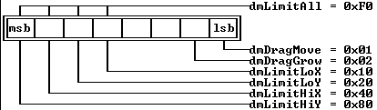

---

<a id="H_XQVH"></a>

#### See Also
 [TView::dragView](#82KW.UD)

---

<a id="4LEXNWE"></a>

### TView::errorAttr

*Keywords: errorAttr*

[See Also](#4MVC_25)	 [TView class](#TView)
#### Syntax
```c
static uchar errorAttr;
```
#### Description
 Attribute used to signal an invalid palette selection. For example,  mapColorreturns * errorAttrif it is called with an invalid * colorargument. By default, * errorAttris set to 0xCF, which shows as flashing red on white.

---

<a id="4MVC_25"></a>

#### See Also
 [TView::mapColor](#2M9H0FI)

---

<a id="HQ.SC1"></a>

### TView::eventMask

*Keywords: eventMask*

[See Also](#_P0K.C)	 [TView class](#TView)
#### Syntax
```c
ushort eventMask;
```
#### Description
 *eventMaskis a bit mask that determines which event classes will be recognized by the view. The default * eventMaskenables * evMouseDown, * evKeyDown, and * evCommand. Assigning 0xFFFF to * eventMaskcauses the view to react to all event classes; conversely, a value of zero causes the view to not react to any events.

---

<a id="_P0K.C"></a>

#### See Also
 [TView::handleEvent](#4H2TBJ)

---

<a id="1ETXH5K"></a>

### TView::growMode

*Keywords: growMode*

[TView class](#TView)
#### Syntax
```c
uchar growMode;
```
#### Description
 Determines how the view will grow when its owner view is resized. * growModeis assigned one or more of the following * growModemasks:

 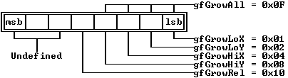

 Example: 

 
```c
 growMode = gfGrowLoX | gfGrowLoY;
```

---

<a id="5JE53X"></a>

### TView::helpCtx

*Keywords: helpCtx*

[See Also](#3X69A.)	 [TView class](#TView)
#### Syntax
```c
ushort helpCtx;
```
#### Description
 The help context of the view. When the view is focused, this data member will represent the help context of the application, unless the context number is * hcNoContext, in which case there is no help context.

---

<a id="3X69A."></a>

#### See Also
 [TView::getHelpCtx](#22ZVNO5)

---

<a id="TView_next"></a>

### TView::next

*Keywords: next*

[TView class](#TView)
#### Syntax
```c
TView *next;
```
#### Description
 Pointer to next peer view in Z-order. If this is the last subview, * nextpoints to * owner's first subview.

---

<a id="IKGEF4"></a>

### TView::options

*Keywords: options*

[TView class](#TView)
#### Syntax
```c
ushort options;
```
#### Description
 The * optionsword flags determine various behaviors of the view. The * optionsbits are defined as follows:

 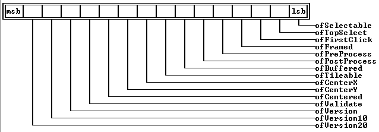

---

<a id="7BG.0X"></a>

### TView::origin

*Keywords: origin*

[See Also](#BZMBTN)	 [TView class](#TView)
#### Syntax
```c
TPoint origin;
```
#### Description
 The (* x, * y) coordinates, relative to the owner's * origin, of the top-left corner of the view.

---

<a id="BZMBTN"></a>

#### See Also
 [TView::moveTo](#1DRA9IN)

 [TView::locate](#QHM624)

---

<a id="TView_owner"></a>

### TView::owner

*Keywords: owner*

[TView class](#TView)
#### Syntax
```c
TGroup *owner;
```
#### Description
 *ownerpoints to the  TGroupobject that owns this view. If 0, the view has no owner. The view is displayed within its owner's view and will be clipped by the owner's bounding rectangle.

---

<a id="FOXYTF"></a>

### TView::showMarkers

*Keywords: showMarkers*

[See Also](#WZMJX9)	 [TView class](#TView)
#### Syntax
```c
static Boolean showMarkers;
```
#### Description
 Used to indicate whether indicators should be placed around focused controls.  TProgram::initScreensets * showMarkersto * Trueif the video mode is monochrome; otherwise it is * False. The value may, however, be set * onin color and black and white modes if desired.

---

<a id="WZMJX9"></a>

#### See Also
 [TProgram::initScreen](#V1M_XZ)

---

<a id="TView_size"></a>

### TView::size

*Keywords: size*

[See Also](#486M1H)	 [TView class](#TView)
#### Syntax
```c
TPoint size;
```
#### Description
 The size of the view.

---

<a id="486M1H"></a>

#### See Also
 [TView::growTo](#213FK63)

 [TView::locate](#QHM624)

---

<a id="TView_state"></a>

### TView::state

*Keywords: state*

[TView class](#TView)
#### Syntax
```c
ushort state;
```
#### Description
 The state of the view is represented by bits set or clear in the * statedata member. Many  TViewmember functions test and/or alter the * statedata member by calling   TView::setState.

  TView::getState*(aState)returns * Trueif the view's * stateis * aState.

---

<a id="30JP_UR"></a>

### TView::awaken

*Keywords: awaken*

[TView class](#TView)
#### Syntax
```c
virtual void awaken();
```
#### Description
 awakenis called after an object is streamed in. By overriding this function in a derived class, you can specify that certain initializations occur after an instance of a class is streamed in. The default behavior of  awakenis to do nothing.

---

<a id="1G4JMAS"></a>

### TView::blockCursor

*Keywords: blockCursor*

[See Also](#JIP5I1)	 [TView class](#TView)
#### Syntax
```c
void blockCursor();
```
#### Description
 Sets * sfCursorInsto change the cursor to a solid block. The cursor will only be visible if * sfCursorVisis also set (and the view is visible).

---

<a id="JIP5I1"></a>

#### See Also
 [TView::normalCursor](#3UZT_8P)

 [TView::showCursor](#7Z64XB)

 [TView::hideCursor](#.25384)

---

<a id="TView_build"></a>

### TView::build

*Keywords: build*

[See Also](#T21_KD)	 [TView class](#TView)
#### Syntax
```c
static TStreamable *build();
```
#### Description
 Called to create an object in certain stream-reading situations.

---

<a id="T21_KD"></a>

#### See Also
 [TStreamableClass](#TStreamableClass)

 [ipstream::readData](#3MVS.PE)

---

<a id="KW36MH"></a>

### TView::calcBounds

*Keywords: calcBounds*

[See Also](#1MB8ZDK)	 [TView class](#TView)
#### Syntax
```c
virtual void calcBounds(TRect& bounds, TPoint delta);
```
#### Description
 When a view's owner changes size, the owner repeatedly calls  calcBoundsand  changeBoundsfor all its subviews.  calcBoundsmust calculate the new bounds of the view (because its owner's size has changed by * delta), and return the new bounds in * bounds.

  TView::calcBoundscalculates the new bounds using the flags specified in the * TView::growModedata member.

---

<a id="1MB8ZDK"></a>

#### See Also
 [TView::getBounds](#0HONF4)

 [TView::changeBounds](#SH_KT2)

---

<a id="SH_KT2"></a>

### TView::changeBounds

*Keywords: changeBounds*

[See Also](#D.73SE)	 [TView class](#TView)
#### Syntax
```c
virtual void changeBounds(const TRect& bounds);
```
#### Description
 changeBoundsmust change the view's bounds (* originand * sizedata members) to the rectangle given by the * boundsparameter. Having changed the bounds,  changeBoundsmust then redraw the view.  changeBoundsis called by various  TViewmember functions, but should never be called directly.

  TView::changeBoundsfirst calls  setBounds*(bounds)and then calls  drawView.

---

<a id="D.73SE"></a>

#### See Also
 [TView::locate](#QHM624)

 [TView::moveTo](#1DRA9IN)

 [TView::growTo](#213FK63)

---

<a id="1QH6Z4_"></a>

### TView::clearEvent

*Keywords: clearEvent*

[See Also](#_WZ3O0)	 [TView class](#TView)
#### Syntax
```c
void clearEvent(TEvent& event);
```
#### Description
 Standard member function used in  handleEventto signal that the view has successfully handled the event. Sets * event.whatto * evNothingand * event.message.infoPtrto  this.

---

<a id="_WZ3O0"></a>

#### See Also
 [TView::handleEvent](#4H2TBJ)

---

<a id="BOTWCY"></a>

### TView::commandEnabled

*Keywords: commandEnabled*

[See Also](#XM3C_O)	 [TView class](#TView)
#### Syntax
```c
static Boolean commandEnabled(ushort command);
```
#### Description
 Returns * Trueif the given * commandis currently enabled; otherwise it returns * False. Note that when you change a modal state, you can then disable and enable commands as you wish; when you return to the previous modal state, however, the original command set will be restored.

---

<a id="XM3C_O"></a>

#### See Also
 [TView::disableCommand](#2P2B3GE)

 [TView::enableCommand](#12A1PGP)

 [TView::setCommands](#1IGXI5K)

---

<a id="181B9S4"></a>

### TView::containsMouse

*Keywords: containsMouse*

[See Also](#3Z2YZR5)	 [TView class](#TView)
#### Syntax
```c
Boolean containsMouse(TEvent& event);
```
#### Description
 Returns * Trueif a mouse event occurs inside the calling view, otherwise returns * False.

---

<a id="3Z2YZR5"></a>

#### See Also
 [TView::mouseInView](#1L64_W)

---

<a id="1MP16EK"></a>

### TView::dataSize

*Keywords: dataSize*

[See Also](#1_IQ6P6)	 [TView class](#TView)
#### Syntax
```c
virtual ushort dataSize();
```
#### Description
 dataSizemust be used to return the size of the data read from and written to data records by  setDataand  getData. The data record mechanism is typically used only in views that implement controls for dialog boxes.

  TView::dataSizereturns zero to indicate that no data was transferred.

---

<a id="1_IQ6P6"></a>

#### See Also
 [TView::getData](#E9Q276)

 [TView::setData](#XH19WS)

---

<a id="2P2B3GE"></a>

### TView::disableCommand

*Keywords: disableCommand*

[See Also](#RXYMBP)	 [TView class](#TView)
#### Syntax
```c
static void disableCommand(ushort command);
```
#### Description
 Disables the given command. If the command set is changed by the call, * commandSetChangedis set * True.

---

<a id="RXYMBP"></a>

#### See Also
 [TView::enableCommand](#12A1PGP)

 [TView::disableCommands](#5XS3.SB)

---

<a id="5XS3.SB"></a>

### TView::disableCommands

*Keywords: disableCommands*

[See Also](#IYJR_2)	 [TView class](#TView)
#### Syntax
```c
static void disableCommands(TCommandSet& commands);
```
#### Description
 Disables the commands specified in the * commandsargument.

---

<a id="IYJR_2"></a>

#### See Also
 [TView::commandEnabled](#BOTWCY)

 [TView::enableCommands](#3XUP8J5)

 [TView::setCommands](#1IGXI5K)

---

<a id="82KW.UD"></a>

### TView::dragView

*Keywords: dragView*

[See Also](#21BUJZ.)	 [TView class](#TView)
#### Syntax
```c
virtual void dragView(TEvent& event, uchar mode, TRect& limits, TPoint minSize, TPoint maxSize);
```
#### Description
 Drags the view using the dragging mode given by the * dmXXXXflags set in the * modeargument. * limitsspecifies the rectangle (in the owner's coordinate system) within which the view can be moved, and * minand * max specify the minimum and maximum sizes the view can shrink or grow to. The event leading to the dragging operation is needed in  eventto distinguish mouse dragging from use of the cursor keys.

---

<a id="21BUJZ."></a>

#### See Also
 [TView::dragMode](#1XN8FXN)

---

<a id="TView_draw"></a>

### TView::draw

*Keywords: draw*

[See Also](#TPZIS5)	 [TView class](#TView)
#### Syntax
```c
virtual void draw();
```
#### Description
 Called whenever the view must draw (display) itself.  draw must cover the entire area of the view. This member function must be overridden appropriately for each derived class since the default is to simply erase the view.  drawis seldom called directly, since it is more efficient to use  drawView, which draws only views that are exposed; that is, some or all of the view is visible on the screen. If required,  drawcan call  getClipRectto obtain the rectangle that needs redrawing, and then only draw that area. For complicated views, this can improve performance noticeably.

---

<a id="TPZIS5"></a>

#### See Also
 [TView::drawView](#8P08.AT)

---

<a id="11W9ELK"></a>

### TView::drawCursor

*Keywords: drawCursor*

[See Also](#D8E_G0)	 [TView class](#TView)
#### Syntax
```c
void drawCursor();
```
#### Description
 If the view is * sfFocused, the cursor is reset with a call to  resetCursor.

---

<a id="D8E_G0"></a>

#### See Also
 [TView::resetCursor](#6WJBT4)

---

<a id="IKFATY"></a>

### TView::drawHide

*Keywords: drawHide*

[TView class](#TView)
#### Syntax
```c
void drawHide(TView *lastView);
```
#### Description
 Calls  drawCursorfollowed by  drawUnderView. The latter redraws all subviews (with shadows if required) until the given * lastViewis reached.

---

<a id="04LM0OI"></a>

### TView::drawShow

*Keywords: drawShow*

[TView class](#TView)
#### Syntax
```c
void drawShow(TView *lastView);
```
#### Description
 Calls  drawView,then if * statehas the * sfShadowbit set,  drawUnderViewis called to draw the shadow.

---

<a id="PVTZTX"></a>

### TView::drawUnderRect

*Keywords: drawUnderRect*

[See Also](#2UQHPRE)	 [TView class](#TView)
#### Syntax
```c
void drawUnderRect(TRect& r, TView *lastView);
```
#### Description
 Calls  owner->clip.intersect(* r) to set the area that needs drawing. Then all the subviews from the next view to the given * lastVieware drawn using  drawSubViews. Finally, * owner->clipis reset to * owner->getExtent.

---

<a id="2UQHPRE"></a>

#### See Also
 [TView::drawUnderView](#2RGR2G5)

---

<a id="2RGR2G5"></a>

### TView::drawUnderView

*Keywords: drawUnderView*

[See Also](#14X6.TO)	 [TView class](#TView)
#### Syntax
```c
void drawUnderView(Boolean doShadow, TView *lastView);
```
#### Description
 Calls  drawUnderRect(* r, * lastView), where * ris the calling view's current * bounds. If * doShadowis * True, the view's bounds are first increased by * shadowSize.

---

<a id="14X6.TO"></a>

#### See Also
 [TView::drawUnderRect](#PVTZTX)

---

<a id="8P08.AT"></a>

### TView::drawView

*Keywords: drawView*

[See Also](#4FREA2)	 [TView class](#TView)
#### Syntax
```c
void drawView();
```
#### Description
 Calls  drawif  exposedreturns * True, indicating that the view is exposed (see * sfExposed). If  exposedreturns * False,  drawViewdoes nothing. You should call  drawView(not  draw) whenever you need to redraw a view after making a change that affects its visual appearance.

---

<a id="4FREA2"></a>

#### See Also
 [TView::draw](#TView_draw)

 [TGroup::redraw](#77MA9N)

 [TView::exposed](#.HIBVY)

---

<a id="12A1PGP"></a>

### TView::enableCommand

*Keywords: enableCommand*

[See Also](#1V_5I5)	 [TView class](#TView)
#### Syntax
```c
static void enableCommand(ushort command);
```
#### Description
 Enables the given command. If the command set is changed by this call, * commandSetChangedis set * True.

---

<a id="1V_5I5"></a>

#### See Also
 [TView::disableCommand](#2P2B3GE)

 [TView::enableCommands](#3XUP8J5)

---

<a id="3XUP8J5"></a>

### TView::enableCommands

*Keywords: enableCommands*

[See Also](#6LCBPW)	 [TView class](#TView)
#### Syntax
```c
static void enableCommands(TCommandSet& commands);
```
#### Description
 Enables all the commands in the * commandsargument. If the command set is changed by this call, * commandSetChangedis set * True.

---

<a id="6LCBPW"></a>

#### See Also
 [TCommandSet](#TCommandSet)

 [TView::commandSetChanged](#HVLI.2)

 [TView::disableCommands](#5XS3.SB)

 [TView::getCommands](#UXJP6S)

 [TView::commandEnabled](#BOTWCY)

 [TView::setCommands](#1IGXI5K)

---

<a id="X4QVRW"></a>

### TView::endModal

*Keywords: endModal*

[See Also](#06CEVC)	 [TView class](#TView)
#### Syntax
```c
virtual void endModal(ushort command);
```
#### Description
 Calls  topViewto seek the topmost modal view. If none exists (that is, if  topViewreturns 0), no further action is taken. If there is a modal view, that view calls  endModal, and so on.

 The net result is that  endModalterminates the current modal state. The * commandargument is passed to the  execViewthat originally created the modal state.

---

<a id="06CEVC"></a>

#### See Also
 [TGroup::execView](#12U2PA7)

 [TGroup::execute](#2B.IZD)

 [TGroup::endModal](#H4RDW5)

---

<a id="5OZE_Q0"></a>

### TView::eventAvail

*Keywords: eventAvail*

[See Also](#984I3Y)	 [TView class](#TView)
#### Syntax
```c
Boolean eventAvail();
```
#### Description
 Calls  getEventand returns * Trueif an event is available. Calls  putEventif an event is available.

---

<a id="984I3Y"></a>

#### See Also
 [TView::mouseEvent](#M74OQ1)

 [TView::keyEvent](#12OJSKG)

 [TView::getEvent](#74V6J_)

 [TView::putEvent](#8AOV_S5)

---

<a id=".__E0Z"></a>

### TView::execute

*Keywords: execute*

[See Also](#3ZYM_OG)	 [TView class](#TView)
#### Syntax
```c
virtual ushort execute();
```
#### Description
 executeis called from  TGroup::execViewwhenever a view becomes modal. If a view is to allow modal execution, it must override  execute to provide an event loop. The value returned by  executewill be the value returned by  TGroup::execView.

 The default  TView::executesimply returns * cmCancel.

---

<a id="3ZYM_OG"></a>

#### See Also
 [TGroup::execute](#2B.IZD)

 [TGroup::execView](#12U2PA7)

---

<a id=".HIBVY"></a>

### TView::exposed

*Keywords: exposed*

[See Also](#QI59SL)	 [TView class](#TView)
#### Syntax
```c
Boolean exposed();
```
#### Description
 Returns * Trueif any part of the view is visible on the screen.

---

<a id="QI59SL"></a>

#### See Also
 [TView::drawView](#8P08.AT)

---

<a id="TView_focus"></a>

### TView::focus

*Keywords: focus*

[See Also](#5K9_BY)	 [TView class](#TView)
#### Syntax
```c
Boolean focus();
```
#### Description
 Selects and focuses the view, returning * Trueif the view's owner returns * Truefrom  focus, and if the view is neither selected nor modal, or if the view has no owner, Otherwise, returns * False.

 The difference between  focusand  selectis that  focuscan fail. That is, another view might not give up the focus, usually because it holds invalid data that must be corrected before giving up the focus.

---

<a id="5K9_BY"></a>

#### See Also
 [TView::select](#1JH798S)

---

<a id="0HONF4"></a>

### TView::getBounds

*Keywords: getBounds*

[See Also](#24X.044)	 [TView class](#TView)
#### Syntax
```c
TRect getBounds();
```
#### Description
 Returns the current value of * size, the bounding rectangle of the view in its owner's coordinate system. * TRect::ais set to * origin, and * TRect::bis set to the sum of * originand * size.

---

<a id="24X.044"></a>

#### See Also
 [TView::origin](#7BG.0X)

 [TView::size](#TView_size)

 [TView::calcBounds](#KW36MH)

 [TView::changeBounds](#SH_KT2)

 [TView::setBounds](#3XWV_DV)

 [TView::getExtent](#_QNEP5)

---

<a id="184ADTN"></a>

### TView::getClipRect

*Keywords: getClipRect*

[See Also](#2H1S6QN)	 [TView class](#TView)
#### Syntax
```c
TRect getClipRect();
```
#### Description
 Returns the * clipdata member: the minimum rectangle that needs redrawing during a call to  draw. For complicated views,  drawcan use  getClipRectto improve performance noticeably.

---

<a id="2H1S6QN"></a>

#### See Also
 [TView::draw](#TView_draw)

 [TView::drawView](#8P08.AT)

---

<a id="4WHM0BU"></a>

### TView::getColor

*Keywords: getcolor*

[See Also](#.TQC1Q)	 [TView class](#TView)
#### Syntax
```c
ushort getColor(ushort color);
```
#### Description
 Maps the palette indices in the low and high bytes of * colorinto physical character attributes by tracing through the palette of the view and the palettes of all its owners.

---

<a id=".TQC1Q"></a>

#### See Also
 [TView::getPalette](#16810KT)

 [TView::mapColor](#2M9H0FI)

---

<a id="UXJP6S"></a>

### TView::getCommands

*Keywords: getCommands*

[See Also](#113N_LE)	 [TView class](#TView)
#### Syntax
```c
static void getCommands(TCommandSet& commands);
```
#### Description
 Returns, in the * commandsargument, the current command set.

---

<a id="113N_LE"></a>

#### See Also
 [TView::commandEnabled](#BOTWCY)

 [TView::enableCommands](#3XUP8J5)

 [TView::disableCommands](#5XS3.SB)

 [TView::setCommands](#1IGXI5K)

---

<a id="E9Q276"></a>

### TView::getData

*Keywords: getData*

[See Also](#32YTMDN)	 [TView class](#TView)
#### Syntax
```c
virtual void getData(void *rec);
```
#### Description
 getDatamust copy * DataSizebytes from the view to the data record given by the * recpointer. The data record mechanism is typically used only in views that implement controls for dialog boxes. The default  TView::getDatadoes nothing.

---

<a id="32YTMDN"></a>

#### See Also
 [TView::dataSize](#1MP16EK)

 [TView::setData](#XH19WS)

---

<a id="74V6J_"></a>

### TView::getEvent

*Keywords: getEvent*

[See Also](#1VBJZE5)	 [TView class](#TView)
#### Syntax
```c
virtual void getEvent(TEvent& event);
```
#### Description
 Returns the next available event in the * eventargument. Returns * evNothingif no event is available. By default, it calls the view's owner's  getEvent.

---

<a id="1VBJZE5"></a>

#### See Also
 [TView::eventAvail](#5OZE_Q0)

 [TProgram::idle](#TProgram_idle)

 [TView::handleEvent](#4H2TBJ)

 [TView::putEvent](#8AOV_S5)

---

<a id="_QNEP5"></a>

### TView::getExtent

*Keywords: getExtent*

[See Also](#10DPV1_)	 [TView class](#TView)
#### Syntax
```c
TRect getExtent();
```
#### Description
 Returns the extent rectangle of the view. * TRect::ais set to (0, 0), and * TRect::bis set to * size.

---

<a id="10DPV1_"></a>

#### See Also
 [TView::origin](#7BG.0X)

 [TView::size](#TView_size)

 [TView::calcBounds](#KW36MH)

 [TView::changeBounds](#SH_KT2)

 [TView::setBounds](#3XWV_DV)

 [TView::getBounds](#0HONF4)

---

<a id="22ZVNO5"></a>

### TView::getHelpCtx

*Keywords: getHelpCtx*

[See Also](#2XKQN7)	 [TView class](#TView)
#### Syntax
```c
virtual ushort getHelpCtx();
```
#### Description
 getHelpCtxreturns the view's help context.

 The default  TView.getHelpCtxreturns the value in the * helpCtxdata member, or returns * hcDraggingif the view is being dragged (see * sfDragging).

---

<a id="2XKQN7"></a>

#### See Also
 [TView::helpCtx](#5JE53X)

---

<a id="16810KT"></a>

### TView::getPalette

*Keywords: getpalette*

[See Also](#2EQ3VYN)	 [TView class](#TView)
#### Syntax
```c
virtual TPalette& getPalette() const;
```
#### Description
 getPalettemust return a palette object representing the view's palette. This can be a null palette object if the view has no palette. For example:

 
```c
 TPalette& TMyView::getPalette() const

 \-

     static char ch = 0;

     static TPalette palette( &ch, 0 );

     return palette;
```
 getPaletteis called by  writeChar, and  writeStrwhen converting palette indices to physical character attributes. The default return value of a null palette causes no color translation to be performed by this view.  getPaletteis almost always overridden in derived classes.

---

<a id="2EQ3VYN"></a>

#### See Also
 [TView::getColor](#4WHM0BU)

 [TView::mapColor](#2M9H0FI)

 [TView::write](#TView_write)

 [TView::writeBuf](#35T5ZGT)

 [TView::writeChar](#3NE8.SZ)

 [TView::writeLine](#52WY_9B)

 [TView::writeStr](#90QL.BD)

---

<a id="7BT2OY"></a>

### TView::getState

*Keywords: getState*

[See Also](#XQI6S_)	 [TView class](#TView)
#### Syntax
```c
Boolean getState(ushort aState);
```
#### Description
 Returns * Trueif the state given in * aStateis set in the data member * state.

---

<a id="XQI6S_"></a>

#### See Also
 [TView::state](#TView_state)

 [TView::setState](#DL958G)

---

<a id="213FK63"></a>

### TView::growTo

*Keywords: growTo*

[See Also](#N87ULO)	 [TView class](#TView)
#### Syntax
```c
void growTo(short x, short y);
```
#### Description
 Grows or shrinks the view to the given size using a call to  TView::locate.

---

<a id="N87ULO"></a>

#### See Also
 [TView::origin](#7BG.0X)

 [TView::size](#TView_size)

 [TView::locate](#QHM624)

 [TView::moveTo](#1DRA9IN)

---

<a id="4H2TBJ"></a>

### TView::handleEvent

*Keywords: handleEvent*

[See Also](#6M.V_5.)	 [TView class](#TView)
#### Syntax
```c
virtual void handleEvent(TEvent& event);
```
#### Description
 handleEventis the central member function through which all Turbo Vision event handling is implemented. The * whatdata member of the * eventparameter contains the event class (* evXXXX), and the remaining * eventdata members further describe the event. To indicate that it has handled an event,  handleEventshould call  clearEvent.  handleEventis almost always overridden in derived classes.

  TView::handleEventhandles * evMouseDownevents as follows: If the view is not selected (* sfSelected) and not disabled (* sfDisabled), and if the view is selectable (* ofSelectable), then the view selects itself by calling  Select. No other events are handled by  TView::handleEvent.

---

<a id="6M.V_5."></a>

#### See Also
 [TView::clearEvent](#1QH6Z4_)

---

<a id="TView_hide"></a>

### TView::hide

*Keywords: hide*

[See Also](#.Y7ZSN)	 [TView class](#TView)
#### Syntax
```c
void hide();
```
#### Description
 Hides the view by calling  setStateto clear the * sfVisibleflag in * state.

---

<a id=".Y7ZSN"></a>

#### See Also
 [TView::setState](#DL958G)

 [TView::show](#TView_show)

---

<a id=".25384"></a>

### TView::hideCursor

*Keywords: hideCursor*

[See Also](#293591)	 [TView class](#TView)
#### Syntax
```c
void hideCursor();
```
#### Description
 Hides the cursor by clearing the * sfCursorVisbit in * state.

---

<a id="293591"></a>

#### See Also
 [TView::showCursor](#7Z64XB)

---

<a id="12OJSKG"></a>

### TView::keyEvent

*Keywords: keyEvent*

[See Also](#2MQOLY6)	 [TView class](#TView)
#### Syntax
```c
void keyEvent(TEvent& event);
```
#### Description
 Returns, in the * eventvariable, the next * evKeyDownevent. It waits, ignoring all other events, until a keyboard event becomes available.

---

<a id="2MQOLY6"></a>

#### See Also
 [TView::getEvent](#74V6J_)

 [TView::eventAvail](#5OZE_Q0)

---

<a id="QHM624"></a>

### TView::locate

*Keywords: locate*

[See Also](#17YCTVI)	 [TView class](#TView)
#### Syntax
```c
void locate(TRect& bounds);
```
#### Description
 Changes the bounds of the view to those of the * boundsargument. The view is redrawn in its new location.  locatecalls  sizeLimitsto verify that the given * boundsare valid, and then calls  changeBounds to change the bounds and redraw the view.

---

<a id="17YCTVI"></a>

#### See Also
 [TView::growTo](#213FK63)

 [TView::moveTo](#1DRA9IN)

 [TView::changeBounds](#SH_KT2)

---

<a id="UJ._4X"></a>

### TView::makeFirst

*Keywords: makeFirst*

[See Also](#S52JV3)	 [TView class](#TView)
#### Syntax
```c
void makeFirst();
```
#### Description
 Moves the view to the top of its owner's subview list. A call to  makeFirstcorresponds to  putInFrontOf(* owner->first()).

---

<a id="S52JV3"></a>

#### See Also
 [TView::putInFrontOf](#4DYD_S9)

---

<a id="XN7.6H"></a>

### TView::makeGlobal

*Keywords: makeGlobal*

[See Also](#30E521)	 [TView class](#TView)
#### Syntax
```c
TPoint makeGlobal(TPoint source);
```
#### Description
 Converts the * sourcepoint coordinates from local (view) to global (screen) and returns the result.

---

<a id="30E521"></a>

#### See Also
 [TView::makeLocal](#UPAXMP)

---

<a id="UPAXMP"></a>

### TView::makeLocal

*Keywords: makeLocal*

[See Also](#2A7C1.)	 [TView class](#TView)
#### Syntax
```c
TPoint makeLocal(TPoint source);
```
#### Description
 Converts the * sourcepoint coordinates from global (screen) to local (view) and returns the result. Useful for converting the * event.wheredata member of an * evMouseevent from global coordinates to local coordinates; for example, mouseLoc = makeLocal (eventWhere).

---

<a id="2A7C1."></a>

#### See Also
 [TView::MakeGlobal](#XN7.6H)

 [TView::mouseInView](#1L64_W)

---

<a id="2M9H0FI"></a>

### TView::mapColor

*Keywords: mapColor*

[See Also](#M5_YY5)	 [TView class](#TView)
#### Syntax
```c
uchar mapColor(uchar);
```
#### Description
 Maps the given * colorto an offset into the current palette.  mapColorworks by calling  getPalettefor each owning group in the chain. It successively maps the offset in each palette until the ultimate owning palette is reached. If * coloris invalid (for example, out of range) for any of the palettes encountered in the chain,  mapColorreturns * errorAttr.

---

<a id="M5_YY5"></a>

#### See Also
 [TView::getPalette](#16810KT)

 [TView::errorAtrr](#4LEXNWE)

---

<a id="M74OQ1"></a>

### TView::mouseEvent

*Keywords: mouseEvent*

[See Also](#XRKVJC)	 [TView class](#TView)
#### Syntax
```c
Boolean mouseEvent(TEvent& event, ushort mask);
```
#### Description
 Sets the next mouse event in the * eventargument. Returns * Trueif this event is in the * maskargument. Also returns * Falseif an * evMouseUpevent occurs. This member function lets you track a mouse while its button is down; for example, in drag block-marking operations for text editors.

 Here's an extract of a  handleEventroutine that tracks the mouse with the view's cursor.

 
```c
 virtual void TMyView::handleEvent(TEvent& event)

 \-

    TView::handleEvent(event);

    switch ( event.what )

    \-

 case evMouseDown:

          do

          \-

             makeLocal(event.where, mouse);

             setCursor(mouse.x, mouse.y);

          

          while (mouseEvent(event, evmouseMove));

          clearEvent(event);

          break;

    

   .

   .

   .

 ;
```

---

<a id="XRKVJC"></a>

#### See Also
 [TView::keyEvent](#12OJSKG)

 [TView::getEvent](#74V6J_)

---

<a id="1L64_W"></a>

### TView::mouseInView

*Keywords: mouseInView*

[See Also](#IDN87J)	 [TView class](#TView)
#### Syntax
```c
Boolean mouseInView(TPoint mouse);
```
#### Description
 Returns * Trueif the * mouseargument (given in * globalcoordinates) is within the calling view.

---

<a id="IDN87J"></a>

#### See Also
 [TView::MakeLocal](#UPAXMP)

 [TView::MakeGlobal](#XN7.6H)

---

<a id="1DRA9IN"></a>

### TView::moveTo

*Keywords: moveto*

[See Also](#XKW838)	 [TView class](#TView)
#### Syntax
```c
void moveTo(short x, short y);
```
#### Description
 Moves the * originto the point (x,y) relative to the owner's view. The view's * sizeis unchanged.

---

<a id="XKW838"></a>

#### See Also
 [TView::origin](#7BG.0X)

 [TView::size](#TView_size)

 [TView::locate](#QHM624)

 [TView::growTo](#213FK63)

---

<a id="Y3KX6W"></a>

### TView::nextView

*Keywords: nextView*

[See Also](#1JD_ZH1)	 [TView class](#TView)
#### Syntax
```c
TView *nextView();
```
#### Description
 Returns a pointer to the next subview in the owner's subview list. A 0 is returned if the calling view is the last one in its owner's list.

---

<a id="1JD_ZH1"></a>

#### See Also
 [TView::prevView](#_JXDRI)

 [TView::prev](#TView_prev)

 [TView::next](#TView_next)

---

<a id="3UZT_8P"></a>

### TView::normalCursor

*Keywords: normalCursor*

[See Also](#496O_5)	 [TView class](#TView)
#### Syntax
```c
void normalCursor();
```
#### Description
 Clears the * sfCursorInsbit in * state, thereby making the cursor into an underline. If * sfCursorVisis set, the new cursor will be displayed.

---

<a id="496O_5"></a>

#### See Also
 [TView::hideCursor](#.25384)

 [TView::blockCursor](#1G4JMAS)

 [TView::hideCursor](#.25384)

---

<a id="TView_prev"></a>

### TView::prev

*Keywords: prev*

[See Also](#199WZ1A)	 [TView class](#TView)
#### Syntax
```c
TView *prev();
```
#### Description
 Returns a pointer to the previous subview in the owner's subview list. If the calling view is the first one in its owner's list,  prevreturns the last view in the list. Note that  TView.prevtreats the list as circular, whereas  TView::prevViewtreats the list linearly.

---

<a id="199WZ1A"></a>

#### See Also
 [TView::nextView](#Y3KX6W)

 [TView::prevView](#_JXDRI)

 [TView::next](#TView_next)

---

<a id="_JXDRI"></a>

### TView::prevView

*Keywords: prevView*

[See Also](#2XI4J)	 [TView class](#TView)
#### Syntax
```c
TView *prevView();
```
#### Description
 Returns a pointer to the previous subview in the owner's subview list. 0 is returned if the calling view is the first one in its owner's list. Note that  TView::prevtreats the list as circular, whereas  TView::prevViewtreats the list linearly.

---

<a id="2XI4J"></a>

#### See Also
 [TView::nextView](#Y3KX6W)

 [TView::prev](#TView_prev)

---

<a id="8AOV_S5"></a>

### TView::putEvent

*Keywords: putEvent*

[See Also](#1BA8_H7)	 [TView class](#TView)
#### Syntax
```c
virtual void putEvent(TEvent& event);
```
#### Description
 Puts the event given by  eventinto the event queue, causing it to be the next event returned by  getEvent. Only one event can be pushed onto the event queue in this fashion. Often used by views to generate command events; for example:

 
```c
 event.what = evCommand;

 event.command = cmSaveAll;

 event.infoPtr = 0;

 putEvent(event);
```
 The default  TView::putEventcalls the view's owner's  putEvent.

---

<a id="1BA8_H7"></a>

#### See Also
 [TView::eventAvail](#5OZE_Q0)

 [TView::getEvent](#74V6J_)

 [TView::handleEvent](#4H2TBJ)

---

<a id="4DYD_S9"></a>

### TView::putInFrontOf

*Keywords: putInFrontOf*

[See Also](#EW9WR3)	 [TView class](#TView)
#### Syntax
```c
void putInFrontOf(TView *target);
```
#### Description
 Move the calling view in front of the  targetview in the owner's subview list. The call

 
```c
 MyView.putInFrontOf(owner->first);
```
 is equivalent to  MyView.makeFirst. This member function works by changing pointers in the subview list. Depending on the position of the other views and their visibility states,  putInFrontOfmay obscure (clip) underlying views. If the view is selectable (see * ofSelectable) and is put in front of all other subviews, then the view becomes selected.

---

<a id="EW9WR3"></a>

#### See Also
 [TView::makeFirst](#UJ._4X)

---

<a id="TView_read"></a>

### TView::read

*Keywords: read*

[See Also](#ITT3CT)	 [TView class](#TView)
#### Syntax
```c
virtual void *read( ipstream& is);   //protected
```
#### Description
 Reads from the input stream * is.

---

<a id="ITT3CT"></a>

#### See Also
 [TStreamableClass](#TStreamableClass)

 [TStreamable](#TStreamable)

 [ipstream](#ipstream)

---

<a id="6WJBT4"></a>

### TView::resetCursor

*Keywords: resetCursor*

[TView class](#TView)
#### Syntax
```c
virtual void resetCursor();
```
#### Description
 Resets the cursor.

---

<a id="1JH798S"></a>

### TView::select

*Keywords: select*

[See Also](#1XWXQ6B)	 [TView class](#TView)
#### Syntax
```c
void select();
```
#### Description
 Selects the view (see * sfSelected). If the view's owner is focused, then the view also becomes focused (see * sfFocused). If the view has the * ofTopSelectflag set in its * optionsdata member, then the view is moved to the top of its owner's subview list (using a call to  TView::makeFirst).

---

<a id="1XWXQ6B"></a>

#### See Also
 [TView::makeFirst](#UJ._4X)

---

<a id="3XWV_DV"></a>

### TView::setBounds

*Keywords: setBounds*

[See Also](#105Z2VR)	 [TView class](#TView)
#### Syntax
```c
void setBounds(const TRect& bounds);
```
#### Description
 Sets the bounding rectangle of the view to the value given by the * boundsparameter. The * origindata member is set to * bounds.a, and the * sizedata member is set to the difference between * bounds.band * bounds.a. The  setBoundsmember function is intended to be called only from within an overridden  changeBoundsmember function--you should never call  setBounds directly.

---

<a id="105Z2VR"></a>

#### See Also
 [TView::origin](#7BG.0X)

 [TView::size](#TView_size)

 [TView::calcBounds](#KW36MH)

 [TView::changeBounds](#SH_KT2)

 [TView::getBounds](#0HONF4)

 [TView::getExtent](#_QNEP5)

---

<a id="2WL.1M"></a>

### TView::setCmdState

*Keywords: setCmdState*

[TView class](#TView)
#### Syntax
```c
static void setCmdState( TCommandSet& commands, Boolean enable );
```
#### Description

---

<a id="1IGXI5K"></a>

### TView::setCommands

*Keywords: setCommands*

TView::setCommands

 [See Also](#X3CJRG)	 [TView class](#TView)
#### Syntax
```c
static void setCommands(TCommandSet& commands);
```
#### Description
 Changes the current command set to the given * commandsargument.

---

<a id="X3CJRG"></a>

#### See Also
 [TView::enableCommands](#3XUP8J5)

 [TView::disableCommands](#5XS3.SB)

---

<a id="1XAZD4P"></a>

### TView::setCursor

*Keywords: setCursor*

[See Also](#X.SH_I)	 [TView class](#TView)
#### Syntax
```c
void setCursor(short x, short y);
```
#### Description
 Moves the hardware cursor to the point (* x,* y) using view-relative (local) coordinates. (0,0) is the top-left corner.

---

<a id="X.SH_I"></a>

#### See Also
 [TView::makeLocal](#UPAXMP)

 [TView::hideCursor](#.25384)

 [TView::showCursor](#7Z64XB)

---

<a id="XH19WS"></a>

### TView::setData

*Keywords: setData*

[See Also](#2EV80FN)	 [TView class](#TView)
#### Syntax
```c
virtual void setData(void *rec);
```
#### Description
 setDatamust copy  dataSizebytes from the data record given by * rec to the view. The data record mechanism is typically used only in views that implement controls for dialog boxes.

 The default  TView::setDatadoes nothing.

---

<a id="2EV80FN"></a>

#### See Also
 [TView::dataSize](#1MP16EK)

 [TView::getData](#E9Q276)

---

<a id="DL958G"></a>

### TView::setState

*Keywords: setstate*

[See Also](#2M_ORDC)	 [TView class](#TView)
#### Syntax
```c
virtual void setState(ushort aState, Boolean enable);
```
#### Description
 Sets or clears a state flag in the * statedata member. The * aState parameter specifies the state flag to modify (see * sfXXXX), and the * enableparameter specifies whether to turn the flag off (* False) or on (* True).  setStatethen carries out any appropriate action to reflect the new state, such as redrawing views that become exposed when the view is hidden (* sfVisible), or reprogramming the hardware when the cursor shape is changed (* sfCursorVisand * sfCursorIns).

  setStateis sometimes overridden to trigger additional actions that are based on state flags.  TFrame, for example, overrides  setStateto redraw itself whenever a window becomes selected or is dragged:

 
```c
 void TFrame::setState( ushort aState, Boolean enable )

 \-

    TView::setState(aState, enable);

    if (aState & (sfActive | sfDragging) != 0)

 drawView();
```
 Another common reason to override  setStateis to enable or disable commands that are handled by a particular view:

 
```c
 void TMyView::setState( ushort aState, Boolean enable )

 \-

  TCommandSet myCommands;

   myCommands.enableCmd(cmCut);

   myCommands.enableCmd(cmCopy);

   myCommands.enableCmd(cmPaste);

   myCommands.enableCmd(cmClear);

   TView::setState( aState, enable );

   if ( aState = sfSelected )

   \-

      if (enable)

         enableCommands(myCommands);

      else

         disableCommands(myCommands);
```

---

<a id="2M_ORDC"></a>

#### See Also
 [TView::getState](#7BT2OY)

 [TView::state](#TView_state)

---

<a id="TView_show"></a>

### TView::show

*Keywords: show*

[See Also](#JLUI2N)	 [TView class](#TView)
#### Syntax
```c
void show();
```
#### Description
 If the view is * sfVisible, nothing happens. Otherwise,  showdisplays the view by calling  setStateto set the * sfVisibleflag in * state.

---

<a id="JLUI2N"></a>

#### See Also
 [TView::setState](#DL958G)

---

<a id="7Z64XB"></a>

### TView::showCursor

*Keywords: showCursor*

[See Also](#3X7A.QP)	 [TView class](#TView)
#### Syntax
```c
void showCursor();
```
#### Description
 Turns on the hardware cursor by setting * sfCursorVis. Note that the cursor is invisible by default.

---

<a id="3X7A.QP"></a>

#### See Also
 [TView::hideCursor](#.25384)

---

<a id="4ICEGV"></a>

### TView::shutDown

*Keywords: shutDown*

[TView class](#TView)
#### Syntax
```c
virtual void shutDown();
```
#### Description
 Hides the view and if the view has an owner, the view is removed from the owner's child list.  shutDownthen calls  TObject::shutDown().

---

<a id="AYFUWM"></a>

### TView::sizeLimits

*Keywords: sizeLimits*

[See Also](#1K9I78_)	 [TView class](#TView)
#### Syntax
```c
virtual void sizeLimits(TPoint& min, TPoint& max);
```
#### Description
 Sets, in the * minand * maxarguments, the minimum and maximum values that the * sizedata member can assume.

 The default  TView::sizeLimitsreturns (0, 0) in * minand * owner->size in * max. If * owneris 0, * max.xand * max.yare both set to MAXSHORT.

 If the * gfFixedgrow-mode flag is set,  sizeLimitsignores * owner->sizeLimits()

---

<a id="1K9I78_"></a>

#### See Also
 [TView::size](#TView_size)

---

<a id="5SJBY9"></a>

### TView::topView

*Keywords: topView*

[TView class](#TView)
#### Syntax
```c
TView *topView();
```
#### Description
 Returns a pointer to the current modal view, or 0 if there is none.

---

<a id="TView_valid"></a>

### TView::valid

*Keywords: valid*

[See Also](#6EKO40)	 [TView class](#TView)
#### Syntax
```c
virtual Boolean valid(ushort command);
```
#### Description
 Use this member function to check the validity of a view after it has been constructed or at the point in time when a modal state ends (due to a call to  endModal).

 A * commandargument of  cmValid(* zero) indicates that the view should check the result of its constructor:  valid(* cmValid) should return * Trueif the view was successfully constructed and is now ready to be used, * Falseotherwise.

 Any other (nonzero) * commandargument indicates that the current modal state (such as a modal dialog box) is about to end with a resulting value of * command. In this case,  validshould check the validity of the view.

 It is the responsibility of  validto alert the user in case the view is invalid.

 The default  TView::validsimply returns * True.

---

<a id="6EKO40"></a>

#### See Also
 [TGroup::valid](#TGroup_valid)

 [TDialog::valid](#TDialog_valid)

 [TProgram::validView](#0YR55K)

---

<a id="TView_write"></a>

### TView::write

*Keywords: write*

[See Also](#3MNCIZH)	 [TView class](#TView)
#### Syntax
```c
virtual void write( opstream& os);   //protected
```
#### Description
 Writes to the output stream * os.

---

<a id="3MNCIZH"></a>

#### See Also
 [TStreamableClass](#TStreamableClass)

 [TStreamable](#TStreamable)

 [opstream](#opstream)

---

<a id="35T5ZGT"></a>

### TView::writeBuf

*Keywords: writeBuf*

[See Also](#1HQS8D)	 [TView class](#TView)

 Form 1

 
```c
void writeBuf( short x, short y, short w, short h, const void *buf;
```
 Form 2

 
```c
void writeBuf( short x, short y, short w, short h, const TDrawBuffer& buf);
```
#### Description
 Writes the given buffer to the screen starting at the coordinates (* x,* y), and filling the region of width * wand height * h. Should only be used in  drawmember functions. The * bufpointer is usually of type  TDrawBuffer&, but it can be any array of words, each word containing a character in the low byte and an attribute in the high byte.

---

<a id="1HQS8D"></a>

#### See Also
 [TView::draw](#TView_draw)

---

<a id="3NE8.SZ"></a>

### TView::writeChar

*Keywords: writeChar*

[See Also](#1T3KO3U)	 [TView class](#TView)
#### Syntax
```c
void writeChar( short x, short y, char c, uchar color, short count);
```
#### Description
 Beginning at the point (* x,* y), writes * countcopies of the character * cin the color determined by the * color'th entry in the current view's palette. Should only be used in  drawmember functions.

---

<a id="1T3KO3U"></a>

#### See Also
 [TView::draw](#TView_draw)

---

<a id="52WY_9B"></a>

### TView::writeLine

*Keywords: writeLine*

[See Also](#29790AP)	 [TView class](#TView)

 Form 1

 
```c
void writeLine( short x, short y, short w, short h, const void *buf);
```
 Form 2

 
```c
void writeLine( short x, short y, short w, short h, const TDrawBuffer& buf );
```
#### Description
 Writes the line contained in the buffer * bufto the screen, beginning at the point (* x,* y) within the rectangle defined by the width * wand the height * h. If * his greater than 1, the line will be repeated * htimes. Should only be used in  drawmember functions.

---

<a id="29790AP"></a>

#### See Also
 [TView::draw](#TView_draw)

---

<a id="90QL.BD"></a>

### TView::writeStr

*Keywords: writeStr*

[See Also](#89B9JQ)	 [TView class](#TView)
#### Syntax
```c
void writeStr(short x, short y, const char *str, uchar color);
```
#### Description
 Writes the string * strwith the color attributes of the * color'th entry in the view's palette, beginning at the point (* x,* y).  writeStrrecognizes the tilde (~) to toggle attributes and colors. Should only be used in  drawmember functions.

---

<a id="89B9JQ"></a>

#### See Also
 [TView::draw](#TView_draw)

---

<a id="TVMemMgr"></a>

### TVMemMgr Class

*Keywords: TVMemMgr*

[Inheritance](#TVFlow_1)
#### Header File
 buffers.h
#### Description
 TVMemMgr, in conjunction with  TBufEntryListand the global operator  new, provides low-level memory management for Turbo Vision applications. In particular,  TVMemMgrmanages the safety pool. For most applications,  TVMemMgrand  TVBufListEntryobjects work behind the scenes without the need for specific programmer action or intervention.

 Constructors

 
```c
TVMemMgr:: TVMemMgr
```

```c
7T0YHA();
```
#### Data Members
```c
static void * safetyPool
```

```c
HX11MK;

 static size_t  safetyPoolSize
```

```c
16E6P5Z;

 static int  inited
```

```c
8AIPRI;
```
#### Member Functions
```c
static void  allocateDiscardable
```

```c
CXFZ7I(void *&adr, size_t sz);

 static void  freeDiscardable
```

```c
1MEP_XR( void *block );

 static void  resizeSafetyPool
```

```c
19T9ZR3( size_t sz =  DEFAULT_SAFETY_POOL_SIZE );

 static int  safetyPoolExhausted
```

```c
_JNKIV();
```

---

<a id="7T0YHA"></a>

### TVMemMgr::TVMemMgr

*Keywords: TVMemMgr::TVMemMgr*

[TVMemMgr class](#TVMemMgr)
#### Syntax
```c
TVMemMgr::TVMemMgr();
```
#### Description
 Does nothing if the safety pool is already initialized (that is, if * inited= 1). Otherwise, calls  resizeSafetyPoolto establish a default safety pool with the size given by the constant DEFAULT_SAFETY_POOL_SIZE. The latter is currently set to 4,096 (bytes) in buffers.h. The constructor also sets * initedto 1.

---

<a id="HX11MK"></a>

### TVMemMgr::safetyPool

*Keywords: safetyPool*

[TVMemMgr class](#TVMemMgr)
#### Syntax
```c
static void *safetyPool;  // private
```
#### Description
 *safetyPoolpoints to the safety pool memory allocation. If this value is zero, no safety pool has been allocated or the safety pool is exhausted.

---

<a id="16E6P5Z"></a>

### TVMemMgr::safetyPoolSize

*Keywords: safetyPoolSize*

[TVMemMgr class](#TVMemMgr)
#### Syntax
```c
static size_t safetyPoolSize;  // private
```
#### Description
 The size in bytes of the current safety pool. This private member is updated by  TVMemMgr::resizeSafetyPool. The default safety pool size is determined by the  ClassHeader File

 constant DEFAULT_SAFETY_POOL_SIZE, which is declared in buffers.h and is currently set at 4,096 bytes.

---

<a id="8AIPRI"></a>

### TVMemMgr::inited

*Keywords: inited*

[TVMemMgr class](#TVMemMgr)
#### Syntax
```c
static int inited;  // private
```
#### Description
 This data member indicates whether safety pool initialization has been attempted; it is strictly for internal use.

---

<a id="CXFZ7I"></a>

### TVMemMgr::allocateDiscardable

*Keywords: allocateDiscardable*

[See Also](#46.8KQ)	 [TVMemMgr class](#TVMemMgr)
#### Syntax
```c
static void allocateDiscardable(void *&adr, size_t sz);
```
#### Description
 For internal use only. Tries to allocate a cache buffer ( TBufListEntryobject) of size sz. If successful, * adrreturns a pointer to the allocated buffer; otherwise, * adris set to 0.  TGroup::getBuffercalls  allocateDiscardablewith * adrset to the  TGroup::bufferdata member.

---

<a id="46.8KQ"></a>

#### See Also
 [TVMemMgr::freeDiscardable](#1MEP_XR)

 [TGroup::getBuffer](#3XZ2_EU)

---

<a id="1MEP_XR"></a>

### TVMemMgr::freeDiscardable

*Keywords: freeDiscardable*

[See Also](#3S5X.0)	 [TVMemMgr class](#TVMemMgr)
#### Syntax
```c
static void freeDiscardable( void *block );
```
#### Description
 For internal use only. Frees the buffer allocated at * blockby an earlier  allocateDiscardablecall.  TGroup::freeBuffercalls  freeDiscardablewith block set to the  TGroup::bufferdata member.

---

<a id="3S5X.0"></a>

#### See Also
 [TVMemMgr::allocateDiscardable](#CXFZ7I)

 [TGroup::freeBuffer](#1N2_CUH)

---

<a id="19T9ZR3"></a>

### TVMemMgr::resizeSafetyPool

*Keywords: resizeSafetyPool*

[See Also](#1NUKVMM)	 [TVMemMgr class](#TVMemMgr)
#### Syntax
```c
static void resizeSafetyPool( size_t sz =  DEFAULT_SAFETY_POOL_SIZE );
```
#### Description
 Resizes the safety pool to * szbytes. The previous safety pool, if one exists, is freed first. * initedis set to 1, * safetyPoolis set to point to the new safety pool, and * safetyPoolSizeis set to * sz. If the * szargument is omitted, the default value is assumed. If * szis 0, both * safetyPooland * safetyPoolSizeare set to 0.

---

<a id="1NUKVMM"></a>

#### See Also
 [TVMemMgr constructor](#7T0YHA)

---

<a id="_JNKIV"></a>

### TVMemMgr::safetyPoolExhausted

*Keywords: TVMemMgr::safetyPoolExhausted*

[TVMemMgr class](#TVMemMgr)
#### Syntax
```c
static int safetyPoolExhausted();
```
#### Description
 Returns 1 (* True) if the safety pool is initialized and its allocation is exhausted. Otherwise returns 0 (* False).  safetyPoolExhaustedis called by the global function  lowMemory.

---

<a id="TWindow"></a>

### TWindow Class

*Keywords: TWindow*

[Inheritance](#TVFlow_2)
#### Header File
 views.h
#### Description
 A  TWindowobject is a specialized group that typically owns a  TFrameobject, an interior  TScrollerobject, and one or two  TScrollBarobjects. These attached subviews provide the "visibility" to the  TWindowobject. The  TFrameobject provides the familiar border, a place for an optional title and number, and functional icons (close, zoom, drag).  TWindowobjects have the "built-in" capability of moving and growing via mouse drag or cursor keystrokes. They can be zoomed and closed via mouse clicks in the appropriate icon regions. They also "know" how to work with scroll bars and scrollers. Numbered windows from 1 to 9 can be selected with the  Alt-nkeys (* n= 1 to 9).

 TWindowinherits multiply from  TGroupand the virtual base class  TWindowInit. The latter provides a constructor and  createFramemember function used in creating and inserting a frame object. A similar technique is used for  THistoryWindowand  THistInit.

 Constructors

 
```c
TWindow
```

```c
1CPIMWX(const TRect& bounds, const char *aTitle, short aNumber);

  TWindow
```

```c
1CPIMWX( StreamableInit streamableInit);

 ~ TWindow
```

```c
1CPIMWX();
```
#### Data Members
```c
uchar  flags
```

```c
TWindow_flags;

 TFrame * frame
```

```c
TWindow_frame;

 short  number
```

```c
N2TG7N;

 short  palette
```

```c
32PVYWU;

 const char * title
```

```c
TWindow_title;

 TRect  zoomRect
```

```c
1NP_GGB;
```
#### Member Functions
```c
static TStreamable * build
```

```c
TWindow_build();

 virtual void  close
```

```c
TWindow_close();

 virtual TPalette&  getPalette
```

```c
I0LIHP() const;

 virtual const char * getTitle
```

```c
11_6ZMG();

 virtual void  handleEvent
```

```c
62MM_0Z(TEvent& event);

 virtual void  initFrame
```

```c
1IKGPBZ(TRect);

 virtual void * read
```

```c
TWindow_read( ipstream& is);   //protected

 virtual void  setState
```

```c
L.EJQP(ushort aState, Boolean enable);

 virtual void  shutDown
```

```c
1KL.Z9T();

 virtual void  sizeLimits
```

```c
2HV.813(TPoint& min, TPoint& max);

 TScrollBar * standardScrollBar
```

```c
113JQJP(ushort aOptions);

 virtual void  write
```

```c
TWindow_write( opstream& os);   //protected

 virtual void  zoom
```

```c
TWindow_zoom();
```
 Palette

 Window objects use the default palettes * cpBlueWindow(for text windows), * cpCyanWindow(for messages), and * cpGrayWindow(for dialog boxes).

 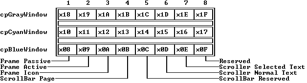

---

<a id="1CPIMWX"></a>

### TWindow::TWindow

*Keywords: TWindow::TWindow*

[TWindow class](#TWindow)

 Form 1

 
```c
TWindow(const TRect& bounds, const char *aTitle, short aNumber);
```
 Form 2

 
```c
TWindow( StreamableInit streamableInit); // protected
```
#### Description
 Form 1: Calls the  TGroupconstructor to set * bounds. Sets default * stateto * sfShadow. Sets default * optionsto (* ofSelectable| * ofTopSelect). Sets default * growModeto * gfGrowAll| * gfGrowRel. Sets default * flagsto (* wfMove| * wfGrow| * wfClose| * wfZoom). Sets the * titledata member to * aTitle, the * numberdata member to * aNumber. Calls  initFrameby default, and if the resulting * framepointer is nonzero, inserts it in this window's group. Finally, the default * zoomRectis set to the given * bounds.

  Form 2: Each streamable class needs a "builder" to allocate the correct memory for its objects together with the initialized vtable pointers. This is achieved by calling this constructor with an argument of type  StreamableInit. 

 Destructor

 
```c
~TWindow();
```
 Deletes title, then disposes of the window any subviews by calling the parent destructor(s).

---

<a id="TWindow_flags"></a>

### TWindow::flags

*Keywords: flags*

[TWindow class](#TWindow)
#### Syntax
```c
uchar flags;
```
#### Description
 The * flagsdata member contains combinations of the following bits:

 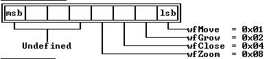

---

<a id="TWindow_frame"></a>

### TWindow::frame

*Keywords: frame*

[See Also](#1QOVRT)	 [TWindow class](#TWindow)
#### Syntax
```c
TFrame *frame;
```
#### Description
 *frameis a pointer to this window's associated  TFrameobject.

---

<a id="1QOVRT"></a>

#### See Also
 [TWindow::initFrame](#1IKGPBZ)

---

<a id="N2TG7N"></a>

### TWindow::number

*Keywords: number*

[TWindow class](#TWindow)
#### Syntax
```c
short number;
```
#### Description
 The number assigned to this window. If  TWindow::numberis between 1 and 9, the number will appear in the frame title, and the window can be selected with the Alt-* nkeys (* n= 1 to 9).

---

<a id="32PVYWU"></a>

### TWindow::palette

*Keywords: palette*

[See Also](#1I9F3SP)	 [TWindow class](#TWindow)
#### Syntax
```c
short palette;
```
#### Description
 Specifies which palette the window is to use: * wpBlueWindow, * wpCyanWindow, or * wpGrayWindow. The default palette is * wpBlueWindow.

---

<a id="1I9F3SP"></a>

#### See Also
 [TWindow::getPalette](#I0LIHP)

---

<a id="TWindow_title"></a>

### TWindow::title

*Keywords: title*

[TWindow class](#TWindow)
#### Syntax
```c
const char *title;
```
#### Description
 A character string giving the (optional) title that appears on the frame.

---

<a id="1NP_GGB"></a>

### TWindow::zoomRect

*Keywords: zoomRect*

[TWindow class](#TWindow)
#### Syntax
```c
TRect zoomRect;
```
#### Description
 The normal, unzoomed boundary of the window.

---

<a id="TWindow_build"></a>

### TWindow::build

*Keywords: build*

[See Also](#QJ5PVT)	 [TWindow class](#TWindow)
#### Syntax
```c
static TStreamable *build();
```
#### Description
 Called to create an object in certain stream-reading situations.

---

<a id="QJ5PVT"></a>

#### See Also
 [TStreamableClass](#TStreamableClass)

 [ipstream::readData](#3MVS.PE)

---

<a id="TWindow_close"></a>

### TWindow::close

*Keywords: close*

[See Also](#.IDR_J)	 [TWindow class](#TWindow)
#### Syntax
```c
virtual void close();
```
#### Description
 Calls  valid(* cmClose); if * Trueis returned, the calling window is deleted.

---

<a id=".IDR_J"></a>

#### See Also
 [TView::valid](#TView_valid)

---

<a id="I0LIHP"></a>

### TWindow::getPalette

*Keywords: getpalette*

[See Also](#.QFVK1)	 [TWindow class](#TWindow)
#### Syntax
```c
virtual TPalette& getPalette() const;
```
#### Description
 Returns the palette string given by the palette index in the * palettedata member.

---

<a id=".QFVK1"></a>

#### See Also
 [TWindow::palette](#32PVYWU)

---

<a id="11_6ZMG"></a>

### TWindow::getTitle

*Keywords: getTitle*

[See Also](#AENTCQ)	 [TWindow class](#TWindow)
#### Syntax
```c
virtual const char *getTitle();
```
#### Description
 Returns * title, the window's title string.

---

<a id="AENTCQ"></a>

#### See Also
 [TWindow::title](#TWindow_title)

---

<a id="62MM_0Z"></a>

### TWindow::handleEvent

*Keywords: handleEvent*

[See Also](#R5I4L)	 [TWindow class](#TWindow)
#### Syntax
```c
virtual void handleEvent(TEvent& event);
```
#### Description
 First calls  TGroup::handleEvent, and then handles events specific to a  TWindowas follows:

 The following * evCommandevents are handled if the * TWindow::flags

 data member permits that operation: * cmResize(move or resize the window using the  TView::dragViewmember function), * cmClose(close the window by creating a * cmCancelevent), and * cmZoom(zoom the window using the  TWindow::zoommember function).

 * evKeyDownevents with a * keyCodevalue of * kbTabor * kbShiftTabare handled by selecting the next or previous selectable subview (if any).

 An * evBroadcastevent with a * commandvalue of * cmSelectWindowNumis handled by selecting the window if the * event.infoIntdata member is equal to * number.

---

<a id="R5I4L"></a>

#### See Also
 [TGroup::handleEvent](#29EKHW)

 [TWindow::zoom](#TWindow_zoom)

---

<a id="1IKGPBZ"></a>

### TWindow::initFrame

*Keywords: initFrame*

[See Also](#_DXPH)	 [TWindow class](#TWindow)
#### Syntax
```c
virtual void initFrame(TRect);
```
#### Description
 Creates a  TFrameobject for the window and stores a pointer to the frame in the  TWindow::framedata member. TWindow's constructor calls  initFrame; it should never be called directly. You can override  initFrameto instantiate a user-defined class derived from  TFrameinstead of the standard  TFrame.

---

<a id="_DXPH"></a>

#### See Also
 [TWindow::TWindow](#1CPIMWX)

---

<a id="TWindow_read"></a>

### TWindow::read

*Keywords: read*

[See Also](#I57VWH)	 [TWindow class](#TWindow)
#### Syntax
```c
virtual void *read( ipstream& is);   //protected
```
#### Description
 Reads from the input stream * is.

---

<a id="I57VWH"></a>

#### See Also
 [TStreamable](#TStreamable)

 [ipstreamclasses](#ipstream)

---

<a id="L.EJQP"></a>

### TWindow::setState

*Keywords: setstate*

[See Also](#3IAE_H6)	 [TWindow class](#TWindow)
#### Syntax
```c
virtual void setState(ushort aState, Boolean enable);
```
#### Description
 First calls  TGroup::setState(* aState, * enable). Then, if * aStateis equal to * sfSelected, activates or deactivates the window and all its subviews using a call to  setState(* sfActive, enable), and calls  TView::enableCommandsor  TView::disableCommandsfor * cmNext, * cmPrev, * cmResize, * cmClose, and * cmZoom.

---

<a id="3IAE_H6"></a>

#### See Also
 [TGroup::setState](#4L9N.P)

 [TView::enableCommands](#3XUP8J5)

 [TView::disableCommands](#5XS3.SB)

---

<a id="1KL.Z9T"></a>

### TWindow::shutDown

*Keywords: shutDown*

[TWindow class](#TWindow)
#### Syntax
```c
virtual void shutDown();
```
#### Description
 Sets frame pointer to 0 and calls  TGroup::shutDown().

---

<a id="2HV.813"></a>

### TWindow::sizeLimits

*Keywords: sizeLimits*

[See Also](#1CUU5DP)	 [TWindow class](#TWindow)
#### Syntax
```c
virtual void sizeLimits(TPoint& min, TPoint& max);
```
#### Description
 Overrides  TView::sizeLimits. First calls  TView::sizeLimits(* min, * max) and then changes * minto the minimum window size, currently preset to (16, 6).

---

<a id="1CUU5DP"></a>

#### See Also
 [TView::sizeLimits](#AYFUWM)

---

<a id="113JQJP"></a>

### TWindow::standardScrollBar

*Keywords: standardScrollBar*

[TWindow class](#TWindow)
#### Syntax
```c
TScrollBar *standardScrollBar(ushort aOptions);
```
#### Description
 Creates, inserts, and returns a pointer to a "standard" scroll bar for the window. "Standard" means the scroll bar fits onto the frame of the window without covering the corners or the resize icon.

 The * aOptionsparameter can be either * sbHorizontalto produce a horizontal scroll bar along the bottom of the window or * sbVerticalto produce a vertical scroll bar along the right side of the window. Either may be combined with sbHandleKeyboard to allow the scroll bar to respond to arrows and page keys from the keyboard in addition to mouse clicks.

---

<a id="TWindow_write"></a>

### TWindow::write

*Keywords: write*

[See Also](#0874G3)	 [TWindow class](#TWindow)
#### Syntax
```c
virtual void write( opstream& os);   //protected
```
#### Description
 Writes to the output stream * os.

---

<a id="0874G3"></a>

#### See Also
 [TStreamableClass](#TStreamableClass)

 [TStreamable](#TStreamable)

 [opstream classes](#opstream)

---

<a id="TWindow_zoom"></a>

### TWindow::zoom

*Keywords: zoom*

[See Also](#3C4.05H)	 [TWindow class](#TWindow)
#### Syntax
```c
virtual void zoom();
```
#### Description
 Zooms the calling window. This member function is usually called in response to a * cmZoomcommand (triggered by a click on the zoom icon).  zoomtakes into account the relative sizes of the calling window and its owner, and the value of * zoomRect.

---

<a id="3C4.05H"></a>

#### See Also
 [TView::locate](#QHM624)

 [TWindow::zoomRect](#1NP_GGB)

---

<a id="TWindowInit"></a>

### TWindowInit Class

*Keywords: TWindowInit*

[Inheritance](#TVFlow_1)
#### Header File
 views.h
#### Description
 TWindowinherits multiply from  TGroupand the virtual base class  TWindowInit. The latter provides a constructor and  createFramemember function used in creating and inserting a frame object. A similar technique is used for  TProgram,  THistoryWindow, and  TDeskTop.

 Constructors

 
```c
TWindowInit
```

```c
2PYIYZ( TFrame *(*cFrame) ( TRect bounds ));
```
#### Member Functions
```c
TFrame *(* createFrame
```

```c
54PP8VE) ( TRect bounds );
```

---

<a id="2PYIYZ"></a>

### TWindowInit::TWindowInit

*Keywords: TWindowInit::TWindowInit*

[See Also](#.PB2BZ)	 [TWindowInit class](#TWindowInit)
#### Syntax
```c
TWindowInit( TFrame *(*cFrame) ( TRect bounds ));
```
#### Description
 This constructor takes a function address argument, usually & TWindow::initFrame. The  TWindowconstructor invokes  TGroup(* bounds) and  TWindowInit(& TWindow::initFrame) to create a window object and associated frame. The latter is inserted in the window group object.

---

<a id=".PB2BZ"></a>

#### See Also
 [TGroup](#TGroup)

 [TWindow constructor](#1CPIMWX)

 [TWindow::initFrame](#1IKGPBZ)

---

<a id="54PP8VE"></a>

### TWindowInit::createFrame

*Keywords: createFrame*

[TWindowInit class](#TWindowInit)
#### Syntax
```c
TFrame *(*createFrame) ( TRect bounds );
```
#### Description
 Called by the  TWindowInitconstructor to create a  TFrameobject with the given bounds and return a pointer to it. A 0 pointer indicates this effort failed.

---

<a id="APKE_K"></a>

### Miscellaneous Reference

These are all of the elements of Turbo Vision that are not part of the Turbo Vision standard class hierarchy. These include typedefs, enumerations, constants, variables, and non-member (global) functions defined in the Turbo Vision header files.

 [ap XXXX constants](#apXXXX)

 [bf XXXX constants](#bfXXXX)

 [Boolean enumeration](#Booleanenumeration)

 [BUILDER typedef](#BUILDER)

 [ccAppFunc typedef](#ccAppFunc)

 [ccIndex typedef](#ccIndex)

 [ccNotFound constant](#ccNotFound)

 [ccTestFunc typedef](#ccTestFunc)

 [cdXXXX constants](#cdXXXX)

 [cfXXXX constants](#cfXXXX)

 [CharScanType](#CharScanType)

 [cmXXXX constants](#cmXXXX)

 [cstrlen function](#cstrlen)

 [ctrlToArrow function](#ctrlToArrow)

 [DEFAULT_SAFETY_POOL_SIZE constant](#DEFAULT_SAFETY_POOL_SIZE)

 [dmXXXX constants](#dmXXXX)

 [dpXXXX constants](#dpXXXX)

 [EOS constant](#EOS)

 [eventQSize constant](#eventQSize)

 [evXXXX constants](#evXXXX)

 [fdXXXX constants](#fdXXXX)

 [focusedEvents constant](#focusedEvents)

 [genRefs function](#genRefs)

 [getAltChar function](#getAltChar)

 [getAltCode function](#getAltCode)

 [gfXXXX constants](#gfXXXX)

 [hcXXXX constants](#hcXXXX)

 [historyAdd function](#historyAdd)

 [historyCount function](#historyCount)

 [historyStr function](#historyStr)

 [InputBox function](#InputBox)

 [InputBoxRect function](#InputBoxRect)

 [kbXXXX constants](#kbXXXX)

 [KeyDownEvent](#KeyDownEvent)

 [lowMemory function](#lowMemory)

 [maxCollectionSize variable](#maxCollectionSize)

 [maxFindStrLen constant](#maxFindStrLen)

 [maxReplaceStrLen constant](#maxReplaceStrLen)

 [maxViewWidth constant](#maxViewWidth)

 [mbXXXX constants](#mbXXXX)

 [message function](#message)

 [messageBox function](#messageBox)

 [messageBoxRect function](#messageBoxRect)

 [MessageEvent structure](#MessageEvent)

 [meXXXX constants](#meXXXX)

 [mfXXXX constants](#mfXXXX)

 [MouseEventType structure](#MouseEventType)

 [moveBuf function](#moveBuf)

 [moveChar function](#moveChar)

 [moveCStr function](#moveCStr)

 [moveStr function](#moveStr)

 [newStr function](#newStr)

 [ofXXXX constants](#ofXXXX)

 [operator +](#27QG_WS)

 [operator delete](#operatordelete)

 [operator new](#operatornew)

 [ovXXXX constants](#ovXXXX)

 [positionalEvents constant](#positionalEvents)

 [sbXXXX constants](#sbXXXX)

 [selectMode enumeration](#selectMode)

 [sfXXXX constants](#sfXXXX)

 [specialChars variable](#specialChars)

 [StreamableInit enumeration](#StreamableInit)

 [TScrollChars typedef](#TScrollChars)

 [TVTransfer enum](#TVTransfer)

 [uchar typedef](#uchar)

 [ushort typedef](#ushort)

 [voXXXX constants](#voXXXX)

 [wfXXXX constants](#wfXXXX)

 [wnNoNumber constant](#wnNoNumber)

 [wpXXXX constants](#wpXXXX)

 [write_args structure](#write_args)

---

<a id="apXXXX"></a>

### apXXXX constants

*Keywords: apXXXX, constants*

* XXXX
#### Header File
 app.h

 Values

 The following application palette constants are defined:

 Constant	 Value	 Meaning

 

| * apColor | 0 | Use palette for color screen |
| --- | --- | --- |
| * apBlackWhite | 1 | Use palette for LCD screen |
| * apMonochrome | 2 | Use palette for monochrome screen |
#### Description
 Constants beginning with * apdesignate which of three standard color palettes a Turbo Vision application should use: The palette for color, for black and white, or for monochrome displays.

---

<a id="Booleanenumeration"></a>

### Boolean enumeration

*Keywords: Boolean enumeration*

#### Header File
 ttypes.h
#### Syntax
```c
enum Boolean \- False, True ;
```
#### Description
 Assigns the  intvalues 0 to * Falseand 1 to * True. Note that the tests if ( tesfunc() ) \-... and if ( True == testfunc() ) \-... may not be equivalent.

---

<a id="BUILDER"></a>

### BUILDER typedef

*Keywords: BUILDER, typedefs*

[See Also](#GVMIC4)
#### Header File
 tobjstrm.h
#### Syntax
```c
typedef TStreamable*(*BUILDER)();
```
#### Description
 Each streamable class has a builder function of type  BUILDER. The builder provides raw memory of the correct size and initializes the vtable pointers when objects are created by certain stream read operations. The  readfunction of the streamable class reads data from the stream into the raw object provided by the builder.

---

<a id="GVMIC4"></a>

#### See Also
 [TView::build](#TView_build)

 [TStreamable](#TStreamable)

---

<a id="bfXXXX"></a>

### bfXXXX constants

*Keywords: bfXXXX, constants*

* XXXX

 [See Also](#1GQVGBK)
#### Header File
 dialogs.h

 Values

 The following button flags are defined:

 Constant	 Value	 Meaning

 

| * bfNormal | 0x00 | Button is a normal button |
| --- | --- | --- |
| * bfDefault | 0x01 | Button is the default button |
| * bfLeftJust | 0x02 | Button label is left-justified |
| * bfBroadcast | 0x04 | Button notifies its owner when its is pressed |
| * bfGrabFocus | 0x08 | Button receives input focus when clicked |
#### Description
 A combination of these values is passed in the * aFlagsargument to the  TButtonconstructor to determine the newly created button's style. * bfNormalindicates a normal, non-default button. * bfDefaultindicates that the button will be the default button. It is the responsibility of the programmer to ensure that there is only one default button in a  TGroup. The * bfLeftJustvalue can be added to * bfNormalor * bfDefaultand affects the position of the text displayed within the button: If clear, the label is centered; if set, the label is left-justified.

---

<a id="1GQVGBK"></a>

#### See Also
 [TButton::flags](#TButton_flags)

 [TButton::makeDefault](#DYZRQ.)

 [TButton::draw](#TButton_draw)

---

<a id="ccAppFunc"></a>

### ccAppFunc typedef

*Keywords: ccAppFunc, typedefs*

[See Also](#LG09PT)
#### Header File
 ttypes.h
#### Syntax
```c
typedef void (*ccAppFunc)( void *item, void *arg );
```
#### Description
 Used in iterator functions to provide an action function and argument list to be applied to a range of items in a collection.

---

<a id="LG09PT"></a>

#### See Also
 [TNSCollection::forEach](#1QTDZV8)

 [ccTestFunc](#ccTestFunc)

---

<a id="ccIndex"></a>

### ccIndex typedef

*Keywords: ccIndex, typedefs*

[See Also](#MKBU.N)
#### Header File
 ttypes.h
#### Syntax
```c
typedef int ccIndex;
```
#### Description
 Used to index and count the items in a collection.

---

<a id="MKBU.N"></a>

#### See Also
 [TNSCollection::at](#TNSCollection_at)

---

<a id="ccNotFound"></a>

### ccNotFound constant

*Keywords: ccNotFound, constants*

[See Also](#311O_AX)
#### Header File
 ttypes.h
#### Syntax
```c
const ccNotFound = -1;
```
#### Description
 The * ccIndexvalue returned by various collection-search functions if the search fails.

---

<a id="311O_AX"></a>

#### See Also
 [TNSCollection::indexOf](#M9SIVW)

---

<a id="ccTestFunc"></a>

### ccTestFunc typedef

*Keywords: ccTestFunc, typedefs*

[See Also](#1G_._JQ)
#### Header File
 ttypes.h
#### Syntax
```c
typedef Boolean (*ccTestFunc)( void *item, void *arg );
```
#### Description
 Used in iterator functions to provide a test function and argumentlist to be applied to a range of items in a collection.

---

<a id="1G_._JQ"></a>

#### See Also
 [TNSCollection::firstThat](#W3_QOP)

 [TNSCollection::lastThat](#2VTXYLN)

 [ccAppFunc](#ccAppFunc)

---

<a id="CharScanType"></a>

### CharScanType

*Keywords: CharScanType*

[See Also](#S0R6GI)
#### Syntax
```c
struct CharScanType

 \-

   uchar charCode;

   uchar scanCode;
```
#### Description
 The  CharScanTypestructure holds the data that characterizes a keystroke event; the character code and the scan code.

---

<a id="S0R6GI"></a>

#### See Also
 [KeyDownEvent](#KeyDownEvent)

 [TEvent](#TEvent)

---

<a id="KeyDownEvent"></a>

### KeyDownEvent

*Keywords: KeyDownEvent*

[See Also](#10I816J)
#### Syntax
```c
struct KeyDownEvent

 \-

   union

   \-

     ushort keyCode;

     CharScanType charScan;

    ;

 ;
```
#### Description
 The  KeyDownEventstructure is a union of * keyCode(a  ushort) and * charScan(of type  CharScanType). These two members represent two ways of viewing the same data: either as a scan code or as an  unsigned. Scan codes are what your program receives from the keyboard.  unsignedis needed in a  switchstatement.

---

<a id="10I816J"></a>

#### See Also
 [TEvent](#TEvent)

 [TEvent::getKeyEvent](#TEvent)

---

<a id="cdXXXX"></a>

### cdXXXX constants

*Keywords: cdXXXX*

* XXXX

 [See Also](#IZ1FH4)
#### Header File
 stddlg.h
#### Description
 These constants define the values passed to a change directory dialog box's constructor in the * aOptionsparameter.

 Values	 Constant Value	 Meaning

 

| * cdNormal | 0X0000 | Create the dialog box normally, including loading the directory. |
| --- | --- | --- |
| * cdNoLoadDir | 0X0001 | Initialize the dialog box without loading the directory contents. Used when creating a dialog box to store on a stream. |
| * cdHelpButton | 0X0002 | Put a help button in the dialog box. |

---

<a id="IZ1FH4"></a>

#### See Also
 [TChDirDialog](#TChDirDialog)

---

<a id="cfXXXX"></a>

### cfXXXX constants

*Keywords: cfXXXX*

* XXXX

 [See Also](#UFJ0Q4)
#### Header File
 [dialogs.h](#dialogs.h)
#### Description
 Multistate check boxes use the * cfXXXXconstants to specify how many bits in the * valuefield represent the state of each check box. The high-order word of the constant indicates the number of bits used for each check box, and the low-order word holds a bit mask used to read those bits.

 For example, * cfTwoBitsindicates that * valueuses two bits for each check box (making a maximum of 16 check boxes in the cluster), and masks each check box's values with the mask 0X03.

 Values	 Constant Value	 Meaning

 

| * cfOneBit | 0X0101 | 1 bit per checkbox |
| --- | --- | --- |
| * cfTwoBits | 0X0203 | 2 bits per check box |
| * cfFourBits | 0X040F | 4 bits per check box |
| * cfEightBits | 0X08FF | 8 bits per check box |

---

<a id="UFJ0Q4"></a>

#### See Also
 [TCheckBoxes](#TCheckBoxes)

---

<a id="cmXXXX"></a>

### cmXXXX constants

*Keywords: cmXXXX*

* XXXX

 [See Also](#4VWS67)
#### Header File
 [views.h](#views.h)
#### Description
 These constants represent Turbo Vision's predefined * commands. They are passed in the  TEvent::commanddata member of * evMessageevents (* evCommandand * evBroadcast), and cause the  handleEventmethods of Turbo Vision's standard objects to perform various tasks.

 Turbo Vision reserves constant values 0 through 99 and 256 through 999 for its own use. Standard Turbo Vision objects' event handlers respond to these predefined constants. You can define your own constants in the ranges 100 through 255 and 1,000 through 65,535 without conflicting with predefined commands.

 Values

 The standard commands in the following table are defined by Turbo Vision and used by standard Turbo Vision objects.

 Standard Command Codes

 Command	 Value	 Meaning

 

| * cmValid | 0 | Passed to  TView::validto check the validity of a newly instantiated view. |
| --- | --- | --- |
| * cmQuit | 1 | Causes  TProgram::handleEventto call  endModal(cmQuit), terminating the application. The status line or one of the menus typically contains an entry that maps * kbAltXto * cmQuit. |
| * cmError | 2 | Never handled by any object. May be used to represent unimplemented or unsupported commands. |
| * cmMenu | 3 | Causes  TMenuView::handleEventto call  execViewon itself to perform a menu selection process, the result of which may generate a new command through  putEvent. The status line typically contains an entry that maps * kbF10to * cmMenu. |
| *cmClose | 4 | Handled by  TWindow::handleEventif the * infoPtrdata member of the event record is 0 or points to the window. If the window is modal (such as a modal dialog), an * evCommandwith a value of * cmCancelis generated through putEvent. If the window is modeless, the window's  closemember function is called if the window supports closing (see * wfClose flag). A click in a window's close box generates an e* vCommandevent with a * commandof * cmCloseand an * infoPtrthat points to the window. The status line or one of the menus typically contains an entry that maps * kbAltF3 to * cmClose. |
| * cmZoom | 5 | Causes  TWindow::handleEventto call  TWindow::zoomon itself if the window supports zooming (see * wfZoomflag) and if the * infoPtrdata member of the event record is 0 or points to the window. A click in a window's zoom box or a double-click on a window's title bar generates an * evCommandevent with a * commandof * cmZoomand an * infoPtrthat points to the window. The status line or one of the menus typically contains an entry that maps * kbF5to * cmZoom. |
| * cmResize | 6 | Causes  TWindow::handleEventto call  TView::dragViewon itself if the window supports resizing (see * wfMoveand * wfGrowflags). The status line or one of the menus typically contains an entry that maps * kbCtrlF5to * cmResize. |
| * cmNext | 7 | Causes  TDeskTop::handleEventto move the last window on the desktop in front of all other windows. The status line or one of the menus typically contains an entry that maps * kbF6to * cmNext. |
| * cmPrev | 8 | Causes  TDeskTop::handleEventto move the first window on the desktop behind all other windows. The status line or one of the menus typically contains an entry that maps * kbShiftF6to * cmPrev. |
| * cmHelp | 9 |  |

 These standard commands listed in define the default behavior of dialog box objects.

 Command	 Value	 Meaning

 

| * cmOK | 10 | OK button was pressed |
| --- | --- | --- |
| * cmCancel | 11 | Dialog box was canceled by Cancel button, close icon, or Esc key |
| * cmYes | 12 | Yes button was pressed |
| * cmNo | 13 | No button was pressed |
| * cmDefault | 14 | Default button was pressed |

 An event with either the * cmOK, * cmCancel, * cmYes, or * cmNocommand causes a modal dialog's  TDialog::handleEventto terminate the dialog and return that value (by calling  endModal). A modal dialog typically contains at least one  TButtonwith one of these command values.  TDialog::handleEvent generates a * cmCancelcommand event in response to a * kbEsc keyboard event.

 The * cmDefaultcommand causes the  TButton::handleEventof a default button (see * bfDefault flag) to simulate a button press.  TDialog::handleEventgenerates a * cmDefaultcommand event in response to a * kbEnterkeyboard event.

 Command	 Value	 Meaning

 

| * cmCut | 20 | Editor command codes |
| --- | --- | --- |
| * cmCopy | 21 |  |
| * cmPaste | 22 |  |
| * cmUndo | 23 |  |
| * cmClear | 24 |  |
| * cmTile | 25 |  |
| * cmCascade | 26 |  |

 

| * cmReceivedFocus | 50 | TView::setState uses the  message function to send an * evBroadcast. |
| --- | --- | --- |
| * cmReleasedFocus | 51 | event with one of these values to its  TView::owner whenever * sfFocusedis changed. The * infoPtrof the event points to the view itself. This in effect informs any peer views that the view has received or released focus, and that they should update themselves appropriately.  TLabelobjects, for example, respond to these commands by highlighting or  unhighlighting themselves when the peer view they label is focused or unfocused. |
| * cmCommandSetChanged | 52 | The  TProgram::idlemember function generates an evBroadcast event with this value whenever it detects a change in the current command set (as caused by a call to TView's  enableCommands,  disableCommands, or  setCommandsmethods). The  cmCommand-setChangedbroadcast is sent to the  handleEventof * everyview in the physical hierarchy (unless their eventMask specifically masks out * evBroadcastevents). If a view's appearance is affected by command set changes, it should react to * cmCommandSetChangedby redrawing itself.  TButton,  TMenuView, and  TStatusLineobjects, for example, react to this command by redrawing themselves. |
| * cmScrollBarChanged | 53 | A  TScrollBar uses the  message function to send an * evBroadcast. |
| * cmScrollBarClicked | 54 | event with one of these values to its owner whenever its value changes or whenever the mouse is clicked on the scroll bar. The * infoPtrof the event points to the scroll bar itself. Such broadcasts are reacted upon by any peer views controlled by the scroll bar, such as  TScrollerand  TListViewerobjects. |
| * cmSelectWindowNum | 55 | Causes  TWindow::handleEventto call  TView::selecton itself if the * infoIntof the event record corresponds to * TWindow::number.  TProgram::handleEventresponds to Alt-1 through Alt-9 keyboard events by broadcasting a * cmSelectWindowNumevent with an * infoIntof 1 through 9. |
| *cmListItemSelected | 56 | TListViewer message that an item has been selected. |
| * cmRecordHistory | 60 | Causes a  THistoryobject to "record" the current contents of the  TInputLineobject it controls. A  TButtonsends a * cmRecordHistorybroadcast to its owner when it is pressed, in effect causing all THistory objects in a dialog to "record" at that time. |

 Turbo Vision 2.0 defines new command constants for the items on the standard file menu.

 The views.h header file defines the following standard application commands:

 Constant	 Value	 Meaning

 

| * cmNew | 30 | Open new file, from File|New |
| --- | --- | --- |
| * cmOpen | 31 | Open existing file, from File|Open |
| * cmSave | 32 | Save current file, from File|Save |
| * cmSaveAs | 33 | Save and rename file, from File|Save As |
| * cmSaveAll | 34 | Save all open files, from File|Save All |
| * cmChangeDir | 35 | Change current directory, from File|Change Dir |
| * cmDosShell | 36 | Shell to DOS, from File|DOS Shell |
| * cmCloseAll | 37 | Close all open files, from File|Close All |

---

<a id="4VWS67"></a>

#### See Also
 [TView::handleEvent](#4H2TBJ)

 [TCommandSet](#TCommandSet)

---

<a id="cstrlen"></a>

### cstrlen function

*Keywords: cstrlen*

[See Also](#CF1SUH)
#### Header File
 util.h
#### Syntax
```c
int cstrlen( const char *s );
```
#### Description
 Returns the length of string * s, where * sis a control string using tilde characters (~) to designate hot keys. The tildes are excluded from the length of the string, as they will not appear on the screen. For example, given the argument "~B~roccoli",  cstrlenreturns 8.

---

<a id="CF1SUH"></a>

#### See Also
 [moveCStr](#moveCStr)

---

<a id="ctrlToArrow"></a>

### ctrlToArrow function

*Keywords: ctrlToArrow*

#### Header File
 util.h
#### Syntax
```c
ushort ctrlToArrow( ushort keyCode);
```
#### Description
 Converts a WordStar-compatible control key code to the corresponding cursor key code. If the low byte of keyCode matches one of the control key values below, the result is the corresponding kbXXXX constant. Otherwise, keyCode is returned unchanged.

 Keystroke	 Lo(keyCode)	 Result

 

| Ctrl-A | 0x01 | * kbHome |
| --- | --- | --- |
| Ctrl-D | 0x04 | * kbRight |
| Ctrl-E | 0x05 | * kbUp |
| Ctrl-F | 0x06 | * kbEnd |
| Ctrl-G | 0x07 | * kbDel |
| Ctrl-S | 0x13 | * kbLeft |
| Ctrl-V | 0x16 | * kbIns |
| Ctrl-X | 0x18 | * kbDown |

---

<a id="DEFAULT_SAFETY_POOL_SIZE"></a>

### DEFAULT_SAFETY_POOL_SIZE constant

*Keywords: DEFAULT_SAFETY_POOL_SIZE*

[See Also](#1RYWS.)
#### Header File
 [buffers.h](#buffers.h)
#### Syntax
```c
const DEFAULT_SAFETY_POOL_SIZE = 4096;
```
#### Description
 Gives the initial default safety pool size in bytes. You can change this value by editing the declaration. If you call  TVMemMgr::resizeSafetyPoolwith no size argument, this default value is assumed.

---

<a id="1RYWS."></a>

#### See Also
 [TVMemMgr::resizeSafetyPool](#19T9ZR3)

---

<a id="dmXXXX"></a>

### dmXXXX constants

*Keywords: dmXXXX*

* XXXX
#### Header File
 [views.h](#views.h)

 Values

 The * dragModebits are defined as follows:

 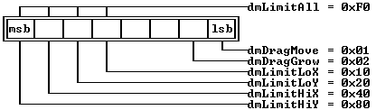
#### Description
 The drag mode constants are used to compose the * modeargument of the  TView::dragViewmethod. They specify whether the view is allowed to move and/or change size, and how to interpret the * limitsargument.

 The  drag modeconstants are defined as follows:

 Constant	 Meaning

 

| * dmDragMove | Allow the view to move. |
| --- | --- |
| * dmDragGrow | Allow the view to change size. |
| * dmLimitLoX | The view's left-hand side cannot move outside * limits. |
| * dmLimitLoY | The view's top side cannot move outside * limits. |
| * dmLimitHiX | The view's right-hand side cannot move outside * limits. |
| * dmLimitHiY | The view's bottom side cannot move outside * limits. |
| * dmLimitAll | No part of the view can move outside * limits. |

 The dragMode data member of a  TViewobject can contain any combination of the dmLimitXX flags; by default, the  TViewconstructor sets the data member to dmLimitLoY. Currently, the dragMode data member is used only in  TWindow::dragViewwhen a window is moved or resized.

---

<a id="dpXXXX"></a>

### dpXXXX constants

*Keywords: dpXXXX*

* XXXX
#### Header File
 [dialogs.h](#dialogs.h)
#### Description
 Dialog box objects use the dpXXXX constants to specify which of the three standard color palettes to use. By default, dialog box objects use dpGrayDialog. You can choose one of the other standard palettes by setting the dialog box's palette member variable to one of the other dpXXXX constants after constructing the dialog box object.

 Values

 Constant	 Value	 Meaning

 

| * dpBlueDialog | 0 | Dialog box background is blue |
| --- | --- | --- |
| * dpCyanDialog | 1 | Dialog box background is cyan |
| * dpGrayDialog | 2 | Dialog box background is gray |

---

<a id="EOS"></a>

### EOS constant

*Keywords: EOS*

#### Header File
 [ttypes.h](#ttypes.h)
#### Syntax
```c
const char EOS = '\0';
```
#### Description
 A synonym for the end-of-string null character.

---

<a id="eventQSize"></a>

### eventQSize constant

*Keywords: eventQSize*

#### Header File
 [config.h](#config.h)
#### Syntax
```c
const eventQSize = 16;
```
#### Description
 Specifies the size of the event queue.

---

<a id="evXXXX"></a>

### evXXXX constants

*Keywords: evXXXX*

* XXXX

 [See Also](#.Y3E1.)
#### Header File
 [system.h](#system.h)
#### Description
 These mnemonics indicate types of events to Turbo Vision event handlers. * evXXXXconstants are used in several places: In the event data member of an event structure, in the eventMask data member of a view object, and in the * positionalEventsand * focusedEventsvariables.

 Values

 The following event flag values designate standard event types:

 Constant	 Value	 Meaning

 

| * evMouseDown | 0x0001 | Mouse button pressed |
| --- | --- | --- |
| * evMouseUp | 0x0002 | Mouse button released |
| * evMouseMove | 0x0004 | Mouse changed location |
| * evMouseAuto | 0x0008 | Periodic event while mouse button held down |
| * evKeyDown | 0x0010 | Key pressed |
| * evCommand | 0x0100 | Command event |
| * evBroadcast | 0x0200 | Broadcast event |

 The following constants can be used to mask types of events:

 Constant	 Value	 Meaning

 

| * evNothing | 0x0000 | Event already handled |
| --- | --- | --- |
| * evMouse | 0x000F | Mouse event |
| * evKeyboard | 0x0010 | Keyboard event |
| * evMessage | 0xFF00 | Message (command, broadcast, or user-defined) event |

 The event mask bits are defined as follows:

 Event Mask Bit Mapping

 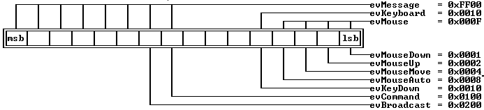

 The standard event masks can be used to determine whether an event belongs to a particular "family" of events. For example:

 
```c
 	 if ( (event.what & evMouse) != 0 ) doMouseEvent();
```

---

<a id=".Y3E1."></a>

#### See Also
 [TEvent](#TEvent)

 [TView::eventMask](#HQ.SC1)

 [TEvent::getKeyEvent](#TEvent)

 [TEvent::getMouseEvent](#TEvent)

 [TView::handleEvent](#4H2TBJ)

 [positionalEvents](#positionalEvents)

 [focusedEvents](#focusedEvents)

---

<a id="fdXXXX"></a>

### fdXXXX constants

*Keywords: fdXXXX*

* XXXX

 [See Also](#1.2.IOZ)
#### Header File
 stddlg.h
#### Description
 The * fdXXXXconstants are passed in the * aOptionsparameter to the constructor of  TFileDialogobjects.

 Values	 Constant Value	 Meaning

 

| * fdOkButton | 0X001 | Put an OK button in the dialog. |
| --- | --- | --- |
| * fdOpenButton | 0X002 | Put an Open button in the dialog. |
| * fdReplaceButton | 0X004 | Put a Replace button in the dialog. |
| * fdClearButton | 0X008 | Put a Clear button in the dialog. |
| * fdHelpButton | 0X010 | Put a Help button in the dialog. |
| * fdNoLoadDir | 0X100 | Do not load the current directory contents into the dialog upon construction. This means you intend to change the * wildCarddata member by using * setDatamember function or store the dialog on a stream. |

 File Dialog Box Option Flags

 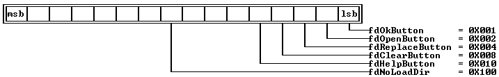

---

<a id="1.2.IOZ"></a>

#### See Also
 [TFileDialog](#TFileDialog)

---

<a id="focusedEvents"></a>

### focusedEvents constant

*Keywords: focusedEvents*

[See Also](#HHO.6F)
#### Header File
 [views.h](#views.h)
#### Syntax
```c
focusedEvents = evKeyboard | evCommand;
```
#### Description
 Defines the event classes that are * focusedevents. The * focusedEventsand * positionalEvents values are used by  TGroup::handleEventto determine how to dispatch an event to the group's subviews. If an event class isn't contained in * focusedEvents or * positionalEvents, it is treated as a broadcast event.

---

<a id="HHO.6F"></a>

#### See Also
 [positionalEvents](#positionalEvents)

 [TGroup::handleEvent](#29EKHW)

 [TEvent](#TEvent)

 [evXXXX](#evXXXX)

---

<a id="genRefs"></a>

### genRefs function

*Keywords: genRefs*

#### Header File
 geninc.h
#### Syntax
```c
void genRefs();
```
#### Description
 genRefsis used by GENINC.CPP to generate assembler offsets for various class data members. GENINC.EXE creates the TVWRITE.INC file needed to build TV.LIB.  genRefsis a friend function of  TDrawBuffer,  TEditor,  TEventQueue,  TTerminal,  TView, and  TGroup. It will be of interest only to advanced users who want to develop their own Turbo Vision libraries.

---

<a id="getAltChar"></a>

### getAltChar function

*Keywords: getAltChar*

[See Also](#_LVCQG)
#### Header File
 util.h
#### Syntax
```c
char getAltChar( ushort keyCode);
```
#### Description
 Returns the character * chfor which Alt-* chproduces the 2-byte scan code given by the argument * keyCode. This function gives the reverse mapping to  getAltCode.

---

<a id="_LVCQG"></a>

#### See Also
 [getAltCode](#getAltCode)

---

<a id="getAltCode"></a>

### getAltCode function

*Keywords: getAltCode*

[See Also](#1.6B0XB)
#### Header File
 util.h
#### Syntax
```c
ushort getAltCode( char ch );
```
#### Description
 Returns the 2-byte scan code (key code) corresponding to Alt-* ch. This function gives the reverse mapping to  getAltChar.

---

<a id="1.6B0XB"></a>

#### See Also
 [getAltChar](#getAltChar)

---

<a id="gfXXXX"></a>

### gfXXXX constants

*Keywords: gfXXXX*

* XXXX

 [See Also](#85_1P3)
#### Header File
 [views.h](#views.h)
#### Description
 These mnemonics set the * growMode data member in all  TViewand derived objects. The bits set in * growMode determine how the view will grow in relation to changes in its owner's size.

 Values

 The growMode bits are defined as follows:

 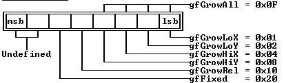

 Note that * LoX= left side; * LoY= top side; * HiX= right side; * HiY= bottom side.

 Constant	 Meaning

 

| * gfGrowLoX | If set, the left-hand side of the view maintains a constant distance from its owner's right-hand side. If not set, the movement indicated won't occur. |
| --- | --- |
| * gfGrowLoY | If set, the top of the view maintains a constant distance from the bottom of its owner. |
| * gfGrowHiX | If set, the right-hand side of the view maintains a constant distance from its owner's right side. |
| * gfGrowHiY | If set, the bottom of the view maintains a constant distance from the bottom of its owner. |
| * gfGrowAll | If set, the view moves with the lower-right corner of its owner. |
| * gfGrowRel | For use with  TWindowobjects that are in the desktop. The view changes size relative to the owner's size, and maintains that relative size with respect to the owner even when switching between 25 and 43/50 line modes. |
| * gfFixed | Prevents view from being permanently clipped by owner. |

---

<a id="85_1P3"></a>

#### See Also
 [TView::growMode](#1ETXH5K)

---

<a id="hcXXXX"></a>

### hcXXXX constants

*Keywords: hcXXXX*

* XXXX

 [See Also](#RHTK5D)
#### Header File
 [views.h](#views.h)

 Values

 The following help-context constants are defined:

 Constant	 Value	 Meaning

 

| * hcNoContext | 0 | No context specified |
| --- | --- | --- |
| * hcDragging | 1 | Object is being dragged |
#### Description
 The default value of * TView::helpCtxis * hcNoContext, which indicates that there is no help context for the view.  TView::getHelpCtxreturns hcDragging whenever the view is being dragged (as indicated by the * sfDraggingstate flag).

 Turbo Vision reserves help context values 0 through 999 for its own use. Programmers can define their own constants in the range 1,000 to 65,535.

---

<a id="RHTK5D"></a>

#### See Also
 [TView::getHelpCtx](#22ZVNO5)

 [TStatusLine::update](#T1GDSE)

---

<a id="historyAdd"></a>

### historyAdd function

*Keywords: historyAdd*

#### Header File
 util.h
#### Syntax
```c
void historyAdd( uchar id, const char *str);
```
#### Description
 Adds the string * strto the history list indicated by * id.

---

<a id="historyCount"></a>

### historyCount function

*Keywords: historyCount*

#### Header File
 util.h
#### Syntax
```c
ushort historyCount( uchar id );
```
#### Description
 Returns the number of strings in the history list corresponding to ID number id.

---

<a id="historyStr"></a>

### historyStr function

*Keywords: historyStr*

#### Header File
 util.h
#### Syntax
```c
const char *historyStr( uchar id, int index);
```
#### Description
 Returns the * index'th string in the history list corresponding to ID number * id.

---

<a id="InputBox"></a>

### InputBox function

*Keywords: InputBox*

[See Also](#2FRZ8RD)
#### Header File
 [msgbox.h](#msgbox.h)
#### Syntax
```c
ushort inputBox( const char *title, const  char *aLabel, char *s,  uchar limit );
```
#### Description
 Displays an input box with the given title and label. Accepts input to string * swith a maximum of * limitcharacters.

---

<a id="2FRZ8RD"></a>

#### See Also
 [inputBoxRect](#InputBoxRect)

---

<a id="InputBoxRect"></a>

### InputBoxRect function

*Keywords: InputBoxRect*

[See Also](#15MJ0VW)
#### Header File
 [msgbox.h](#msgbox.h)
#### Syntax
```c
ushort inputBoxRect( const TRect &bounds,  const char *title,  const char *aLabel,  char *s,  uchar limit );
```
#### Description
 Displays an input box with the given bounds, title, and label. Accepts input to string * swith a maximum of * limitcharacters.

---

<a id="15MJ0VW"></a>

#### See Also
 [inputBox](#InputBox)

---

<a id="kbXXXX"></a>

### kbXXXX constants

*Keywords: kbXXXX*

* XXXX

 [See Also](#31WF_H.)
#### Header File
 [tkeys.h](#tkeys.h)

 Values

 These following table shows the values that define keyboard states, and can be used when examining the keyboard shift state, which is stored in a byte at absolute address 0x40:0x17.

 Keyboard State And Shift Masks

 Constant	 Value	 Meaning

 

|  |  | 16-bit | 32-bit |
| --- | --- | --- | --- |
| *kbLeftShift | 0x0001 | 0x0010 | Set if the Right Shift key is currently down |
| * kbRightShift | 0x0002 | 0x0010 | Set if the Left Shift key is currently down |
| * kbShift | 0x0003 | 0x0010 | Either shift key is pressed |
| * kbLeftCtrl | 0x0004 | 0x0008 | Set if the Ctrl key is currently down |
| * kbRightCtrl | 0x0004 | 0x0004 | Either control key is pressed |
| * kbCtrlShift | 0x0004 | 0x000C | Either control key is pressed |
| * kbLeftAlt | 0x0008 | 0x0002 | Left alt key is pressed |
| * kbRightAlt | 0x0008 | 0x0001 | Right alt key is pressed |
| * kbAltShift | 0x0008 | 0x0003 | Set if the Alt key is currently down |
| * kbScrollState | 0x0010 | 0x0040 | Set if the keyboard is in the Scroll Lock state |
| * kbNumState | 0x0020 | 0x0020 | Set if the keyboard is in the Num Lock state |
| * kbCapsState | 0x0040 | 0x0080 | Set if the keyboard is in the Caps Lock state |
| * kbInsState | 0x0080 | 0x0200 | Set if  the keyboard is in the Ins Lock state |

 The key state for an event can be checked by examining the * controlKeyStatedata member of either  TEvent::mouseor  TEvent::keyDown, depending on the type of event. Notice that the values in the above table indicate that distinguishing between the left and right alt or control keys in 16-bit mode is not possible.

 It is not possible to distinguish between left and right shift keys in keys in 32-bit mode. You should not use kbLeftxxx or kbRightxxx constants when your program needs to be highly portable.

 These following table shows the values that define keyboard scan codes and can be used when examining the  TEvent::keyCodedata member of an * evKeyDownevent record:

 Alt-Letter Key Codes

 Constant	 Value

 

| * kbAltA | 0x1E00 |
| --- | --- |
| * kbAltN | 0x3100 |
| * kbAltB | 0x3000 |
| * kbAltO | 0x1800 |
| * kbAltC | 0x2E00 |
| * kbAltP | 0x1900 |
| * kbAltD | 0x2000 |
| * kbAltQ | 0x1000 |
| * kbAltE | 0x1200 |
| * kbAltR | 0x1300 |
| * kbAltF | 0x2100 |
| * kbAltS | 0x1F00 |
| * kbAltG | 0x2200 |
| * kbAltT | 0x1400 |
| * kbAltH | 0x2300 |
| * kbAltU | 0x1600 |
| * kbAltI | 0x1700 |
| * kbAltV | 0x2F00 |
| * kbAltJ | 0x2400 |
| * kbAltW | 0x1100 |
| * kbAltK | 0x2500 |
| * kbAltX | 0x2D00 |
| * kbAltL | 0x2600 |
| * kbAltY | 0x1500 |
| * kbAltM | 0x3200 |
| * kbAltZ | 0x2C00 |

 Special Key Codes

 Constant	 Value

 

| * kbAltEqual | 0x8300 |
| --- | --- |
| * kbAltMinus | 0x8200 |
| * kbAltSpace | 0x0200 |
| * kbBack | 0x0E08 |
| * kbCtrlBack | 0x0E7F |
| * kbCtrlDel | 0x0600 |
| * kbCtrlEnd | 0x7500 |
| * kbCtrlEnter | 0x1C0A |
| * kbCtrlHome | 0x7700 |
| * kbCtrlIns | 0x0400 |
| * kbCtrlLeft | 0x7300 |
| * kbCtrlPgDn | 0x7600 |
| * kbCtrlPgUp | 0x8400 |
| * kbCtrlPrtSc | 0x7200 |
| * kbCtrlRight | 0x7400 |
| * kbDel | 0x5300 |
| * kbDown | 0x5000 |
| * kbEnd | 0x4F00 |
| * kbEnter | 0x1C0D |
| * kbEsc | 0x011B |
| * kbGrayMinus | 0x4A2D |
| * kbHome | 0x4700 |
| * kbIns | 0x5200 |
| * kbLeft | 0x4B00 |
| * kbNoKey | 0x0000 |
| * kbPgDn | 0x5100 |
| * kbPgUp | 0x4900 |
| * kbrayPlus | 0x4E2B |
| * kbRight | 0x4D00 |
| * kbShiftDel | 0x0700 |
| * kbShiftIns | 0x0500 |
| * kbShiftTab | 0x0F00 |
| * kbTab | 0x0F09 |
| * kbUp | 0x4800 |

 Alt-Number Key Codes

 Constant	 Value

 

| * kbAlt0 | 0x8100 |
| --- | --- |
| * kbAlt1 | 0x7800 |
| * kbAlt2 | 0x7900 |
| * kbAlt3 | 0x7A00 |
| * kbAlt4 | 0x7B00 |
| * kbAlt5 | 0x7C00 |
| * kbAlt6 | 0x7D00 |
| * kbAlt7 | 0x7E00 |
| * kbAlt8 | 0x7F00 |
| * kbAlt9 | 0x8000 |

 Function Key Codes

 Constant	 Value

 

| * kbF1 | 0x3B00 |
| --- | --- |
| * kbF10 | 0x4400 |
| * kbF2 | 0x3C00 |
| * kbF3 | 0x3D00 |
| * kbF4 | 0x3E00 |
| * kbF5 | 0x3F00 |
| * kbF6 | 0x4000 |
| * kbF7 | 0x4100 |
| * kbF8 | 0x4200 |
| * kbF9 | 0x4300 |

 Shift-Function Key Codes

 Constant	 Value

 

| * kbShiftF1 | 0x5400 |
| --- | --- |
| * kbShiftF2 | 0x5500 |
| * kbShiftF3 | 0x5600 |
| * kbShiftF4 | 0x5700 |
| * kbShiftF5 | 0x5800 |
| * kbShiftF6 | 0x5900 |
| * kbShiftF7 | 0x5A00 |
| * kbShiftF8 | 0x5B00 |
| * kbShiftF9 | 0x5C00 |
| * kbShiftF10 | 0x5D00 |

 Control-Function Key Codes

 Constant	 Value

 

| * kbCtrlF1 | 0x5E00 |
| --- | --- |
| * kbCtrlF2 | 0x5F00 |
| * kbCtrlF3 | 0x6000 |
| * kbCtrlF4 | 0x6100 |
| * kbCtrlF5 | 0x6200 |
| * kbCtrlF6 | 0x6300 |
| * kbCtrlF7 | 0x6400 |
| * kbCtrlF8 | 0x6500 |
| * kbCtrlF9 | 0x6600 |
| * kbCtrlF10 | 0x6700 |

 Alt-Function Key Codes

 Constant	 Value

 

| * kbAltF1 | 0x6800 |
| --- | --- |
| * kbAltF2 | 0x6900 |
| * kbAltF3 | 0x6A00 |
| * kbAltF4 | 0x6B00 |
| * kbAltF5 | 0x6C00 |
| * kbAltF6 | 0x6D00 |
| * kbAltF7 | 0x6E00 |
| * kbAltF8 | 0x6F00 |
| * kbAltF9 | 0x7000 |
| * kbAltF10 | 0x7100 |

---

<a id="31WF_H."></a>

#### See Also
 [evKeyDown](#evXXXX)

 [TEvent::getKeyEvent](#TEvent)

---

<a id="topic_2462"></a>

#$K
#### Header File
 [system.h](#system.h)

 The  KeyDownEventstructure is a union of * keyCode(a  ushort) and * charScan(of type struct  CharScanType). These members represent two ways of viewing the same data: either as a scan code or as an  unsigned. Scan codes are what your program receives from the keyboard. unsigned is needed in a  switchstatement.

 
```c
 struct KeyDownEvent

 \-

   union

   \-

     ushort keyCode;

     CharScanType charScan;

   ;

   ulong controlKeyState;

 ;
```

---

<a id="topic_2464"></a>

#### See Also
 [TEvent](#TEvent)

 [TEvent::getKeyEvent](#TEvent)

---

<a id="lowMemory"></a>

### lowMemory function

*Keywords: lowMemory*

[See Also](#2DGTBIP)
#### Header File
 util.h
#### Syntax
```c
Boolean lowMemory();
```
#### Description
 Calls  TVMemMgr::safetyPoolExhaustedto check the state of the  safety pool.
#### See Also
 [TVMemMgr::safetyPoolExhausted](#_JNKIV)

---

<a id="maxCollectionSize"></a>

### maxCollectionSize variable

*Keywords: maxCollectionSize*

#### Header File
 [config.h](#config.h)
#### Syntax
```c
const maxCollectionSize = (int)((65536uL - 16)/sizeof( void * ));
```
#### Description
 *maxCollectionSizedetermines the maximum number of elements that can be contained in a collection, which is essentially the number of pointers that can fit in a 64K memory segment.

---

<a id="maxFindStrLen"></a>

### maxFindStrLen constant

*Keywords: maxFindStrLen*

#### Header File
 [config.h](#config.h)
#### Syntax
```c
const maxFindStrLen = 80;
```
#### Description
 Gives the maximum length for a find string in  TEditor applications.

---

<a id="maxReplaceStrLen"></a>

### maxReplaceStrLen constant

*Keywords: maxReplaceStrLen*

#### Header File
 [config.h](#config.h)
#### Syntax
```c
const maxReplaceStrLen = 80;
```
#### Description
 Gives the maximum length for a replacement string in  TEditorapplications.

---

<a id="maxViewWidth"></a>

### maxViewWidth constant

*Keywords: maxViewWidth*

[See Also](#73DO_H)
#### Header File
 [views.h](#views.h)
#### Syntax
```c
maxViewWidth = 132;
```
#### Description
 Sets the maximum width of a view.

---

<a id="73DO_H"></a>

#### See Also
 [TView::size](#TView_size)

---

<a id="mbXXXX"></a>

### mbXXXX constants

*Keywords: mbXXXX*

* XXXX

 [See Also](#31SEN_Y)
#### Header File
 [system.h](#system.h)
#### Description
 These constants can be used when examining the  TEvent::buttonsdata member of an * evMouseevent record. For example,

 
```c
 if ( (event.what == evMouseDown) &&

 (event.buttons == mbLeftButton) )

  doLeftButtonDownAction();
```
 Values

 The following constants are defined:

 Constant	 Value	 Meaning

 

| * mbLeftButton | 0x01 | Set if left button was pressed |
| --- | --- | --- |
| * mbRightButton | 0x02 | Set if right button was pressed |

---

<a id="31SEN_Y"></a>

#### See Also
 [TEvent::getMouseEvent](#TEvent)

---

<a id="meXXXX"></a>

### meXXXX constants

*Keywords: meXXXX*

* XXXX
#### Header File
 [system.h](#system.h)
#### Description
 These constants are used with the * eventFlagsmember of the  MouseEventType structure to determine the type of mouse event.

 Values

 The following constants are defined:

 Constant	 Value	 Meaning

 

| * meMouseMoved | 0x01 | Set if the mouse moved |
| --- | --- | --- |
| * meDoubleClick | 0x02 | Set if the mouse double-clicked |

 

 This is the default value of the * meXXXXconstants. The values can be defined differently by the operating system on which you are working.

---

<a id="message"></a>

### message function

*Keywords: message*

[See Also](#165K8CV)
#### Header File
 util.h
#### Syntax
```c
void *message( TView *receiver, ushort  what, ushort command,  void *infoPtr );
```
#### Description
 messagesets up a command event with the arguments * event, * command, and * infoPtr, and then, if possible, invokes receiver->handleEvent to handle this event.  messagereturns 0 if receiver is 0, or if the event is not handled successfully. If the event is handled successfully (that is, if  handleEventreturns * event.whatas * evNothing), the function returns * event.infoPtr. The latter can be used to determine which view actually handled the dispatched event. The * eventargument is usually set to * evBroadcast. For example, the default  TScrollBar::scrollDrawsends the following message to the scroll bar's owner:

 
```c
 	 message( owner, evBroadcast, cmScrollBarChanged, this );
```
 The above message ensures that the appropriate views are redrawn whenever the scroll bar's * valuechanges.

---

<a id="165K8CV"></a>

#### See Also
 [TView::handleEvent](#4H2TBJ)

 [TEvent](#TEvent)

 [cmXXXX](#cmXXXX)

 [evXXXX](#evXXXX)

---

<a id="messageBox"></a>

### messageBox function

*Keywords: messageBox*

[See Also](#6C08Y83)
#### Header File
 [msgbox.h](#msgbox.h)

 Form 1

 
```c
ushort messageBox( const char *msg, ushort aOptions );
```
 Form 2

 
```c
ushort messageBox( ushort aOptions, const char *msg, ... );
```
#### Description
 Form 1: Displays the given message.

  Form 2: Uses * msg as a format string using the addition parameters that follow it. aOptions is set to one of the message box constants listed under the * mfXXXXentry. Normally, * msg is centered. If msg begins with Ctrl-C, the message display is right-justified. For example,

 
```c
 "Hello, world." /* Right-justified text. */

 "\0x03Hello, world." /* Centered text. */
```
 Both forms return one of the following command constants:

|  | cmOK |
| --- | --- |
|  | cmCancel |
|  | cmYes |
|  | cmNo |
|  | cmDefault |

---

<a id="6C08Y83"></a>

#### See Also
 [mfXXXX](#mfXXXX)

---

<a id="messageBoxRect"></a>

### messageBoxRect function

*Keywords: messageBoxRect*

[See Also](#24QR0H6)
#### Header File
 [msgbox.h](#msgbox.h)

 Form 1

 
```c
ushort messageBoxRect( const TRect &r,  const char *msg,  ushort aOptions );
```
 Form 2

 
```c
ushort messageBoxRect( const TRect &r,  ushort aOptions,  const char *msg,  ... );
```
#### Description
 Form 1: Displays the given message in the given rectangle.

  Form 2: Uses msg as a format string using the addition parameters that follow it. * aOptions is set to one of the message box constants listed under the * mfXXXX entry.

---

<a id="24QR0H6"></a>

#### See Also
 [mfXXXX](#mfXXXX)

---

<a id="MessageEvent"></a>

### MessageEvent structure

*Keywords: MessageEvent*

[See Also](#OK.ZZT)
#### Header File
 [system.h](#system.h)

 The  MessageEvent structure is defined as follows:

 
```c
 struct MessageEvent

 \-

   ushort command;

   union

   \-

     void *infoPtr;

     long infoLong;

     short infoWord;

     short infoInt;

     uchar infoByte;

     char infoChar;

   ;

 ;
```
 A message event is a command, specified by command, together with one of several additional pieces of information, ranging from a single byte of data to a generic pointer. This arrangement allows for great flexibility when Turbo Vision objects need to transmit and receive messages to and from other Turbo Vision objects.

---

<a id="OK.ZZT"></a>

#### See Also
 [TEvent](#TEvent)

---

<a id="mfXXXX"></a>

### mfXXXX constants

*Keywords: mfXXXX*

* XXXX

 [See Also](#U2G8HD)
#### Header File
 [msgbox.h](#msgbox.h)

 Values

 The following message box constants are defined for use with  messageBox: 

 Constant	 Value	 Meaning

 

| * mfWarning | 0x0000 | Display a Warning box |
| --- | --- | --- |
| * mfError | 0x0001 | Display a Error box |
| * mfInformation | 0x0002 | Display an Information Box |
| * mfConfirmation | 0x0003 | Display a Confirmation Box |
| * mfYesButton | 0x0100 | Put a Yes button into the dialog box |
| * mfNoButton | 0x0200 | Put a No button into the dialog box |
| * mfOKButton | 0x0400 | Put an OK button into the dialog box |
| * mfCancelButton | 0x0800 | Put a Cancel button into the dialog box |

 

 The standard "Yes, No, Cancel" dialog box is defined:

 
```c
 	 mfYesNoCancel = mfYesButton | mfNoButton | mfCancelButton;
```
 The standard "OK, Cancel" dialog box is defined:

 
```c
 	 mfOKCancel = mfOKButton | mfCancelButton;
```

---

<a id="U2G8HD"></a>

#### See Also
 [messageBox](#messageBox)

---

<a id="MouseEventType"></a>

### MouseEventType structure

*Keywords: MouseEventType*

[See Also](#4UDT.D_)
#### Header File
 [system.h](#system.h)

 The  MouseEventType structure holds the data that characterizes a mouse event: the button number, whether the button was double-clicked, and the coordinates of the point where the click was detected.

 
```c
 struct MouseEventType

 \-

   TPoint where;

   ulong eventFlags; // Replacement for doubleClick

   ulong controlKeyState;

   uchar buttons;

 ;
```

---

<a id="4UDT.D_"></a>

#### See Also
 [TEvent::getMouseEvent](#TEvent)

 [TView::handleEvent](#4H2TBJ)

 [THWMouse::getEvent](#1JOK1YD)

 [meXXXX](#meXXXX)

---

<a id="moveBuf"></a>

### moveBuf function

*Keywords: moveBuf*

[See Also](#I77RI7)
#### Header File
 util.h
#### Syntax
```c
void moveBuf( void *dest, const void *source, ushort attr, ushort count );
```
#### Description
 Moves text into a buffer. * dest points to a user-created buffer; * source should be an array of char. * countbytes are moved from * source into the low bytes of corresponding words in * dest. The high bytes of the words in * destare set to * attr, or remain unchanged if * attr is zero.

---

<a id="I77RI7"></a>

#### See Also
 [TDrawBuffer](#TDrawBuffer)

 [moveChar](#moveChar)

 [moveCStr](#moveCStr)

 [moveStr](#moveStr)

---

<a id="moveChar"></a>

### moveChar function

*Keywords: moveChar*

[See Also](#.E_EM4)
#### Header File
 util.h
#### Syntax
```c
void moveChar( void *dest, char c, ushort attr, ushort count);
```
#### Description
 Moves characters into a buffer. * dest points to a user-created buffer. The low bytes of the first count words of dest are set to c, or remain unchanged if * c is '\0'. The high bytes of the words are set to * attr, or remain unchanged if * attr is zero.

---

<a id=".E_EM4"></a>

#### See Also
 [TDrawBuffer](#TDrawBuffer)

 [moveBuf](#moveBuf)

 [moveCStr](#moveCStr)

 [moveStr](#moveStr)

---

<a id="moveCStr"></a>

### moveCStr function

*Keywords: moveCStr*

[See Also](#1K9DAFR)
#### Header File
 util.h
#### Syntax
```c
void moveCStr( void *dest, const char *str, ushort attrs);
```
#### Description
 Moves a two-colored string into a buffer. dest points to a user-created buffer. The characters in str are moved into the low bytes of corresponding words in dest. The high bytes of the words are set to * lo(attr)or * hi(attr). Tilde characters (~) in the string are used to toggle between the two attribute bytes passed in the * attrword.

---

<a id="1K9DAFR"></a>

#### See Also
 [TDrawBuffer](#TDrawBuffer)

 [moveChar](#moveChar)

 [moveBuf](#moveBuf)

 [moveStr](#moveStr)

---

<a id="moveStr"></a>

### moveStr function

*Keywords: moveStr*

[See Also](#2IG9D4)
#### Header File
 util.h
#### Syntax
```c
void moveStr( void *dest, const char *str, ushort attrs);
```
#### Description
 Moves a string into a buffer. * destpoints to a user-created buffer. The characters in str are moved into the low bytes of corresponding words in dest. The high bytes of the words are set to * attr, or remain unchanged if * attris zero.

---

<a id="2IG9D4"></a>

#### See Also
 [TDrawBuffer](#TDrawBuffer)

 [moveChar](#moveChar)

 [moveCStr](#moveCStr)

 [moveBuf](#moveBuf)

---

<a id="newStr"></a>

### newStr function

*Keywords: newStr*

#### Header File
 util.h
#### Syntax
```c
char *newStr( const char *s);
```
#### Description
 Dynamic string creation. If * s is empty,  newStrreturns a 0 pointer; otherwise, strlen(s)+ 1 bytes are allocated, containing a copy of s (with a terminating '\0'), and a pointer to the first byte is returned. You can use  deleteto dispose of such strings.

---

<a id="ofXXXX"></a>

### ofXXXX constants

*Keywords: ofXXXX*

* XXXX

 [See Also](#7P0IQQ)
#### Header File
 [views.h](#views.h)
#### Description
 These mnemonics are used to refer to the bit positions of the  TView:: optionsdata member. Setting a bit position to 1 indicates that the view has that particular attribute; clearing the bit position means that the attribute is off or disabled. For example,

 
```c
 	 myWindow.options = ofTileable | ofSelectable;
```
 Values

 The following table describes the defined option flags.

 Constant	 Meaning

 

| * ofSelectable | Set if the view should select itself automatically (see * sfSelected); for example, by a mouse click in the view, or a Tab in a dialog box. |
| --- | --- |
| * ofTopSelect | Set if the view should move in front of all  other peer views when selected. When the ofTopSelect bit is set, a call to  TView::selectcorresponds to a call to  TView::makeFirst. Windows ( TWindowand descendants) by default have the * ofTopSelectbit set, which causes them |

o move in front of all other windows on the desktop when selected. See also  TView::select,  TGroup::makeFirst.

| * ofFirstClick | If clear, a mouse click that selects a view will have no further effect. If set, such a mouse click is processed as a normal mouse click after selecting the view. Has no effect unless * ofSelectableis also set. See also  TView::handleEvent, * sfSelect, * ofSelectable. |
| --- | --- |
| * ofFramed | Set if the view should have a frame drawn around it. A  TWindow, any class derived from  TWindow, has a  TFrameas its last subview. When drawing itself, the  TFramewill also draw a frame around any other subviews that have the * ofFramedbit set. See also  TFrame, TWindow. |
| * ofPreProcess | Set if the view should receive focused events before they are sent to the focused view. Otherwise clear. See also * sfFocused, * ofPostProcess, * TGroup::phase. |
| * ofPostProcess | Set if the view should receive focused events whenever the focused view fails to handle them. Otherwise clear. See also * sfFocused, * ofPreProcess, * TGroup::phase. |
| * ofBuffered | Used for  TGroupobjects classes derived from  TGrouponly: Set if a cache buffer should be allocated if sufficient memory is available. The group buffer holds a screen image of the whole group so that group redraws can be speeded up. In the absence of a buffer,  TGroup::drawcalls on each subview's  drawViewmethodIf subsequent memory allocation calls fail, group buffers will be deallocated to make memory available. |
| * ofTileable | Set if the desktop can tile (or cascade) this viewUsually used only with  TWindowobjectsofCenterX Set if the view should be centered on the x-axis of its owner when inserted in a group using  TGroup::insert. |
| * ofCenterY | Set if the view should be centered on the y-axis of its owner when inserted in a group using  TGroup::insert. |
| * ofCentered | Set if the view should be centered on both axes of its owner when inserted in a group using  TGroup::insert. |

 

 The options bits are defined as follows:

 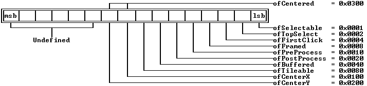

---

<a id="topic_2496"></a>

#See Also

 [TView::options](#IKGEF4)

---

<a id="27QG_WS"></a>

### operator +

*Keywords: +*

#### Header File
 [menus.h](#menus.h)
#### Syntax
```c
TSubMenu& operator + ( TSubMenu& s, TMenuItem& i );

 TSubMenu& operator + ( TSubMenu& s1, TSubMenu& s2 );

 TStatusDef& operator + ( TStatusDef& s1, TStatusItem& s2 );

 TStatusDef& operator + ( TStatusDef& s1, TStatusDef& s2 );
```
#### Description
 These overloaded  +operators are used with the  TSubMenu,  TMenuItem,  TStatusDef, and  TStatusItemconstructors to create status lines and nested menus.

---

<a id="operatordelete"></a>

### operator delete

*Keywords: delete*

[See Also](#3X3TICP)	 Program File

 NEW.CPP
#### Syntax
```c
void *operator delete( void *blk );
```
#### Description
 Frees the allocation block from the heap. If the safety pool is exhausted,  TVMemMgr::resizeSafetyPoolis called. This frees the old safety pool and allocates a new, default safety pool (usually 4,096 bytes).

---

<a id="3X3TICP"></a>

#### See Also
 [TVMemMgr::resizeSafetyPool](#19T9ZR3)

---

<a id="operatornew"></a>

### operator new

*Keywords: new*

[See Also](#2BX90K7)	 Program File

 NEW.CPP
#### Syntax
```c
void *operator new( size_t sz );
```
#### Description
 Tries to allocate sz bytes on the heap. A pointer to the allocation is returned if  newsucceeds. If the allocation fails, cache buffers (if any) are freed one by one and the allocation attempt is retried. If this fails and the safety pool is "exhausted,"  newcalls  abort. Otherwise, allocation in the safety pool is attempted. This attempt, whether successful or not, sets the  TVMemMgr::safetyPoolpointer to 0 (indicating that the safety pool is "exhausted"). If  newdoes allocate successfully from the safety pool, a pointer to the allocation is returned; otherwise,  abortis called. Operator  newis a friend function of  TBufListEntry.

---

<a id="2BX90K7"></a>

#### See Also
 [TVMemMgr::safetyPool](#HX11MK)

 [TVMemMgr::safetyPoolExhausted](#_JNKIV)

 [TVMemMgr::resizeSafetyPool](#19T9ZR3)

---

<a id="ovXXXX"></a>

### ovXXXX constants

*Keywords: ovXXXX*

* XXXX
#### Header File
 outline.h
#### Description
 The  createGraphmember function of  TOutlineViewerreceives a parameter called flags that holds a combination of ovXXXX constants. flags determines how the outline viewer should draw the graphic portion of the outline.

 Values

 The following constants are defined:

 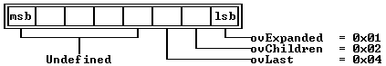

 Constant	 Value	 Meaning

 

| * ovExpanded | 0x01 | Node is expanded (show child nodes) |
| --- | --- | --- |
| * ovChildren | 0x02 | Node has child nodes |
| * ovLast | 0x04 | Node is the last child of its parent |

---

<a id="positionalEvents"></a>

### positionalEvents constant

*Keywords: positionalEvents*

[See Also](#1.0QPV0)
#### Header File
 [views.h](#views.h)
#### Syntax
```c
positionalEvents = evMouse;
```
#### Description
 Defines the event classes that are positional events. The * focusedEventsand * positionalEventsmasks are used by  TGroup::handleEventto determine how to dispatch an event to the group's subviews. If an event class isn't contained in * focusedEventsor * positionalEvents, it is treated as a broadcast event.

---

<a id="1.0QPV0"></a>

#### See Also
 [TGroup::handleEvent](#29EKHW)

 [TEvent](#TEvent)

 [evXXXX](#evXXXX)

 [focusedEvents](#focusedEvents)

---

<a id="sbXXXX"></a>

### sbXXXX constants

*Keywords: sbXXXX*

* XXXX

 [See Also](#ZVJVYU)
#### Header File
 [views.h](#views.h)
#### Description
 These constants define the different areas of a  TScrollBarin which the mouse can be clicked.

 The  TScrollBar::scrollStepfunction converts these constants into actual scroll step values. Although defined, the sbIndicator constant is never passed to  TScrollBar::scrollStep.

 Constant	 Value	 Meaning

 

| * sbLeftArrow | 0 | Left arrow of horizontal scroll bar |
| --- | --- | --- |
| * sbRightArrow | 1 | Right arrow of horizontal scroll bar |
| * sbPageLeft | 2 | Left paging area of horizontal scroll bar |
| * sbPageRight | 3 | Right paging area of horizontal scroll bar |
| * sbUpArrow | 4 | Top arrow of vertical scroll bar |
| * sbDownArrow | 5 | Bottom arrow of vertical scroll bar |
| * sbPageUp | 6 | Upper paging area of vertical scroll bar |
| * sbPageDown | 7 | Lower paging area of vertical scroll bar |
| * sbIndicator | 8 | Position indicator on scroll bar |

 

 Scroll Bar Parts

 The following values can be passed to  TWindow::standardScrollBar:

 Constant	 Value	 Meaning

 

| * sbHorizontal | 0x0000 | Scroll bar is horizontal |
| --- | --- | --- |
| * sbVertical | 0x0001 | Scroll bar is vertical |
| * sbHandleKeyboard | 0x0002 | Scroll bar responds to keyboard commands |

---

<a id="ZVJVYU"></a>

#### See Also
 [TScrollBar](#TScrollBar)

 [TScrollBar::scrollStep](#96J3O_)

 [TWindow::standardScrollBar](#113JQJP)

---

<a id="selectMode"></a>

### selectMode enumeration

*Keywords: selectMode*

[See Also](#CNC7GD)
#### Header File
 [views.h](#views.h)
#### Syntax
```c
selectMode = \-normalSelect, enterSelect, leaveSelect;
```
#### Description
 Used internally by Turbo Vision.

---

<a id="CNC7GD"></a>

#### See Also
 [TGroup::execView](#12U2PA7)

 [TGroup::setCurrent](#1E20JEP)

---

<a id="sfXXXX"></a>

### sfXXXX constants

*Keywords: sfXXXX*

* XXXX

 [See Also](#4X37_4O)
#### Header File
 [views.h](#views.h)
#### Description
 These constants are used to access the corresponding bits in the TView::state data member. You must never modify TView::state directly; instead, use  TView::setState.

 Values

 The following table lists the defined state flags:

 Constant	 Meaning

 

| * sfVisible | Set if the view is visible on its owner; otherwise, clear. Views are by default * sfVisible. You can use  TView::showand  TView::hideto modify * sfVisible. An * sfVisible view is not necessarily visible on the screen, since its owner might not be visible. To test for visibility on the screen, examine the * sfExposed bit or call  TView::exposed. |
| --- | --- |
| * sfCursorVis | Set if a view's cursor is visible; otherwise, clear. Clear is the default. You can use  TView::showCursorand  TView::hideCursorto modify * sfCursorVis. |
| * sfCursorIns | Set if the view's cursor is a solid block; clear if the view's cursor is an underline (the default). You can use  TView::blockCursorand  TView::normalCursorto modify * sfCursorIns. |
| * sfShadow | Set if the view has a shadow; otherwise, clear. |
| * sfActive | Set if the view is the active window or a subview in the active window. |
| * sfSelected | Set if the view is the currently selected subview within its owner. Each  TGroupobject has a * current data member that points to the currently selected subview (or is 0 if no subview is selected). There can be only one currently selected subview in a  TGroup. |
| * sfFocused | Set if the view is focused. A view is focused if it is selected and all owners above it are also selected; that is, if the view is on the chain that is formed by following each * current pointer of all  TGroupsstarting at * application (the topmost view in the view hierarchy). The last view on the focused chain is the final target of all * focused events. |
| * sfDragging | Set if the view is being dragged; otherwise, clear. |
| * sfDisabled | Set if the view is disabled; clear if the view is enabled. A disabled view will ignore all events sent to it. |
| * sfModal | Set if the view is modal. There is always exactly one modal view in a running Turbo Vision application, usually a  TApplicationor  TDialogobject. When a view starts executing (through an  execViewcall), that view becomes modal. The modal view represents the apex (root) of the active event tree, getting and handling events until its  endModal method is called. During this "local" event loop, events are passed down to lower subviews in the view tree. Events from these lower views pass back up |

he tree, but go no further than the modal view. See also * sfSelected, * sfFocused,  TView::setState,  TView::handleEvent,  TGroup::execView.

| * sfDefault | This is a spare flag, available to specify some user-defined default state. |
| --- | --- |
| * sfExposed | Set if the view is owned directly or indirectly by the * applicationobject, therefore possibly visible on the screen  TView::exposed uses this flag in combination with further clipping calculations to determine whether any part of the view is actually visible on the screen. See also  TView::exposed. |

 Values

 The state flag bits are defined as follows:

 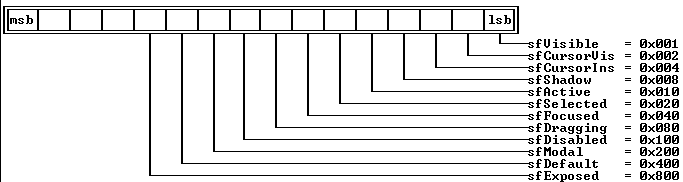

---

<a id="topic_2510"></a>

#See Also

 [TView::state](#TView_state)

---

<a id="specialChars"></a>

### specialChars variable

*Keywords: specialChars*

[See Also](#VIFS56)
#### Header File
 [ttypes.h](#ttypes.h)
#### Syntax
```c
extern const uchar specialChars[] =

 \-

   175, 174, 26, 27, ' ', ' '

 ;
```
#### Description
 Defines the indicator characters used to highlight the focused view in monochrome video mode. These characters are displayed if the showMarkers variable is True.

---

<a id="VIFS56"></a>

#### See Also
 [TView::showMarkers](#FOXYTF)

---

<a id="StreamableInit"></a>

### StreamableInit enumeration

*Keywords: StreamableInit*

[See Also](#1ZL23EP)
#### Header File
 [ttypes.h](#ttypes.h)
#### Syntax
```c
enum StreamableInit \- streamableInit ;
```
#### Description
 Each streamable class has a special "builder" constructor that takes argument streamableInit. This is defined in this enumeration to provide a unique data type for the constructor argument.

---

<a id="1ZL23EP"></a>

#### See Also
 [TView::TView](#TView_TView)

---

<a id="TVTransfer"></a>

### TVTransfer enum

*Keywords: TVTransfer*

[See Also](#PJ.5UW)
#### Header File
 [validate.h](#validate.h)
#### Syntax
```c
enum TVTransfer \-vtDataSize, vtSetData, vtGetData;
```
#### Description
 Validator objects use parameters of type TVTransfer in their transfer member functions to control data transfer when setting or reading the value of the associated input line.

---

<a id="PJ.5UW"></a>

#### See Also
 [TValidator::transfer](#DNRUN7)

---

<a id="TScrollChars"></a>

### TScrollChars typedef

*Keywords: TScrollChars*

[See Also](#341.MQ5)
#### Header File
 [views.h](#views.h)
#### Syntax
```c
typedef char TScrollChars[5];
```
#### Description
 An array representing the characters used to draw a  TScrollBar.

---

<a id="341.MQ5"></a>

#### See Also
 [TScrollBar](#TScrollBar)

---

<a id="uchar"></a>

### uchar typedef

*Keywords: uchar*

#### Header File
 [ttypes.h](#ttypes.h)
#### Syntax
```c
typedef unsigned char uchar;
```
#### Description
 Provides a synonym for  unsigned char.

---

<a id="ushort"></a>

### ushort typedef

*Keywords: ushort*

#### Header File
 [ttypes.h](#ttypes.h)
#### Syntax
```c
typedef unsigned short ushort;
```
#### Description
 Provides a synonym for  unsigned short.

---

<a id="voXXXX"></a>

### voXXXX constants

*Keywords: voXXXX*

* XXXX
#### Header File
 [validate.h](#validate.h)
#### Description
 Constants beginning with vo represent the bits in the bitmapped Options word in validator objects.

 Values

 The validator Options bits are defined as follows:

 

 Constant	 Value	 Meaning

 

| * voFill | 0x0001 | Used by picture validators to indicate whether to fill in literal characters as the user types. |
| --- | --- | --- |
| * voTransfer | 0x0002 | The validator handles data transfer for the input line. Currently only used by range validators. |
| * voReserved | 0x00FC | The bits in this mask are reserved by Borland. |

---

<a id="wfXXXX"></a>

### wfXXXX constants

*Keywords: wfXXXX*

* XXXX

 [See Also](#1FRP5W9)
#### Header File
 [views.h](#views.h)
#### Description
 These mnemonics define bits in the flags data member of  TWindowobjects. If the bits are set, the window will have the corresponding attribute: The window can move, grow, close, or zoom.

 Values

 The window flags are defined as follows:

 

 Constant	 Value	 Meaning

 

| * wfMove | 0x01 | Window can be moved. |
| --- | --- | --- |
| * wfGrow | 0x02 | Window can be resized and has a grow icon in the lower-right corner. |
| * wfClose | 0x04 | Window frame has a close icon that can be mouse-clicked to close the window. |
| * wfZoom | 0x08 | Window frame has a zoom icon that can be mouse-clicked to zoom the window. |

 

 If a particular bit is set (= 1), the corresponding property is enabled; otherwise, if clear (= 0), that property is disabled.

---

<a id="1FRP5W9"></a>

#### See Also
 [TWindow::flags](#TWindow_flags)

---

<a id="wnNoNumber"></a>

### wnNoNumber constant

*Keywords: wnNoNumber*

[See Also](#17H4IRI)
#### Header File
 [views.h](#views.h)
#### Syntax
```c
const ushort wnNoNumber = 0;
```
#### Description
 If the * TWindow::numberdata member holds this constant, the window is not to be numbered and cannot be selected via the * Alt+numberkey. If * numberis between 1 and 9, the window number is displayed, and * Alt+numberselection is available.

---

<a id="17H4IRI"></a>

#### See Also
 [TWindow::number](#N2TG7N)

---

<a id="write_args"></a>

### write_args structure

*Keywords: write_args*

#### Header File
 [views.h](#views.h)
#### Syntax
```c
struct write_args

 \-

   void *self;

   void *target;

   void *buf;

   ushort offset;

 ;
```
#### Description
 Used internally by  TView::writeView.

---

<a id="wpXXXX"></a>

### wpXXXX constants

*Keywords: wpXXXX*

* XXXX

 [See Also](#6MERQO)
#### Header File
 [views.h](#views.h)
#### Description
 These constants define the three standard color mapping assignments for windows. By default, a TWindow::palette is wpBlueWindow. The default for  TDialogobjects is wpGrayWindow.

 Values

 Three standard window palettes are defined:

 Constant	 Value	 Meaning

 

| * wpBlueWindow | 0 | Window text is yellow on blue |
| --- | --- | --- |
| * wpCyanWindow | 1 | Window text is blue on cyan |
| * wpGrayWindow | 2 | Window text is black on gray |

---

<a id="6MERQO"></a>

#### See Also
 [TWindow::palette](#32PVYWU)

 [TWindow::getPalette](#I0LIHP)

---

<a id="HeaderFileCrossReference"></a>

### Header File Cross-Reference

*Keywords: header files*

TV offers a variety of header files covering related groups of standard Turbo Vision classes as well as some sets of useful derived classes offered as instructional examples. Many of the classes can be incorporated into your own applications with little change. Although the header names are mnemonic, it may not always be obvious where a particular class is defined.

 Header File	 Contents

 

| [app.h](#app.h) | The major application classes  TProgramand  TApplication |
| --- | --- |
| [buffers.h](#buffers.h) | Video memory handling |
| colorsel.h | Palette selection classes |
| [config.h](#config.h) | Miscellaneous system-wide parameters |
| [dialogs.h](#dialogs.h) | Dialog box, control, and history classes |
| [drawbuf.h](#drawbuf.h) | Draw buffer classes |
| editors.h | Specialized classes for editors |
| [hardware.h](#hardware.h) | Defines the class  THardwareInfo |
| [help.h](#help.h) | Defines the windowing classes |
| [helpbase.h](#helpbase.h) | Defines the internal classes used in the help system |
| [menus.h](#menus.h) | Menu and status line classes |
| [msgbox.h](#msgbox.h) | Globals for message and input boxes |
| [objects.h](#objects.h) | Basic non-view classes: point, rectangle, and collections |
| [resource.h](#resource.h) | Resource and related classes |
| stddlg.h | Specialized dialog and input lines |
| [system.h](#system.h) | Classes for mouse and keyboard event handling |
| [textview.h](#textview.h) | Specialized classes for text devices |
| [tkeys.h](#tkeys.h) | Keyboard constants |
| [tobjstrm.h](#tobjstrm.h) | Stream classes |
| [ttypes.h](#ttypes.h) | Basic typedefs and constants |
| [tv.h](#tv.h) | Master header for #include control |
| [tvobjs.h](#tvobjs.h) | TObjectand non-streamable collections |
| util.h | Miscellaneous globals |
| [validate.h](#validate.h) | Defines the  validatorclasses |
| [views.h](#views.h) | Classes for views, groups, windows, frames, scroll bars |

 

 These classes are included to demonstrate the use of the standard classes to accomplish certain special-purpose tasks.

 Header File	 Contents

 

| ascii.h | ASCII chart demonstration |
| --- | --- |
| calc.h | Calculator demonstration |
| calendar.h | Calendar demonstration |
| gadgets.h | Clock viewer and heap viewer demonstrations |
| mousedlg.h | A mouse dialog class |
| fileview.h | File viewer classes |
| puzzle.h | Puzzle demonstration |
| tvbgi.h | BGI demonstrations |

---

<a id="app.h"></a>

### app.h

*Keywords: app.h*

[Header File Cross-Reference](#HeaderFileCrossReference)

 app.h defines the classes  TApplication,  TBackground,  TDeskInit,  TDeskTop,  TProgInit, and  TProgram.

---

<a id="buffers.h"></a>

### buffers.h

*Keywords: buffers.h*

[Header File Cross-Reference](#HeaderFileCrossReference)

 buffers.h defines the classes  TBufListEntry,  TVideoBuf, and  TVMemMgr. It also defines the global constant DEFAULT_SAFETY_POOL_SIZE and sets its initial value to 4,096.

---

<a id="config.h"></a>

### config.h

*Keywords: config.h*

[Header File Cross-Reference](#HeaderFileCrossReference)

 config.h is for internal use only. It defines the following constants:

 Constant	 Definition

 

| * eventQSize | 16 |
| --- | --- |
| * maxCollectionSize | (int)((65536uL - 16)/sizeof( void * )) |
| * maxFindStrLen | 80 |
| * maxReplaceStrLen | 80 |
| * maxViewWidth | 132 |

---

<a id="dialogs.h"></a>

### dialogs.h

*Keywords: dialogs.h*

[Header File Cross-Reference](#HeaderFileCrossReference)

 dialogs.h defines the constant * cmRecordHistory, several button type constants, and the following classes related to dialog boxes:

|  | TButton |
| --- | --- |
|  | TCheckBoxes |
|  | TCluster |
|  | TDialog |
|  | THistInit |
|  | THistory |
|  | THistoryViewer |
|  | THistoryWindow |
|  | TInputLine |
|  | TLabel |
|  | TListBox |
|  | TParamText |
|  | TRadioButtons |
|  | TSItem |
|  | TStaticText |
| Constant | Definition |

 

| * bfNormal | 0x00 |
| --- | --- |
| * bfDefault | 0x01 |
| * bfLeftJust | 0x02 |
| * bfBroadcast | 0x04 |
| * cmRecordHistory | 0x60 |

---

<a id="drawbuf.h"></a>

### drawbuf.h

*Keywords: drawbuf.h*

[Header File Cross-Reference](#HeaderFileCrossReference)

 drawbuf.h defines the class  TDrawBufferand the macros  loByteand  hiByte, useful for selecting the character and attribute bytes from a word.

---

<a id="hardware.h"></a>

### hardware.h

*Keywords: hardware.h*

[Header File Cross-Reference](#HeaderFileCrossReference)

 hardware.h defines the low-level class  THardwareInfo. This class is used for all hardware I/O (for example, keyboard, mouse). Porting Turbo Vision to another platform (for example OS/2) would require rewriting this class.

---

<a id="help.h"></a>

### help.h

*Keywords: help.h*

[Header File Cross-Reference](#HeaderFileCrossReference)

 help.h defines the classes  THelpViewerand  THelpWindow.

---

<a id="helpbase.h"></a>

### helpbase.h

*Keywords: helpbase.h*

[Header File Cross-Reference](#HeaderFileCrossReference)

 helpbase.h defines the classes  TParagraph,  TCrossRef,  THelpTopic,  THelpIndex, and  THelpFile. These classes are used internally by  THelpViewerand  THelpWindowto implement the help system.

---

<a id="menus.h"></a>

### menus.h

*Keywords: menus.h*

[Header File Cross-Reference](#HeaderFileCrossReference)

 menus.h offers overloaded  +operators for  TSubMenu,  TMenuItem,  TStatusDef, and  TStatusItem. It also defines the following classes:

|  | TMenuBar |
| --- | --- |
|  | TMenuBox |
|  | TMenuItem |
|  | TMenuView |
|  | TStatusDef |
|  | TStatusItem |
|  | TStatusLine |
|  | TSubMenu |

---

<a id="msgbox.h"></a>

### msgbox.h

*Keywords: msgbox.h*

msgbox.h

 [Header File Cross-Reference](#HeaderFileCrossReference)

 msgbox.h defines the following:

 Item	 Value	 Meaning

 

 Global Functions

 messageBox

 messageBoxRect

 inputBox

 inputBoxRect

 Message Box Constants

| *mfWarning | 0x0000 | Display a Warning box |
| --- | --- | --- |
| * mfError | 0x0001 | Display an Error box |
| * mfInformation | 0x0002 | Display an Information Box |
| * mfConfirmation | 0x0003 | Display a Confirmation Box |
| Message Box Button Flags | *Puts Into Dialog Box: |  |
| *mfYesButton | 0x0100 | Yes button |
| * mfNoButton | 0x0200 | No button |
| * mfOKButton | 0x0400 | OK button |
| * mfCancelButton | 0x0800 | Cancel button |
| * mfYesNoCancel | mfYesButton | Standard Yes, No, Cancel dialog* |
|  | | * mfNoButton |  |
|  | | * mfCancelButton |  |
| * mfOKCancel | mfOKButton | Standard OK, Cancel dialog* |
|  | |* mfCancelButton |  |

---

<a id="objects.h"></a>

### objects.h

*Keywords: objects.h*

[Header File Cross-Reference](#HeaderFileCrossReference)

 objects.h defines the classes  TCollection,  TPoint,  TRect, and  TSortedCollection.

---

<a id="resource.h"></a>

### resource.h

*Keywords: resource.h*

[Header File Cross-Reference](#HeaderFileCrossReference)

 resource.h defines the classes  TResourceCollection,  TResourceFile,  TStrIndexRec,  TStringCollection,  TStringList,  TStrListMaker, and the structure  TResourceItem.

---

<a id="system.h"></a>

### system.h

*Keywords: system.h*

[Header File Cross-Reference](#HeaderFileCrossReference)

 system.h defines the following classes:

|  | Int11trap |
| --- | --- |
|  | TDisplay |
|  | TEventQueue |
|  | THWMouse |
|  | TMouse |
|  | TScreen |
|  | TSystemError |

 It also defines the structures * CharScanType, * MessageEvent, * MouseEventType, and * TEvent.

 Finally, it defines the following event codes and external variables:

 Item	 Value

 

 Event Code (Constant)

| *evMouseDown | 0x0001 |
| --- | --- |
| * evKeyDown | 0x0010 |
| * evMouseUp | 0x0002 |
| * evCommand | 0x0100 |
| * evMouseMove | 0x0004 |
| * evBroadcast | 0x0200 |
| * evMouseAuto | 0x0008 |

 Event Mask (Constant)

| *evNothing | 0x0000 |
| --- | --- |
| * evKeyboard | 0x0010 |
| * evMouse | 0x000f |
| * evMessage | 0xFF00 |

 External Variables (Extern Ushort)

 *biosSeg

 * colrSeg

 * monoSeg

 Mouse Button State Mask (Constant)

| *mbLeftButton | 0x01 |
| --- | --- |
| * mbRightButton | 0x02 |

---

<a id="textview.h"></a>

### textview.h

*Keywords: textview.h*

[Header File Cross-Reference](#HeaderFileCrossReference)

 textview.h defines the classes  TTextDeviceand  TTerminal.

---

<a id="tkeys.h"></a>

### tkeys.h

*Keywords: tkeys.h*

[Header File Cross-Reference](#HeaderFileCrossReference)

 tkeys.h defines all of these values:

 Keyboard State And Shift Masks

 Masks	 Value

 

| kbAltShift | 0x0008 |
| --- | --- |
| kbCapsState | 0x0040 |
| kbCtrlShift | 0x0004 |
| kbInsState | 0x0080 |
| kbLeftShift | 0x0002 |
| kbNumState | 0x0020 |
| kbRightShift | 0x0001 |
| kbScrollState | 0x0010 |

 Key Codes

 Key Code	 Value

 

 Numeric Keys

| kbAlt0 | 0x8100 |
| --- | --- |
| kbAlt1 | 0x7800 |
| kbAlt2 | 0x7900 |
| kbAlt3 | 0x7a00 |
| kbAlt4 | 0x7b00 |
| kbAlt5 | 0x7c00 |
| kbAlt6 | 0x7d00 |
| kbAlt7 | 0x7e00 |
| kbAlt8 | 0x7f00 |
| kbAlt9 | 0x8000 |

 Alphabetic Keys

| kbAltA | 0x1e00 |
| --- | --- |
| kbAltB | 0x3000 |
| kbAltC | 0x2e00 |
| kbAltD | 0x2000 |
| kbAltE | 0x1200 |
| kbAltF | 0x2100 |
| kbAltG | 0x2200 |
| kbAltH | 0x2300 |
| kbAltI | 0x1700 |
| kbAltJ | 0x2400 |
| kbAltK | 0x2500 |
| kbAltL | 0x2600 |
| kbAltM | 0x3200 |
| kbAltN | 0x3100 |
| kbAltO | 0x1800 |
| kbAltP | 0x1900 |
| kbAltQ | 0x1000 |
| kbAltR | 0x1300 |
| kbAltS | 0x1f00 |
| kbAltT | 0x1400 |
| kbAltU | 0x1600 |
| kbAltV | 0x2f00 |
| kbAltW | 0x1100 |
| kbAltX | 0x2d00 |
| kbAltY | 0x1500 |
| kbAltZ | 0x2c00 |

 

| kbCtrlA | 0x0001 |
| --- | --- |
| kbCtrlB | 0x0002 |
| kbCtrlC | 0x0003 |
| kbCtrlD | 0x0004 |
| kbCtrlE | 0x0005 |
| kbCtrlF | 0x0006 |
| kbCtrlG | 0x0007 |
| kbCtrlH | 0x0008 |
| kbCtrlI | 0x0009 |
| kbCtrlJ | 0x000a |
| kbCtrlK | 0x000b |
| kbCtrlL | 0x000c |
| kbCtrlM | 0x000d |
| kbCtrlN | 0x000e |
| kbCtrlO | 0x000f |
| kbCtrlP | 0x0010 |
| kbCtrlQ | 0x0011 |
| kbCtrlR | 0x0012 |
| kbCtrlS | 0x0013 |
| kbCtrlT | 0x0014 |
| kbCtrlU | 0x0015 |
| kbCtrlV | 0x0016 |
| kbCtrlW | 0x0017 |
| kbCtrlX | 0x0018 |
| kbCtrlY | 0x0019 |
| kbCtrlZ | 0x001a |

 Function Keys

| kbF1 | 0x3b00 |
| --- | --- |
| kbF2 | 0x3c00 |
| kbF3 | 0x3d00 |
| kbF4 | 0x3e00 |
| kbF5 | 0x3f00 |
| kbF6 | 0x4000 |
| kbF7 | 0x4100 |
| kbF8 | 0x4200 |
| kbF9 | 0x4300 |
| kbF10 | 0x4400 |

 

| kbShiftF1 | 0x5400 |
| --- | --- |
| kbShiftF2 | 0x5500 |
| kbShiftF3 | 0x5600 |
| kbShiftF4 | 0x5700 |
| kbShiftF5 | 0x5800 |
| kbShiftF6 | 0x5900 |
| kbShiftF7 | 0x5a00 |
| kbShiftF8 | 0x5b00 |
| kbShiftF9 | 0x5c00 |
| kbShiftF10 | 0x5d00 |

 

| kbAltF1 | 0x6800 |
| --- | --- |
| kbAltF2 | 0x6900 |
| kbAltF3 | 0x6a00 |
| kbAltF4 | 0x6b00 |
| kbAltF5 | 0x6c00 |
| kbAltF6 | 0x6d00 |
| kbAltF7 | 0x6e00 |
| kbAltF8 | 0x6f00 |
| kbAltF9 | 0x7000 |
| kbAltF10 | 0x7100 |

 

| kbCtrlF1 | 0x5e00 |
| --- | --- |
| kbCtrlF2 | 0x5f00 |
| kbCtrlF3 | 0x6000 |
| kbCtrlF4 | 0x6100 |
| kbCtrlF5 | 0x6200 |
| kbCtrlF6 | 0x6300 |
| kbCtrlF7 | 0x6400 |
| kbCtrlF8 | 0x6500 |
| kbCtrlF9 | 0x6600 |
| kbCtrlF10 | 0x6700 |

 Editing And Cursor Movement Keys

| kbAltEqual | 0x8300 |
| --- | --- |
| kbAltMinus | 0x8200 |
| kbAltSpace | 0x0200 |

 

| kbCtrlBack | 0x0e7f |
| --- | --- |
| kbCtrlDel | 0x0600 |
| kbCtrlEnd | 0x7500 |
| kbCtrlEnter | 0x1c0a |
| kbCtrlHome | 0x7700 |
| kbCtrlIns | 0x0400 |
| kbCtrlPgUp | 0x8400 |
| kbCtrlPgDn | 0x7600 |
| kbCtrlLeft | 0x7300 |
| kbCtrlRight | 0x7400 |
| kbCtrlPrtSc | 0x7200 |

 

| kbDel | 0x5300 |
| --- | --- |
| kbEnter | 0x1c0d |
| kbEsc | 0x011b |
| kbTab | 0x0f09 |
| kbIns | 0x5200 |

 

| kbHome | 0x4700 |
| --- | --- |
| kbEnd | 0x4f00 |
| kbBack | 0x0e08 |
| kbUp | 0x4800 |
| kbDown | 0x5000 |
| kbLeft | 0x4b00 |
| kbRight | 0x4d00 |
| kbPgUp | 0x4900 |
| kbPgDn | 0x5100 |

 

| kbShiftDel | 0x0700 |
| --- | --- |
| kbShiftIns | 0x0500 |
| kbShiftTab | 0x0f00 |

 

 kbNoKey	 0x0000

 

| kbGrayMinus | 0x4a2d |
| --- | --- |
| kbGrayPlus | 0x4e2b |

---

<a id="tobjstrm.h"></a>

### tobjstrm.h

*Keywords: tobjstrm.h*

[Header File Cross-Reference](#HeaderFileCrossReference)

 tobjstrm.h defines the following classes:

|  | fpbase |
| --- | --- |
|  | fpstream |
|  | ifpstream |
|  | iopstream |
|  | ipstream |
|  | ofpstream |
|  | opstream |
|  | pstream |
|  | TPReadObjects |
|  | TPWObj |
|  | TPWrittenObjects |
|  | TStreamable |
|  | TStreamableClass |
|  | TStreamableTypes |

 This header file also defines BUILDER and the macros _ _link and _ _DELTA.

---

<a id="ttypes.h"></a>

### ttypes.h

*Keywords: ttypes.h*

[Header File Cross-Reference](#HeaderFileCrossReference)

 ttypes.h defines and sets the following:

|  | const ccNotFound = -1; |
| --- | --- |
|  | const char EOS = '\0'; |
|  | enum Boolean \- False, True ; |
|  | enum StreamableInit \- streamableInit ; |
|  | extern const uchar specialChars[]; |
|  | typedef Boolean (*ccTestFunc)( void *, void * ); |
|  | typedef int ccIndex; |
|  | typedef unsigned char uchar; |
|  | typedef unsigned short ushort; |
|  | typedef void (*ccAppFunc)( void *, void * ); |

---

<a id="tv.h"></a>

### tv.h

*Keywords: tv.h*

[Header File Cross-Reference](#HeaderFileCrossReference)

 tv.h ensures that all the necessary header files are included in your application code effortlessly and without duplication. tv.h always includes the essential Turbo Vision headers such as config.h and util.h. Other header files are included conditionally by means of the #if defined directive.

 tv.h tests whether the macro * Uses_ClassName(where * ClassNameis a class name or a class registration name) has been previously defined. Depending on the result, the header files for class * ClassNameand its base classes are included automatically. If your program uses class * ClassName, you simply include the line #define Uses_* ClassNamein your program or header, followed by an #include <tvision.h> statement. This automates the inclusion process for that class and its base classes. For example, suppose your program starts with

 
```c
 #define Uses_TApplication

 #include <tvision.h>
```
 tv.h tests as follows:

 
```c
 #if defined( Uses_TApplication )

 #define Uses_TProgram

 #define _ _INC_APP_H

 #endif
```
 Note that TProgram is the base class for TApplication. Later on, tv.h tests _ _INC_APP_H as follows:

 
```c
 #if defined( _ _INC_APP_H )

 #include <App.h>
```
 The end result is that app.h, containing the class declarations for TProgram, TProgInit, and TApplication, is included in your program. No harm is done if you define both base and derived classes:

 
```c
 #define Uses_TProgram

 #define Uses_TApplication

 #include <tvision.h>
```
 The stream registration of streamable classes is accomplished by the use of the _ _link macro. For example, to register TEditWindow, your program should use the statement

 
```c
 #include <tvision.h>

 _ _link(REditWindow);
```
 The _ _link macro creates the extern declaration:

 
```c
 extern TStreamableClass REditWindow;
```
 which ensures the proper linkage of the stream read and write functions.

 When you create your own classes and include files, you can develop your own include control headers based on the tv.h strategy. However, we advise strongly against modifying tv.h, since it encapsulates the standard Turbo Vision hierarchy: Changes to tv.h may have disconcerting or even catastrophic effects.

---

<a id="tvobjs.h"></a>

### tvobjs.h

*Keywords: tvobjs.h*

[Header File Cross-Reference](#HeaderFileCrossReference)

 tvobjs.h defines these three core classes: TObject, TNSCollection, and TNSSortedCollection.

---

<a id="validate.h"></a>

### validate.h

*Keywords: validate.h*

[Header File Cross-Reference](#HeaderFileCrossReference)

 validate.h defines the classes TValidator, TPXPictureValidator, TRangeValidator, TFilterValidator, TLookupValidator, and TStringLookupValidator. It also defines the constants used by the validator classes:

 Validator Status Constants:

 vsOk  = 0

 vsSyntax = 1

 Validator Option Constants:

 voFill   = 0x0001

 voTransfer  = 0x0002

 voReserved  = 0x00Fc

 Transfer Constants:

 enum TVTransfer \- vtDataSize, vtSetData, vtGetData

---

<a id="views.h"></a>

### views.h

*Keywords: views.h*

[Header File Cross-Reference](#HeaderFileCrossReference)

 views.h defines these classes and one structure:

|  | TCommandSet |
| --- | --- |
|  | TFrame |
|  | TGroup |
|  | TListViewer |
|  | TPalette |
|  | TScrollBar |
|  | TScroller |
|  | TView |
|  | TWindow |
|  | TWindowInit |
|  | * write_args (structure) |

 It also defines these standard command codes to be equal to the given values.

 Codes	 Value

 

| * cmValid | 0 |
| --- | --- |
| * cmZoom | 5 |
| * cmQuit | 1 |
| * cmResize | 6 |
| * cmError | 2 |
| * cmNext | 7 |
| * cmMenu | 3 |
| * cmPrev | 8 |
| * cmClose | 4 |
| * cmHelp | 9 |

 It also defines these various masks, commands, codes, and options.

 Variable	 Value

 

 TDIALOG STANDARD COMMANDS

| *cmCancel | 11 |
| --- | --- |
| * cmDefault | 14 |
| * cmNo | 13 |
| * cmOK | 10 |
| * cmYes | 12 |

 TVIEW * STATEMASKS:

| *sfActive | 0x010 |
| --- | --- |
| * sfCursorIns | 0x004 |
| * sfCursorVis | 0x002 |
| * sfDefault | 0x400 |
| * sfDisabled | 0x100 |
| * sfDragging | 0x080 |
| * sfFocused | 0x040 |
| * sfModal | 0x200 |
| * sfSelected | 0x020 |
| * sfShadow | 0x008 |
| * sfVisible | 0x001 |
| * sfExposed | 0x800 |

 TVIEW * OPTIONSMASKS:

| *ofBuffered | 0x040 |
| --- | --- |
| * ofCentered | 0x300 |
| * ofCenterX | 0x100 |
| * ofCenterY | 0x200 |
| * ofFirstClick | 0x004 |
| * ofFramed | 0x008 |
| * ofPostProcess | 0x020 |
| * ofPreProcess | 0x010 |
| * ofSelectable | 0x001 |
| * ofTileable | 0x080 |
| * ofTopSelect | 0x002 |

 TVIEW * GROWMODEMASKS:

| *gfGrowAll | 0x0f |
| --- | --- |
| * gfGrowHiX | 0x04 |
| * gfGrowHiY | 0x08 |
| * gfGrowLoX | 0x01 |
| * gfGrowLoY | 0x02 |
| * gfGrowRel | 0x10 |

 TVIEW * DRAGMODEMASKS:

| *dmDragGrow | 0x02 |
| --- | --- |
| * dmDragMove | 0x01 |
| * dmLimitAll | dmLimitLoX | dmLimitLoY | dmLimitHiX | dmLimitHiY |
| * dmLimitHiX | 0x40 |
| * dmLimitHiY | 0x80 |
| * dmLimitLoX | 0x10 |
| * dmLimitLoY | 0x20 |

 TVIEW HELP CONTEXT CODES:

| *hcDragging | 1 |
| --- | --- |
| * hcNoContext | 0 |

 TSCROLLBAR PART CODES:

| *sbDownArrow | 5 |
| --- | --- |
| * sbIndicator | 8 |
| * sbLeftArrow | 0 |
| * sbPageDown | 7 |
| * sbPageLeft | 2 |
| * sbPageRight | 3 |
| * sbPageUp | 6 |
| * sbRightArrow | 1 |
| * sbUpArrow | 4 |

 TSCROLLBAR OPTIONS FOR TWINDOW::STANDARDSCROLLBAR:

| *sbHandleKeyboard | 0x002 |
| --- | --- |
| * sbHorizontal | 0x000 |
| * sbVertical | 0x001 |

 TWINDOW * FLAGSMASKS:

| *wfClose | 0x04 |
| --- | --- |
| * wfGrow | 0x02 |
| * wfMove | 0x01 |
| * wfZoom | 0x08 |

 TWINDOW NUMBER CONSTANTS:

 *wnNoNumber	 0

 TWINDOW PALETTE ENTRIES:

| *wpBlueWindow | 0 |
| --- | --- |
| * wpCyanWindow | 1 |
| * wpGrayWindow | 2 |

 Application Command Codes:

| *cmCascade | 26 |
| --- | --- |
| * cmClear | 24 |
| * cmCopy | 21 |
| * cmCut | 20 |
| * cmPaste | 22 |
| * cmTile | 25 |
| * cmUndo | 23 |

 Standard Messages:

| *cmCommandSetChanged | 52 |
| --- | --- |
| * cmReceivedFocus | 50 |
| * cmReleasedFocus | 51 |

 TSCROLLBAR MESSAGES:

| *cmScrollBarChanged | 53 |
| --- | --- |
| * cmScrollBarClicked | 54 |

 TWINDOW * SELECTMESSAGES:

 *cmSelectWindowNum	 55

 TLISTVIEWER MESSAGES:

 *cmListItemSelected	 56

 Event Masks:

| *focusedEvents | evKeyboard | evCommand |
| --- | --- |
| * positionalEvents | evMouse |

 And A Lone Typedef:

 
```c
typedef char TScrollChars[5];
```

---

