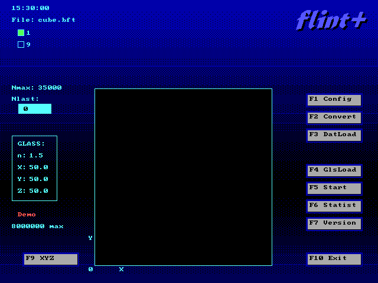

# FLINT+ v2.61–2.77 — Лазерная гравировка внутри стекла

<p align="center">
  
</p>

**FLINT+** — программа управления лазерной установкой для создания объёмных изображений внутри стеклянных заготовок. Разработана в ИЛТиП (ILTiP Ltd), г. Сосновый Бор, 1996–2003.

Данный репозиторий содержит **две версии программы** (2.61 и 2.77), **оригинальные исходные коды** (Borland C++, 16-bit DOS), **портированную 32-битную версию** (Open Watcom, DOS/4GW), а также интерактивную HTML-документацию.

---

## Структура репозитория

```
├── *.bft                                # Примеры 3D-данных (cube, sphere, spiral)
├── dosbox-x.conf                        # Конфигурация DOSBox-X для корневой папки
├── run_flint_2.61_16bit_dosbox_x.bat   # Запуск версии 2.61 (16-bit) в DOSBox-X
├── FLINT.GLS, FLINT1.CFG, FLINT9.CFG   # Конфигурации оборудования
├── index.html                           # Веб-интерфейс проекта
│
├── Flint 2.61 src/                      # Исходники версии 2.61 (16-bit)
│   ├── PROJ5.CPP, PROJ5.H              #   Основной код программы
│   ├── MSKEYC.CPP                       #   Работа с мышью и клавиатурой
│   ├── PIC.CPP                          #   Графика и UI
│   ├── RDWRF.CPP                        #   Чтение/запись файлов данных
│   ├── FLINT_UTF8.TXT                   #   История изменений
│   └── Proj5.ide                        #   Проект для Borland IDE
│
├── Flint 2.77/                          # Версия 2.77 (расширенная функциональность)
│   ├── FLINT_UTF8.txt                   #   Полная история версий (2.60–2.77)
│   ├── FLINT.GLS, FLINT1.CFG, etc.     #   Конфигурационные файлы
│   ├── run_flint.bat                    #   Запуск версии 2.77
│   ├── BFT_FILES/                       #   Библиотека ~200+ готовых 3D-объектов
│   ├── SCRIPTS/                         #   Скрипты автоматизации
│   ├── UTILS/                           #   Утилиты
│   └── ASM_FILES/                       #   Дизассемблированный код (proj5_disasm.asm)
│
├── Proj5_2.61_32bit/                    # 32-битная версия 2.61 (Open Watcom + DOS/4GW)
│   ├── PROJ5.CPP, PROJ5.H              #   Портированные исходники
│   ├── BGI32.CPP, BGI32.H              #   Эмуляция BGI через прямой VGA
│   ├── COMPAT.H                         #   Слой совместимости Borland → Watcom
│   ├── MAKEFILE                         #   Сборка: wmake
│   ├── DOS4GW.EXE                      #   DOS-экстендер
│   ├── proj5.exe                        #   Собранная программа
│   ├── ЗАПУСК.bat                       #   Запуск 32-bit версии в DOSBox-X
│   └── dosbox-x.conf                    #   Конфигурация DOSBox-X (64 МБ RAM)
│
└── Help/                                # Документация
    ├── FLINT_Help.html                  #   Интерактивная справка (откройте в браузере)
    ├── UI_Screenshots/                  #   12 скриншотов всех экранов программы
    ├── PROJECT_DESCRIPTION.md           #   Подробное описание проекта
    └── FUNCTIONS_REFERENCE.md           #   Справочник функций
```

## Технология

Импульсный лазер фокусируется **внутри** стеклянной заготовки и создаёт микротрещины — точки. Из десятков тысяч точек складывается 3D-изображение. Координатный столик с шаговыми двигателями перемещает стекло с точностью ~0.01 мм по трём осям (X: 235 мм, Y: 235 мм, Z: 110 мм).

## Возможности

### Версия 2.61 (январь 2003)
- Загрузка 3D-данных: `.bft` (бинарный), `.cft` (текстовый), `.asc` (3D Studio), `.bmp`
- Просмотр в 4 проекциях (XY, YX, XZ, YZ)
- Масштабирование, зеркалирование, смещение, центрирование
- Сортировка точек для оптимизации пути лазера
- Серийная работа — до 9 стёкол за цикл
- Справочник стёкол с показателями преломления
- Контроль ошибок, концевые датчики, защитный затвор
- **32-bit версия**: до 8 000 000 точек (вместо ~25 000 в 16-bit)

### Версия 2.77 (2003) — дополнительно
- Программируемая задержка электро-оптического затвора лазера (10–500 мкс)
- Прямой ввод номера точки с проверками
- Вывод повторов (Reiterations) в реальном времени
- Управление дополнительным таймером платы (генератор импульсов накачки, задержка затвора)
- Оптоволоконная линия синхронизации лазера
- Библиотека ~200+ готовых 3D-объектов в папке BFT_FILES/
- Скрипты и утилиты для автоматизации

## Запуск

### Требования

- [DOSBox-X](https://dosbox-x.com/) (рекомендуется) или DOSBox
- Для сборки 32-bit версии: [Open Watcom C/C++](http://www.openwatcom.org/)

### Версия 2.61 (16-bit)

```bat
run_flint_2.61_16bit_dosbox_x.bat
```

### Версия 2.77 (16-bit)

```bat
cd "Flint 2.77"
run_flint.bat
```

### 32-битная версия 2.61

```bat
cd Proj5_2.61_32bit
ЗАПУСК.bat
```

### Сборка 32-bit версии из исходников

```bat
set WATCOM=C:\WATCOM
set PATH=%WATCOM%\BINNT;%WATCOM%\BINW;%PATH%
set INCLUDE=%WATCOM%\H
cd Proj5_2.61_32bit
wmake clean
wmake
```

## Документация

**[Открыть интерактивную справку онлайн](https://titbm.github.io/flint/)**

Или локально: откройте [Help/FLINT_Help.html](Help/FLINT_Help.html) в браузере — интерактивная справка с картинками всех экранов и всплывающими подсказками на каждом элементе интерфейса.

## Лицензия

Исходный код опубликован в образовательных и архивных целях. Оригинальные права принадлежат автору (iB) и ИЛТиП (ILTiP Ltd).

## Об авторе

- **Автор**: iB
- **Организация**: ИЛТиП (ILTiP Ltd) — Институт лазерных технологий и инжиниринга
- **Город**: Сосновый Бор, Ленинградская обл., Россия
- **Годы разработки**: 1996–2003
