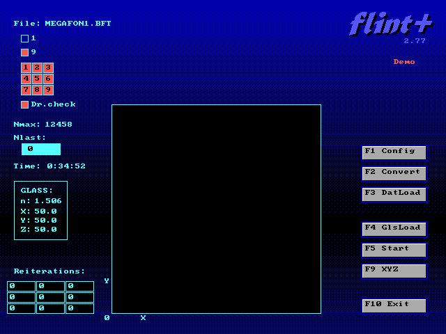

# FLINT — Лазерная гравировка внутри стекла

<p align="center">
  
</p>

**FLINT** — программа управления лазерной установкой для создания объёмных изображений внутри стеклянных заготовок. Разработана в ИЛТиП (ILTiP Ltd), г. Сосновый Бор, 1996–2004.

Вы наверняка видели стеклянные сувениры с трёхмерным изображением внутри — зданием, логотипом или фигуркой. Импульсный лазер фокусируется **внутри** стекла и создаёт микротрещину — одну точку. Координатный столик с шаговыми двигателями сдвигает стекло, и лазер ставит следующую точку. Из десятков тысяч таких точек складывается объёмное изображение. FLINT управляет всем этим процессом: загружает 3D-модель, перемещает столик с точностью до сотых долей миллиметра, стреляет лазером, следит за безопасностью.

---

## Содержание репозитория

Репозиторий содержит всё, что относится к программе FLINT: оригинальные дистрибутивы, исходный код и документацию.

**Оригинальные файлы** (папка `!GENESIS/`) — дистрибутивы программы версий 2.61 и 2.77 с рабочего компьютера лазерной установки: готовые EXE-файлы, конфигурации оборудования, примеры 3D-объектов. Версия 2.61 также содержит оригинальные исходные файлы на C++ (Borland C++ 4.5, 16-bit DOS).

**Реконструированный исходный код версии 2.77** (папка `Flint 2.77 src/`) — исходный код, восстановленный на основе оригинального кода версии 2.61 и дизассемблирования EXE-файла версии 2.77. Позволяет скомпилировать работающий EXE из исходников.

**32-битная версия** (папка `Flint 2.77 (32bit) src/`) — порт программы на компилятор Open Watcom C++ с DOS-экстендером DOS/4GW. Снимает ограничение 16-bit версии на ~80 000 точек и позволяет работать с моделями до 8 000 000 точек.

**Документация** (папка `Help/`) — интерактивное HTML-руководство пользователя со скриншотами всех экранов, справочник функций и подробное описание проекта.

---

## Установка и запуск

### Что нужно для запуска

FLINT — это DOS-программа. На современном компьютере с Windows она работает через эмулятор [DOSBox-X](https://dosbox-x.com/), который уже включён в репозиторий (`Tools/DOSBox-X/`). Ничего дополнительно устанавливать не нужно.

**Скачайте репозиторий**: нажмите зелёную кнопку **Code** → **Download ZIP** на странице проекта и распакуйте архив в любую папку

### Сборка и запуск версии 2.77 (16-bit)

Для сборки используется компилятор Borland C++ 4.5, который уже включён в репозиторий (`Tools/BC45/`).

1. Запустите файл `Flint 2.77 src/COMPILE.bat`
2. Скрипт автоматически найдёт компилятор и DOSBox-X, скомпилирует программу и соберёт готовую папку `Flint 2.77 src/BUILD/`
3. Перейдите в созданную папку `BUILD/` и запустите `RUN.bat`

### Сборка и запуск версии 2.77 (32-bit)

32-битная версия компилируется компилятором Open Watcom C++, который тоже есть в репозитории (`Tools/WATCOM/`).

1. Запустите файл `Flint 2.77 (32bit) src/COMPILE.bat`
2. Скрипт скомпилирует программу и соберёт папку `Flint 2.77 (32bit) src/BUILD/`
3. Перейдите в созданную папку `BUILD/` и запустите `RUN.bat`

> **В чём разница?** 16-bit версия ограничена ~80 000 точек в модели из-за памяти DOS. 32-bit версия использует DOS-экстендер и поддерживает до 8 000 000 точек — этого хватит для моделей любой сложности.

---

## Как работать в программе

Подробное руководство по всем экранам и функциям программы доступно в интерактивной справке:

**[Открыть руководство пользователя онлайн](https://titbm.github.io/flint/)**

Это HTML-страница со скриншотами всех экранов программы. При наведении курсора на любой элемент интерфейса появляется всплывающая подсказка с описанием.

Ту же справку можно открыть локально: файл [Help/FLINT_Help.html](Help/FLINT_Help.html) в браузере.

---

## Структура репозитория

```
flint/
│
├── index.html                        — перенаправление на онлайн-документацию (GitHub Pages)
│
├── !GENESIS/                         — оригинальные дистрибутивы с рабочего компьютера
│   ├── Flint 2.61/                   — программа версии 2.61 (EXE, конфиги, примеры)
│   │   ├── proj5.exe                 — готовый исполняемый файл (16-bit)
│   │   ├── RUN.bat                   — запуск программы
│   │   ├── FLINT.GLS                 — справочник стёкол
│   │   ├── FLINT1.CFG, FLINT9.CFG    — конфигурации оборудования (режим 1 и 9 стёкол)
│   │   ├── FLINT_UTF8.TXT            — история изменений
│   │   ├── FLINT.ICO                 — иконка программы
│   │   ├── FLASH.DAT                 — счётчик импульсов лазера
│   │   ├── BFT_FILES/                — примеры 3D-объектов (куб, сфера, спираль, логотип)
│   │   └── SRC/                      — оригинальный исходный код версии 2.61
│   │       ├── PROJ5.CPP, PROJ5.H    — основной код программы
│   │       ├── MSKEYC.CPP            — работа с мышью и клавиатурой
│   │       ├── PIC.CPP               — графика и интерфейс
│   │       ├── RDWRF.CPP             — чтение и запись файлов
│   │       ├── Proj5.ide             — файл проекта Borland IDE
│   │       └── COMPILE.bat           — скрипт компиляции
│   │
│   └── Flint 2.77/                   — программа версии 2.77 (EXE, конфиги, примеры)
│       ├── PROJ5.EXE                 — готовый исполняемый файл (16-bit)
│       ├── RUN.BAT                   — запуск программы
│       ├── FLINT_UTF8.txt            — полная история версий (2.60–2.77)
│       ├── FLINT.TXT                 — история изменений (оригинальная кодировка)
│       ├── FLINT.GLS                 — справочник стёкол
│       ├── FLINT1.CFG, FLINT9.CFG    — конфигурации оборудования
│       ├── FLINT.ICO                 — иконка программы
│       ├── FLINT.PIF                 — ярлык Windows для DOS-программы
│       ├── FLASH.DAT                 — счётчик импульсов лазера
│       ├── CONFIG.SYS                — конфигурация DOS (драйверы памяти)
│       ├── BFT_FILES/                — примеры 3D-объектов
│       └── UTILS/                    — утилиты MS-DOS (оптимизация памяти)
│
├── Flint 2.77 src/                   — реконструированный исходный код версии 2.77 (16-bit)
│   ├── PROJ5.CPP, PROJ5.H           — основной код программы
│   ├── MSKEYC.CPP                    — работа с мышью и клавиатурой
│   ├── PIC.CPP                       — графика и интерфейс
│   ├── RDWRF.CPP                     — чтение и запись файлов
│   ├── COMPILE.bat                   — скрипт компиляции (Borland C++ 4.5)
│   └── BUILD/                        — собранная программа (конфиги, BFT-файлы, RUN.bat)
│
├── Flint 2.77 (32bit) src/           — 32-битный порт версии 2.77 (Open Watcom C++)
│   ├── PROJ5.CPP, PROJ5.H           — портированный основной код
│   ├── MSKEYC.CPP                    — работа с мышью и клавиатурой
│   ├── PIC.CPP                       — графика и интерфейс
│   ├── RDWRF.CPP                     — чтение и запись файлов
│   ├── BGI32.CPP, BGI32.H           — эмуляция графической библиотеки BGI через VGA
│   ├── COMPAT.H                      — слой совместимости Borland → Watcom
│   ├── MAKEFILE                      — файл сборки для wmake
│   ├── COMPILE.bat                   — скрипт компиляции (Open Watcom C++)
│   └── BUILD/                        — собранная программа (конфиги, BFT-файлы, RUN.bat)
│
├── Flint 2.77 raw/                   — декомпиляция бинарника для верификации исходников
│   ├── PROJ5_decompiled_v2.c         — сырая декомпиляция Ghidra 12.0.3
│   ├── PROJ5_app_annotated.c         — аннотированная декомпиляция (реальные имена функций/переменных)
│   └── PROJ5_IDA5.map                — MAP-файл из IDA Pro 5 (адреса символов)
│
├── Help/                             — документация
│   ├── FLINT_Help.html               — интерактивное руководство пользователя (HTML)
│   ├── PROJECT_DESCRIPTION.md        — подробное описание проекта и технологии
│   ├── FUNCTIONS_REFERENCE.md        — справочник всех функций исходного кода
│   ├── UI_DRAWING_REFERENCE.md       — справочник элементов интерфейса (координаты, цвета)
│   ├── VERIFICATION_REPORT.md        — отчёт верификации: сравнение 76 функций исходников с бинарником
│   └── screenshots/                  — скриншоты всех экранов программы
│
└── Tools/                            — инструменты для сборки, запуска и анализа
    ├── BC45/                         — компилятор Borland C++ 4.5 (для 16-bit сборки)
    ├── WATCOM/                       — компилятор Open Watcom C++ (для 32-bit сборки)
    ├── DOSBox-X/                     — эмулятор DOS (для запуска на современном Windows)
    ├── annotate_v2.py                — аннотатор декомпиляции (имена функций/переменных)
    ├── ghidra_decompile_v2.java      — скрипт Ghidra для headless-декомпиляции
    ├── analyze_bft.py                — анализатор BFT-файлов (3D-объекты)
    ├── analyze_log.py                — анализатор лог-файлов FLINT
    ├── fix_hotspots.py               — скрипт обработки интерактивных зон в справке
    ├── generate_screenshots.py       — скрипт генерации скриншотов
    └── replace_screenshots.py        — скрипт замены скриншотов в справке
```

---

## Лицензия

Исходный код опубликован в образовательных и архивных целях. Оригинальные права принадлежат автору (iB) и ИЛТиП (ILTiP Ltd).

## Об авторе

- **Автор**: iB
- **Организация**: ИЛТиП (ILTiP Ltd) — Институт лазерных технологий и инжиниринга
- **Город**: Сосновый Бор, Ленинградская обл., Россия
- **Годы разработки**: 1996–2004
